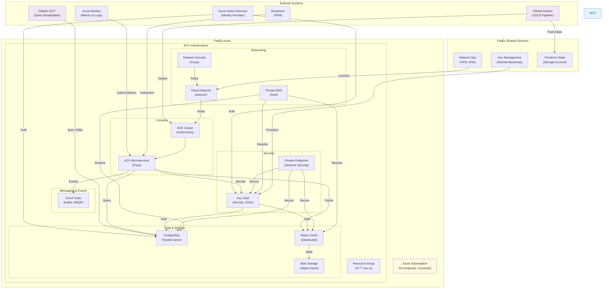
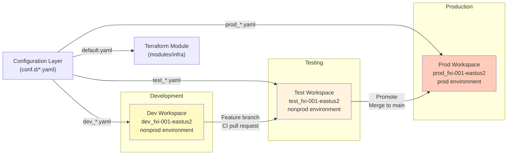
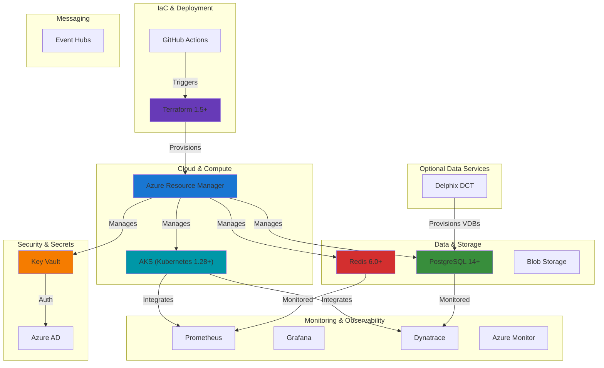
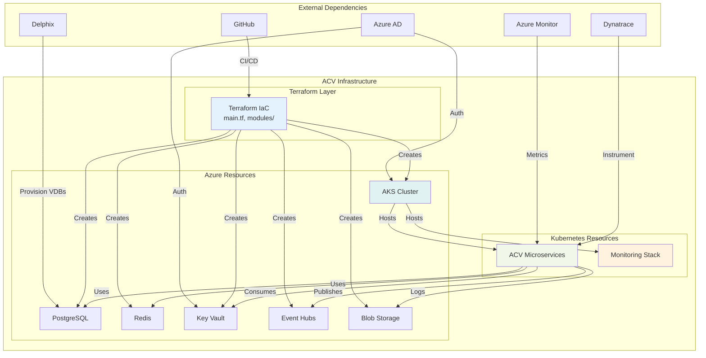

# ACV Infrastructure — High-Level Design

**Purpose:** Define infrastructure architecture, design patterns, and non-functional requirements for the ACV platform.

**Scope:** Azure cloud resources, Terraform deployment model, multi-environment strategy, security posture, monitoring architecture.

---

## 1. Business Context & Purpose

### Problem Statement

The Account Creation Validations (ACV) platform requires enterprise-grade cloud infrastructure capable of:
- Supporting multi-environment deployments (Dev, Test, Prod)
- Handling high-throughput validation workloads with sub-second latency
- Ensuring data compliance across geographic regions and data tenant boundaries
- Automating infrastructure provisioning and updates via Infrastructure as Code
- Integrating with FedEx internal identity management, networking, and security systems

### Stakeholders

| Role | Concern | Priority |
|------|---------|----------|
| **Platform Engineering** | Infrastructure reliability, automation | Critical |
| **Security Team** | Data protection, access control, compliance | Critical |
| **Operations** | Deployment speed, monitoring, incident response | High |
| **Finance** | Cost optimization, resource utilization | High |
| **Compliance** | SOC 2, PCI-DSS, GDPR adherence | Critical |
| **Development Teams** | Easy local development, fast feedback loops | Medium |

---

## 2. System Context Diagram



---

## 3. Major Architecture Components

### 3.1 Infrastructure as Code Layer

**Purpose**: Version-controlled, automated infrastructure provisioning

**Technology**: Terraform 1.5+

**Components**:
- **Root Module** (`main.tf`, `locals.tf`, `provider.tf`) — Orchestrates all infrastructure
- **infra Module** (`modules/infra/`) — Core resource provisioning
- **Configuration** (`conf.d/`) — Environment-specific YAML configurations
- **State Backend** — Azure Storage Account for tfstate files

**Responsibilities**:
- Define all Azure resources (VMs, databases, networks)
- Manage Azure AD integrations and RBAC
- Configure Kubernetes objects (namespaces, RBAC)
- Inject secrets into Kubernetes clusters

---

### 3.2 Compute & Container Orchestration

**Purpose**: Run containerized ACV microservices

**Technology**: Azure Kubernetes Service (AKS)

**Characteristics**:
- **Managed Service**: Fully managed by FedEx/Azure
- **AutoScaling**: Horizontal pod autoscaler (HPA) for workload-based scaling
- **Multi-AZ**: Availability set across multiple data centers
- **Monitoring**: Prometheus + Grafana dashboards
- **Logging**: Container logs to Azure Monitor + Dynatrace

**Namespaces**:
- `acv-dev`, `acv` — Application workloads (microservices)
- `acv-data` — Data pipeline jobs
- `acv-monitoring` — Monitoring stack (Prometheus, Grafana)
- Istio/Linkerd (if applicable) — Service mesh for inter-pod communication

---

### 3.3 Relational Data Layer

**Purpose**: Persistent relational data storage

**Technology**: Azure PostgreSQL Flexible Server

**Characteristics**:
- **Version**: PostgreSQL 14+
- **HA Model**: Zone-redundant (in prod)
- **Backup**: Automated daily, 7-day retention, PITR support
- **Performance**: Connection pooling via pgBouncer, Query Store, slow logs
- **Security**: Active Directory auth, private endpoints, encrypted at rest/transit

**Databases**:
- `acvdb` — Main application database
- Schema versioning via Flyway migrations (deployed via Helm)

**Performance Tuning**:
```
pg_qs.query_capture_mode = top        # Top queries only
work_mem = 512 MB                     # Per-operation memory
maintenance_work_mem = 1 GB           # Maintenance operations
pgbouncer.enabled = true              # Connection pooling
```

---

### 3.4 Distributed Cache Layer

**Purpose**: High-speed in-memory data caching

**Technology**: Azure Cache for Redis

**Characteristics**:
- **Capacity**: 1-5 GB (configurable by stage)
- **SKU**: Standard (nonprod), Standard/Premium (prod)
- **Maxmemory Policy**: Redis eviction (LRU, LFU)
- **TLS**: 1.2+ encrypted connections
- **Clustering**: Optional for high availability

**Integration**:
- Spring Cache abstraction (Java services)
- Distributed cache-aside pattern (check cache → hit/miss → DB)
- Session store for stateful operations
- Pub/Sub for service-to-service events

**Configuration**:
```
maxmemory_delta = 125 MB    # Dynamic memory allocation
maxmemory_reserved = 125 MB # Reserved for overhead
```

---

### 3.5 Asynchronous Messaging

**Purpose**: Event-driven communication between services

**Technology**: Azure Event Hubs

**Characteristics**:
- **Namespace**: Standard tier (auto-scale capable)
- **Hub**: `/topics/acv` with 4 partitions (parallelism)
- **Retention**: 7 days
- **Protocols**: AMQP 1.0, Kafka (port 9093)
- **Throughput Units**: Dynamically allocated

**Use Cases**:
- User validation event streams
- Audit logging (immutable event log)
- Real-time dashboards
- Data sync between services

**Partition Strategy**:
- Partition 0: High-priority validations
- Partition 1: Compliance checks
- Partition 2: Audit events
- Partition 3: Retry/Dead-letter handling

---

### 3.6 Secrets & Security Management

**Purpose**: Centralized secure storage of sensitive credentials

**Technology**: Azure Key Vault

**Characteristics**:
- **Access**: Role-based (Azure AD groups, managed identities)
- **Deletion Policy**: Soft delete (90 days retention)
- **Network**: Private endpoints only (no public IP exposure)
- **Audit**: All access logged to Azure Monitor

**Stored Secrets**:
- Database credentials (username, password, connection string)
- Redis authentication tokens
- Delphix API keys
- JWT signing keys
- TLS certificates

**Kubernetes Integration** (via akv2k8s):
- Automatic secret sync from Key Vault → Kubernetes secrets
- TTL-based refresh (configurable)
- Mounted as files in pods

---

### 3.7 Blob Storage

**Purpose**: Object storage for files, logs, backups

**Technology**: Azure Blob Storage

**Characteristics**:
- **Storage Tier**: Standard (hot) for frequent access
- **Container Structure**: Separate containers for logs, backups, artifacts
- **Redundancy**: Locally redundant (LRS) or geo-redundant (GRS)
- **Immutable Blobs**: For audit logs (append-only)

**Use Cases**:
- Application logs (sinks from Dynatrace/ELK)
- Backup artifacts (Postgres dumps, database exports)
- Static assets
- Terraform state snapshots

---

### 3.8 Database Virtualization (Optional)

**Purpose**: On-demand databases via data virtualization

**Technology**: Delphix DCT (Data Control Tower)

**Characteristics**:
- **dSources**: Template databases (source of truth)
- **Virtual Databases**: Thin-provisioned copies (low storage footprint)
- **Deployment**: Kubernetes-native or VM-based
- **Sync**: Automated refresh from production sources

**Benefits**:
- Reduced storage requirements (VDBs share storage)
- Fast provisioning (minutes vs. hours)
- Compliance data masking support

---

### 3.9 Networking & Security

**Purpose**: Secure network communication with identity-based access

**Components**:

| Component | Purpose |
|-----------|---------|
| **Virtual Network (VNet)** | Base network infrastructure in eastus2 |
| **Subnets** | Logical network partitions (AKS, data, general) |
| **Network Security Groups (NSGs)** | Firewall rules (ingress/egress) |
| **Private Endpoints** | Private IP addresses for PaaS services (no internet exposure) |
| **Private DNS Zones** | DNS resolution for internal services |
| **Service Endpoints** | Whitelisting of subnet IPs → backend services |
| **Azure Firewall** | Centralized firewall (optional, managed by Ops) |

**Multi-Network Strategy**:
- **FXI NonProd Network** — Dev/Test environments
- **FXI Prod Network** — Production environment
- **FXI Prod Services Network** — Shared services (Key Vault bootstrap)
- **FXI VirtualCage** — Bastion hosts (jump boxes)

---

## 4. Deployment & Environment Model

### 4.1 Multi-Environment Strategy



### 4.2 Stage Progression

| Stage | Environment | Purpose | Deletion Policy |
|-------|------------|---------|-----------------|
| **dev** | nonprod | Development, experimentation | Recreate daily (short-lived) |
| **test** | nonprod | Integration, regression testing | Persistent; refresh weekly |
| **prod** | prod | Production workloads | Backup-retained; never delete |

### 4.3 Configuration Precedence

```
Input (Workspace)
    ↓
app_info (parsed from workspace name)
    ↓
default.yaml (global defaults)
    ↓
{stage}_fxi-001-eastus2.yaml (environment override)
    ↓
Interpolated Values (dynamic computation)
    ↓
Terraform Variables
    ↓
Module Invocation
    ↓
Azure Resources
```

---

## 5. Design Patterns & Architecture Decisions

### Pattern 1: Multi-Provider Pattern

**Problem**: Different FedEx Azure subscriptions for nonprod/prod, plus DNS in separate subscription

**Solution**: Multiple Azure provider aliases
```hcl
provider "azurerm" { ... }                    # Primary (AKS subscription)
provider "azurerm" { alias = "fxi_pendp" }  # Private endpoints
provider "azurerm" { alias = "tnt_pendp" }  # Tenant private endpoints
provider "azurerm" { alias = "onpremdns" }  # On-premises DNS
```

**Rationale**:
- Follows FedEx network segregation policies
- Enables multi-tenant private access
- Avoids cross-subscription conflicts

### Pattern 2: YAML-Driven Configuration

**Problem**: Managing 3+ environments with different parameters (memory, replicas, etc.)

**Solution**: CloudPosse deep-merge YAML + locals for dynamic config
```hcl
inputs:
  - app_info (from workspace)
  - default.yaml
  - {stage}.yaml
→ Deep merged output
→ Terraform locals/variables
```

**Rationale**:
- No code duplication across environments
- Minimal YAML (only deltas, not full configs)
- Human-readable configuration versioning

### Pattern 3: Secrets Auto-Injection

**Problem**: Rotating secrets without pod restarts

**Solution**: akv2k8s (Azure Key Vault to Kubernetes)
```
Key Vault Secret
    ↓
akv2k8s Controller (watches Key Vault)
    ↓
Kubernetes Secret (auto-created/updated)
    ↓
Pod Mounts Secret (as env var or file)
```

**Rationale**:
- No hardcoded secrets in Kubernetes YAML
- Automatic rotation on Key Vault updates
- Single source of truth (Key Vault)

### Pattern 4: Private Endpoint Pattern

**Problem**: PaaS services (PostgreSQL, Redis, Key Vault) exposed to internet by default

**Solution**: Private endpoints + service endpoints
```
Pod (in AKS subnet)
    ↓ (private IP, no internet routing)
Private Endpoint
    ↓
Backend Service (PostgreSQL, Redis, KV)
    ↓ (not exposed to public internet)
```

**Rationale**:
- Zero external exposure (security-first)
- Private DNS resolution
- Compliant with zero-trust networking

### Pattern 5: Modular Terraform

**Problem**: Single large Terraform module = hard to test, understand, reuse

**Solution**: Reusable FedEx modules (GitHub repos)
```
GitHub Org: FedEx
├── eai-3538871-azurerm-postgres-flexible
├── eai-3538871-azurerm-redis
├── eai-3538871-azurerm-keyvault
├── eai-3538871-azurerm-eventhub
└── (20+ other modules)

This Repo
├── modules/infra/ (orchestrates modules)
└── calls → FedEx modules
```

**Rationale**:
- DRY principle (shared modules across projects)
- Standardized resource naming, tagging
- Centralized security best practices

---

## 6. Non-Functional Requirements (NFR)

### 6.1 Performance

| Requirement | Target | Measurement |
|-------------|--------|-------------|
| **Database Query Latency** | p99 < 100ms | Query Store metrics |
| **Cache Hit Ratio** | > 90% | Redis hit/miss counters |
| **API Response Time** | p95 < 500ms | Dynatrace APM |
| **Event Hub Throughput** | > 10,000 msgs/sec | Event Hubs metrics |
| **Pod Startup Time** | < 30 seconds | Kubernetes metrics |

### 6.2 Scalability

| Component | Scale Target | Method |
|-----------|--------------|--------|
| **AKS Pods** | 1000+ pods | Horizontal Pod Autoscaler (HPA) |
| **PostgreSQL Connections** | 500+ concurrent | pgBouncer connection pooling |
| **Redis Keys** | 10M+ keys | Memory sizing, eviction policies |
| **Event Hubs Partitions** | 32 partitions | Dynamic partition allocation |

### 6.3 Availability & Reliability

| Requirement | Target | Implementation |
|-------------|--------|-----------------|
| **Service Availability** | 99.95% SLA | Multi-AZ deployment, automated failover |
| **RTO (Recovery Time)** | < 5 minutes | Automated health checks + pod restart |
| **RPO (Recovery Point)** | < 1 hour | Postgres backups every 15 mins |
| **Database Failover** | Automatic | Zone-redundant setup (prod) |
| **Network Redundancy** | N+1 (dual ISPs) | FedEx network ops |

### 6.4 Security

| Requirement | Implementation |
|-------------|-----------------|
| **Encryption at Rest** | Azure Storage Service Encryption (AES-256) |
| **Encryption in Transit** | TLS 1.2+ for all connections |
| **Authentication** | Azure AD (Workload Identity) + Service Principals |
| **Authorization** | Role-Based Access Control (RBAC) |
| **Audit Logging** | All actions logged to Azure Monitor |
| **Vulnerability Scanning** | Trivy (container images), SonarQube (code) |
| **Secrets Rotation** | Automated via Key Vault policies |
| **Network Isolation** | Private endpoints, NSGs, private DNS |

### 6.5 Compliance

| Standard | Controls | Evidence |
|----------|----------|----------|
| **SOC 2** | C1-C8 (controls framework) | Audit logs, encryption, access controls |
| **PCI-DSS** | 12 domains | Network segmentation, encryption, monitoring |
| **GDPR** | Data protection, breach notification | Data masking, retention policies, export capability |
| **HIPAA** | Encryption, audit trails | If handling PHI data |

### 6.6 Observability

| Pillar | Tools | Metrics |
|--------|-------|---------|
| **Metrics** | Prometheus, Azure Monitor | CPU, Memory, Disk, Network |
| **Logs** | Dynatrace, ELK, Azure Log Analytics | Application logs, audit logs |
| **Tracing** | Dynatrace Distributed Tracing | Request flow across services |
| **Alerts** | Azure Monitor Alerts, Dynatrace | Anomaly detection, SLA breaches |

---

## 7. Technology Stack Summary



---

## 8. Integration Points & Dependencies



---

## 9. Risk & Mitigation

| Risk | Impact | Probability | Mitigation |
|------|--------|-------------|-----------|
| **State File Corruption** | Infrastructure loss | Low | Versioned state snapshots, automated backups |
| **Subnet IP Depletion** | Private endpoint failures | Low | IP capacity planning, monitor subnet usage |
| **Database Failure** | Data loss, downtime | Low | Zone-redundant setup, automated backups, PITR |
| **Kubernetes Node Failure** | Pod disruptions | Low | Multi-AZ nodes, pod disruption budgets, autoscaling |
| **Secret Rotation Failure** | Old credentials linger | Low | Key Vault RBAC policies, akv2k8s monitoring |
| **Network Connectivity Loss** | Complete outage | Very Low | FedEx network redundancy, multi-ISP |

---

## Cross-References

- [README.md](README.md) — Quick start guides and tech stack
- [LLD.md](LLD.md) — Terraform code structure and module details
- [architecture.md](architecture.md) — Deployment topology and diagrams
- [code-mapping.md](code-mapping.md) — File navigation and quick reference
- [glossary.md](glossary.md) — Terminology and acronyms
- [onboarding.md](onboarding.md) — Developer setup and workflows

---

**Last Updated:** 2026-04-02  
**Version:** 1.0.0  
**Audience:** Architects, Infrastructure Engineers, Platform Engineering, Security Engineers
