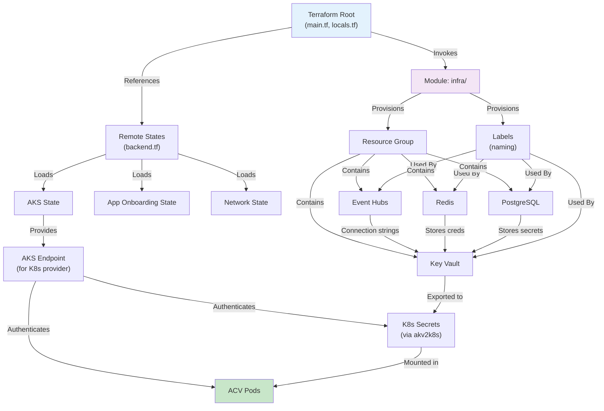

# ACV Infrastructure — Low-Level Design

**Purpose:** Document Terraform code organization, modules, variables, resource configurations, and code structure.

**Scope:** Terraform files, module hierarchy, resource definitions, configuration references, state management.

---

## 1. Code Organization & File Structure

### 1.1 Root Directory Structure

```
eai-3540813-infra/
├── backend.tf                  # Terraform state backend configuration
├── main.tf                     # Main module invocation
├── data.tf                     # Data sources (Key Vault, etc.)
├── locals.tf                   # Local values & YAML config merging
├── provider.tf                 # Azure/Kubernetes/Helm providers
├── versions.tf                 # Terraform & provider version constraints
├── README.md                   # Project overview
│
├── modules/
│   └── infra/
│       ├── backend.tf          # Not used (defined at root)
│       │
│       ├── data.tf             # Local data sources
│       ├── locals.tf           # Local values (namespaces, endpoints)
│       ├── variables.tf        # Input variables (app_name, environment, etc.)
│       ├── versions.tf         # Module provider versions
│       │
│       ├── rg.tf               # Resource group reference
│       ├── labels.tf           # Resource naming & labels (CloudPosse)
│       │
│       ├── postgres.tf         # PostgreSQL Flexible Server
│       ├── redis.tf            # Azure Cache for Redis
│       ├── kv.tf               # Key Vault setup & access policies
│       ├── secrets.tf          # Kubernetes secrets injection
│       ├── event-hub.tf        # Event Hubs namespace & hubs
│       ├── storage-account.tf  # Blob storage & containers
│       │
│       ├── delphix.tf          # Delphix DCT integration
│       ├── delphix_k8s_vdbs.tf # Kubernetes VDB deployment
│       │
│       ├── dsource-env/        # Delphix dSource configs (optional)
│       │   ├── locals.tf
│       │   └── *.tf
│       ├── vdb-env/            # VDB environment configs (optional)
│       │   └── *.tf
│       └── vdb-k8s-env/        # Kubernetes VDB configs (optional)
│           └── *.tf
│
├── conf.d/
│   ├── default.yaml            # Default app config (EAI, app_name)
│   ├── dev_fxi-001-eastus2.yaml   # Dev environment config
│   ├── test_fxi-001-eastus2.yaml  # Test environment config
│   └── prod_fxi-001-eastus2.yaml  # Prod environment config
│
├── .github/
│   └── workflows/              # GitHub Actions CI/CD
│
└── Documentation/              # This documentation
```

---

## 2. Root-Level Terraform Files

### 2.1 backend.tf — State Management

```hcl
terraform {
  backend "azurerm" {
    # Terraform state stored in Azure Storage
    key                  = "azure/apps/acv-infra/tfstate-"
    subscription_id      = "c6f20978-41df-4baf-ae17-dd5102854166"
    resource_group_name  = "neur-fxi-svc-terraform-state"
    storage_account_name = "stfedexterraformstate"
    container_name       = "terraform-state"
    snapshot             = true
  }
}

# Remote states imported from other Terraform projects
data "terraform_remote_state" "state" {
  backend = "azurerm"
  config = {
    key = "azure/fxi-production1-services/platform-az-state/content.tfstate"
    # Same storage account as above
  }
}

data "terraform_remote_state" "onboarding" {
  backend = "azurerm"
  config = {
    key = "azure/platform-aks-app-onboarding/tfstate-env:global"
    # Retrieves app onboarding details (namespaces, RBAC, resource groups)
  }
}

data "terraform_remote_state" "app" {
  backend = "azurerm"
  config = data.terraform_remote_state.onboarding.outputs.backends[
    local.stage.onboarding_state_id
  ][local.stage.cluster]
}

data "terraform_remote_state" "aks" {
  backend = "azurerm"
  # Kubernetes cluster details (API endpoint, certs, etc.)
}
```

**Key Points**:
- State stored with snapshot enabled (versioning)
- Remote states reference app onboarding (AKS, namespaces, RBAC)
- Environment detected from workspace name

---

### 2.2 main.tf — Module Invocation

```hcl
module "main" {
  source  = "./modules/infra"
  
  # Input Variables
  app_name             = local.config.app_name    # "acv"
  environment          = local.config.environment # "nonprod" or "prod"
  stage                = local.config.stage       # "dev", "test", "prod"
  
  # Remote State Outputs (from other Terraform projects)
  subscription = data.terraform_remote_state.main.outputs
  network      = data.terraform_remote_state.network.outputs
  aks          = data.terraform_remote_state.aks.outputs
  app          = data.terraform_remote_state.app.outputs.application
  
  # Managed Identity for Key Vault → Kubernetes secret sync
  akv2k8s_principal_id = data.terraform_remote_state.app.outputs.application[
    local.config.environment
  ].managed_principal_id
  
  # Multi-Provider Setup (for cross-subscription access)
  providers = {
    azurerm.onpremdns = azurerm.onpremdns  # DNS in on-prem subscription
    azurerm.tnt_pendp = azurerm.tnt_pendp  # Private endpoints in tenant
    azurerm.fxi_pendp = azurerm.fxi_pendp  # Private endpoints in FXI
  }
}
```

---

### 2.3 locals.tf — Configuration Merging

```hcl
# Parse workspace name to extract stage and cluster
# Example: "dev_fxi-001-eastus2" → stage="dev", cluster="fxi-001-eastus2"
locals {
  keys   = ["stage", "cluster"]
  values = split("_", terraform.workspace)
  app_info = length(local.values) == 2 ? zipmap(local.keys, local.values) : {}
}

# Deep merge YAML configs
data "utils_deep_merge_yaml" "stage" {
  input = [
    yamlencode(local.app_info),           # Workspace-derived info
    file("conf.d/default.yaml"),          # Global defaults
    file("conf.d/${terraform.workspace}.yaml"),  # Environment-specific
  ]
}

# Final config with interpolations (dynamic values)
data "utils_deep_merge_yaml" "config" {
  input = [
    data.utils_deep_merge_yaml.stage.output,
    # Additional computed values can be added here
  ]
}

locals {
  stage = merge(tomap({}), yamldecode(data.utils_deep_merge_yaml.stage.output))
  config = merge(tomap({}), yamldecode(data.utils_deep_merge_yaml.config.output))
}
```

**Configuration Merging Order**:
1. `app_info` — From workspace name parsing (stage, cluster)
2. `default.yaml` — Global app defaults (app_name, EAI)
3. `{workspace}.yaml` — Environment-specific overrides (environment type)
4. Interpolations — Dynamic computed values
5. Final output → Terraform variables

---

### 2.4 provider.tf — Azure & Kubernetes Providers

```hcl
# Primary Azure provider (for AKS subscription)
provider "azurerm" {
  environment     = "public"
  subscription_id = data.terraform_remote_state.aks.outputs.subscription_id
  tenant_id       = data.terraform_remote_state.main.outputs.tenant_id
  features {}
}

# Private Endpoint Provider (FXI subscription)
provider "azurerm" {
  alias           = "fxi_pendp"
  subscription_id = data.terraform_remote_state.main.outputs.pendp.fxi[
    local.config.environment
  ]
  tenant_id                  = data.terraform_remote_state.main.outputs.tenant_id
  skip_provider_registration = true
  features {}
}

# Private Endpoint Provider (Tenant subscription)
provider "azurerm" {
  alias           = "tnt_pendp"
  subscription_id = data.terraform_remote_state.main.outputs.pendp.tnt[
    local.config.environment
  ]
  tenant_id                  = data.terraform_remote_state.main.outputs.tenant_id
  features {}
}

# On-Premises DNS Provider (for DNS zone registration)
provider "azurerm" {
  alias           = "onpremdns"
  subscription_id = data.terraform_remote_state.main.outputs.onpremdns_subscription_id
  tenant_id       = data.terraform_remote_state.main.outputs.tenant_id
  features {}
}

# Kubernetes Provider (for Helm charts, namespaces)
provider "kubernetes" {
  host                   = data.terraform_remote_state.aks.outputs.kube_config.host
  client_certificate     = base64decode(
    data.terraform_remote_state.aks.outputs.kube_config.client_certificate
  )
  client_key             = base64decode(
    data.terraform_remote_state.aks.outputs.kube_config.client_key
  )
  cluster_ca_certificate = base64decode(
    data.terraform_remote_state.aks.outputs.kube_config.cluster_ca_certificate
  )
}

# Helm Provider (for Helm chart deployments)
provider "helm" {
  debug = true
  kubernetes {
    host   = data.terraform_remote_state.aks.outputs.kube_config.host
    # ... (same as Kubernetes provider)
  }
}

# Delphix Provider (for VDB management)
provider "delphix" {
  tls_insecure_skip = true
  key               = data.azurerm_key_vault_secret.delphix_dct_api_key.value
  host              = "delphix-dct-prod.tools.fxi-svc.az.fxei.fedex.com"
}
```

**Key Points**:
- 4 AzureRM providers for cross-subscription resource creation
- Kubernetes provider for workload deployment
- Helm provider for application charts
- Delphix provider for virtual database orchestration

---

### 2.5 versions.tf — Version Constraints

```hcl
terraform {
  required_version = "~> 1.5.0"  # Terraform 1.5.x only
  
  required_providers {
    azurerm = {
      source  = "hashicorp/azurerm"
      version = "~> 3"            # 3.x (current stable)
    }
    azuread = {
      source  = "hashicorp/azuread"
      version = "~> 2"
    }
    kubernetes = {
      source  = "hashicorp/kubernetes"
      version = "~> 2"
    }
    helm = {
      source  = "hashicorp/helm"
      version = "~> 2"
    }
    random = {
      source  = "hashicorp/random"
      version = "~> 3"            # For random suffixes
    }
    utils = {
      source  = "cloudposse/utils"
      version = "~> 1"            # YAML deep-merge utility
    }
    delphix = {
      source = "delphix-integrations/delphix"
      # No version constraint (latest)
    }
  }
}
```

---

## 3. Module: modules/infra/

### 3.1 variables.tf — Input Variables

```hcl
variable "app_name" {
  description = "Application name"
  type        = string
  default     = "acv"
}

variable "environment" {
  description = "Environment type: nonprod or prod"
  type        = string
  default     = "nonprod"
  validation {
    condition     = contains(["nonprod", "prod"], var.environment)
    error_message = "Environment must be nonprod or prod."
  }
}

variable "stage" {
  description = "Stage within environment: dev, test, prod"
  type        = string
  default     = "dev"
}

variable "location" {
  description = "Azure region"
  type        = string
  default     = "eastus2"
}

variable "subscription" {
  description = "Subscription details from remote state"
  type        = any
}

variable "network" {
  description = "Network infrastructure from remote state"
  type        = any
}

variable "aks" {
  description = "AKS cluster details"
  type        = any
}

variable "app" {
  description = "App onboarding details (namespaces, RBAC)"
  type        = any
}

variable "eai" {
  description = "Enterprise App ID for tagging"
  type        = string
  default     = "3540813"
}

variable "akv2k8s_principal_id" {
  description = "Managed identity for akv2k8s (Key Vault → K8s secrets)"
  type        = string
}
```

---

### 3.2 locals.tf — Local Configuration

```hcl
locals {
  tenant_id     = var.subscription.tenant_id
  subscription  = var.subscription[local.app.subscription_name]
  app           = var.app[var.environment]
  aks           = var.aks
  ns            = local.app.namespaces[var.stage]      # K8s namespace
  monitoring_ns = local.app.monitoring_namespace
  
  # Kubernetes namespace mapping
  kubernetes_application_namespace = {
    "nonprod" = "acv-dev"
    "prod"    = "acv"
  }
  
  kubernetes_data_namespace = {
    "nonprod" = "acv-data"
    "prod"    = "acv-data"
  }
  
  # Private endpoints configuration
  private_endpoints = {
    on_prem_access_enabled = true
    fxi = {
      nonprod = {
        subnet_id           = var.network["fxi_nonproduction1"].vnets["eastus2"].main.subnets["general"].id
        resource_group_name = "eastus2-fxi-nonprod-network-rg-pendps"
      }
      prod = {
        subnet_id           = var.network["fxi_production1"].vnets["eastus2"].main.subnets["general"].id
        resource_group_name = "eastus2-fxi-prod-network-rg-pendps"
      }
    }
  }
  
  # Subnet whitelist: subnets that have direct access via service endpoints
  subnet_whitelist = concat(
    [for k, v in local.aks.subnets : v.id],
    [var.network["fxi_production1_services"].vnets["northeurope"].main.subnets["aks-tools"].id],
    [var.network["fxi_virtualcage1"].vnets["northeurope"].bastion.subnets["main"].id],
  )
}
```

---

### 3.3 postgres.tf — PostgreSQL Database

```hcl
locals {
  # PostgreSQL parameters (tuned for workload)
  default_pg_parameters = {
    "pg_qs.query_capture_mode"      = "top"
    "work_mem"                      = "524288"        # 512 MB
    "maintenance_work_mem"          = "1048576"       # 1 GB
    "azure.extensions"              = "pgcrypto,pg_stat_statements,pg_buffercache,uuid-ossp,hypopg,fuzzystrmatch,pg_trgm"
    "pgbouncer.enabled"             = "true"          # Connection pooling
    "default_transaction_read_only" = "off"
    "metrics.pgbouncer_diagnostics" = "on"
  }
  
  # Database servers to provision
  postgres_dbservers = {
    "1" = {
      server_config = {
        sql_version = "15"
        zone        = "3"  # Zone 3 for HA
      }
      databases = {
        acv-db = {}
      }
    }
  }
  
  # Developer access levels (nonprod: full CRUD, prod: SELECT only)
  developer_access = {
    prod = { table = ["SELECT"] }
    nonprod = {
      table    = ["SELECT", "INSERT", "UPDATE", "DELETE", "TRUNCATE"]
      sequence = ["USAGE", "SELECT"]
      function = ["EXECUTE"]
    }
  }
}

# PostgreSQL Flexible Server module
module "postgres_flexible_dbserver" {
  for_each = contains(["prod", "test"], var.stage) ? local.postgres_dbservers : {}
  
  source              = "github.com/FedEx/eai-3538871-azurerm-postgres-flexible.git?ref=v4"
  name                = module.labels.name
  location            = data.azurerm_resource_group.this.location
  resource_group_name = data.azurerm_resource_group.this.name
  server_config       = each.value.server_config
  databases           = each.value.databases
  
  # Active Directory auth for pod identity
  ad_config = {
    enabled        = true
    administrators = [
      data.azuread_service_principal.github_actions_runner.object_id,
      data.azuread_group.platform_admin.object_id,
    ]
    users = {
      (data.azuread_group.this.object_id) = local.developer_access[var.environment]
    }
  }
  
  # PostgreSQL server parameters
  pg_parameters = local.default_pg_parameters
  
  # Monitoring via Prometheus
  monitoring_config = {
    enabled       = true
    namespace     = local.monitoring_ns
    psp_enabled   = false
    database      = "postgres"
    chart_version = "5.2.0"
  }
  
  # Network configuration (private subnet, private DNS)
  network_config = {
    delegated_subnet_id = var.network["fxi_nonproduction1"].vnets["eastus2"].main.subnets["postgres"].id
    private_dns_zone_id = var.network["fxi_production1_services"].prvlink_dns["northeurope"].private_dns_zones["postgre_sql"].id
  }
  
  # Multi-provider setup for private endpoints & DNS
  providers = {
    azurerm.zone_1 = azurerm.onpremdns    # On-prem DNS
    azurerm.zone_2 = azurerm.fxi_pendp    # FXI private endpoints
    azurerm.zone_3 = azurerm.fxi_pendp    # FXI private endpoints
  }
}
```

**Key Configuration**:
- PostgreSQL 15+ with pgBouncer connection pooling
- Active Directory authentication (Workload Identity)
- Private subnet + private DNS zones
- Zone-redundant for production HA
- Query Store + pg_stat_statements for monitoring

---

### 3.4 redis.tf — Redis Cache

```hcl
locals {
  # Redis capacity by stage
  redis_server_config = {
    dev = {
      capacity           = 1          # 1 GB
      sku_family         = "C"        # Standard
      sku_name           = "Standard"
      maxmemory_delta    = 125        # 125 MB
      maxmemory_reserved = 125        # 125 MB
    }
  }
}

module "redis_cache" {
  source              = "github.com/FedEx/eai-3538871-azurerm-redis.git?ref=v5"
  name                = module.labels.name
  location            = data.azurerm_resource_group.this.location
  resource_group_name = data.azurerm_resource_group.this.name
  
  # SKU configuration
  redis_version = 6
  capacity      = try(local.redis_server_config[var.stage].capacity, 1)
  sku_family    = try(local.redis_server_config[var.stage].sku_family, "C")
  sku_name      = try(local.redis_server_config[var.stage].sku_name, "Standard")
  
  # Memory management
  maxmemory_delta     = try(local.redis_server_config[var.stage].maxmemory_delta, 100)
  maxmemory_reserved  = try(local.redis_server_config[var.stage].maxmemory_reserved, 100)
  minimum_tls_version = "1.2"         # TLS encryption
  
  # Monitoring
  monitoring_config = {
    enabled     = true
    namespace   = local.monitoring_ns
    psp_enabled = false
  }
  
  # Network setup (private endpoints only)
  public_network_access_enabled = false
  private_endpoints             = local.private_endpoints
  
  # Multi-provider for cross-subscription private endpoints
  providers = {
    azurerm.fxi_pendp = azurerm.fxi_pendp
    azurerm.tnt_pendp = azurerm.tnt_pendp
    azurerm.onpremdns = azurerm.onpremdns
  }
}

# Outputs for application use
output "redis_host" {
  value = module.redis_cache.redis_host
}

output "redis_port" {
  value = module.redis_cache.ssl_port
}

output "redis_password" {
  value     = module.redis_cache.primary_access_key
  sensitive = true
}
```

**Key Configuration**:
- Redis 6.0+ with Standard SKU (can upgrade to Premium for HA)
- Maxmemory policies for eviction (LRU, LFU)
- TLS 1.2+ encryption
- Private endpoints (no public IP)
- Cross-subscription private endpoint support

---

### 3.5 kv.tf — Azure Key Vault

```hcl
locals {
  # Access policies by role
  keyvault_access = {
    dev = {
      object_id            = data.azuread_group.this.object_id
      secret_permissions   = ["Get", "Set", "Delete", "List"]
    }
    admins = {
      object_id            = [for k in data.azuread_group.admin_groups : k.object_id]
      secret_permissions   = ["Get", "Set", "Delete", "List"]
    }
    akv2k8s = {
      # akv2k8s agent (Kubernetes secret injection)
      object_id            = local.app.managed_principal_id
      secret_permissions   = ["Get"]  # Read-only
    }
    tfe_sp = {
      # Terraform Enterprise service principal
      object_id            = [for k in local.terraform_sp : k]
      secret_permissions   = ["Get", "Set", "Delete"]
    }
    gha = {
      # GitHub Actions runner
      object_id            = data.azuread_service_principal.github_actions_runner.object_id
      secret_permissions   = ["Get", "List", "Set", "Delete", "Purge", "Recover"]
    }
  }
  
  # Merge into flat permissions map
  object_permissions = merge(flatten([
    for k, v in local.keyvault_access :
    {
      for id in flatten(tolist([v.object_id])) :
      format("%s_%s", k, id) => {
        object_id          = id
        secret_permissions = v.secret_permissions
      }
    }
  ])...)
}

module "keyvault" {
  source              = "github.com/FedEx/eai-3538871-azurerm-keyvault?ref=v4"
  name                = module.labels.name
  location            = data.azurerm_resource_group.this.location
  resource_group_name = data.azurerm_resource_group.this.name
  tenant_id           = local.tenant_id
  
  object_permissions = local.object_permissions
  
  # Security settings
  soft_delete_retention_days       = 90
  public_network_access_enabled    = false  # Private endpoints only
  enabled_for_deployment           = false
  enabled_for_disk_encryption      = false
  enabled_for_template_encryption  = false
}

# Private endpoint for Key Vault
module "private_endpoint_keyvault" {
  source               = "github.com/FedEx/eai-3538871-azurerm-private-endpoint.git?ref=v4"
  name                 = module.keyvault.name
  resource_group_name  = local.private_endpoints.fxi[var.environment].resource_group_name
  location             = data.azurerm_resource_group.this.location
  
  # Private endpoint redirects traffic to Key Vault
  # ...additional config...
}

output "keyvault_id" {
  value = module.keyvault.id
}

output "keyvault_uri" {
  value = module.keyvault.vault_uri
}
```

**Key Configuration**:
- RBAC-based access policies (groups, managed identities, service principals)
- Soft-delete retention (90 days)
- Private endpoints (secured by NSGs)
- Secrets stored: DB credentials, API keys, certificates

---

### 3.6 event-hub.tf — Azure Event Hubs

```hcl
locals {
  # Default Event Hub configuration
  default_eventhub_config = {
    partition_count   = 4        # 4 partitions for parallelism
    message_retention = 7        # 7-day retention
    listen            = true     # Enable listening
  }
  
  # Event Hubs namespaces & hubs
  eventhubs_namespaces = {
    "1" = {
      hubs = {
        "acv" = local.default_eventhub_config
      }
    }
  }
}

module "eventhub" {
  for_each                    = local.eventhubs_namespaces
  source                      = "github.com/FedEx/eai-3538871-azurerm-eventhub.git?ref=v3"
  
  id                          = each.key
  name                        = module.labels.name
  resource_group_name         = data.azurerm_resource_group.this.name
  location                    = data.azurerm_resource_group.this.location
  hubs                        = { for hub, config in each.value.hubs : hub => config }
  ns_sku                      = "Standard"
  public_network_access_enabled = false
  
  # Private endpoints for secure access
  private_endpoints = local.private_endpoints
  
  # Multi-provider setup
  providers = {
    azurerm.onpremdns = azurerm.onpremdns
    azurerm.fxi_pendp = azurerm.fxi_pendp
  }
}

output "eventhub_namespace" {
  value = module.eventhub["1"].name
}

output "eventhub_primary_connection_string" {
  value     = module.eventhub["1"].primary_connection_string
  sensitive = true
}
```

**Key Configuration**:
- Standard tier Event Hubs namespace (auto-scale to Premium)
- 4-partition hub for parallelism
- 7-day message retention
- Private endpoints (Kafka port 9093, AMQP port 5671)

---

### 3.7 secrets.tf — Kubernetes Secrets Injection

```hcl
locals {
  # Database credentials
  k8s_secrets = {
    db = merge(flatten([[
      for k, v in module.postgres_flexible_dbserver :
      {
        for db in keys(v.databases) :
        format("override-%s-db-secret", replace(db, "_", "-")) => {
          value = {
            metadata = {
              namespace = local.ns
            }
            data = {
              POSTGRES_HOST           = v.server.fqdn
              POSTGRES_USER           = v.credentials.username
              POSTGRES_PASS           = v.credentials.password
              POSTGRES_DB             = db
              POSTGRES_PORT           = v.server.port
            }
          }
        }
      }
    ]])...)
    
    # Redis credentials
    redis = {
      override-redis-secret = {
        value = {
          metadata = {
            namespace = local.ns
          }
          data = {
            REDIS_HOST = module.redis_cache.redis_host
            REDIS_PORT = module.redis_cache.ssl_port
            REDIS_PASS = module.redis_cache.primary_access_key
            REDIS_SSL  = true
          }
        }
      }
    }
    
    # Event Hub credentials
    eventhub = merge(flatten([
      {
        for k, v in module.eventhub :
        format("override-eventhub-secret-%s", replace(lower(v.name), "_", "-")) => {
          value = {
            metadata = {
              namespace = local.ns
            }
            data = {
              EVENTHUB_NAMESPACE                   = v.name
              EVENTHUB_PRIMARY_CONNECTION_STRING   = v.primary_connection_string
              EVENTHUB_SECONDARY_CONNECTION_STRING = v.secondary_connection_string
              EVENTHUB_BOOTSTRAP_SERVER            = format("%s.servicebus.windows.net:9093", v.name)
            }
          }
        }
      }
    ])...)
  }
}

# Create Kubernetes secrets resource
resource "kubernetes_secret" "database_credentials" {
  for_each = local.k8s_secrets.db
  
  metadata {
    name      = each.key
    namespace = each.value.value.metadata.namespace
  }
  
  data = each.value.value.data
}

resource "kubernetes_secret" "redis_credentials" {
  for_each = local.k8s_secrets.redis
  
  metadata {
    name      = each.key
    namespace = each.value.value.metadata.namespace
  }
  
  data = each.value.value.data
}

# akv2k8s annotations for automatic Key Vault sync
# (secrets are auto-injected into pods)
```

**Key Configuration**:
- Database connection strings injected as K8s secrets
- Redis credentials for cache layer
- Event Hub connection strings for messaging
- akv2k8s controller syncs these from Key Vault automatically

---

## 4. Configuration Files (conf.d/)

### 4.1 default.yaml

```yaml
---
app_name: acv
eai: "3540813"
onboarding_state_id: eai-3540813_acv
```

**Purpose**: Global application defaults shared across all environments

---

### 4.2 dev_fxi-001-eastus2.yaml

```yaml
---
environment: nonprod
```

**Purpose**: Development environment configuration (inherits app_name & EAI from default)

---

### 4.3 test_fxi-001-eastus2.yaml

```yaml
---
environment: nonprod
```

**Purpose**: Test environment configuration

---

### 4.4 prod_fxi-001-eastus2.yaml

```yaml
---
environment: prod
```

**Purpose**: Production environment configuration

---

## 5. Core Classes & Resource Definitions

### Data Sources (data.tf)

```hcl
# Delphix API key from Key Vault (for VDB provisioning)
data "azurerm_key_vault_secret" "delphix_dct_api_key" {
  provider     = azurerm.fxi_prod_svc
  name         = "delphix-dct-api-key"
  key_vault_id = data.azurerm_key_vault.svc_bootstrap.id
}

# Azure AD groups for access control
data "azuread_group" "this" {
  display_name = local.app.ad_group
}

data "azuread_group" "admin_groups" {
  for_each      = toset(local.app.admin_groups)
  display_name  = each.value
}

# GitHub Actions runner service principal
data "azuread_service_principal" "github_actions_runner" {
  display_name = "github-actions-runner"
}
```

---

### Labels & Naming (labels.tf)

```hcl
module "labels" {
  source = "cloudposse/labels/null"
  
  namespace = var.eai
  name      = var.app_name
  stage     = var.stage
  
  additional_tag_map = {
    environment = var.environment
    managed_by  = "terraform"
    contact     = "platform-eng"
  }
}

output "resource_group_name" {
  value = "eastus2-${module.labels.id}-rg"
}

output "resource_name" {
  value = module.labels.id  # Unique identifier for resources
}
```

---

## 6. Dependency Graph



---

## 7. State File Structure

```hcl
# Terraform state contains outputs accessible by other modules

terraform_output "database_host" {
  value = module.postgres_flexible_dbserver["1"].server.fqdn
}

terraform_output "database_port" {
  value = module.postgres_flexible_dbserver["1"].server.port
}

terraform_output "redis_host" {
  value = module.redis_cache.redis_host
}

terraform_output "eventhub_namespace" {
  value = module.eventhub["1"].name
}

terraform_output "keyvault_id" {
  value = module.keyvault.id
}
```

---

## Cross-References

- [README.md](README.md) — Quick start and tech stack
- [HLD.md](HLD.md) — Architecture and design patterns
- [architecture.md](architecture.md) — Deployment topology
- [code-mapping.md](code-mapping.md) — File navigation
- [glossary.md](glossary.md) — Terminology
- [onboarding.md](onboarding.md) — Developer setup

---

**Last Updated:** 2026-04-02  
**Version:** 1.0.0  
**Audience:** Infrastructure Engineers, Terraform Developers, DevOps, Cloud Architects
