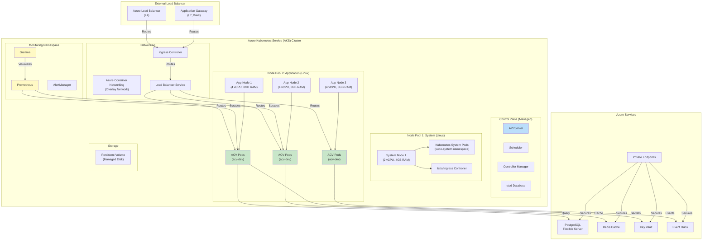
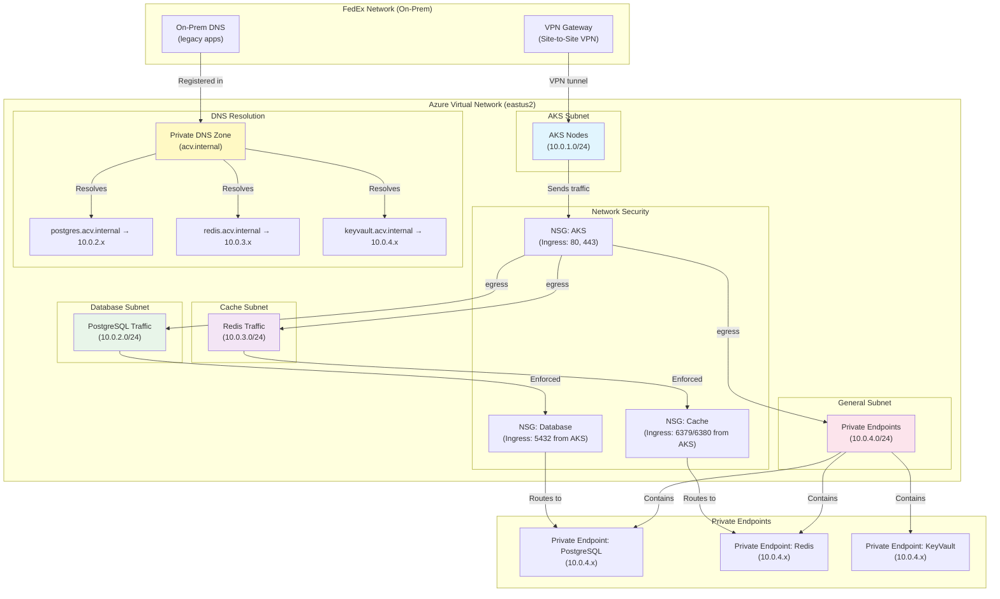
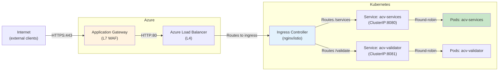
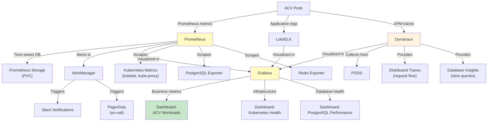
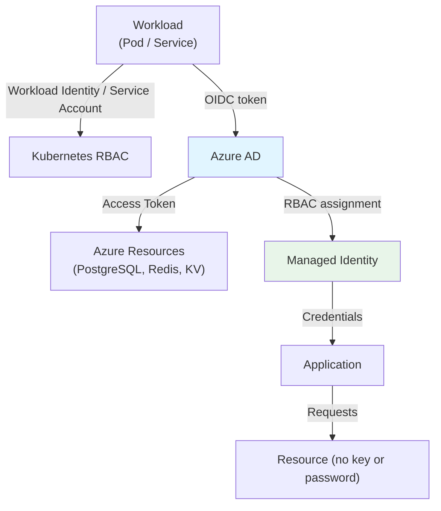

# ACV Infrastructure — Architecture & Deployment

**Purpose:** Define deployment topology, infrastructure diagrams, and scaling architecture.

**Scope:** Kubernetes deployment model, resource topology, scaling strategies, networking architecture, monitoring stack.

---

## 1. Deployment Topology

### 1.1 AKS Cluster Architecture



---

### 1.2 Virtual Network Architecture



---

## 2. Kubernetes Resource Layout

### 2.1 Namespace Organization

```
AKS Cluster (eastus2-fxi-dev-acv)
├── kube-system/                 # Kubernetes system components
│   ├── kube-proxy
│   ├── azure-cni
│   ├── tunnelfront
│   ├── coredns
│   └── metrics-server
│
├── kube-public/                 # Public configuration
│   └── cluster-info
│
├── acv-dev/ (Application)       # ACV microservices
│   ├── acv-services
│   ├── acv-validation-engine
│   ├── acv-document-service
│   ├── acv-scheduler-service
│   ├── acv-api-connector-service
│   ├── acv-database-service
│   ├── acv-data-services
│   ├── acv-config-server
│   └── (7+ microservice pods)
│
├── acv-data/ (Data Pipelines)   # Data processing jobs
│   ├── batch-processors
│   ├── scheduled-jobs
│   └── data-sync-jobs
│
├── acv-monitoring/ (Observability) # Monitoring stack
│   ├── prometheus-server
│   ├── prometheus-operator
│   ├── grafana
│   ├── alertmanager
│   ├── metric-collection
│   └── log-aggregation
│
├── istiod/ (Service Mesh)       # Istio control plane
│   ├── istiod
│   └── istio-ingressgateway
│
└── ingress-nginx/ (Ingress)     # Ingress controller
    └── ingress-nginx-controller
```

---

### 2.2 Pod Deployment Patterns

#### Pattern 1: Microservice Pod

```yaml
apiVersion: apps/v1
kind: Deployment
metadata:
  name: acv-services
  namespace: acv-dev
  labels:
    app: acv-services
    version: v1
spec:
  replicas: 3                     # High availability
  selector:
    matchLabels:
      app: acv-services
  template:
    metadata:
      labels:
        app: acv-services
    spec:
      serviceAccountName: acv-services
      containers:
      - name: acv-services
        image: acr.azurecr.io/acv/services:1.1.4
        ports:
        - name: http
          containerPort: 8080
        - name: management
          containerPort: 8081
        
        # Resources (request = guaranteed, limit = max)
        resources:
          requests:
            memory: "1Gi"
            cpu: "500m"
          limits:
            memory: "2Gi"
            cpu: "1000m"
        
        # Startup probe (is service ready to receive traffic?)
        startupProbe:
          httpGet:
            path: /actuator/health/startup
            port: 8081
          initialDelaySeconds: 10
          failureThreshold: 30
          periodSeconds: 10
        
        # Readiness probe (can this pod handle requests?)
        readinessProbe:
          httpGet:
            path: /actuator/health/readiness
            port: 8081
          initialDelaySeconds: 5
          periodSeconds: 10
        
        # Liveness probe (is pod still alive?)
        livenessProbe:
          httpGet:
            path: /actuator/health
            port: 8081
          initialDelaySeconds: 15
          periodSeconds: 30
        
        # Environment variables from secrets
        env:
        - name: POSTGRES_HOST
          valueFrom:
            secretKeyRef:
              name: override-acv-db-secret
              key: POSTGRES_HOST
        - name: REDIS_HOST
          valueFrom:
            secretKeyRef:
              name: override-redis-secret
              key: REDIS_HOST
        - name: SPRING_CLOUD_CONFIG_ENABLED
          value: "true"
        - name: SPRING_PROFILES_ACTIVE
          value: "kubernetes"
      
      # Pod disruption budget (HA during rolling updates)
      affinity:
        podAntiAffinity:
          preferredDuringSchedulingIgnoredDuringExecution:
          - weight: 100
            podAffinityTerm:
              labelSelector:
                matchExpressions:
                - key: app
                  operator: In
                  values:
                  - acv-services
              topologyKey: kubernetes.io/hostname
```

---

## 3. Storage Architecture

### 3.1 Persistent Volumes

| StorageClass | Type | Use Case | Capacity |
|--------------|------|----------|----------|
| **managed-premium** | Premium SSD | Database backups | 100GB |
| **managed-standard** | Standard HDD | Logs, archives | 500GB |
| **managed-csi** | CSI Volumes | Dynamic provisioning | Variable |

### 3.2 Backup & Recovery

```
Daily Backup Flow:
┌─────────────────────────────────────────────────────────┐
│ Database (PostgreSQL)                                    │
│ ├─ Primary Replica (Zone 1)                              │
│ └─ Secondary Replica (Zone 2) [automatic failover]       │
└────────┬──────────────────────────────────────┬──────────┘
         │ Automated daily backups                │
         ▼                                         ▼
    [Backup Vault]                          [Blob Storage]
    ├─ 7-day retention                      ├─ 30-day retention
    ├─ Incremental backup                   ├─ Full backups
    └─ PITR support (1 hour)                └─ Archive tier
```

---

## 4. Scaling Strategy

### 4.1 Horizontal Pod Autoscaling (HPA)

```
ACV Services HPA Configuration:
┌──────────────────────────────────────────────────────────┐
│ CPU-based Scaling                                        │
│ ├─ Min replicas: 2                                       │
│ ├─ Max replicas: 10                                      │
│ ├─ Target CPU utilization: 70%                           │
│ └─ Scale-up cooldown: 3 minutes                          │
│                                                           │
│ Custom Metrics Scaling                                   │
│ ├─ Request queue depth (from Event Hubs)                │
│ ├─ Cache miss ratio (from Redis)                        │
│ ├─ Database connection pool utilization                 │
│ └─ Custom app metrics (latency p95, errors)            │
└──────────────────────────────────────────────────────────┘

Example Metrics:
- acv-services:    2-10 replicas based on CPU/memory
- acv-validation:  1-5 replicas (less demand)
- acv-scheduler:   1-3 replicas (scheduled jobs)
- validators:      3-15 replicas (high throughput)
```

### 4.2 Vertical Pod Autoscaling (VPA)

```
VPA Configuration:
{
  "mode": "recommendation",        # Or "auto" for automatic adjustment
  "updatePolicy": {
    "updateMode": "off"            # Manual review before scaling
  },
  "resourcePolicy": {
    "containerPolicies": [
      {
        "containerName": "acv-services",
        "minAllowed": {
          "cpu": "100m",
          "memory": "256Mi"
        },
        "maxAllowed": {
          "cpu": "2",
          "memory": "4Gi"
        }
      }
    ]
  }
}
```

---

## 5. Networking & Load Balancing

### 5.1 Ingress Architecture



### 5.2 Service Mesh (Istio)

```yaml
# Virtual Service for canary deployment
apiVersion: networking.istio.io/v1beta1
kind: VirtualService
metadata:
  name: acv-services
  namespace: acv-dev
spec:
  hosts:
  - acv-services
  http:
  - match:
    - headers:
        user:
          exact: "test-user"
    route:
    - destination:
        host: acv-services
        subset: v2
      weight: 10
    - destination:
        host: acv-services
        subset: v1
      weight: 90
```

---

## 6. Monitoring & Observability Stack



---

## 7. High Availability & Disaster Recovery

### 7.1 HA Architecture

```
AKS Cluster: Multi-AZ Deployment
├─ Availability Zone 1
│  ├─ Node 1 (app pod replicas)
│  ├─ PostgreSQL Primary Replica
│  └─ etcd node
├─ Availability Zone 2
│  ├─ Node 2 (app pod replicas)
│  ├─ PostgreSQL Secondary Replica (auto-failover)
│  └─ etcd node
└─ Availability Zone 3
   ├─ Node 3 (app pod replicas)
   └─ etcd node

Pod Disruption Budget (PDB):
- Min available: 2/3 pods per deployment
- Allows rolling updates without service disruption
```

### 7.2 Disaster Recovery Plan

| Scenario | RTO | RPO | Recovery Method |
|----------|-----|-----|-----------------|
| **Pod Crash** | 1 min | N/A | Auto-restart (health probes) |
| **Node Failure** | 5 min | N/A | Pod eviction → reschedule |
| **AZ Outage** | 15 min | 1 hour | Failover to other AZs |
| **PostgreSQL Failure** | 10 min | <5 min | Zone-redundant failover |
| **Redis Failure** | 2 min | Ephemeral | Rebuild cache from DB |
| **Cluster Disaster** | 1 hour | 1 hour | Restore from backup state |

---

## 8. Security Architecture

### 8.1 Network Security Layers

```
Internet
  ↓ [HTTPS/TLS 1.2+]
Azure Load Balancer / Application Gateway
  ↓ [NSG rules]
Kubernetes Ingress Controller
  ↓ [Network Policy]
Service-to-Service Communication
  ↓ [Pod Network Policies]
Pod Containers
  ↓ [mTLS from Istio]
PaaS Services (PostgreSQL, Redis, Key Vault)
  ↓ [Private Endpoints, Private DNS]
No Internet Exposure
```

### 8.2 Identity & Access Control



---

## 9. Cost Optimization

### 9.1 Reserved Instances

```
AKS Node Pool: 3x Standard_D4s_v3 nodes
├─ On-demand: $0.60/hour × 3 × 730 hours/month = ~$1,314/month
├─ 1-year Reserved: 56% discount = ~$579/month
└─ 3-year Reserved: 70% discount = ~$394/month
```

### 9.2 Auto-scaling Savings

```
Manual (fixed 5 nodes): Always running
├─ Dev: 5 nodes × $0.60/hr × 730h = $2,190/month
├─ Test: 5 nodes × $0.60/hr × 730h = $2,190/month
└─ Total: $4,380/month

With HPA (2-10 range):
├─ Dev: Avg 3 nodes × $0.60/hr × 730h = $1,314/month
├─ Test: Avg 4 nodes × $0.60/hr × 730h = $1,752/month
└─ Total: $3,066/month
└─ Savings: ~$1,314/month (30%)
```

---

## 10. Terraform Deployment Model

### 10.1 Workspace-to-Azure Mapping

```
Terraform Workspace          Environment      Azure Resources
─────────────────────────────────────────────────────────────
dev_fxi-001-eastus2    →   nonprod      →   eastus2-fxi-dev-acv-rg
test_fxi-001-eastus2   →   nonprod      →   eastus2-fxi-test-acv-rg
prod_fxi-001-eastus2   →   prod         →   eastus2-fxi-prod-acv-rg

Each workspace has isolated state file in Azure Storage
```

### 10.2 Apply Sequence

```
1. terraform init
   ├─ Download providers
   └─ Initialize backend

2. terraform plan
   ├─ Validate configuration
   ├─ Check remote states (AKS, network, app)
   ├─ Generate execution plan
   └─ Display changes

3. terraform apply
   ├─ Create Resource Group
   ├─ Create PostgreSQL
   │  ├─ Create private endpoint
   │  └─ Configure backups
   ├─ Create Redis
   │  └─ Create private endpoint
   ├─ Create Key Vault
   │  ├─ Create private endpoint
   │  └─ Create access policies
   ├─ Create Event Hubs
   ├─ Create Kubernetes secrets
   └─ Create outputs
```

---

## Cross-References

- [README.md](README.md) — Quick start and tech stack
- [HLD.md](HLD.md) — High-level design patterns
- [LLD.md](LLD.md) — Terraform code structure
- [code-mapping.md](code-mapping.md) — File navigation
- [glossary.md](glossary.md) — Terminology
- [onboarding.md](onboarding.md) — Developer setup

---

**Last Updated:** 2026-04-02  
**Version:** 1.0.0  
**Audience:** DevOps Engineers, Infrastructure Architects, Platform Engineering, Operations
