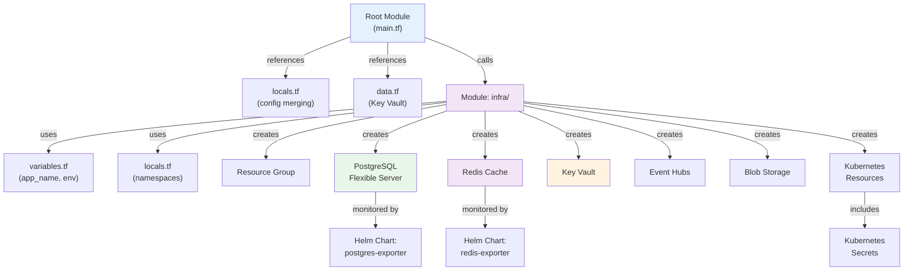
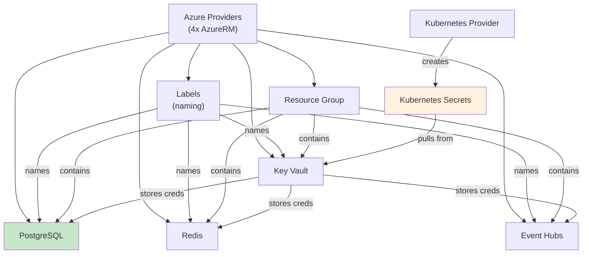

# ACV Infrastructure — Code Mapping & Navigation

**Purpose:** Enable quick file navigation and provide codebase structure reference.

**Scope:** File-to-responsibility mapping, directory structure, quick reference guides.

---

## 1. Complete File Inventory

### 1.1 Root-Level Terraform Files

| File | Lines | Purpose | Key Variables |
|------|-------|---------|----------------|
| `backend.tf` | ~50 | State backend config (Azure Storage) | subscription_id, storage_account_name |
| `main.tf` | ~20 | Module invocation | app_name, environment, stage |
| `data.tf` | ~10 | Data sources (Key Vault, etc.) | delphix_dct_api_key, Azure AD groups |
| `locals.tf` | ~45 | YAML config merging, local values | config, stage, app_info |
| `provider.tf` | ~100 | Azure/Kubernetes providers (4x AzureRM) | subscription_id, tenant_id |
| `versions.tf` | ~25 | Version constraints | required_version, required_providers |

---

### 1.2 Module: modules/infra/

| File | Lines | Responsibility | Resources Created |
|------|-------|-----------------|-------------------|
| `variables.tf` | ~60 | Input variables | app_name, environment, stage, location |
| `locals.tf` | ~80 | Local configuration | namespaces, private_endpoints, subnet_whitelist |
| `data.tf` | ~30 | Data sources | RG reference, Azure AD groups, service principals |
| `versions.tf` | ~25 | Provider versions | azurerm, azuread, kubernetes, helm |
| `labels.tf` | ~20 | CloudPosse labels | Resource naming, tagging |
| `rg.tf` | ~5 | Resource group | Reference to existing RG |
| `postgres.tf` | ~150 | PostgreSQL Flexible Server | DB server, databases, backups, monitoring |
| `redis.tf` | ~80 | Redis Cache | Redis instance, memory policies, monitoring |
| `kv.tf` | ~150 | Key Vault | Vault, access policies, private endpoint |
| `secrets.tf` | ~100 | K8s Secrets | Database creds, Redis creds, Event Hub creds |
| `event-hub.tf` | ~50 | Event Hubs | Namespace, hubs, partitions, retention |
| `storage-account.tf` | ~80 | Blob Storage | Storage account, containers, SAS tokens |
| `delphix.tf` | ~100 | Delphix DCT | dSource configs, VDB provisioning |
| `delphix_k8s_vdbs.tf` | ~80 | Kubernetes VDBs | Pod deployments for virtual databases |

---

### 1.3 Configuration Files (conf.d/)

| File | Purpose | Environment |
|------|---------|-------------|
| `default.yaml` | Global defaults (app_name, EAI, onboarding) | All |
| `dev_fxi-001-eastus2.yaml` | Dev environment config | nonprod |
| `test_fxi-001-eastus2.yaml` | Test environment config | nonprod |
| `prod_fxi-001-eastus2.yaml` | Prod environment config | prod |

---

## 2. Directory Structure & Navigation

```
eai-3540813-infra/
│
├── ROOT LAYER (Terraform Configuration)
│   ├── backend.tf              → State storage in Azure
│   ├── main.tf                 → Invokes modules/infra
│   ├── data.tf                 → Loads secrets from Key Vault
│   ├── locals.tf               → Configures YAML merging
│   ├── provider.tf             → Configures 4 Azure providers
│   └── versions.tf             → Pins Terraform/provider versions
│
├── INFRASTRUCTURE MODULE
│   └── modules/infra/
│       ├── CORE CONFIGURATION
│       │   ├── variables.tf    → Input parameters
│       │   ├── locals.tf       → Internal variables
│       │   ├── versions.tf     → Module provider versions
│       │   └── data.tf         → Local data sources
│       │
│       ├── RESOURCE LAYER
│       │   ├── rg.tf           → Resource group reference
│       │   ├── labels.tf       → Resource naming
│       │   ├── postgres.tf     → Database server
│       │   ├── redis.tf        → Cache layer
│       │   ├── kv.tf           → Secrets vault
│       │   ├── secrets.tf      → Kubernetes secret injection
│       │   ├── event-hub.tf    → Message streaming
│       │   └── storage-account.tf → Object storage
│       │
│       ├── DATA VIRTUALIZATION (Optional)
│       │   ├── delphix.tf      → DCT integration
│       │   └── delphix_k8s_vdbs.tf → VDB pods
│       │
│       ├── DELPHIX ENVIRONMENTS (Optional)
│       │   ├── dsource-env/    → dSource configs
│       │   ├── vdb-env/        → VDB configs
│       │   └── vdb-k8s-env/    → Kubernetes VDB configs
│       │
│       └── outputs.tf          → Exported values for apps
│
├── CONFIGURATION
│   └── conf.d/
│       ├── default.yaml        → Global defaults
│       ├── dev_fxi-001-eastus2.yaml   → Dev
│       ├── test_fxi-001-eastus2.yaml  → Test
│       └── prod_fxi-001-eastus2.yaml  → Prod
│
└── CI/CD
    └── .github/workflows/      → GitHub Actions
```

---

## 3. Terraform Resource Mapping



---

## 4. Configuration Cascade

```
Input          Search Path           Merge Operation
─────────────────────────────────────────────────────

Workspace  →  "dev_fxi-001-eastus2"
              ↓
              Parse app_info
              (stage="dev", cluster="fxi-001-eastus2")
              ↓
              default.yaml
              (app_name="acv", eai="3540813")
              ↓
              dev_fxi-001-eastus2.yaml
              (environment="nonprod")
              ↓
              [Deep Merge]
              ↓
              Final Config:
              {
                app_name = "acv"
                eai = "3540813"
                environment = "nonprod"
                stage = "dev"
                cluster = "fxi-001-eastus2"
              }
```

---

## 5. State File Structure

### Root State: terraform.tfstate

```
Outputs (accessible to other modules):
├─ resource_group_name → "eastus2-fxi-dev-acv-rg"
├─ database_host → "acv-db.postgres.database.azure.com"
├─ database_port → 5432
├─ redis_host → "acv-redis.redis.cache.windows.net"
├─ redis_port → 6380
├─ keyvault_id → "/subscriptions/.../vaults/acv-kv"
├─ keyvault_uri → "https://acv-kv.vault.azure.net/"
├─ eventhub_namespace → "acv-eventhub-ns"
└─ storage_account_id → "/subscriptions/.../storageAccounts/acvstg"
```

---

## 6. Quick Reference: "I Need to..."

### ...Update PostgreSQL Configuration

**Files to Edit:**
1. `modules/infra/postgres.tf` → `default_pg_parameters` (PostgreSQL configs)
2. `modules/infra/postgres.tf` → `server_config` (version, zone)
3. `modules/infra/postgres.tf` → monitoring_config (Prometheus settings)

**Command:**
```bash
terraform plan -target="module.main.module.postgres_flexible_dbserver"
terraform apply -target="module.main.module.postgres_flexible_dbserver"
```

---

### ...Adjust Redis Memory Configuration

**Files to Edit:**
1. `modules/infra/redis.tf` → `redis_server_config` (capacity, maxmemory)
2. `modules/infra/redis.tf` → `sku_name`, `sku_family` (pricing tier)

**Command:**
```bash
terraform plan -target="module.main.module.redis_cache"
terraform apply -target="module.main.module.redis_cache"
```

---

### ...Add a New Environment (e.g., staging)

**Files to Create:**
1. `conf.d/staging_fxi-001-eastus2.yaml` → New config file

**Files to Edit:**
1. `modules/infra/locals.tf` → Add staging mapping (optional)

**Command:**
```bash
terraform workspace new staging_fxi-001-eastus2
terraform init
terraform plan
terraform apply
```

---

### ...Create a New Key Vault Secret

**Files to Edit:**
1. `modules/infra/kv.tf` → Add secret in `locals`

**Command:**
```bash
terraform plan
terraform apply
# Secret available in Key Vault
# Sync to K8s via akv2k8s controller
```

---

### ...Scale Event Hubs Partitions

**Files to Edit:**
1. `modules/infra/event-hub.tf` → `partition_count` in `default_eventhub_config`

**Command:**
```bash
terraform plan -target="module.main.module.eventhub"
terraform apply -target="module.main.module.eventhub"
```

---

## 7. File Location Index

### PostgreSQL-Related Files

```
Infrastructure Definition:
├─ modules/infra/postgres.tf          (Primary)
├─ modules/infra/variables.tf         (Input params)
├─ modules/infra/locals.tf            (Parameters)
└─ modules/infra/secrets.tf           (Credential injection)

Configuration:
├─ conf.d/default.yaml
├─ conf.d/dev_fxi-001-eastus2.yaml
├─ conf.d/test_fxi-001-eastus2.yaml
└─ conf.d/prod_fxi-001-eastus2.yaml

Monitoring:
└─ modules/infra/postgres.tf          (monitoring_config)
```

---

### Redis-Related Files

```
Infrastructure Definition:
├─ modules/infra/redis.tf             (Primary)
├─ modules/infra/variables.tf
├─ modules/infra/locals.tf
└─ modules/infra/secrets.tf           (Connection string injection)
```

---

### Key Vault-Related Files

```
Infrastructure Definition:
├─ modules/infra/kv.tf                (Primary)
├─ modules/infra/variables.tf
├─ modules/infra/locals.tf            (Access policies)
└─ data.tf                             (Root: fetch Delphix API key)

Secret Management:
└─ modules/infra/secrets.tf           (K8s secret injection from KV)
```

---

### Event Hubs-Related Files

```
Infrastructure Definition:
├─ modules/infra/event-hub.tf         (Primary)
├─ modules/infra/variables.tf
├─ modules/infra/locals.tf            (config)
└─ modules/infra/secrets.tf           (Connection strings for pods)
```

---

## 8. Dependency Graph



---

## 9. Common Search Patterns

### Search in Terraform files for PostgreSQL config

```bash
grep -r "postgres_dbservers" modules/infra/
# Output: modules/infra/postgres.tf:10: locals { ... postgres_dbservers = { ... }
```

### Search for Redis configuration

```bash
grep -r "maxmemory" modules/infra/
# Output: modules/infra/redis.tf:20: maxmemory_delta = ...
```

### Find all version constraints

```bash
grep -r "required_version\|required_providers" .
# Output: versions.tf: required_version = "~> 1.5.0"
```

### Search for provider definitions

```bash
grep -r "provider \"azurerm\"" .
# Output: provider.tf (4 instances)
```

---

## 10. Terraform Output Examples

After running `terraform apply`, key outputs:

```bash
terraform output database_host
# → acv-db.postgres.database.azure.com

terraform output redis_host
# → acv-redis.redis.cache.windows.net

terraform output keyvault_uri
# → https://acv-kv.vault.azure.net/

terraform output resource_group_name
# → eastus2-fxi-dev-acv-rg
```

---

## Cross-References

- [README.md](README.md) — Quick start guide
- [HLD.md](HLD.md) — Architecture and patterns
- [LLD.md](LLD.md) — Code structure details
- [architecture.md](architecture.md) — Deployment topology
- [glossary.md](glossary.md) — Terminology
- [onboarding.md](onboarding.md) — Developer setup

---

**Last Updated:** 2026-04-02  
**Version:** 1.0.0  
**Audience:** Infrastructure Engineers, Terraform Developers, DevOps, Platform Architects
