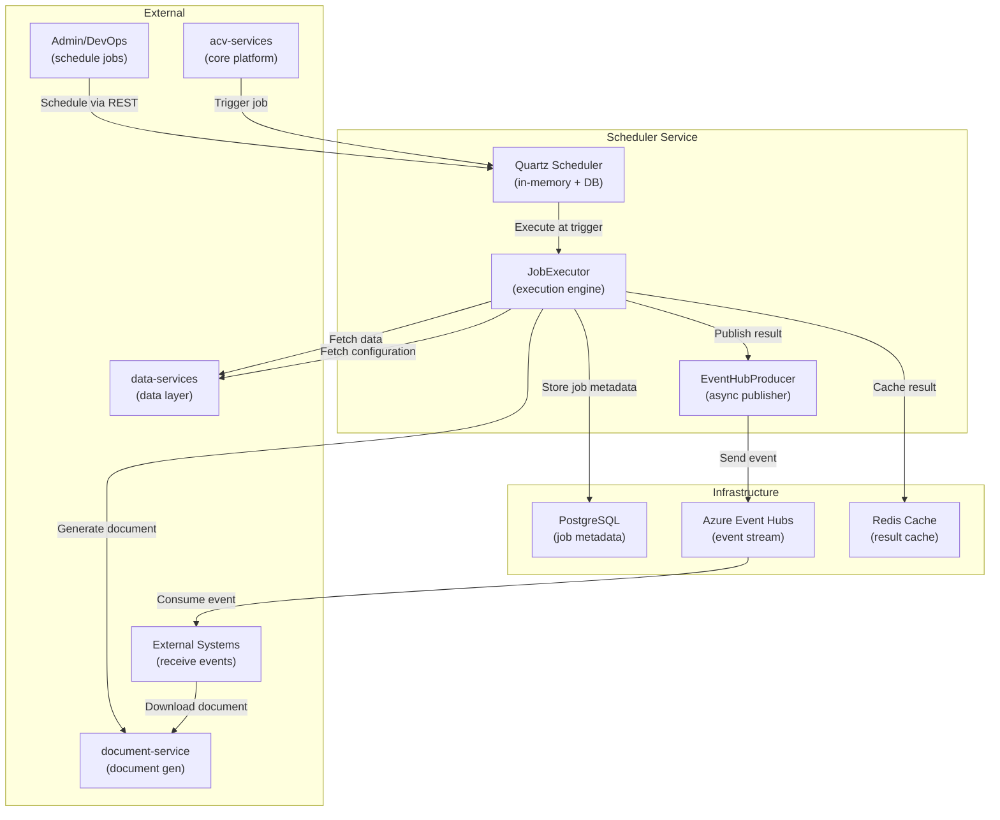
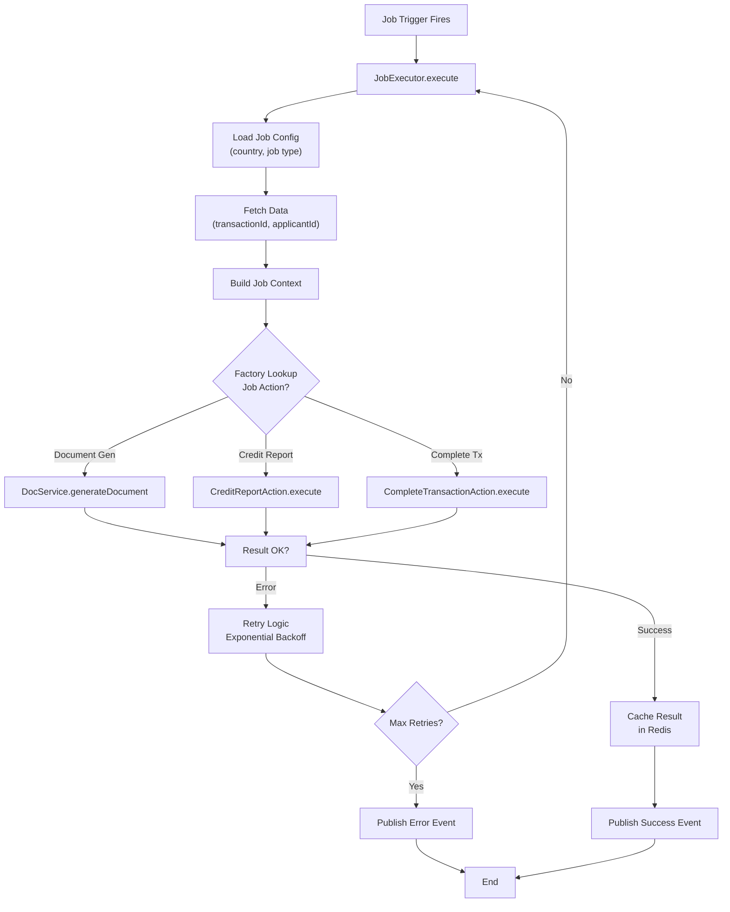
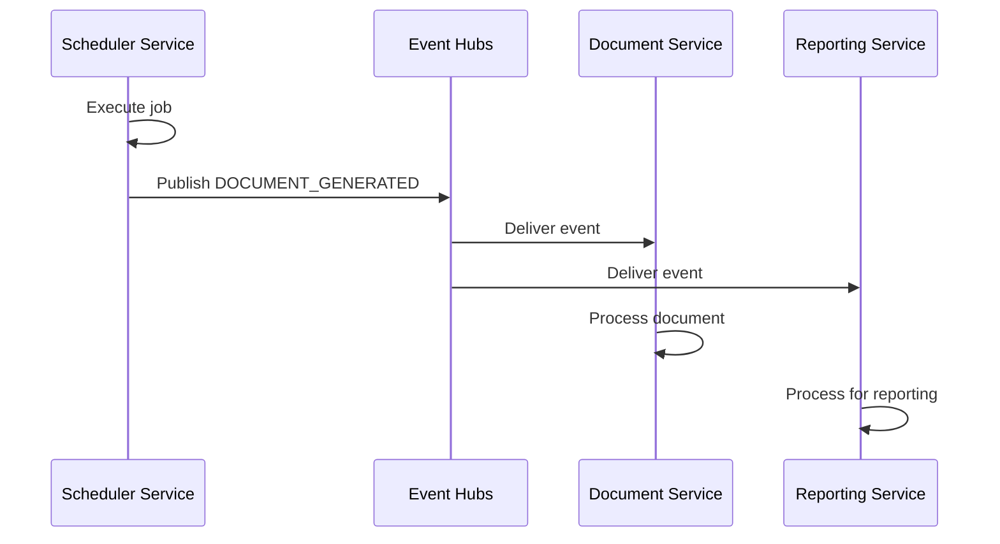

# High-Level Design (HLD) — ACV Scheduler Service

## Purpose & Scope

**ACV Scheduler Service** is a Spring Boot microservice that handles **distributed job scheduling and execution orchestration** for the ACV platform. It enables:

1. **Centralized Job Management** — Define, schedule, and monitor jobs via REST API
2. **Cron-Based Scheduling** — Native Quartz support for recurring jobs
3. **Job Execution** — Execute jobs with retry logic, error handling, and logging
4. **Event Notification** — Publish job results to Azure Event Hubs for async consumers
5. **Multi-Country Support** — Country-specific job configurations and behaviors
6. **Monitoring & Observability** — Prometheus metrics, health checks, distributed tracing

---

## Business Context

**User Stakeholders:**
- Platform Team — Operational management of batch processes
- Data Services — Consume scheduled document generation, compliance checks
- Audit/Compliance — Track job execution and completion status

**Key Business Processes:**
- **Document Generation Pipeline** — Schedule batch document generation (reports, certificates)
- **Credit Report Verification** — Scheduled credit checks for applicants
- **Compliance Data Processing** — Periodic validation of compliance status
- **Transaction Closure** — Scheduled batch transaction finalization

---

## System Context Diagram



---

## Major Components

### 1. Quartz Scheduler Layer

**Responsibility:** Manage job definitions, triggers, and scheduling state

**Key Classes:**
- `AcvQuartzConfig` — Quartz configuration (scheduler, datasource, job store)
- `AcvCronJob` — Template job class for Quartz `Job` interface
- `AcvQuartzService` / `AcvQuartzServiceImpl` — Schedule, pause, resume, unschedule jobs

**Key Behaviors:**
- Persistent job storage in PostgreSQL (survives restarts)
- Cron expression parsing and trigger scheduling
- Auto-wiring Spring beans into Quartz jobs
- Cluster-aware scheduling (multiple Scheduler Service instances)

**Storage Model:**
```
QRTZ_JOB_DETAILS     — Job definitions
QRTZ_CRON_TRIGGERS   — Cron triggers for jobs
QRTZ_SIMPLE_TRIGGERS — One-time job triggers
QRTZ_CALENDARS       — Exclusion calendars (holidays, maintenance windows)
```

---

### 2. Job Executor Layer

**Responsibility:** Execute jobs with business logic, retry, and error handling

**Key Classes:**
- `JobExecutorService` / `JobExecutorServiceImpl` — Execute jobs with retry strategy
- `JobActionsImpl` — Handlers for specific job types (credit reports, document generation, etc.)
- `GenericMappingFactory` — Dynamically map job names to job action handlers

**Key Behaviors:**
- **Job Type Resolution:** Load job configuration by country and job name
- **Data Enrichment:** Fetch transaction data from data-services
- **Action Execution:** Invoke appropriate action handler (document generation, compliance check, etc.)
- **Retry Strategy:** Exponential backoff with max retry count
- **Error Handling:** Catch exceptions, log failures, publish error event
- **Result Caching:** Store successful results in Redis with TTL

**Execution Flow:**


---

### 3. Event Hub Layer

**Responsibility:** Publish job execution results and errors to async subscribers

**Key Classes:**
- `AcvEventHubProducer` — Send job result events (success/failure/retry)
- `AcvEventHubConsumer` — Consume and process events from Event Hubs
- `AcvEventHubConfigurations` — Event Hub client and checkpoint setup
- `MessageStorage` — Durable message storage (for offline processing)

**Event Types:**
- `JOB_EXECUTION_STARTED` — Job began execution
- `JOB_EXECUTION_SUCCESS` — Job completed successfully
- `JOB_EXECUTION_FAILURE` — Job failed after all retries
- `DOCUMENT_GENERATED` — Document generation result
- `REPORT_GENERATED` — Report (credit, compliance) ready
- `TRANSACTION_CLOSED` — Batch transaction finalized

**Messaging Pattern:**


---

### 4. Configuration Layer

**Responsibility:** Load and manage job configurations per country

**Key Classes:**
- `CountryJobConfiguration` — Cron schedules, retry policies, timeouts per country
- `ApplicationProperties` — Top-level app configuration binding
- `JobConfiguration` (DTO) — Job config object (name, action, retries, cron)

**Example Configuration Structure:**
```yaml
jobs:
  US:
    - name: DOC_GEN_DAILY
      action: DOCUMENT_GENERATION
      cron: "0 2 * * * ?"          # 2 AM daily
      maxRetries: 3
      retryDelay: 5000              # 5 seconds
      timeoutMinutes: 30
    - name: CREDIT_REPORT_WEEKLY
      action: CREDIT_REPORT
      cron: "0 3 ? * MON"            # 3 AM every Monday
      maxRetries: 2
      retryDelay: 10000
      timeoutMinutes: 60
  DE:
    - name: DOC_GEN_DAILY
      action: DOCUMENT_GENERATION
      cron: "0 2 * * * ?"
      maxRetries: 3
      retryDelay: 5000
      timeoutMinutes: 30
```

---

## Technology Stack

| Component | Technology | Purpose |
|---|---|---|
| **Framework** | Spring Boot 3.3.1 | Web framework |
| **Scheduler** | Quartz 2.3+ | Job scheduling engine |
| **Persistence** | PostgreSQL 42.7.5 | Job metadata storage |
| **Messaging** | Azure Event Hubs | Event-driven results |
| **Caching** | Redis | Job result caching |
| **Auth** | OAuth2 (Okta) + JWT | API security |
| **Monitoring** | Prometheus + Micrometer | Metrics and tracing |
| **ORM** | Spring Data JPA | Database abstraction |
| **Retry** | Spring Retry 2.0.3 | Exponential backoff |
| **Logging** | SLF4J + Logback | Structured logging |

---

## Primary Business Flows

### Flow 1: Schedule Document Generation Job

**Trigger:** Admin via REST API or scheduled configuration

**Sequence:**
1. Admin calls `GET /job/newJob?jobName=DOC_GEN_US&cronExpression=0%202%20*%20*%20*%20%3F`
2. `AcvQuartzController` → `AcvQuartzService.schedule()`
3. Quartz creates trigger, saves to PostgreSQL
4. At cron time (2 AM), Quartz fires job
5. `AcvCronJob.execute()` → `JobExecutor.executeJob()`
6. JobExecutor fetches config, data, calls DocumentService
7. Document generated successfully → publish `DOCUMENT_GENERATED` event
8. Result cached in Redis; end.

**Error Path:** If document generation fails → retry 3 times with exponential backoff → publish `JOB_EXECUTION_FAILURE` event

---

### Flow 2: Execute Credit Report Job Immediately

**Trigger:** acv-services or admin via REST API (one-time execution)

**Sequence:**
1. Service calls `GET /job/US/CREDIT_REPORT_JOB`
2. `AcvQuartzController` → `JobExecutorService.executeJob("US", "CREDIT_REPORT_JOB")`
3. Load country config for CREDIT_REPORT_JOB
4. Fetch applicant/transaction data from data-services
5. Execute credit report action (call external credit service)
6. Store result, cache in Redis
7. Publish `REPORT_GENERATED` event to Event Hubs
8. Consuming services receive event and process

---

## Non-Functional Requirements

| Requirement | Target | Justification |
|---|---|---|
| **Availability** | 99.5% | Critical for scheduled batch processing |
| **Latency (job execution)** | < 30 sec (p95) | Most jobs are lightweight orchestration |
| **Throughput** | 100+ concurrent jobs | Support multi-country parallel execution |
| **Job Retention** | 12 months (archived) | Audit trail for compliance |
| **Retry SLA** | 99% success after 3 retries | Transient failures should auto-recover |
| **Message Delivery** | At-least-once (Event Hubs) | Consumers handle idempotency |
| **Scalability** | Horizontal via Quartz clustering | Scale by adding more instances |

---

## Integration Points

| System | Direction | Protocol | Data Format |
|---|---|---|---|
| **acv-services** | Inbound | REST + JWT | JSON |
| **data-services** | Outbound | REST + JWT | JSON |
| **document-service** | Outbound | REST + JWT | JSON |
| **PostgreSQL** | Outbound | JDBC | SQL queries |
| **Azure Event Hubs** | Outbound | AMQP | JSON events |
| **Redis** | Outbound | Binary Protocol | Serialized Java objects |
| **acv-commons** | Internal | JAR import | Java classes |

---

## Key Design Decisions

### 1. **Quartz + PostgreSQL for Persistent Scheduling**
- **Decision:** Use Quartz JobStore with PostgreSQL backend
- **Rationale:** Jobs survive service restarts; supports distributed clustering
- **Alternative:** Spring @Scheduled (stateless, loses jobs on restart)
- **Trade-off:** Added complexity of JDBC job store vs. guarantees of persistence

### 2. **Event Hub for Async Results**
- **Decision:** Publish job results to Event Hubs instead of direct REST callbacks
- **Rationale:** Decouples job executor from consumers; supports multiple subscribers; natural retry buffer
- **Alternative:** Direct REST callbacks to acv-services (coupling, synchronous)
- **Trade-off:** Added eventual consistency vs. reduced coupling

### 3. **Country-Scoped Job Configuration**
- **Decision:** Load job configs by country code
- **Rationale:** Different countries have different schedules, rules, timeouts
- **Alternative:** Single global job definitions (not flexible)
- **Trade-off:** Config complexity vs. compliance with regional regulations

### 4. **Exponential Backoff Retry Strategy**
- **Decision:** Spring Retry with configurable max retries, exponential delay
- **Rationale:** Graceful handling of transient failures; avoids thundering herd
- **Alternative:** Linear retry (less efficient backoff) or no retry (manual intervention needed)
- **Trade-off:** Delayed final error detection vs. higher success rate

---

## Assumptions & Constraints

**Assumptions:**
- All jobs are stateless (no cross-job dependencies)
- External services (data-services, document-service) are eventually available
- PostgreSQL is highly available (managed RDS)
- Event Hubs checkpoints are durable

**Constraints:**
- Single Scheduler Service deployment to avoid clock skew (distributed Quartz clustering supported if needed)
- Job execution timeout: 30 minutes max (hardcoded to prevent runaway jobs)
- Event message size: < 256 KB (Azure Event Hubs limit)
- Concurrent jobs per instance: tuned via thread pool config

---

**Last Updated:** April 2, 2026  
**Version:** 1.0
