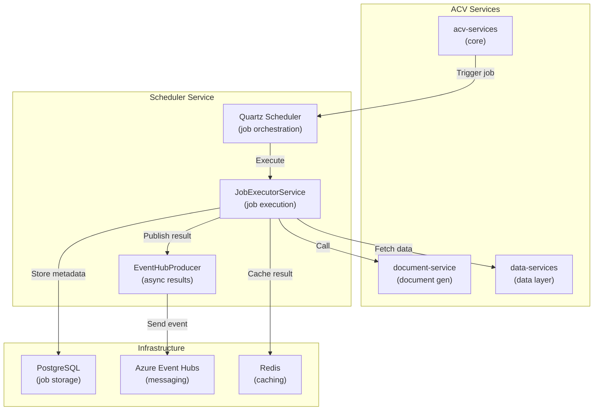

# ACV Scheduler Service — Documentation

## Project Overview

**ACV Scheduler Service** is a Spring Boot microservice that orchestrates **batch job scheduling, execution, and monitoring** for the ACV (Automated Compliance Validation) platform. It provides a centralized job scheduling, retry logic, and asynchronous task execution via Quartz and Azure Event Hubs.

**Version:** 1.1.4  
**Java:** 21 LTS  
**Spring Boot:** 3.3.1  
**Build Tool:** Maven 3.9+

---

## Quick Start

### Build

```bash
cd c:\Users\6687869\Code\ACV\eai-3540813-acv-scheduler-service
mvn clean package -DskipTests
```

### Run Locally

```bash
# Set environment variables
set OKTA_CLIENT_ID=<your-client-id>
set OKTA_CLIENT_SECRET=<your-client-secret>
set AZURE_EVENTHUBS_CONNECTION_STRING=<connection-string>
set POSTGRESQL_URL=jdbc:postgresql://localhost:5432/acv_scheduler
set POSTGRESQL_USERNAME=postgres
set POSTGRESQL_PASSWORD=<password>

# Run the service
mvn spring-boot:run -Dspring-boot.run.arguments="--spring.profiles.active=local"
```

### Run Tests

```bash
mvn test                    # Unit tests
mvn verify                  # All tests with coverage
mvn test -Dtest=JobExecutorServiceTest  # Specific test
```

---

## Technology Stack

| Component | Technology | Version |
|---|---|---|
| **Framework** | Spring Boot | 3.3.1 |
| **Job Scheduler** | Quartz | 2.3+ |
| **Messaging** | Azure Event Hubs | Latest |
| **Caching** | Redis | Latest |
| **Database** | PostgreSQL | 42.7.5 |
| **Authentication** | OAuth2 (Okta) via JWT | 0.12.6 |
| **Monitoring** | Micrometer + Prometheus | Latest |
| **Shared Library** | acv-commons | 1.1.5 |

---

## Repository Structure

```
eai-3540813-acv-scheduler-service/
├── src/main/java/com/fedex/acv/scheduler/
│   ├── AcvSchedulerServiceApplication.java        Main Spring Boot entry point
│   ├── controllers/
│   │   ├── AcvQuartzController.java               REST endpoints for job scheduling
│   │   ├── MessagesController.java                Event Hub message endpoints
│   │   └── PingController.java                    Health check endpoint
│   ├── quartz/
│   │   ├── config/
│   │   │   ├── AcvQuartzConfig.java               Quartz configuration
│   │   │   ├── AcvCronJob.java                    Cron job template
│   │   │   └── AutowiringSpringBeanJobFactory.java  Spring Bean integration
│   │   ├── service/
│   │   │   ├── AcvQuartzService.java              Job scheduling interface
│   │   │   ├── impl/AcvQuartzServiceImpl.java      Implementation
│   │   │   ├── AcvJobService.java                 Job service interface
│   │   │   └── impl/AcvJobServiceImpl.java         Implementation
│   │   ├── utils/
│   │   │   └── AcvJobUtil.java                    Scheduling utilities
│   │   └── dto/
│   │       └── AcvQuartzResponse.java             Job response DTOs
│   ├── jobs/
│   │   ├── config/
│   │   │   └── CountryJobConfiguration.java       Country-specific job settings
│   │   ├── service/
│   │   │   ├── JobExecutorService.java            Job execution interface
│   │   │   ├── impl/JobExecutorServiceImpl.java    Implementation
│   │   │   └── impl/JobActionsImpl.java            Job action handlers
│   │   ├── factory/
│   │   │   └── GenericMappingFactory.java         Dynamic job mapping
│   │   └── dto/
│   │       ├── JobConfiguration.java              Job config object
│   │       ├── CreditReportRequestDto.java        Credit report job request
│   │       ├── CompleteTransactionDto.java        Transaction completion request
│   │       └── TriggerDocumentGenerationDto.java  Document generation trigger
│   ├── eventhub/
│   │   ├── services/
│   │   │   ├── AcvEventHubProducer.java           Send events
│   │   │   └── AcvEventHubConsumer.java           Consume events
│   │   ├── configurations/
│   │   │   └── AcvEventHubConfigurations.java     Event Hub setup
│   │   └── storage/
│   │       └── MessageStorage.java                Event persistence
│   └── constants/
│       └── ApplicationConstants.java              Shared constants
├── src/main/resources/
│   ├── application.yml                            Base configuration
│   ├── application-dev.yml                        Dev environment
│   ├── application-test.yml                       Test environment
│   └── application-local.yml                      Local development
├── src/test/java/com/fedex/acv/scheduler/        Test classes
├── pom.xml                                        Maven dependencies
└── helm-releases/
    ├── nonprod-dev.yaml                           Dev deployment config
    ├── nonprod-test.yaml                          Test deployment config
    └── prod.yaml                                  Production deployment config
```

---

## Key Features

### 1. Job Scheduling
- **Quartz-Based:** Native Quartz integration for cron and one-time jobs
- **Persistent Storage:** Jobs persisted in PostgreSQL (survives restarts)
- **Dynamic Scheduling:** Create, update, pause, resume jobs via REST API

### 2. Job Execution
- **Multi-Country Support:** Country-specific job configurations
- **Retry Logic:** Automatic retry with exponential backoff
- **Job Actions:** Support for document generation, credit reports, transaction completion

### 3. Event-Driven Processing
- **Azure Event Hubs:** Async messaging for job status and results
- **Checkpoint Management:** Durable message processing with blob checkpoints
- **Consumer Groups:** Multiple consumers for different job types

### 4. Monitoring & Observability
- **Prometheus Metrics:** Built-in metrics for job execution, latency, errors
- **Distributed Tracing:** Micrometer integration for request tracing
- **Health Checks:** `/actuator/health` endpoint for liveness/readiness probes

---

## Main Controllers & Endpoints

| Controller | Endpoint | Method | Purpose |
|---|---|---|---|
| `AcvQuartzController` | `/job/{country}/{job}` | GET | Execute a job immediately |
| | `/job/newJob` | GET | Schedule new cron job |
| | `/job/unschedule` | GET | Stop a scheduled job |
| | `/job/action/pause` | GET | Pause a job without deleting |
| | `/job/action/resume` | GET | Resume a paused job |
| `MessagesController` | `/messages/send` | POST | Publish event to Event Hub |
| | `/messages/consume` | GET | Poll and process events |
| `PingController` | `/ping` | GET | Health check / connectivity test |

---

## Key Services

| Service | Responsibility |
|---|---|
| `AcvQuartzService` | Schedule/unschedule jobs, manage Quartz triggers |
| `AcvJobService` | Load job configurations, resolve job implementations |
| `JobExecutorService` | Execute jobs with retry and error handling |
| `AcvEventHubProducer` | Send job status/result events to Event Hubs |
| `AcvEventHubConsumer` | Receive and process events from Event Hubs |

---

## Configuration Properties

### Job Scheduling

```yaml
quartz:
  job:
    enabled: true
    default-cron: "0 0 * * * ?"  # Daily at midnight
  trigger:
    misfire-instruction: DO_NOTHING
```

### PostgreSQL (Job Persistence)

```yaml
spring:
  datasource:
    url: jdbc:postgresql://localhost:5432/acv_scheduler
    username: postgres
    password: ${POSTGRESQL_PASSWORD}
  jpa:
    hibernate.ddl-auto: validate
    properties.hibernate.dialect: org.hibernate.dialect.PostgreSQL10Dialect
```

### Azure Event Hubs

```yaml
azure:
  eventhubs:
    connection-string: ${AZURE_EVENTHUBS_CONNECTION_STRING}
    checkpoint-storage:
      account-name: ${AZURE_STORAGE_ACCOUNT}
      account-key: ${AZURE_STORAGE_KEY}
      container-name: scheduler-checkpoints
```

### Redis Cache

```yaml
spring:
  cache:
    type: redis
    redis:
      host: localhost
      port: 6379
      timeout: 2000
```

### OAuth2 / Okta

```yaml
oauth2:
  okta:
    tenant-url: https://dev-xxx.okta.com
    client-id: ${OKTA_CLIENT_ID}
    client-secret: ${OKTA_CLIENT_SECRET}
```

---

## Usage Examples

### Schedule a Document Generation Job

```bash
curl -X GET "http://localhost:8080/job/newJob?jobName=DOC_GEN_DAILY&cronExpression=0%200%20*%20*%20*%20%3F&jobScheduleTime=2024-04-02" \
  -H "Authorization: Bearer <JWT_TOKEN>"
```

### Execute a Job Immediately

```bash
curl -X GET "http://localhost:8080/job/US/CREDIT_REPORT_JOB" \
  -H "Authorization: Bearer <JWT_TOKEN>"
```

### Pause a Job

```bash
curl -X GET "http://localhost:8080/job/action/pause?jobName=DOC_GEN_DAILY" \
  -H "Authorization: Bearer <JWT_TOKEN>"
```

---

## Design Decisions

### 1. **Quartz for Scheduling**
- **Rationale:** Native support for cron expressions, persistent storage, clustering
- **Alternative Considered:** Spring @Scheduled (stateless, no persistence)

### 2. **PostgreSQL for Job Persistence**
- **Rationale:** Reliable persistence across service restarts, distributed Quartz cluster support
- **Alternative Considered:** In-memory (but loses jobs on restart)

### 3. **Azure Event Hubs for Async Processing**
- **Rationale:** Decouples job execution from downstream consumers, supports multiple subscribers
- **Alternative Considered:** Direct REST calls (coupling, no retry buffer)

### 4. **Redis for job result caching**
- **Rationale:** Fast access to recent job results, reduces database load
- **Alternative Considered:** Database-only (slower lookups)

---

## Dependencies

### Internal
- **acv-commons** (v1.1.5) — Shared HTTP clients, OAuth2, logging filters, Event Hub utilities

### External
- **Quartz Scheduler** — Job scheduling engine
- **Azure Event Hubs** — Cloud messaging service
- **Spring Boot Actuator** — Metrics and health endpoints
- **PostgreSQL Driver** — Database connectivity
- **Spring Data JPA** — ORM layer

---

## Integration Points



---

## Related Documentation

- [HLD.md](HLD.md) — High-level architecture and design
- [services.md](services.md) — REST API contracts
- [code-mapping.md](code-mapping.md) — Class and package structure
- [glossary.md](glossary.md) — Terminology reference
- [onboarding.md](onboarding.md) — Developer setup guide

---

**Last Updated:** April 2, 2026  
**Maintained by:** ACV Platform Team
