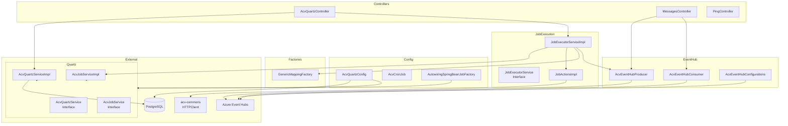
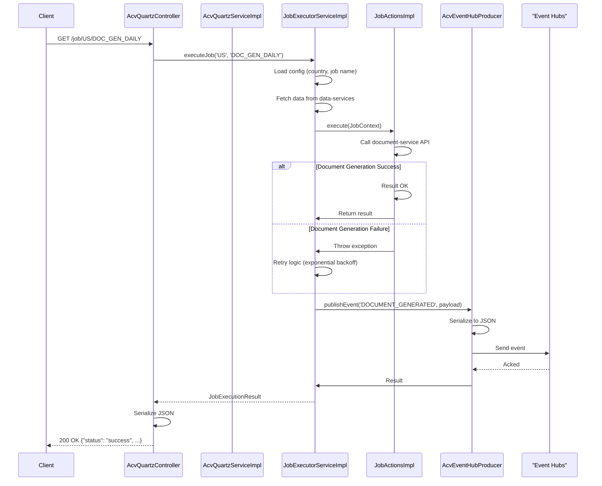

# Code-Level Reference — ACV Scheduler Service

## Package-to-Responsibility Mapping

| Package | Responsibility |
|---------|---|
| `com.fedex.acv.scheduler.controller` | REST API entry points (job scheduling, messaging) |
| `com.fedex.acv.scheduler.quartz.service` | Quartz job scheduling logic |
| `com.fedex.acv.scheduler.quartz.config` | Quartz configuration and bean setup |
| `com.fedex.acv.scheduler.jobs.service` | Job execution engines |
| `com.fedex.acv.scheduler.jobs.config` | Country-specific job configurations |
| `com.fedex.acv.scheduler.jobs.factory` | Dynamic job action mapping |
| `com.fedex.acv.scheduler.eventhub.services` | Event Hub producer/consumer |
| `com.fedex.acv.scheduler.eventhub.configurations` | Event Hub client setup |
| `com.fedex.acv.scheduler.dto` | Data transfer objects for requests/responses |
| `com.fedex.acv.scheduler.constants` | Application-wide constants |

---

## Class Inventory

### Controllers (`com.fedex.acv.scheduler.controller`)

| Class | File | Purpose |
|-------|------|---------|
| `AcvQuartzController` | `controller/AcvQuartzController.java` | Job scheduling endpoints |
| `MessagesController` | `controller/MessagesController.java` | Event Hub message endpoints |
| `PingController` | `controller/PingController.java` | Health check endpoint |

### Quartz Services (`com.fedex.acv.scheduler.quartz.service`)

| Class | File | Purpose |
|-------|------|---------|
| `AcvQuartzService` (Interface) | `quartz/service/AcvQuartzService.java` | Scheduling abstractions |
| `AcvQuartzServiceImpl` | `quartz/service/impl/AcvQuartzServiceImpl.java` | Quartz scheduling implementation |
| `AcvJobService` (Interface) | `quartz/service/AcvJobService.java` | Job service abstractions |
| `AcvJobServiceImpl` | `quartz/service/impl/AcvJobServiceImpl.java` | Job operations implementation |

### Job Execution Services (`com.fedex.acv.scheduler.jobs.service`)

| Class | File | Purpose |
|-------|------|---------|
| `JobExecutorService` (Interface) | `jobs/service/JobExecutorService.java` | Job execution abstractions |
| `JobExecutorServiceImpl` | `jobs/service/impl/JobExecutorServiceImpl.java` | Job execution engine |
| `JobActionsImpl` | `jobs/service/impl/JobActionsImpl.java` | Job action handlers (document gen, reports, etc.) |

### Quartz Configuration (`com.fedex.acv.scheduler.quartz.config`)

| Class | File | Purpose |
|-------|------|---------|
| `AcvQuartzConfig` | `quartz/config/AcvQuartzConfig.java` | Scheduler bean, datasource, job store setup |
| `AcvCronJob` | `quartz/config/AcvCronJob.java` | Quartz Job template for Spring integration |
| `AutowiringSpringBeanJobFactory` | `quartz/config/AutowiringSpringBeanJobFactory.java` | Enable Spring `@Autowired` in Quartz jobs |
| `PersistableCronTriggerFactoryBean` | `quartz/config/PersistableCronTriggerFactoryBean.java` | Factory for persistent cron triggers |

### Job Configuration (`com.fedex.acv.scheduler.jobs.config`)

| Class | File | Purpose |
|-------|------|---------|
| `CountryJobConfiguration` | `jobs/config/CountryJobConfiguration.java` | Load country-specific job configs |

### Job Factory (`com.fedex.acv.scheduler.jobs.factory`)

| Class | File | Purpose |
|-------|------|---------|
| `GenericMappingFactory` | `jobs/factory/GenericMappingFactory.java` | Map job names to action handlers dynamically |

### Event Hub Services (`com.fedex.acv.scheduler.eventhub.services`)

| Class | File | Purpose |
|-------|------|---------|
| `AcvEventHubProducer` | `eventhub/services/AcvEventHubProducer.java` | Publish events to Event Hubs |
| `AcvEventHubConsumer` | `eventhub/services/AcvEventHubConsumer.java` | Consume events from Event Hubs |

### Event Hub Configuration (`com.fedex.acv.scheduler.eventhub.configurations`)

| Class | File | Purpose |
|-------|------|---------|
| `AcvEventHubConfigurations` | `eventhub/configurations/AcvEventHubConfigurations.java` | Event Hub client bean setup |

### Event Hub Storage (`com.fedex.acv.scheduler.eventhub.storage`)

| Class | File | Purpose |
|-------|------|---------|
| `MessageStorage` | `eventhub/storage/MessageStorage.java` | Durable message storage for offline processing |

### DTOs

| Class | File | Purpose |
|-------|------|---------|
| `AcvQuartzResponse` | `quartz/dto/AcvQuartzResponse.java` | Job scheduling response |
| `JobConfiguration` | `jobs/dto/JobConfiguration.java` | Job config object |
| `CreditReportRequestDto` | `jobs/dto/CreditReportRequestDto.java` | Credit report job request |
| `CompleteTransactionDto` | `jobs/dto/CompleteTransactionDto.java` | Transaction completion request |
| `TriggerDocumentGenerationDto` | `jobs/dto/TriggerDocumentGenerationDto.java` | Document generation trigger |
| `TriggerValidationRequestDto` | `jobs/dto/TriggerValidationRequestDto.java` | Trigger validation request |
| `PollingRequest` | `jobs/dto/PollingRequest.java` | Event polling request |

### Utilities

| Class | File | Purpose |
|-------|------|---------|
| `AcvJobUtil` | `quartz/utils/AcvJobUtil.java` | Scheduling utilities (cron parsing, validation) |
| `ApplicationConstants` | `constants/ApplicationConstants.java` | App-wide constants (job names, cron defaults) |

---

## Dependency Graph



---

## Key Method Signatures

### AcvQuartzService

```java
public AcvQuartzResponse schedule(String jobName, Date startDate, String cronExpression)
    throws InvalidCronException;

public AcvQuartzResponse unschedule(String jobName)
    throws JobNotFoundException;

public AcvQuartzResponse pause(String jobName)
    throws JobNotFoundException;

public AcvQuartzResponse resume(String jobName)
    throws JobNotFoundException;
```

### JobExecutorService

```java
public JobExecutionResult executeJob(String country, String jobName)
    throws JobConfigurationException, JobExecutionException;

public JobExecutionResult executeJobWithRetry(String country, String jobName, int maxRetries)
    throws JobExecutionException;
```

### JobActionsImpl

```java
public void executeDocumentGeneration(String transactionId, String country)
    throws DocumentGenerationException;

public void executeCreditReport(String applicantId, String country)
    throws CreditReportException;

public void completeTransaction(String transactionId)
    throws TransactionException;
```

### AcvEventHubProducer

```java
public EventPublishResult publishEvent(String eventType, Map<String, Object> payload)
    throws EventHubException;

public void publishJobExecutionEvent(String jobId, JobExecutionStatus status)
    throws EventHubException;
```

### AcvEventHubConsumer

```java
public List<EventMessage> consumeMessages(String consumerGroup, int maxMessages)
    throws EventHubException;

public void startListening(String consumerGroup, EventProcessor processor);

public void stopListening();
```

---

## Spring Bean Wiring

**Automatic (`@Autowired`):**
- `AcvQuartzController` → `AcvQuartzService`, `AcvJobService`, `JobExecutorService`
- `JobExecutorServiceImpl` → `CountryJobConfiguration`, `GenericMappingFactory`, `AcvEventHubProducer`
- `AcvEventHubProducer` → `EventHubClient` (from `AcvEventHubConfigurations`)

**Configured in `AcvQuartzConfig`:**
```java
@Bean
public Scheduler quartzScheduler(QuartzProperties quartzProperties) {
    SchedulerFactoryBean factory = new SchedulerFactoryBean();
    factory.setDataSource(quartzDataSource);
    factory.setJobFactory(springBeanJobFactory());
    factory.setTriggers(triggerList);
    return factory.getScheduler();
}

@Bean
public JobFactory springBeanJobFactory() {
    return new AutowiringSpringBeanJobFactory();
}
```

**Configured in `AcvEventHubConfigurations`:**
```java
@Bean
public EventHubProducerClient eventHubProducerClient() {
    return new EventHubClientBuilder()
        .connectionString(connectionString)
        .buildProducerClient();
}

@Bean
public EventHubConsumerClient eventHubConsumerClient() {
    return new EventHubClientBuilder()
        .connectionString(connectionString)
        .buildConsumerClient();
}
```

---

## Request/Response Lifecycle (Code Level)



---

## Test File Mapping

| Test Class | Source Class | Location |
|---|---|---|
| `AcvQuartzServiceImplTest` | `AcvQuartzServiceImpl` | `src/test/java/.../quartz/service/impl/AcvQuartzServiceImplTest.java` |
| `JobExecutorServiceImplTest` | `JobExecutorServiceImpl` | `src/test/java/.../jobs/service/impl/JobExecutorServiceImplTest.java` |
| `AcvEventHubProducerTest` | `AcvEventHubProducer` | `src/test/java/.../eventhub/services/AcvEventHubProducerTest.java` |
| `AcvQuartzControllerTest` | `AcvQuartzController` | `src/test/java/.../controller/AcvQuartzControllerTest.java` |

---

**Last Updated:** April 2, 2026  
**Version:** 1.0
