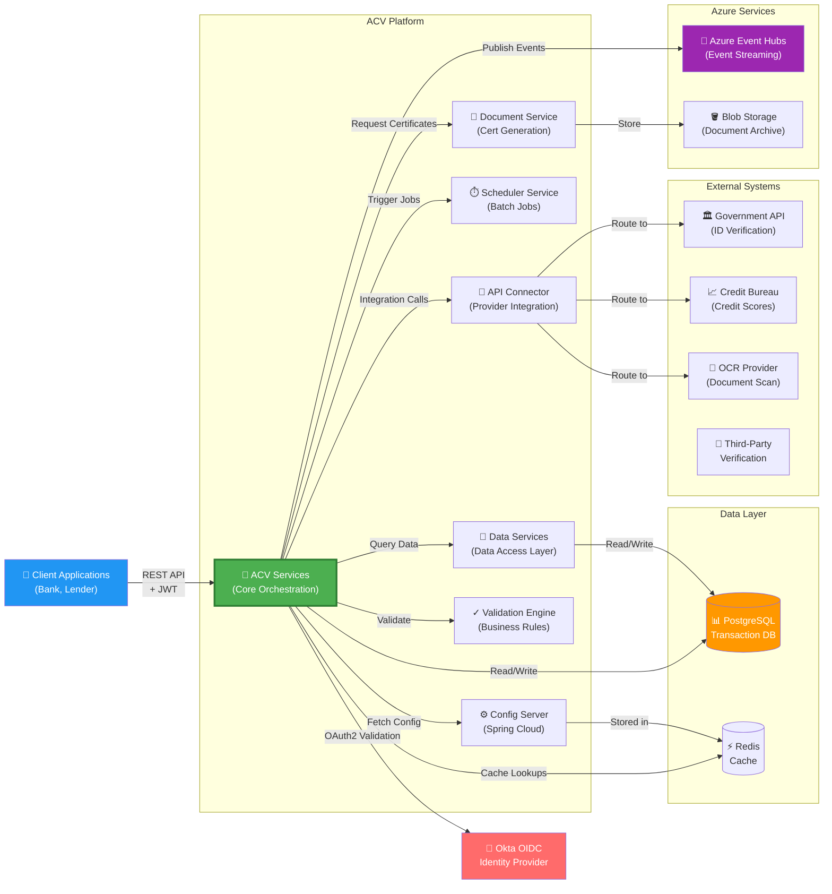
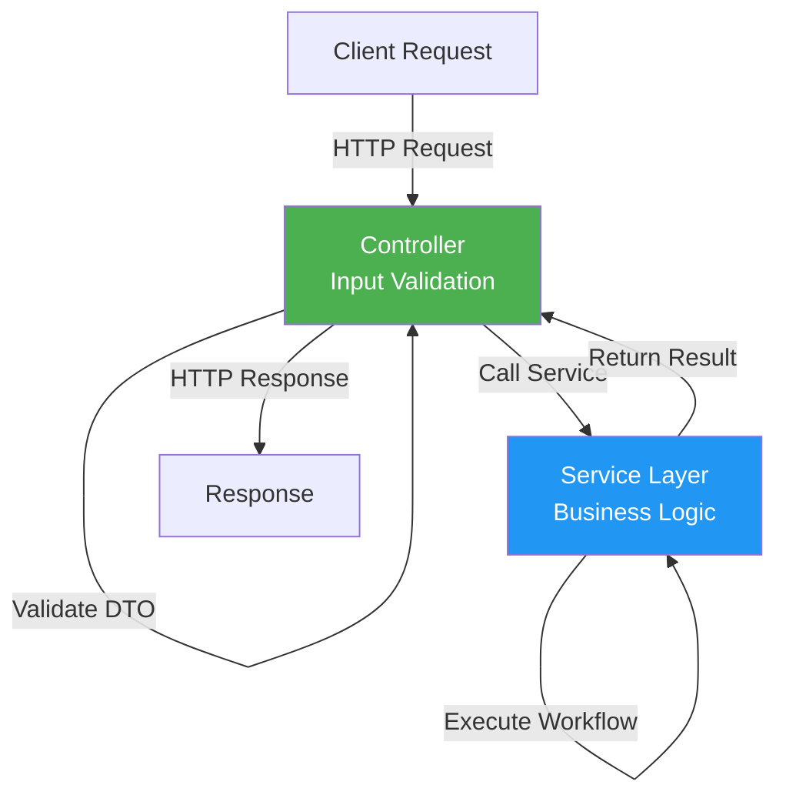
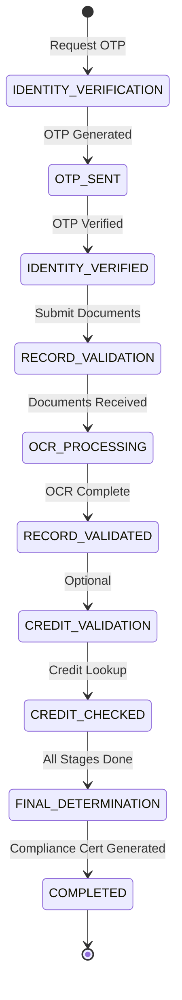
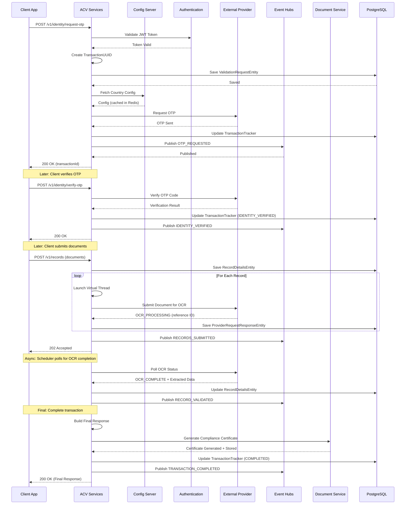
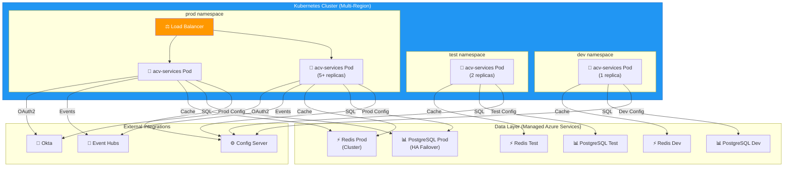

# ACV Services - High-Level Design (HLD)

**Purpose:** Define the architecture, major components, and design decisions for the Account Creation Validations (ACV) Services platform.

**Scope:** Multi-stage compliance validation orchestration for account creation workflows across multiple countries and validation types.

---

## 1. Business Context

### Business Domain

**Account Creation Validation (ACV)** solves a critical workflow in financial services: rapidly onboarding new account applicants while ensuring regulatory compliance and minimizing fraud risk.

**Stakeholders:**
- **Financial Institutions** — Banks, credit unions, lenders needing automated account opening
- **Regulators** — KYC (Know Your Customer), AML (Anti-Money Laundering) compliance requirements
- **End Users** — Applicants opening accounts; expect rapid approval
- **Operations Team** — Manages configuration, troubleshoots validation failures, monitors compliance

**Business Flows:**

1. **Account Opening Request** → Financial institution submits applicant data (name, ID, location)
2. **Identity Verification** → ACV validates applicant identity via OTP or document check
3. **Compliance Documentation** → ACV requests/verifies required compliance documents (business registration, tax certificates, etc.)
4. **Credit Validation** → Optional credit bureau checks for credit products
5. **Final Compliance Determination** → ACV compiles validation results and generates compliance certificates
6. **Account Approval** → Financial institution either opens account or requests more information

**Non-Functional Requirements:**
- **Performance:** Sub-2-second API response time for request submission
- **Availability:** 99.9% SLA across all validation stages
- **Scalability:** Support 10,000+ validation requests per hour
- **Data Residency:** Comply with country-specific data storage requirements
- **Audit Trail:** Full request/response/decision logging for regulatory audit
- **Multi-Tenancy:** Support multiple financial institutions via service isolation

---

## 2. System Context Diagram

Diagram showing ACV Services and all external systems it integrates with:

---

## 3. Major Components

### 3.1 REST API Layer (Controllers)

**Responsibility:** Accept HTTP requests from client applications, validate input, route to business logic, return responses.

**Key Controllers:**

| Controller | Endpoints | Purpose |
|-----------|-----------|---------|
| `AccountCreationValidationsController` | `POST /v1/identity/request-otp`, `POST /v1/identity/verify-otp`, `POST /v1/records`, `GET /v1/transaction/{id}` | Orchestrate multi-stage validation workflows; manage OTP-based identity verification and document submission |
| `ConfigurationController` | `GET /config/v1/countries`, `GET /config/v1/country/{code}/documents`, `GET /config/v1/validation-types` | Serve country-scoped and validation-type configurations to clients |
| `AuthTokenController` | `GET /oktaToken/{service}` | Generate or proxy OAuth2 tokens for inter-service communication |

**Request Flow → Service Layer**

---

### 3.2 Validation Orchestration Layer (Services)

**Responsibility:** Implement multi-stage validation workflows, coordinate between external providers, manage transaction state, publish events.

**Core Services:**

#### **ValidationTriggerServiceImpl** — Bulk Request Entry Point
- **Purpose:** Accept bulk validation requests from clients
- **Method:** `triggerValidation(List<TriggerValidationRequest>, String validationStage)`
- **Workflow:**
  1. Group requests by country
  2. Create transaction UUID per request
  3. Save `ValidationRequestEntity` to PostgreSQL
  4. Launch virtual thread per transaction (async parallel processing)
  5. Call `validateTransaction()` for each thread

#### **StageValidationServiceImpl** — Multi-Stage Orchestration
- **Purpose:** Orchestrate validation through sequential stages (identity → record → credit → completion)
- **Key Method:** `validate(String validationStage, ValidationRequest request, UUID transactionUUID)`
- **Workflow:**
  1. Validate request input against stage requirements
  2. Save initial `TransactionTrackerEntity` to PostgreSQL
  3. Load stage configuration from Redis cache (via `ConfigurationServiceImpl`)
  4. Process records in parallel using `ExecutorService` with virtual threads
  5. Route each record to appropriate validator based on `recordCategory` (OCR_VALIDATION, API_VALIDATION, CONSENT_VALIDATION, RESULT_VALIDATION)
  6. Aggregate results and return `ValidationResponse`

**Stage Progression:**

#### **RecordValidationServiceImpl** — Individual Record Validation
- **Purpose:** Validate single record against configured rules and external providers
- **Key Method:** `validate(RecordDetailsEntity record, ValidationSetEntity validationSet, String validationStage)`
- **Workflow:**
  1. Load record validation rules from configuration
  2. Determine validation type (OCR, API call, manual consent, result lookup)
  3. Route to appropriate validator (OCRValidationServiceImpl, ApiServiceClientImpl, etc.)
  4. Save result to `RecordDetailsEntity`
  5. Return validation result (PASS, FAIL, RETRY_NEEDED)

#### **OCRValidationServiceImpl** — Document Processing
- **Purpose:** Submit documents for Optical Character Recognition (OCR) and data extraction
- **Key Method:** `submitDataForOCR(String documentURL, String recordCode, UUID transactionUUID)`
- **Workflow:**
  1. Fetch document from `documentURL` (Azure Blob Storage)
  2. Call OCR provider via `ApiServiceClientImpl`
  3. Save reference to `ProviderRequestResponseEntity`
  4. Publish "OCR_SUBMITTED" event to Event Hub
  5. Return reference ID for polling status

#### **CompleteTransactionServiceImpl** — Transaction Finalization
- **Purpose:** Finalize transaction after all validations complete
- **Key Method:** `buildResponse(List<CompleteTransactionRequest> requests)`
- **Workflow:**
  1. Query validation results from `TransactionTrackerRepository`
  2. Group by record code
  3. Aggregate compliance status (PASS, CONDITIONAL_PASS, FAIL)
  4. Call Document Service to generate compliance certificates
  5. Update `TransactionTrackerEntity` with COMPLETED status
  6. Publish "TRANSACTION_COMPLETED" event to Event Hub
  7. Return final compliance response

#### **RetryServiceImpl** — Polling & Retry Logic
- **Purpose:** Handle retryable validations with polling and exponential backoff
- **Key Method:** `retryValidationWithPolling(String providerReference, int maxRetries, long backoffMs)`
- **Workflow:**
  1. Poll external provider for result status
  2. Retry up to `maxRetries` with exponential backoff
  3. On success: save result, remove from retry queue
  4. On max retries exceeded: mark as FAILED, save error
  5. Publish retry events to Event Hub

#### **ConfigurationServiceImpl** — Configuration Management
- **Purpose:** Load and cache country-scoped validation rules
- **Key Method:** `getCountryConfiguration(String countryCode)`
- **Workflow:**
  1. Check Redis cache: `acv:config:country:{countryCode}`
  2. If miss: fetch from PostgreSQL (`CountryConfigEntity`)
  3. Parse and validate configuration
  4. Cache in Redis with TTL 24 hours
  5. Return configuration object

---

### 3.3 External Provider Integration Layer

#### **ApiServiceClientImpl** — HTTP Client for External APIs
- **Purpose:** Make HTTP calls to government agencies, credit bureaus, OCR providers
- **Key Method:** `callExternalProvider(ConnectionRequest request)`
- **Features:**
  - OAuth2 token management via `AuthTokenController`
  - Request/response mapping for diverse provider formats
  - Retry logic with circuit breaker pattern (via Spring Retry)
  - PII masking for sensitive data before logging
  - Request/response audit logging to `ProviderRequestResponseRepository`

#### **ConnectionsManagerServiceImpl** — Provider Routing
- **Purpose:** Route requests to correct external provider based on provider configuration
- **Key Method:** `fetchData(ConnectionRequest connectionRequest)`
- **Workflow:**
  1. Parse provider type from request (GOVERNMENT, CREDIT_BUREAU, OCR_VENDOR, etc.)
  2. Load provider configuration from Config Server
  3. Call `ApiServiceClientImpl` with provider-specific endpoint and credentials
  4. Transform response to standard ACV format
  5. Save audit trail to database
  6. Return transformed response

---

### 3.4 Data Access Layer (Repositories)

Spring Data JPA repositories providing CRUD and custom query access to PostgreSQL:

| Repository | Entity | Purpose |
|-----------|--------|---------|
| `ValidationRequestRepository` | `ValidationRequestEntity` | Store incoming validation requests; query by transactionId |
| `TransactionTrackerRepository` | `TransactionTrackerEntity` | Track validation state throughout multi-stage process |
| `ProviderRequestResponseRepository` | `ProviderRequestResponseEntity` | Audit trail of external provider API calls |
| `CountryRepository` | `CountryEntity` | Master data for supported countries |
| `CountryConfigRepository` | `CountryConfigEntity` | Country-specific validation rules and document requirements |
| `AcvCrudConfigInfoRepository` | `AcvCrudConfigInfo` | Generic configuration key-value store |

---

### 3.5 Event Publishing Layer

#### **EventHubServiceImpl** — Azure Event Hubs Integration
- **Purpose:** Publish validation events for asynchronous downstream processing
- **Key Method:** `publishEvent(ValidationEvent event)`
- **Events Published:**
  - `IDENTITY_VERIFICATION_STARTED`
  - `IDENTITY_VERIFICATION_COMPLETED`
  - `OCR_SUBMISSION_STARTED`
  - `OCR_SUBMISSION_COMPLETED`
  - `RECORD_VALIDATION_PASSED` / `FAILED`
  - `TRANSACTION_COMPLETED`
- **Downstream Consumers:**
  - **Scheduler Service** — Triggers batch jobs
  - **Document Service** — Generates compliance certificates
  - **Data Services** — Updates compliance dashboards

---

## 4. Multi-Stage Validation Workflow

---

## 5. Technology Stack

| Layer | Technology | Version | Justification |
|-------|-----------|---------|---------------|
| **Runtime** | Java LTS | 21+ | Virtual threads for async parallel validation; long-term support |
| **Framework** | Spring Boot | 3.3.1 | Production-grade microservices framework with excellent ecosystem |
| **REST API** | Spring Web | 3.3.1 | Auto config for REST controllers, content negotiation |
| **Database** | Spring Data JPA | 3.3.1+ | Abstraction over raw JDBC; supports complex entity relationships |
| **Database Engine** | PostgreSQL | 14+ | ACID compliance; JSON support; excellent performance for relational data |
| **Caching** | Spring Cache + Redis | Latest | Reduce database load; cache country configs and tokens |
| **Authentication** | Spring Security + Okta | 3.0.6 | OAuth2 OIDC; enterprise-grade identity management |
| **Event Streaming** | Azure Event Hubs (via acv-commons) | Latest | Production Azure service; supports high-throughput event publishing |
| **API Documentation** | SpringDoc OpenAPI | 2.6.0 | Auto-generate Swagger UI from Spring annotations |
| **Async Processing** | Virtual Threads | Java 21+ | Lightweight concurrency for parallel record validation |
| **Testing** | JUnit 5 + Mockito | Spring Boot 3.3.1 | Standard testing framework; excellent mocking support |

---

## 6. Key Design Decisions

### Decision 1: Multi-Stage Validation Pipeline
**Problem:** Different validation types (identity, documents, credit) have different processing times and provider dependencies. A synchronous approach would cause timeouts.

**Solution:** Decompose validation into discrete stages (IDENTITY_VERIFICATION → RECORD_VALIDATION → CREDIT_VALIDATION → COMPLETION). Each stage can be async, with clients polling for status or receiving webhook callbacks.

**Rationale:**
- Allows asynchronous processing of long-running external API calls
- Enables clients to interleave other work while validation proceeds
- Supports different SLAs per stage
- Facilitates recovery and retry at each stage boundary

### Decision 2: Virtual Threads for Parallel Record Validation
**Problem:** Processing 100+ documents serially would be too slow; traditional thread pools have high memory overhead.

**Solution:** Use Java 21 virtual threads to spawn lightweight concurrent tasks per record, one virtual thread per record validation.

**Rationale:**
- Virtual threads consume minimal memory (100k threads possible vs. 1k with OS threads)
- No explicit thread pool management; automatic scheduling by JVM
- Simplifies code compared to reactive (Project Reactor) async programming
- Native Java 21 feature; no external library dependencies

### Decision 3: Event-Driven Architecture
**Problem:** Document service, scheduler service, and data services need to react to validation state changes without tight coupling.

**Solution:** Publish validation events (OTP_REQUESTED, IDENTITY_VERIFIED, RECORD_VALIDATED, TRANSACTION_COMPLETED) to Azure Event Hubs. Downstream services subscribe independently.

**Rationale:**
- Decouples ACV Services from document service and scheduler service
- Enables new consumers to be added without code changes to ACV Services
- Supports replay of events for debugging or recovery
- Scales better than direct HTTP calls

### Decision 4: Centralized API Integration Layer (ConnectionsManagerServiceImpl)
**Problem:** Direct integration with multiple provider APIs (government, credit bureaus, OCR vendors) scattered across codebase creates maintenance burden and security risk.

**Solution:** Centralize all external API calls in `ConnectionsManagerServiceImpl`, which routes via `ApiServiceClientImpl`. Configuration specifies provider endpoints and credentials.

**Rationale:**
- Single point for credential management and rotation
- Easier to audit external data flows
- Support provider fallback/failover
- Standardize PII masking and request/response logging
- Simplify provider onboarding and replacement

### Decision 5: Redis Caching for Configuration
**Problem:** Country configurations and validation rules are static but used by every validation request. Database queries on every request would create bottleneck.

**Solution:** Cache configurations in Redis with 24-hour TTL. Invalidate cache on configuration updates via Config Server webhook.

**Rationale:**
- Reduce database load by 80%+ (most requests hit cache)
- Support low-latency configuration lookups
- Graceful degradation if Redis is down (fall back to database)
- Config Server manages cache invalidation automatically

### Decision 6: Okta OAuth2 for Inter-Service Authentication
**Problem:** Multiple ACV services (this one, document service, scheduler service, data services) need to call each other securely without hard-coded passwords.

**Solution:** Use OAuth2 client credentials flow via Okta. Each service has a client ID/secret; requests OAuth2 token from Okta; includes token in Authorization header.

**Rationale:**
- Industry-standard OAuth2 replaces custom token scheme
- Centralized identity provider (Okta) for all services
- Token expiration and rotation handled by Okta
- Audit trail of inter-service calls in Okta logs

---

## 7. Non-Functional Requirements & Mitigations

| Requirement | Target | Mitigation |
|-------------|--------|-----------|
| **Performance** | < 2 sec API request-response | Virtual threads for parallel validation; Redis cache; connection pooling |
| **Availability** | 99.9% SLA | Database replication; Redis sentinel; Event Hubs partition replication; graceful degradation |
| **Scalability** | 10,000 requests/hour | Horizontal pod scaling in Kubernetes; async event-driven design; stateless services |
| **Data Residency** | Country-specific storage | Use country-scoped PostgreSQL replicas; S3/Blob regional deployment |
| **Audit Trail** | 100% request logging | ProviderRequestResponseRepository; Event Hub event retention |
| **Security** | No credential exposure | OAuth2 tokens (short-lived); Okta OIDC; PII masking in logs |

---

## 8. Deployment Architecture

---

## 9. References

- [services.md](services.md) — Detailed REST API contracts and endpoint reference
- [code-mapping.md](code-mapping.md) — Class inventory, dependency graph, and source file structure
- [README.md](README.md) — Quick start guide and configuration reference
- [glossary.md](glossary.md) — Business and technical terminology
- [onboarding.md](onboarding.md) — Developer setup and debugging guide

---

**Last Updated:** 2025-01-30  
**Version:** 1.1.6  
**Status:** Production  

Architecture designed for high-volume, multi-country compliance validation at scale.
