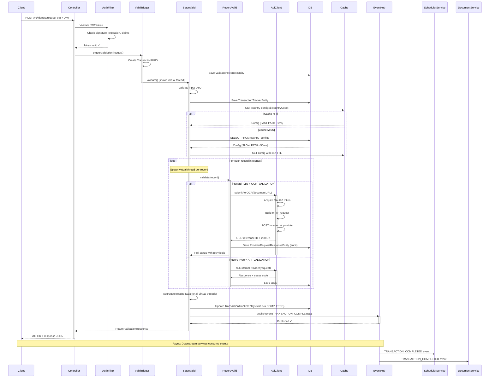

# ACV Services - Low-Level Design (LLD)

**Purpose:** Document internal code structure, class hierarchies, design patterns, data models, configuration management, and implementation details at the code level.

**Scope:** Detailed specifications for developers implementing features, debugging issues, and extending ACV Services.

---

## 1. Code Organization & Directory Structure

```
src/main/java/com/fedex/acv/
├── config/                                    # Spring configuration & dependency management
│   ├── CacheConfiguration.java               # Redis cache setup (TTL, serialization)
│   ├── ApplicationSecurityConfiguration.java # OAuth2, Spring Security, JWT validation
│   ├── ExecutorServiceConfiguration.java     # Virtual thread executor pool
│   └── JpaAuditingConfiguration.java         # JPA audit fields (createdBy, updatedBy)
│
├── controller/                                # REST API layer (Spring MVC)
│   ├── AccountCreationValidationsController.java   # Multi-stage validation endpoints
│   ├── ConfigurationController.java               # Configuration endpoints
│   └── AuthTokenController.java                   # OAuth2 token endpoints
│
├── service/                                   # Business logic orchestration layer
│   ├── validation/                            # Multi-stage validation services
│   │   ├── ValidationTriggerServiceImpl.java      # Bulk validation entry point
│   │   ├── StageValidationServiceImpl.java        # Multi-stage orchestration
│   │   ├── RecordValidationServiceImpl.java       # Individual record validation
│   │   ├── OCRValidationServiceImpl.java          # Document OCR integration
│   │   ├── CompleteTransactionServiceImpl.java    # Transaction completion
│   │   ├── RetryServiceImpl.java                  # Retry logic with polling
│   │   └── GenericValidationServiceImpl.java      # Validator factory/dispatcher
│   │
│   ├── external/                              # External provider integration
│   │   ├── ApiServiceClientImpl.java              # HTTP client for external providers
│   │   └── ConnectionsManagerServiceImpl.java     # Provider routing & integration
│   │
│   ├── configuration/                         # Configuration management
│   │   └── ConfigurationServiceImpl.java          # Load/cache country configs
│   │
│   ├── event/                                 # Event publishing
│   │   └── EventHubServiceImpl.java               # Azure Event Hubs publisher
│   │
│   ├── interfaces/                            # Service interfaces
│   │   ├── ValidationTriggerService.java
│   │   ├── StageValidationService.java
│   │   ├── RecordValidationService.java
│   │   └── (5+ more service interfaces)
│   │
│   └── impl/                                  # Implementation classes marked @Service
│
├── repository/                                # Data access layer (Spring Data JPA)
│   ├── ValidationRequestRepository.java
│   ├── TransactionTrackerRepository.java
│   ├── ProviderRequestResponseRepository.java
│   ├── CountryRepository.java
│   ├── CountryConfigRepository.java
│   └── AcvCrudConfigInfoRepository.java
│
├── domain/                                    # JPA entity classes (model layer)
│   ├── ValidationRequestEntity.java
│   ├── TransactionTrackerEntity.java
│   ├── ProviderRequestResponseEntity.java
│   ├── CountryEntity.java
│   ├── CountryConfigEntity.java
│   ├── ValidationTypeEntity.java
│   ├── ValidationSetEntity.java
│   ├── ValidationCategoryEntity.java
│   ├── RecordDetailsEntity.java
│   └── MapValidationRecordSetEntity.java
│
├── dto/                                       # Request/Response DTOs
│   ├── request/                               # Request DTOs
│   │   ├── ValidationRequest.java
│   │   ├── VerifyOtpRequest.java
│   │   ├── TriggerValidationRequest.java
│   │   ├── WregRequest.java
│   │   └── CompleteTransactionRequest.java
│   │
│   ├── response/                              # Response DTOs
│   │   ├── ValidationResponse.java
│   │   ├── ValidationResult.java
│   │   ├── RecordValidationResult.java
│   │   └── TransactionStatusResponse.java
│   │
│   ├── config/                                # Configuration DTOs
│   │   ├── CountryConfigDto.java
│   │   ├── DocumentRequirement.java
│   │   └── ValidationTypeDto.java
│   │
│   └── event/                                 # Event payload DTOs
│       └── ValidationEvent.java
│
├── exception/                                 # Custom exception hierarchy
│   ├── ValidationException.java
│   ├── ProviderIntegrationException.java
│   └── ConfigurationNotFoundException.java
│
├── util/                                      # Helper & utility classes
│   ├── ValidationResponseBuilder.java        # Fluent builder for responses
│   ├── TransactionUUIDGenerator.java         # Transaction ID generation
│   ├── ResponseTransformer.java              # Provider response transformation
│   ├── PiiMaskingUtil.java                   # Sensitive data masking
│   ├── DateTimeUtil.java                     # ISO 8601 date/time handling
│   └── ValidationRuleEvaluator.java          # Business rule evaluation
│
└── AcvServicesApplication.java                # Spring Boot main class
```

---

## 2. Core Classes & Responsibilities

### 2.1 REST Controller Layer

#### **AccountCreationValidationsController**

```java
@RestController
@RequestMapping("/v1")
@RequiredArgsConstructor
@Slf4j
public class AccountCreationValidationsController {
    
    private final ValidationTriggerService validationTriggerService;
    private final StageValidationService stageValidationService;
    private final TransactionTrackerRepository transactionTrackerRepo;
    
    // Endpoint: POST /v1/identity/request-otp
    // Purpose: Initiate identity verification with OTP
    @PostMapping("/identity/request-otp")
    public ResponseEntity<ValidationResponse> requestOtp(
        @Valid @RequestBody ValidationRequest request,
        @AuthenticationPrincipal OidcUser oidcUser
    ) {
        UUID transactionId = TransactionUUIDGenerator.generate();
        log.info("OTP Request: transactionId={}, applicant={}", 
                 transactionId, request.getFirstName());
        
        ValidationResponse response = stageValidationService.validate(
            "IDENTITY_VERIFICATION", request, transactionId
        );
        
        return ResponseEntity.ok(response);
    }
    
    // Endpoint: POST /v1/identity/verify-otp
    // Purpose: Verify OTP code; complete identity verification stage
    @PostMapping("/identity/verify-otp")
    public ResponseEntity<ValidationResponse> verifyOtp(
        @Valid @RequestBody VerifyOtpRequest request
    ) {
        log.info("OTP Verification: transactionId={}", request.getTransactionId());
        
        ValidationResponse response = stageValidationService.verifyOtp(
            request.getTransactionId(), request.getOtp()
        );
        
        return ResponseEntity.ok(response);
    }
    
    // Endpoint: POST /v1/records
    // Purpose: Submit compliance documents for multi-record validation
    @PostMapping("/records")
    public ResponseEntity<ValidationResponse> validateDocuments(
        @Valid @RequestBody WregRequest request
    ) {
        log.info("Document Validation: transactionId={}, records={}", 
                 request.getTransactionId(), request.getRecords().size());
        
        // Async processing - return 202 Accepted
        validationTriggerService.triggerValidation(
            buildTriggerRequest(request), 
            "RECORD_VALIDATION"
        );
        
        return ResponseEntity.accepted().body(
            ValidationResponse.builder()
                .status("VALIDATION_IN_PROGRESS")
                .message("Documents submitted for processing")
                .build()
        );
    }
    
    // Endpoint: GET /v1/transaction/{transactionId}
    // Purpose: Query current validation state for a transaction
    @GetMapping("/transaction/{transactionId}")
    public ResponseEntity<TransactionStatusResponse> getTransactionStatus(
        @PathVariable UUID transactionId,
        @RequestParam(defaultValue = "false") boolean includeDetails
    ) {
        TransactionTrackerEntity tracker = transactionTrackerRepo
            .findByTransactionId(transactionId)
            .orElseThrow(() -> new NotFoundException("Transaction not found"));
        
        return ResponseEntity.ok(
            TransactionStatusResponse.from(tracker, includeDetails)
        );
    }
}
```

**Key Patterns:**
- `@RequiredArgsConstructor` — Constructor injection via Lombok
- `@AuthenticationPrincipal` — Extract OAuth2 principal from Spring Security context
- `@Valid` — Trigger bean validation on DTOs before method execution
- Exception handling via `@ControllerAdvice` global handler

---

#### **ConfigurationController**

```java
@RestController
@RequestMapping("/config/v1")
@RequiredArgsConstructor
@Slf4j
public class ConfigurationController {
    
    private final ConfigurationService configurationService;
    
    @GetMapping("/countries")
    public ResponseEntity<List<CountryConfigDto>> getCountries() {
        return ResponseEntity.ok(configurationService.getAllCountries());
    }
    
    @GetMapping("/country/{countryCode}/documents")
    public ResponseEntity<DocumentRequirementDto> getDocumentRequirements(
        @PathVariable String countryCode
    ) {
        return ResponseEntity.ok(
            configurationService.getDocumentRequirements(countryCode)
        );
    }
}
```

---

### 2.2 Validation Orchestration Services

#### **ValidationTriggerServiceImpl** (Entry Point)

```java
@Service
@RequiredArgsConstructor
@Slf4j
public class ValidationTriggerServiceImpl implements ValidationTriggerService {
    
    private final StageValidationService stageValidationService;
    private final ValidationRequestRepository validationRequestRepo;
    private final ExecutorService virtualThreadExecutor;
    
    @Override
    public void triggerValidation(
        List<TriggerValidationRequest> requests,
        String validationStage
    ) throws ValidationException {
        log.info("Triggering bulk validation: {} requests, stage={}", 
                 requests.size(), validationStage);
        
        // Group requests by country
        Map<String, List<TriggerValidationRequest>> byCountry = requests.stream()
            .collect(Collectors.groupingBy(TriggerValidationRequest::getCountryCode));
        
        // Spawn virtual thread per transaction
        byCountry.forEach((country, countryRequests) -> {
            countryRequests.forEach(request -> {
                UUID transactionId = TransactionUUIDGenerator.generate();
                
                // Submit to virtual thread executor (non-blocking)
                virtualThreadExecutor.submit(() -> {
                    try {
                        validateTransaction(request, validationStage, transactionId);
                    } catch (Exception e) {
                        log.error("Validation failed: transactionId={}", transactionId, e);
                    }
                });
            });
        });
    }
    
    private void validateTransaction(
        TriggerValidationRequest request,
        String validationStage,
        UUID transactionId
    ) throws ValidationException {
        // Save initial request
        ValidationRequestEntity entity = ValidationRequestEntity.builder()
            .transactionId(transactionId)
            .countryCode(request.getCountryCode())
            .applicantFirstName(request.getApplicantFirstName())
            .applicantLastName(request.getApplicantLastName())
            .emailAddress(request.getEmailAddress())
            .documentType(request.getDocumentType())
            .documentId(request.getDocumentId())
            .status(ValidationStatus.PENDING)
            .build();
        
        validationRequestRepo.save(entity);
        
        // Convert to ValidationRequest and trigger stage validation
        ValidationRequest validationRequest = buildValidationRequest(request);
        stageValidationService.validate(validationStage, validationRequest, transactionId);
    }
}
```

**Design Pattern: Facade**
- Hides complexity of bulk request processing
- Simplifies client API for bulk triggering
- Manages request grouping and parallel execution

---

#### **StageValidationServiceImpl** (Orchestration Hub)

```java
@Service
@RequiredArgsConstructor
@Slf4j
public class StageValidationServiceImpl implements StageValidationService {
    
    private final ValidationRequestRepository validationRequestRepo;
    private final TransactionTrackerRepository transactionTrackerRepo;
    private final RecordValidationService recordValidationService;
    private final ConfigurationService configurationService;
    private final EventHubServiceImpl eventHubService;
    private final ExecutorService virtualThreadExecutor;
    
    @Override
    @Transactional
    public ValidationResponse validate(
        String validationStage,
        ValidationRequest request,
        UUID transactionUUID
    ) throws ValidationException {
        log.info("Stage validation: stage={}, transactionId={}", 
                 validationStage, transactionUUID);
        
        // 1. Validate input
        validateRequest(request);
        
        // 2. Save initial transaction state
        TransactionTrackerEntity tracker = saveTransactionState(
            transactionUUID, request, validationStage
        );
        
        // 3. Load stage configuration
        StageConfiguration stageConfig = configurationService
            .getStageConfiguration(validationStage, request.getCountryCode());
        
        // 4. Process records in parallel via virtual threads
        List<Future<ValidationResult>> futures = request.getRecords().stream()
            .map(record -> virtualThreadExecutor.submit(() -> 
                processRecord(record, stageConfig, validationStage, transactionUUID)
            ))
            .collect(Collectors.toList());
        
        // 5. Aggregate results (with timeout)
        List<ValidationResult> results = aggregateResults(futures);
        
        // 6. Update transaction state
        tracker.setStatus(computeStatus(results));
        tracker.setCompletedAt(LocalDateTime.now());
        transactionTrackerRepo.save(tracker);
        
        // 7. Publish event
        eventHubService.publishEvent(
            ValidationEvent.builder()
                .transactionId(transactionUUID)
                .stage(validationStage)
                .status(tracker.getStatus())
                .build()
        );
        
        // 8. Return response
        return buildResponse(results, tracker);
    }
    
    private ValidationResult processRecord(
        RecordDetail record,
        StageConfiguration stageConfig,
        String validationStage,
        UUID transactionUUID
    ) {
        try {
            return recordValidationService.validate(
                record, stageConfig, validationStage
            );
        } catch (Exception e) {
            log.error("Record validation failed: {}", record.getRecordCode(), e);
            return ValidationResult.failure("PROCESSING_ERROR", e.getMessage());
        }
    }
}
```

**Design Pattern: Orchestrator**
- Coordinates multiple service calls
- Manages virtual thread spawning for parallel processing
- Aggregates results from concurrent operations
- Updates transaction state and publish events

**Concurrency Strategy:**
- Virtual threads (1 per record) for lightweight concurrency
- `ExecutorService.newVirtualThreadPerTaskExecutor()` automatically manages JVM scheduling
- `Future.get()` with timeout prevents indefinite blocking
- Exception handling isolates record failures

---

#### **RecordValidationServiceImpl** (Individual Record Processing)

```java
@Service
@RequiredArgsConstructor
@Slf4j
public class RecordValidationServiceImpl implements RecordValidationService {
    
    private final GenericValidationServiceImpl validationFactory;
    private final ApiServiceClientImpl apiServiceClient;
    private final RetryService retryService;
    
    @Override
    public ValidationResult validate(
        RecordDetail record,
        StageConfiguration stageConfig,
        String validationStage
    ) {
        log.debug("Validating record: recordCode={}, stage={}", 
                  record.getRecordCode(), validationStage);
        
        // 1. Determine validation category
        ValidationCategory category = determineCategory(record, stageConfig);
        
        // 2. Route to appropriate validator based on category
        switch (category) {
            case OCR_VALIDATION:
                return validateViaOCR(record);
            
            case API_VALIDATION:
                return validateViaExternalAPI(record);
            
            case CONSENT_VALIDATION:
                return validateConsent(record);
            
            case RESULT_VALIDATION:
                return lookupResult(record);
            
            default:
                return ValidationResult.failure("UNKNOWN_CATEGORY", "");
        }
    }
    
    private ValidationResult validateViaOCR(RecordDetail record) {
        try {
            // Submit document for OCR processing
            String referenceId = apiServiceClient.submitForOCR(
                record.getDocumentURL()
            );
            
            // Poll for OCR completion with retry logic
            ValidationResult result = retryService.retryValidationWithPolling(
                referenceId, 
                5,           // maxRetries
                1000         // initialBackoffMs
            );
            
            return result;
            
        } catch (ProviderIntegrationException e) {
            log.warn("OCR submission failed: {}", record.getRecordCode(), e);
            return ValidationResult.retry("OCR_SUBMISSION_FAILED");
        }
    }
    
    private ValidationResult validateViaExternalAPI(RecordDetail record) {
        try {
            ConnectionRequest connRequest = ConnectionRequest.builder()
                .provider(record.getProviderType())
                .payload(record.getData())
                .build();
            
            Map<String, Object> response = apiServiceClient.callExternalProvider(
                connRequest
            );
            
            // Transform provider response to standard format
            ValidationResult result = ResponseTransformer.transformResponse(
                response, 
                record.getRecordCode()
            );
            
            return result;
            
        } catch (ProviderIntegrationException e) {
            log.warn("External API call failed: {}", record.getRecordCode(), e);
            return ValidationResult.retry("API_CALL_FAILED");
        }
    }
}
```

**Design Pattern: Strategy**
- Delegates to different validators based on record type
- Each validation category has separate implementation
- Encapsulates validation logic per category
- Supports adding new validation types without modifying this class

---

#### **RetryServiceImpl** (Retry Logic with Polling)

```java
@Service
@RequiredArgsConstructor
@Slf4j
public class RetryServiceImpl implements RetryService {
    
    private final ApiServiceClientImpl apiServiceClient;
    
    @Override
    public ValidationResult retryValidationWithPolling(
        String providerReference,
        int maxRetries,
        long initialBackoffMs
    ) {
        long backoffMs = initialBackoffMs;
        
        for (int attempt = 0; attempt < maxRetries; attempt++) {
            try {
                // Poll provider for result status
                Map<String, Object> status = apiServiceClient.pollStatus(
                    providerReference
                );
                
                if (isComplete(status)) {
                    return buildResult(status);
                }
                
                // Exponential backoff: 1s → 2s → 4s → 8s → etc.
                if (attempt < maxRetries - 1) {
                    Thread.sleep(backoffMs);
                    backoffMs *= 2;  // Exponential backoff multiplier
                }
                
            } catch (InterruptedException e) {
                Thread.currentThread().interrupt();
                return ValidationResult.retry("POLLING_INTERRUPTED");
            } catch (ProviderIntegrationException e) {
                log.warn("Poll attempt {}/{} failed", attempt + 1, maxRetries, e);
                
                if (attempt == maxRetries - 1) {
                    return ValidationResult.failure("MAX_RETRIES_EXCEEDED", 
                                                   e.getMessage());
                }
            }
        }
        
        return ValidationResult.retry("POLLING_TIMEOUT");
    }
}
```

**Design Pattern: Retry with Exponential Backoff**
- Prevents overwhelming external provider
- Handles transient failures gracefully
- Configurable retry count and initial backoff
- Exponential backoff: reduces retry frequency over time

---

### 2.3 External Integration Services

#### **ApiServiceClientImpl** (HTTP Client)

```java
@Service
@RequiredArgsConstructor
@Slf4j
public class ApiServiceClientImpl implements ApiServiceClient {
    
    private final RestTemplate restTemplate;
    private final AuthTokenController authTokenController;
    private final ProviderRequestResponseRepository providerResponseRepo;
    
    @Override
    @Retry(maxAttempts = 3, delay = @Delay(value = 2, unit = ChronoUnit.SECONDS))
    public Map<String, Object> callExternalProvider(
        ConnectionRequest connectionRequest
    ) throws ProviderIntegrationException {
        
        String provider = connectionRequest.getProvider();
        String endpoint = buildEndpoint(provider, connectionRequest);
        
        try {
            // 1. Acquire bearer token for provider
            String token = authTokenController.getToken(provider).getAccessToken();
            
            // 2. Build HTTP headers with token
            HttpHeaders headers = new HttpHeaders();
            headers.set("Authorization", "Bearer " + token);
            headers.setContentType(MediaType.APPLICATION_JSON);
            
            // 3. Build request entity
            HttpEntity<Map<String, Object>> request = new HttpEntity<>(
                connectionRequest.getPayload(),
                headers
            );
            
            // 4. Make HTTP call with timeout
            ResponseEntity<Map> response = restTemplate.postForEntity(
                endpoint,
                request,
                Map.class
            );
            
            // 5. Save audit trail
            saveAuditTrail(
                provider,
                connectionRequest.getPayload(),
                response.getBody(),
                response.getStatusCode().value(),
                connectionRequest.getTransactionId()
            );
            
            // 6. Validate response status
            if (!response.getStatusCode().is2xxSuccessful()) {
                throw new ProviderIntegrationException(
                    "Provider returned: " + response.getStatusCode()
                );
            }
            
            // 7. Mask PII before returning
            Map<String, Object> maskedResponse = PiiMaskingUtil.maskResponse(
                response.getBody()
            );
            
            log.info("Provider call successful: provider={}, statusCode={}", 
                     provider, response.getStatusCode());
            
            return maskedResponse;
            
        } catch (HttpClientErrorException | HttpServerErrorException e) {
            log.error("Provider API error: provider={}, status={}, body={}", 
                      provider, e.getStatusCode(), e.getResponseBodyAsString(), e);
            
            saveFailureAudit(provider, connectionRequest, e.getMessage());
            
            throw new ProviderIntegrationException(
                "Provider error: " + e.getStatusCode() + " - " + e.getMessage(),
                e
            );
        } catch (RestClientException e) {
            log.error("Communication error with provider: {}", provider, e);
            throw new ProviderIntegrationException(
                "Communication failed: " + e.getMessage(),
                e
            );
        }
    }
    
    private void saveAuditTrail(
        String provider,
        Map<String, Object> request,
        Map<String, Object> response,
        int statusCode,
        UUID transactionId
    ) {
        ProviderRequestResponseEntity audit = ProviderRequestResponseEntity.builder()
            .transactionId(transactionId)
            .provider(provider)
            .requestPayload(objectToJson(request))
            .responsePayload(objectToJson(response))
            .statusCode(statusCode)
            .createdAt(LocalDateTime.now())
            .build();
        
        providerResponseRepo.save(audit);
    }
}
```

**Design Patterns:**
- **Decorator (via @Retry):** Spring Retry annotation for automatic retry logic
- **Circuit Breaker:** Via Spring Cloud Circuit Breaker (optional)
- **Audit Trail:** Every external call saved to database for compliance

**Features:**
- Bearer token management via `authTokenController`
- Request/response audit logging to `ProviderRequestResponseRepository`
- PII masking for sensitive data
- Exponential backoff retry logic via `@Retry` annotation
- HTTP connection/read timeouts configured via `RestTemplate` bean

---

### 2.4 Configuration Service

#### **ConfigurationServiceImpl** (Config Management + Caching)

```java
@Service
@RequiredArgsConstructor
@Slf4j
public class ConfigurationServiceImpl implements ConfigurationService {
    
    private final CountryConfigRepository countryConfigRepo;
    private final ValidationTypeRepository validationTypeRepo;
    private final CacheManager cacheManager;
    
    @Override
    @Cacheable(
        value = "country-config",
        key = "#countryCode",
        cacheManager = "redisCache",
        unless = "#result == null"
    )
    public CountryConfigEntity getCountryConfiguration(String countryCode) 
            throws ConfigurationNotFoundException {
        
        log.debug("Fetching country config: countryCode={}", countryCode);
        
        // Redis cache check - if cached, returns immediately
        // If cache miss, queries database
        return countryConfigRepo.findByCountryCode(countryCode)
            .orElseThrow(() -> new ConfigurationNotFoundException(
                "Country configuration not found: " + countryCode
            ));
    }
    
    @Override
    @Cacheable(
        value = "validation-types",
        key = "#validationStage",
        cacheManager = "redisCache"
    )
    public ValidationTypeEntity getValidationType(String validationStage) {
        return validationTypeRepo.findByTypeCode(validationStage)
            .orElseThrow(() -> new ConfigurationNotFoundException(
                "Validation type not found: " + validationStage
            ));
    }
    
    @Override
    @CacheEvict(
        value = "country-config",
        key = "#countryCode"
    )
    public void invalidateCountryConfigCache(String countryCode) {
        log.info("Invalidating cache for country: {}", countryCode);
        // Called when config is updated via admin portal
    }
    
    @Override
    public List<CountryConfigDto> getAllCountries() {
        return countryConfigRepo.findAll().stream()
            .map(CountryConfigDto::from)
            .collect(Collectors.toList());
    }
}
```

**Caching Strategy:**
- `@Cacheable` — Auto-populate cache on first miss; return from cache on subsequent calls
- TTL (Time-To-Live) — Configured at `CacheConfiguration` (default 24 hours for country configs)
- `@CacheEvict` — Evict specific cache entry when config updated via admin portal
- Fallback to database if Redis unavailable (graceful degradation)

---

## 3. Data Models & Entity Classes

### 3.1 Transaction Entities

#### **ValidationRequestEntity**

```java
@Entity
@Table(name = "validation_requests", indexes = {
    @Index(name = "idx_transaction_id", columnList = "transaction_id"),
    @Index(name = "idx_country_code", columnList = "country_code"),
    @Index(name = "idx_status", columnList = "status")
})
@Data
@NoArgsConstructor
@AllArgsConstructor
@Builder
public class ValidationRequestEntity {
    
    @Id
    @GeneratedValue(strategy = GenerationType.UUID)
    private UUID transactionId;
    
    @Column(nullable = false)
    private String countryCode;
    
    @Column(nullable = false)
    private String applicantFirstName;
    
    @Column(nullable = false)
    private String applicantLastName;
    
    @Column(nullable = false)
    private String emailAddress;
    
    @Column(nullable = false)
    private String documentType;
    
    @Column(nullable = false)
    private String documentId;
    
    @Enumerated(EnumType.STRING)
    @Column(nullable = false)
    private ValidationStatus status;
    
    @CreationTimestamp
    @Column(nullable = false, updatable = false)
    private LocalDateTime createdAt;
    
    @UpdateTimestamp
    private LocalDateTime updatedAt;
    
    // Relationships
    @OneToMany(mappedBy = "validationRequest", cascade = CascadeType.ALL, 
               orphanRemoval = true)
    private List<RecordDetailsEntity> recordDetails = new ArrayList<>();
}

// Enum for validation status
@Getter
public enum ValidationStatus {
    PENDING("Awaiting processing"),
    IN_PROGRESS("Currently validating"),
    PASSED("Validation succeeded"),
    CONDITIONAL_PASS("Passed with warnings"),
    FAILED("Validation failed"),
    RETRY_NEEDED("Transient error, will retry"),
    EXPIRED("Transaction expired");
    
    private final String description;
    
    ValidationStatus(String description) {
        this.description = description;
    }
}
```

**Database Mapping:**
- Table: `validation_requests`
- Indexes on `transaction_id`, `country_code`, `status` for query performance
- UUID primary key for global uniqueness
- `createdAt` / `updatedAt` auto-populated via JPA `@CreationTimestamp` / `@UpdateTimestamp`
- One-to-many relationship with `RecordDetailsEntity`

---

#### **TransactionTrackerEntity**

```java
@Entity
@Table(name = "transaction_trackers", indexes = {
    @Index(name = "idx_txn_id", columnList = "transaction_id"),
    @Index(name = "idx_status", columnList = "status"),
    @Index(name = "idx_completed_at", columnList = "completed_at")
})
@Data
@NoArgsConstructor
@AllArgsConstructor
@Builder
public class TransactionTrackerEntity {
    
    @Id
    @GeneratedValue(strategy = GenerationType.IDENTITY)
    private Long id;
    
    @Column(nullable = false, unique = true)
    private UUID transactionId;
    
    @Enumerated(EnumType.STRING)
    @Column(nullable = false)
    private ValidationStage currentStage;
    
    @Enumerated(EnumType.STRING)
    @Column(nullable = false)
    private ValidationStatus status;
    
    @CreationTimestamp
    @Column(nullable = false, updatable = false)
    private LocalDateTime startTime;
    
    @UpdateTimestamp
    @Column(nullable = false)
    private LocalDateTime updateTime;
    
    private LocalDateTime completedAt;
    
    @Column(length = 1000)
    private String failureReason;
    
    // Audit fields
    private String createdBy;
    private String updatedBy;
}

// Enum for validation stages
public enum ValidationStage {
    IDENTITY_VERIFICATION,
    RECORD_VALIDATION,
    CREDIT_VALIDATION,
    FINAL_DETERMINATION,
    COMPLETED
}
```

---

#### **ProviderRequestResponseEntity** (Audit Trail)

```java
@Entity
@Table(name = "provider_request_responses", indexes = {
    @Index(name = "idx_txn_id", columnList = "transaction_id"),
    @Index(name = "idx_provider", columnList = "provider"),
    @Index(name = "idx_created_at", columnList = "created_at")
})
@Data
@NoArgsConstructor
@AllArgsConstructor
@Builder
public class ProviderRequestResponseEntity {
    
    @Id
    @GeneratedValue(strategy = GenerationType.IDENTITY)
    private Long id;
    
    @Column(nullable = false)
    private UUID transactionId;
    
    @Column(nullable = false)
    private String provider;
    
    @Column(nullable = false)
    private String externalReference;
    
    @Column(nullable = false, columnDefinition = "TEXT")
    private String requestPayload;
    
    @Column(columnDefinition = "TEXT")
    private String responsePayload;
    
    @Column(nullable = false)
    private Integer statusCode;
    
    @CreationTimestamp
    @Column(nullable = false, updatable = false)
    private LocalDateTime createdAt;
}
```

**Purpose:** Full audit trail of all external provider API calls for compliance and debugging.

---

### 3.2 Configuration Entities

#### **CountryConfigEntity**

```java
@Entity
@Table(name = "country_configs", uniqueConstraints = {
    @UniqueConstraint(columnNames = {"country_code", "config_type"})
})
@Data
@NoArgsConstructor
@AllArgsConstructor
@Builder
public class CountryConfigEntity {
    
    @Id
    @GeneratedValue(strategy = GenerationType.IDENTITY)
    private Long id;
    
    @Column(nullable = false)
    private String countryCode;
    
    @Column(nullable = false)
    private String configType;  // e.g., "VALIDATION_RULES", "DOCUMENT_REQUIREMENTS"
    
    @Column(nullable = false, columnDefinition = "TEXT")
    private String configValue;  // JSON string of configuration
    
    @Column(nullable = false)
    private Boolean isActive;
    
    @CreationTimestamp
    private LocalDateTime createdAt;
    
    @UpdateTimestamp
    private LocalDateTime updatedAt;
}
```

**Usage Pattern:**
```java
// Load config from database
CountryConfigEntity config = countryConfigRepo
    .findByCountryCodeAndConfigType("US", "VALIDATION_RULES");

// Parse JSON configValue
ValidationRuleSet rules = objectMapper.readValue(
    config.getConfigValue(),
    ValidationRuleSet.class
);

// Cache result in Redis for 24 hours
cache.put("country-config::US", rules);
```

---

### 3.3 Configuration Entities

#### **RecordDetailsEntity**

```java
@Entity
@Table(name = "record_details", indexes = {
    @Index(name = "idx_txn_id", columnList = "transaction_id"),
    @Index(name = "idx_record_code", columnList = "record_code")
})
@Data
@NoArgsConstructor
@AllArgsConstructor
@Builder
public class RecordDetailsEntity {
    
    @Id
    @GeneratedValue(strategy = GenerationType.IDENTITY)
    private Long id;
    
    @Column(nullable = false)
    private UUID transactionId;
    
    @Column(nullable = false)
    private String recordCode;
    
    @Column(nullable = false)
    private String documentType;
    
    @Enumerated(EnumType.STRING)
    @Column(nullable = false)
    private ValidationStatus status;
    
    @Column
    private Double confidence;  // 0.0 to 1.0
    
    @Column(columnDefinition = "TEXT")
    private String validationDetails;  // JSON
    
    @CreationTimestamp
    @Column(nullable = false, updatable = false)
    private LocalDateTime createdAt;
}
```

---

## 4. Design Patterns Used

### Pattern 1: **Factory Pattern** (Validator Selection)

```java
@Service
@RequiredArgsConstructor
public class GenericValidationServiceImpl {
    
    private final IdValidationService idValidator;
    private final LegalNameValidationService legalNameValidator;
    private final Map<String, ValidationService> validators;
    
    @PostConstruct
    public void registerValidators() {
        validators.put("ID_VALIDATION", idValidator);
        validators.put("LEGAL_NAME_VALIDATION", legalNameValidator);
    }
    
    public ValidationService getValidator(String validationType) {
        return validators.get(validationType);
    }
}

// Usage
ValidationService validator = validatorFactory.getValidator("ID_VALIDATION");
ValidationResult result = validator.validate(record);
```

**Benefit:** Decouple validator selection from validation logic; support dynamic validator registration.

---

### Pattern 2: **Strategy Pattern** (Record Validation)

```java
// Different strategies for different record categories
public interface RecordValidationStrategy {
    ValidationResult validate(RecordDetails record);
}

@Component
public class OCRValidationStrategy implements RecordValidationStrategy {
    @Override
    public ValidationResult validate(RecordDetails record) { /* OCR logic */ }
}

@Component
public class APIValidationStrategy implements RecordValidationStrategy {
    @Override
    public ValidationResult validate(RecordDetails record) { /* API logic */ }
}

// Context class uses strategy
@Service
@RequiredArgsConstructor
public class RecordValidationServiceImpl {
    private final Map<String, RecordValidationStrategy> strategies;
    
    public ValidationResult validate(RecordDetails record, String category) {
        RecordValidationStrategy strategy = strategies.get(category);
        return strategy.validate(record);
    }
}
```

**Benefit:** Encapsulate validation algorithms; switch strategies at runtime.

---

### Pattern 3: **Builder Pattern** (DTO Construction)

```java
@Builder
public class ValidationResponse {
    private UUID transactionId;
    private String status;
    private List<ValidationResult> results;
    private String message;
    private LocalDateTime timestamp;
}

// Usage - fluent API
ValidationResponse response = ValidationResponse.builder()
    .transactionId(txnId)
    .status("COMPLETED")
    .results(resultList)
    .message("Validation successful")
    .timestamp(LocalDateTime.now())
    .build();
```

**Benefit:** Immutable objects; readable construction; handle optional fields.

---

### Pattern 4: **Decorator Pattern** (Annotations via Spring)

```java
@Service
@Transactional  // Transaction management decorator
@Validated      // Bean validation decorator
public class StageValidationServiceImpl {
    
    @Cacheable(...)  // Caching decorator
    public CountryConfig getConfig(String code) { /* ... */ }
    
    @Retry(...)      // Retry decorator
    public Response callProvider(Request),{ /* ... */ }
    
    @Async           // Async execution decorator
    public void processAsync() { /* ... */ }
}
```

---

### Pattern 5: **Circuit Breaker Pattern** (Fault Tolerance)

```java
@Service
public class ApiServiceClientImpl {
    
    @CircuitBreaker(
        failureThreshold = 5,      // Fail after 5 failures
        delay = 30000,             // Wait 30s before retry
        successThreshold = 2       // Need 2 successes to close circuit
    )
    public Map<String, Object> callExternalProvider(
        ConnectionRequest request
    ) throws ProviderIntegrationException {
        // HTTP call - will fail fast if circuit open
    }
}
```

**States:**
- **CLOSED** — Normal operation; calls pass through
- **OPEN** — Too many failures; fail fast without calling provider
- **HALF_OPEN** — Limited calls to test if provider recovered

---

## 5. Request/Response Lifecycle (Sequence Diagram)



**Execution Timeline:**
1. **0-5ms:** JWT validation, input validation
2. **5-10ms:** Virtual thread spawning for records
3. **10-100ms:** Parallel record validation (overlapping)
4. **100-200ms:** Waiting for slowest record to complete
5. **200-210ms:** Result aggregation and state update
6. **210-220ms:** Event publishing to Event Hubs
7. **220ms+:** Return response to client

---

## 6. Configuration Properties Reference

### 6.1 Spring Boot Configuration (YAML)

```yaml
spring:
  application:
    name: acv-services
    version: 1.1.6
  
  # Server Configuration
  server:
    port: 8080
    servlet:
      context-path: /
  
  # Database Configuration
  datasource:
    url: ${DB_URL:jdbc:postgresql://localhost:5432/acv_validation}
    username: ${DB_USER:postgres}
    password: ${DB_PASSWORD:postgres}
    hikari:
      maximum-pool-size: 20
      minimum-idle: 5
      connection-timeout: 10000
      idle-timeout: 600000
      max-lifetime: 1800000
    driver-class-name: org.postgresql.Driver
  
  # JPA / Hibernate
  jpa:
    database: POSTGRESQL
    database-platform: org.hibernate.dialect.PostgreSQLDialect
    show-sql: false
    properties:
      hibernate:
        format_sql: true
        generate_statistics: false
        jdbc:
          batch_size: 20
          fetch_size: 50
        order_inserts: true
        order_updates: true
    hibernate:
      ddl-auto: validate  # Never auto-create schema in production
  
  # Redis Cache
  cache:
    type: redis
    redis:
      time-to-live: 86400000  # 24 hours in milliseconds
  
  redis:
    host: ${REDIS_HOST:localhost}
    port: ${REDIS_PORT:6379}
    timeout: 60000
    jedis:
      pool:
        max-active: 20
        max-idle: 10
        min-idle: 5
  
  # Security / OAuth2
  security:
    oauth2:
      resourceserver:
        jwt:
          issuer-uri: ${OKTA_ISSUER_URI:https://default.okta.com/oauth2/default}
          jwk-set-uri: ${OKTA_ISSUER_URI}/v1/keys
  
  # async / Virtual Threads
  threads:
    virtual:
      enabled: true    # Java 21+ only

# Logging Configuration
logging:
  level:
    ROOT: ${LOG_LEVEL:INFO}
    com.fedex.acv: DEBUG
    org.springframework.web: INFO
    org.hibernate: WARN
    org.hibernate.SQL: DEBUG
  pattern:
    console: "%d{yyyy-MM-dd HH:mm:ss} - %msg%n"
    file: "%d{yyyy-MM-dd HH:mm:ss} [%thread] %-5level %logger{36} - %msg%n"
  file:
    name: logs/application.log
    max-size: 10MB
    max-history: 30

# Actuator for health checks
management:
  endpoints:
    web:
      exposure:
        include: health,metrics,info,prometheus
  endpoint:
    health:
      show-details: always
```

---

## 7. Error Handling & Exception Hierarchy

```java
// Base exception class
public class AcvException extends RuntimeException {
    private final String errorCode;
    private final int httpStatus;
    
    public AcvException(String message, String errorCode, int httpStatus) {
        super(message);
        this.errorCode = errorCode;
        this.httpStatus = httpStatus;
    }
}

// Business logic exceptions
public class ValidationException extends AcvException {
    public ValidationException(String message) {
        super(message, "VALIDATION_ERROR", HttpStatus.BAD_REQUEST.value());
    }
}

public class ProviderIntegrationException extends AcvException {
    public ProviderIntegrationException(String message, Throwable cause) {
        super(message, "PROVIDER_ERROR", HttpStatus.BAD_GATEWAY.value());
        this.initCause(cause);
    }
}

public class ConfigurationNotFoundException extends AcvException {
    public ConfigurationNotFoundException(String message) {
        super(message, "CONFIG_NOT_FOUND", HttpStatus.INTERNAL_SERVER_ERROR.value());
    }
}

// Global exception handler
@RestControllerAdvice
@Slf4j
public class GlobalExceptionHandler {
    
    @ExceptionHandler(ValidationException.class)
    public ResponseEntity<ErrorResponse> handleValidationException(
        ValidationException ex,
        WebRequest request
    ) {
        log.warn("Validation error: {}", ex.getMessage());
        
        ErrorResponse error = ErrorResponse.builder()
            .status("VALIDATION_FAILED")
            .message(ex.getMessage())
            .errorCode("VALIDATION_ERROR")
            .timestamp(LocalDateTime.now())
            .path(request.getDescription(false))
            .build();
        
        return ResponseEntity.status(HttpStatus.BAD_REQUEST).body(error);
    }
    
    @ExceptionHandler(ProviderIntegrationException.class)
    public ResponseEntity<ErrorResponse> handleProviderException(
        ProviderIntegrationException ex
    ) {
        log.error("Provider integration error", ex);
        
        ErrorResponse error = ErrorResponse.builder()
            .status("PROVIDER_ERROR")
            .message(ex.getMessage())
            .errorCode("PROVIDER_ERROR")
            .timestamp(LocalDateTime.now())
            .build();
        
        return ResponseEntity.status(HttpStatus.BAD_GATEWAY).body(error);
    }
    
    @ExceptionHandler(Exception.class)
    public ResponseEntity<ErrorResponse> handleGenericException(Exception ex) {
        log.error("Unexpected error", ex);
        
        ErrorResponse error = ErrorResponse.builder()
            .status("INTERNAL_ERROR")
            .message("An unexpected error occurred")
            .errorCode("INTERNAL_ERROR")
            .timestamp(LocalDateTime.now())
            .build();
        
        return ResponseEntity.status(HttpStatus.INTERNAL_SERVER_ERROR).body(error);
    }
}
```

---

## 8. Testing Strategy

### 8.1 Unit Test Structure

```java
@SpringBootTest
@AutoConfigureMockMvc
class StageValidationServiceImplTest {
    
    @Mock
    private ValidationRequestRepository validationRequestRepo;
    
    @Mock
    private RecordValidationService recordValidationService;
    
    @InjectMocks
    private StageValidationServiceImpl serviceUnderTest;
    
    @Test
    void testValidate_WithValidRequest_ReturnsSuccess() {
        // Arrange
        ValidationRequest request = buildTestRequest();
        UUID transactionId = UUID.randomUUID();
        
        when(recordValidationService.validate(any(), any(), any()))
            .thenReturn(ValidationResult.pass(0.99));
        
        // Act
        ValidationResponse response = serviceUnderTest.validate(
            "IDENTITY_VERIFICATION", request, transactionId
        );
        
        // Assert
        assertThat(response.getStatus()).isEqualTo("IDENTITY_VERIFIED");
        verify(validationRequestRepo, times(1)).save(any());
    }
    
    @Test
    void testValidate_WithInvalidRequest_ThrowsValidationException() {
        // Arrange
        ValidationRequest invalidRequest = new ValidationRequest(); // empty
        
        // Act & Assert
        assertThrowsExactly(
            ValidationException.class,
            () -> serviceUnderTest.validate("IDENTITY_VERIFICATION", invalidRequest, UUID.randomUUID())
        );
    }
}
```

### 8.2 Integration Test Structure

```java
@SpringBootTest(webEnvironment = SpringBootTest.WebEnvironment.RANDOM_PORT)
@AutoConfigureMockMvc
@Testcontainers
class ValidationWorkflowIntegrationTest {
    
    @Container
    static PostgreSQLContainer<?> postgres = new PostgreSQLContainer<>("postgres:15")
        .withDatabaseName("acv_test")
        .withUsername("test")
        .withPassword("test");
    
    @Autowired
    private MockMvc mockMvc;
    
    @Autowired
    private ValidationRequestRepository validationRequestRepo;
    
    @Test
    void testCompleteValidationWorkflow() throws Exception {
        // 1. Request OTP
        MvcResult otpResult = mockMvc.perform(
            post("/v1/identity/request-otp")
                .header("Authorization", "Bearer " + getTestToken())
                .contentType(MediaType.APPLICATION_JSON)
                .content(objectMapper.writeValueAsString(buildTestRequest()))
        )
        .andExpect(status().isOk())
        .andReturn();
        
        String responseBody = otpResult.getResponse().getContentAsString();
        UUID transactionId = extractTransactionId(responseBody);
        
        // 2. Verify transaction was saved
        ValidationRequestEntity saved = validationRequestRepo
            .findByTransactionId(transactionId)
            .orElseThrow();
        
        assertThat(saved.getStatus()).isEqualTo(ValidationStatus.IN_PROGRESS);
    }
}
```

---

## 9. References

- [HLD.md](HLD.md) — Architecture and system design
- [services.md](services.md) — REST API contracts
- [code-mapping.md](code-mapping.md) — Class inventory
- [README.md](README.md) — Quick start guide
- [glossary.md](glossary.md) — Business and technical terminology

---

**Last Updated:** 2025-01-30  
**Version:** 1.1.6  
**Status:** Production  

For code-level questions or implementation details, contact the platform engineering team.
