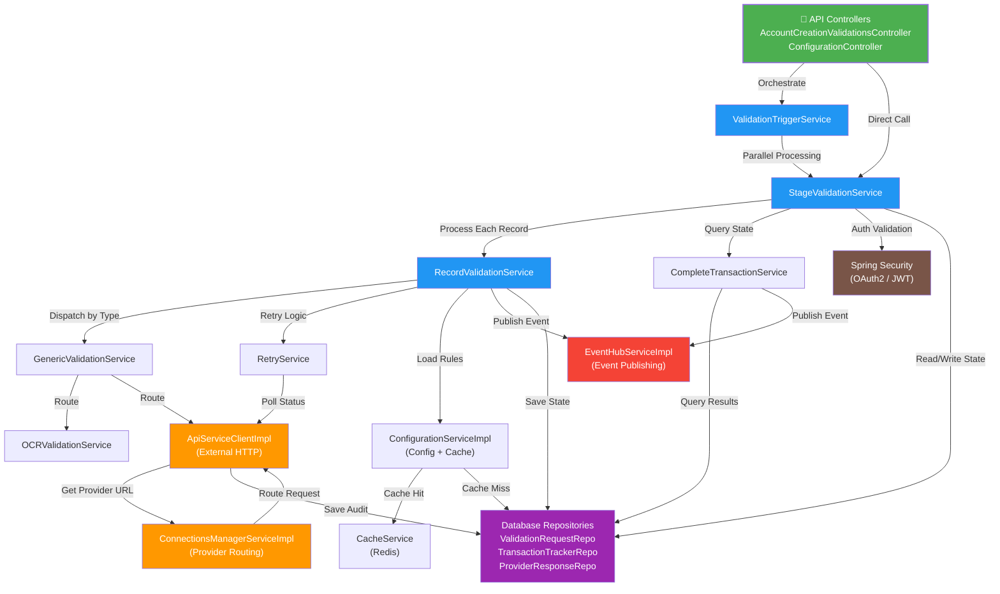
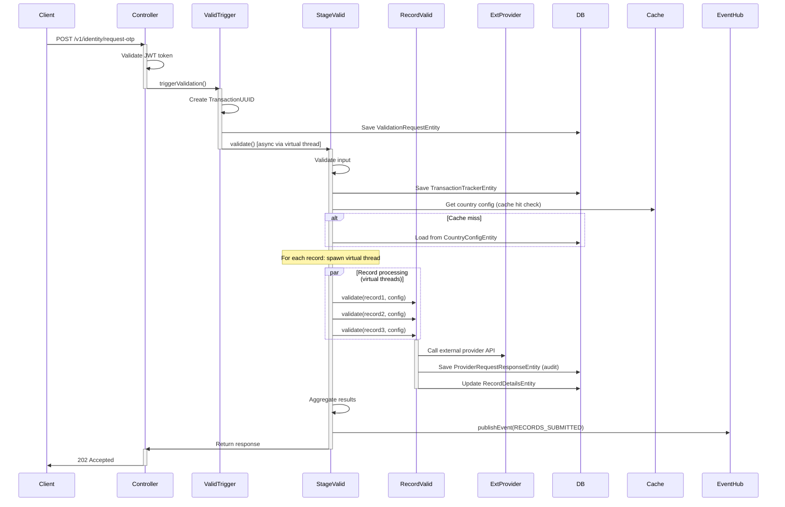

# ACV Services - Code Mapping & Reference

**Purpose:** Provide a comprehensive map of internal code structure, class inventory, dependency relationships, and implementation details.

**Scope:** All Java classes, Spring beans, configuration, and internal architecture of `eai-3540813-acv-services`.

---

## 1. Package Organization

ACV Services is organized into 7 functional packages under `com.fedex.acv`:

```
com.fedex.acv/
├── config/                          # Spring configuration and dependency injection
├── controller/                      # REST API endpoints (Spring MVC)
├── service/                         # Business logic orchestration
│   ├── validation/                  # Multi-stage validation services
│   ├── external/                    # External provider integration
│   ├── configuration/               # Config management
│   └── event/                       # Event publishing
├── repository/                      # Data access layer (Spring Data JPA)
├── domain/                          # JPA entity classes
├── dto/                             # Request/response transfer objects
├── exception/                       # Custom exception hierarchy
└── util/                            # Helper and utility classes
```

---

## 2. Package-to-Responsibility Map

| Package | Responsibility | Key Components |
|---------|-----------------|-----------------|
| **config** | Spring configuration, beans, security | CacheConfiguration, ApplicationSecurityConfiguration, JpaAuditingConfiguration |
| **controller** | HTTP request handling, response formatting | AccountCreationValidationsController, ConfigurationController, AuthTokenController |
| **service/validation** | Multi-stage validation orchestration, workflow management | ValidationTriggerServiceImpl, StageValidationServiceImpl, RecordValidationServiceImpl, CompleteTransactionServiceImpl, OCRValidationServiceImpl, RetryServiceImpl |
| **service/external** | External API integration, provider routing | ApiServiceClientImpl, ConnectionsManagerServiceImpl |
| **service/configuration** | Configuration loading, caching, defaults | ConfigurationServiceImpl |
| **service/event** | Event publishing to Azure Event Hubs | EventHubServiceImpl |
| **repository** | Database CRUD operations | 6 Spring Data JPA repositories |
| **domain** | JPA entity classes, table mappings | 10 entity classes with relationships |
| **dto** | Request/response serialization | 15+ DTO classes for API contracts |
| **exception** | Custom exception types | ValidationException, ProviderIntegrationException, ConfigurationNotFoundException |
| **util** | Helper functions, builders, transformers | ValidationResponseBuilder, TransactionUUIDGenerator, ResponseTransformer |

---

## 3. Class Inventory by Layer

### 3A. Controller Layer (3 controllers, ~20 endpoints)

| Class | File | Responsibility | Key Methods |
|-------|------|-----------------|-------------|
| `AccountCreationValidationsController` | `controller/AccountCreationValidationsController.java` | Manage identity & record validation workflows | `requestOtp()`, `verifyOtp()`, `validateDocuments()`, `getTransactionStatus()` |
| `ConfigurationController` | `controller/ConfigurationController.java` | Serve configuration endpoints | `getCountries()`, `getCountryDocuments()`, `getValidationTypes()` |
| `AuthTokenController` | `controller/AuthTokenController.java` | OAuth2 token management | `getToken()`, `refreshToken()` |

**Sample Endpoint Signature:**

```java
// AccountCreationValidationsController.java (lines 30-50)
@RestController
@RequestMapping("/v1")
@RequiredArgsConstructor
public class AccountCreationValidationsController {
    
    private final ValidationTriggerService validationTriggerService;
    private final StageValidationService stageValidationService;
    
    @PostMapping("/identity/request-otp")
    public ResponseEntity<ValidationResponse> requestOtp(
        @Valid @RequestBody ValidationRequest request
    ) {
        UUID transactionId = UUIDUtil.generateUUID();
        ValidationResponse response = stageValidationService.validate(
            "IDENTITY_VERIFICATION", request, transactionId
        );
        return ResponseEntity.ok(response);
    }
}
```

---

### 3B. Service Layer (8 services, 60+ methods)

#### **Validation Services:**

| Class | File | Responsibility | Key Methods |
|-------|------|-----------------|-------------|
| `ValidationTriggerServiceImpl` | `service/validation/ValidationTriggerServiceImpl.java` | Bulk validation entry point; spawn async tasks | `triggerValidation(List<TriggerValidationRequest>, String)` |
| `StageValidationServiceImpl` | `service/validation/StageValidationServiceImpl.java` | Multi-stage orchestration; parallel record processing | `validate(String, ValidationRequest, UUID)` |
| `RecordValidationServiceImpl` | `service/validation/RecordValidationServiceImpl.java` | Individual record validation; rule application | `validate(RecordDetailsEntity, ValidationSetEntity, String)` |
| `OCRValidationServiceImpl` | `service/validation/OCRValidationServiceImpl.java` | Document OCR submission & polling | `submitDataForOCR()`, `pollOCRStatus()` |
| `CompleteTransactionServiceImpl` | `service/validation/CompleteTransactionServiceImpl.java` | Transaction finalization; cert generation | `buildResponse(List<CompleteTransactionRequest>)` |
| `RetryServiceImpl` | `service/validation/RetryServiceImpl.java` | Retry logic with exponential backoff | `retryValidationWithPolling()`, `scheduleRetry()` |
| `GenericValidationServiceImpl` | `service/validation/GenericValidationServiceImpl.java` | Validator factory/dispatcher | `getValidator(String validationType)` |

**Sample Service Implementation:**

```java
// StageValidationServiceImpl.java (lines 50-150)
@Service
@RequiredArgsConstructor
@Slf4j
public class StageValidationServiceImpl implements StageValidationService {
    
    private final ValidationRequestRepository validationRequestRepo;
    private final TransactionTrackerRepository transactionTrackerRepo;
    private final RecordValidationService recordValidationService;
    private final ConfigurationService configurationService;
    private final ExecutorService virtualThreadExecutor;
    
    @Override
    public ValidationResponse validate(
        String validationStage,
        ValidationRequest request,
        UUID transactionUUID
    ) {
        // 1. Validate input
        validateRequest(request);
        
        // 2. Save initial transaction
        ValidationRequestEntity entity = buildEntity(request, transactionUUID);
        validationRequestRepo.save(entity);
        
        // 3. Get stage configuration
        StageConfiguration stageConfig = configurationService
            .getStageConfiguration(validationStage, request.getCountryCode());
        
        // 4. Process records in parallel via virtual threads
        List<Future<ValidationResult>> futures = request.getRecords().stream()
            .map(record -> virtualThreadExecutor.submit(() -> 
                recordValidationService.validate(record, stageConfig, validationStage)
            ))
            .collect(Collectors.toList());
        
        // 5. Aggregate results
        List<ValidationResult> results = futures.stream()
            .map(f -> {
                try { return f.get(5, TimeUnit.MINUTES); }
                catch (TimeoutException e) { return ValidationResult.timeout(); }
            })
            .collect(Collectors.toList());
        
        return buildResponse(results);
    }
}
```

#### **External Integration Services:**

| Class | File | Responsibility | Key Methods |
|-------|------|-----------------|-------------|
| `ApiServiceClientImpl` | `service/external/ApiServiceClientImpl.java` | HTTP client for external providers; auth/retry/masking | `callExternalProvider()`, `transformResponse()` |
| `ConnectionsManagerServiceImpl` | `service/external/ConnectionsManagerServiceImpl.java` | Provider routing & integration | `fetchData()`, `routeToProvider()` |

#### **Configuration Service:**

| Class | File | Responsibility | Key Methods |
|-------|------|-----------------|-------------|
| `ConfigurationServiceImpl` | `service/configuration/ConfigurationServiceImpl.java` | Load and cache country configs | `getCountryConfiguration()`, `getValidationRules()` |

#### **Event Service:**

| Class | File | Responsibility | Key Methods |
|-------|------|-----------------|-------------|
| `EventHubServiceImpl` | `service/event/EventHubServiceImpl.java` | Publish events to Azure Event Hubs | `publishEvent()`, `publishBatch()` |

---

### 3C. Repository Layer (6 repositories)

All extend Spring Data JPA `JpaRepository<T, ID>`:

| Class | File | Entity | Purpose | Custom Methods |
|-------|------|--------|---------|-----------------|
| `ValidationRequestRepository` | `repository/ValidationRequestRepository.java` | `ValidationRequestEntity` | Store validation requests | `findByTransactionId()`, `findByCountryCode()` |
| `TransactionTrackerRepository` | `repository/TransactionTrackerRepository.java` | `TransactionTrackerEntity` | Track transaction state | `findByTransactionIdAndStatus()`, `findExpiredTransactions()` |
| `ProviderRequestResponseRepository` | `repository/ProviderRequestResponseRepository.java` | `ProviderRequestResponseEntity` | Audit external API calls | `findByProviderAndExternalReference()` |
| `CountryRepository` | `repository/CountryRepository.java` | `CountryEntity` | Country master data | `findByCountryCode()`, `findByRegion()` |
| `CountryConfigRepository` | `repository/CountryConfigRepository.java` | `CountryConfigEntity` | Country-specific configuration | `findByCountryCodeAndConfigType()` |
| `AcvCrudConfigInfoRepository` | `repository/AcvCrudConfigInfoRepository.java` | `AcvCrudConfigInfo` | Generic key-value configuration | `findByConfigKey()` |

**Sample Repository:**

```java
// ValidationRequestRepository.java
@Repository
public interface ValidationRequestRepository extends JpaRepository<ValidationRequestEntity, UUID> {
    
    Optional<ValidationRequestEntity> findByTransactionId(UUID transactionId);
    
    List<ValidationRequestEntity> findByCountryCode(String countryCode);
    
    List<ValidationRequestEntity> findByStatusAndCountryCode(String status, String countryCode);
    
    @Query("SELECT v FROM ValidationRequestEntity v WHERE v.createdAt < CURRENT_TIMESTAMP - INTERVAL '30 days'")
    List<ValidationRequestEntity> findExpiredTransactions();
}
```

---

### 3D. Domain Layer (10 entities)

All are JPA `@Entity` classes mapped to PostgreSQL tables:

| Class | Table | Purpose | Key Fields |
|-------|-------|---------|------------|
| `ValidationRequestEntity` | `validation_requests` | Initial validation request capture | transactionId, countryCode, applicantName, documentType, status, createdAt |
| `TransactionTrackerEntity` | `transaction_trackers` | Multi-stage validation state | transactionId, currentStage, status, startTime, updateTime, completedAt |
| `ProviderRequestResponseEntity` | `provider_request_responses` | External API call audit trail | transactionId, provider, externalReference, requestPayload, responsePayload, statusCode |
| `CountryEntity` | `countries` | Country master data | countryCode, countryName, region, timezone, isActive |
| `CountryConfigEntity` | `country_configs` | Country-specific validation rules | countryCode, configType, configValue, isActive |
| `ValidationTypeEntity` | `validation_types` | Validation stage definitions | typeCode, description, processingTimeSeconds |
| `ValidationSetEntity` | `validation_sets` | Set of validation rules per country | validationSetCode, countryCode, validationTypes |
| `ValidationCategoryEntity` | `validation_categories` | Document category classifications | categoryCode, categoryName, requiredDocuments |
| `RecordDetailsEntity` | `record_details` | Individual record validation result | transactionId, recordCode, documentType, status, confidence |
| `MapValidationRecordSetEntity` | `map_validation_recordsets` | Mapping of records to validation sets | validationSetId, recordCode, isRequired |

**Sample Entity:**

```java
// ValidationRequestEntity.java
@Entity
@Table(name = "validation_requests")
@Data
@NoArgsConstructor
@AllArgsConstructor
public class ValidationRequestEntity {
    
    @Id
    private UUID transactionId;
    
    private String countryCode;
    private String applicantFirstName;
    private String applicantLastName;
    private String emailAddress;
    private String documentType;
    private String documentId;
    
    @Enumerated(EnumType.STRING)
    private ValidationStatus status;
    
    @CreationTimestamp
    private LocalDateTime createdAt;
    
    @UpdateTimestamp
    private LocalDateTime updatedAt;
    
    @OneToMany(mappedBy = "validationRequest", cascade = CascadeType.ALL)
    private List<RecordDetailsEntity> recordDetails = new ArrayList<>();
}
```

---

### 3E. DTO Layer (15+ classes)

Request and response transfer objects for API serialization:

**Authentication DTOs:**
- `AuthTokenRequest` — Token request payload
- `AuthTokenResponse` — Token response with expiry

**Validation Request DTOs:**
- `ValidationRequest` — Identity validation request
- `VerifyOtpRequest` — OTP verification request
- `TriggerValidationRequest` — Bulk validation trigger
- `WregRequest` — Multi-record compliance document request
- `CompleteTransactionRequest` — Transaction completion request

**Validation Response DTOs:**
- `ValidationResponse` — Standard API response wrapper
- `ValidationResult` — Individual validation result
- `RecordValidationResult` — Per-record validation outcome
- `TransactionStatusResponse` — Transaction state query response

**Configuration DTOs:**
- `CountryConfigDto` — Country configuration data transfer
- `DocumentRequirement` — Document requirement specification
- `ValidationTypeDto` — Validation type description

**Sample DTO:**

```java
// ValidationRequest.java
@Data
@NoArgsConstructor
@AllArgsConstructor
@Valid
public class ValidationRequest {
    
    @NotBlank
    private String firstName;
    
    @NotBlank
    private String lastName;
    
    @Email
    private String emailAddress;
    
    @NotBlank
    @Pattern(regexp = "^[A-Z]{2}$")
    private String countryCode;
    
    @NotNull
    private List<RecordDetail> records;
    
    @Data
    public static class RecordDetail {
        @NotBlank
        private String recordCode;
        
        @NotBlank
        private String documentType;
        
        @NotBlank
        private String documentURL;
    }
}
```

---

### 3F. Exception Layer (3 custom exceptions)

Custom exception hierarchy for specific error scenarios:

| Class | Parent | Purpose | HTTP Status |
|-------|--------|---------|-------------|
| `ValidationException` | `RuntimeException` | Validation business logic error | 400  Bad Request |
| `ProviderIntegrationException` | `RuntimeException` | External provider API error | 502 Bad Gateway |
| `ConfigurationNotFoundException` | `RuntimeException` | Missing configuration | 500 Internal Error |

**Exception Handler:**

```java
// GlobalExceptionHandler.java (via @ControllerAdvice)
@ExceptionHandler(ValidationException.class)
public ResponseEntity<ErrorResponse> handleValidationException(ValidationException ex) {
    return ResponseEntity.status(HttpStatus.BAD_REQUEST)
        .body(new ErrorResponse("VALIDATION_ERROR", ex.getMessage()));
}

@ExceptionHandler(ProviderIntegrationException.class)
public ResponseEntity<ErrorResponse> handleProviderError(ProviderIntegrationException ex) {
    return ResponseEntity.status(HttpStatus.BAD_GATEWAY)
        .body(new ErrorResponse("PROVIDER_ERROR", ex.getMessage()));
}
```

---

### 3G. Utility Classes (5+ utilities)

| Class | File | Purpose |
|-------|------|---------|
| `ValidationResponseBuilder` | `util/ValidationResponseBuilder.java` | Fluent builder for ValidationResponse DTO |
| `TransactionUUIDGenerator` | `util/TransactionUUIDGenerator.java` | Generate transaction UUIDs with tracking |
| `ResponseTransformer` | `util/ResponseTransformer.java` | Transform provider responses to ACV format |
| `PiiMaskingUtil` | `util/PiiMaskingUtil.java` | Mask sensitive data in logs |
| `DateTimeUtil` | `util/DateTimeUtil.java` | ISO 8601 date/time handling |

---

## 4. Service Dependency Graph



**Dependency Flow:**

```
Controller
  ↓ routes to
ValidationTriggerService (bulk entry point)
  ↓ spawns virtual threads for
StageValidationService (orchestration)
  ↓ processes records via
RecordValidationServiceImpl (individual record)
  ↓ dispatches to
  ├─ OCRValidationServiceImpl (for OCR_VALIDATION records)
  ├─ ApiServiceClientImpl (for API_VALIDATION records)
  ├─ CompleteTransactionServiceImpl (for COMPLETION)
  └─ RetryServiceImpl (for RETRY logic)
  
All services depend on:
  - ConfigurationServiceImpl (load rules)
  - EventHubServiceImpl (publish events)
  - Repositories (persist state)
  - Spring Security (authorize requests)
  - CacheService / Redis (cache configs)
```

---

## 5. Spring Beans & Configuration

### 5A. Configuration Classes

| Class | File | Purpose | Beans Created |
|-------|------|---------|---------------|
| `CacheConfiguration` | `config/CacheConfiguration.java` | Redis cache setup | `CacheManager`, `RedisTemplate` |
| `ApplicationSecurityConfiguration` | `config/ApplicationSecurityConfiguration.java` | OAuth2, Spring Security | `SecurityFilterChain`, `OidcUserService` |
| `ExecutorServiceConfiguration` | `config/ExecutorServiceConfiguration.java` | Virtual thread pool | `ExecutorService` (virtual threads) |
| `JpaAuditingConfiguration` | `config/JpaAuditingConfiguration.java` | JPA audit fields | `AuditorAware` (createdBy, updatedBy) |

**Sample Configuration:**

```java
// ExecutorServiceConfiguration.java
@Configuration
public class ExecutorServiceConfiguration {
    
    @Bean
    public ExecutorService virtualThreadExecutor() {
        return Executors.newVirtualThreadPerTaskExecutor();
    }
}

// ApplicationSecurityConfiguration.java
@Configuration
public class ApplicationSecurityConfiguration {
    
    @Bean
    public SecurityFilterChain securityFilterChain(HttpSecurity http) throws Exception {
        http
            .authorizeHttpRequests(auth -> auth
                .requestMatchers("/swagger-ui.html").permitAll()
                .requestMatchers("/v1/**").authenticated()
                .requestMatchers("/config/**").authenticated()
            )
            .oauth2ResourceServer(oauth2 -> oauth2
                .jwt(jwt -> jwt.decoder(jwtDecoder()))
            );
        return http.build();
    }
    
    @Bean
    public JwtDecoder jwtDecoder() {
        return NimbusJwtDecoder.withJwkSetUri(
            "https://okta-issuer.okta.com/oauth2/v1/keys"
        ).build();
    }
}
```

### 5B. Auto-Wired Dependencies (Constructor Injection)

Most services use Lombok's `@RequiredArgsConstructor` with constructor injection:

```java
@Service
@RequiredArgsConstructor
public class StageValidationServiceImpl implements StageValidationService {
    
    private final ValidationRequestRepository validationRequestRepo;           // Injected
    private final TransactionTrackerRepository transactionTrackerRepo;        // Injected
    private final RecordValidationService recordValidationService;           // Injected
    private final ConfigurationService configurationService;                // Injected
    private final EventHubServiceImpl eventHubService;                       // Injected
    private final ExecutorService virtualThreadExecutor;                    // From bean
    
    // Constructor auto-generated by Lombok
}
```

---

## 6. Data Flow: Request to Response



---

## 7. Method Signatures (Key Operations)

### Validation Service Methods

```java
// ValidationTriggerService
void triggerValidation(
    List<TriggerValidationRequest> requests,
    String validationStage
) throws ValidationException;

// StageValidationService (primary orchestrator)
ValidationResponse validate(
    String validationStage,
    ValidationRequest request,
    UUID transactionUUID
) throws ValidationException;

// RecordValidationService
ValidationResult validate(
    RecordDetailsEntity record,
    ValidationSetEntity validationSet,
    String validationStage
) throws ProviderIntegrationException;

// OCRValidationService
String submitDataForOCR(
    String documentURL,
    String recordCode,
    UUID transactionUUID
) throws ValidationException;

// CompleteTransactionService
void buildResponse(
    List<CompleteTransactionRequest> requests
) throws ValidationException;

// ConfigurationService
CountryConfigEntity getCountryConfiguration(
    String countryCode
) throws ConfigurationNotFoundException;
```

---

## 8. Testing Strategy

### Test Organization

```
src/test/java/com/fedex/acv/
├── controller/
│   ├── AccountCreationValidationsControllerTest.java
│   └── ConfigurationControllerTest.java
├── service/
│   ├── validation/
│   │   ├── StageValidationServiceImplTest.java
│   │   ├── RecordValidationServiceImplTest.java
│   │   └── CompleteTransactionServiceImplTest.java
│   └── external/
│       └── ApiServiceClientImplTest.java
├── integration/
│   ├── ValidationWorkflowIntegrationTest.java
│   └── ProviderIntegrationTest.java
└── testdata/
    ├── fixtures/
    └── mocks/
```

### Sample Unit Test

```java
@SpringBootTest
class StageValidationServiceImplTest {
    
    @Mock
    private ValidationRequestRepository validationRequestRepo;
    
    @Mock
    private RecordValidationService recordValidationService;
    
    @InjectMocks
    private StageValidationServiceImpl stageValidationService;
    
    @Test
    void testValidate_WithValidRequest_ReturnsSuccess() {
        // Arrange
        ValidationRequest request = buildTestRequest();
        UUID transactionId = UUID.randomUUID();
        
        when(recordValidationService.validate(any(), any(), any()))
            .thenReturn(ValidationResult.pass());
        
        // Act
        ValidationResponse response = stageValidationService.validate(
            "IDENTITY_VERIFICATION", request, transactionId
        );
        
        // Assert
        assertThat(response.getStatus()).isEqualTo("IDENTITY_VERIFIED");
        verify(validationRequestRepo, times(1)).save(any());
    }
}
```

---

## 9. Key Integration Points

### Database Connections

```java
// Spring Data JPA auto-configuration
spring:
  datasource:
    url: jdbc:postgresql://localhost:5432/acv_validation
    username: postgres
    password: admin
    hikari:
      maximum-pool-size: 20
  jpa:
    hibernate:
      ddl-auto: validate
```

### Redis Cache Integration

```java
// Via acv-commons CacheService
@Cacheable("country-config::#{#countryCode}", cacheManager = "redisCache")
public CountryConfigEntity getCountryConfiguration(String countryCode) {
    // First call: fetches from database
    // Subsequent calls: fetches from Redis (24h TTL)
}
```

### Azure Event Hubs Integration

```java
// Via acv-commons EventHubProducer
@Bean
public EventHubProducer eventHubProducer(
    AzureEventHubsProperties properties
) {
    return new EventHubProducer(properties.getConnectionString());
}

// Usage in EventHubServiceImpl
eventHubProducer.sendEvent(
    "acv-validation-events",
    new ValidationEvent(transactionId, "TRANSACTION_COMPLETED")
);
```

### OAuth2 Authentication

```java
// Spring Security auto-configures via application.yml
spring:
  security:
    oauth2:
      resourceserver:
        jwt:
          issuer-uri: https://okta-tenant.okta.com/oauth2/default
          jwk-set-uri: https://okta-tenant.okta.com/oauth2/v1/keys
```

---

## 10. References

- [HLD.md](HLD.md) — Architecture and component relationships
- [services.md](services.md) — API endpoint reference
- [README.md](README.md) — Quick start and configuration
- [glossary.md](glossary.md) — Technical terminology

---

**Last Updated:** 2025-01-30  
**Version:** 1.1.6  
**Status:** Production  

Source files are located in `src/main/java/com/fedex/acv/` directory.
