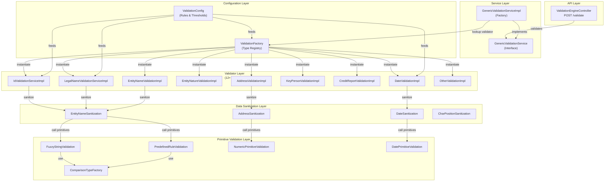
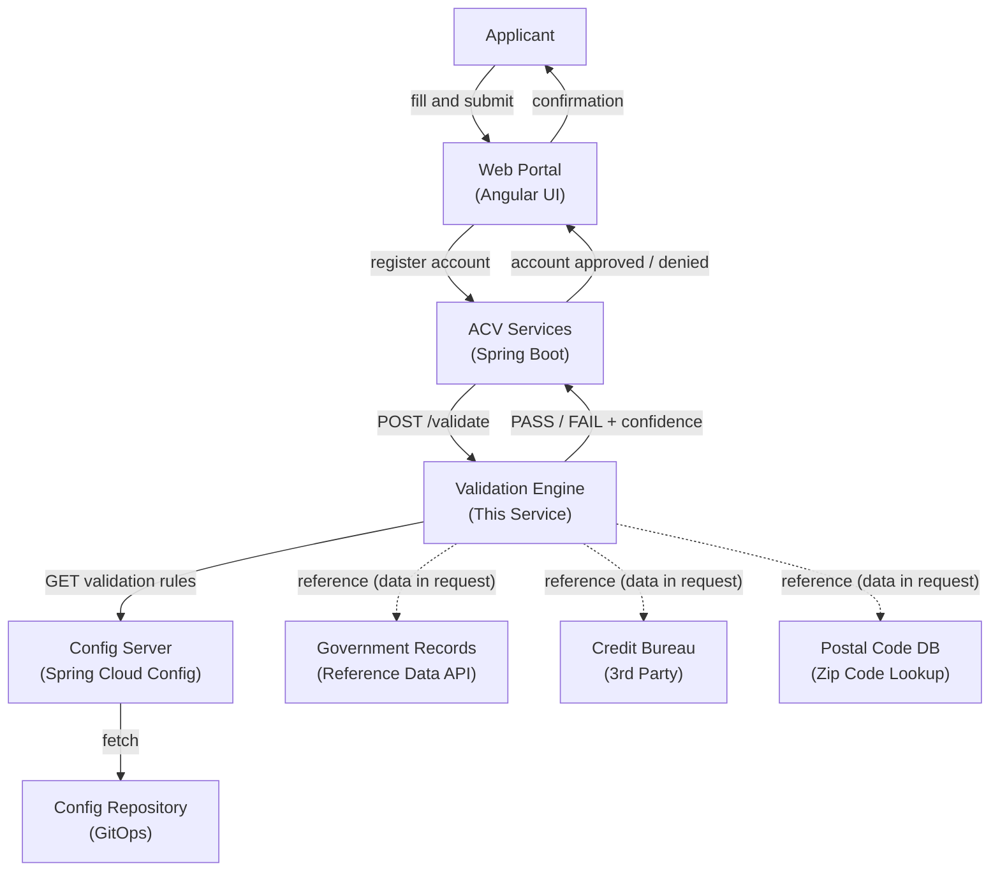
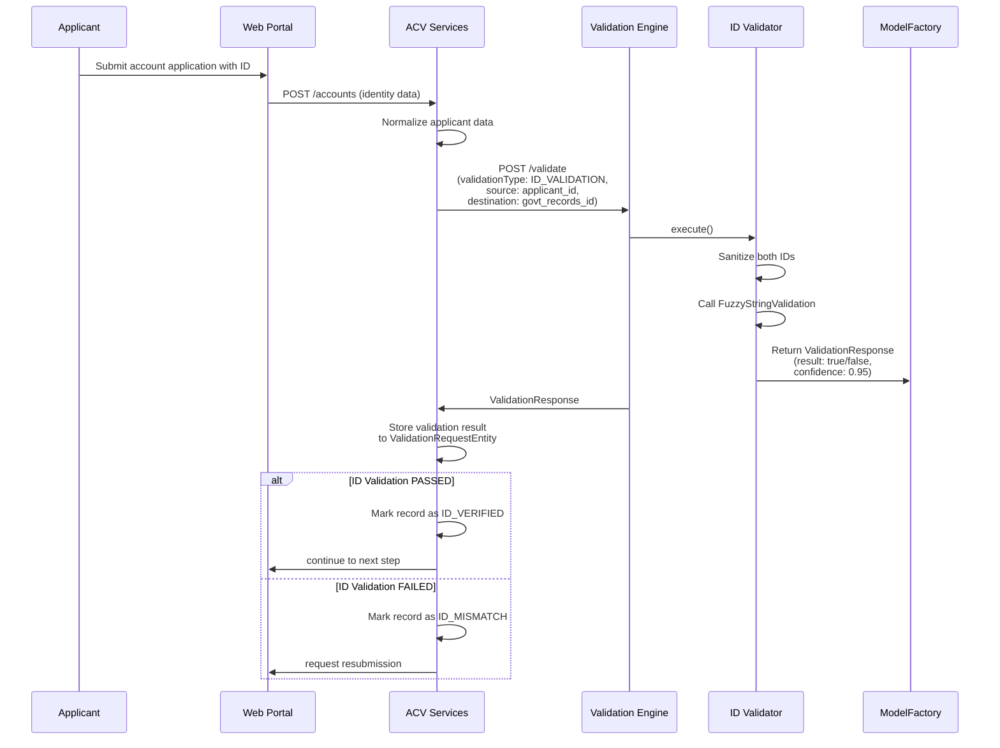
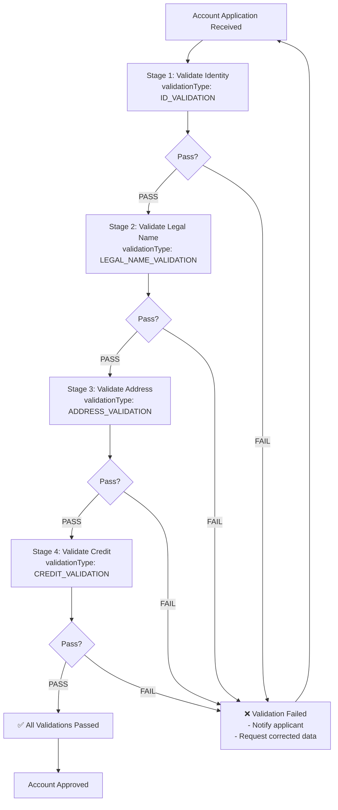

# ACV Validation Engine - High-Level Design

**Purpose:** Describe the overall architecture, major components, business flows, and design decisions for the ACV Validation Engine.

**Scope:** Microservice scope - the validation engine as a standalone service, its role in the ACV platform ecosystem, validator plugins, and business rule evaluation framework.

---

## 1. Purpose & Scope

### Business Purpose

The ACV Validation Engine is the **centralized rules execution layer** for the Account Creation Validations platform. It evaluates compliance data (applicant-provided and reference data) against configured business rules to determine pass/fail outcomes.

**Key Responsibility:**
- Accept validation requests with source (applicant) and destination (reference) data
- Execute business logic comparison using 12+ pluggable validators
- Return pass/fail result with confidence score and validation details
- Support configurable thresholds, comparison types, and sanitization rules

### Scope Boundaries

**In Scope:**
- Validation request routing to appropriate validators (Factory pattern)
- 12+ validator implementations (ID, Name, Legal Entity, Date, Address, Credit, etc.)
- Primitive validation operations (fuzzy matching, predefined rules, numeric, date operations)
- Data sanitization and normalization before validation
- RESTful /validate endpoint and request/response contracts
- Configuration-driven rule registry

**Out of Scope:**
- Audit logging and compliance tracking (handled by ACV Services)
- Database persistence of validation results (ACV Services responsibility)
- Multi-language support
- Real-time credit report fetching (assumed data already provided in request)
- User authentication/authorization (delegated to API Gateway)

---

## 2. Business Context

### Stakeholders & Use Cases

| Stakeholder | Use Case | Interaction |
|-------------|----------|------------|
| **Compliance Officer** | Define validation rules per offering | Implements validator, adds to factory registry |
| **ACV Services** | Validate applicant data | Calls /validate endpoint with data + validator type |
| **Applicant/Customer** | Pass account opening validation | Indirect — data flows through ACV Services → Validation Engine |
| **Operations** | Monitor validation pass/fail rates | Observability metrics from engine |
| **Auditor** | Trace validation decisions | Validation config + audit logs from ACV Services |

### Integration Points

```
┌─────────────────────────────────────────────────────────┐
│  ACV Platform Ecosystem                                  │
│                                                          │
│  ┌──────────────────┐                                   │
│  │  ACV Services    │────────────► Validation Engine    │
│  │  (Orchestrator)  │◄────────────    (This Service)    │
│  └──────────────────┘  HTTP /validate                  │
│          │                                               │
│          ├──► Config Server ────────► Config Repo      │
│          ├──► Database Service ────► PostgreSQL/DB    │
│          └──► Message Queue ────────► RabbitMQ/Kafka  │
│                                                          │
│  ┌──────────────────┐   ┌─────────────────────────┐    │
│  │ Document Service │   │ API Connector Service   │    │
│  └──────────────────┘   └─────────────────────────┘    │
│                                                          │
└─────────────────────────────────────────────────────────┘
```

### Business Rules Being Validated

1. **ID Validation** — Applicant ID matches government records (license, passport)
2. **Legal Name Validation** — Business legal name matches company registry
3. **Entity Type Validation** — Business entity type (LLC, Corporation, etc.) matches declared type
4. **Key Personnel Validation** — Named officers/directors match UCC filings
5. **Address Validation** — Address format and postal code validity
6. **Date Validation** — Dates within valid ranges (incorporation date, birth date, expiry date)
7. **Credit Validation** — Credit score meets minimum thresholds
8. **Relationship Validation** — Cross-field consistency (all addresses match expected format)

---

## 3. Technology Stack

| Layer | Technology | Version | Rationale |
|-------|-----------|---------|-----------|
| **Runtime** | Java | 21 LTS | Type safety, garbage collection, mature ecosystem |
| **Runtime Container** | Spring Boot | 3.3.x | Auto-configuration, standalone JAR, embedded server |
| **REST API** | Spring Web | 3.3.x | RESTful endpoints, auto JSON serialization |
| **Configuration** | Spring Cloud Config / YAML | 2024.x | Externalized configuration, environment profiles |
| **Testing** | JUnit 5 + Mockito | Spring Boot 3.3.x | Modern assertions, mock framework |
| **Logging** | SLF4J + Logback | Default | Structured logging, JSON output for aggregation |
| **Build** | Maven | 3.9+ | Dependency management, plugin ecosystem |
| **Container** | Docker | Latest | Kubernetes-compatible packaging |
| **Orchestration** | Kubernetes | 1.29+ | Service mesh integration, auto-healing, scaling |

---

## 4. Major Components

### System Architecture Diagram



### Component Responsibilities

#### 1. **ValidationEngineController** (`controller/`)

- **Role:** HTTP REST API entry point
- **Responsibility:** Accept /validate requests, deserialize JSON, delegate to service layer
- **Dependency:** GenericValidationService
- **File:** `ValidationEngineController.java`

#### 2. **GenericValidationService/GenericValidationServiceImpl** (`service/`)

- **Role:** Validation factory and orchestrator
- **Responsibility:** 
  - Accept ValidationDto (request)
  - Look up appropriate validator from ValidationFactory based on validationType
  - Invoke selected validator.validate()
  - Return ValidationResponse
- **Design Pattern:** Factory + Strategy
- **Files:** 
  - `GenericValidationService.java` (interface)
  - `GenericValidationServiceImpl.java` (implementation)

#### 3. **Validator Layer** (`service/impl/`)

**12+ Pluggable Validators, each implementing `ValidationTypeInterface`:**

| Validator | File | Comparison Logic | Data Type |
|-----------|------|------------------|-----------|
| ID Validation | `IdValidationServiceImpl.java` | Fuzzy match ID fields | String |
| Legal Name Validation | `LegalNameValidationServiceImpl.java` | Fuzzy match company names | String |
| Entity Name Validation | `EntityNameValidationImpl.java` | Exact/Fuzzy name comparison | String |
| Entity Nature Validation | `EntityNatureValidationImpl.java` | Predefined rule validation | Enum/String |
| Date Validation | `DateValidationImpl.java` | Date range validation | Date |
| Key Person Validation | `KeyPersonValidationImpl.java` | Name matching against registry | String |
| Credit Report Validation | `CreditReportValidationImpl.java` | Numeric threshold comparison | Numeric |
| Address Validation | `AddressValidationImpl.java` | Postal validation, format check | String |
| Type Registration Validation | `TypeRegValidationImpl.java` | Predefined rule validation | Enum/String |
| Record Status Validation | `RecStatusValidationImpl.java` | Predefined rule validation | Enum/String |
| Name Validation | `NameValidationImpl.java` | Fuzzy match generic names | String |
| Other Validation | `OtherValidationImpl.java` | Catch-all custom rules | Mixed |

**Flow per Validator:**
```
ValidationDto (request)
    ↓
Sanitization (trim, lowercase, remove special chars)
    ↓
Primitive Validation (fuzzy match, rule lookup, numeric comparison)
    ↓
ValidationResponse (result: true/false, confidence: 0.0-1.0)
```

#### 4. **Data Sanitization Layer** (`sanitization/`)

Normalizes and cleans input data before validation:

| Sanitizer | Purpose | Example |
|-----------|---------|---------|
| `EntityNameSanitization` | Remove special chars, normalize spaces, lowercase | "John & DOE" → "john doe" |
| `DateSanitization` | Parse date formats, normalize to ISO-8601 | "01/15/1990" → "1990-01-15" |
| `AddressSanitization` | Normalize address components, postal codes | "123 Main ST." → "123 main st" |
| `CharPositionSanitization` | Remove leading/trailing spaces, collapse spaces | "  John  Doe  " → "john doe" |
| `NameSanitization` | Name-specific normalization | "O'BRIEN" → "obrien" |

#### 5. **Primitive Validation Layer** (`service/impl/primitives/`)

Core validation operations reused across all validators:

| Primitive | Purpose | Example |
|-----------|---------|---------|
| `FuzzyStringValidation` | Levenshtein distance matching | "John" vs "Jon" = 0.75 similarity |
| `PredefinedRuleValidation` | Check against whitelist/blacklist | Is "LLC" in allowed entity types? |
| `NumericPrimitiveValidation` | Numeric comparisons (GT, LT, EQUALS, IN_RANGE) | Is 750 >= 700 (credit score threshold)? |
| `DatePrimitiveValidation` | Date range validation, expiry checks | Is date between min and max? |
| `StringPrimitiveOperations` | String operations (contains, startswith, regex) | Does address contain zip code? |
| `ComparisonTypeFactory` | Dispatch to appropriate comparison logic | Route to FUZZY_MATCH or EXACT_MATCH |

#### 6. **ValidationFactory** (`factory/`)

- **Role:** Validator type registry and instantiation
- **Responsibility:** 
  - Maintain mapping of validationType → Validator implementation
  - Instantiate and return validator based on type
  - Support registration of new validators (extensibility)
- **File:** `ValidationFactory.java`
- **Pattern:** Abstract Factory

#### 7. **Configuration Layer** (`config/`, `constants/`, `enums/`)

**Files:**

| File | Purpose | Content |
|------|---------|---------|
| `ValidationConstants.java` | Static validation thresholds and limits | Fuzzy match threshold (0.85), max distance (2) |
| `EntityNames.java` | Predefined entity types and code mappings | LLC, Corp, S-Corp, etc. |
| `CompanyConfigurations.java` | Company-specific validation rules | Industry-specific address formats |
| `AddressConfiguration.java` | Address validation rules | Postal code patterns, state codes |
| `ValidationConfig.java` (DTO) | Runtime validation configuration | Comparison type, threshold per request |

**application-dev.yml:**

```yaml
validation-engine:
  fuzzy-match:
    enabled: true
    default-threshold: 0.85
    max-fuzzy-distance: 2
  
  predefined-rules:
    cache-enabled: true
    cache-ttl-minutes: 60
  
  sanitization:
    enabled: true
    lowercase: true
    remove-special-chars: true
```

---

## 5. System Context Diagram



**Key Relationships:**
- **ACV Services → Validation Engine** (Synchronous HTTP POST)
- **Validation Engine ← Config Server** (Async configuration fetch)
- **Validation Engine uses reference data already in request** (no direct DB calls for reference data assumed)

---

## 6. Primary Business Flows

### Flow 1: Account Opening with ID Validation



### Flow 2: Multi-Field Validation Pipeline



---

## 7. Non-Functional Requirements

| Requirement | Target | Rationale |
|-------------|--------|-----------|
| **Latency** | p50 < 100ms, p99 < 500ms per validation | Must not block account opening flow |
| **Throughput** | 1,000 validations/sec (horizontal scalable) | Peak account opening load |
| **Availability** | 99.9% uptime (production SLA) | Compliance requirement |
| **Scalability** | Horizontal scaling via Kubernetes replicas | Microservice architecture |
| **Consistency** | Strong consistency for validation rules | Rules must not change mid-flow |
| **Backward Compatibility** | Support multiple API versions | Gradual rollout of new validators |
| **Observability** | Structured logging, metrics, traces | Debugging validation failures |
| **Security** | mTLS service-to-service, data encryption in transit | PCI-DSS compliance |

---

## 8. Integration Points

### Upstream Callers

| System | Protocol | Frequency | Data Volume |
|--------|----------|-----------|------------|
| **ACV Services** | HTTP REST (sync POST /validate) | Per record validation | 1 req/ms peak |
| **API Automation Tests** | HTTP REST | Pre-deployment | Test data only |

### Downstream Dependencies

| System | Type | Purpose | Frequency |
|--------|------|---------|-----------|
| **Config Server** | HTTP REST (GET config) | Load validation rules on startup or refresh | On deploy/restart |
| **Logging Aggregation** (ELK/Splunk) | Async via sysout | Store validation audit trail | Every validation |

### Data Flows

```
ACV Services
    ↓
POST /validate {transId, validationType, validationData, config}
    ↓
Validation Engine applies rules
    ↓
{validationResult: bool, confidence: float, details: object}
    ↓
ACV Services stores result → ValidationRequestEntity
    ↓
RecordDetailsEntity updated with validation status
```

---

## 9. Key Design Decisions

| Decision | Rationale | Trade-off |
|----------|-----------|-----------|
| **Factory + Strategy Pattern** | Easy to add new validators without modifying existing code (Open/Closed Principle). Single entry point. | Slight indirection; requires factory registration |
| **Sanitization Layer** | Normalize data before validation for consistent results across different input formats | Small performance overhead per validation |
| **Synchronous Request-Response (HTTP)** | Simple integration with ACV Services; no async message queue complexity | Less resilient to network failures (timeouts handled by caller) |
| **Configuration-Driven Rules** | Enable rule changes without code redeployment; supports A/B testing of thresholds | YAML config can become complex; need version control |
| **Confidence Scores (0.0-1.0)** | Allow ACV Services to make nuanced decisions (e.g., review manually if 0.7-0.85 confidence) | Requires business logic in ACV Services to interpret scores |
| **Pluggable Validators** | Support new validator types (e.g., PhoneValidation) without core engine changes | New validators need to implement ValidationTypeInterface |

---

## 10. Assumptions & Constraints

### Assumptions

1. **Reference data already in request** — Validation Engine receives both source (applicant) and destination (reference) data in the request; does not fetch from external databases
2. **Stateless validation** — No session state maintained between requests; each validation is independent
3. **Synchronous processing** — Validations complete within 500ms; no long-running batch operations
4. **Sanitization is idempotent** — Multiple sanitization passes produce same result
5. **Configuration is consistent** — All instances see same validation rules via Config Server

### Constraints

1. **No persistence** — Validation Engine does NOT store results; ACV Services responsible for audit trail
2. **No authentication/authorization** — Delegated to API Gateway; engine trusts caller
3. **Single primary validator per type** — Each validationType maps to ONE primary validator (fallback to OtherValidationImpl)
4. **No multi-language support** — Error messages in English only
5. **No real-time credit fetching** — Assumes credit score already fetched and passed in request

---

## 11. Future Roadmap

| Feature | Timeline | Business Value |
|---------|----------|-----------------|
| **ML-based Fuzzy Matching** | Q2 2025 | Improve accuracy of name/ID matching beyond Levenshtein distance |
| **Async Validation** | Q3 2025 | Support long-running validators (real-time credit report fetch) |
| **A/B Testing Framework** | Q3 2025 | Test different validation thresholds for cohort experiments |
| **Validation Rule Marketplace** | Q4 2025 | Allow third-party validator plugins (e.g., industry-specific validators) |
| **GraphQL API** | Q4 2025 | Reduce over-fetching compared to REST |
| **Real-time Metrics Dashboard** | Q2 2025 | Validation pass rates, performance tracking |

---

## Cross-References

- [Low-Level Design (LLD.md)](LLD.md) — Code-level class structure, method signatures
- [Service Contracts (services.md)](services.md) — REST API request/response schemas
- [Code Mapping (code-mapping.md)](code-mapping.md) — Class inventory and dependency graph
- [Glossary (glossary.md)](glossary.md) — Terminology definitions

---

**Last Updated:** 2025-01-30  
**Version:** 1.1.4  
**Audience:** Architects, Senior Engineers, Product Managers
