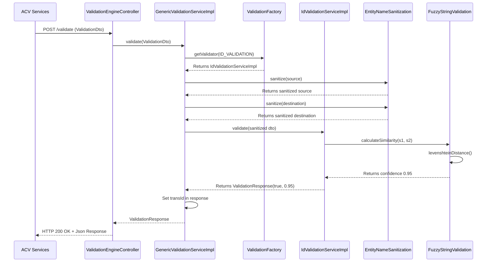

# ACV Validation Engine - Low-Level Design

**Purpose:** Deep-dive into code organization, class responsibilities, method signatures, data models, design patterns, and validation execution flow.

**Scope:** Single service scope — internal code structure, Spring components, DTO models, execution lifecycle.

---

## 1. Code Organization

### Package Structure

```
com.fedex.acv.validation.engine/
│
├── controller/
│   └── ValidationEngineController.java
│       └── @PostMapping("/validate") → GenericValidationService.validate()
│
├── service/
│   ├── GenericValidationService.java                 (I) Service contract
│   ├── ValidationTypeInterface.java                  (I) Validator contract
│   └── impl/
│       ├── GenericValidationServiceImpl.java          → Factory, orchestrates validation
│       ├── IdValidationServiceImpl.java               → Strategy: ID fuzzy match
│       ├── LegalNameValidationServiceImpl.java        → Strategy: Company name fuzzy match
│       ├── EntityNameValidationImpl.java              → Strategy: Entity name validation
│       ├── EntityNatureValidationImpl.java            → Strategy: Entity type predefined rules
│       ├── DateValidationImpl.java                    → Strategy: Date range validation
│       ├── KeyPersonValidationImpl.java               → Strategy: Key person matching
│       ├── CreditReportValidationImpl.java            → Strategy: Credit score numeric validation
│       ├── AddressValidationImpl.java                 → Strategy: Address validation
│       ├── TypeRegValidationImpl.java                 → Strategy: Registration type validation
│       ├── RecStatusValidationImpl.java               → Strategy: Record status validation
│       ├── NameValidationImpl.java                    → Strategy: Generic name validation
│       ├── OtherValidationImpl.java                   → Strategy: Catch-all custom logic
│       │
│       └── primitives/
│           ├── FuzzyStringValidation.java
│           ├── PredefinedRuleValidation.java
│           ├── NumericPrimitiveValidation.java
│           ├── DatePrimitiveValidation.java
│           ├── StringPrimitiveOperations.java
│           ├── ComparisonType.java                   (enum)
│           └── ComparisonTypeFactory.java
│
├── sanitization/
│   ├── EntityNameSanitization.java
│   ├── DateSanitization.java
│   ├── AddressSanitization.java
│   ├── CharPositionSanitization.java
│   ├── NameSanitization.java
│   └── SanitizationStrategy.java                     (I)
│
├── dto/
│   ├── ValidationDto.java                           Request payload
│   ├── ValidationConfig.java                        Validation rules config
│   ├── DataObject.java                              Source/destination data
│   ├── ValidationResponse.java                      Response payload
│   └── AdditionalDataDTO.java
│
├── factory/
│   ├── ValidationFactory.java                       Validator instantiation
│   └── ComparisonTypeFactory.java
│
├── config/
│   ├── CompanyConfigurations.java
│   ├── AddressConfiguration.java
│   └── ValidationEngineConfig.java                  Spring @Configuration
│
├── constants/
│   ├── ValidationConstants.java
│   ├── EntityNames.java
│   └── ErrorMessages.java
│
├── enums/
│   ├── StringOperator.java
│   ├── NumericOperators.java
│   ├── DateOperators.java
│   ├── CollectionOperators.java
│   └── ValidationType.java
│
├── utils/
│   └── ValidationEngineUtils.java
│
└── AcvValidationEngineApplication.java              Spring Boot entry
```

**Legend:** `(I)` = Interface, no suffix = Concrete class

---

## 2. Core Classes & Responsibilities

### 2.1 Controller Layer

#### ValidationEngineController

```java
@RestController
@RequestMapping("/validate")
@Slf4j
public class ValidationEngineController {
    
    private final GenericValidationService validationService;
    
    @PostMapping
    public ResponseEntity<ValidationResponse> validate(
        @RequestBody ValidationDto validationDto) {
        
        LOG.info("Validation request received: transId={}, type={}",
                validationDto.getTransId(), 
                validationDto.getValidationType());
        
        // Delegate to service layer
        ValidationResponse response = validationService.validate(validationDto);
        
        LOG.info("Validation completed: transId={}, result={}",
                validationDto.getTransId(), 
                response.getValidationResult());
        
        return ResponseEntity.ok(response);
    }
}
```

**Responsibility:**
- HTTP /validate endpoint (POST)
- Deserialize JSON request to ValidationDto
- Delegate to GenericValidationService
- Serialize ValidationResponse to JSON
- Error handling and HTTP status codes

**Dependencies:**
- `GenericValidationService` (injected)

---

### 2.2 Service Layer

#### GenericValidationService (Interface)

```java
public interface GenericValidationService {
    
    /**
     * Execute validation for given request.
     * 
     * @param validationDto request with source & destination data
     * @return ValidationResponse with result and confidence
     */
    ValidationResponse validate(ValidationDto validationDto);
}
```

#### GenericValidationServiceImpl (Factory + Orchestrator)

```java
@Service
@Slf4j
public class GenericValidationServiceImpl implements GenericValidationService {
    
    private final ValidationFactory validationFactory;
    private final List<SanitizationStrategy> sanitizers;
    
    @Override
    public ValidationResponse validate(ValidationDto dto) {
        try {
            // Step 1: Validate request structure
            if (dto.getValidationType() == null) {
                return ValidationResponse.builder()
                    .validationResult(false)
                    .message("validationType is required")
                    .build();
            }
            
            // Step 2: Look up validator from factory
            ValidationTypeInterface validator = 
                validationFactory.getValidator(dto.getValidationType());
            
            if (validator == null) {
                return ValidationResponse.builder()
                    .validationResult(false)
                    .message("No validator found for type: " + dto.getValidationType())
                    .build();
            }
            
            // Step 3: Sanitize input data
            dto.getValidationData().setSanitizedSource(
                sanitizeData(dto.getValidationData().getSource())
            );
            dto.getValidationData().setSanitizedDestination(
                sanitizeData(dto.getValidationData().getDestination())
            );
            
            // Step 4: Execute validator (Strategy pattern)
            ValidationResponse response = validator.validate(dto);
            
            // Step 5: Return response with transId
            response.setTransId(dto.getTransId());
            return response;
            
        } catch (Exception e) {
            LOG.error("Validation error: transId={}, error={}",
                    dto.getTransId(), e.getMessage(), e);
            return ValidationResponse.builder()
                .validationResult(false)
                .message("Internal validation error: " + e.getMessage())
                .build();
        }
    }
    
    private String sanitizeData(String data) {
        String result = data;
        for (SanitizationStrategy sanitizer : sanitizers) {
            result = sanitizer.sanitize(result);
        }
        return result;
    }
}
```

**Responsibility:**
- Factory for looking up validators by type
- Orchestrate validation flow (sanitize → validate → respond)
- Error handling and fallbacks
- Coordination between layers

**Dependencies:**
- `ValidationFactory` (injects)
- `List<SanitizationStrategy>` (injects all sanitizers)

**Design Pattern:** Factory + Strategy

---

### 2.3 Validator Layer

#### ValidationTypeInterface (Strategy Interface)

```java
/**
 * Contract for all validators. Each implementation handles one validation type.
 */
public interface ValidationTypeInterface {
    
    /**
     * Execute validation for this validator's domain.
     * 
     * @param validationDto request with sanitized source & destination
     * @return response with boolean result and confidence score (0.0-1.0)
     */
    ValidationResponse validate(ValidationDto validationDto);
    
    /**
     * Get the validation type this validator handles.
     * @return ValidationType enum value
     */
    ValidationType getValidationType();
}
```

#### IdValidationServiceImpl (Example Strategy Implementation)

```java
@Component
@Slf4j
public class IdValidationServiceImpl implements ValidationTypeInterface {
    
    private final FuzzyStringValidation fuzzyValidator;
    private final ValidationConstants constants;
    
    @Override
    public ValidationResponse validate(ValidationDto dto) {
        try {
            String sourceId = dto.getValidationData().getSanitizedSource();
            String destId = dto.getValidationData().getSanitizedDestination();
            
            LOG.debug("ID Validation: comparing '{}' vs '{}'", sourceId, destId);
            
            // Get configuration (threshold, comparison type)
            ValidationConfig config = dto.getConfig();
            double threshold = config.getThreshold() != null 
                ? config.getThreshold() 
                : constants.DEFAULT_ID_THRESHOLD;  // 0.95
            
            // Use Fuzzy Matching primitive
            double confidence = fuzzyValidator.calculateSimilarity(sourceId, destId);
            
            boolean result = confidence >= threshold;
            
            return ValidationResponse.builder()
                .validationResult(result)
                .confidence(confidence)
                .message(result ? "ID match accepted" : "ID mismatch detected")
                .details(Map.of(
                    "sourceId", sourceId,
                    "destId", destId,
                    "fuzzyDistance", fuzzyValidator.levenshteinDistance(sourceId, destId),
                    "threshold", threshold
                ))
                .build();
                
        } catch (Exception e) {
            LOG.error("ID validation error", e);
            return ValidationResponse.builder()
                .validationResult(false)
                .message("Internal error: " + e.getMessage())
                .build();
        }
    }
    
    @Override
    public ValidationType getValidationType() {
        return ValidationType.ID_VALIDATION;
    }
}
```

**Responsibility:**
- Execute business logic for ID validation
- Call primitive validations (fuzzy matching here)
- Return confidence score and result

**Dependencies:**
- `FuzzyStringValidation` (injects)
- `ValidationConstants` (injects)

#### LegalNameValidationServiceImpl

```java
@Component
@Slf4j
public class LegalNameValidationServiceImpl implements ValidationTypeInterface {
    
    private final FuzzyStringValidation fuzzyValidator;
    private final CompanyConfigurations companyConfigs;
    
    @Override
    public ValidationResponse validate(ValidationDto dto) {
        String sourceName = dto.getValidationData().getSanitizedSource();
        String destName = dto.getValidationData().getSanitizedDestination();
        
        // Remove common company suffixes (LLC, Inc, Corp)
        String sourceClean = removeCompanySuffixes(sourceName);
        String destClean = removeCompanySuffixes(destName);
        
        double confidence = fuzzyValidator.calculateSimilarity(sourceClean, destClean);
        boolean result = confidence >= 0.90;
        
        return ValidationResponse.builder()
            .validationResult(result)
            .confidence(confidence)
            .message(result ? "Company name match" : "Name mismatch")
            .build();
    }
    
    @Override
    public ValidationType getValidationType() {
        return ValidationType.LEGAL_NAME_VALIDATION;
    }
    
    private String removeCompanySuffixes(String name) {
        String[] suffixes = {"LLC", "INC", "CORP", "CO", "LTD"};
        String result = name.toUpperCase();
        for (String suffix : suffixes) {
            result = result.replaceAll("\\b" + suffix + "\\b", "");
        }
        return result.trim();
    }
}
```

#### DateValidationImpl

```java
@Component
@Slf4j
public class DateValidationImpl implements ValidationTypeInterface {
    
    private final DatePrimitiveValidation dateValidator;
    
    @Override
    public ValidationResponse validate(ValidationDto dto) {
        try {
            String dateStr = dto.getValidationData().getSanitizedSource();
            ValidationConfig config = dto.getConfig();
            
            LocalDate date = LocalDate.parse(dateStr);  // ISO-8601
            LocalDate minDate = LocalDate.parse(config.getMinDate());
            LocalDate maxDate = LocalDate.parse(config.getMaxDate());
            
            boolean result = dateValidator.isInRange(date, minDate, maxDate);
            
            return ValidationResponse.builder()
                .validationResult(result)
                .confidence(result ? 1.0 : 0.0)
                .message(result ? "Date within valid range" : "Date outside valid range")
                .build();
                
        } catch (DateTimeParseException e) {
            return ValidationResponse.builder()
                .validationResult(false)
                .message("Invalid date format")
                .build();
        }
    }
    
    @Override
    public ValidationType getValidationType() {
        return ValidationType.DATE_VALIDATION;
    }
}
```

#### CreditReportValidationImpl

```java
@Component
@Slf4j
public class CreditReportValidationImpl implements ValidationTypeInterface {
    
    private final NumericPrimitiveValidation numericValidator;
    
    @Override
    public ValidationResponse validate(ValidationDto dto) {
        try {
            double creditScore = Double.parseDouble(
                dto.getValidationData().getSanitizedSource()
            );
            double minThreshold = dto.getConfig().getMinCreditScore();  // 700
            
            boolean result = creditScore >= minThreshold;
            double confidence = calculateConfidence(creditScore, minThreshold);
            
            return ValidationResponse.builder()
                .validationResult(result)
                .confidence(confidence)
                .message(result ? "Credit score acceptable" : "Credit score below threshold")
                .details(Map.of(
                    "creditScore", creditScore,
                    "minThreshold", minThreshold
                ))
                .build();
                
        } catch (NumberFormatException e) {
            return ValidationResponse.builder()
                .validationResult(false)
                .message("Invalid credit score format")
                .build();
        }
    }
    
    private double calculateConfidence(double score, double threshold) {
        // Score 100 points above threshold = full confidence
        return Math.min(1.0, (score - threshold) / 100.0);
    }
    
    @Override
    public ValidationType getValidationType() {
        return ValidationType.CREDIT_VALIDATION;
    }
}
```

#### EntityNatureValidationImpl

```java
@Component
@Slf4j
public class EntityNatureValidationImpl implements ValidationTypeInterface {
    
    private final PredefinedRuleValidation ruleValidator;
    private final EntityNames entityNames;
    
    @Override
    public ValidationResponse validate(ValidationDto dto) {
        String entityNature = dto.getValidationData().getSanitizedSource();
        
        // Check against predefined allowed entity types
        Set<String> allowedNatures = entityNames.getAllowedEntityNatures();
        
        boolean result = ruleValidator.isInWhitelist(entityNature, allowedNatures);
        
        return ValidationResponse.builder()
            .validationResult(result)
            .confidence(result ? 1.0 : 0.0)
            .message(result ? "Valid entity nature" : "Invalid entity nature")
            .details(Map.of(
                "entityNature", entityNature,
                "allowedValues", allowedNatures
            ))
            .build();
    }
    
    @Override
    public ValidationType getValidationType() {
        return ValidationType.ENTITY_NATURE_VALIDATION;
    }
}
```

---

### 2.4 Sanitization Layer

#### SanitizationStrategy (Interface)

```java
public interface SanitizationStrategy {
    
    /**
     * Sanitize and normalize input data.
     * @param input raw input string
     * @return normalized string
     */
    String sanitize(String input);
}
```

#### EntityNameSanitization

```java
@Component
@Slf4j
public class EntityNameSanitization implements SanitizationStrategy {
    
    @Override
    public String sanitize(String input) {
        if (input == null) return "";
        
        // Step 1: Lowercase
        String result = input.toLowerCase();
        
        // Step 2: Remove special characters (keep alphanumeric and spaces)
        result = result.replaceAll("[^a-z0-9\\s]", "");
        
        // Step 3: Collapse multiple spaces to single space
        result = result.replaceAll("\\s+", " ");
        
        // Step 4: Trim leading/trailing spaces
        result = result.trim();
        
        return result;
    }
}
```

#### DateSanitization

```java
@Component
public class DateSanitization implements SanitizationStrategy {
    
    @Override
    public String sanitize(String input) {
        if (input == null) return "";
        
        try {
            // Parse multiple date formats
            LocalDate date;
            
            if (input.contains("/")) {
                date = LocalDate.parse(input, DateTimeFormatter.ofPattern("M/d/yyyy"));
            } else if (input.contains("-")) {
                date = LocalDate.parse(input, DateTimeFormatter.ISO_LOCAL_DATE);
            } else {
                return input;  // Unknown format, return as-is
            }
            
            // Return in ISO-8601 format
            return date.format(DateTimeFormatter.ISO_LOCAL_DATE);
            
        } catch (DateTimeParseException e) {
            return input;  // Return original if parse fails
        }
    }
}
```

#### CharPositionSanitization

```java
@Component
public class CharPositionSanitization implements SanitizationStrategy {
    
    @Override
    public String sanitize(String input) {
        if (input == null) return "";
        
        // Trim leading and trailing whitespace
        String result = input.trim();
        
        // Collapse multiple spaces to single space
        result = result.replaceAll(" +", " ");
        
        return result;
    }
}
```

---

### 2.5 Primitive Validation Layer

#### FuzzyStringValidation

```java
@Component
public class FuzzyStringValidation {
    
    /**
     * Calculate similarity between two strings using Levenshtein distance.
     * @param s1 first string
     * @param s2 second string
     * @return similarity score 0.0-1.0 (1.0 = identical)
     */
    public double calculateSimilarity(String s1, String s2) {
        int distance = levenshteinDistance(s1, s2);
        int maxLength = Math.max(s1.length(), s2.length());
        return 1.0 - ((double) distance / maxLength);
    }
    
    /**
     * Calculate Levenshtein distance (edit distance) between strings.
     */
    public int levenshteinDistance(String s1, String s2) {
        if (s1.length() == 0) return s2.length();
        if (s2.length() == 0) return s1.length();
        
        int[][] dp = new int[s1.length() + 1][s2.length() + 1];
        
        for (int i = 0; i <= s1.length(); i++) {
            dp[i][0] = i;
        }
        for (int j = 0; j <= s2.length(); j++) {
            dp[0][j] = j;
        }
        
        for (int i = 1; i <= s1.length(); i++) {
            for (int j = 1; j <= s2.length(); j++) {
                int cost = s1.charAt(i - 1) == s2.charAt(j - 1) ? 0 : 1;
                dp[i][j] = Math.min(
                    Math.min(dp[i - 1][j] + 1, dp[i][j - 1] + 1),
                    dp[i - 1][j - 1] + cost
                );
            }
        }
        
        return dp[s1.length()][s2.length()];
    }
}
```

#### PredefinedRuleValidation

```java
@Component
public class PredefinedRuleValidation {
    
    /**
     * Check if value exists in whitelist.
     */
    public boolean isInWhitelist(String value, Set<String> allowedValues) {
        return allowedValues.contains(value.toUpperCase());
    }
    
    /**
     * Check if value does NOT exist in blacklist.
     */
    public boolean isNotInBlacklist(String value, Set<String> blacklist) {
        return !blacklist.contains(value.toUpperCase());
    }
}
```

#### NumericPrimitiveValidation

```java
@Component
public class NumericPrimitiveValidation {
    
    public boolean isGreaterThan(double value, double threshold) {
        return value > threshold;
    }
    
    public boolean isLessThan(double value, double threshold) {
        return value < threshold;
    }
    
    public boolean isInRange(double value, double min, double max) {
        return value >= min && value <= max;
    }
}
```

#### DatePrimitiveValidation

```java
@Component
public class DatePrimitiveValidation {
    
    public boolean isInRange(LocalDate date, LocalDate min, LocalDate max) {
        return !date.isBefore(min) && !date.isAfter(max);
    }
    
    public boolean isBefore(LocalDate date, LocalDate cutoff) {
        return date.isBefore(cutoff);
    }
    
    public boolean isNotExpired(LocalDate expiryDate) {
        return expiryDate.isAfter(LocalDate.now());
    }
}
```

---

### 2.6 Factory Layer

#### ValidationFactory

```java
@Component
@Slf4j
public class ValidationFactory {
    
    private final Map<ValidationType, ValidationTypeInterface> validators;
    
    // Constructor with all validator beans
    public ValidationFactory(
        IdValidationServiceImpl idValidator,
        LegalNameValidationServiceImpl legalNameValidator,
        EntityNameValidationImpl entityNameValidator,
        EntityNatureValidationImpl entityNatureValidator,
        DateValidationImpl dateValidator,
        KeyPersonValidationImpl keyPersonValidator,
        CreditReportValidationImpl creditValidator,
        AddressValidationImpl addressValidator,
        TypeRegValidationImpl typeRegValidator,
        RecStatusValidationImpl recStatusValidator,
        NameValidationImpl nameValidator,
        OtherValidationImpl otherValidator
    ) {
        this.validators = new HashMap<>();
        
        // Register each validator by its type
        validators.put(ValidationType.ID_VALIDATION, idValidator);
        validators.put(ValidationType.LEGAL_NAME_VALIDATION, legalNameValidator);
        validators.put(ValidationType.ENTITY_NAME_VALIDATION, entityNameValidator);
        validators.put(ValidationType.ENTITY_NATURE_VALIDATION, entityNatureValidator);
        validators.put(ValidationType.DATE_VALIDATION, dateValidator);
        validators.put(ValidationType.KEY_PERSON_VALIDATION, keyPersonValidator);
        validators.put(ValidationType.CREDIT_VALIDATION, creditValidator);
        validators.put(ValidationType.ADDRESS_VALIDATION, addressValidator);
        validators.put(ValidationType.TYPE_REG_VALIDATION, typeRegValidator);
        validators.put(ValidationType.REC_STATUS_VALIDATION, recStatusValidator);
        validators.put(ValidationType.NAME_VALIDATION, nameValidator);
        validators.put(ValidationType.OTHER_VALIDATION, otherValidator);
    }
    
    /**
     * Get validator by type. Falls back to OtherValidation if type not found.
     */
    public ValidationTypeInterface getValidator(ValidationType type) {
        ValidationTypeInterface validator = validators.get(type);
        if (validator == null) {
            LOG.warn("Validator not found for type {}, using OtherValidation", type);
            validator = validators.get(ValidationType.OTHER_VALIDATION);
        }
        return validator;
    }
}
```

**Design Pattern:** Abstract Factory

---

### 2.7 DTO Layer

#### ValidationDto (Request)

```java
@Data
@Builder
@NoArgsConstructor
@AllArgsConstructor
public class ValidationDto {
    
    /**
     * Unique transaction/request identifier (UUID).
     */
    @NotNull
    private String transId;
    
    /**
     * Type of validation to execute.
     */
    @NotNull
    private ValidationType validationType;
    
    /**
     * Source (applicant) and destination (reference) data.
     */
    @NotNull
    private DataObject validationData;
    
    /**
     * Runtime validation configuration (thresholds, comparison types).
     */
    @NotNull
    private ValidationConfig config;
    
    /**
     * Additional context data (optional).
     */
    private AdditionalDataDTO additionalData;
}
```

#### DataObject

```java
@Data
@Builder
@NoArgsConstructor
@AllArgsConstructor
public class DataObject {
    
    /**
     * Applicant-provided data (source).
     */
    @NotNull
    private String source;
    
    /**
     * Reference/government data (destination).
     */
    @NotNull
    private String destination;
    
    /**
     * Sanitized source (populated during validation).
     */
    private String sanitizedSource;
    
    /**
     * Sanitized destination (populated during validation).
     */
    private String sanitizedDestination;
}
```

#### ValidationConfig

```java
@Data
@Builder
@NoArgsConstructor
@AllArgsConstructor
public class ValidationConfig {
    
    /**
     * Comparison logic: EXACT_MATCH, FUZZY_MATCH, NUMERIC, etc.
     */
    private ComparisonType comparisonType;
    
    /**
     * Confidence threshold for PASS (0.0-1.0).
     */
    private Double threshold;
    
    /**
     * Max allowed Levenshtein distance for fuzzy matching.
     */
    private Integer maxFuzzyDistance;
    
    /**
     * Expected data type of values being compared.
     */
    private DataType dataType;
    
    /**
     * Min/max values for numeric/ date validations.
     */
    private Double minValue;
    private Double maxValue;
    private String minDate;
    private String maxDate;
    private Double minCreditScore;
    
    /**
     * Predefined rule/whitelist for predefined validations.
     */
    private String predefinedValue;
    
    /**
     * Custom metadata for validators to use.
     */
    @JsonAnySetter
    public Map<String, Object> customProperties = new HashMap<>();
}
```

#### ValidationResponse (Response)

```java
@Data
@Builder
@NoArgsConstructor
@AllArgsConstructor
public class ValidationResponse {
    
    /**
     * Transaction ID (echo from request).
     */
    private String transId;
    
    /**
     * True = validation passed, False = validation failed.
     */
    @NotNull
    private Boolean validationResult;
    
    /**
     * Confidence score 0.0-1.0 (higher = more confident in result).
     */
    private Double confidence;
    
    /**
     * Human-readable validation outcome message.
     */
    private String message;
    
    /**
     * Additional validation details for debugging.
     */
    private Map<String, Object> details;
}
```

---

## 3. Design Patterns Used

### Pattern 1: Factory Pattern

**Location:** `ValidationFactory.java`  
**Purpose:** Decouple validator selection from usage  
**Implementation:**
```
ClientCode.validate()
    ↓
GenericValidationServiceImpl → ValidationFactory.getValidator(type)
    ↓
Returns appropriate ValidatorImpl (IdValidation, LegalNameValidation, etc.)
    ↓
Validator.validate(dto)
```

**Benefit:** Easy to add new validators without modifying existing code (Open/Closed Principle).

---

### Pattern 2: Strategy Pattern

**Location:** `ValidationTypeInterface` + 12+ implementations  
**Purpose:** Encapsulate validation algorithms, making them interchangeable  
**Implementation:**
```
All validators implement ValidationTypeInterface
    ├── IdValidationServiceImpl.validate()
    ├── LegalNameValidationServiceImpl.validate()
    ├── DateValidationImpl.validate()
    └── ...
```

**Benefit:** Each validator can have completely different logic while conforming to same interface.

---

### Pattern 3: Sanitization Strategy

**Location:** `SanitizationStrategy` + 5+ implementations  
**Purpose:** Apply multiple transformations to data in sequence  
**Chain:**
```
Raw Input
    → EntityNameSanitization (remove special chars)
    → CharPositionSanitization (collapse spaces)
    → DateSanitization (parse date format)
    → Validated Data
```

**Benefit:** Composable, reusable, easy to add new sanitizers.

---

### Pattern 4: Dependency Injection (Spring)

**Locations:** All `@Component` and `@Service` classes  
**Purpose:** Loose coupling, testability  
**Example:**
```java
@Component
public class IdValidationServiceImpl implements ValidationTypeInterface {
    private final FuzzyStringValidation fuzzyValidator;  // Injected
    
    // Constructor injection preferred over field injection
    public IdValidationServiceImpl(FuzzyStringValidation fuzzyValidator) {
        this.fuzzyValidator = fuzzyValidator;
    }
}
```

---

## 4. Request/Response Lifecycle Sequence Diagram



**Step-by-Step Flow:**

1. **Request arrives** at ValidationEngineController
2. **JSON deserialized** to ValidationDto
3. **Factory lookup** by validationType
4. **Sanitization** applied to both source and destination
5. **Validator.validate()** called with sanitized data
6. **Primitive validation** (fuzzy matching, predefined rules, etc.)
7. **Response built** with result, confidence, details
8. **JSON serialized** and returned to caller

---

## 5. Configuration Reference

### application-dev.yml

```yaml
spring:
  application:
    name: eai-3540813-acv-validation-engine
  
  server:
    port: 8081
    servlet:
      context-path: /
  
  mvc:
    throw-exception-if-no-handler-found: true

logging:
  level:
    ROOT: INFO
    com.fedex.acv.validation.engine: DEBUG
    com.fedex.acv.validation.engine.service: DEBUG
  pattern:
    console: "%d{yyyy-MM-dd HH:mm:ss} - %logger{36} - %msg%n"

# Validation Engine Specific Config
validation-engine:
  fuzzy-match:
    enabled: true
    default-threshold: 0.85
    max-fuzzy-distance: 2
  
  predefined-rules:
    cache-enabled: true
    cache-ttl-minutes: 60
  
  sanitization:
    enabled: true
    apply-order:
      - char-position
      - entity-name
      - date
      - address
```

### ValidationConstants.java

```java
public class ValidationConstants {
    
    // Fuzzy Matching Thresholds
    public static final double DEFAULT_ID_THRESHOLD = 0.95;
    public static final double DEFAULT_NAME_THRESHOLD = 0.90;
    public static final double DEFAULT_ADDRESS_THRESHOLD = 0.85;
    
    // Levenshtein Distance Max
    public static final int MAX_FUZZY_DISTANCE = 2;
    
    // Credit Score Thresholds
    public static final double MIN_CREDIT_SCORE = 700.0;
    public static final double IDEAL_CREDIT_SCORE = 750.0;
    
    // Comparison Types
    public static final String EXACT_MATCH = "EXACT_MATCH";
    public static final String FUZZY_MATCH = "FUZZY_MATCH";
    public static final String NUMERIC_COMPARE = "NUMERIC_COMPARE";
    public static final String PREDEFINED_RULE = "PREDEFINED_RULE";
}
```

---

## 6. Error Handling Strategy

### Exception Hierarchy

```java
// Custom exceptions
public class ValidationEngineException extends RuntimeException {
    // Base exception for engine errors
}

public class ValidatorNotFoundException extends ValidationEngineException {
    // Thrown when validator type not found
}

public class InvalidValidationDataException extends ValidationEngineException {
    // Thrown when input data invalid
}

public class SanitizationException extends ValidationEngineException {
    // Thrown when sanitization fails
}
```

### Error Response Format

```json
{
  "validationResult": false,
  "confidence": 0.0,
  "message": "Invalid validation request",
  "details": {
    "error": "Missing required field: validationType",
    "timestamp": "2025-01-30T10:15:00Z"
  }
}
```

---

## 7. Validation Rules Reference

### Fuzzy Matching Rules

```java
double similarity = fuzzyValidator.calculateSimilarity("JOHN DOE", "JON DOE");
// Levenshtein distance = 1 (one deletion of 'H')
// Max length = 8
// Similarity = 1.0 - (1/8) = 0.875

// Validation passes if similarity >= threshold (e.g., 0.85)
result = similarity >= 0.85;  // TRUE
```

### Predefined Rules

```yaml
# EntityNames.yml
allowed-entity-types:
  - LLC
  - CORPORATION
  - S_CORP
  - PARTNERSHIP
  - SOLE_PROPRIETOR

# Validation passes if entity type in whitelist
result = allowedTypes.contains(entityType.toUpperCase());
```

### Numeric Validation

```java
double creditScore = 750.0;
double minThreshold = 700.0;

// Validation passes if score >= minimum
result = creditScore >= minThreshold;  // TRUE
```

---

## 8. Testing Strategy

### Unit Test Example

```java
@ExtendWith(MockitoExtension.class)
class IdValidationServiceImplTest {
    
    @Mock
    private FuzzyStringValidation fuzzyValidator;
    
    @InjectMocks
    private IdValidationServiceImpl service;
    
    @Test
    void testIdValidation_ExactMatch() {
        // Setup
        when(fuzzyValidator.calculateSimilarity("JOHN DOE", "JOHN DOE"))
            .thenReturn(1.0);
        
        ValidationDto dto = ValidationDto.builder()
            .transId("test-1")
            .validationType(ValidationType.ID_VALIDATION)
            .validationData(DataObject.builder()
                .source("JOHN DOE")
                .sanitizedSource("john doe")
                .destination("JOHN DOE")
                .sanitizedDestination("john doe")
                .build())
            .config(ValidationConfig.builder()
                .threshold(0.95)
                .build())
            .build();
        
        // Execute
        ValidationResponse response = service.validate(dto);
        
        // Assert
        assertThat(response.getValidationResult()).isTrue();
        assertThat(response.getConfidence()).isEqualTo(1.0);
    }
}
```

### Integration Test Example

```java
@SpringBootTest
@AutoConfigureMockMvc
class ValidationEngineControllerTest {
    
    @Autowired
    private MockMvc mockMvc;
    
    @Test
    void testValidateEndpoint() throws Exception {
        ValidationDto request = ValidationDto.builder()
            .transId("test-req-1")
            .validationType(ValidationType.ID_VALIDATION)
            .validationData(DataObject.builder()
                .source("JOHN DOE")
                .destination("JOHN DOE")
                .build())
            .config(ValidationConfig.builder()
                .threshold(0.95)
                .build())
            .build();
        
        mockMvc.perform(post("/validate")
            .contentType(MediaType.APPLICATION_JSON)
            .content(objectMapper.writeValueAsString(request)))
            .andExpect(status().isOk())
            .andExpect(jsonPath("$.validationResult").value(true))
            .andExpect(jsonPath("$.confidence").isNotEmpty());
    }
}
```

---

## Cross-References

- [HLD.md](HLD.md) — Architecture and components overview
- [services.md](services.md) — REST API contracts
- [code-mapping.md](code-mapping.md) — Class inventory
- [glossary.md](glossary.md) — Terminology

---

**Last Updated:** 2025-01-30  
**Version:** 1.1.4  
**Audience:** Senior Engineers, Architects, Code Reviewers
