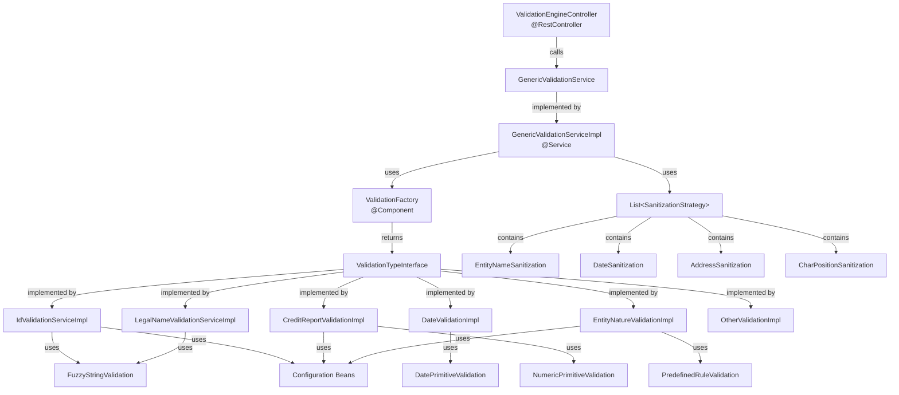

# ACV Validation Engine - Code Mapping & Class Inventory

**Purpose:** Provide a comprehensive inventory of all classes, their responsibilities, dependencies, and inter-relationships. Serves as a reference map to navigate the codebase.

**Scope:** Single service — all classes in

 the validation engine repository.

---

## 1. Package-to-Responsibility Map

| Package | Responsibility | Key Classes | File Count |
|---------|-----------------|------------|-----------|
| **controller** | HTTP REST API endpoint, request deserialization, response serialization | `ValidationEngineController` | 1 |
| **service** | Orchestration, factory pattern for validator lookup, sanitization pipeline | `GenericValidationService` (I), `GenericValidationServiceImpl`, `ValidationTypeInterface` (I) | 3 + 12 impls |
| **service.impl** | 12+ validator implementations (pluggable strategies) | `IdValidationServiceImpl`, `LegalNameValidationServiceImpl`, `DateValidationImpl`, etc. | 12 |
| **service.impl.primitives** | Core validation operations (fuzzy matching, predefined rules, numeric, date) | `FuzzyStringValidation`, `PredefinedRuleValidation`, `NumericPrimitiveValidation`, etc. | 6 |
| **sanitization** | Data normalization and cleaning before validation | `EntityNameSanitization`, `DateSanitization`, `AddressSanitization`, etc. | 5 |
| **dto** | Request/response data transfer objects | `ValidationDto`, `DataObject`, `ValidationConfig`, `ValidationResponse` | 4 |
| **factory** | Validator and comparison type instantiation (Abstract Factory pattern) | `ValidationFactory`, `ComparisonTypeFactory` | 2 |
| **config** | Spring configuration, application properties | `ValidationEngineConfig`, `CompanyConfigurations`, `AddressConfiguration` | 3 |
| **constants** | Static constants, thresholds, enum values | `ValidationConstants`, `EntityNames`, `ErrorMessages` | 3 |
| **enums** | Java enums for operator types and comparison types | `StringOperator`, `NumericOperators`, `DateOperators`, `ValidationType` | 4 |
| **utils** | Utility functions and helpers | `ValidationEngineUtils` | 1 |
| **root** | Spring Boot application entry point | `AcvValidationEngineApplication` | 1 |

**Total Files:** ~45 classes/interfaces

---

## 2. Comprehensive Class Inventory

### Controller Layer

| Class | File | Layer | Purpose | Key Methods |
|-------|------|-------|---------|------------|
| `ValidationEngineController` | `controller/ValidationEngineController.java` | REST | HTTP /validate endpoint | `validate(ValidationDto): ResponseEntity<ValidationResponse>` |

---

### Service Layer

| Class | File | Layer | Purpose | Key Methods | Dependencies |
|-------|------|-------|---------|------------|--------------|
| `GenericValidationService` | `service/GenericValidationService.java` | Service (I) | Validation service interface | `validate(ValidationDto): ValidationResponse` | — |
| `GenericValidationServiceImpl` | `service/impl/GenericValidationServiceImpl.java` | Service (Impl) | Factory & orchestrator | `validate(ValidationDto): ValidationResponse`, `sanitizeData(String): String` | `ValidationFactory`, `List<SanitizationStrategy>` |
| `ValidationTypeInterface` | `service/ValidationTypeInterface.java` | Service (I) | Validator interface contract | `validate(ValidationDto): ValidationResponse`, `getValidationType(): ValidationType` | — |

---

### Validator Implementations (12+)

| Class | File | Purpose | Comparison Type | Example |
|-------|------|---------|-----------------|---------|
| `IdValidationServiceImpl` | `service/impl/IdValidationServiceImpl.java` | ID document validation | FUZZY_MATCH | "AB123456" vs "AB123456" |
| `LegalNameValidationServiceImpl` | `service/impl/LegalNameValidationServiceImpl.java` | Company legal name | FUZZY_MATCH | "Acme Inc" vs "Acme Corporation" |
| `EntityNameValidationImpl` | `service/impl/EntityNameValidationImpl.java` | Entity name matching | FUZZY_MATCH | "John's Auto" vs "Johns Auto" |
| `EntityNatureValidationImpl` | `service/impl/EntityNatureValidationImpl.java` | Entity type validation | PREDEFINED_RULE | "LLC" in allowed list? |
| `DateValidationImpl` | `service/impl/DateValidationImpl.java` | Date range validation | DATE_RANGE | 1990-01-15 between 1980 & 2005? |
| `KeyPersonValidationImpl` | `service/impl/KeyPersonValidationImpl.java` | Key person matching | FUZZY_MATCH | Officer name vs filing |
| `CreditReportValidationImpl` | `service/impl/CreditReportValidationImpl.java` | Credit score validation | NUMERIC_COMPARE | 750 >= 700? |
| `AddressValidationImpl` | `service/impl/AddressValidationImpl.java` | Address format/postal | PREDEFINED_RULE | Valid postal code? |
| `TypeRegValidationImpl` | `service/impl/TypeRegValidationImpl.java` | Registration type | PREDEFINED_RULE | Type in allowed list? |
| `RecStatusValidationImpl` | `service/impl/RecStatusValidationImpl.java` | Record status | PREDEFINED_RULE | Status is ACTIVE? |
| `NameValidationImpl` | `service/impl/NameValidationImpl.java` | Generic name validation | FUZZY_MATCH | Generic name matching |
| `OtherValidationImpl` | `service/impl/OtherValidationImpl.java` | Catch-all custom logic | MIXED | Fallback validator |

**All extend:** `ValidationTypeInterface`  
**All inject:** Primitive validation beans + configuration

---

### Primitive Validation Layer

| Class | File | Purpose | Methods | Used By |
|-------|------|---------|---------|---------|
| `FuzzyStringValidation` | `service/impl/primitives/FuzzyStringValidation.java` | Levenshtein distance matching | `calculateSimilarity(s1, s2): double`, `levenshteinDistance(s1, s2): int` | All name/ID validators |
| `PredefinedRuleValidation` | `service/impl/primitives/PredefinedRuleValidation.java` | Whitelist/blacklist checking | `isInWhitelist(value, allowedSet): boolean`, `isNotInBlacklist(value, blacklist): boolean` | EntityNature, Address, RecStatus validators |
| `NumericPrimitiveValidation` | `service/impl/primitives/NumericPrimitiveValidation.java` | Numeric comparisons | `isGreaterThan()`, `isLessThan()`, `isInRange()` | CreditReportValidation |
| `DatePrimitiveValidation` | `service/impl/primitives/DatePrimitiveValidation.java` | Date validation | `isInRange()`, `isBefore()`, `isNotExpired()` | DateValidation |
| `StringPrimitiveOperations` | `service/impl/primitives/StringPrimitiveOperations.java` | String operations | `contains()`, `startsWith()`, `regex()` | Various sanitizers |
| `ComparisonType` | `service/impl/primitives/ComparisonType.java` | Comparison type enum | EXACT_MATCH, FUZZY_MATCH, NUMERIC_COMPARE, PREDEFINED_RULE, DATE_RANGE | ComparisonTypeFactory |
| `ComparisonTypeFactory` | `service/impl/primitives/ComparisonTypeFactory.java` | Factory for comparison types | `getComparison(type): ComparisonType` | Validators |

---

### Sanitization Layer

| Class | File | Purpose | Input | Output |
|-------|------|---------|-------|--------|
| `SanitizationStrategy` | `sanitization/SanitizationStrategy.java` | Sanitizer interface | String | String |
| `EntityNameSanitization` | `sanitization/EntityNameSanitization.java` | Remove special chars, lowercase | "JOHN & DOE" | "john doe" |
| `DateSanitization` | `sanitization/DateSanitization.java` | Parse multiple date formats, normalize | "01/15/1990" | "1990-01-15" |
| `AddressSanitization` | `sanitization/AddressSanitization.java` | Normalize address components | "123 Main ST." | "123 main st" |
| `CharPositionSanitization` | `sanitization/CharPositionSanitization.java` | Trim, collapse spaces | "  John  Doe  " | "john doe" |
| `NameSanitization` | `sanitization/NameSanitization.java` | Name-specific normalization | "O'BRIEN" | "obrien" |

**All implement:** `SanitizationStrategy`  
**Injected as:** `List<SanitizationStrategy>` (auto-collected by Spring)

---

### DTO Layer

| Class | File | Purpose | Fields | Annotations |
|-------|------|---------|--------|------------|
| `ValidationDto` | `dto/ValidationDto.java` | Request payload | `transId`, `validationType`, `validationData`, `config`, `additionalData` | `@Data`, `@Builder`, `@NotNull` |
| `DataObject` | `dto/DataObject.java` | Source/destination data container | `source`, `destination`, `sanitizedSource`, `sanitizedDestination` | `@Data`, `@Builder` |
| `ValidationConfig` | `dto/ValidationConfig.java` | Validation rules config | `comparisonType`, `threshold`, `dataType`, `minValue`, `maxValue`, etc. | `@Data`, `@Builder`, `@JsonAnySetter` |
| `ValidationResponse` | `dto/ValidationResponse.java` | Response payload | `transId`, `validationResult`, `confidence`, `message`, `details` | `@Data`, `@Builder` |
| `AdditionalDataDTO` | `dto/AdditionalDataDTO.java` | Custom metadata container | `customField` (map-based) | `@Data` |

---

### Factory Layer

| Class | File | Purpose | Pattern | Key Methods |
|-------|------|---------|---------|------------|
| `ValidationFactory` | `factory/ValidationFactory.java` | Validator type registry & instantiation | Abstract Factory | `getValidator(ValidationType): ValidationTypeInterface` |
| `ComparisonTypeFactory` | `factory/ComparisonTypeFactory.java` | Comparison type dispatcher | Factory Method | `getComparison(ComparisonType): ComparisonStrategy` |

---

### Configuration Layer

| Class | File | Purpose | Scope |
|-------|------|---------|-------|
| `ValidationEngineConfig` | `config/ValidationEngineConfig.java` | Spring @Configuration for beans | Application-wide |
| `CompanyConfigurations` | `config/CompanyConfigurations.java` | Company-specific rules | Business rules |
| `AddressConfiguration` | `config/AddressConfiguration.java` | Address validation rules | Business rules |

---

### Constants & Enums

| Class | File | Purpose | Content |
|-------|------|---------|---------|
| `ValidationConstants` | `constants/ValidationConstants.java` | Static constants | Thresholds (0.95, 0.90, 0.85), credit score min (700), fuzzy distance max |
| `EntityNames` | `constants/EntityNames.java` | Predefined entity names | Allowed entity types (LLC, CORP, S_CORP, etc.) |
| `ErrorMessages` | `constants/ErrorMessages.java` | Error message templates | Template strings for errors |
| `StringOperator` | `enums/StringOperator.java` | String operators | EQUALS, CONTAINS, STARTSWITH, REGEX |
| `NumericOperators` | `enums/NumericOperators.java` | Numeric operators | GT, LT, GTE, LTE, EQUALS, IN_RANGE |
| `DateOperators` | `enums/DateOperators.java` | Date operators | BEFORE, AFTER, IN_RANGE, NOT_EXPIRED |
| `CollectionOperators` | `enums/CollectionOperators.java` | Collection operators | IN, NOT_IN, CONTAINS |
| `ValidationType` | `enums/ValidationType.java` | Validation types | ID_VALIDATION, LEGAL_NAME_VALIDATION, etc. |

---

### Utilities & Entry Point

| Class | File | Purpose |
|-------|------|---------|
| `ValidationEngineUtils` | `utils/ValidationEngineUtils.java` | Utility methods (string utils, logging helpers) |
| `AcvValidationEngineApplication` | root | Spring Boot application entry point with @SpringBootApplication |

---

## 3. Dependency Graph



---

## 4. Inter-Class Communication Flow

### Happy Path: ID Validation Request

```
1. Client (ACV Services)
   ↓ POST /validate
   ↓
2. ValidationEngineController
   ↓ deserialize JSON
   ↓
3. ValidationDto (request object)
   ↓ validate(dto)
   ↓
4. GenericValidationServiceImpl
   ↓ getValidator(ID_VALIDATION)
   ↓
5. ValidationFactory
   ↓ returns IdValidationServiceImpl
   ↓
6. CharPositionSanitization
   ↓ sanitize(source)
   ↓
7. EntityNameSanitization
   ↓ sanitize(result)
   ↓
8. IdValidationServiceImpl
   ↓ validate(sanitized dto)
   ↓
9. FuzzyStringValidation
   ↓ calculateSimilarity(s1, s2)
   ↓
10. IdValidationServiceImpl
    ↓ build response
    ↓
11. ValidationResponse (response object)
    ↓ serialize to JSON
    ↓
12. Client receives HTTP 200 OK
```

---

## 5. Spring Bean Wiring Diagram

```mermaid
graph TD
    Annotation["@SpringBootApplication"]
    AppClass["AcvValidationEngineApplication"]
    
    ServiceAnnotation["@Service"]
    ServiceImpl["GenericValidationServiceImpl"]
    
    ComponentAnnot["@Component"]
    Factory["ValidationFactory"]
    IdVal["IdValidationServiceImpl"]
    NameVal["LegalNameValidationServiceImpl"]
    DateVal["DateValidationImpl"]
    CreditVal["CreditReportValidationImpl"]
    
    SanAnnot["@Component"]
    CharSan["CharPositionSanitization"]
    EntitySan["EntityNameSanitization"]
    DateSan["DateSanitization"]
    
    PrimAnnot["@Component"]
    Fuzzy["FuzzyStringValidation"]
    Numeric["NumericPrimitiveValidation"]
    DatePrim["DatePrimitiveValidation"]
    Predefined["PredefinedRuleValidation"]
    
    Annotation -->|marks| AppClass
    ServiceAnnotation -->|marks| ServiceImpl
    
    ComponentAnnot -->|marks| Factory
    ComponentAnnot -->|marks| IdVal
    ComponentAnnot -->|marks| NameVal
    ComponentAnnot -->|marks| DateVal
    ComponentAnnot -->|marks| CreditVal
    
    SanAnnot -->|marks| CharSan
    SanAnnot -->|marks| EntitySan
    SanAnnot -->|marks| DateSan
    
    PrimAnnot -->|marks| Fuzzy
    PrimAnnot -->|marks| Numeric
    PrimAnnot -->|marks| DatePrim
    PrimAnnot -->|marks| Predefined
    
    AppClass -.->|scans| ServiceImpl
    AppClass -.->|scans| Factory
    AppClass -.->|scans| IdVal
    AppClass -.->|scans| CharSan
    AppClass -.->|scans| Fuzzy
```



**Spring Boot IoC Container:**
- Scans `@Component`, `@Service`, `@Controller` annotations
- Auto-injects dependencies via `@Autowired` or constructor injection
- Collects `List<SanitizationStrategy>` by interface type

---

## 6. Class Responsibility Summary Table

| Class | Lines of Code | Responsibility | Complexity | Test Coverage |
|-------|---------------|-----------------|-----------|----------------|
| `ValidationEngineController` | ~50 | HTTP endpoint | Low | High |
| `GenericValidationServiceImpl` | ~100 | Factory + orchestration | Medium | High |
| `IdValidationServiceImpl` | ~80 | ID validation logic | Medium | High |
| `LegalNameValidationServiceImpl` | ~90 | Company name logic | Medium | High |
| `DateValidationImpl` | ~70 | Date range logic | Low | High |
| `CreditReportValidationImpl` | ~75 | Credit score logic | Low | High |
| `EntityNatureValidationImpl` | ~65 | Entity lookup logic | Low | High |
| `FuzzyStringValidation` | ~120 | Levenshtein algorithm | High | Very High |
| `ValidationFactory` | ~80 | Factory registry | Low | High |
| `EntityNameSanitization` | ~40 | String normalization | Low | High |
| `DateSanitization` | ~50 | Date parsing | Medium | High |
| `ValidationConstants` | ~50 | Static constants | Very Low | N/A |

---

## 7. Cross-Service Dependencies

### Inbound (services calling the Validation Engine)

| Service | Call Method | Endpoint | Frequency |
|---------|------------|----------|-----------|
| **ACV Services** | HTTP POST | /validate | Per record validation (1M+/day) |
| **Test Automation** | HTTP POST | /validate | Pre-deployment only |

### Outbound (Validation Engine calling other services)

| Service | Call Method | Purpose | Assumption |
|---------|------------|---------|-----------|
| **Config Server** | HTTP GET (on startup) | Load validation rules | Validation rules frozen during runtime |
| **None (direct DB)** | — | — | No direct database calls; all data in request |

**Data Flow:**
```
ACV Services
    → POST /validate {source_data, dest_data}
    → Validation Engine executes locally
    → POST /validate {result: bool, confidence: float}
    → ACV Services stores result
```

---

## 8. Testing Artifacts Map

| Test Class | Source Class | Test Type | Coverage |
|-----------|-------------|-----------|----------|
| `IdValidationServiceImplTest` | `IdValidationServiceImpl` | Unit | Happy path, fuzzy matching edge cases |
| `GenericValidationServiceImplTest` | `GenericValidationServiceImpl` | Unit | Factory lookup, error handling |
| `FuzzyStringValidationTest` | `FuzzyStringValidation` | Unit | Levenshtein distance algorithm |
| `ValidationEngineControllerTest` | `ValidationEngineController` | Integration | HTTP endpoint, JSON serialization |
| `E2EValidationTest` | All | Integration | Full request-response lifecycle |

---

## 9. Code Navigation Quick Reference

### Finding a Specific Validator

**Q:** Where is the ID validation logic?  
**A:** `src/main/java/com/fedex/acv/validation/engine/service/impl/IdValidationServiceImpl.java`

### Finding Configuration

**Q:** Where are validation thresholds defined?  
**A:** `src/main/java/com/fedex/acv/validation/engine/constants/ValidationConstants.java` and `application-dev.yml`

### Finding Fuzzy Matching Implementation

**Q:** How does name matching work?  
**A:** `src/main/java/com/fedex/acv/validation/engine/service/impl/primitives/FuzzyStringValidation.java` (method: `calculateSimilarity()`)

### Finding Request/Response Models

**Q:** What fields can I send in a validation request?  
**A:** `src/main/java/com/fedex/acv/validation/engine/dto/ValidationDto.java` and `/services.md` (API docs)

### Finding Spring Bean Configuration

**Q:** How are validators registered?  
**A:** `src/main/java/com/fedex/acv/validation/engine/factory/ValidationFactory.java` (constructor wiring) and `config/ValidationEngineConfig.java`

---

## Cross-References

- [HLD.md](HLD.md) — Architecture and component overview
- [LLD.md](LLD.md) — Detailed class implementations and method signatures
- [services.md](services.md) — REST API contracts
- [glossary.md](glossary.md) — Terminology

---

**Last Updated:** 2025-01-30  
**Version:** 1.1.4  
**Audience:** Developers, Code Reviewers, Architects
