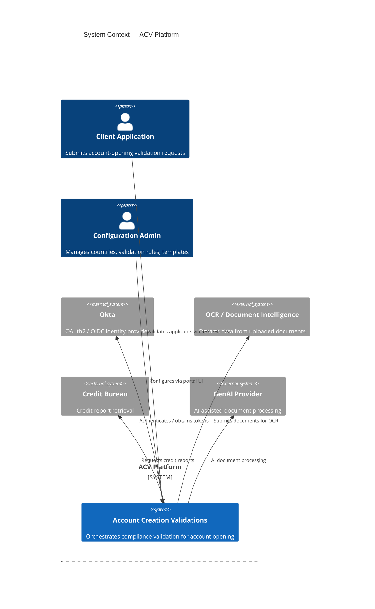
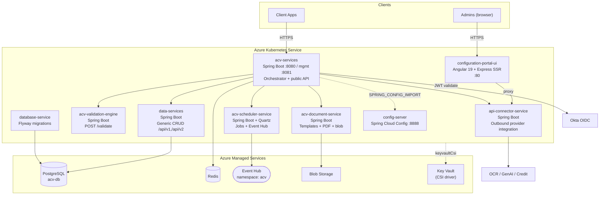

# 01 — Architecture Overview

> System context, key decisions, C4-style diagrams, and a component inventory for the ACV
> platform. See the [documentation home](README.md) for the repository map.
>
> **Last reviewed:** 2026-06-08

## Table of Contents
- [Goals & Architectural Style](#goals--architectural-style)
- [C4 Level 1 — System Context](#c4-level-1--system-context)
- [C4 Level 2 — Containers](#c4-level-2--containers)
- [Component Inventory](#component-inventory)
- [Technology Choices & Rationale](#technology-choices--rationale)
- [Cross-Cutting Concerns](#cross-cutting-concerns)
- [Key Architectural Decisions](#key-architectural-decisions)

---

## Goals & Architectural Style

ACV is a **microservices platform** built on **Spring Boot 3.3.x / Java 21**, deployed to
**Azure Kubernetes Service (AKS)**, with **externalized configuration** (Spring Cloud Config),
**shared cross-cutting library** (`acv-commons`), and **event-driven** asynchronous processing
via **Azure Event Hub**. Persistence is **PostgreSQL Flexible Server**; **Redis** provides
caching and validation-state storage; **Blob Storage** holds generated documents.

Architectural style summary:

| Concern | Approach | Evidence |
|---------|----------|----------|
| Decomposition | Microservices by capability | Separate repos / Spring Boot apps per service |
| Configuration | Centralized, externalized | `eai-3540813-config-server`, `eai-3540813-config-repo` |
| Shared logic | Library (not a service) | `eai-3540813-acv-commons` (JAR) |
| Async processing | Event-driven + scheduled jobs | `acv-scheduler-service`, Event Hub in [infra](../eai-3540813-infra/modules/infra/event-hub.tf) |
| Persistence | Relational + cache | `postgres.tf`, `redis.tf`, [config](../eai-3540813-config-repo/application.yml) |
| Auth | OAuth2 / OIDC | Okta starter in [acv-services pom](../eai-3540813-acv-services/pom.xml) |
| Infra | IaC | `eai-3540813-infra` (Terraform) |

---

## C4 Level 1 — System Context

---

## C4 Level 2 — Containers

> Evidence for ports & config: [`acv-services/helm-releases/nonprod-dev.yaml`](../eai-3540813-acv-services/helm-releases/nonprod-dev.yaml)
> (containerPort 8080/8081, `SPRING_CONFIG_IMPORT` to config-server, `keyvaultCsi`),
> [`config-repo/application.yml`](../eai-3540813-config-repo/application.yml) (datasource, Redis,
> actuator on 8081).

---

## Component Inventory

| Component | Responsibility | Key inbound | Key outbound | Source |
|-----------|----------------|-------------|--------------|--------|
| **acv-services** | Orchestrates the validation pipeline; public API; OTP; transaction state; triggers docs/jobs | Client REST | validation-engine, connector, document, scheduler, data, Redis, Okta | [controller pkg](../eai-3540813-acv-services/src/main/java/com/fedex/acv/validations/controller) |
| **api-connector-service** | Adapter to external OCR, credit, GenAI; config-portal proxy | acv-services / UI | OCR, credit, GenAI | [ConnectionsController.java](../eai-3540813-api-connector-service/src/main/java/com/fedex/acv/connections/controller/ConnectionsController.java) |
| **acv-validation-engine** | Stateless rule evaluation (name, address, date, ID, credit, etc.) | `POST /validate` | none (pure) | [service/impl](../eai-3540813-acv-validation-engine/src/main/java/com/fedex/acv/validation/engine/service/impl) |
| **acv-document-service** | Template management, PDF generation, blob upload/download | REST | Blob Storage | [controllers](../eai-3540813-acv-document-service/src/main/java/com/fedex/acv/document/controllers) |
| **acv-scheduler-service** | Quartz job scheduling; Event Hub send/read | REST `/job`,`/messages` | Event Hub, DB (qrtz_*) | [AcvQuartzController.java](../eai-3540813-acv-scheduler-service/src/main/java/com/fedex/acv/scheduler/controllers/AcvQuartzController.java) |
| **data-services** | Generic entity CRUD over PostgreSQL | `/api/v1`, `/api/v2` | PostgreSQL | [DataController.java](../eai-3540813-data-services/src/main/java/com/fedex/acv/data/controller/DataController.java) |
| **database-service** | Runs Flyway migrations to create/seed schema | startup | PostgreSQL | [FlywayDBInitializer.java](../eai-3540813-database-service/src/main/java/com/fedex/acv/database/FlywayDBInitializer.java) |
| **acv-commons** | Event Hub client, Redis, security filters, masking, utils | in-process | — | [acv-commons src](../eai-3540813-acv-commons/src/main) |
| **config-server** | Serves configuration from config-repo | services | config-repo | [config-server pom](../eai-3540813-config-server/pom.xml) |
| **configuration-portal-ui** | Admin UI for countries, rules, templates | Admins | connector proxy | [package.json](../eai-3540813-configuration-portal-ui/package.json) |

See [LLD](03-lld.md) for package/class-level detail and [API Reference](04-api-reference.md)
for the full endpoint catalog.

---

## Technology Choices & Rationale

| Choice | Why | Evidence |
|--------|-----|----------|
| Java 21 | Virtual threads for parallel external calls | `<java.version>21</java.version>` in poms |
| Spring Boot 3.3.x | Microservice baseline, actuator, security | [acv-services pom](../eai-3540813-acv-services/pom.xml) |
| Spring Cloud Config 2023.0.3 | Centralized config, per-env profiles | [config-server pom](../eai-3540813-config-server/pom.xml) |
| PostgreSQL 15 Flexible | Managed relational store, partitioning | [postgres.tf](../eai-3540813-infra/modules/infra/postgres.tf) |
| Redis (TLS 1.2) | Caching, validation state, token cache | [redis.tf](../eai-3540813-infra/modules/infra/redis.tf), [application.yml](../eai-3540813-config-repo/application.yml) |
| Azure Event Hub (Standard, 4 partitions, 7-day retention) | Async job/event streaming | [event-hub.tf](../eai-3540813-infra/modules/infra/event-hub.tf) |
| Okta OAuth2 | Enterprise SSO / token validation | okta-spring-boot-starter 3.0.6 |
| Quartz | Durable scheduled jobs | qrtz_* tables in [DB migrations](../eai-3540813-database-service/src/main/resources/acv-configuration/prod/V1_1__ACV_CREATE_TABLE.sql) |
| Flyway | Versioned DB migrations | [FlywayDBInitializer.java](../eai-3540813-database-service/src/main/java/com/fedex/acv/database/FlywayDBInitializer.java) |
| Angular 19 + ag-Grid + Okta | Admin portal | [package.json](../eai-3540813-configuration-portal-ui/package.json) |
| Terraform (Azure) | Reproducible infra | [eai-3540813-infra](../eai-3540813-infra/main.tf) |

---

## Cross-Cutting Concerns

- **Configuration:** Externalized via Spring Cloud Config; services import config with
  `SPRING_CONFIG_IMPORT=optional:configserver:...` (see helm `extraVars`).
- **Observability:** Spring Boot Actuator on port **8081**, Prometheus registry + Micrometer
  tracing (Brave); Dynatrace OneAgent injection annotation in Helm.
- **Security:** Okta OAuth2 resource server; URL allow-list in `application.yml`
  (`url.patterns.allowed`); request attribute masking (`acv.mask.request...`). See [Security](07-security.md).
- **Secrets:** Azure Key Vault via CSI driver (`keyvaultCsi` in Helm).
- **Resilience:** Async retry endpoints (`/v1/asyncRetry`, `/v1/retryWithPollOcr`) in
  acv-services; Quartz misfire handling in scheduler.

---

## Key Architectural Decisions

1. **Shared library over shared service for cross-cutting code** — `acv-commons` is embedded as
   a JAR to avoid a network hop; trade-off is that updates require consumer redeploys
   (see [acv-commons architecture](../Documentation/acv-commons/architecture.md)).
2. **Connector isolation** — All external provider calls funnel through
   `api-connector-service`, isolating third-party contracts and credentials.
3. **Stateless validation engine** — `acv-validation-engine` exposes a single `POST /validate`
   and holds no state, enabling horizontal scaling.
4. **Centralized configuration** — A dedicated config-server + git-style config-repo decouples
   deploy artifacts from environment configuration.
5. **Private networking** — Event Hub and other resources use
   `public_network_access_enabled = false` with private endpoints (see [infra](06-deployment.md)).

> Continue to the [High-Level Design »](02-hld.md)
