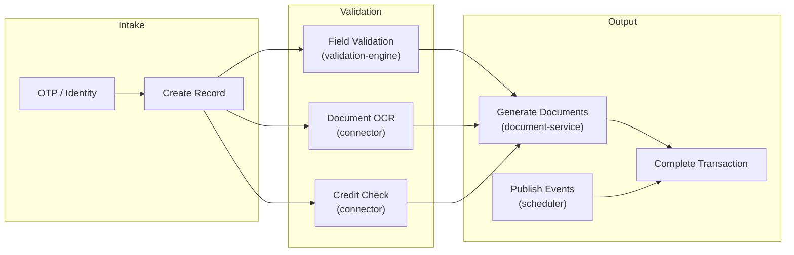
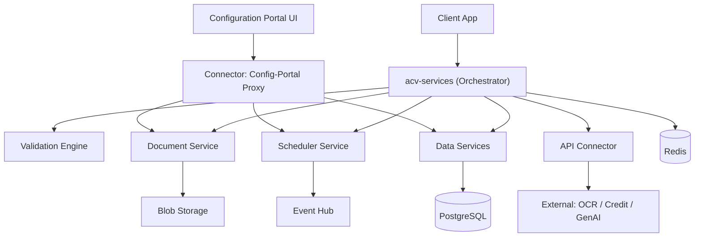
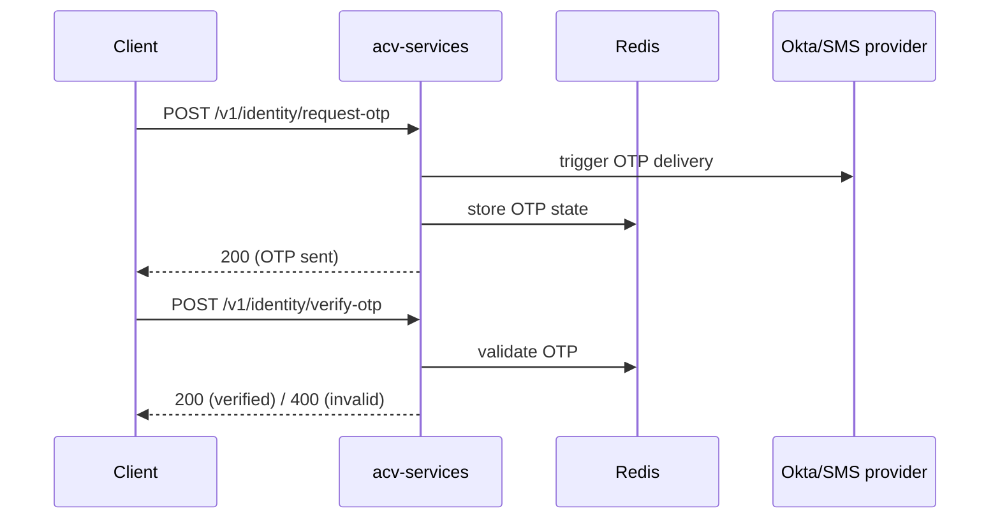
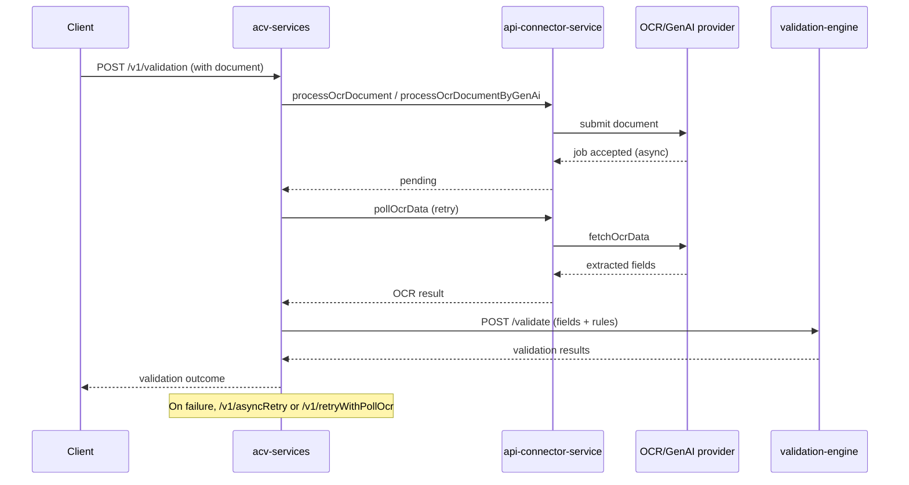
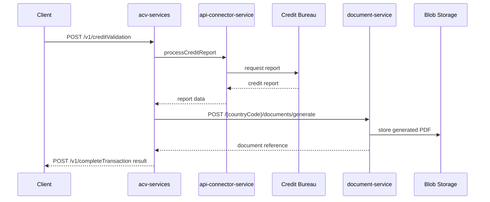
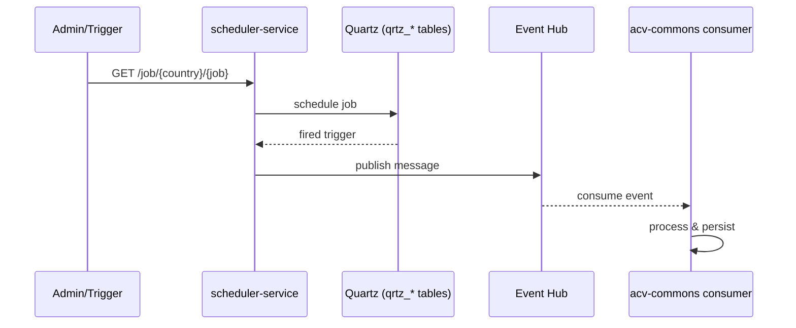

# 02 — High-Level Design (HLD)

> Functional capabilities, logical components, external integrations, non-functional
> requirements, and key end-to-end flows for the ACV platform.
>
> **Last reviewed:** 2026-06-08 · See also [Architecture](01-architecture.md) · [LLD](03-lld.md)

## Table of Contents
- [Functional Overview](#functional-overview)
- [Capability Map](#capability-map)
- [Logical Components](#logical-components)
- [External Integrations](#external-integrations)
- [Non-Functional Requirements](#non-functional-requirements)
- [Key End-to-End Flows](#key-end-to-end-flows)

---

## Functional Overview

The ACV platform validates applicants during **account opening**. Its major capabilities:

1. **Identity verification** — OTP request/verify (`/v1/identity/request-otp`, `/verify-otp`).
2. **Record management** — Create and track validation records/transactions (`/v1/records`).
3. **Field validation** — Rule-based checks via the validation engine (`/validate`).
4. **Document processing** — OCR extraction & GenAI processing via the connector.
5. **Credit checks** — Credit report retrieval & validation (`/v1/creditValidation`, `/v1/creditReport`).
6. **Compliance document generation** — Template-driven PDF generation & blob storage.
7. **Asynchronous orchestration** — Scheduled jobs and Event Hub messaging.
8. **Configuration administration** — Countries, validation sets, templates via the portal UI.

---

## Capability Map

---

## Logical Components

The **config-portal proxy** in `api-connector-service` routes admin UI traffic to the
data-service, scheduler-service, and document-service (see
[`ConfigPortalProxyController.java`](../eai-3540813-api-connector-service/src/main/java/com/fedex/acv/connections/controller/ConfigPortalProxyController.java)).

---

## External Integrations

| Integration | Direction | Via | Purpose | Evidence |
|-------------|-----------|-----|---------|----------|
| Okta OIDC | Outbound | acv-services | Token issuance/validation | `/oktaToken/{service}` in [AuthTokenController](../eai-3540813-acv-services/src/main/java/com/fedex/acv/validations/controller/AuthTokenController.java) |
| OCR / Document Intelligence | Outbound | connector | Extract document data | `processOcrDocument`, `analyzeDocumentLayout` in connector |
| GenAI | Outbound | connector | AI-assisted OCR / structured output | `processOcrDocumentByGenAi`, `structuredOutput` |
| Credit bureau | Outbound | connector | Credit reports | `processCreditReport`, `fetchCreditReportData` |
| Event Hub | Bi-directional | scheduler / commons | Async events & jobs | [event-hub.tf](../eai-3540813-infra/modules/infra/event-hub.tf) |
| Blob Storage | Outbound | document-service | Store generated PDFs | [BlobStorageController](../eai-3540813-acv-document-service/src/main/java/com/fedex/acv/document/controllers/BlobStorageController.java) |

> Secret names for these integrations (e.g. `GENAI_CLIENT_ID`, `RUBIX_API_KEY`,
> `WREG_EVENTHUB_*`) are mounted from Key Vault — see
> [`acv-services/helm-releases/nonprod-dev.yaml`](../eai-3540813-acv-services/helm-releases/nonprod-dev.yaml).

---

## Non-Functional Requirements

| Attribute | Design | Evidence / Notes |
|-----------|--------|------------------|
| **Scalability** | Stateless services + Redis-externalized state; HPA-ready | `replicaCount`, stateless validation engine |
| **Performance** | Java 21 virtual threads; Redis caching (TTL 86,400,000 ms); connection pooling (pgbouncer) | [application.yml](../eai-3540813-config-repo/application.yml), [postgres.tf](../eai-3540813-infra/modules/infra/postgres.tf) |
| **Availability** | Liveness/readiness probes; multi-replica; PostgreSQL zone config | actuator health groups in `application.yml` |
| **Security** | OAuth2, Key Vault CSI, private endpoints, TLS 1.2 (Redis) | [Security](07-security.md) |
| **Observability** | Actuator, Prometheus, Micrometer tracing, Dynatrace | `management.*` in config; Helm annotation |
| **Resilience** | Async retry + OCR polling; Quartz misfire handling | retry endpoints in acv-services |
| **Configurability** | Centralized config + cache refresh (4h fixedDelay) | `cache.refresh.fixedDelay.in.milliseconds: 14400000` |

> Resource sizing (dev): requests 0.5 CPU / 1Gi, limits 1 CPU / 2Gi — see
> [helm-releases/nonprod-dev.yaml](../eai-3540813-acv-services/helm-releases/nonprod-dev.yaml).

---

## Key End-to-End Flows

### Flow 1 — Identity verification (OTP)

### Flow 2 — Document validation with OCR + retry

### Flow 3 — Credit validation & document generation

### Flow 4 — Scheduled job + Event Hub

> Continue to the [Low-Level Design »](03-lld.md)
