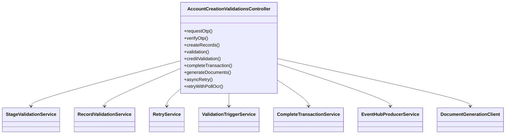
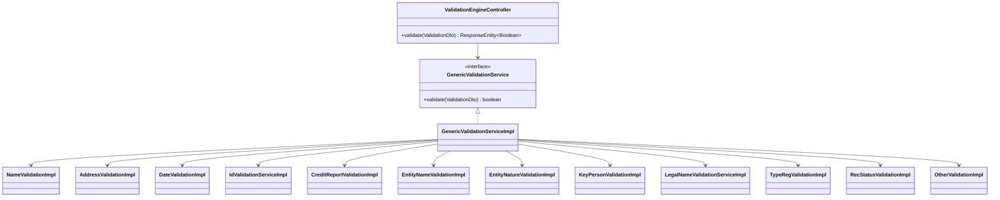
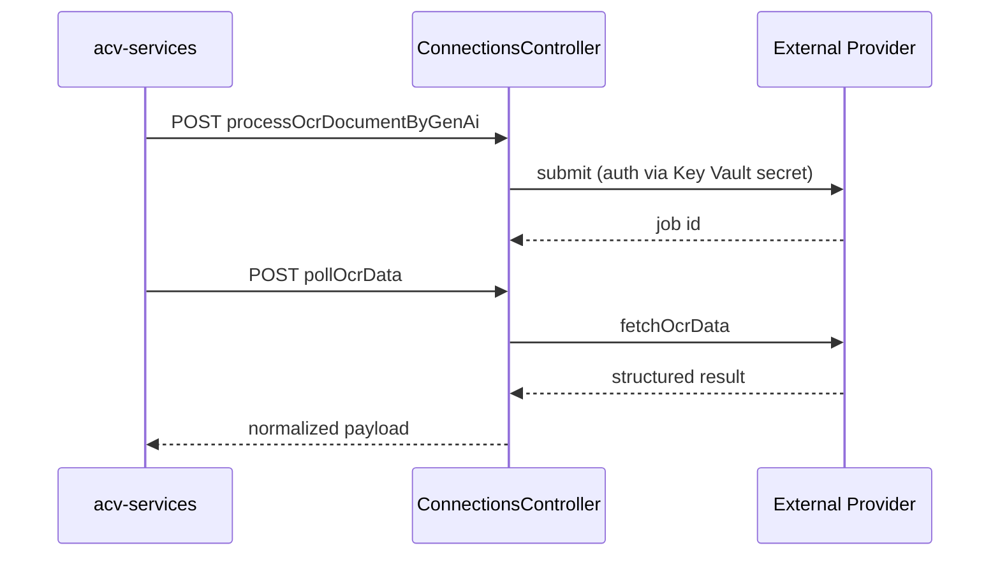
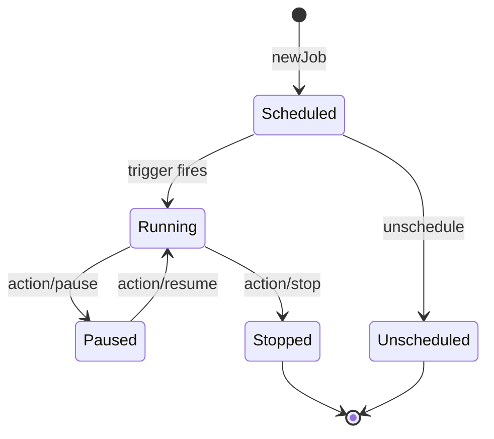
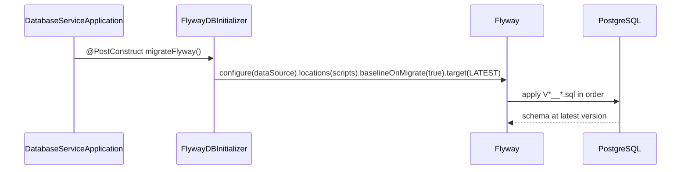

# 03 — Low-Level Design (LLD)

> Module/package breakdown, class design, key algorithms, and detailed sequence diagrams.
> Grounded in source files with relative links.
>
> **Last reviewed:** 2026-06-08 · See also [HLD](02-hld.md) · [API Reference](04-api-reference.md)

## Table of Contents
- [acv-services (Orchestrator)](#acv-services-orchestrator)
- [acv-validation-engine](#acv-validation-engine)
- [api-connector-service](#api-connector-service)
- [acv-document-service](#acv-document-service)
- [acv-scheduler-service](#acv-scheduler-service)
- [data-services](#data-services)
- [database-service](#database-service)
- [acv-commons (Shared Library)](#acv-commons-shared-library)
- [Configuration Parameters](#configuration-parameters)

---

## acv-services (Orchestrator)

**Package root:** `com.fedex.acv.validations` —
[source](../eai-3540813-acv-services/src/main/java/com/fedex/acv/validations).

The `AccountCreationValidationsController` is the public entrypoint and delegates to a set of
collaborating services (constructor + field injection):

> Evidence: [`AccountCreationValidationsController.java`](../eai-3540813-acv-services/src/main/java/com/fedex/acv/validations/controller/AccountCreationValidationsController.java)
> (fields `stageValidationService`, `recordValidationService`, `retryService`,
> `validationTriggerService`, `completeTransactionService`, `eventHubProducerService`,
> `documentGenerationClient`). Method-level observability via `@Observed` (Micrometer).

Other controllers:
- `ConfigurationController` — `/config/v1/countries`, `/config/v1/country/{countryCode}/documents`.
- `AuthTokenController` — `/oktaToken/{service}` returns a token (text/plain).

> TODO: confirm — internal service-layer class names beyond those injected above were not all
> read; see the `service` package for full detail.

---

## acv-validation-engine

**Package root:** `com.fedex.acv.validation.engine`. A single controller exposes `POST /validate`
and delegates to `GenericValidationService`, which dispatches to per-type `@Service`
implementations (Strategy pattern).

> Evidence: [`ValidationEngineController.java`](../eai-3540813-acv-validation-engine/src/main/java/com/fedex/acv/validation/engine/controller/ValidationEngineController.java)
> and the `service/impl` package
> ([impls](../eai-3540813-acv-validation-engine/src/main/java/com/fedex/acv/validation/engine/service/impl)).
> `ComparisonType` under `primitive/validation` provides comparison primitives.

**Design notes:**
- **Stateless & pure** — returns a `Boolean`; no persistence, enabling free horizontal scaling.
- **Strategy dispatch** — each validation type is an injectable `@Service`, selected by the
  `ValidationDto` contents.

---

## api-connector-service

**Package root:** `com.fedex.acv.connections`. Two controllers:

| Controller | Path | Responsibility |
|------------|------|----------------|
| `ConnectionsController` | (root) | External provider operations: `fetchData`, `processOcrDocument`, `fetchOcrData`, `pollOcrData`, `processCreditReport`, `fetchCreditReportData`, `pollCreditData`, `fetchProductIds/{description}/{provider}`, `publishMsg`, `analyzeDocumentLayout`, `structuredOutput`, `processOcrDocumentByGenAi` |
| `ConfigPortalProxyController` | `/config-portal` | Proxies admin UI to `data-service/{endPoint}`, `scheduler-service/{*endPoint}`, `document-service/{countryCode}/generateDocument` |

> Evidence: [`ConnectionsController.java`](../eai-3540813-api-connector-service/src/main/java/com/fedex/acv/connections/controller/ConnectionsController.java),
> [`ConfigPortalProxyController.java`](../eai-3540813-api-connector-service/src/main/java/com/fedex/acv/connections/controller/ConfigPortalProxyController.java).

---

## acv-document-service

**Package root:** `com.fedex.acv.document`. Three controllers:

| Controller | Base path | Key operations |
|------------|-----------|----------------|
| `TemplateManagementController` | `/template/api/v1` | `GET /sections/_search`, `POST /sections`, `POST /sections/{sectionId}`, `POST /{countryCode}/templates`, `GET /{countryCode}/templates`, `POST /{countryCode}/template_mappings`, `GET /data/{transactionId}`, `POST /{countryCode}/document/preview` |
| `DocumentManagementController` | `/api/v1` | `POST /{countryCode}/documents/generate`, `/generateAdhoc`, `/download`, `/preview`, `GET /{countryCode}/{transactionId}/{uploadPath}/{fileName}` |
| `BlobStorageController` | `/blob/api/v1/storage` | `POST /upload` (multipart), `GET /download/{fileName}`, `DELETE /delete/{fileName}` |

> Evidence: [document controllers](../eai-3540813-acv-document-service/src/main/java/com/fedex/acv/document/controllers).
> PDF output via `produces = application/pdf`.

---

## acv-scheduler-service

**Package root:** `com.fedex.acv.scheduler`. Quartz-backed job management + Event Hub messaging.

| Controller | Base path | Operations |
|------------|-----------|------------|
| `AcvQuartzController` | `/job` | `GET /{country}/{job}`, `/newJob`, `/unschedule`, `/action/pause`, `/action/resume/{jobName}`, `/getAllJobs`, `/checkJobName`, `/status/isJobRunning`, `/status/jobState`, `/action/stop`, `/action/start` |
| `MessagesController` | `/messages` | `POST /random/{count}`, `POST /send`, `GET /read` |
| `PingController` | (root) | `GET /ping` |

> Job state persisted in Quartz tables (`qrtz_*`) — see
> [V1_1 migration](../eai-3540813-database-service/src/main/resources/acv-configuration/prod/V1_1__ACV_CREATE_TABLE.sql).

---

## data-services

**Package root:** `com.fedex.acv.data`. Generic CRUD over PostgreSQL.

| Controller | Base path | Operations |
|------------|-----------|------------|
| `DataController` | `/api/v1` | `POST /{entity}`, `POST /{entity}/{ctryCd}`, `POST list/{entityList}` |
| `DataControllerV2` | `/api/v2` | `POST /GET/{entity}`, `POST /ADD/{entity}` |

> Evidence: [`DataController.java`](../eai-3540813-data-services/src/main/java/com/fedex/acv/data/controller/DataController.java),
> [`DataControllerV2.java`](../eai-3540813-data-services/src/main/java/com/fedex/acv/data/controller/DataControllerV2.java).
> The generic `{entity}` path parameter maps requests to configured entities/tables.

---

## database-service

A bootstrap application whose job is to **run Flyway migrations** at startup.

> Evidence: [`FlywayDBInitializer.java`](../eai-3540813-database-service/src/main/java/com/fedex/acv/database/FlywayDBInitializer.java).
> Migration scripts live under `src/main/resources/acv-configuration/{local,dev,test,prod}`.
> Errors are caught and logged (not rethrown) inside `migrateFlyway()`.

---

## acv-commons (Shared Library)

A JAR embedded in consuming services providing Event Hub producer/consumer, Redis access,
security filters, request masking, and shared utilities. It is **not** independently deployed.
See [acv-commons docs](../Documentation/acv-commons/LLD.md) for class-level detail.

---

## Configuration Parameters

Selected parameters from [`config-repo/application.yml`](../eai-3540813-config-repo/application.yml):

| Key | Value (default) | Effect |
|-----|-----------------|--------|
| `spring.datasource.url` | `jdbc:postgresql://${POSTGRES_DB_ENDPOINT}/${POSTGRES_DB_NAME}` | Primary DB connection |
| `spring.cache.redis.time-to-live` | `86400000` ms (24h) | Default Redis cache TTL |
| `spring.data.redis.ssl.enabled` | `${REDIS_SSL}` | TLS to Redis |
| `management.server.port` | `8081` | Actuator/management port |
| `cache.refresh.fixedDelay.in.milliseconds` | `14400000` (4h) | Periodic config cache refresh |
| `url.patterns.allowed` | `/actuator/**,/swagger-ui/**,/v3/api-docs/**,/oktaToken/**,/commons/**,/config-portal/**` | Public (unauthenticated) URL allow-list |
| `acv.mask.request.attribute.visible.length` | `4` | Sensitive-field masking visible chars |

Profiles: `application-{local,dev,test,prod}.yml` override per environment.

> Continue to the [API Reference »](04-api-reference.md)
