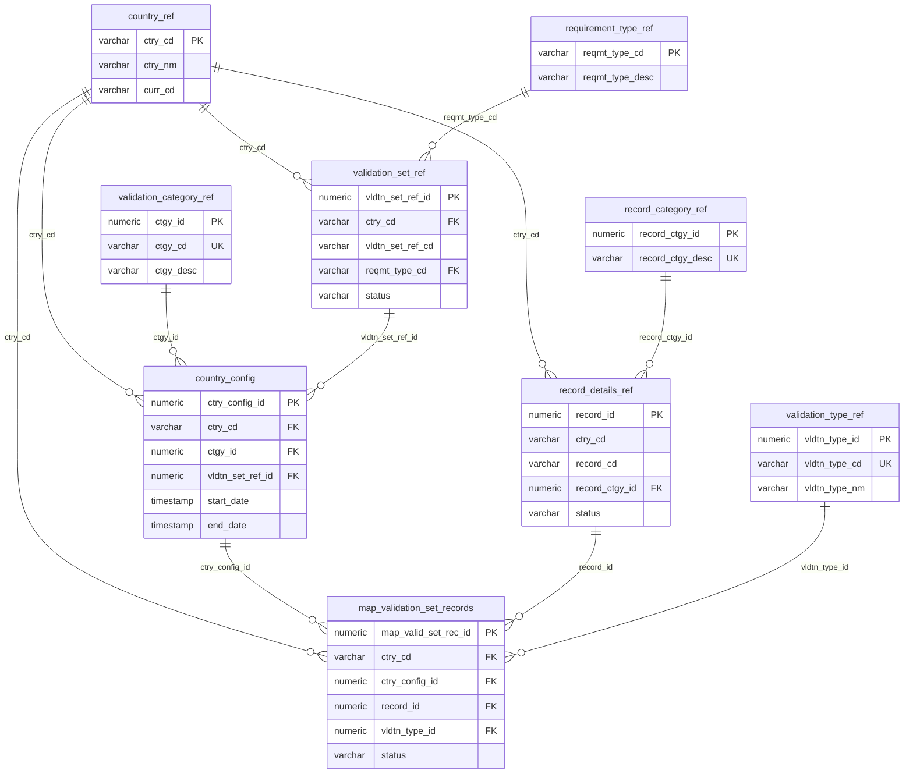
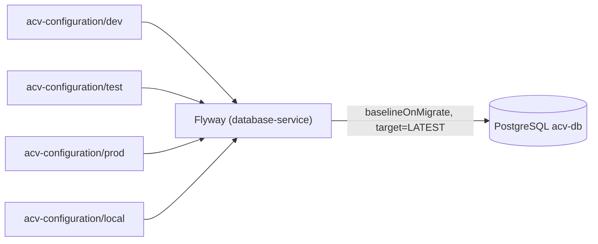

# 05 — Data & Database Design

> Relational data model for the ACV platform. The schema is created and versioned by
> `database-service` via **Flyway** migrations under
> `src/main/resources/acv-configuration/{local,dev,test,prod}`. The runtime store is
> **PostgreSQL 15 Flexible Server** (`acv-db`).
>
> **Last reviewed:** 2026-06-08 · See also [LLD](03-lld.md) · [Deployment](06-deployment.md)

## Table of Contents
- [Storage Overview](#storage-overview)
- [Configuration / Reference Model (ER)](#configuration--reference-model-er)
- [Table Catalog](#table-catalog)
- [Quartz Scheduler Tables](#quartz-scheduler-tables)
- [Transaction & Document Tables](#transaction--document-tables)
- [Sequences & Conventions](#sequences--conventions)
- [Migrations & Lifecycle](#migrations--lifecycle)
- [Caching Strategy](#caching-strategy)

---

## Storage Overview

| Store | Technology | Purpose | Evidence |
|-------|-----------|---------|----------|
| Primary DB | PostgreSQL 15 Flexible | Config, validation, transactions, Quartz | [postgres.tf](../eai-3540813-infra/modules/infra/postgres.tf) |
| Cache | Redis (TLS 1.2) | Caching, validation state, tokens | [redis.tf](../eai-3540813-infra/modules/infra/redis.tf) |
| Object store | Azure Blob Storage | Generated documents / uploads | [storage-account.tf](../eai-3540813-infra/modules/infra/storage-account.tf) |
| Stream | Azure Event Hub | Async events (4 partitions, 7-day retention) | [event-hub.tf](../eai-3540813-infra/modules/infra/event-hub.tf) |

PostgreSQL parameters of note (from [postgres.tf](../eai-3540813-infra/modules/infra/postgres.tf)):
`pgbouncer.enabled = true`, extensions `pgcrypto, pg_stat_statements, uuid-ossp, pg_trgm,
fuzzystrmatch, hypopg`, `work_mem = 524288`.

---

## Configuration / Reference Model (ER)

The configuration model drives **which validations apply to which records for which country**.

> Evidence: [V1_0__ACV_CREATE_TABLE.sql](../eai-3540813-database-service/src/main/resources/acv-configuration/prod/V1_0__ACV_CREATE_TABLE.sql)
> (foreign keys `fk_validation_set_ref_ctry_cd`, `fk_country_config_*`,
> `fk_map_valid_set_rec_*`).

---

## Table Catalog

Reference / configuration tables (from the V1_0 migration):

| Table | PK | Purpose |
|-------|----|---------|
| `requirement_type_ref` | `reqmt_type_cd` | Requirement type lookup |
| `record_category_ref` | `record_ctgy_id` | Record category lookup |
| `country_ref` | `ctry_cd` | Countries + currency code |
| `currency_ref` | — | Currency lookup |
| `validation_category_ref` | `ctgy_id` | Validation category |
| `validation_set_ref` | `vldtn_set_ref_id` | Validation set per country/requirement |
| `validation_type_ref` | `vldtn_type_id` | Validation type catalog |
| `country_config` | `ctry_config_id` | Effective-dated config linking country↔category↔set |
| `record_details_ref` | `record_id` | Record definitions per country |
| `map_record_set` | — | Record-to-set mapping |
| `map_validation_set_records` | `map_valid_set_rec_id` | Resolves which validations apply |
| `section_config_ref` / `doc_section_config_ref` | — | Document section config |
| `document_ref` | — | Document definitions |
| `document_section_mapping` | — | Document↔section mapping |
| `template_for_document_generation_ref` | — | Template references |
| `address` / `address_info` | — | Address data |
| `individual_details` / `company_details` | — | Applicant detail |
| `director_details` | — | Company directors |

> The full column lists for document/transaction tables span later migrations; see the
> `acv-configuration/prod` folder.

---

## Quartz Scheduler Tables

The `acv-scheduler-service` persists Quartz state in standard `qrtz_*` tables created by
[V1_1__ACV_CREATE_TABLE.sql](../eai-3540813-database-service/src/main/resources/acv-configuration/prod/V1_1__ACV_CREATE_TABLE.sql):

`qrtz_scheduler_state`, `qrtz_paused_trigger_grps`, `qrtz_locks`, `qrtz_fired_triggers`,
`qrtz_cron_triggers`, `qrtz_calendars`, `qrtz_blob_triggers`, `qrtz_simprop_triggers`,
`qrtz_simple_triggers`, `qrtz_triggers`, `qrtz_job_details` (plus supporting indexes).

These provide durable, cluster-safe job scheduling (jobs survive restarts; locks coordinate
multiple scheduler replicas).

---

## Transaction & Document Tables

Operational tables observed in the schema (drop/create list in V1_0):

| Table | Purpose |
|-------|---------|
| `acv_api_interface` | API interface tracking (OCR/credit enhancements) |
| `acv_transaction_tracker` | Per-transaction state tracking |
| `acv_eventhub_tracker` | Event Hub message tracking |
| `validation_request` / `validation_requests` | Inbound validation requests |
| `request_payload` | Raw request payloads |
| `document_transactions` / `document_tran_detail` | Document generation transactions |
| `document_generated_transactions` | Generated document records |
| `document_info` / `document_information` | Document metadata |
| `acv_crud_config_info` | CRUD config used by data-services |

> Evidence: DROP/CREATE statements in
> [V1_0__ACV_CREATE_TABLE.sql](../eai-3540813-database-service/src/main/resources/acv-configuration/prod/V1_0__ACV_CREATE_TABLE.sql).
> TODO: confirm — full column definitions for these operational tables appear across multiple
> migration files; consult the latest `V*` script for authoritative columns.

---

## Sequences & Conventions

- **Surrogate keys** use dedicated sequences (e.g. `validation_set_ref_id_seq`,
  `country_config_id_seq`) with `numeric(20,0)` IDs.
- **Audit columns** are consistent across tables: `crt_user`, `crt_dt`, `upd_user`, `upd_dt`
  (defaults `USER` / `current_timestamp`).
- **Naming**: abbreviated snake_case (`ctry_cd`, `vldtn_set_ref_id`); reference tables suffixed
  `_ref`, mapping tables prefixed `map_`, config tables suffixed `_config`.

---

## Migrations & Lifecycle

- Migrations are **environment-specific folders**; the active location is set via
  `spring.datasource.acv.flyway.scripts`.
- `baselineOnMigrate(true)` allows applying to a pre-existing database.
- Versioned files follow `V<major>_<minor>__<DESCRIPTION>.sql` and run in order.

> Developer DB access is environment-scoped: **nonprod** allows DML
> (`SELECT/INSERT/UPDATE/DELETE/TRUNCATE`), **prod** is `SELECT`-only — see
> `developer_access` in [postgres.tf](../eai-3540813-infra/modules/infra/postgres.tf).

---

## Caching Strategy

- Redis cache type configured globally (`spring.cache.type: redis`) with default TTL
  **86,400,000 ms (24h)**.
- Application-level config cache refresh runs every **4 hours**
  (`cache.refresh.fixedDelay.in.milliseconds: 14400000`).
- TLS to Redis is toggled by `${REDIS_SSL}`; infra enforces `minimum_tls_version = 1.2`.

> Continue to the [Deployment Guide »](06-deployment.md)
