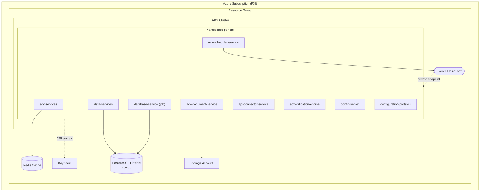
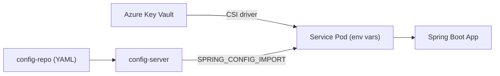
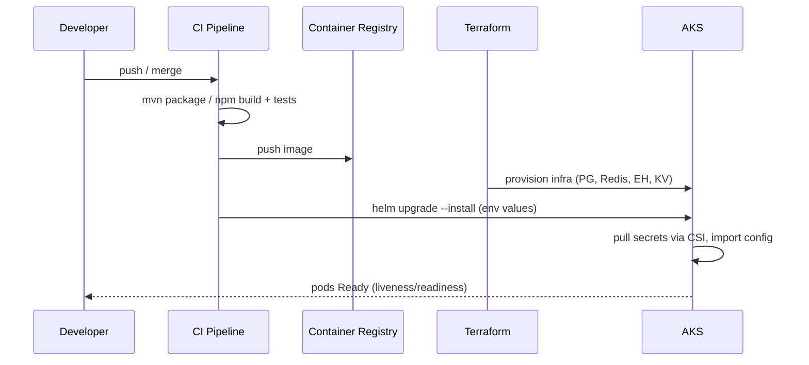

# 06 — Deployment Guide

> Build, packaging, infrastructure topology, environments, and CI/CD for the ACV platform.
> The platform runs on **Azure Kubernetes Service (AKS)**, is configured via **Helm**, and is
> provisioned with **Terraform** (`eai-3540813-infra`).
>
> **Last reviewed:** 2026-06-08 · See also [Architecture](01-architecture.md) · [Security](07-security.md)

## Table of Contents
- [Build & Packaging](#build--packaging)
- [Infrastructure Topology](#infrastructure-topology)
- [Terraform Modules](#terraform-modules)
- [Helm & Kubernetes](#helm--kubernetes)
- [Environments](#environments)
- [Configuration & Secrets](#configuration--secrets)
- [Deployment Flow](#deployment-flow)
- [Scaling & Health](#scaling--health)

---

## Build & Packaging

| Service type | Build | Output |
|--------------|-------|--------|
| Java services | Maven (`./mvnw clean package`) | Spring Boot fat JAR → container image |
| Angular UI | `npm run build:dev|test|prod` (`ng build`) | Static bundle served by Express |
| Shared lib | Maven install | `acv-commons` JAR to registry |

Java services target **Java 21** and Spring Boot **3.3.x**. The UI uses **Angular 19** with an
Express server (`@types/express`, `express` dependency) for SSR/static hosting.

> Evidence: [`acv-services/pom.xml`](../eai-3540813-acv-services/pom.xml),
> [`configuration-portal-ui/package.json`](../eai-3540813-configuration-portal-ui/package.json).
> TODO: confirm — Dockerfiles were not located in the sampled repos; container build is likely
> driven by a shared CI template (`cicd-maven-settings.xml` present in each Java repo).

---

## Infrastructure Topology



All data resources use **private endpoints** with `public_network_access_enabled = false`
(see [event-hub.tf](../eai-3540813-infra/modules/infra/event-hub.tf)). Private DNS, tenant, and
FXI provider aliases are wired in [main.tf](../eai-3540813-infra/main.tf)
(`azurerm.onpremdns`, `azurerm.tnt_pendp`, `azurerm.fxi_pendp`).

---

## Terraform Modules

The root module `eai-3540813-infra` composes a single `infra` module
([main.tf](../eai-3540813-infra/main.tf)) whose resources are:

| File | Resource |
|------|----------|
| [postgres.tf](../eai-3540813-infra/modules/infra/postgres.tf) | PostgreSQL Flexible Server (SQL 15), `acv-db`, pgbouncer, extensions |
| [redis.tf](../eai-3540813-infra/modules/infra/redis.tf) | Redis Cache (Standard C, TLS 1.2) |
| [event-hub.tf](../eai-3540813-infra/modules/infra/event-hub.tf) | Event Hub namespace `acv` (Standard, 4 partitions, 7-day retention) |
| [storage-account.tf](../eai-3540813-infra/modules/infra/storage-account.tf) | Blob storage |
| [kv.tf](../eai-3540813-infra/modules/infra/kv.tf) / [secrets.tf](../eai-3540813-infra/modules/infra/secrets.tf) | Key Vault + secrets |
| [delphix.tf](../eai-3540813-infra/modules/infra/delphix.tf), [delphix_k8s_vdbs.tf](../eai-3540813-infra/modules/infra/delphix_k8s_vdbs.tf) | Delphix virtual databases (data masking/provisioning) |
| [labels.tf](../eai-3540813-infra/modules/infra/labels.tf), [rg.tf](../eai-3540813-infra/modules/infra/rg.tf) | Naming labels, resource group |

State is stored remotely (see [backend.tf](../eai-3540813-infra/backend.tf)); cross-stack
references come from `data.terraform_remote_state` (main, network, aks, app) in
[main.tf](../eai-3540813-infra/main.tf).

---

## Helm & Kubernetes

Each deployable service has a `helm-releases/` directory with per-environment values:
`nonprod-dev.yaml`, `nonprod-test.yaml`, `prod.yaml`.

Key settings (from
[`acv-services/helm-releases/nonprod-dev.yaml`](../eai-3540813-acv-services/helm-releases/nonprod-dev.yaml)):

```yaml
replicaCount: 1
resources:
  limits:   { cpu: '1',   memory: "2Gi" }
  requests: { cpu: '0.5', memory: "1Gi" }
container:
  ports:
    - { name: http,   containerPort: 8080, servicePort: 80 }
    - { name: manage, containerPort: 8081, servicePort: 80 }
keyvaultCsi:
  enabled: true            # secrets mounted from Azure Key Vault
serviceAccountName: "acv-dev"
annotations:
  deployment:
    oneagent.dynatrace.com/inject: "true"   # Dynatrace APM
```

Services receive configuration via `extraVars`:
- `SPRING_CLOUD_CONFIG_ENABLED=true`
- `SPRING_CONFIG_IMPORT=optional:configserver:https://config-server-...fedex.com/acv/config`
- `SPRING_APPLICATION_NAME=eai-3540813-acv-services`

---

## Environments

| Environment | Cluster | Profile | Config file | DB access |
|-------------|---------|---------|-------------|-----------|
| **dev** | nonprod | `dev` | `application-dev.yml` | DML allowed |
| **test** | nonprod | `test` | `application-test.yml` | DML allowed |
| **prod** | prod | `prod` | `application-prod.yml` | SELECT only |
| **local** | local | `local` | `application-local.yml` | local |

> Profiles live in [config-repo](../eai-3540813-config-repo); DB grant differences are in
> `developer_access` in [postgres.tf](../eai-3540813-infra/modules/infra/postgres.tf).

---

## Configuration & Secrets



- **Non-secret config**: served by `config-server` from `config-repo`.
- **Secrets**: mounted from Key Vault via the **CSI driver** (`keyvaultCsi` block lists
  `ACV_CLIENT_ID`, `ACV_CLIENT_SECRET`, `WREG_EVENTHUB_*`, `GENAI_*`, `RUBIX_API_KEY`, etc.).
- See [Security](07-security.md) for the full secret inventory and handling.

---

## Deployment Flow



> TODO: confirm — the concrete CI system (e.g. Jenkins/GitLab/GitHub Actions) was not present
> in the sampled files; `cicd-maven-settings.xml` and `cicd-foss-authorized-users.txt` indicate
> a standardized FedEx CICD template.

**Rollback:** `helm rollback <release> <revision>` reverts to a prior chart revision; database
changes are forward-only Flyway migrations (design new migrations to roll forward).

---

## Scaling & Health

- **Health:** Actuator liveness/readiness groups on port 8081
  (`/actuator/health/liveness`, `/actuator/health/readiness`) — see
  [application.yml](../eai-3540813-config-repo/application.yml).
- **Scaling:** Stateless services scale via `replicaCount` / HPA; the validation engine and
  connector are good horizontal-scale candidates.
- **APM:** Dynatrace OneAgent injection; Prometheus metrics at `/actuator/prometheus`.

> Continue to [Security »](07-security.md)
