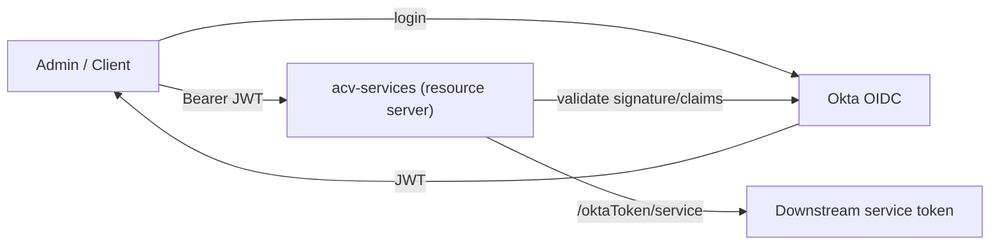

# 07 — Security

> Authentication, authorization, secret management, data protection, and OWASP-relevant
> safeguards present in the ACV platform.
>
> **Last reviewed:** 2026-06-08 · See also [Deployment](06-deployment.md) · [API Reference](04-api-reference.md)

## Table of Contents
- [Authentication & Authorization](#authentication--authorization)
- [Public vs Protected Endpoints](#public-vs-protected-endpoints)
- [Token Flow](#token-flow)
- [Secret Management](#secret-management)
- [Data Protection & Masking](#data-protection--masking)
- [Network Security](#network-security)
- [OWASP Considerations](#owasp-considerations)

---

## Authentication & Authorization

- **Identity provider:** Okta (OAuth2 / OIDC). Java services include
  `okta-spring-boot-starter` (3.0.6) and `spring-boot-starter-security`
  (see [acv-services pom](../eai-3540813-acv-services/pom.xml)).
- **Model:** Services act as **OAuth2 resource servers** validating Okta-issued JWT bearer
  tokens on protected routes.
- **UI:** The portal uses `@okta/okta-angular` + `@okta/okta-auth-js` for interactive login
  (see [package.json](../eai-3540813-configuration-portal-ui/package.json)).



---

## Public vs Protected Endpoints

The allow-list of **unauthenticated** path patterns is configured centrally in
[`application.yml`](../eai-3540813-config-repo/application.yml):

```
url.patterns.allowed: /actuator/**,/swagger-ui/**,/v3/api-docs/**,/oktaToken/**,/commons/**,/config-portal/**
```

| Pattern | Why public |
|---------|-----------|
| `/actuator/**` | Health/metrics probes (port 8081) |
| `/swagger-ui/**`, `/v3/api-docs/**` | API documentation |
| `/oktaToken/**` | Token bootstrap endpoint |
| `/commons/**` | Shared library endpoints |
| `/config-portal/**` | Portal proxy entrypoint |

> All other endpoints require a valid bearer token. TODO: confirm — verify the security filter
> chain in each service's security configuration enforces this allow-list (the property is the
> source of truth referenced by `acv-commons` security config).

---

## Token Flow

`AuthTokenController` exposes `GET /oktaToken/{service}` which returns a token (text/plain) used
for service-to-service calls (see
[AuthTokenController.java](../eai-3540813-acv-services/src/main/java/com/fedex/acv/validations/controller/AuthTokenController.java)).
Client credentials (`ACV_CLIENT_ID`, `ACV_CLIENT_SECRET`) are sourced from Key Vault.

---

## Secret Management

Secrets are **never** stored in source or config-repo; they are mounted into pods from **Azure
Key Vault via the CSI driver** (`keyvaultCsi` block in Helm values). Inventory from
[`acv-services/helm-releases/nonprod-dev.yaml`](../eai-3540813-acv-services/helm-releases/nonprod-dev.yaml):

| Env var | Key Vault secret | Used for |
|---------|------------------|----------|
| `ACV_CLIENT_ID` / `ACV_CLIENT_SECRET` | `clientId` / `clientSecret` | Okta client credentials |
| `WREG_EVENTHUB_HOSTNAME` | `wregEventHubHostName` | Event Hub host |
| `WREG_EVENTHUB_CONSUMER` / `WREG_EVENTHUB_PRODUCER` | `wregConsumerEventHubName` / `wregProducerEventHubName` | Event Hub names |
| `GENAI_CLIENT_ID` / `GENAI_CLIENT_SECRET` | `genai-client-id` / `genai-client-secret` | GenAI provider |
| `RUBIX_API_KEY` | `rubix-api-key` | External provider key |
| `WREG_DOWNLOAD_KEY` | `wregDocumentDownloadKeys` | Document download |
| `EVENTHUB_CLIENT_ID` | `eventhub-client-id` | Event Hub auth |

Key Vault tenant/client IDs are referenced (not secret values) in the Helm `keyvaultCsi.config`
block; the workload uses a managed service account (`serviceAccountName: acv-dev`).

> **Note:** the Helm file contains Key Vault name, client ID, and tenant ID values. These are
> identifiers (not credentials); actual secret material stays in Key Vault. Avoid committing any
> real secret values to `config-repo` or Helm.

---

## Data Protection & Masking

- **Request masking:** Sensitive request attributes are masked, exposing only the last N chars
  (`acv.mask.request.attribute.visible.length: 4`, and the connector equivalent
  `acv.api.connector.mask...`). See [application.yml](../eai-3540813-config-repo/application.yml).
- **In transit:** TLS to Redis enforced (`minimum_tls_version = 1.2` in
  [redis.tf](../eai-3540813-infra/modules/infra/redis.tf)); HTTPS for config-server import.
- **At rest:** PostgreSQL with `pgcrypto` extension available; Azure-managed encryption for
  PostgreSQL, Redis, Blob, and Key Vault.
- **Data provisioning:** Delphix virtual DBs (infra) support masked non-prod data.

---

## Network Security

- **Private endpoints:** Event Hub and managed data services set
  `public_network_access_enabled = false` and attach private endpoints across the on-prem,
  tenant, and FXI networks (provider aliases `onpremdns`, `tnt_pendp`, `fxi_pendp` in
  [main.tf](../eai-3540813-infra/main.tf), [event-hub.tf](../eai-3540813-infra/modules/infra/event-hub.tf)).
- **Connector isolation:** All third-party calls route through `api-connector-service`,
  centralizing egress and credential use.

---

## OWASP Considerations

| OWASP risk | Safeguard in ACV |
|------------|------------------|
| A01 Broken Access Control | OAuth2 resource server + explicit public allow-list |
| A02 Cryptographic Failures | TLS 1.2 (Redis), Azure-managed encryption at rest, pgcrypto |
| A03 Injection | Spring Data JPA / parameterized queries; Bean Validation (`spring-boot-starter-validation`) |
| A05 Security Misconfiguration | Centralized config, Key Vault secrets, private networking |
| A07 Auth Failures | Okta-managed authentication & token validation |
| A09 Logging/Monitoring Failures | Actuator + Prometheus + Dynatrace + Micrometer tracing |
| Sensitive Data Exposure | Request-attribute masking, masked non-prod data (Delphix) |

> TODO: confirm — verify input validation coverage on the generic `data-services` `{entity}`
> endpoints and the scheduler `GET`-based mutating actions (e.g. `/job/action/stop`), which use
> GET for state changes and should be reviewed for CSRF/idempotency expectations.

> Continue to the [Operations & Runbook »](08-operations-runbook.md)
