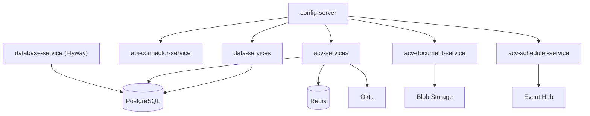
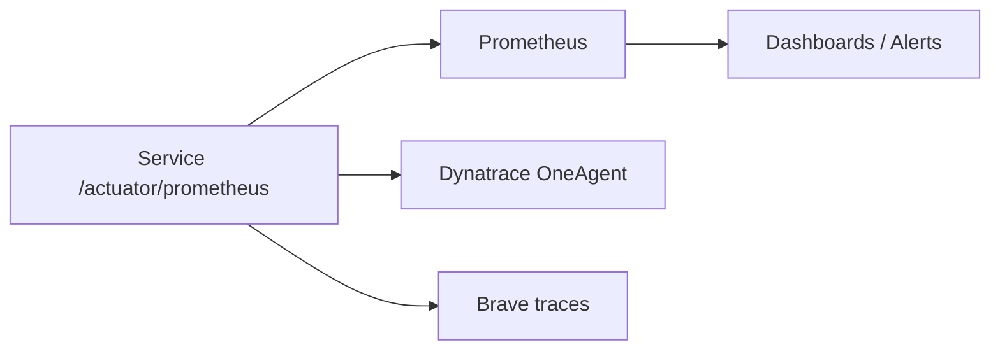
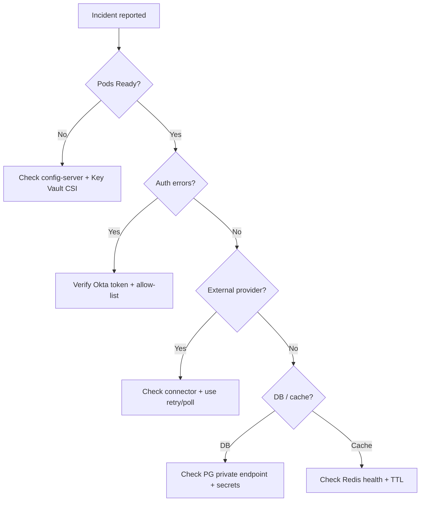

# 08 — Operations & Runbook

> Day-2 operations: startup/shutdown, health, monitoring, common failure modes, and recovery
> for the ACV platform.
>
> **Last reviewed:** 2026-06-08 · See also [Deployment](06-deployment.md) · [Security](07-security.md)

## Table of Contents
- [Service Dependencies](#service-dependencies)
- [Startup & Shutdown](#startup--shutdown)
- [Health Checks](#health-checks)
- [Monitoring & Observability](#monitoring--observability)
- [Common Failure Modes](#common-failure-modes)
- [Backup & Recovery](#backup--recovery)

---

## Service Dependencies

**Startup order (logical):** infra (Terraform) → `database-service` migrations → `config-server`
→ application services → `configuration-portal-ui`.

---

## Startup & Shutdown

| Action | Command / Mechanism |
|--------|---------------------|
| Deploy/Upgrade | `helm upgrade --install <release> -f helm-releases/<env>.yaml` |
| Restart a service | `kubectl rollout restart deploy/<service>` |
| Scale | `kubectl scale deploy/<service> --replicas=N` or adjust `replicaCount` |
| Run migrations | `database-service` runs Flyway on startup (`@PostConstruct`) |
| Graceful shutdown | Spring Boot lifecycle; readiness flips first so traffic drains |

> Config changes in `config-repo` require a service restart to take effect (properties reload on
> pod restart); an in-app cache refresh runs every 4h regardless.

---

## Health Checks

| Probe | Endpoint (port 8081) |
|-------|----------------------|
| Liveness | `/actuator/health/liveness` |
| Readiness | `/actuator/health/readiness` |
| Full health | `/actuator/health` (show-details: always) |
| Metrics | `/actuator/prometheus` |
| Scheduler ping | `GET /ping` (scheduler-service) |

> Health group config: [`application.yml`](../eai-3540813-config-repo/application.yml)
> (`management.endpoint.health.group.{liveness,readiness}`).

---

## Monitoring & Observability

- **Metrics:** Micrometer → Prometheus registry (`management.metrics.export.prometheus.enabled`).
  Application tag set to `${spring.application.name}`.
- **Tracing:** `micrometer-tracing-bridge-brave` for distributed traces.
- **APM:** Dynatrace OneAgent injected via Helm annotation
  (`oneagent.dynatrace.com/inject: "true"`).
- **DB insights:** `pg_stat_statements`, `pgbouncer` diagnostics enabled
  ([postgres.tf](../eai-3540813-infra/modules/infra/postgres.tf)).

---

## Common Failure Modes

| Symptom | Likely cause | Remediation |
|---------|--------------|-------------|
| Pod not Ready | Config-server unreachable / missing secret | Check `config-server` health; verify Key Vault CSI mount; inspect `kubectl describe pod` |
| 401/403 on APIs | Invalid/expired Okta token; misconfigured allow-list | Verify token, Okta config, and `url.patterns.allowed` |
| DB connection errors | Wrong `POSTGRES_DB_*`, private endpoint/DNS issue | Validate secrets, private DNS, pgbouncer status |
| OCR/credit timeouts | External provider latency/outage | Use retry endpoints (`/v1/asyncRetry`, `/v1/retryWithPollOcr`, connector `pollOcrData`) |
| Jobs not firing | Quartz misfire / lock contention | Inspect `qrtz_*` tables; `GET /job/getAllJobs`, `/job/status/jobState` |
| Cache staleness | Redis eviction / TTL | Check Redis health; 4h config refresh; verify TTL 24h |
| Document generation fails | Blob storage / template mapping missing | Check `template_mappings`, Blob connectivity, `/template/api/v1/...` |
| Migration failed at startup | Bad SQL / baseline mismatch | `FlywayDBInitializer` logs error (non-fatal); fix migration, redeploy |

### Triage flow

---

## Backup & Recovery

- **PostgreSQL:** Azure Flexible Server automated backups (point-in-time restore). Prod is
  `SELECT`-only for developers, reducing accidental data loss.
- **Schema:** Reproducible via Flyway migrations in `database-service`.
- **Config:** `config-repo` is version-controlled; re-apply by restarting services.
- **Secrets:** Re-mounted from Key Vault; no local persistence.
- **Documents:** Stored in Azure Blob (Azure redundancy applies).
- **DR:** Re-run Terraform to recreate infra; redeploy Helm releases; restore DB from backup.

> TODO: confirm — exact backup retention windows and RPO/RTO targets are defined at the Azure
> resource / platform-policy level and were not found in-repo.

> Continue to the [Testing Strategy »](09-testing.md)
