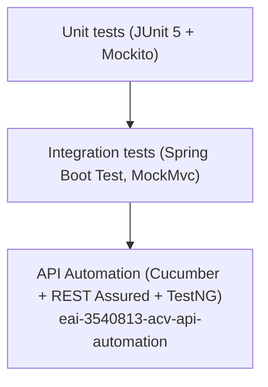
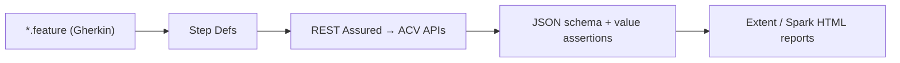

# 09 — Testing Strategy

> Test types, frameworks, and how to run them across the ACV platform.
>
> **Last reviewed:** 2026-06-08 · See also [Onboarding](10-onboarding.md) · [API Reference](04-api-reference.md)

## Table of Contents
- [Test Pyramid](#test-pyramid)
- [Unit & Integration (Java Services)](#unit--integration-java-services)
- [API Automation Suite](#api-automation-suite)
- [UI Tests](#ui-tests)
- [Coverage](#coverage)
- [Running Tests](#running-tests)

---

## Test Pyramid

---

## Unit & Integration (Java Services)

Each Spring Boot service includes `spring-boot-starter-test` (JUnit 5, Mockito, AssertJ,
MockMvc) and `junit-jupiter-engine` (see [acv-services pom](../eai-3540813-acv-services/pom.xml)).

- **Unit tests** live under `src/test/java` in each service.
- **Coverage** is produced via JaCoCo — `target/jacoco.exec` is present in
  [acv-commons/target](../eai-3540813-acv-commons/target/jacoco.exec) and
  [acv-validation-engine/target](../eai-3540813-acv-validation-engine/target/jacoco.exec).

> TODO: confirm — exact coverage thresholds (if enforced via JaCoCo `check` or SonarQube quality
> gates) were not located; `sonar.*` properties exist in the automation pom.

---

## API Automation Suite

`eai-3540813-acv-api-automation` is a **BDD API test suite**:

| Library | Version | Role |
|---------|---------|------|
| Cucumber (java, junit, testng) | 7.2.2 | BDD feature/step definitions |
| REST Assured (spring-mock-mvc, json-path, xml-path, json-schema-validator) | 5.3.0 | HTTP assertions + schema validation |
| TestNG | (via cucumber-testng) | Test runner |
| Extent / Spark reports | — | HTML reports (`HtmlReport/`, `Reports/Spark.html`) |

> Evidence: [api-automation pom.xml](../eai-3540813-acv-api-automation/pom.xml). Reports are
> emitted to `HtmlReport/ExtentHtml.html` and `Reports/Spark.html`; test data under
> `Resource/TestData/`.

---

## UI Tests

The Angular portal uses **Karma + Jasmine** (`ng test`):

- `jasmine-core`, `karma`, `karma-jasmine`, `karma-chrome-launcher`, `karma-coverage`
  (see [package.json](../eai-3540813-configuration-portal-ui/package.json)).

---

## Coverage

| Layer | Tool | Output |
|-------|------|--------|
| Java services | JaCoCo | `target/jacoco.exec` per service |
| UI | karma-coverage | coverage report |
| API suite | Extent/Spark | HTML reports |
| Quality gate | SonarQube | `sonar.*` props in automation pom |

---

## Running Tests

| Target | Command | Where |
|--------|---------|-------|
| Java unit/integration | `./mvnw test` | each Java service |
| Full build + tests | `./mvnw clean verify` | each Java service |
| API automation | `mvn test` (Cucumber/TestNG runner) | `eai-3540813-acv-api-automation` |
| UI tests | `npm test` (`ng test`) | `eai-3540813-configuration-portal-ui` |

> The `configuration-portal-ui` workspace defines a VS Code `npm: test` task (background) and an
> `npm: start` task for local serving.

> Continue to [Developer Onboarding »](10-onboarding.md)
