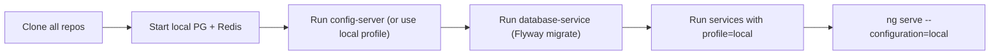

# 10 — Developer Onboarding

> Everything a new engineer needs to build, run, and contribute to the ACV platform.
>
> **Last reviewed:** 2026-06-08 · See also [Architecture](01-architecture.md) · [Testing](09-testing.md)

## Table of Contents
- [Prerequisites](#prerequisites)
- [Repository Layout](#repository-layout)
- [Local Setup](#local-setup)
- [Build & Run](#build--run)
- [Environment Variables](#environment-variables)
- [Codebase Tour](#codebase-tour)
- [Contribution Conventions](#contribution-conventions)
- [Glossary](#glossary)

---

## Prerequisites

| Tool | Version | For |
|------|---------|-----|
| JDK | 21 | All Java services |
| Maven | 3.9+ (or bundled `./mvnw`) | Java builds |
| Node.js | 18+ | Angular UI |
| Angular CLI | 19.x | UI dev/build |
| Docker | latest | Container builds / local infra |
| Azure CLI + kubectl + Helm | latest | Deploys to AKS |
| Terraform | per [versions.tf](../eai-3540813-infra/versions.tf) | Infra changes |
| PostgreSQL 15 / Redis | local or container | Local data layer |

---

## Repository Layout

See the [documentation home](README.md#repository-map) for the full repo table. The 14 repos
group into: **runtime services** (acv-services, api-connector-service, validation-engine,
document-service, scheduler-service, data-services, database-service), **platform**
(config-server, config-repo, acv-commons), **frontend** (configuration-portal-ui), **quality**
(acv-api-automation), and **infra** (infra).

---

## Local Setup

1. **Clone** the workspace repos (they sit side-by-side under one parent folder).
2. **Data layer:** start local PostgreSQL (`acv-db`) and Redis (Docker is fine).
3. **Migrations:** run `database-service` (uses `acv-configuration/local`) to create the schema.
4. **Config:** either run `config-server` against `config-repo`, or rely on each service's
   `application-local.yml`.
5. **Services:** run each Spring Boot app with the `local` profile.
6. **UI:** `npm install` then `npm start` (serves `--configuration=local`).

> The `local` profile is intended for laptops; `dev`/`test`/`prod` profiles target AKS and pull
> secrets from Key Vault.

---

## Build & Run

| Repo type | Build | Run locally |
|-----------|-------|-------------|
| Java service | `./mvnw clean package` | `./mvnw spring-boot:run -Dspring-boot.run.profiles=local` |
| acv-commons | `./mvnw clean install` | (consumed as JAR) |
| UI | `npm install` | `npm start` (local) |
| Infra | `terraform init/plan` | apply via pipeline |

Per-environment UI builds: `npm run build:dev`, `build:test`, `build:prod`
(see [package.json](../eai-3540813-configuration-portal-ui/package.json)).

---

## Environment Variables

Core variables consumed by services (from
[`application.yml`](../eai-3540813-config-repo/application.yml) and Helm `extraVars`):

| Variable | Purpose |
|----------|---------|
| `POSTGRES_DB_ENDPOINT`, `POSTGRES_DB_NAME`, `POSTGRES_DB_USER`, `POSTGRES_DB_PASSWORD` | DB connection |
| `REDIS_HOST`, `REDIS_PORT`, `REDIS_PASSWORD`, `REDIS_SSL` | Redis connection |
| `SPRING_CLOUD_CONFIG_ENABLED`, `SPRING_CONFIG_IMPORT`, `SPRING_APPLICATION_NAME` | Config server wiring |
| `ACV_CLIENT_ID`, `ACV_CLIENT_SECRET` | Okta client creds (Key Vault) |
| `GENAI_CLIENT_ID/SECRET`, `RUBIX_API_KEY`, `WREG_*` | External providers (Key Vault) |

See [Security](07-security.md#secret-management) for the full secret inventory.

---

## Codebase Tour

| Want to change… | Go to |
|------------------|-------|
| Public validation API / orchestration | `eai-3540813-acv-services` ([LLD](03-lld.md#acv-services-orchestrator)) |
| A validation rule | `eai-3540813-acv-validation-engine/service/impl` |
| External provider integration | `eai-3540813-api-connector-service` |
| Document templates / PDF | `eai-3540813-acv-document-service` |
| Scheduled jobs | `eai-3540813-acv-scheduler-service` |
| Generic data access | `eai-3540813-data-services` |
| DB schema | `eai-3540813-database-service/.../acv-configuration` |
| Shared utilities | `eai-3540813-acv-commons` |
| Environment config | `eai-3540813-config-repo` |
| Admin UI | `eai-3540813-configuration-portal-ui` |
| Infra | `eai-3540813-infra` |

---

## Contribution Conventions

- **Branch/commit:** follow the team's existing Git conventions (FedEx EAI standards).
- **CI:** Maven settings via `cicd-maven-settings.xml`; FOSS approvals tracked in
  `cicd-foss-authorized-users.txt`.
- **Quality:** keep JaCoCo/Sonar gates green; add tests for new endpoints; update the
  [API Reference](04-api-reference.md) when routes change.
- **Migrations:** add new `V<n>__*.sql` Flyway scripts (forward-only); never edit applied
  migrations.
- **Secrets:** never commit secrets; add new ones to Key Vault and the Helm `keyvaultCsi` block.

---

## Glossary

| Term | Meaning |
|------|---------|
| **ACV** | Account Creation Validations — the platform |
| **Validation set** | A configured group of validations for a country/requirement (`validation_set_ref`) |
| **Country config** | Effective-dated link of country ↔ category ↔ validation set (`country_config`) |
| **Record** | A configurable data record subject to validation (`record_details_ref`) |
| **Stage validation** | A step in the multi-stage validation pipeline (acv-services) |
| **Connector** | `api-connector-service`, the egress adapter to external providers |
| **OCR** | Optical Character Recognition for document data extraction |
| **GenAI** | AI-assisted document processing provider |
| **WREG** | External provider/integration (Event Hub + document download keys) |
| **Rubix** | External provider (API key) |
| **Quartz** | Job-scheduling library backing `acv-scheduler-service` (`qrtz_*` tables) |
| **CSI** | Container Storage Interface driver used to mount Key Vault secrets |
| **Delphix** | Virtual database / data-masking provisioning (infra) |
| **FXI** | FedEx internal Azure platform/network naming |

---

> **You've reached the end of the suite.** Return to the [Documentation Home](README.md).
