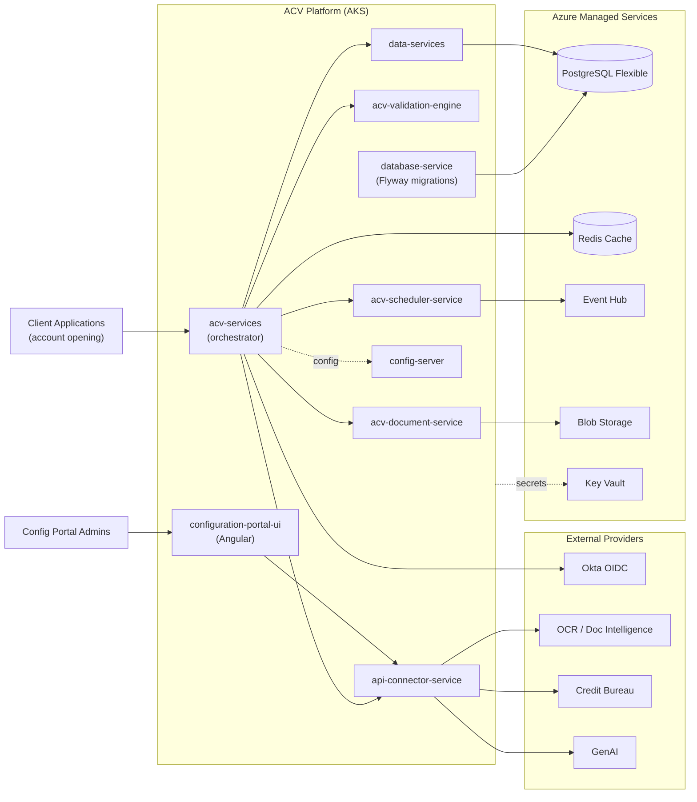

# ACV Platform — System Documentation

> **System:** Account Creation Validations (ACV) — EAI 3540813
> **Scope:** Workspace-level documentation covering all repositories in the ACV solution.
> **Last reviewed:** 2026-06-08

This is the **system-of-systems** documentation home for the Account Creation Validations
(ACV) platform. It describes how the independent service repositories combine into a single
compliance-validation platform for account opening. Each document is evidence-based and links
back to source files so any statement can be verified.

> For deep, single-service documentation, see the per-service docs under
> `../Documentation/<service>/` (e.g. `../Documentation/acv-services/`). This suite focuses on
> the **cross-service / whole-system** view.

---

## What is ACV?

ACV automates **account opening compliance** for FedEx. Client applications submit applicant
data; ACV orchestrates identity verification (OTP), document OCR, credit checks, rule-based
field validation, compliance-document generation, and asynchronous job scheduling — integrating
with external identity, OCR, credit, and GenAI providers. The platform runs on Azure Kubernetes
Service (AKS) and is provisioned via Terraform.

---

## Repository Map

| Repository | Role | Stack | Deployed? |
|------------|------|-------|-----------|
| `eai-3540813-acv-services` | Core orchestration / public API | Java 21, Spring Boot 3.3.1 | Yes (AKS) |
| `eai-3540813-api-connector-service` | Outbound connector to external providers (OCR, credit, GenAI) | Java 21, Spring Boot | Yes (AKS) |
| `eai-3540813-acv-validation-engine` | Rule-based field validation engine | Java 21, Spring Boot | Yes (AKS) |
| `eai-3540813-acv-document-service` | Template-driven compliance document generation + blob storage | Java 21, Spring Boot | Yes (AKS) |
| `eai-3540813-acv-scheduler-service` | Quartz-based job scheduler + Event Hub messaging | Java 21, Spring Boot, Quartz | Yes (AKS) |
| `eai-3540813-data-services` | Generic CRUD/data-access API over PostgreSQL | Java 21, Spring Boot | Yes (AKS) |
| `eai-3540813-database-service` | Flyway schema migrations / DB bootstrap | Java 21, Spring Boot, Flyway | Yes (init/job) |
| `eai-3540813-acv-commons` | Shared library (Event Hub, Redis, security, utils) | Java 21 JAR | No (embedded) |
| `eai-3540813-config-server` | Spring Cloud Config Server | Java 21, Spring Cloud 2023.0.3 | Yes (AKS) |
| `eai-3540813-config-repo` | Externalized configuration (YAML) | YAML | No (data) |
| `eai-3540813-configuration-portal-ui` | Admin configuration portal | Angular 19, Okta, ag-Grid | Yes (AKS) |
| `eai-3540813-acv-api-automation` | API test automation suite | Java, REST Assured/TestNG | No (CI) |
| `eai-3540813-common-selfservice` | Self-service assets | Docs | No |
| `eai-3540813-infra` | Infrastructure as Code | Terraform (Azure) | N/A |

> TODO: confirm — `eai-3540813-common-selfservice` currently contains only a `README.md`; its
> full role could not be determined from the repository.

---

## Table of Contents

| # | Document | Description |
|---|----------|-------------|
| 01 | [Architecture Overview](01-architecture.md) | System context, container diagram, component inventory, tech choices |
| 02 | [High-Level Design (HLD)](02-hld.md) | Capabilities, logical components, external integrations, NFRs, key flows |
| 03 | [Low-Level Design (LLD)](03-lld.md) | Package breakdown, class design, algorithms, sequence diagrams |
| 04 | [API Reference](04-api-reference.md) | Endpoints across all services with paths, methods, auth |
| 05 | [Data & Database Design](05-data-design.md) | ER model, tables, sequences, migrations, caching |
| 06 | [Deployment Guide](06-deployment.md) | Build, Helm, AKS topology, Terraform, environments, CI/CD |
| 07 | [Security](07-security.md) | Okta OAuth2, secrets (Key Vault CSI), masking, network isolation |
| 08 | [Operations & Runbook](08-operations-runbook.md) | Health checks, monitoring, failure modes, recovery |
| 09 | [Testing Strategy](09-testing.md) | Unit, integration, API automation, coverage |
| 10 | [Developer Onboarding](10-onboarding.md) | Prerequisites, local setup, build/run, glossary |

---

## Where to go for what

- **"How does a validation request flow end-to-end?"** → [HLD](02-hld.md#key-end-to-end-flows)
- **"Which service owns which endpoint?"** → [API Reference](04-api-reference.md)
- **"What tables exist and how do they relate?"** → [Data Design](05-data-design.md)
- **"How do I deploy / what runs where?"** → [Deployment](06-deployment.md)
- **"How is auth and secret management handled?"** → [Security](07-security.md)
- **"Production is failing — what do I check?"** → [Runbook](08-operations-runbook.md)
- **"I'm new — how do I run this locally?"** → [Onboarding](10-onboarding.md)

---

## High-Level System Context

> Diagrams in this suite use [Mermaid](https://mermaid.js.org/). Cross-links are relative and
> resolve within this `docs/` folder. Unverifiable details are marked `TODO: confirm`.
