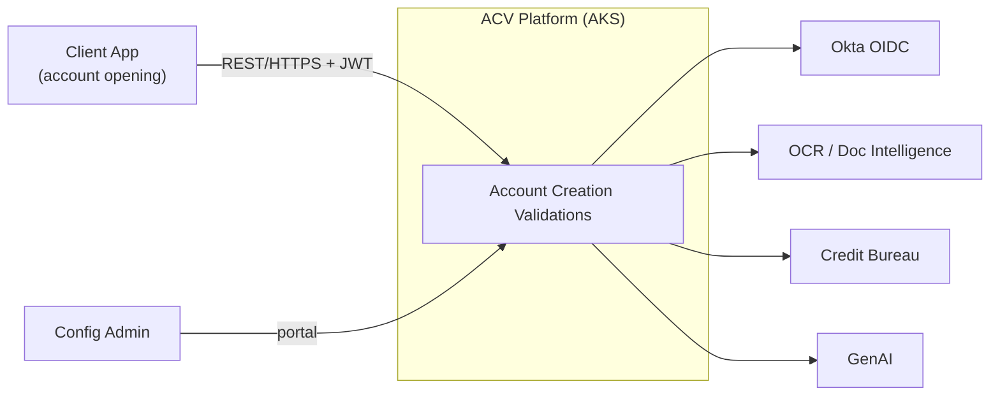
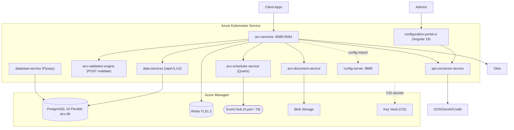
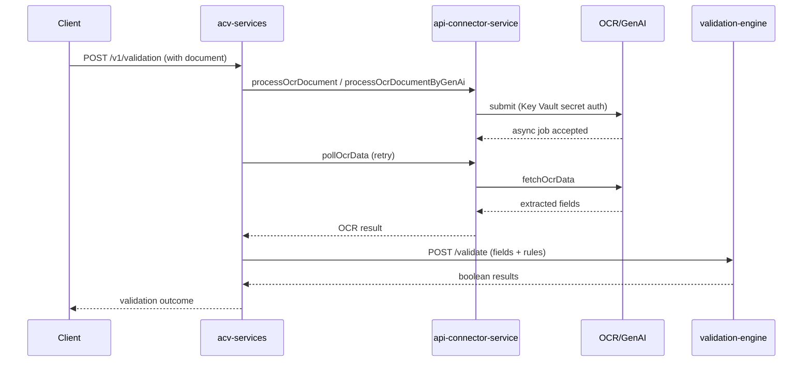
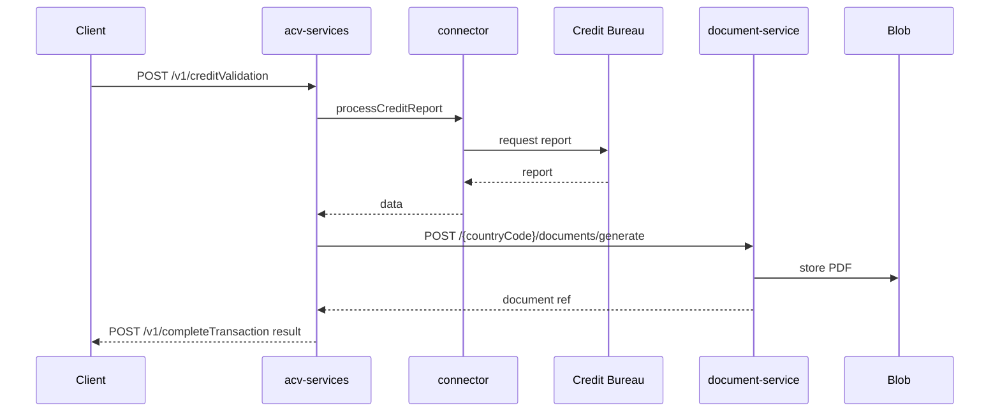
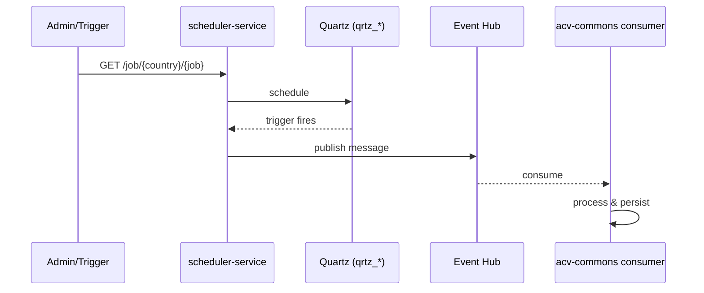
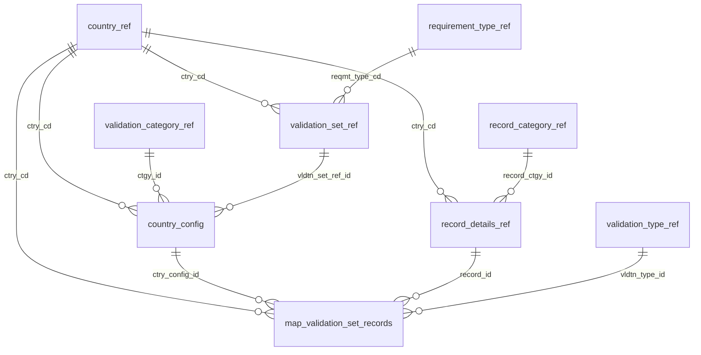
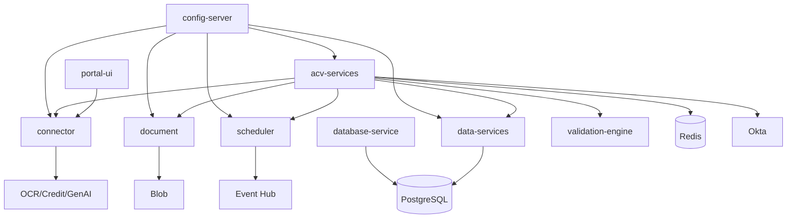

# ACV (Account Creation Validations) — As-Is Documentation

> **System:** Account Creation Validations (ACV) — EAI `3540813`
> **Owner:** FedEx · Java package root `com.fedex.acv.*`
> **Scope:** Reverse-engineered current-state picture of the ACV microservices platform. Unlike MyDelivery and B2C, **ACV is already a modern, cloud-native system** — this document captures its as-is design faithfully so the migration plan (Azure → GCP) can target it precisely.
> **Grounding:** `ACV-Docs-main` documentation suite (evidence-linked, `Last reviewed: 2026-06-08`). `TODO: confirm` items in the source are reflected here as `[UNKNOWN — needs confirmation]`.

**Tag legend:** `[INFERRED]` · `[ASSUMPTION]` · `[UNKNOWN — needs confirmation]`.

---

## 1.1 Executive Summary

**ACV** automates **account-opening compliance validation** for FedEx. Client applications submit applicant data; ACV orchestrates **identity verification (OTP)**, **document OCR** (including GenAI-assisted extraction), **credit checks**, **rule-based field validation**, **compliance-document generation**, and **asynchronous job scheduling**, integrating with external identity (Okta), OCR/Document-Intelligence, credit-bureau, and GenAI providers.

ACV is a **microservices platform on Java 21 / Spring Boot 3.3.x**, deployed to **Azure Kubernetes Service (AKS)**, provisioned by **Terraform**, and configured via **Spring Cloud Config** (config-server + git-style config-repo). It comprises **nine deployable services** plus a shared **`acv-commons`** JAR and an **Angular 19** admin portal. Managed Azure services underpin it: **PostgreSQL 15 Flexible Server** (primary store), **Redis** (cache + validation state), **Event Hub** (async events, 4 partitions/7-day retention), **Blob Storage** (documents), and **Key Vault** (secrets via CSI driver). Cross-cutting concerns are handled by design: **Okta OAuth2** resource-server auth, **Actuator + Prometheus + Micrometer/Brave + Dynatrace** observability, **private endpoints** everywhere, and **Flyway** versioned migrations.

**Headline strengths (not risks):** stateless services, externalized config, event-driven async, IaC, private networking, secret management. **Genuine risks / debt:** (1) **deep Azure-managed-service coupling** (Event Hub, Blob, Key Vault CSI, PostgreSQL Flexible, Delphix) — the main obstacle to a GCP migration; (2) a **generic `data-services` `{entity}` CRUD API** whose input-validation coverage is unverified (injection surface); (3) the **scheduler uses `GET` for state-changing actions** (`/job/action/stop`, `/start`) — CSRF/idempotency concern; (4) **`acv-commons` is a shared JAR**, so cross-cutting changes force consumer redeploys; (5) `database-service` **swallows Flyway errors** (non-fatal), which can mask a partially-migrated schema. **The single biggest obstacle to modernization (to GCP) is the tight binding to Azure managed services and networking**, not the application code, which is portable Spring Boot.

---

## 1.2 Service Inventory

| Service (repo `eai-3540813-*`) | Purpose | Runtime | Type | Data store(s) | Upstream | Downstream | Deployed | Criticality | Doc quality |
|---|---|---|---|---|---|---|---|---|---|
| **acv-services** | Orchestrator + public API; OTP; records; validation staging; credit; complete-transaction; doc trigger; retries | Java 21 / Spring Boot 3.3.1 | API/orchestrator | Redis; (DB via data-services) | Client apps | validation-engine, connector, document, scheduler, data, Okta, Redis, Event Hub | Yes (AKS) | **Critical** | High |
| **api-connector-service** | Adapter to external OCR/credit/GenAI; config-portal proxy | Java 21 / Spring Boot | Connector | (external) | acv-services, UI | OCR, Credit, GenAI | Yes (AKS) | **Critical** | High |
| **acv-validation-engine** | Stateless rule evaluation (name/address/date/ID/credit/entity/etc.) | Java 21 / Spring Boot | Stateless compute | none (pure) | acv-services | none | Yes (AKS) | High | High |
| **acv-document-service** | Template mgmt, PDF generation, blob upload/download | Java 21 / Spring Boot | Service | Blob Storage; DB (doc tables) | acv-services, UI (proxy) | Blob | Yes (AKS) | High | High |
| **acv-scheduler-service** | Quartz job scheduling; Event Hub send/read | Java 21 / Spring Boot + Quartz | Scheduler | DB (`qrtz_*`); Event Hub | acv-services, UI (proxy) | Event Hub, DB | Yes (AKS) | High | High |
| **data-services** | Generic entity CRUD over PostgreSQL (`/api/v1`, `/api/v2`) | Java 21 / Spring Boot | Data API | PostgreSQL | acv-services, connector proxy | PostgreSQL | Yes (AKS) | **Critical** | High |
| **database-service** | Runs Flyway migrations at startup | Java 21 / Spring Boot + Flyway | Init job | PostgreSQL | startup | PostgreSQL | Yes (init/job) | High | High |
| **config-server** | Spring Cloud Config server | Java 21 / Spring Cloud 2023.0.3 | Config | config-repo | all services | config-repo | Yes (AKS) | **Critical** | High |
| **configuration-portal-ui** | Admin portal (countries, rules, templates) | Angular 19 + Express SSR, Okta, ag-Grid | Web UI | via connector proxy | Admins | connector proxy | Yes (AKS) | High | High |
| **acv-commons** | Shared lib: Event Hub client, Redis, security filters, masking, utils | Java 21 JAR | Library | — | all Java services | — | No (embedded) | High | Medium |
| **config-repo** | Externalized YAML configuration | YAML | Config data | — | config-server | — | No (data) | High | High |
| **eai-3540813-infra** | Terraform IaC (Azure) | Terraform | IaC | — | — | Azure | N/A | High | High |
| **acv-api-automation** | BDD API test suite (Cucumber + REST Assured + TestNG) | Java | CI test | — | CI | ACV APIs | No (CI) | Medium | High |

---

## 1.3 Per-Service Deep Dive

### 1.3.1 acv-services (Orchestrator)

- **Purpose:** Public entrypoint (`AccountCreationValidationsController`) and the validation-pipeline orchestrator. Delegates to `StageValidationService`, `RecordValidationService`, `RetryService`, `ValidationTriggerService`, `CompleteTransactionService`, `EventHubProducerService`, `DocumentGenerationClient` (constructor/field injection). Method-level observability via Micrometer `@Observed`. **Not responsible for** rule logic (validation-engine) or external calls (connector).
- **Endpoints:** `POST /v1/identity/request-otp|verify-otp`, `POST /v1/records`, `GET /v1/asyncRetry`, `GET /v1/retryWithPollOcr`, `POST /v1/validation`, `POST /v1/creditValidation`, `POST /v1/completeTransaction`, `POST /v1/processCreditData`, `POST /v1/publishMsg`, `POST /v1/generateDocuments`, `POST /v1/creditReport`; `ConfigurationController` `/config/v1/countries`, `/config/v1/country/{code}/documents`; `AuthTokenController` `GET /oktaToken/{service}` (text/plain).
- **Tech:** Java 21 (virtual threads for parallel external calls), Spring Boot 3.3.1, okta-spring-boot-starter 3.0.6, spring-boot-starter-security/validation.
- **State:** Externalized to Redis (OTP state, tokens, caches); horizontally scalable.
- **Resilience:** Async retry (`/v1/asyncRetry`) and OCR polling retry (`/v1/retryWithPollOcr`).
- **Fragile areas:** `GET`-based retry endpoints (mutating via GET) `[per source TODO]`; internal service-layer class names beyond injected set not fully read.

### 1.3.2 acv-validation-engine

- **Purpose:** Stateless, pure rule evaluation. Single endpoint `POST /validate` (`ValidationDto` → `Boolean`). `GenericValidationServiceImpl` dispatches (Strategy pattern) to per-type `@Service` impls: Name, Address, Date, Id, CreditReport, EntityName, EntityNature, KeyPerson, LegalName, TypeReg, RecStatus, Other; `ComparisonType` primitives.
- **Design:** No persistence → ideal horizontal-scale/spot candidate. **Best migration "thin-slice"** (stateless, low blast radius).

### 1.3.3 api-connector-service

- **Purpose:** Isolate all external-provider contracts/credentials. `ConnectionsController`: `fetchData`, `processOcrDocument`, `fetchOcrData`, `pollOcrData`, `processCreditReport`, `fetchCreditReportData`, `pollCreditData`, `fetchProductIds/{description}/{provider}`, `publishMsg`, `analyzeDocumentLayout`, `structuredOutput`, `processOcrDocumentByGenAi`. `ConfigPortalProxyController` (`/config-portal`) proxies admin UI to data/scheduler/document services.
- **Security:** External credentials from Key Vault (`GENAI_*`, `RUBIX_API_KEY`, etc.); centralizes egress.
- **Fragile areas:** external-provider latency/outages (mitigated by poll/retry); proxy widens the trust boundary of `/config-portal/**` (public allow-listed).

### 1.3.4 acv-document-service

- **Purpose:** Template management + PDF generation + blob storage. `TemplateManagementController` (`/template/api/v1`: sections search/create/update, templates, template_mappings, data/{transactionId}, document/preview), `DocumentManagementController` (`/api/v1`: `{countryCode}/documents/generate|generateAdhoc|download|preview`, file retrieval), `BlobStorageController` (`/blob/api/v1/storage`: upload multipart, download, delete). PDF via `produces=application/pdf`.
- **Data:** Document tables in PostgreSQL + Azure Blob for artifacts.

### 1.3.5 acv-scheduler-service

- **Purpose:** Durable Quartz scheduling + Event Hub messaging. `AcvQuartzController` (`/job`: `{country}/{job}`, newJob, unschedule, action/pause|resume|stop|start, getAllJobs, checkJobName, status/isJobRunning|jobState), `MessagesController` (`/messages`: random/{count}, send, read), `PingController` (`/ping`).
- **State:** Quartz `qrtz_*` tables → cluster-safe (locks coordinate replicas; jobs survive restart).
- **Fragile areas:** `GET` used for mutating job actions (`stop`, `start`, `pause`) — CSRF/idempotency `[per source TODO]`.

### 1.3.6 data-services

- **Purpose:** Generic entity CRUD over PostgreSQL. `DataController` (`/api/v1`: `POST /{entity}`, `POST /{entity}/{ctryCd}`, `POST list/{entityList}`), `DataControllerV2` (`/api/v2`: `POST /GET/{entity}`, `POST /ADD/{entity}`). The generic `{entity}` path maps to configured tables (`acv_crud_config_info`).
- **Fragile areas:** **Generic `{entity}` endpoints** — input-validation/authorization coverage unverified `[per source TODO]`; a potential injection/over-exposure surface if entity allow-listing is weak.

### 1.3.7 database-service

- **Purpose:** Bootstrap app that runs **Flyway** migrations at startup (`FlywayDBInitializer.migrateFlyway()` via `@PostConstruct`; `baselineOnMigrate(true)`, `target=LATEST`). Scripts under `acv-configuration/{local,dev,test,prod}`; files `V<major>_<minor>__<DESC>.sql`.
- **Fragile areas:** **errors are caught and logged, not rethrown** → a failed migration is non-fatal and can leave a partially-migrated schema silently.

### 1.3.8 config-server / config-repo

- **Purpose:** Centralized configuration. Services import via `SPRING_CONFIG_IMPORT=optional:configserver:…/acv/config`. `config-repo` holds `application.yml` + per-env profiles. Key params: datasource URL from `POSTGRES_DB_*`, Redis TTL 24h, management port 8081, config cache refresh 4h, public URL allow-list, masking visible length 4.

### 1.3.9 acv-commons (shared library)

- **Purpose:** Event Hub producer/consumer, Redis access, security filters, request masking, utils. **Embedded JAR** (no network hop) → updates require **consumer redeploys** (explicit ADR trade-off).

### 1.3.10 configuration-portal-ui

- **Purpose:** Angular 19 admin portal (countries, validation rules, templates) with `@okta/okta-angular`, ag-Grid; Express SSR/static host. Traffic proxied through `api-connector-service`. Tests via Karma/Jasmine.

---

## 1.4 System Context & Architecture Diagrams

### C4 Context

### Container diagram

### Sequence — Document validation with OCR + retry

### Sequence — Credit validation + document generation

### Sequence — Scheduled job + Event Hub

---

## 1.5 Data Architecture

- **Primary store:** **PostgreSQL 15 Flexible Server** (`acv-db`), pgbouncer enabled, extensions `pgcrypto, pg_stat_statements, uuid-ossp, pg_trgm, fuzzystrmatch, hypopg`, `work_mem=524288`. Schema created/versioned by **Flyway** (env-specific folders).
- **Cache:** Redis (TLS 1.2), default TTL 24h; app config cache refresh 4h.
- **Object store:** Azure Blob (generated PDFs/uploads).
- **Stream:** Azure Event Hub (namespace `acv`, Standard, 4 partitions, 7-day retention).
- **Data provisioning:** **Delphix** virtual DBs for masked non-prod data.

**Configuration/reference model (drives which validations apply per country/record):**

**Table groups:**
- **Reference/config:** `country_ref`, `currency_ref`, `requirement_type_ref`, `record_category_ref`, `validation_category_ref`, `validation_set_ref`, `validation_type_ref`, `country_config` (effective-dated), `record_details_ref`, `map_record_set`, `map_validation_set_records`, `section_config_ref`/`doc_section_config_ref`, `document_ref`, `document_section_mapping`, `template_for_document_generation_ref`, `address`/`address_info`, `individual_details`/`company_details`, `director_details`.
- **Operational/transaction:** `acv_api_interface`, `acv_transaction_tracker`, `acv_eventhub_tracker`, `validation_request(s)`, `request_payload`, `document_transactions`/`document_tran_detail`, `document_generated_transactions`, `document_info`/`document_information`, `acv_crud_config_info`.
- **Scheduler:** `qrtz_*` (job_details, triggers, cron_triggers, simple/simprop/blob_triggers, fired_triggers, locks, calendars, scheduler_state, paused_trigger_grps).
- **Conventions:** surrogate keys via sequences (`numeric(20,0)`); audit columns `crt_user/crt_dt/upd_user/upd_dt`; abbreviated snake_case; `_ref`/`map_`/`_config` suffixes/prefixes.
- **Access:** nonprod allows DML; **prod is `SELECT`-only** for developers (`developer_access` in `postgres.tf`).

---

## 1.6 Dependency & Integration Map

**Callouts:**
- **Spider-in-the-web:** `acv-services` (orchestrates all) and `config-server` (all services depend on it at startup).
- **Single points of failure:** config-server (startup dependency), PostgreSQL, Redis, Okta, Event Hub.
- **Isolation strengths:** connector centralizes external egress; validation-engine is stateless/pure.
- **Coupling to platform:** every service is bound to **Azure** managed services + Key Vault CSI + private endpoints (the migration surface).
- **Shared-lib coupling:** `acv-commons` change → redeploy all consumers.

---

## 1.7 Non-Functional Characteristics

| Attribute | As-is design |
|---|---|
| **Scalability** | Stateless services + Redis-externalized state; HPA-ready; validation-engine/connector strong scale candidates. |
| **Performance** | Java 21 virtual threads; Redis caching (TTL 24h); pgbouncer pooling. |
| **Availability** | Liveness/readiness probes (8081); multi-replica; PostgreSQL zone config. `[UNKNOWN]` formal SLA. |
| **Security** | Okta OAuth2 resource server; Key Vault CSI; private endpoints; TLS 1.2 (Redis); request masking (visible length 4); OWASP mapping documented. |
| **Observability** | Actuator + Prometheus + Micrometer/Brave tracing + Dynatrace OneAgent; `pg_stat_statements`. |
| **Resilience** | Async retry + OCR polling; Quartz misfire handling; cluster-safe scheduler. |
| **Resource sizing (dev)** | requests 0.5 CPU/1Gi, limits 1 CPU/2Gi. |

---

## 1.8 Operational Model

- **Build:** Maven (`./mvnw clean package`) → Spring Boot fat JAR → container image; Angular `ng build`; `acv-commons` JAR to registry. `[UNKNOWN]` Dockerfiles (likely shared FedEx CICD template; `cicd-maven-settings.xml` present). `[UNKNOWN]` CI system.
- **Infra:** Terraform root `eai-3540813-infra` → `infra` module (postgres/redis/event-hub/storage/kv/secrets/delphix/labels/rg); remote state; cross-stack `terraform_remote_state`.
- **Deploy:** Helm per service (`helm-releases/{nonprod-dev,nonprod-test,prod}.yaml`); ports 8080/8081; `keyvaultCsi`; `serviceAccountName: acv-dev`; Dynatrace inject annotation; `extraVars` set config import + app name. Flow: push → CI build/test → image → Terraform infra → `helm upgrade --install` → CSI secrets + config import → pods Ready.
- **Environments:** dev/test (nonprod, DML) · prod (SELECT-only) · local.
- **Startup order:** infra → database-service migrations → config-server → services → UI.
- **Health/monitoring:** `/actuator/health/{liveness,readiness}`, `/actuator/prometheus`, scheduler `/ping`.
- **Backup/DR:** Azure Flexible Server automated backups (PITR); schema reproducible via Flyway; re-run Terraform + redeploy Helm + restore DB. `[UNKNOWN]` RPO/RTO.
- **Rollback:** `helm rollback`; DB migrations **forward-only** (design roll-forward).

---

## 1.9 Risks, Tech Debt & Constraints Register

| ID | Item | Type | Impact | Migration relevance (Azure→GCP) |
|----|------|------|--------|---------------------------------|
| ACV-R1 | Deep Azure coupling (Event Hub, Blob, Key Vault CSI, PostgreSQL Flexible, Delphix, private endpoints) | Constraint | High | **Primary re-platform surface** — map each to a GCP equivalent |
| ACV-R2 | Generic `data-services {entity}` CRUD — validation/authz coverage unverified | Risk (security) | High | Harden during migration (allow-list, Bean Validation, authz) |
| ACV-R3 | Scheduler `GET` for mutating actions (stop/start/pause) | Risk (security) | Medium | Convert to `POST`/`PUT` with idempotency |
| ACV-R4 | `acv-commons` shared JAR → consumer redeploys | Tech debt | Medium | Keep, but version discipline / consider thin API |
| ACV-R5 | `database-service` swallows Flyway errors (non-fatal) | Risk | Medium | Make migration failures fail-fast in pipeline |
| ACV-R6 | `/config-portal/**`, `/oktaToken/**`, `/commons/**` publicly allow-listed | Risk (security) | Medium | Re-verify allow-list + gateway auth on GCP |
| ACV-R7 | Dynatrace / Okta external dependencies | Constraint | Low–Med | Confirm licensing/portability on GCP |
| ACV-R8 | `[UNKNOWN]` CI system + Dockerfiles | Risk (knowledge) | Medium | Rebuild pipeline on Cloud Build/GitHub Actions |
| ACV-R9 | `[UNKNOWN]` formal SLA / RPO / RTO / coverage gates | Risk (knowledge) | Medium | Define SLOs during migration |

---

## 1.10 Assumptions & Open Questions

**Tagged:**
- `[UNKNOWN]` CI system; Dockerfiles; exact coverage/SonarQube gates; backup RPO/RTO/SLA.
- `[UNKNOWN]` Per-service `@ControllerAdvice`/error models; live request/response JSON schemas (take from `/v3/api-docs`).
- `[UNKNOWN]` `common-selfservice` repo role (README-only).
- `[ASSUMPTION]` Okta remains the IdP post-migration.

**Prioritized questions:**
1. Which **external providers** back OCR/GenAI/credit (are they Azure-region-bound, and portable to GCP)?
2. Is **Okta retained** on GCP, or replaced by Google Identity Platform?
3. What are the **data-residency and private-networking** constraints (drove Azure private endpoints)?
4. Is **Delphix masking** required on GCP, or replaced by a native masking approach?
5. Are there **Event Hub consumers outside ACV** (e.g. `WREG_EVENTHUB_*`) that constrain the messaging swap?
6. What **SLA/RPO/RTO** must the GCP target meet?

---

## 1.11 Glossary

| Term | Meaning |
|------|---------|
| ACV | Account Creation Validations (compliance validation for account opening). |
| OTP | One-Time Password identity check. |
| Validation set / type / category | Config entities determining which checks apply per country/record. |
| Connector | `api-connector-service` — isolates external OCR/credit/GenAI calls. |
| Config-portal proxy | Connector route exposing admin UI traffic to backend services. |
| `qrtz_*` | Quartz scheduler tables (durable jobs). |
| CSI driver | Kubernetes Container Storage Interface driver used to mount Key Vault secrets. |
| Delphix | Data virtualization/masking for non-prod databases. |
| Actuator | Spring Boot management/health/metrics endpoints (port 8081). |
| Flyway | Versioned DB migration tool. |
| WREG | Event Hub secret prefix (`WREG_EVENTHUB_*`) — external event integration. |

---

*End of ACV as-is documentation. See `02_ACV_Migration_Plan.md` for the Azure→GCP migration plan.*
