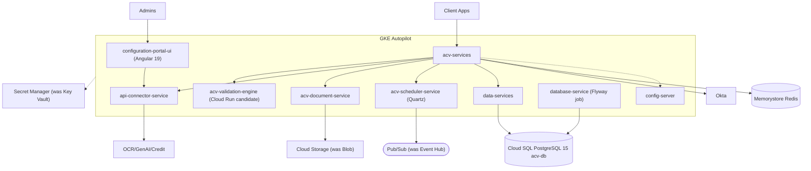
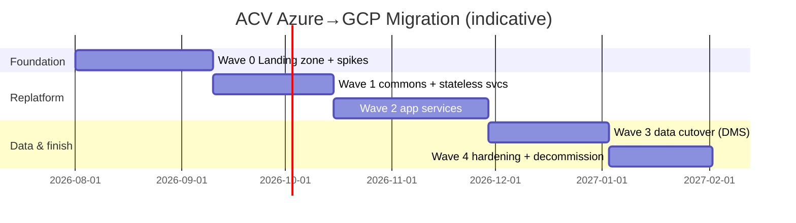

# ACV (Account Creation Validations) — Migration Plan (Azure → GCP)

> **Target platform:** Google Cloud Platform (GCP)
> **Strategy bias:** "Aggressive re-architecture" — but ACV is **already cloud-native microservices**, so the aggressive effort is spent on a **fast, clean re-platform (Azure→GCP)** plus **targeted refactors** of the few genuine debts, not a rewrite. Rebuilding well-designed Spring Boot services would be waste.
> **Business drivers:** end-of-life tech (here: **platform/cloud consolidation onto GCP**) · scalability & reliability · cost/TCO · developer velocity.
> **Prerequisite:** `01_ACV_AsIs_Documentation.md`.

**Tag legend:** `[ASSUMPTION]` · `[UNKNOWN — needs confirmation]`. Effort: XS/S/M/L/XL.

---

## 2.1 Target Architecture

### Principles
Preserve ACV's good architecture (stateless services, externalized config, event-driven, IaC, private networking, secret management) and **swap Azure managed services for GCP equivalents** with minimal code change; harden the few security debts; keep the deployment topology (K8s + config-server + per-service Helm) recognizable to the team.

### Target style & rationale
**Like-for-like microservices on GKE**, with each Azure dependency mapped to its GCP counterpart. Java services are portable Spring Boot 3.3/Java 21 — the migration is dominated by **infrastructure, connectors (`acv-commons`), and networking**, not business logic.

- **Alternatives considered:** (a) *Anthos/hybrid to defer cloud change* — rejected: goal is GCP consolidation. (b) *Rewrite to GCP-serverless-first (Cloud Functions/Workflows)* — rejected: unjustified churn on a healthy codebase; violates "don't rebuild what works." (c) *Re-platform (rehost containers) + targeted refactor* — **chosen**.

### Azure → GCP service mapping (the core of this migration)

| Concern | As-Is (Azure) | To-Be (GCP) | Change type |
|---------|---------------|-------------|-------------|
| Orchestration | AKS | **GKE Autopilot** | Replatform (Helm largely reusable) |
| Relational DB | PostgreSQL 15 Flexible (pgbouncer, extensions) | **Cloud SQL for PostgreSQL 15** (+ Cloud SQL Auth Proxy; verify `hypopg`/`pg_trgm`/`fuzzystrmatch` availability) | Replatform + DB migrate |
| Cache | Redis (TLS 1.2) | **Memorystore for Redis** (TLS) | Replatform (config only) |
| Async stream | Event Hub (4 part / 7d) | **Pub/Sub** (topics + subscriptions; ordering keys; 7d retention) | **Refactor `acv-commons` producer/consumer** |
| Object store | Blob Storage | **Cloud Storage** | Refactor document-service storage adapter |
| Secrets | Key Vault + CSI driver | **Secret Manager** (+ CSI provider or Workload Identity) | Refactor secret mounting |
| Identity | Okta OIDC | **Okta retained** (portable) or Identity Platform | Config (likely no-op) `[ASSUMPTION Okta stays]` |
| Config | Spring Cloud Config + config-repo | **Unchanged** (repoint endpoints) | Config |
| Data masking | Delphix VDBs | **GCP-native masking / DLP** or Delphix-on-GCP | Refactor (Wave 0 decision) |
| Secrets/identity for workloads | AKS service account | **GKE Workload Identity** → GCP SA | Replatform |
| Observability | Actuator+Prometheus+Brave+Dynatrace | **Google Cloud Managed Prometheus + Cloud Trace/Logging + OTel**; keep Dynatrace if licensed | Config/refactor |
| IaC | Terraform (azurerm) | **Terraform (google provider)** | Rewrite infra module |
| CI/CD | `[UNKNOWN]` FedEx CICD | **Cloud Build + Artifact Registry + Cloud Deploy** (or existing) | Rebuild pipeline |

### Target-state — Container (GCP)

### Cross-cutting & targeted hardening (fold into the migration)
- **Fix ACV-R2:** allow-list `data-services {entity}` values + Bean Validation + authz per entity.
- **Fix ACV-R3:** convert scheduler mutating `GET`s (`stop/start/pause`) to `POST/PUT` with idempotency keys.
- **Fix ACV-R5:** make Flyway migration failures **fail-fast** in the pipeline (don't swallow).
- **Fix ACV-R6:** re-verify public allow-list (`/config-portal/**`, `/oktaToken/**`, `/commons/**`) behind the GCP gateway; ensure auth at the edge.
- **Networking:** GCP **Private Service Connect / private IP** for Cloud SQL, Memorystore, Pub/Sub to replicate Azure private-endpoint posture.

### ADRs (abridged)

| ADR | Decision | Consequences |
|-----|----------|--------------|
| ADR-1 | **Re-platform, not rewrite** | Fast, low-risk; preserves proven design |
| ADR-2 | **Event Hub → Pub/Sub** via `acv-commons` abstraction | One library change propagates to all services |
| ADR-3 | **Key Vault → Secret Manager** with Workload Identity | Removes CSI-Azure coupling |
| ADR-4 | **Cloud SQL** with Auth Proxy + private IP | Managed Postgres parity; verify extensions |
| ADR-5 | **Harden during migration** (entity allow-list, GET→POST, fail-fast Flyway) | Security debt paid without a separate program |
| ADR-6 | **Keep Okta** (portable OIDC) | Minimal identity churn `[confirm]` |

---

## 2.2 Gap Analysis

| Capability | As-Is (Azure) | To-Be (GCP) | Gap | Effort | Risk |
|---|---|---|---|---|---|
| Compute | AKS + Helm | GKE Autopilot + Helm | Cluster + registry | M | Low |
| Messaging | Event Hub (SDK in acv-commons) | Pub/Sub | Refactor commons producer/consumer | M | Medium |
| DB | PG Flexible | Cloud SQL 15 | Migrate data + verify extensions | L | Medium |
| Cache | Azure Redis | Memorystore | Config | S | Low |
| Object store | Blob | Cloud Storage | Refactor storage adapter | S | Low |
| Secrets | Key Vault CSI | Secret Manager + WI | Refactor mounting | M | Medium |
| Identity | Okta | Okta (or Identity Platform) | Config | S | Low |
| Masking | Delphix | DLP/native or Delphix-GCP | Decide + implement | M | Medium |
| Observability | Prometheus/Dynatrace | Managed Prometheus/Cloud Ops | Rewire exporters | M | Low |
| IaC | Terraform azurerm | Terraform google | Rewrite infra | L | Medium |
| CI/CD | `[UNKNOWN]` | Cloud Build/Deploy | Build pipeline | M | Low |
| Security debts (R2/R3/R5/R6) | present | hardened | Code fixes | M | Medium |

---

## 2.3 Migration Strategy (6 R's, per service)

| Component | 6R | Rationale |
|-----------|----|-----------|
| acv-services, connector, document, data-services, config-server, portal-ui | **Rehost/Replatform** | Portable containers; repoint deps |
| acv-validation-engine | **Replatform** (Cloud Run candidate) | Stateless/pure → serverless fit |
| acv-scheduler-service | **Replatform + Refactor** | Quartz on Cloud SQL; GET→POST fix |
| acv-commons | **Refactor** | Event Hub→Pub/Sub, KV→Secret Manager |
| database-service | **Replatform + Refactor** | Flyway to Cloud SQL; fail-fast |
| eai-3540813-infra | **Rebuild** | Terraform google provider |
| Delphix masking | **Replace** | GCP-native masking/DLP `[decision]` |

**Overall pattern — parallel environment + phased cutover:** stand up the full GCP stack **in parallel**; migrate stateless services first (validation-engine, connector) behind a gateway with traffic splitting; migrate **data last** (Cloud SQL) with a **replication + short freeze** cutover; keep Azure warm for rollback until stable.

**Why not big-bang:** external providers, Okta, and the DB carry risk; a parallel stack with traffic-split cutover is safer and, because the app is stateless, nearly as fast.

---

## 2.4 Migration Waves

| Wave | Goal | Includes | Entry | Exit | Value |
|------|------|----------|-------|------|-------|
| **0 — Landing zone** | GCP foundation | GKE, Cloud SQL, Memorystore, Pub/Sub, Secret Manager, Artifact Registry, CI/CD, networking (PSC/private IP), Terraform-google, observability; **Delphix/masking decision** | Approvals, Okta/provider egress from GCP | Sample service Ready with auth+telemetry | Platform ready |
| **1 — commons + stateless services** | Prove pattern | Refactor `acv-commons` (Pub/Sub, Secret Manager); deploy **validation-engine** + **connector** on GCP; gateway traffic-split | Wave 0 | Stateless services serve on GCP; provider calls work | Thin-slice, low blast radius |
| **2 — app services** | Bulk of platform | config-server, acv-services, document-service (GCS), scheduler (refactored), portal-ui | Wave 1 | All app services on GCP against **Azure DB (via connectivity)** or replica | Most workload on GCP |
| **3 — data cutover** | Move the DB | Cloud SQL provisioned; **DMS replication** PG→Cloud SQL; extensions verified; freeze + cut; database-service Flyway fail-fast | Wave 2 | Reads/writes on Cloud SQL; parity verified | DB independence |
| **4 — hardening + decommission** | Finish | Apply R2/R3/R5/R6 fixes; verify SLOs; tear down Azure (AKS/EH/Blob/KV/PG) | Wave 3 | Azure dark; hardened | TCO + security realized |

**Thin-slice first:** **acv-validation-engine** — stateless, pure, no DB, no external deps → validates GKE + gateway + auth + observability + `acv-commons` refactor with essentially zero blast radius.

---

## 2.5 Per-Service Migration Playbooks

**acv-commons (do first — everything depends on it):**
1. Introduce a **messaging abstraction** (`EventPublisher`/`EventConsumer`) with Pub/Sub impl; keep Event Hub impl behind a flag for parallel-run.
2. Swap secret access to Secret Manager (Workload Identity).
3. Version + publish; consumers bump dependency in Wave 1–2.
**Rollback:** flag back to Event Hub/KV impl.

**acv-validation-engine (thin slice):** containerize → deploy to GKE/Cloud Run → gateway split 5%→100% → compare `/validate` outputs (deterministic) → retire Azure instance. **Rollback:** gateway back to AKS.

**acv-scheduler-service:** re-point Quartz to Cloud SQL; migrate `qrtz_*`; **convert GET mutations to POST**; validate misfire/lock behavior with multiple replicas. **Rollback:** re-point to Azure DB/AKS.

**data-services:** deploy on GKE; add **entity allow-list + Bean Validation + authz**; point to Cloud SQL post-Wave-3. **Rollback:** point back to Azure PG.

**database-service:** run Flyway against Cloud SQL; **make failures fail-fast** (fail the pipeline, not swallow). **Rollback:** re-run against Azure PG.

---

## 2.6 Data Migration Strategy (first-class)

- **Approach:** **GCP Database Migration Service (DMS)** continuous replication **Azure PostgreSQL Flexible → Cloud SQL 15**; validate **extensions** (`pgcrypto, pg_stat_statements, uuid-ossp, pg_trgm, fuzzystrmatch, hypopg`) — `hypopg`/`fuzzystrmatch` availability on Cloud SQL must be confirmed early `[UNKNOWN]`; if unsupported, refactor dependent features.
- **Quartz state:** migrate `qrtz_*`; **quiesce the scheduler** during the freeze so no trigger fires mid-cut (idempotency + lock tables make this safe).
- **Consistency & reconciliation:** row counts + checksums per table pre/post; app-level smoke on config/reference model; validate audit columns.
- **Cutover mechanics:** DMS in continuous sync → **short freeze** (scheduler paused, writes drained) → promote Cloud SQL → repoint `POSTGRES_DB_*` secrets → resume. In-flight Event Hub/Pub/Sub messages: run **dual-consume bridge** so no event is lost across the swap.
- **Data rollback:** keep Azure PG as **reverse-replication target** during a stabilization window; if rollback needed, repoint secrets back and replay Cloud SQL deltas. Blob→GCS: dual-write documents during transition; reconcile object inventories.

---

## 2.7 Cutover & Rollback

- **Cutover runbook (Wave 3 DB):** dress rehearsal in nonprod; freeze window; go/no-go (DMS lag=0, extension checks pass, reconciliation=0, scheduler paused, DLQ/bridge healthy); promote; smoke; resume.
- **Rollback:** triggers — replication lag/parity failure, extension incompatibility surfaced, error-rate/latency SLO breach, event loss. **Time-to-rollback < 30 min** (repoint secrets to Azure; reverse-replication covers writes). Rehearsed in Wave 1 for stateless, Wave 3 for data.
- **Comms:** change ticket; keep Azure warm until 2 stable weeks post-Wave-4.

---

## 2.8 Testing & Validation

- **Functional parity:** re-run the existing **acv-api-automation** (Cucumber + REST Assured + TestNG) against the GCP stack — this suite is the parity oracle.
- **Contract tests:** provider connectors (OCR/GenAI/credit) against sandbox from GCP egress.
- **Non-functional:** load/soak (virtual-threads behavior on GKE), Cloud SQL connection/pgbouncer-equivalent (Cloud SQL Auth Proxy / built-in pooling) tuning.
- **Security:** verify hardened `data-services`/scheduler; re-run OWASP checks; confirm private networking (no public data-plane).
- **Chaos:** provider outage + Pub/Sub redelivery; Cloud SQL failover; config-server unavailability (startup dependency).

---

## 2.9 Observability & Operational Readiness

- **SLIs/SLOs:** availability (acv-services/validation-engine ≥ 99.9% `[ASSUMPTION]`), p99 core GET < 300 ms, OCR/credit retry success, event lag, Cloud SQL health.
- **Wire first:** Google Cloud Managed Prometheus scraping `/actuator/prometheus`; Cloud Trace via OTel; log-based alerts; Pub/Sub backlog/DLQ; Cloud SQL insights (`pg_stat_statements`).
- **APM:** keep **Dynatrace** if licensed on GCP; otherwise Cloud Ops.
- **Readiness checklist (per service):** liveness/readiness on 8081, dashboards+alerts, secrets in Secret Manager via WI, config import working, rollback rehearsed, security fixes applied.

---

## 2.10 Risk Register

| ID | Risk | Likelihood | Impact | Mitigation | Contingency | Owner |
|----|------|-----------|--------|------------|-------------|-------|
| A-1 | PG extension gaps on Cloud SQL (`hypopg`, etc.) | Medium | Medium | Verify in Wave 0 spike | Refactor feature / AlloyDB | DBA |
| A-2 | Event Hub→Pub/Sub semantics (ordering/retention) differ | Medium | Medium | Abstraction + parity tests; ordering keys | Dual-consume bridge longer | Eng lead |
| A-3 | External provider egress/allow-listing from GCP | Medium | High | Early network + provider IP allow-list | Route via on-prem/hybrid | Platform |
| A-4 | Okta config drift on GCP | Low | Medium | Config test in Wave 1 | Identity Platform fallback | Security |
| A-5 | Data cutover parity/lag | Medium | High | DMS + reconciliation + freeze | Reverse-replication rollback | Data lead |
| A-6 | Delphix masking replacement | Medium | Medium | Decide Wave 0 (DLP/native) | Delphix-on-GCP | Data/Compliance |
| A-7 | Unknown CI system → pipeline rebuild delay | Medium | Medium | Cloud Build early | Reuse existing template | DevOps |
| A-8 | Security debts unaddressed under time pressure | Medium | Medium | Bundle fixes into waves (not deferred) | Gate go-live on fixes | Security |

---

## 2.11 Roadmap & Timeline

- **Estimation basis:** portable Spring Boot + managed-service swaps (well-understood); **confidence Medium** (higher than MyDelivery/B2C because ACV is already modern). Refine after Wave-0 spikes (extensions, provider egress, CI).
- **Critical path:** Wave 0 → 1 (commons) → 2 → 3 (data) → 4. The **`acv-commons` refactor** and **DB cutover** gate the rest.
- **Top 3 schedule risks:** extension compatibility (A-1), provider egress (A-3), data cutover parity (A-5).

---

## 2.12 Team, Roles & Ways of Working

- **Roles:** Program lead, Platform/DevOps (GKE/Terraform-google/CI), Backend (commons + service repoint), Data engineer (DMS/Cloud SQL), Integration (provider egress), Security (harden + OWASP), SRE, QA/SDET (run api-automation on GCP).
- **RACI:**

| Workstream | Program | Platform | Backend | Data | Security | QA |
|---|---|---|---|---|---|---|
| Landing zone / Terraform | A | R | C | C | C | I |
| acv-commons refactor | A | C | R | I | C | C |
| Service replatform | A | C | R | C | C | R |
| Data cutover (DMS) | A | C | C | R | C | C |
| Hardening (R2/R3/R5/R6) | A | I | R | I | R | C |

- **Skill gaps → close:** GCP (Pub/Sub, Cloud SQL, DMS, Workload Identity) via training + GCP PSO; Terraform google provider; DMS at scale.

---

## 2.13 Cost & TCO

- **One-time:** infra rebuild (Terraform google), `acv-commons` refactor, DMS cutover, parallel Azure+GCP run during Waves 1–3, pipeline rebuild.
- **Run-cost delta:** primarily a **provider swap** (AKS→GKE, PG Flexible→Cloud SQL, Event Hub→Pub/Sub, Blob→GCS, Key Vault→Secret Manager) — net change depends on committed-use discounts and workload; **Cloud Run for validation-engine** can cut idle cost. Consolidating onto **one cloud (GCP)** reduces multi-cloud operational overhead and licensing spread. `[UNKNOWN]` current Azure spend — quantify for payback.
- **TCO/payback:** driven by cloud-consolidation savings + CUD; validation-engine serverless idle savings; retiring Delphix (if replaced by native) reduces license. Model once Azure invoices are supplied.

---

## 2.14 Success Metrics & Exit Criteria

- **KPIs:** availability ≥ 99.9% `[ASSUMPTION]`; p99 core GET < 300 ms; api-automation suite **100% green on GCP**; 0 public data-plane endpoints; security debts (R2/R3/R5/R6) closed; deployment frequency ≥ current.
- **"Done":** all ACV services on GCP; Azure resources decommissioned; SLOs sustained 30 days; parity suite green.
- **Decommission checklist:** AKS/Event Hub/Blob/Key Vault/PG Flexible/Delphix torn down; secrets rotated into Secret Manager; DNS/endpoints repointed; final Azure DB snapshot archived to Cloud Storage; Terraform-azurerm state retired; runbooks updated.

---

## 2.15 Executive Summary of the Plan

**Strategy in a sentence:** Because ACV is already well-architected cloud-native microservices, **re-platform it fast and cleanly from Azure to GCP** — map each managed service (AKS→GKE, PG Flexible→Cloud SQL, Event Hub→Pub/Sub, Blob→GCS, Key Vault→Secret Manager) via a single `acv-commons` abstraction, migrate the database last with DMS, and fold the handful of real security fixes into the waves rather than rewriting healthy code. **Waves:** Landing zone → commons + stateless services → app services → data cutover → hardening & decommission. **Timeline:** ~6–8 months (Medium confidence — the highest of the three, since the code is portable). **Cost:** a like-for-like provider swap plus single-cloud consolidation savings; validation-engine on Cloud Run trims idle cost. **Top 3 risks:** Postgres extension compatibility, external-provider egress from GCP, data-cutover parity. **Day-one step:** stand up the GCP landing zone and migrate **acv-validation-engine** (stateless, pure) as the thin slice while running Wave-0 spikes on Cloud SQL extensions, provider egress, and CI.
