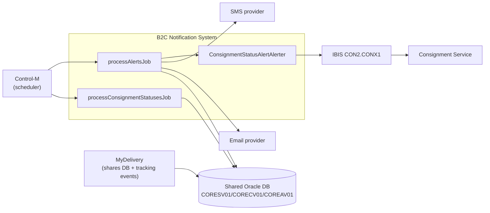
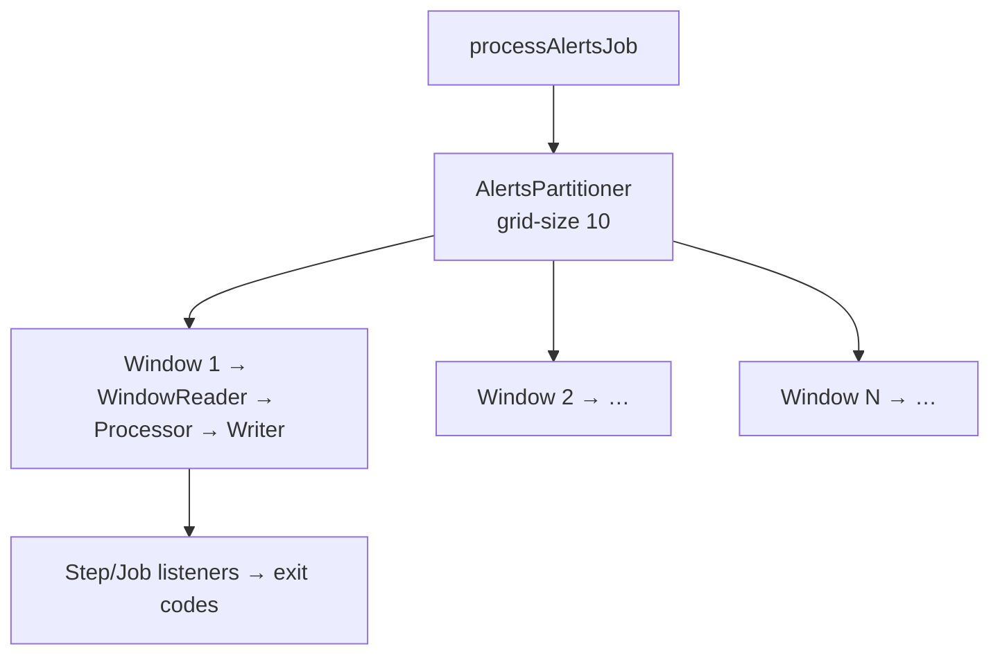
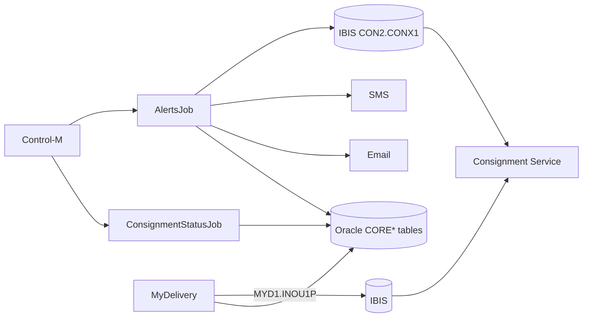

# B2C Notification — As-Is Documentation

> **Service:** B2C (Business-to-Consumer) Notification & Alerting System
> **Owner (origin):** TNT Express (now FedEx) · Java package roots `com.tnt.b2c.*`, `com.tnt.express.domain.delivery.async` · module `B2C-Notification/B2C-NotificationService`
> **Scope:** Reverse-engineered current-state picture of the batch notification system that turns consignment status events into consumer email/SMS alerts. **MyDelivery** and **ACV** are documented separately; the tight coupling between B2C and MyDelivery (shared Oracle DB + IBIS) is flagged throughout.

**Tag legend:** `[INFERRED]` · `[ASSUMPTION]` · `[UNKNOWN — needs confirmation]`.

---

## 1.1 Executive Summary

**B2C Notification** is an **automated, batch-driven alerting system** that sends time-sensitive **email and SMS notifications** to consumers based on shipment (consignment) status changes and alert windows — e.g. "out for delivery," "delivery failed," "ready for collection." It is **not interactive**: it runs as **Spring Batch jobs** (defined in XML) that scan the database for eligible events in time windows, map them to localized message templates via config-driven rules, dispatch through email/SMS channels, and report processing status back to the **Consignment Service** over TNT's **IBIS** messaging middleware.

The system is built on a **legacy pre-Java-17 Spring stack** `[INFERRED]`: **Spring Batch (XML configuration)** with **partitioning** (grid-size 10) for parallel time-window processing; **PropertiesFactoryBean**-loaded configuration for status→template and country→language/time-zone mappings; **JAXB** marshalling to the **ConDB** XML schema; the proprietary **IBIS J2SE client** (`ibis-j2se-1.4.0.jar`) publishing to service endpoint **`CON2.CONX1`**; and a custom `DateTimeHelper` over legacy `Date` APIs. Jobs are orchestrated externally by **Control-M** `[INFERRED]` and run on **WebSphere** `[INFERRED]`. Persistence is the **same shared Oracle database** as MyDelivery, with B2C owning the high-volume alert/consignment-notification tables (`CORECV01`, `COREAV01`, `CORESV01`).

**Headline risks:** (1) **very high data volumes** — `CORECV01/COREAV01/CORESV01` are described as holding **millions of rows** with continuous inserts, making them both a performance concern and the hardest data to migrate; (2) **shared Oracle DB** coupling to MyDelivery and the tracking domain (the primary decomposition blocker); (3) **IBIS/WebSphere lock-in** for both messaging and batch runtime; (4) **error handling that swallows exceptions** and marks alerts failed (weak dead-letter semantics); (5) **XML Spring Batch config + PropertiesFactoryBean** and legacy date handling are EOL-adjacent and hard to test. **The single biggest obstacle to modernization is the combination of the shared, high-volume Oracle tables and the batch/IBIS coupling** — B2C cannot become event-driven until status events are available on a stream and its alert data is decomposed from the shared schema.

---

## 1.2 Component Inventory

| Component | Purpose | Language/Runtime | Type | Data store(s) | Upstream | Downstream | Ownership | Criticality | Doc quality |
|-----------|---------|------------------|------|---------------|----------|------------|-----------|-------------|-------------|
| **processConsignmentStatusesJob** | Read status events, map to templates/alert types, persist alerts | Spring Batch (XML), Java | Batch job | Oracle (`CORESV01`,`CORECV01`,`COREAV01`,`BATCH_*`) | Control-M `[INFERRED]` | DB | B2C team | **Critical** | Medium |
| **processAlertsJob** | Read pending alerts, apply send-mode logic, dispatch email/SMS, update status | Spring Batch (XML), Java | Batch job | Oracle (`COREAV01`), email/SMS providers | Control-M `[INFERRED]` | Email/SMS, IBIS | B2C team | **Critical** | Medium |
| **ConsignmentStatusProcessor** | Map statuses→templates using config; enrich consignment data | Java | Processor | `CORECV01`,`CORESV01` | Job | DB | B2C team | High | Medium |
| **AlertProcessor** | Mode-specific alert logic (INITIAL vs RESEND) | Java | Processor | `COREAV01` | Job | — | B2C team | High | Medium |
| **ConsumerAlerter** | Build localized messages (country→language, template→type), dispatch | Java | Communicator | provider APIs | Processor | Email/SMS | B2C team | High | Medium |
| **ConsignmentStatusAlertAlerter** + **IbisDataProvider** | Aggregate alerts, build **ConDB** XML, send to IBIS `CON2.CONX1` with retry | Java, JAXB, IBIS J2SE | IBIS sender | `COREAV01` | Alert flow | IBIS → Consignment Service | B2C team | **Critical** | High |
| **WindowReader** | Parameterized SQL reader for a time window | Spring Batch reader | Reader | Oracle | Partitioner | DB | B2C team | High | Medium |
| **Partitioners** (`ConsignmentStatusesPartitioner`, `AlertsPartitioner`) | Split work into minute-based windows (grid-size 10) | Java | Partitioner | — | Job | Steps | B2C team | Medium | Medium |
| **Writers** (`ConsignmentStatusAlertWriter`, `AlertUpdater`) | Persist generated/updated alerts | Spring Batch writer | Writer | `COREAV01` | Step | DB | B2C team | High | Medium |
| **Listeners** (`B2CJobExecutionListener`, `B2CStepExecutionListener`) | Metrics/logging, custom exit codes (`B2CExitStatus`, `B2CExitCodeMapper`) | Java | Listener | — | Batch | Logs | B2C team | Medium | Medium |
| **Properties** (`consignment-status-alerting.properties`, mapping property files) | status2TemplateMapping, country2LanguageMapping, templateNr2TypeMapping, time zones, IBIS config | Properties + PropertiesFactoryBean | Config | — | All | — | B2C team | Medium | Medium |

---

## 1.3 Per-Component Deep Dive

### 1.3.1 Consignment Status Job (`processConsignmentStatusesJob`)

- **Purpose:** Ingest consignment status events and generate the alert records that the Alerts Job will later dispatch. **Not responsible for** actually sending email/SMS (that is the Alerts Job) — though immediate send is possible if configured.
- **Flow:** Job start → `ConsignmentStatusesPartitioner` splits into minute-based windows → per partition `WindowReader` runs parameterized SQL over `CORESV01` (status events) → `ConsignmentStatusProcessor` maps status→template/alert-type using property config, updates `CORECV01` → `ConsignmentStatusAlertWriter` persists alerts to `COREAV01` → listeners log summary + custom exit codes.
- **Tech / EOL:** Spring Batch **XML** config (`process-consignment-statuses-job.xml`); chunk processing with commit-interval; `PropertiesFactoryBean` for mappings. **EOL-adjacent** (XML batch config; needs Spring Batch 5 Java DSL).
- **State & concurrency:** Partitioned parallelism (grid-size 10) bounded by DB throughput; chunk transactions via Spring Batch.
- **Fragile areas:** Config-driven mapping logic is opaque and hard to unit-test; high insert volume on `CORESV01`/`COREAV01`.

### 1.3.2 Alerts Job (`processAlertsJob`)

- **Purpose:** Read alerts needing processing and dispatch them; mark as sent.
- **Flow:** Job start → `AlertsPartitioner` defines alert windows → `WindowReader` fetches from `COREAV01` → `AlertProcessor` applies mode logic (INITIAL vs RESEND) → `ConsumerAlerter` builds localized messages (`country2LanguageMapping`, `templateNr2TypeMapping`, `DateTimeHelper` formatting) → dispatch via email/SMS → `AlertUpdater` marks alerts sent/updates status → listeners record results.
- **Config:** `batch.email.fromAddress=no-reply@tnt.com`, `batch.sms.priority=Standard`, `batch.sms.receipt=N`, plus template/status maps and due-date formats.
- **Error handling:** `TemplateException`/`CommunicationException` wrap lower-level failures; persistence errors roll back the chunk. IBIS send uses **exponential-backoff retry (max 5)**; on final failure the exception is logged and the alert marked failed (**swallowed** — weak DLQ semantics).
- **Fragile areas:** No true dead-letter queue; localization depends on external property files; provider integration details `[UNKNOWN]`.

### 1.3.3 IBIS Reporting (`ConsignmentStatusAlertAlerter` + `IbisDataProvider`)

- **Purpose:** After alert generation/dispatch, **report consignment status back to the Consignment Service** over IBIS so master data stays consistent.
- **Mechanics:** Alerts aggregated by consignment id + template (~2:1 email+SMS→1 IBIS message). `IbisDataProvider.getIbisMessage()` builds a **ConDB** XML message (JAXB marshalling, XSLT cleans nil elements). `ConsignmentStatusAlertAlerter.sendIbisMessage()` batches to IBIS business service **`CON2.CONX1`** via `IbisManager` (`com.tnt.ww.shared.ibis.j2se.impl.IbisManager` singleton). Retry: `wait = ceil((retry+1)²/2)` seconds, up to `batch.ibis.retryCount=5`; user id `B2CAlert`.
- **ConDB message (abridged):** `<ConDB><consignmentStatus><conNum/><legacyConNum/><eventDate><utc/></eventDate><addUsr>B2CAlert</addUsr>…</consignmentStatus></ConDB>`.
- **Dependencies:** `ibis-j2se-1.4.0.jar`, `spring-oxm`, `spring-batch`, `jaxb-api`; generated JAXB classes under `com.tnt.b2c.alert.ibis` (`ConDB`, `ConsignmentStatus`, `DateTimeHelper`, `ObjectFactory`).
- **Fragile areas:** Proprietary IBIS client (v1.4.0, ancient); connection pooling recommended-but-absent; ConDB schema compliance is a common failure mode.

### 1.3.4 Configuration & Localization

- **Approach:** `PropertiesFactoryBean` loads `.properties` into maps: `status2TemplateMapping`, `country2LanguageMapping`, `templateNr2TypeMapping`, time zones, due-date formats.
- **Localization:** Country→language/time-zone drives message personalization; due-date formatting adapts per locale.
- **Model classes:** `ConsignmentStatus` (timestamp, status code), `ConsignmentStatusAlert` (pending/dispatched), enums `NotificationType`/`AlertType`/`TemplateType`.

### 1.3.5 MyDelivery-side async (context, owned by Shared Components)

> The MyDelivery portal publishes to a **different** IBIS queue (`MYD1.INOU1P`) via a **JMS MDB** (`DeliveryAsyncMessageProcessorMDB`), documented in the MyDelivery as-is doc. B2C's IBIS usage is the **`CON2.CONX1`** business-service path above. The two are distinct implementations (IBIS API for B2C; JMS for MyDelivery) but converge on the Consignment Service.

---

## 1.4 System Context & Diagrams

### Context diagram



### Sequence — status event to consumer alert

```mermaid
sequenceDiagram
    participant EXT as Consignment Service
    participant DB as Oracle
    participant CSJ as ConsignmentStatusJob
    participant AJ as AlertsJob
    participant CH as Email/SMS
    participant IB as IBIS CON2.CONX1
    EXT->>DB: Insert status event (CORESV01)
    CSJ->>DB: WindowReader reads CORESV01 (partitioned)
    CSJ->>CSJ: map status→template (properties)
    CSJ->>DB: update CORECV01; insert alerts COREAV01
    AJ->>DB: read pending alerts (COREAV01)
    AJ->>AJ: AlertProcessor (INITIAL/RESEND) + localize
    AJ->>CH: dispatch email/SMS
    AJ->>DB: AlertUpdater marks sent
    AJ->>IB: aggregated ConDB status report (retry x5)
    IB->>EXT: update master status
```

### Batch partitioning



---

## 1.5 Data Architecture

- **Engine:** Same **shared Oracle DB** as MyDelivery `[per source]`; version `[UNKNOWN]`.
- **B2C-owned tables (3, high-volume):**

| Logical/Physical | Purpose | Volume/pattern | Key columns (partial) |
|---|---|---|---|
| CORECV01 | Consignment notification data (customer prefs, alert settings, contact) | **Millions**; read-heavy + updates | consignment key |
| COREAV01 | Generated alerts (records, processing status, retry counters) | **Millions**; high insert/update | `BCX_PROC_STAT_CD`, `BCX_ALERT_TYPE_CD`, `BCX_ALERT_TD`, `BCX_PROC_TD`, `CON_ID` |
| CORESV01 | Status events (processing/tracking) | **Millions**; continuous inserts | status/event |

- **Framework tables (6):** `BATCH_JOB_INSTANCE`, `BATCH_JOB_EXECUTION`, `BATCH_JOB_EXECUTION_PARAMS`, `BATCH_STEP_EXECUTION`, `BATCH_STEP_EXECUTION_CONTEXT`, `BATCH_JOB_EXECUTION_CONTEXT` (Spring Batch metadata).
- **Read dependencies (not owned):** Track & Consignment `CORCOV01/CORCSV01/CORCNV01`; Customer `CNRCUV01/CNRACV01`; Common Codes `NCRSDV01/NCRQSV01/NCRQUV01/NCRQLV01`.
- **Data flow:** `CORESV01 → ConsignmentStatusProcessor → CORECV01 → COREAV01 → AlertProcessor → send`.
- **Ownership & sharing (flagged):** B2C's alert tables sit in the **same schema** as MyDelivery's `DDR*` tables and the tracking `COR*` tables. High-volume B2C writes contend with MyDelivery transactions on shared DB resources — a coupling and a performance risk.
- **Diagnostics:** e.g. `SELECT BCX_PROC_STAT_CD, COUNT(*) FROM COREAV01 WHERE BCX_ALERT_TD >= SYSDATE-1 GROUP BY BCX_PROC_STAT_CD;` and error scan `WHERE BCX_PROC_STAT_CD='ERROR'`.

---

## 1.6 Dependency & Integration Map



**Callouts:**
- **Single points of failure:** shared Oracle DB; IBIS `CON2.CONX1`; Control-M; WebSphere; email/SMS providers.
- **Spider-in-the-web:** the shared Oracle schema — every B2C and MyDelivery flow depends on it.
- **Hidden coupling:** B2C ↔ MyDelivery via **shared tables** and via the **Consignment Service** loop (MyDelivery updates status → status change → B2C alert → status report back).
- **Weak resilience seam:** IBIS retry swallows terminal failures (no DLQ).
- **Undocumented:** exact Control-M schedule/cron; provider (email/SMS) endpoints and SLAs `[UNKNOWN]`.

---

## 1.7 Non-Functional Characteristics

| Attribute | As-is observation |
|---|---|
| **Availability** | `[UNKNOWN]` SLA. Batch model → alerts are near-real-time at best (window cadence). IBIS reliability cited ">99%" with retries. |
| **Performance / scale** | Partitioning (grid-size 10) + chunk commit-interval; tune to DB throughput. Millions of rows on `CORE*` tables → index/partitioning-sensitive. Aggregation (~2:1) reduces IBIS volume. |
| **Security** | System user `B2CAlert`; PII in messages (email/phone/name). `[UNKNOWN]` secret handling for provider/IBIS creds; no field-level encryption evidenced. |
| **Compliance** | Consumer communications → opt-out/consent and retention obligations `[UNKNOWN/GDPR]`. |
| **Bottlenecks** | High-volume DB writes; IBIS connection setup per message (no pooling); external provider latency. |

---

## 1.8 Operational Model

- **Build/deploy:** Maven; artifacts include `process-alerts-job.xml`, `consignment-status-alerting.properties`, ConDB JAXB classes, `ibis-j2se-1.4.0.jar`. Deployed on WebSphere `[INFERRED]`.
- **Scheduling:** **Control-M** triggers jobs at intervals `[INFERRED; exact cadence UNKNOWN]`.
- **Observability:** Log4j-style logging (e.g. `"Successfully sent N ibis messages"`); batch listeners emit exit codes/metrics; monitoring is **log + SQL based**. Key metrics to watch: queue depth, error rate, processing time, retry frequency.
- **Runbook (existing):** troubleshooting decision tree for IBIS (queue backed up → check consumers; connection → firewall/IBIS team; performance → scale consumers/tune batch sizes; format → validate ConDB schema). Diagnostic SQL provided.
- **Backup/DR:** Oracle-level `[UNKNOWN RPO/RTO]`.
- **Pain points:** No DLQ; opaque property-driven mappings; ancient IBIS client; batch latency; shared-DB contention.

---

## 1.9 Risks, Tech Debt & Constraints Register

| ID | Item | Type | Impact | Migration relevance |
|----|------|------|--------|---------------------|
| B2C-R1 | Shared high-volume Oracle tables (`CORE*`, millions of rows) | Constraint/Risk | High | **Hardest data migration**; decompose + CDC/backfill |
| B2C-R2 | IBIS `CON2.CONX1` + `ibis-j2se-1.4.0.jar` (proprietary, ancient) | Constraint | High | Replace with cloud-native pub/sub |
| B2C-R3 | Spring Batch XML config + PropertiesFactoryBean | Tech debt | Medium | Move to Spring Batch 5 Java DSL / event-driven |
| B2C-R4 | Batch (not event-driven) → notification latency | Tech debt | Medium | Re-architect to stream processing |
| B2C-R5 | Exception-swallowing, no true DLQ | Risk | Medium | Add DLQ + retry/circuit-breaker |
| B2C-R6 | Legacy `Date`/`DateTimeHelper` | Tech debt | Low–Med | Migrate to `java.time` |
| B2C-R7 | Control-M + WebSphere runtime (lock-in) | Constraint | High | Re-platform to K8s CronJobs / stream consumers |
| B2C-R8 | Provider (email/SMS) integration undocumented | Risk (knowledge) | Medium | Discover before cutover |
| B2C-R9 | Pre-Java-17 language level | Constraint | High | JDK upgrade + containerize |
| B2C-R10 | No metrics/tracing (log-only) | Tech debt | Medium | Add observability |
| B2C-R11 | PII in messages; secret handling unclear | Risk (security) | High | Secret Manager + encryption + consent handling |

---

## 1.10 Assumptions & Open Questions

**Tagged:**
- `[INFERRED]` Control-M orchestrates the jobs; `[UNKNOWN]` exact cadence.
- `[INFERRED]` Runs on WebSphere.
- `[ASSUMPTION]` Email and SMS go through separate provider integrations (unspecified vendors).
- `[UNKNOWN]` Versions (JDK, Spring, Spring Batch, Oracle); provider SLAs; consent/opt-out model; retention.

**Prioritized questions:**
1. Are consignment **status events available on a stream/topic**, or only as DB rows — i.e., can B2C become event-driven without re-plumbing the source?
2. What are the **real volumes and freshness SLAs** (alerts/hour, acceptable delay)?
3. Which **email/SMS providers** are used, and what are their APIs/limits/costs?
4. What **consent, opt-out, and retention** rules govern consumer notifications?
5. Can B2C's `CORE*` data be **decomposed** from the shared schema, and what history must be retained/migrated?
6. Is the **IBIS status-report back to Consignment Service** contractually required, or can it be replaced by an event?

---

## 1.11 Glossary

| Term | Meaning |
|------|---------|
| Alert | A pending or dispatched consumer notification (email/SMS). |
| ConDB | XML schema used to report consignment status to the Consignment Service over IBIS. |
| IBIS (`CON2.CONX1`) | TNT proprietary messaging middleware / business-service endpoint used by B2C. |
| Partitioning | Splitting batch work into parallel windows (grid-size 10). |
| Chunk / commit-interval | Spring Batch read-process-write transaction unit. |
| INITIAL / RESEND | Alert send modes handled by `AlertProcessor`. |
| DLQ | Dead-letter queue (absent here — a gap). |
| Control-M | Enterprise batch scheduler that triggers the jobs. |
| `CORECV01` / `COREAV01` / `CORESV01` | B2C-owned notification-data / alert / status-event tables. |
| `B2CAlert` | System user id used for IBIS/audit. |

---

*End of B2C as-is documentation. See `02_B2C_Migration_Plan.md` for the modernization plan.*
