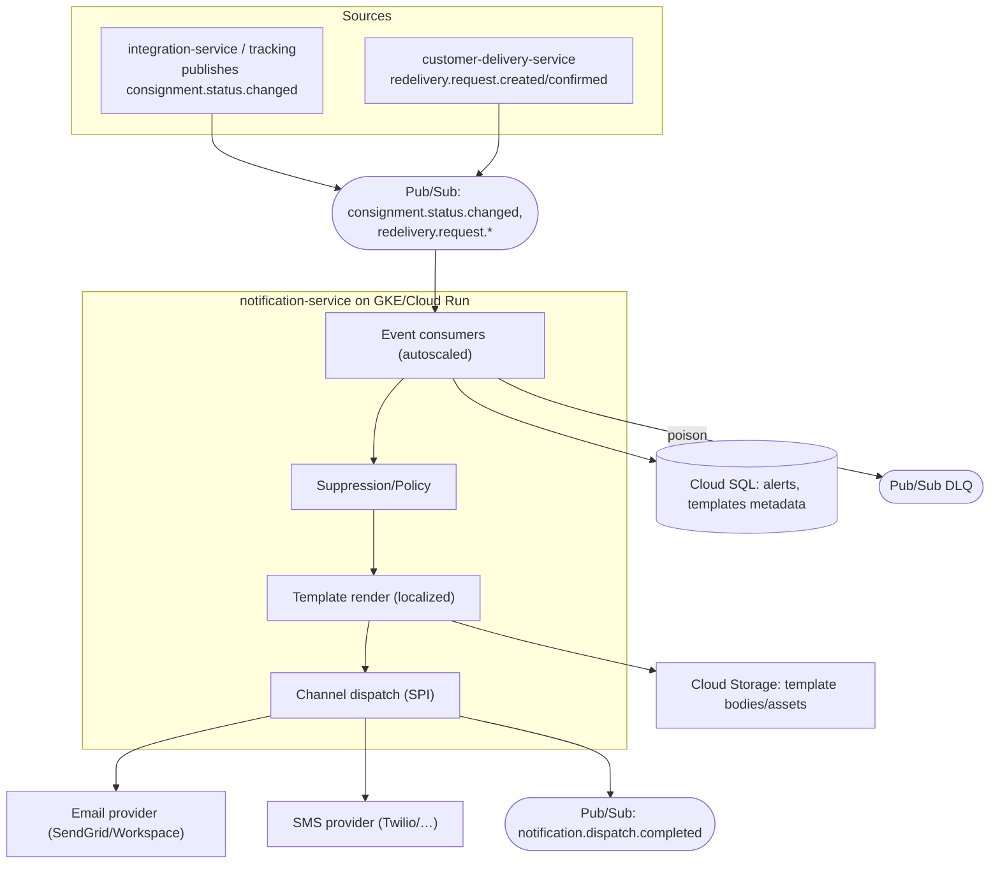
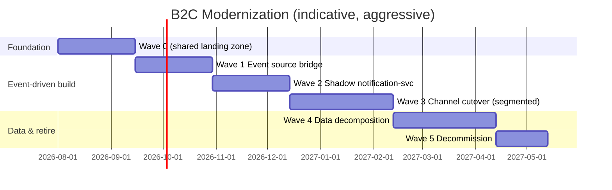

# B2C Notification — Modernization & Migration Plan

> **Target platform:** Google Cloud Platform (GCP)
> **Strategy bias:** Aggressive re-architecture — turn a **batch** notification system into an **event-driven streaming** service.
> **Business drivers:** end-of-life tech · scalability & reliability · cost/TCO · developer velocity.
> **Prerequisite:** `01_B2C_AsIs_Documentation.md`. B2C shares the **Shared Data Decomposition Program** and Pub/Sub backbone with MyDelivery (`../MyDelivery/02_MyDelivery_Migration_Plan.md` §2.6); this plan is sequenced with it.

**Tag legend:** `[ASSUMPTION]` · `[UNKNOWN — needs confirmation]`. Effort: XS/S/M/L/XL.

---

## 2.1 Target Architecture

### Principles
Event-driven-first · exactly-once-ish with idempotency + DLQ · database-per-service · stateless consumers with autoscaling · provider abstraction (SPI) for email/SMS · observability & backpressure by default.

### Target style & rationale
Replace the Control-M/Spring-Batch/IBIS pipeline with a **GCP-native, event-driven `notification-service`** that consumes consignment-status events from **Pub/Sub**, applies suppression/template rules, renders localized messages, and dispatches via pluggable email/SMS providers — emitting completion events for audit/analytics. This is the `notification-service` from the source **NewUnifiedPlatformArchitecture** blueprint, **re-targeted from Kafka to Pub/Sub**.

- **Alternatives considered:** (a) *Rehost batch on Compute Engine + keep IBIS* — rejected: preserves lock-in and batch latency. (b) *Replatform Spring Batch to Cloud Run Jobs on a schedule* — a viable **interim** (retained as fallback for any residual bulk sweeps), but rejected as the end state because it keeps polling latency and DB contention. (c) *Aggressive event-driven re-architecture* — **chosen**: cuts notification latency, removes IBIS/Control-M, scales elastically.

### Target-state — Container

### Technology choices

| Layer | Choice | Justification | Rejected |
|-------|--------|---------------|----------|
| Compute | **Cloud Run** (event consumers) / GKE | Serverless autoscale to event volume | Always-on batch VMs |
| Messaging | **Pub/Sub** (+ DLQ, ordering keys by consignmentId) | Replaces IBIS `CON2.CONX1` + Control-M polling | Kafka (ops), keep IBIS (lock-in) |
| Data | **Cloud SQL for PostgreSQL** (notification schema) | Drops Oracle license; owns alert data | Shared Oracle (coupling) |
| Templates/content | **Cloud Storage + Cloud SQL metadata** (or content-service) | Versioned templates, live updates | Property-file mappings |
| Email | **SendGrid / Google Workspace** via SPI | Managed deliverability | Self-run SMTP |
| SMS | **Twilio / provider** via SPI `[ASSUMPTION]` | Managed, global | Bespoke gateway |
| Scheduling (residual) | **Cloud Scheduler + Cloud Run Jobs** | For any periodic sweeps | Control-M |
| Secrets | **Secret Manager** | Provider/API keys | Property files |
| Observability | **Cloud Ops + OpenTelemetry** | Metrics/traces/DLQ visibility | Log-only |
| IaC / CI-CD | **Terraform + Cloud Build/Deploy** | Consistent with platform | Manual |

### Cross-cutting
- **Idempotency:** dedupe by `(consignmentId, template, eventId)`; ordering keys preserve per-consignment sequence.
- **Suppression/consent:** frequency caps, opt-out, quiet-hours as first-class policy (closes a compliance gap).
- **Resilience:** provider retries + circuit breakers; **real DLQ** (replacing today's exception-swallowing); replay from DLQ.

### ADRs (abridged)

| ADR | Decision | Consequences |
|-----|----------|--------------|
| ADR-1 | **Event-driven over batch** (Pub/Sub consumers) | Near-real-time alerts; removes Control-M/window polling |
| ADR-2 | **Replace IBIS `CON2.CONX1`** with Pub/Sub + status event | Removes proprietary client; needs anti-corruption bridge during cutover |
| ADR-3 | **Own alert data in Cloud SQL** | Ends shared-Oracle contention; requires CDC/backfill of `CORE*` |
| ADR-4 | **Provider SPI** for email/SMS | Swappable vendors; testable |
| ADR-5 | **Real DLQ + replay** | No silent alert loss |

---

## 2.2 Gap Analysis

| Capability | As-Is | To-Be | Gap | Effort | Risk |
|---|---|---|---|---|---|
| Trigger model | Control-M + Spring Batch windows | Pub/Sub event consumers | Re-architect | L | High |
| Status ingestion | DB scan `CORESV01` | `consignment.status.changed` events | Source events (coordinate w/ tracking) | L | High |
| Alert store | Shared Oracle `CORE*` (millions) | Cloud SQL notification schema | CDC + backfill | XL | High |
| Mapping config | PropertiesFactoryBean | Config/DB + typed config | Remodel | M | Low |
| IBIS status report | `CON2.CONX1` ConDB XML | Pub/Sub `notification.dispatch.completed` | Replace + bridge | L | High |
| Dispatch | Email/SMS (opaque) | Provider SPI | Rebuild integrations | M | Medium |
| Error handling | Swallow + mark failed | DLQ + retry/replay | Add resilience | M | Medium |
| Dates | `Date`/`DateTimeHelper` | `java.time` | Mechanical | S | Low |
| Localization | Country→lang props | Content-service/typed config | Remodel | M | Low |
| Runtime | WebSphere + Control-M | Cloud Run/GKE | Containerize | M | Medium |
| Observability | Log-only | Cloud Ops + OTel + DLQ metrics | Instrument | M | Low |

---

## 2.3 Migration Strategy (6 R's)

| Component | 6R | Rationale |
|-----------|----|-----------|
| Spring Batch jobs (status + alerts) | **Re-architect** | Batch → event consumers |
| IBIS sender (`ConsignmentStatusAlertAlerter`) | **Replace** | Pub/Sub event replaces ConDB/IBIS |
| Mapping properties | **Refactor** | Typed config / content-service |
| Email/SMS dispatch | **Replace/Repurchase** | Managed providers via SPI |
| `CORE*` Oracle tables | **Re-architect data** | Cloud SQL + CDC/backfill |
| Control-M orchestration | **Retire** | Event-driven + Cloud Scheduler for residuals |
| Legacy date helper | **Refactor** | `java.time` |

**Overall pattern — parallel-run bridge + Strangler:** deploy the new `notification-service` **in shadow** consuming a mirrored event stream; compare alerts it *would* send vs the legacy batch output (no double-send — new path in **dry-run**). Then flip channels to the new path per country/template segment. An **anti-corruption bridge** relays legacy IBIS status reports to/from Pub/Sub until the source publishes native events.

**Why not big-bang:** consumers rely on timely, non-duplicated notifications; the `CORE*` tables are huge and co-located with MyDelivery. Aggressive **build**, incremental **cutover** by segment with dry-run parity first.

---

## 2.4 Migration Waves

| Wave | Goal | Includes | Entry | Exit | Value |
|------|------|----------|-------|------|-------|
| **0 — Foundation** | Shared platform | (Reuses MyDelivery Wave 0) Pub/Sub topics, Cloud SQL, Secret Manager, provider accounts, observability | Platform approvals | Consumer deploys via pipeline | Ready |
| **1 — Event source bridge** | Get status events on a stream | Bridge `CORESV01`/tracking → `consignment.status.changed` (CDC or producer) | Wave 0 | Events flowing + schema'd | Unblocks consumers |
| **2 — Shadow notification-service** | Parity in dry-run | Consume events, render, **do not send**; diff vs legacy | Wave 1 | Dry-run parity ≥ target | De-risked |
| **3 — Channel cutover (segmented)** | Send for real | Flip email/SMS to new path per country/template; DLQ live | Wave 2 parity | New path sends; legacy off per segment | Latency ↓, IBIS-off begins |
| **4 — Data decomposition** | Own alert data | Backfill `CORE*` → Cloud SQL; switch writes; reconcile (joint w/ MyDelivery §2.6) | Wave 3 | B2C off Oracle | Unblocks decommission |
| **5 — Decommission** | Retire legacy | Turn off batch jobs, IBIS `CON2.CONX1`, Control-M B2C jobs; archive | Wave 4 | Legacy dark | TCO realized |

**Thin-slice first:** one low-risk **status→template segment in a single country** end-to-end in dry-run, proving event ingestion, rendering parity, and DLQ before any real send.

---

## 2.5 Per-Component Playbooks

**notification-service (core):**
1. **Pre-work:** capture status→template and country→language mappings as tested config; define event schema + idempotency key.
2. **Parallel build:** Cloud Run consumers; Cloud SQL alert schema; provider SPI with sandbox creds.
3. **Traffic shift:** dry-run diff → enable sends for **1 country/template** → expand segments → 100%.
4. **Validation:** dry-run diff < tolerance; no duplicate sends (idempotency); DLQ replay verified.
5. **Rollback trigger:** duplicate/incorrect sends detected, dispatch error-rate spike, or reconciliation mismatch → disable new-path sends for the segment, revert to legacy batch, quarantine events.
6. **Retire:** after 2 stable weeks per segment, disable legacy job for that segment.

**IBIS replacement:** run bridge (IBIS↔Pub/Sub) until tracking consumes `notification.dispatch.completed` natively; then remove IBIS client. **Rollback:** re-enable bridge.

**Provider SPI:** implement + contract-test against sandbox; canary a small volume; monitor deliverability. **Rollback:** switch SPI back to legacy channel.

---

## 2.6 Data Migration Strategy (first-class; joint with MyDelivery)

- **Approach:** **Datastream CDC** from Oracle `CORECV01/COREAV01/CORESV01` → landing → transform → Cloud SQL notification schema; **backfill + tail** for the millions of historical rows (partition by date; backfill cold history, tail live changes).
- **Consistency & reconciliation:** during Wave 4, **dual-write** new alert state to Oracle + Cloud SQL; reconciliation job compares counts/status distributions per window; drift dashboard; cutover only at drift = 0 for N days.
- **Shared-DB handling:** B2C and MyDelivery co-own the schema; Oracle stays authoritative until **both** decomposed — sequenced with MyDelivery Wave 5. Temporary bidirectional sync keeps legacy consumers consistent.
- **Data rollback:** Oracle authoritative until final cut; new writes reversible via reverse-sync; idempotency keys prevent double-apply on replay. Historical alert archive retained (compliance).

---

## 2.7 Cutover & Rollback

- **Cutover runbook:** rehearse in test with masked prod-shaped volumes; freeze window per segment; go/no-go (dry-run parity, DLQ empty, provider sandbox→prod creds verified, reconciliation=0); segmented ramp; observe deliverability.
- **Rollback:** triggers — duplicate/failed sends, provider bounce spike, DLQ growth, parity mismatch. **Time-to-rollback < 15 min** (disable new-path sends per segment; legacy batch resumes). Rehearsed in Wave 2.
- **Comms:** notify ops + fraud/compliance (consumer messaging), status channel.

---

## 2.8 Testing & Validation

- **Parallel-run diffing:** new-service "would-send" set vs legacy batch output; assert equivalence per segment.
- **Idempotency/dedupe tests:** replay same event → single send.
- **Contract tests:** event schema (JSON schema) + provider SPI (sandbox).
- **Non-functional:** load/soak at peak alert volume; DLQ + replay under failure.
- **Compliance tests:** suppression/opt-out/quiet-hours honored.
- **Chaos:** provider outage, Pub/Sub redelivery, poison messages → DLQ.

---

## 2.9 Observability & Operational Readiness

- **SLIs/SLOs:** end-to-end status→dispatch latency (target < 2 min `[ASSUMPTION]`), dispatch success rate, duplicate rate ≈ 0, DLQ size, event lag.
- **Dashboards/alerts first:** Pub/Sub backlog/DLQ, dispatch errors, provider bounce/complaint rate, reconciliation drift.
- **Runbooks:** DLQ triage/replay; provider failover; backpressure handling.
- **Readiness checklist:** SLOs, dashboards, DLQ+replay, idempotency verified, provider creds in Secret Manager, load-tested, rollback rehearsed.

---

## 2.10 Risk Register

| ID | Risk | Likelihood | Impact | Mitigation | Contingency | Owner |
|----|------|-----------|--------|------------|-------------|-------|
| B-1 | Duplicate/missing consumer notifications | Medium | High | Dry-run parity + idempotency + segmented cutover | Revert segment to legacy | Eng lead |
| B-2 | `CORE*` backfill scale/perf (millions) | High | High | Partitioned backfill + tail; off-peak | Extend dual-run | Data lead |
| B-3 | No native status-event source | Medium | High | Bridge/CDC in Wave 1 | Keep bridge longer | Integration |
| B-4 | Provider deliverability/compliance | Medium | High | Sandbox + warmup + consent policy | Fallback provider via SPI | Product/Compliance |
| B-5 | Shared-DB exit blocked by MyDelivery pace | Medium | High | Joint program timeline | Extend bidirectional sync | Program |
| B-6 | Opaque property mappings hide rules | Medium | Medium | Codify + test before cutover | Spike/slow wave | BA |
| B-7 | Cost during dual-run | Medium | Medium | Time-box; FinOps | Trim parallel window | FinOps |

---

## 2.11 Roadmap & Timeline

- **Estimation basis:** analogous event-driven migrations; **confidence Low–Med** (provider + mapping unknowns). Refine after Wave-1 spike.
- **Critical path:** Wave 0 → 1 → 2 → 3 → 4 → 5 (data exit gates decommission; coordinated with MyDelivery).
- **Top 3 schedule risks:** `CORE*` backfill scale (B-2), status-event sourcing (B-3), provider/compliance (B-4).

---

## 2.12 Team, Roles & Ways of Working

- **Roles:** Program lead (shared), Backend (event consumers), Data engineer (CDC/backfill), Integration (bridge/providers), QA/SDET (parity + idempotency), SRE, Compliance/Product (consent), Platform/DevOps.
- **RACI:**

| Workstream | Program | Backend | Data | Integration | QA | SRE | Compliance |
|---|---|---|---|---|---|---|---|
| Event bridge | A | C | R | R | C | C | I |
| notification-service | A | R | C | C | R | C | C |
| Data decomposition | A | C | R | C | C | C | I |
| Provider onboarding | A | C | I | R | C | I | C |
| Cutover/rollback | A | R | C | C | C | R | C |

- **Skill gaps → close:** Pub/Sub + Cloud Run event patterns (train/PSO), email/SMS deliverability (provider SME/contract), CDC at scale (Datastream training).

---

## 2.13 Cost & TCO

- **One-time:** consumer rebuild, `CORE*` backfill tooling, provider integration, parallel-run infra.
- **Run-cost delta:** **down** after decommission — removes **IBIS, Control-M, WebSphere, Oracle** share, and batch always-on infra; Cloud Run scales to event volume (near-zero idle). Provider (email/SMS) is usage-based `[UNKNOWN current spend]`.
- **TCO/payback:** license + infra elimination vs new provider/egress; quantify once volumes + current licenses supplied. Drivers: cost (licenses/idle), reliability (DLQ/no silent loss), latency (event-driven), velocity (CI/CD).

---

## 2.14 Success Metrics & Exit Criteria

- **KPIs:** status→dispatch latency < 2 min `[ASSUMPTION]`; dispatch success ≥ 99.5%; duplicate rate ≈ 0; DLQ drained SLA; 0 EOL frameworks; deployment frequency up.
- **"Done":** all notifications via event-driven service on GCP; IBIS `CON2.CONX1` off; B2C off Oracle; SLOs sustained 30 days.
- **Decommission checklist:** batch jobs disabled; Control-M B2C jobs removed; IBIS client/queue retired; `CORE*` archived (cold storage, retention); provider creds rotated into Secret Manager; runbooks updated.

---

## 2.15 Executive Summary of the Plan

**Strategy in a sentence:** Convert B2C from a Control-M/Spring-Batch/IBIS batch pipeline into a GCP-native, **event-driven `notification-service`** on Pub/Sub + Cloud Run, proven in dry-run parity and cut over by segment, with `CORE*` alert data decomposed to Cloud SQL alongside MyDelivery. **Waves:** Foundation → event bridge → shadow service → segmented channel cutover → data decomposition → decommission. **Timeline:** ~9–12 months (aggressive, confidence Low–Med). **Cost:** temporary parallel-run bump, then a structural drop from retiring IBIS/Control-M/WebSphere/Oracle and idle batch infra. **Top 3 risks:** high-volume `CORE*` backfill, sourcing native status events, provider deliverability/compliance. **Day-one step:** stand up the shared landing zone and build the **event-source bridge for one country/template in dry-run** — it proves the event-driven pattern with zero customer-facing risk.
