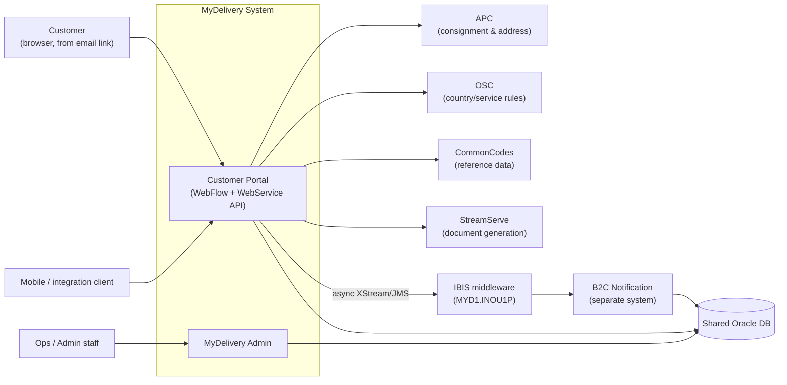
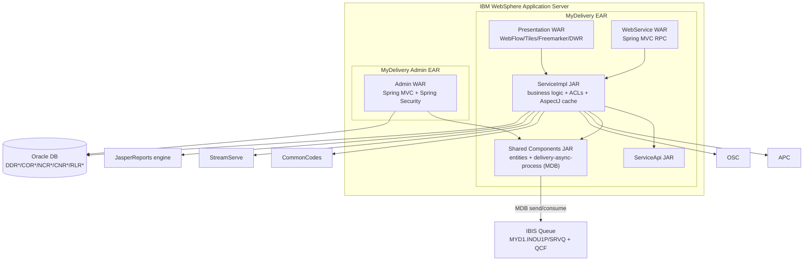
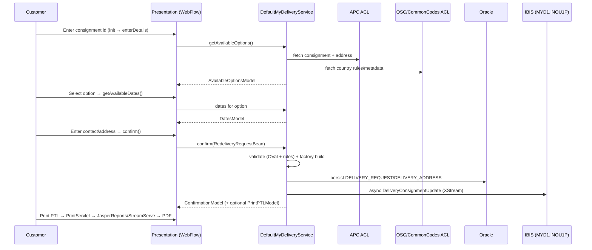
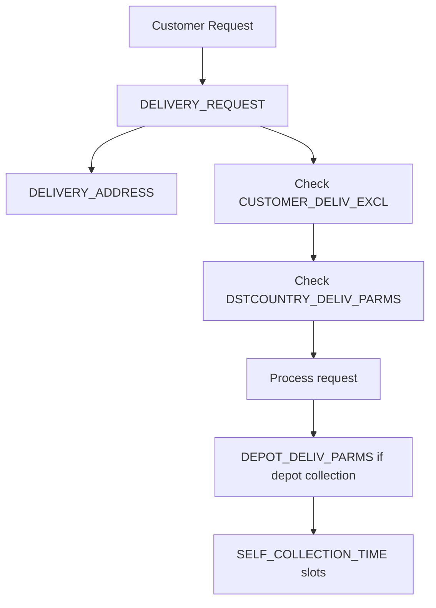
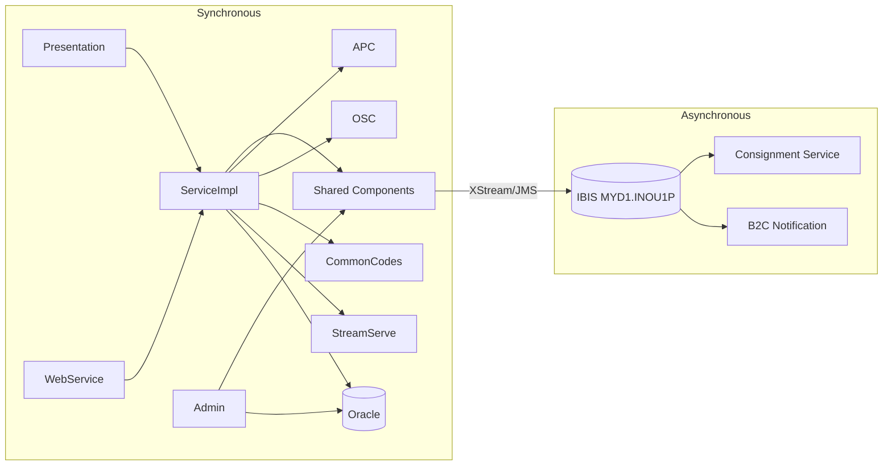

# MyDelivery — As-Is Documentation

> **Service:** MyDelivery (Customer Redelivery Self-Service Portal + MyDelivery Admin)
> **Owner (origin):** TNT Express (now FedEx) · Java package root `com.tnt.express.warp.mydelivery` · EAI `3532120`
> **Scope of this document:** Reverse-engineered current-state ("as-is") picture of the customer-facing redelivery portal and its internal admin application. The **B2C Notification** system and the **ACV** platform are documented separately; cross-dependencies to B2C are flagged here.
> **Grounding:** Derived from the `MyDelivery_B2C_Docs-main` documentation set. Where the source itself is inferential (the module docs state descriptions are "based on class naming, package context, and common Java EE / Spring patterns" where source was not fully inspected), that uncertainty is carried through with tags.

**Tag legend:** `[INFERRED]` = reasoned from indirect evidence · `[ASSUMPTION]` = filled-in gap, needs validation · `[UNKNOWN — needs confirmation]` = source is silent.

---

## 1.1 Executive Summary

**MyDelivery** is a customer-facing **parcel redelivery self-service portal**. When a delivery attempt fails (or a consignee wishes to change handling), the recipient enters a consignment reference and chooses an alternative: (re)deliver to the **original address**, deliver to an **alternative address**, **leave with a neighbour**, **leave in absence** at their own address, or **self-collect** from a TNT depot. It then confirms the request, optionally prints a PDF (a "Pending To Leave" / PTL form or a confirmation receipt), and hands off to downstream systems.

The portal is **not a single application** — it is a Maven multi-module Java EE codebase producing two deployable applications plus shared libraries, packaged as **EAR files and run on IBM WebSphere Application Server** `[INFERRED from ibm-application-bnd.xml]`:

1. **MyDelivery customer portal** — a **Spring WebFlow** wizard (Tiles + Freemarker/JSP views, DWR/Ajax for inline validation) *and* a parallel **Spring MVC "WebService"** module exposing REST-like RPC endpoints for mobile/integration clients.
2. **MyDelivery Admin** — an internal Spring MVC back-office for operations staff to manage country rules, depot data, self-collection times, and system parameters; secured with **Spring Security**.

The dominant technology is a **legacy pre-Java-17 stack** `[INFERRED: Java 6/7/8 language level]`: Spring WebFlow, Apache Tiles, Freemarker/JSP, **DWR (Direct Web Remoting)**, **OVal** validation (a pre-Jakarta-Validation library), **AspectJ** runtime-woven caching, `java.util.Date`/`SimpleDateFormat`, **Apache HttpClient**, **JasperReports + StreamServe** for PDF/document generation, **XStream + JMS/MDB** for async messaging over TNT's proprietary **IBIS** middleware, and **JAXB** for external XML contracts. Persistence is a **shared Oracle database** used jointly by MyDelivery, B2C, and the Track & Consignment / Customer / Common-Codes domains.

**Headline risks:** (1) multiple **end-of-life / unsupported frameworks** (Spring WebFlow, DWR, OVal, AspectJ weaving, StreamServe) with security and hiring exposure; (2) a **shared, undecomposed Oracle database** spanning seven business domains — the single largest coupling and the principal migration blocker; (3) **hidden/implicit coupling** to B2C and external systems (APC, OSC, CommonCodes, StreamServe) via a shared DB and IBIS queues; (4) **WebSphere + IBIS + Control-M + StreamServe licensing and platform lock-in**; (5) thread-safety hazards from shared `SimpleDateFormat`. **The single biggest obstacle to modernization is the shared Oracle database and the implicit data-level coupling between MyDelivery, B2C, and the tracking/customer domains** — no service can be cleanly extracted until data ownership is decomposed.

---

## 1.2 Module / Deployable Inventory

MyDelivery is a multi-module Maven build. The table treats each module as a "service/component."

| Module | Purpose | Language/Runtime | Type | Data store(s) | Upstream (callers) | Downstream (deps) | Ownership | Criticality | Doc quality |
|--------|---------|------------------|------|---------------|--------------------|-------------------|-----------|-------------|-------------|
| **MyDeliveryPresentation** | Customer wizard UI: WebFlow states, decorators, Tiles/Freemarker views, DWR remote validation, print servlets | Java `[UNKNOWN ver]`, Spring WebFlow, Tiles, Freemarker, JSP, DWR | Web app (WAR) | Session; via ServiceImpl → Oracle | Customers (browser) | ServiceImpl, ServiceApi | MyDelivery team | **Critical** | Medium (inferential) |
| **MyDeliveryWebService** | REST-like RPC API for mobile/integration clients | Spring MVC | Web app (WAR) | via ServiceImpl | Mobile/integration clients | ServiceImpl, ServiceApi | MyDelivery team | **Critical** | Medium |
| **MyDeliveryServiceImpl** | Core business logic: option computation, date availability, validation orchestration, ACLs, reporting, caching aspect, HTTP client | Java, Spring, AspectJ, Apache HttpClient, JasperReports | Library (JAR) | Oracle (via ACLs/DAO), external systems | Presentation, WebService | APC, OSC, CommonCodes, StreamServe, Oracle, IBIS (async) | MyDelivery team | **Critical** | Medium |
| **MyDeliveryServiceApi** | Interfaces, enums, model contracts, validators, email data contracts, utilities | Java | Library (JAR) | — | Impl, WebService, Presentation | — | MyDelivery team | High | Medium |
| **MyDelivery Admin** (`MyDeliveryAdminPresentation`, `…ApplicationLayer`, `…CrossDependencies`, `…Config`, `…EAR`) | Back-office config: country rules, depots, self-collection times, system parameters; planned-delivery printing | Spring MVC, Spring Security, JSP/Tiles | Web app (EAR) | Oracle (config tables) | Ops staff (browser) | Shared components, ACLs | Ops/Admin team `[ASSUMPTION]` | High | Low (naming-based) |
| **Shared Components** (`eai-3532120-mydelivery-components`: `entity-api/impl`, `service-api/impl`, `delivery-domain-properties`, `delivery-async-process`, `delivery-domain-enquiry`, `MDLocationService`) | Reusable domain entities, shared services, **JMS async processing (IBIS)**, location/geocoding | Java, Spring, JMS/MDB, XStream | Library (JARs) | Oracle, IBIS queue `MYD1.INOU1P` | MyDelivery, Admin, B2C | Oracle, IBIS, Consignment Service | Platform team `[ASSUMPTION]` | **Critical** (shared) | Low–Medium |
| **MyDeliveryProperties** | Environment property assembly + install scripts | Properties, Python assembly scripts | Config artifact | — | Build/deploy | — | MyDelivery team | Medium | Low |
| **MyDeliveryEAR** | Aggregates WARs/JARs into a WebSphere EAR with `application.xml` + `ibm-application-bnd.xml` | Maven `ear` | Deployable | — | — | WebSphere | MyDelivery team | High | Low |
| **MyDeliveryParent / CrossDependencies / Assembly** | Parent POM (dependency/version mgmt), cross-cutting stubs, deploy scripts (`deploy.py`, `dvnDeploy.py`, `start.py`, `deployconfig.xml`) | Maven, Python | Build/deploy | — | — | — | MyDelivery team | Medium | Low |

> **Note on the ACL layer:** `MyDeliveryServiceImpl` contains an Anti-Corruption Layer (`service.acl.*`) that wraps four external systems — **APC** (consignment & address data), **OSC** (operational service capabilities / country rules), **CommonCodes** (reference data), and **StreamServe** (document generation). These are integration adapters, not deployables, but are central to the runtime dependency graph.

---

## 1.3 Per-Module Deep Dive

### 1.3.1 MyDeliveryPresentation (Customer Wizard UI)

- **Purpose & responsibilities:** Render and drive the step-by-step redelivery wizard; bind and pre-validate form input; expose DWR remote endpoints for inline phone/address checks; stream print output. **Not responsible for** core business rules (delegated to ServiceImpl) or persistence.
- **Tech stack & versions:** Spring WebFlow (state machine in `redelivery-flow.xml`), Apache Tiles (`SpringTilesConfigurer`, `ExtTilesView`, `ExtUrlBasedViewResolver`), Freemarker + JSP, **DWR** (`DwrPhoneValidation`, `GlobalAddress`, `GlobalAddressResults`). `[UNKNOWN — needs confirmation]` exact framework versions. **EOL status:** Spring WebFlow is in maintenance-only; **DWR is effectively abandoned** (last release ~2011) — a significant risk.
- **Runtime & deployment:** WAR inside the MyDelivery EAR on **WebSphere** `[INFERRED]`; scaling model `[UNKNOWN]` (likely horizontal behind a load balancer, sticky sessions due to WebFlow server-side state).
- **Interfaces exposed:** HTTP pages via WebFlow (`/flow/redelivery.html`); legacy servlets — `SetupAppServlet` (startup warm-up, UTC timezone), `PrintMyDeliveryPTLFormServlet`, `PrintMyDeliveryConfirmationDetailsServlet` (both stream `application/pdf`); DWR Ajax endpoints for phone/address.
- **Interfaces consumed:** `MyDeliveryService` (ServiceImpl); address-enquiry API (`AddressDTO`, `AddressSearchCriteria`, `AddressSearchResult`) for autocomplete.
- **State & concurrency:** **Stateful** — WebFlow holds wizard state in server-side flow scope/HTTP session (implies session affinity / sticky load balancing). `DateConverter`/`SimpleDateFormat` usage is **not thread-safe** `[INFERRED]`.
- **Config & secrets:** Property files assembled by `MyDeliveryProperties`; `[UNKNOWN]` secret handling — likely plaintext property placeholders.
- **Scheduled/batch/async:** `SetupAppServlet` runs cache warm-up on startup. Async publishing to IBIS is via Shared Components (below).
- **NFRs observed:** `[UNKNOWN]` throughput/latency targets. Caching aspect reduces external round-trips.
- **Known issues / fragile areas:** DWR abandonment; WebFlow XML complexity; Tiles+Freemarker+JSP mixture; sticky-session requirement limits elastic scaling; thread-unsafe date formatting.

### 1.3.2 MyDeliveryWebService (Programmatic API)

- **Purpose:** Expose MyDelivery operations to mobile/integration clients as REST-like RPC. **Not responsible for** UI rendering.
- **Tech:** Spring MVC controllers (`MyDeliveryWebServiceBase`, `MyDeliveryWebService`); request/response Value Objects (`*ParamVO`, `*ResultVO`); OVal `@NotNull` on required fields; Apache Commons Lang builders for equals/hashCode/toString. Serialization "likely JSON though original stack may default to XML" `[per source]`.
- **Endpoints (verified from API response docs):** `POST /isConsignmentRedeliverable/`, `POST /getConsignmentDetails/`, `POST /getAvailableOptions/`, `POST /getAvailableDates/`, `GET /checkPhoneNumbers/`, `POST /confirm/` (original address & self-collection variants), `POST /getAlternativeAddressAvailableDates/`, `POST /confirmAlternativeAddress/`, `GET /getAddressForPrefill/`, `POST /confirmLeaveWithNeighbour/`, plus phone-prefix / locale-data / country-selection lookups. Consistent envelope: `{ success, errors[], warnings[], data }`.
- **Interfaces consumed:** `MyDeliveryService`; `ConsignmentIdCryptor` to decrypt inbound consignment ids.
- **State & concurrency:** **Stateless per request** (unlike the WebFlow UI) — a good extraction candidate.
- **Known issues:** Ambiguous serialization format; no explicit API versioning observed `[UNKNOWN]`; validation split between VO annotations and service layer.

### 1.3.3 MyDeliveryServiceImpl (Core Business Logic)

- **Purpose:** The heart of MyDelivery. `DefaultMyDeliveryService` (extending `DefaultMyDeliveryServiceBase`) orchestrates: input sanitation → consignment retrieval (APC) → country metadata (OSC/CommonCodes) → permissible-option computation (`DefaultRedeliveryConsignmentHelper`) → date availability per option → validation → immutable `RedeliveryRequest` construction (`DefaultRedeliveryRequestFactory`) → confirmation model + optional email/print.
- **Sub-packages:** `model.impl` (POJO models), `service` (façade), `service.acl.*` (APC/OSC/CommonCodes/StreamServe adapters), `service.aspectj` (`Caching`), `service.helper` (`LocaleHelper`, `PtlFormDataCreator`, `ValidationHelper`), `service.http` (`HttpConfig`, `HttpProcessor` over Apache HttpClient), `service.integration` (mutable assembly aggregates), `service.reports` (JasperReports assembly), `service.acl.streamserve.request` (JAXB request/response).
- **Tech / EOL:** **AspectJ** runtime weaving for caching (EOL-adjacent pattern); **OVal** annotations (`net.sf.oval`) on models; `SimpleDateFormat` (thread-unsafe); Apache HttpClient (legacy versions likely). **JasperReports + StreamServe** for documents.
- **Data owned:** Reads/writes MyDelivery domain tables via DAOs/services (see §1.5). Uses `ReflectionToStringBuilder` for logging.
- **State & concurrency:** Services are singletons; **mutable shared formatters are a concurrency risk** `[INFERRED]`. Caching aspect wraps read-only lookups (country metadata, code lists).
- **Async behavior:** Delegates async consignment updates / notifications to Shared Components' IBIS sender.
- **Known issues / fragile areas:** External contract fragility (ACLs marshalling XML to APC/OSC/StreamServe); tight coupling of reporting to StreamServe XML; caching via AspectJ complicates observability; heavy reliance on external systems in the synchronous request path.

### 1.3.4 MyDeliveryServiceApi (Contracts)

- **Purpose:** Shared interfaces/enums/models/validators consumed across modules. Key contracts: `MyDeliveryService` (façade), `RedeliveryOption` (enum: ORIGINAL_ADDRESS, ALTERNATIVE_ADDRESS, NEIGHBOUR, SELF_COLLECTION, LEAVE_IN_ABSENCE…), `RedeliveryRequest`/`RedeliveryRequestBean`/`RedeliveryRequestFactory`, `ConsignmentDetails`, `AvailableOptionsModel`, `DatesModel`, `ViolationsModel`, `SelfCollectionDepotInformation`, `PtlFormData`, ACL interfaces (`APCAcl`, `OSCAcl`, `StreamServeAcl`), validation core (`ValidationResult`, `MyDeliveryRuleViolation`, `Severity`, `FieldLengthConstants`, `IEnumErrorCode`), custom annotations (`@NotNullOrEmpty`, `@IsValidEmail`), and email data contracts per option.
- **State:** Pure API module. **Migration relevance:** a clean seam — records/sealed types could replace many of these.

### 1.3.5 MyDelivery Admin (Back-Office)

- **Purpose:** Internal CRUD/configuration app. Toggle option availability per country, manage postcode rules, depot addresses/opening hours/capacity windows, view & print planned deliveries, inspect recent requests.
- **Tech:** Spring MVC (`DispatcherServlet` mapped `/*`), JSP/Tiles, **Spring Security** via `DelegatingFilterProxy` (`springSecurityFilterChain`) + custom `SpringSecurityHolderSessionStrategy`; HTTP compression filter; Log4j listener; `PrintPlannedDeliveryDetailsServlet`. Java EE 2.4-style `web.xml`.
- **Interfaces:** Server-rendered admin pages; consumes shared components & ACLs; writes config tables (`SYSTEM_PARAMETERS`, `DEPOT_DELIV_PARMS`, `SELF_COLLECTION_TIME`, `DSTCOUNTRY_DELIV_PARMS`, `CUSTOMER_DELIV_EXCL`) via `MyDeliveryAdminFacade`.
- **Security:** The **only MyDelivery component with real authentication** (staff login). The customer portal relies on consignment-id knowledge (+ `ConsignmentIdCryptor`), **not** user auth `[INFERRED]`.
- **State & concurrency:** Session-based auth; CRUD flows.
- **Known issues:** XML-heavy config; coarse security model `[UNKNOWN roles]`; docs are naming-based (lowest confidence).

### 1.3.6 Shared Components (`eai-3532120-mydelivery-components`)

- **Purpose:** Prevent duplication across MyDelivery/Admin/B2C. Contains domain entities (`entity-api/impl`: Consignment, Depot, Location), shared services (`service-api/impl`), **`delivery-async-process`** (the MyDelivery IBIS integration), `delivery-domain-enquiry` (aggregated reads), `MDLocationService` (geocoding/depot resolution).
- **IBIS async (critical):** `DeliveryAsyncMessageSender` publishes **XStream-serialized XML** to JMS queue `IBIS/MYD1.INOU1P/SRVQ` (connection factory `IBIS/MYD1.INOU1P/QCF`, JNDI-looked-up). `DeliveryAsyncMessageProcessorMDB` (a **Message-Driven Bean**) consumes, deserializes via XStream, and routes to `ConsignmentUpdater` (→ Consignment Service) or `DeliveryNotificationSender`. Message types: `DeliveryConsignmentUpdate`, `DeliveryNotificationBean`, enveloped by `AsyncMessageWrapper`/`AsyncMessageSelector`. Container-managed (XA) transactions. Error handling: JMS exceptions wrapped in `RuntimeException`; resource cleanup in `finally`.
- **Known issues:** **Shared library coupling** — a change forces redeploys of all three apps; MDB + IBIS + WebSphere JMS lock-in; XStream deserialization is a known security-sensitive pattern `[INFERRED]`.

### 1.3.7 Cross-cutting: Configuration, Secrets, Packaging

- **Config:** `.properties` files per environment assembled by `MyDeliveryProperties`; Maven filtering injects build props. `SYSTEM_PARAMETERS` (DB) holds runtime-tunable parameters read by `DefaultMyDeliveryServiceBase`.
- **Secrets:** `[UNKNOWN — needs confirmation]` — docs recommend externalizing to env vars/vault but current state appears to be **placeholders in property files** (`Assembly/PlaceholderFiles`). Treat as a risk.
- **Packaging/deploy:** EAR with `application.xml` + `ibm-application-bnd.xml`; Python scripts (`deploy.py`, `dvnDeploy.py`, `start.py`) orchestrate distribution/start; `deployconfig.xml` holds targets/hosts/credential placeholders.

---

## 1.4 System Context & Architecture Diagrams

### Context diagram



### Container diagram



### Sequence — Redelivery confirmation (customer wizard)



### Sequence — Admin depot update

```mermaid
sequenceDiagram
    participant A as Ops staff
    participant ADM as Admin (Spring MVC + Security)
    participant F as MyDeliveryAdminFacade
    participant DB as Oracle
    A->>ADM: Login (Spring Security)
    A->>ADM: Edit depot form
    ADM->>F: load depot model
    F->>DB: read DEPOT_DELIV_PARMS / SELF_COLLECTION_TIME
    A->>ADM: Submit changes (field-length validation)
    ADM->>F: persist depot
    F->>DB: update rows; invalidate caches
    ADM-->>A: success (optional audit record)
```

---

## 1.5 Data Architecture

- **Engine:** **Oracle Database** `[per source]`; version `[UNKNOWN]`. Accessed from MyDelivery via DAOs/ACLs; from Admin via facade; from B2C via batch readers.
- **Shared database (primary blocker):** A **single Oracle schema (32+ tables across 7 domains)** is shared by MyDelivery, B2C Notification, Track & Consignment, Customer Identification, Common Codes, Spring Batch, and Location. MyDelivery **owns** the MyDelivery domain but **reads across** Customer/Consignment/Common-Codes.
- **Audit pattern:** All tables carry soft-delete, update-tracking, and timestamp columns; `DDL_LOG` tracks schema changes; `SYSTEM_PARAMETERS` is a view over physical config.

**MyDelivery domain tables (8):**

| Logical name | Physical | Purpose | Volume |
|---|---|---|---|
| DELIVERY_REQUEST | DDRRRT01 | Customer redelivery requests (status `DDR_STATUS`, `DDR_UPDT_TD`) | Medium (thousands) |
| DELIVERY_ADDRESS | DDRDAT01 | Alternative delivery addresses | Medium |
| CUSTOMER_DELIV_EXCL | DDRDXT01 | Customer delivery exclusions/restrictions | Low (read-heavy) |
| DEPOT_DELIV_PARMS | DDRDPT01 | Depot config (settings, email) | Low (config) |
| DSTCOUNTRY_DELIV_PARMS | DDRCPT01 | Country delivery rules/windows | Low (config) |
| SELF_COLLECTION_TIME | DDRSCT01 | Depot collection hours | Low (config) |
| SYSTEM_PARAMETERS | DDRSPT01 | Global key-value config | Low (cache-friendly) |
| DDL_LOG | DDL_LOG | Schema change tracking | Low |

**Cross-domain tables MyDelivery reads (not owned):** Customer Identification `CNRCUV01/CNRACV01`; Track & Consignment `CORCOV01/CORCSV01/CORCNV01`; Common Codes `NCRBLV01/NCRBSV01/NCRBHV02/NCRSDV01/NCRQSV01/NCRQUV01/NCRQLV01`; Location `RLRLOV01`. (The `CORE*V01` alert tables are **B2C-owned** — see the B2C document.)

**Data flows (MyDelivery):**



- **Ownership & sharing (flagged):** MyDelivery config tables are written by **both** the Admin app and (indirectly) read by the customer portal. Reference/consignment/customer tables are **owned elsewhere but read synchronously** by MyDelivery — a hard coupling with no API boundary.
- **ETL / reporting:** Control-M jobs operate on consignment views `CORZDV01/CORZPV01` `[per source; shared with tracking]`.

---

## 1.6 Dependency & Integration Map



**Explicit callouts:**
- **Spider-in-the-web:** `DefaultMyDeliveryService` (ServiceImpl) — every flow funnels through it; also the largest concentration of external calls.
- **Single points of failure:** the **shared Oracle DB**; the **IBIS queue `MYD1.INOU1P`**; **WebSphere**; **StreamServe** for print.
- **Hidden / implicit coupling:** MyDelivery ↔ B2C via **shared DB tables** and **IBIS** (no explicit API); MyDelivery ↔ tracking/customer domains via **direct cross-schema reads**.
- **Circular risk:** IBIS status round-trips (MyDelivery → Consignment Service → status change → B2C → back to Consignment Service) create an event loop that spans systems `[INFERRED]`.
- **Undocumented:** Control-M jobs touching `CORZDV01/CORZPV01`; startup warm-up in `SetupAppServlet`.

---

## 1.7 Non-Functional Characteristics

| Attribute | As-is observation |
|---|---|
| **Availability / SLA** | `[UNKNOWN]` — no SLA documented; single shared DB and IBIS are availability chokepoints. |
| **Performance / scale** | AspectJ caching of country metadata/code lists reduces external calls; **sticky sessions** (WebFlow server state) constrain horizontal scaling; external APC/OSC/StreamServe calls sit in the synchronous path. `[UNKNOWN]` latency targets. |
| **Security posture** | Customer portal has **no user authentication** — relies on consignment-id knowledge + `ConsignmentIdCryptor` (custom crypto — a concern). Admin uses Spring Security (roles `[UNKNOWN]`). Secrets likely in property placeholders. XSS/input validation present (OVal + UI validators) but ad hoc. XStream deserialization is security-sensitive. |
| **Compliance** | Handles PII (name, address, email, phone). `[UNKNOWN]` retention/GDPR posture; no field-level encryption evidenced. |
| **Known bottlenecks** | Shared DB contention with B2C's high-volume `CORE*` writes; StreamServe/JasperReports print path; synchronous external ACL calls. |

---

## 1.8 Operational Model

- **Build & deploy:** Maven multi-module (`mvn clean install`) → EARs → deployed to WebSphere via **Python scripts** (`deploy.py`, `dvnDeploy.py`, `start.py`) with `deployconfig.xml`. Environments DEV/TEST/PROD via property sets. `[UNKNOWN]` CI system.
- **Release cadence:** `[UNKNOWN]` — `src/changes/changes.xml` (Maven Changes plugin) tracks release notes; Maven Site for docs.
- **Observability:** **Log4j** logging (Presentation/Admin listeners); no metrics/traces evidenced. Monitoring appears **log-based only** — a gap.
- **On-call / runbooks:** `[UNKNOWN]`. Diagnostic SQL exists for stuck requests (`DDRRRT01` where `DDR_STATUS IN ('PROCESSING','PENDING')`).
- **Backup/DR:** Oracle-level `[UNKNOWN retention/RPO/RTO]`.
- **Pain points:** Manual/scripted deploys; XML-config sprawl; no unified telemetry; WebSphere/IBIS operational specialism required.

---

## 1.9 Risks, Tech Debt & Constraints Register

| ID | Item | Type | Impact | Migration relevance |
|----|------|------|--------|---------------------|
| MD-R1 | Shared Oracle DB across 7 domains | Constraint/Risk | High | **Primary blocker** — must decompose data ownership before clean extraction |
| MD-R2 | DWR (abandoned ~2011) for Ajax | Tech debt | High | Must be replaced (SPA) — security & support risk |
| MD-R3 | Spring WebFlow XML wizard + Tiles + Freemarker + JSP | Tech debt | High | Rebuild as SPA + REST; sticky-session removal |
| MD-R4 | OVal validation (pre-Jakarta) | Tech debt | Medium | Replace with Jakarta Bean Validation |
| MD-R5 | AspectJ runtime-woven caching | Tech debt | Medium | Replace with Spring Cache |
| MD-R6 | `SimpleDateFormat`/`Date` (thread-unsafe) | Risk | Medium | Migrate to `java.time` |
| MD-R7 | IBIS + JMS/MDB on WebSphere (proprietary, lock-in) | Constraint | High | Replace with cloud-native messaging |
| MD-R8 | StreamServe + JasperReports document generation | Tech debt/Constraint | Medium | Replace/ wrap PDF service |
| MD-R9 | `ConsignmentIdCryptor` custom crypto; no customer auth | Risk (security) | High | Replace with signed tokens; add auth/rate-limiting |
| MD-R10 | XStream deserialization of messages | Risk (security) | Medium | Replace serialization (JSON/Avro) |
| MD-R11 | Secrets in property placeholders | Risk (security) | High | Move to Secret Manager |
| MD-R12 | Pre-Java-17 language level; WebSphere runtime | Constraint | High | JDK upgrade + containerization |
| MD-R13 | No metrics/tracing (log-only) | Tech debt | Medium | Add observability stack |
| MD-R14 | Documentation is largely inferential | Risk (knowledge) | Medium | Validate via code before cutover |
| MD-R15 | Control-M batch dependencies (implicit) | Constraint | Medium | Re-platform scheduling |

---

## 1.10 Assumptions & Open Questions

**Tagged items:**
- `[ASSUMPTION]` App server is IBM WebSphere (from `ibm-application-bnd.xml`); could be tWAS/Liberty.
- `[ASSUMPTION]` Admin app is owned by an Ops team distinct from portal devs.
- `[INFERRED]` Customer portal has no user auth (consignment-id based).
- `[UNKNOWN]` Exact versions: JDK, Spring, WebFlow, DWR, HttpClient, Oracle, WebSphere.
- `[UNKNOWN]` API serialization (JSON vs XML) for WebService.
- `[UNKNOWN]` SLAs, throughput, latency, backup RPO/RTO, secret handling, Spring Security roles.

**Prioritized questions that would most change the plan:**
1. Can MyDelivery's data be **decomposed from the shared Oracle schema**, or must a new store sync with the legacy DB during transition?
2. What are the **peak volumes and latency SLAs** for the options/confirm endpoints and print path?
3. Is the **customer portal genuinely unauthenticated**, and is adding auth acceptable to the business?
4. Are **APC/OSC/CommonCodes/StreamServe** themselves being modernized, or must we keep their contracts?
5. What is the **serialization format** and are there external API consumers with frozen contracts?
6. Are **WebSphere, IBIS, Control-M, StreamServe** licenses a cost driver we must eliminate?
7. What **PII/retention/compliance** obligations apply (GDPR)?

---

## 1.11 Glossary

| Term | Meaning |
|------|---------|
| Consignment | A parcel shipment record (the unit being redelivered). |
| Redelivery Option | Customer choice: original/alternative address, neighbour, leave-in-absence, self-collection. |
| PTL | "Pending To Leave" form (printed PDF). |
| ACL | Anti-Corruption Layer — adapter isolating internal domain from external systems. |
| Decorator | WebFlow object preparing model/view for a wizard step. |
| APC / OSC / CommonCodes | External systems: consignment/address data / operational-service rules / reference data. |
| StreamServe | Document-composition product used for PDF generation. |
| IBIS | TNT's proprietary Integrated Business Information System messaging middleware. |
| MDB | Message-Driven Bean (JMS consumer). |
| DWR | Direct Web Remoting — legacy Java-to-JavaScript Ajax bridge. |
| OVal | Legacy Java validation library (pre Jakarta Bean Validation). |
| Control-M | Enterprise batch job scheduler. |
| EAR / WAR | Enterprise/Web application archive (Java EE packaging). |
| `DDR*` / `COR*` / `NCR*` / `CNR*` / `RLR*` | Oracle table prefixes: MyDelivery / Consignment+alerts / Common-codes / Customer / Location. |

---

*End of MyDelivery as-is documentation. See `02_MyDelivery_Migration_Plan.md` for the modernization plan.*
