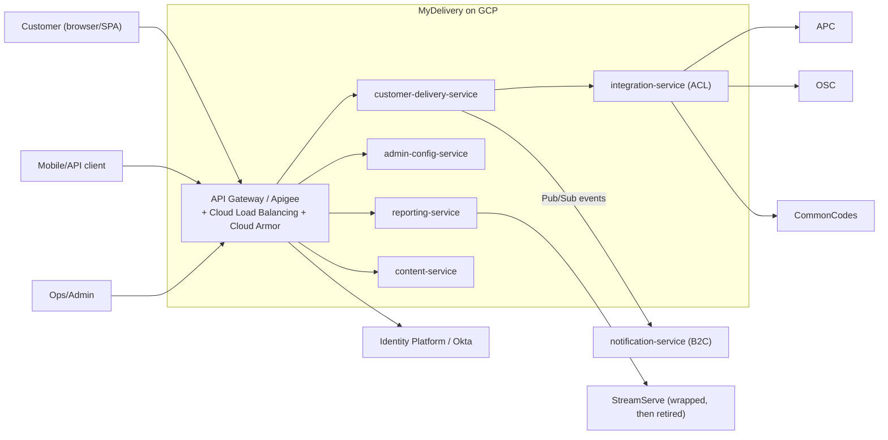
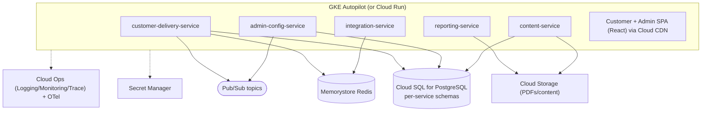
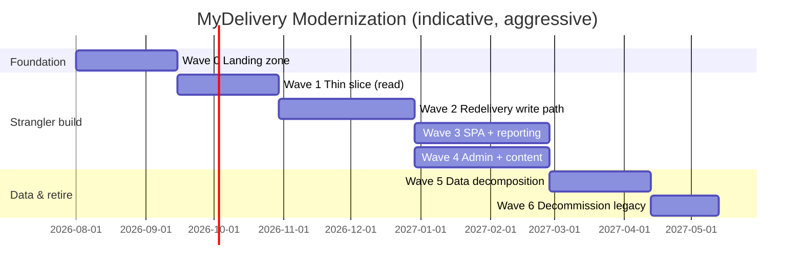

# MyDelivery — Modernization & Migration Plan

> **Target platform:** Google Cloud Platform (GCP)
> **Strategy bias:** Aggressive re-architecture (rebuild to cloud-native microservices), executed via a **Strangler Fig** with parallel-run to keep risk bounded on the shared-database seam.
> **Business drivers:** end-of-life tech · scalability & reliability · cost/TCO reduction · developer velocity.
> **Prerequisite:** the as-is picture in `01_MyDelivery_AsIs_Documentation.md`. This plan covers the **MyDelivery customer portal + Admin**; the **B2C** notification system is a coordinated, dependent migration (`../B2C/02_B2C_Migration_Plan.md`), and both share the **Shared Data Decomposition Program** (§2.6).

**Tag legend:** `[ASSUMPTION]` · `[UNKNOWN — needs confirmation]`. T-shirt effort: XS/S/M/L/XL.

---

## 2.1 Target Architecture

### Principles
Loose coupling & independent deployability · API-first (OpenAPI) + event-driven (Pub/Sub) · **database-per-service** (no shared schema) · stateless services · 12-factor/config-as-env · security-by-default (OIDC, Secret Manager, least privilege) · observability-by-default (OpenTelemetry) · resilience-by-default (retries, circuit breakers, DLQs).

### Target style & rationale
A **domain-oriented microservices platform on GCP**, decomposing MyDelivery's monolith along the bounded contexts already implied by the code (redelivery, admin-config, reporting, integration/ACL, content). This is the **NewUnifiedPlatformArchitecture** blueprint from the source docs, **re-targeted from its original AWS/Kafka/Keycloak flavor to GCP-native services**.

- **Alternatives considered:** (a) *Rehost WebSphere→Compute Engine* — rejected: keeps every EOL framework and lock-in, no driver satisfied. (b) *Replatform to Spring Boot 3 monolith on Cloud Run* — viable interim but rejected as the end state because it doesn't resolve the shared DB or the WebFlow/DWR UI; retained only as a **safety net for low-value paths**. (c) *Aggressive re-architecture* — **chosen**, matches the stated risk appetite and unlocks all four drivers.

### Target-state — Context

### Target-state — Container (GCP-native)

### Technology choices (per layer)

| Layer | Choice | One-line justification | Rejected alternative |
|-------|--------|------------------------|----------------------|
| Compute | **GKE Autopilot** (Cloud Run for stateless/bursty) | Managed K8s, HPA, no node ops | Self-managed GKE Standard (more ops) |
| API edge | **Apigee / API Gateway + Cloud Load Balancing + Cloud Armor** | Auth, rate-limit, WAF, routing for strangler | Ingress-only (no API mgmt) |
| Data | **Cloud SQL for PostgreSQL** (per-service) | Managed, drops Oracle license, `database-per-service` | AlloyDB (cost) / Oracle-on-GCP (keeps lock-in) |
| Cache | **Memorystore for Redis** | Managed, replaces AspectJ cache | Self-hosted Redis |
| Messaging | **Pub/Sub** (+ dead-letter topics) | Serverless, replaces IBIS/JMS | Kafka on GKE (ops heavy) |
| Object store | **Cloud Storage** | PDFs, content assets, retention policies | Filestore (not object) |
| Identity | **Identity Platform** (or retain Okta) | OIDC/PKCE + service JWTs; adds customer auth | Custom auth (risk) |
| Secrets | **Secret Manager** | Removes property-file secrets | Config-only (insecure) |
| CI/CD | **Cloud Build + Artifact Registry + Cloud Deploy** | Native, progressive delivery | Jenkins (legacy) |
| IaC | **Terraform** (GCP provider) | Reproducible, team-portable | Deployment Manager (deprecated-ish) |
| Observability | **Cloud Ops + OpenTelemetry** (keep Dynatrace if licensed) | Metrics/traces/logs by default | Log-only (current gap) |
| PDF | **OpenPDF / FlyingSaucer (Thymeleaf→PDF)** in reporting-service | Removes StreamServe license | Keep StreamServe (lock-in) |

### Cross-cutting
- **AuthN/Z:** OIDC (PKCE) for UI; service-to-service JWT (workload identity); RBAC scopes (`customer.redelivery.create`, `admin.rules.write`); **add customer authentication/rate-limiting** (replaces consignment-id-only access).
- **Config/secrets:** env + Secret Manager; per-env values in Git (non-secret).
- **API compat:** versioned (`/v1`), RFC 7807 `problem+json`; contract tests.
- **Resilience:** Resilience4j retries/circuit breakers around ACL calls; Pub/Sub DLQs.

### Architecture Decision Records (abridged)

| ADR | Context | Decision | Consequences |
|-----|---------|----------|--------------|
| ADR-1 | Shared Oracle DB blocks extraction | Adopt **database-per-service** on Cloud SQL; sync via CDC during transition | Enables independence; adds temporary dual-run complexity |
| ADR-2 | WebFlow/DWR EOL | **Rebuild UI as React SPA + REST**, wizard state client-side | Removes sticky sessions; parallel-run needed for parity |
| ADR-3 | IBIS/JMS lock-in | Replace with **Pub/Sub** + DLQ | Cloud-native async; anti-corruption bridge during cutover |
| ADR-4 | StreamServe/Jasper cost | **reporting-service** with OpenPDF/FlyingSaucer | Removes license; template re-authoring effort |
| ADR-5 | No customer auth | Add **Identity Platform** OIDC + Cloud Armor | Stronger security; UX change to validate |
| ADR-6 | Aggressive appetite vs data risk | **Strangler Fig + parallel-run**, not big-bang | Bounded blast radius on the DB seam |
| ADR-7 | Compute model | GKE Autopilot baseline; Cloud Run for stateless engines | Simpler ops; consistent platform with B2C/ACV |

---

## 2.2 Gap Analysis

| Capability / Component | As-Is | To-Be | Gap | Effort | Risk |
|---|---|---|---|---|---|
| UI | WebFlow + Tiles + Freemarker + DWR | React SPA + REST | Full rebuild | XL | High |
| Redelivery logic | `DefaultMyDeliveryService` monolith | customer-delivery-service | Extract + re-implement rules with parity tests | L | High |
| Admin config | Spring MVC + shared DB | admin-config-service (versioned, effective-dated) | Rebuild + data model | L | Medium |
| Validation | OVal + custom | Jakarta Bean Validation | Re-annotate | M | Low |
| Caching | AspectJ weaving | Spring Cache + Memorystore | Replace | S | Low |
| Dates | `SimpleDateFormat` | `java.time` | Mechanical | S | Low |
| Messaging | IBIS/JMS (`MYD1.INOU1P`) | Pub/Sub + DLQ | Re-plumb + bridge | L | High |
| Reporting | StreamServe + Jasper | OpenPDF/FlyingSaucer | Template re-author | M | Medium |
| Persistence | Shared Oracle | Cloud SQL per-service | **Decompose + migrate** | XL | High |
| External systems | ACL in Impl | integration-service + Resilience4j | Extract clients | M | Medium |
| AuthN | none (customer) / Spring Security (admin) | Identity Platform OIDC + RBAC | Add auth | M | Medium |
| Runtime | WebSphere EAR | GKE/Cloud Run containers | Containerize | L | Medium |
| CI/CD | Python scripts | Cloud Build + Cloud Deploy | Build pipeline | M | Low |
| Observability | Log4j only | Cloud Ops + OTel | Instrument | M | Low |

---

## 2.3 Migration Strategy (6 R's, per component)

| Component | 6R | Rationale |
|-----------|----|-----------|
| Customer portal UI (WebFlow/DWR) | **Rebuild** | Frameworks EOL; SPA is the target |
| WebService REST API | **Re-architect** | Stateless; re-implement as customer-delivery-service (parity harness) |
| Core business logic (option/date rules) | **Re-architect** (rebuild rules with shadow diff) | Preserve behavior; modern code |
| Admin app | **Rebuild** | CRUD → admin-config-service + SPA |
| Shared Components (IBIS async) | **Replace** | Pub/Sub replaces IBIS/JMS |
| Reporting (StreamServe/Jasper) | **Replace** | OpenPDF/FlyingSaucer; retire StreamServe |
| External ACLs (APC/OSC/CommonCodes) | **Replatform/Refactor** | Wrap as integration-service clients (contracts preserved) |
| Content (CQ/AEM fragments) `[INFERRED]` | **Rebuild** | content-service headless CMS |
| Oracle DB | **Re-architect data** | Decompose to Cloud SQL per service (CDC + backfill) |
| Property/EAR/Assembly | **Retire** | Replaced by Helm/Cloud Deploy + Secret Manager |

**Overall pattern — Strangler Fig with parallel-run:** an **API Gateway façade** routes each capability to legacy or new; an **anti-corruption bridge** relays IBIS↔Pub/Sub and Oracle↔Cloud SQL during transition; **feature flags** gate SPA rollout; **shadow traffic** compares new vs legacy responses before shifting.

**Why not big-bang:** the shared Oracle DB holds millions of rows and is jointly written by B2C and tracking; a big-bang cutover cannot guarantee data parity or safe rollback. Aggressive **build** velocity is retained, but **cutover** is incremental and reversible.

---

## 2.4 Migration Waves (dependency-aware)

| Wave | Goal | Includes | Entry criteria | Exit criteria | Value |
|------|------|----------|----------------|---------------|-------|
| **0 — Foundation** | Landing zone | GCP project/VPC, GKE, Cloud SQL, Pub/Sub, Secret Manager, CI/CD, gateway, observability, Identity Platform | Approvals, network to on-prem/APC | Hello-world service deploys through pipeline with auth+telemetry | Platform ready |
| **1 — Thin slice (read-only)** | Prove pattern | `integration-service` (APC/OSC read) + `customer-delivery-service` **GET /consignments**, **/options** behind gateway, shadow-compared to legacy | Wave 0 done | Parity ≥ target on read endpoints; no write | Lowest-risk learning |
| **2 — Redelivery write path** | Core capability | customer-delivery-service **POST /redelivery-requests**, dates, confirmation; Pub/Sub events; CDC sync to Oracle | Wave 1 parity | Canary writes reconcile with legacy; rollback proven | Customer value |
| **3 — SPA + reporting** | UI + PDFs | React customer SPA (feature-flagged), reporting-service PDFs (retire StreamServe path) | Wave 2 stable | A/B parity; PDF parity | Removes WebFlow/DWR/StreamServe |
| **4 — Admin + content** | Back-office | admin-config-service + Admin SPA + content-service; migrate rules/depot/params | Wave 2 data model | Admin parity; dual-write ends | Removes Admin EAR |
| **5 — Data decomposition complete** | DB ownership | Cut MyDelivery reads/writes fully to Cloud SQL; sever shared-Oracle dependency (coordinate with B2C) | Waves 2–4 | MyDelivery no longer touches Oracle | Unblocks decommission |
| **6 — Decommission** | Retire legacy | Turn off WebSphere EARs, IBIS `MYD1.INOU1P`, StreamServe; archive | Wave 5 | Legacy dark; archived | Cost/TCO realized |

**Thin-slice first migration:** `integration-service` + read-only `GET /consignments`/`/options` — no writes, no data migration, exercises gateway/auth/observability/CDC-read, and produces the shadow-diff harness reused everywhere.

---

## 2.5 Per-Service Migration Playbooks

**customer-delivery-service (representative):**
1. **Pre-work:** OpenAPI from WebService endpoints; codify option/date rules as executable spec; stand up shadow-diff harness.
2. **Parallel build:** implement on GKE; CDC read replica of Oracle → Cloud SQL for reads; Pub/Sub `redelivery.request.created/confirmed`.
3. **Traffic shift:** gateway shadow (0% live) → canary 5%→25%→50%→100% on reads, then writes with dual-write + reconciliation.
4. **Validation:** response diff < tolerance; write reconciliation 100%; latency/error SLOs met.
5. **Rollback trigger:** error rate >2% over 5 min, p99 > 2× baseline, or any data-parity mismatch on writes → gateway routes back to legacy; dual-write halts; Pub/Sub events quarantined.
6. **Old-path retirement:** after 2 stable weeks at 100%, disable legacy route.

**reporting-service:** re-author PTL/confirmation templates → generate via OpenPDF → byte/visual diff vs Jasper/StreamServe → shift print endpoints → retire StreamServe ACL. **Rollback:** route print back to legacy servlet.

**admin-config-service:** dual-write config (Oracle + Cloud SQL) → verify → switch reads → stop dual-write. **Rollback:** reads back to Oracle.

**integration-service:** wrap APC/OSC/CommonCodes as Resilience4j clients; contract tests with WireMock. **Rollback:** feature-flag back to in-monolith ACL.

---

## 2.6 Data Migration Strategy — Shared Data Decomposition Program (first-class, shared with B2C)

- **Approach:** **CDC (Datastream from Oracle) + backfill/tail**. Datastream streams Oracle changes into a landing set; per-service transformers write into each service's Cloud SQL schema (snake→domain naming, constraints enforced).
- **Ownership split:** MyDelivery `DDR*` config/request tables → customer-delivery + admin-config schemas. B2C `CORE*` → notification schema (B2C plan). Tracking/customer/common-codes remain source-of-truth **behind integration-service APIs/events** (not copied wholesale).
- **Consistency & reconciliation:** dual-write during Waves 2–4 with a **reconciliation job** (row counts + checksums per entity per window); drift dashboard; block cutover until drift = 0 for N days.
- **Shared-DB handling:** because Oracle is co-written by B2C and tracking, MyDelivery **cannot drop Oracle until B2C also decomposes** — sequenced in the joint program; a temporary **bidirectional sync** (Cloud SQL↔Oracle via Datastream + reverse ETL) maintains the legacy until Wave 5.
- **Data rollback (hardest):** keep Oracle authoritative until Wave 5; new writes dual-written and reversible; a **reverse-sync** replays Cloud SQL deltas back to Oracle so rollback loses nothing. In-flight IBIS/Pub/Sub messages idempotency-keyed to avoid double-apply.

---

## 2.7 Cutover & Rollback

- **Per-wave cutover runbook:** dress rehearsal in test with prod-shaped data (Delphix-style masked) → freeze window → go/no-go checklist (parity, reconciliation=0, SLO dashboards green, DLQ empty, on-call staffed) → canary ramp → observe → confirm.
- **Rollback plan (per wave):** concrete triggers — error rate >2%/5min, p99 latency >2× baseline, data-parity mismatch, DLQ growth >threshold. **Time-to-rollback target: < 15 min** (gateway route flip + halt dual-write). Rollback rehearsed in Wave 1.
- **Comms:** change ticket, stakeholder notice, status channel, customer-facing fallback (legacy remains live behind the flag).

---

## 2.8 Testing & Validation

- **Functional parity:** golden-set of consignments/countries; option-eligibility & date-window edge cases (holidays, cut-offs, postcode rules).
- **Contract tests:** PACT for REST; JSON-schema for Pub/Sub events.
- **Parallel-run / shadow diffing:** mirror live reads to new service; diff responses; alert on divergence.
- **Non-functional:** load/soak on options/confirm; PDF-generation throughput.
- **Security:** authz tests on new customer auth; input-validation/OWASP; DAST via Cloud Web Security Scanner.
- **Chaos:** fault-inject APC/OSC latency; Pub/Sub DLQ exercises before write cutover.

---

## 2.9 Observability & Operational Readiness

- **SLIs/SLOs:** availability (gateway + customer-delivery ≥ 99.9% `[ASSUMPTION]`), p99 options < 300 ms (warm cache), confirm success rate, PDF-gen error rate, event lag.
- **Dashboards/alerts first:** gateway 5xx, service latency, Pub/Sub backlog/DLQ, Cloud SQL connections, reconciliation drift.
- **Standards:** OpenTelemetry traces (gateway→service→DB); structured JSON logs with correlation id.
- **Production-readiness checklist (per service):** SLOs defined, dashboards+alerts, runbook, load-tested, security-reviewed, rollback rehearsed, DLQ wired, secrets in Secret Manager.

---

## 2.10 Risk Register

| ID | Risk | Likelihood | Impact | Mitigation | Contingency | Owner |
|----|------|-----------|--------|------------|-------------|-------|
| M-1 | Shared-DB decomposition drift | High | High | Reconciliation job + bidirectional sync; block cutover on drift | Reverse-sync rollback | Data lead |
| M-2 | Business-rule parity gaps (undocumented rules) | High | High | Shadow diff + golden sets before shift | Keep legacy live behind flag | Eng lead |
| M-3 | APC/OSC/StreamServe contract surprises | Medium | High | Contract tests + WireMock; wrap not rewrite | Extend integration-service adapters | Integration lead |
| M-4 | Customer-auth UX change resistance | Medium | Medium | UX research; phased rollout | Progressive/optional auth | Product |
| M-5 | Knowledge loss (inferential docs, TNT-era tacit knowledge) | High | High | Code archaeology sprints; SME interviews | Slow the wave, add spikes | PM |
| M-6 | B2C/MyDelivery coupling delays Oracle exit | Medium | High | Joint program & shared timeline | Extend dual-run | Program lead |
| M-7 | Cost overrun during dual-run | Medium | Medium | Time-box parallel-run; FinOps monitoring | Cut scope of parallel window | FinOps |
| M-8 | GCP↔on-prem/APC connectivity | Medium | High | Early network/VPN/Interconnect in Wave 0 | Fallback proxy via on-prem | Platform |

---

## 2.11 Roadmap & Timeline

- **Estimation basis:** wave sizing from component effort (§2.2), analogous strangler programs; **confidence: Low–Medium** given inferential docs — refine after a Wave-0 spike.
- **Critical path:** Wave 0 → 1 → 2 → 5 → 6 (the data seam gates decommission).
- **Top 3 schedule risks:** rule-parity discovery (M-2), shared-DB decomposition (M-1/M-6), APC/OSC contract unknowns (M-3).

---

## 2.12 Team, Roles & Ways of Working

- **Roles:** Program lead, Platform/DevOps (GKE/Terraform), 2 backend squads (delivery, admin/content/reporting), Frontend (React), Data engineer (CDC/Datastream), Integration engineer (ACL), QA/SDET (shadow harness), SRE, Security, Product/BA (rule archaeology).
- **RACI (major workstreams):**

| Workstream | Program | Platform | Backend | Frontend | Data | QA | SRE |
|---|---|---|---|---|---|---|---|
| Landing zone | A | R | C | I | C | I | C |
| Service rebuild | A | C | R | C | C | C | I |
| Data decomposition | A | C | C | I | R | C | C |
| UI rebuild | A | I | C | R | I | C | I |
| Cutover/rollback | A | C | R | C | C | C | R |

- **Skill gaps → close by:** GCP + Pub/Sub + Datastream (train + GCP PSO/partner), React (hire/contract), rule archaeology (SME interviews). Team-topology: stream-aligned squads per bounded context + a platform team.

---

## 2.13 Cost & TCO

- **One-time drivers:** rebuild engineering (largest), parallel-run infra during Waves 1–5, data-migration tooling (Datastream), template re-authoring, training.
- **Run-cost delta (qualitative):** **down** vs legacy after decommission — eliminates **WebSphere, IBIS, StreamServe, Control-M, Oracle** licenses; GKE Autopilot/Cloud Run + Cloud SQL scale to load. Parallel-run is a temporary **cost bump**. `[UNKNOWN]` current license figures — request to quantify payback.
- **TCO/payback:** payback driven by license elimination + reduced ops toil; model once legacy license costs are supplied. Tie to drivers: cost (licenses), scalability (autoscaling), velocity (CI/CD + independent deploys), EOL (all legacy frameworks retired).

---

## 2.14 Success Metrics & Exit Criteria

- **KPIs:** availability ≥ 99.9% `[ASSUMPTION]`; p99 options < 300 ms; deployment frequency (weekly→daily); lead time for change < 1 day; cost/transaction ↓; 0 EOL frameworks; ≥ 85% line / 70% branch coverage on new services.
- **"Done":** all MyDelivery traffic on GCP services; Oracle dependency severed; SLOs sustained 30 days.
- **Legacy decommission checklist:** legacy routes dark; IBIS `MYD1.INOU1P` drained + removed; StreamServe/Jasper retired; WebSphere EARs undeployed; **data archived** (final Oracle snapshot to Cloud Storage cold with retention); DNS/records cleaned; runbooks updated.

---

## 2.15 Executive Summary of the Plan

**Strategy in a sentence:** Aggressively rebuild MyDelivery as GCP-native microservices behind a Strangler Fig gateway, decomposing the shared Oracle database via CDC with parallel-run so every cutover is reversible. **Waves:** Foundation → thin-slice reads → redelivery writes → SPA+reporting → admin+content → data decomposition → decommission. **Headline timeline:** ~12–15 months (aggressive, confidence Low–Med, refine after a Wave-0 spike). **Cost:** temporary parallel-run bump, then a structural TCO reduction from retiring WebSphere/IBIS/StreamServe/Control-M/Oracle. **Top 3 risks:** business-rule parity gaps, shared-DB decomposition drift, external-system contract unknowns. **Day-one step:** stand up the GCP landing zone and build the **read-only thin slice + shadow-diff harness** — it validates the whole pattern at the lowest possible risk.
