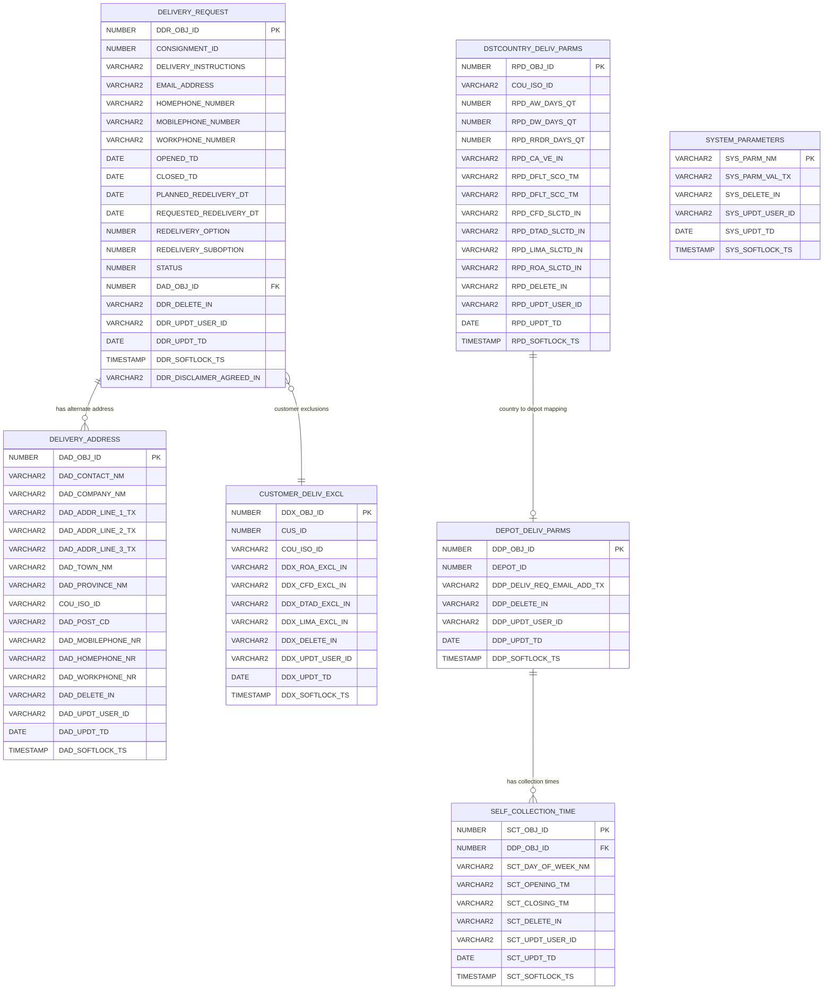
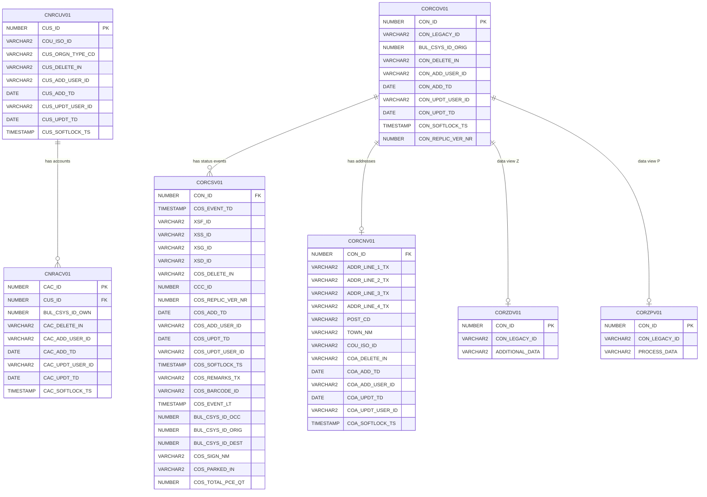
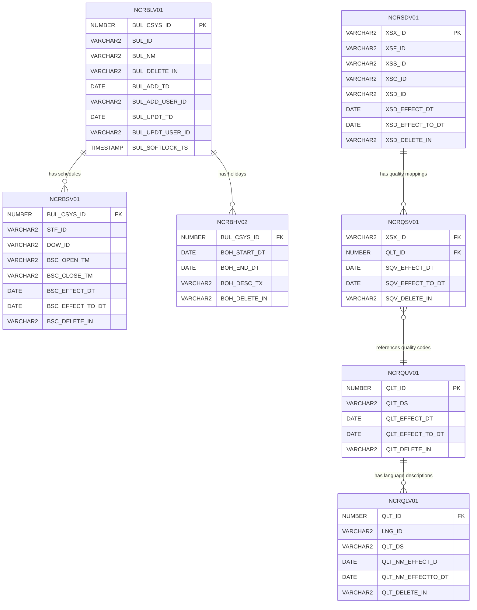

# Complete Database ER Diagram - All 32+ Tables

This document contains Entity Relationship diagrams showing all database tables and their relationships across the complete delivery ecosystem.

**Total Tables: 32+ tables across 7 functional domains**

## 🎯 Complete Schema Overview

```mermaid
graph TB
    subgraph "MyDelivery Domain (8 Tables)"
        DELIVERY_REQUEST[DELIVERY_REQUEST<br/>DDRRRT01<br/>🔑 DDR_OBJ_ID]
        DELIVERY_ADDRESS[DELIVERY_ADDRESS<br/>DDRDAT01<br/>🔑 DAD_OBJ_ID]
        CUSTOMER_DELIV_EXCL[CUSTOMER_DELIV_EXCL<br/>DDRDXT01<br/>🔑 DDX_OBJ_ID]
        DEPOT_DELIV_PARMS[DEPOT_DELIV_PARMS<br/>DDRDPT01<br/>🔑 DDP_OBJ_ID]
        DSTCOUNTRY_DELIV_PARMS[DSTCOUNTRY_DELIV_PARMS<br/>DDRCPT01<br/>🔑 RPD_OBJ_ID]
        SELF_COLLECTION_TIME[SELF_COLLECTION_TIME<br/>DDRSCT01<br/>🔑 SCT_OBJ_ID]
        SYSTEM_PARAMETERS[SYSTEM_PARAMETERS<br/>DDRSPT01<br/>🔑 SYS_PARM_NM]
        DDL_LOG[DDL_LOG<br/>🔑 DDH_ID]
    end

    subgraph "B2C Notification Domain (3 Tables)"
        CORECV01[CORECV01<br/>Consignment Data<br/>🔑 ConsignmentKey]
        COREAV01[COREAV01<br/>Alert Data<br/>🔑 AlertKey]
        CORESV01[CORESV01<br/>Status Events<br/>🔑 StatusKey]
    end

    subgraph "Customer Identification Domain (2 Tables)"
        CNRCUV01[CNRCUV01<br/>Customer Data<br/>🔑 CUS_ID]
        CNRACV01[CNRACV01<br/>Customer Account<br/>🔑 CAC_ID]
    end

    subgraph "Track & Consignment Domain (5 Tables)"
        CORCOV01[CORCOV01<br/>Consignment Overview<br/>🔑 CON_ID]
        CORCSV01[CORCSV01<br/>Consignment Status<br/>🔑 CON_ID + Timestamp]
        CORCNV01[CORCNV01<br/>Consignment Address<br/>🔑 CON_ID]
        CORZDV01[CORZDV01<br/>Consignment Data View Z<br/>🔑 CON_ID/CON_LEGACY_ID]
        CORZPV01[CORZPV01<br/>Consignment Data View P<br/>🔑 CON_ID/CON_LEGACY_ID]
    end

    subgraph "Common Codes Domain (7+ Tables)"
        NCRBLV01[NCRBLV01<br/>Business Location<br/>🔑 BUL_CSYS_ID]
        NCRBSV01[NCRBSV01<br/>Business Schedule<br/>🔑 BUL_CSYS_ID + STF_ID]
        NCRBHV02[NCRBHV02<br/>Business Holidays<br/>🔑 BUL_CSYS_ID + Date]
        NCRSDV01[NCRSDV01<br/>Status Codes<br/>🔑 XSX_ID]
        NCRQSV01[NCRQSV01<br/>Quality Status<br/>🔑 XSX_ID + QLT_ID]
        NCRQUV01[NCRQUV01<br/>Quality Codes<br/>🔑 QLT_ID]
        NCRQLV01[NCRQLV01<br/>Quality Language<br/>🔑 QLT_ID + LNG_ID]
    end

    subgraph "Spring Batch Domain (6 Tables)"
        BATCH_JOB_INSTANCE[BATCH_JOB_INSTANCE<br/>🔑 JOB_INSTANCE_ID]
        BATCH_JOB_EXECUTION[BATCH_JOB_EXECUTION<br/>🔑 JOB_EXECUTION_ID]
        BATCH_JOB_PARAMS[BATCH_JOB_EXECUTION_PARAMS<br/>🔑 JOB_EXECUTION_ID]
        BATCH_STEP_EXECUTION[BATCH_STEP_EXECUTION<br/>🔑 STEP_EXECUTION_ID]
        BATCH_STEP_CONTEXT[BATCH_STEP_EXECUTION_CONTEXT<br/>🔑 STEP_EXECUTION_ID]
        BATCH_JOB_CONTEXT[BATCH_JOB_EXECUTION_CONTEXT<br/>🔑 JOB_EXECUTION_ID]
    end

    subgraph "Location Domain (1 Table)"
        RLRLOV01[RLRLOV01<br/>Location Reference<br/>🔑 Location_ID]
    end

    %% Primary Relationships - MyDelivery
    DELIVERY_REQUEST ---|1:1| DELIVERY_ADDRESS
    DELIVERY_REQUEST ---|1:M| CUSTOMER_DELIV_EXCL
    DEPOT_DELIV_PARMS ---|1:M| SELF_COLLECTION_TIME
    
    %% Customer Domain Relationships
    CNRCUV01 ---|1:M| CNRACV01
    
    %% Track/Consignment Domain Relationships
    CORCOV01 ---|1:M| CORCSV01
    CORCOV01 ---|1:1| CORCNV01
    CORCOV01 ---|1:1| CORZDV01
    CORCOV01 ---|1:1| CORZPV01
    
    %% B2C Relationships
    CORECV01 ---|1:M| COREAV01
    CORESV01 ---|M:1| CORECV01
    
    %% Common Codes Relationships  
    NCRBLV01 ---|1:M| NCRBSV01
    NCRBLV01 ---|1:M| NCRBHV02
    NCRSDV01 ---|1:M| NCRQSV01
    NCRQSV01 ---|M:1| NCRQUV01
    NCRQUV01 ---|1:M| NCRQLV01
    
    %% Spring Batch Relationships
    BATCH_JOB_INSTANCE ---|1:M| BATCH_JOB_EXECUTION
    BATCH_JOB_EXECUTION ---|1:M| BATCH_JOB_PARAMS
    BATCH_JOB_EXECUTION ---|1:M| BATCH_STEP_EXECUTION
    BATCH_JOB_EXECUTION ---|1:1| BATCH_JOB_CONTEXT
    BATCH_STEP_EXECUTION ---|1:1| BATCH_STEP_CONTEXT

    %% Cross-Domain Integration Points (Logical)
    DELIVERY_REQUEST -.->|Uses| CORCOV01
    CNRCUV01 -.->|Drives| CUSTOMER_DELIV_EXCL
    NCRBLV01 -.->|Links to| DEPOT_DELIV_PARMS
    CORCSV01 -.->|Triggers| CORECV01
    RLRLOV01 -.->|Supports| DELIVERY_ADDRESS

    classDef mydelivery fill:#e1f5fe,stroke:#01579b,stroke-width:2px
    classDef b2c fill:#f3e5f5,stroke:#4a148c,stroke-width:2px
    classDef customer fill:#e8f5e8,stroke:#1b5e20,stroke-width:2px
    classDef track fill:#fff3e0,stroke:#e65100,stroke-width:2px
    classDef codes fill:#fce4ec,stroke:#880e4f,stroke-width:2px
    classDef batch fill:#f1f8e9,stroke:#33691e,stroke-width:2px
    classDef location fill:#e0f2f1,stroke:#004d40,stroke-width:2px

    class DELIVERY_REQUEST,DELIVERY_ADDRESS,CUSTOMER_DELIV_EXCL,DEPOT_DELIV_PARMS,DSTCOUNTRY_DELIV_PARMS,SELF_COLLECTION_TIME,SYSTEM_PARAMETERS,DDL_LOG mydelivery
    class CORECV01,COREAV01,CORESV01 b2c
    class CNRCUV01,CNRACV01 customer
    class CORCOV01,CORCSV01,CORCNV01,CORZDV01,CORZPV01 track
    class NCRBLV01,NCRBSV01,NCRBHV02,NCRSDV01,NCRQSV01,NCRQUV01,NCRQLV01 codes
    class BATCH_JOB_INSTANCE,BATCH_JOB_EXECUTION,BATCH_JOB_PARAMS,BATCH_STEP_EXECUTION,BATCH_STEP_CONTEXT,BATCH_JOB_CONTEXT batch
    class RLRLOV01 location
```



## 📊 Detailed Entity Relationship Diagrams by Domain

### MyDelivery Domain ERD



### Customer & Track/Consignment Domains ERD



### Common Codes Domain ERD



### B2C & Spring Batch ERD

```mermaid
erDiagram
    CORECV01 ||--o{ COREAV01 : "generates alerts"
    CORECV01 ||--o{ CORESV01 : "has status events"
    
    BATCH_JOB_INSTANCE ||--o{ BATCH_JOB_EXECUTION : "has executions"
    BATCH_JOB_EXECUTION ||--o{ BATCH_JOB_PARAMS : "has parameters"
    BATCH_JOB_EXECUTION ||--o{ BATCH_STEP_EXECUTION : "has steps"
    BATCH_JOB_EXECUTION ||--o| BATCH_JOB_CONTEXT : "has context"
    BATCH_STEP_EXECUTION ||--o| BATCH_STEP_CONTEXT : "has context"

    CORECV01 {
        NUMBER CON_ID PK
        VARCHAR2 CON_DELETE_IN
        TIMESTAMP CON_ADD_TD
        VARCHAR2 CON_ADD_USER_ID
        TIMESTAMP CON_UPDT_TD
        VARCHAR2 CON_UPDT_USER_ID
        TIMESTAMP CON_SOFTLOCK_TS
        VARCHAR2 CPN_EMAIL_ADD_TX_R
        VARCHAR2 CPN_MOBILE_NR_R
        VARCHAR2 LNG_ID_R
        VARCHAR2 COU_ISO_ID_R
        VARCHAR2 CON_ALRT_TYPE_1_IN
        VARCHAR2 CON_ALRT_TYPE_2_IN
        VARCHAR2 CON_ALRT_TYPE_3_IN
        VARCHAR2 CON_ALRT_TYPE_4_IN
        VARCHAR2 CON_ALRT_TYPE_5_IN
        VARCHAR2 CON_ALRT_TYPE_6_IN
        VARCHAR2 CON_ALRT_TYPE_7_IN
        VARCHAR2 CON_ALRT_TYPE_8_IN
        VARCHAR2 SMO_ID_1
        VARCHAR2 SMO_ID_2
        VARCHAR2 SMO_ID_3
        VARCHAR2 SMO_ID_4
        VARCHAR2 SMO_ID_5
        VARCHAR2 SMO_ID_6
        VARCHAR2 SMO_ID_7
        VARCHAR2 SMO_ID_8
    }

    COREAV01 {
        TIMESTAMP BCX_ALERT_TD PK
        NUMBER CON_ID FK
        VARCHAR2 BCX_ALERT_TYPE_CD
        VARCHAR2 BCX_DELETE_IN
        TIMESTAMP BCX_ADD_TD
        VARCHAR2 BCX_ADD_USER_ID
        TIMESTAMP BCX_UPDT_TD
        VARCHAR2 BCX_UPDT_USER_ID
        TIMESTAMP BCX_SOFTLOCK_TS
        VARCHAR2 BCX_ALERT_ADDR_TX
        VARCHAR2 BCX_PROC_STAT_CD
        TIMESTAMP BCX_PROC_TD
        VARCHAR2 BCX_TEMPLATE_CD
        VARCHAR2 LNG_ID
        VARCHAR2 BCX_ADD_INFO_TX
        NUMBER BUL_CSYS_ID_OCC
        NUMBER BCX_RETRY_NR
    }

    CORESV01 {
        NUMBER CON_ID FK
        TIMESTAMP COS_EVENT_TD PK
        VARCHAR2 XSF_ID
        VARCHAR2 XSS_ID
        VARCHAR2 XSG_ID
        VARCHAR2 XSD_ID
        VARCHAR2 COS_DELETE_IN
        TIMESTAMP COS_ADD_TD
        VARCHAR2 COS_ADD_USER_ID
        VARCHAR2 COS_PROCESSED_IN
        TIMESTAMP COS_REV_DUE_DT
        NUMBER BUL_CSYS_ID_OCC
    }

    BATCH_JOB_INSTANCE {
        BIGINT JOB_INSTANCE_ID PK
        BIGINT VERSION
        VARCHAR JOB_NAME
        VARCHAR JOB_KEY
    }

    BATCH_JOB_EXECUTION {
        BIGINT JOB_EXECUTION_ID PK
        BIGINT VERSION
        BIGINT JOB_INSTANCE_ID FK
        TIMESTAMP CREATE_TIME
        TIMESTAMP START_TIME
        TIMESTAMP END_TIME
        VARCHAR STATUS
        VARCHAR EXIT_CODE
        VARCHAR EXIT_MESSAGE
        TIMESTAMP LAST_UPDATED
        VARCHAR JOB_CONFIGURATION_LOCATION
    }

    BATCH_JOB_PARAMS {
        BIGINT JOB_EXECUTION_ID FK
        VARCHAR TYPE_CD
        VARCHAR KEY_NAME
        VARCHAR STRING_VAL
        TIMESTAMP DATE_VAL
        BIGINT LONG_VAL
        DOUBLE DOUBLE_VAL
        VARCHAR IDENTIFYING
    }

    BATCH_STEP_EXECUTION {
        BIGINT STEP_EXECUTION_ID PK
        BIGINT VERSION
        VARCHAR STEP_NAME
        BIGINT JOB_EXECUTION_ID FK
        TIMESTAMP START_TIME
        TIMESTAMP END_TIME
        VARCHAR STATUS
        BIGINT COMMIT_COUNT
        BIGINT READ_COUNT
        BIGINT FILTER_COUNT
        BIGINT WRITE_COUNT
        BIGINT READ_SKIP_COUNT
        BIGINT WRITE_SKIP_COUNT
        BIGINT PROCESS_SKIP_COUNT
        BIGINT ROLLBACK_COUNT
        VARCHAR EXIT_CODE
        VARCHAR EXIT_MESSAGE
        TIMESTAMP LAST_UPDATED
    }

    BATCH_STEP_CONTEXT {
        BIGINT STEP_EXECUTION_ID PK FK
        VARCHAR SHORT_CONTEXT
        LONGVARCHAR SERIALIZED_CONTEXT
    }

    BATCH_JOB_CONTEXT {
        BIGINT JOB_EXECUTION_ID PK FK
        VARCHAR SHORT_CONTEXT
        LONGVARCHAR SERIALIZED_CONTEXT
    }
```

## 🔗 Cross-Domain Integration Patterns

### Data Flow Integration Points:
1. **Customer Request Flow**: CNRCUV01 → DELIVERY_REQUEST → CORCOV01 → CORECV01
2. **Status Event Flow**: CORCSV01 → CORESV01 → COREAV01 (notifications)
3. **Location Integration**: RLRLOV01 → DELIVERY_ADDRESS → DEPOT_DELIV_PARMS
4. **Quality Validation**: NCRSDV01/NCRQSV01 → All status fields across domains
5. **Business Location**: NCRBLV01 → DEPOT_DELIV_PARMS → SELF_COLLECTION_TIME

### Business Process Flows:
- **Redelivery Process**: Customer → Request → Validation → Scheduling → Notification
- **Status Updates**: Event → Validation → Processing → Notification → Audit
- **Configuration**: Country Rules → Depot Setup → Time Slots → Customer Options

## 📊 Table Count by Domain

| Domain | Tables | Purpose |
|--------|--------|---------|
| **MyDelivery** | 8 | Core delivery request management |
| **Customer Identification** | 2 | Customer profile and account management |
| **Track & Consignment** | 5 | Package tracking and status management |
| **B2C Notification** | 3 | Customer notification system |
| **Common Codes** | 7+ | Reference data and business rules |
| **Spring Batch** | 6 | Batch processing framework |
| **Location** | 1 | Geographic reference data |
| **Total** | **32+** | Complete delivery ecosystem |

This comprehensive schema supports the entire delivery ecosystem from customer requests through tracking, notifications, and administrative management.
