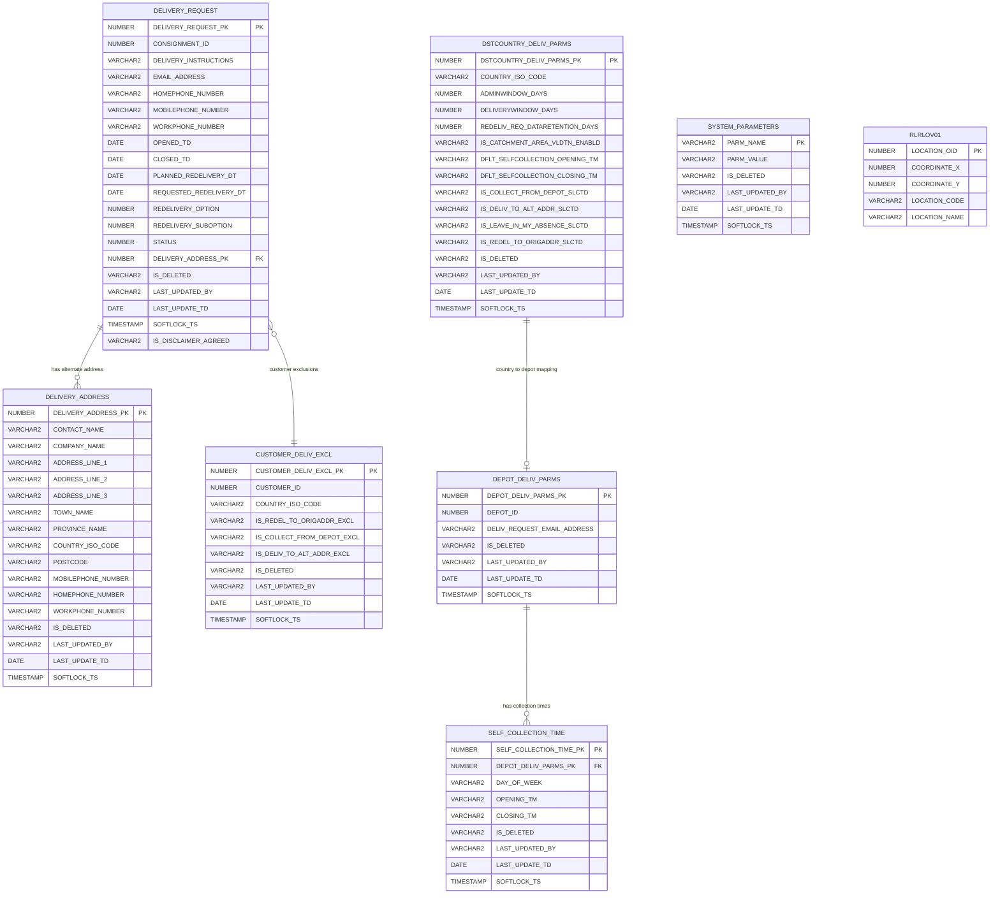

# MyDelivery & B2C Database Entity Relationship Diagram

## Core MyDelivery Tables



## B2C Notification System Tables

```mermaid
erDiagram
    CORECV01 ||--o{ COREAV01 : "generates alerts"
    CORECV01 ||--o{ CORESV01 : "has status events"

    CORECV01 {
        NUMBER CON_ID PK
        VARCHAR2 CON_DELETE_IN
        TIMESTAMP CON_ADD_TD
        VARCHAR2 CON_ADD_USER_ID
        TIMESTAMP CON_UPDT_TD
        VARCHAR2 CON_UPDT_USER_ID
        TIMESTAMP CON_SOFTLOCK_TS
        VARCHAR2 CPN_EMAIL_ADD_TX_R
        VARCHAR2 CPN_MOBILE_NR_R
        VARCHAR2 LNG_ID_R
        VARCHAR2 COU_ISO_ID_R
        VARCHAR2 CPN_EMAIL_ADD_TX_D
        VARCHAR2 CPN_MOBILE_NR_D
        VARCHAR2 LNG_ID_D
        VARCHAR2 COU_ISO_ID_D
        VARCHAR2 CON_ALRT_TYPE_1_IN
        VARCHAR2 CON_ALRT_TYPE_2_IN
        VARCHAR2 CON_ALRT_TYPE_3_IN
        VARCHAR2 CON_ALTR_TYPE_4_IN
        VARCHAR2 CON_ALRT_TYPE_5_IN
        VARCHAR2 CON_ALRT_TYPE_6_IN
        VARCHAR2 CON_ALRT_TYPE_7_IN
        VARCHAR2 CON_ALRT_TYPE_8_IN
        TIMESTAMP CON_DELIV_DUE_LT
        TIMESTAMP CON_COMM_DUE_LT
        VARCHAR2 CON_COMPLETED_IN
        VARCHAR2 CON_SCANNED_IN
        VARCHAR2 CON_INTL_IN
        VARCHAR2 CON_LEGACY_ID
        VARCHAR2 CPN_NM_S
        TIMESTAMP CON_CREATE_LT
        NUMBER BUL_CSYS_ID_ORIG
        VARCHAR2 CUS_EMAIL_PREF_IN
        VARCHAR2 CUS_SMS_PREF_IN
        VARCHAR2 CUS_INIT_ALRT_CD
        NUMBER CAC_ID_S
        VARCHAR2 PTP_ID
        VARCHAR2 SMP_ID
        TIMESTAMP CON_DELIV_END_LT
        TIMESTAMP CON_ROW_UPDT_TD
        TIMESTAMP CON_DEP_ACT_DT
        VARCHAR2 SMO_ID_1
        VARCHAR2 SMO_ID_2
        VARCHAR2 SMO_ID_3
        VARCHAR2 SMO_ID_4
        VARCHAR2 SMO_ID_5
        VARCHAR2 SMO_ID_6
        VARCHAR2 SMO_ID_7
        VARCHAR2 SMO_ID_8
        VARCHAR2 CUS_DISPNM_ALRT_IN
        VARCHAR2 CON_B2C_STATE_CD
        VARCHAR2 CUS_B2C_SP_TMPL_IN
        VARCHAR2 CUS_B2C_S_EMAIL_TX
        VARCHAR2 CUS_B2C_S_MOB_NR
    }

    COREAV01 {
        TIMESTAMP BCX_ALERT_TD
        NUMBER CON_ID FK
        VARCHAR2 BCX_ALERT_TYPE_CD
        VARCHAR2 BCX_DELETE_IN
        TIMESTAMP BCX_ADD_TD
        VARCHAR2 BCX_ADD_USER_ID
        TIMESTAMP BCX_UPDT_TD
        VARCHAR2 BCX_UPDT_USER_ID
        TIMESTAMP BCX_SOFTLOCK_TS
        VARCHAR2 BCX_ALERT_ADDR_TX
        VARCHAR2 BCX_PROC_STAT_CD
        TIMESTAMP BCX_PROC_TD
        VARCHAR2 BCX_TEMPLATE_CD
        VARCHAR2 LNG_ID
        VARCHAR2 BCX_ADD_INFO_TX
        NUMBER BUL_CSYS_ID_OCC
        TIMESTAMP BCX_ROW_UPDT_TD
        TIMESTAMP CON_DELIV_DUE_LT
        VARCHAR2 LCA_ID
        NUMBER BCX_RETRY_NR
    }

    CORESV01 {
        NUMBER CON_ID FK
        TIMESTAMP COS_EVENT_TD
        VARCHAR2 XSF_ID
        VARCHAR2 XSS_ID
        VARCHAR2 XSG_ID
        VARCHAR2 XSD_ID
        VARCHAR2 COS_DELETE_IN
        TIMESTAMP COS_ADD_TD
        VARCHAR2 COS_ADD_USER_ID
        TIMESTAMP COS_UPDT_TD
        VARCHAR2 COS_UPDT_USER_ID
        TIMESTAMP COS_SOFTLOCK_TS
        VARCHAR2 COS_PROCESSED_IN
        TIMESTAMP COS_REV_DUE_DT
        NUMBER BUL_CSYS_ID_OCC
        TIMESTAMP COS_ROW_UPDT_TD
    }
```



## Spring Batch Framework Tables

```mermaid
erDiagram
    BATCH_JOB_INSTANCE ||--o{ BATCH_JOB_EXECUTION : "has executions"
    BATCH_JOB_INSTANCE ||--o{ BATCH_JOB_PARAMS : "has parameters"
    BATCH_JOB_EXECUTION ||--o{ BATCH_STEP_EXECUTION : "has steps"
    BATCH_JOB_EXECUTION ||--o| BATCH_JOB_EXECUTION_CONTEXT : "has context"
    BATCH_STEP_EXECUTION ||--o| BATCH_STEP_EXECUTION_CONTEXT : "has context"

    BATCH_JOB_INSTANCE {
        BIGINT JOB_INSTANCE_ID PK
        BIGINT VERSION
        VARCHAR JOB_NAME
        VARCHAR JOB_KEY
    }

    BATCH_JOB_EXECUTION {
        BIGINT JOB_EXECUTION_ID PK
        BIGINT VERSION
        BIGINT JOB_INSTANCE_ID FK
        TIMESTAMP CREATE_TIME
        TIMESTAMP START_TIME
        TIMESTAMP END_TIME
        VARCHAR STATUS
        VARCHAR EXIT_CODE
        VARCHAR EXIT_MESSAGE
        TIMESTAMP LAST_UPDATED
    }

    BATCH_JOB_PARAMS {
        BIGINT JOB_INSTANCE_ID FK
        VARCHAR TYPE_CD
        VARCHAR KEY_NAME
        VARCHAR STRING_VAL
        TIMESTAMP DATE_VAL
        BIGINT LONG_VAL
        DOUBLE DOUBLE_VAL
    }

    BATCH_STEP_EXECUTION {
        BIGINT STEP_EXECUTION_ID PK
        BIGINT VERSION
        VARCHAR STEP_NAME
        BIGINT JOB_EXECUTION_ID FK
        TIMESTAMP START_TIME
        TIMESTAMP END_TIME
        VARCHAR STATUS
        BIGINT COMMIT_COUNT
        BIGINT READ_COUNT
        BIGINT FILTER_COUNT
        BIGINT WRITE_COUNT
        BIGINT READ_SKIP_COUNT
        BIGINT WRITE_SKIP_COUNT
        BIGINT PROCESS_SKIP_COUNT
        BIGINT ROLLBACK_COUNT
        VARCHAR EXIT_CODE
        VARCHAR EXIT_MESSAGE
        TIMESTAMP LAST_UPDATED
    }

    BATCH_STEP_EXECUTION_CONTEXT {
        BIGINT STEP_EXECUTION_ID PK FK
        VARCHAR SHORT_CONTEXT
        LONGVARCHAR SERIALIZED_CONTEXT
    }

    BATCH_JOB_EXECUTION_CONTEXT {
        BIGINT JOB_EXECUTION_ID PK FK
        VARCHAR SHORT_CONTEXT
        LONGVARCHAR SERIALIZED_CONTEXT
    }
```

## Key Relationships Summary

### MyDelivery Domain:
- **DELIVERY_REQUEST** is the central entity that connects customers to delivery addresses
- **CUSTOMER_DELIV_EXCL** defines what delivery options are excluded for specific customers
- **DEPOT_DELIV_PARMS** and **SELF_COLLECTION_TIME** manage depot-specific configurations
- **DSTCOUNTRY_DELIV_PARMS** manages country-specific delivery parameters
- **SYSTEM_PARAMETERS** stores global application configuration

### B2C Domain:
- **CORECV01** is the main consignment table that drives the notification system
- **COREAV01** stores alert/notification records linked to consignments
- **CORESV01** tracks status events for consignments

### Supporting Systems:
- **RLRLOV01** provides location reference data
- **BATCH_*** tables support the Spring Batch framework for processing jobs

This architecture follows a domain-driven design where each major functional area (MyDelivery, B2C Notifications, Batch Processing) has its own set of related tables with clear separation of concerns.
