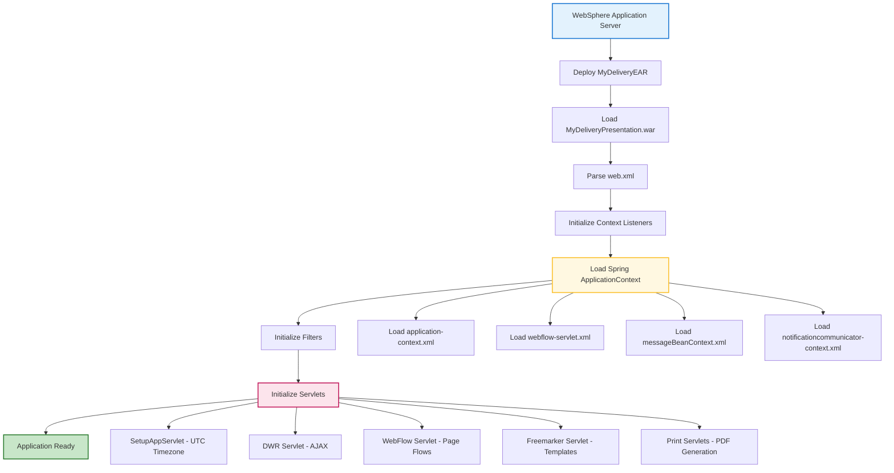
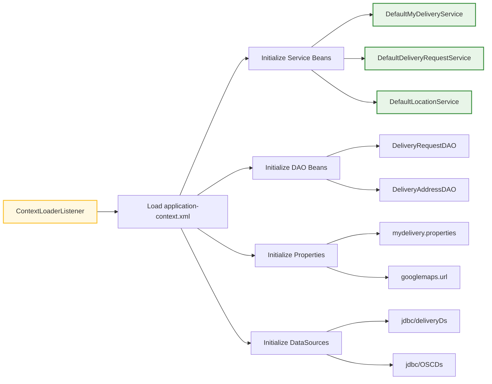
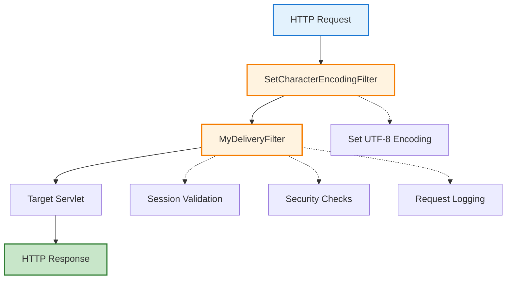
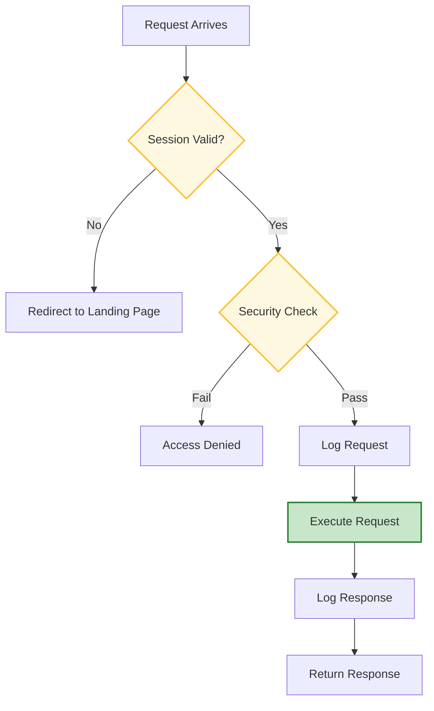
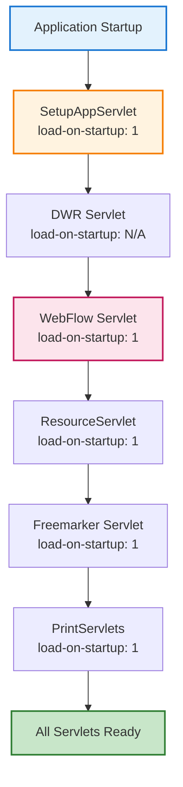
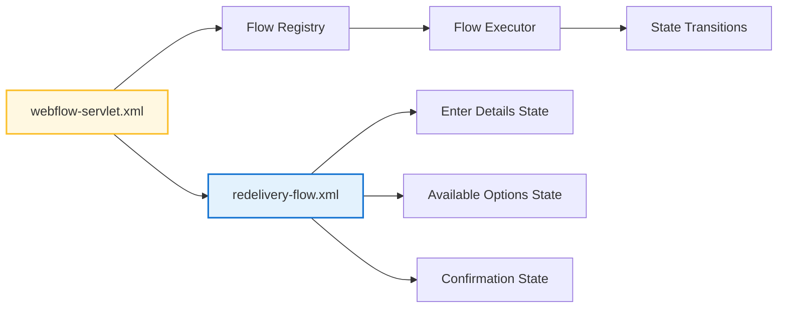
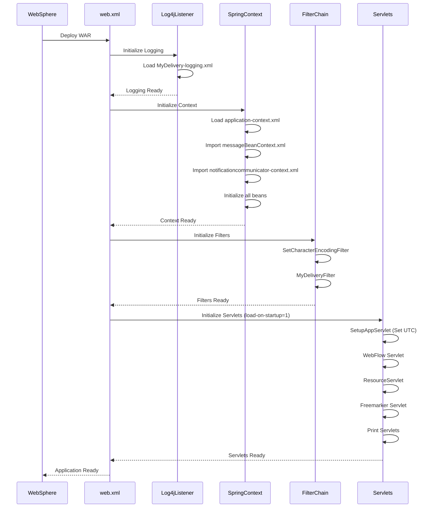

# MyDelivery Application - Entry Point and Initialization

## 📋 Document Overview

This document details the **complete initialization sequence** of the MyDelivery customer-facing web application, from web container startup through Spring context loading, servlet initialization, and framework configuration.

**Coverage:**
- Web.xml deployment descriptor analysis
- Servlet initialization sequence
- Spring context loading
- Filter chain configuration
- Resource and datasource binding

---

## 🚀 Application Startup Sequence



---

## 📄 web.xml Configuration

**File Location**: `c:\Users\6687869\Applications\MyDelivery\eai-3532120-mydelivery\MyDeliveryPresentation\src\main\webapp\WEB-INF\web.xml`

### **Deployment Descriptor Structure**

```xml
<?xml version="1.0" encoding="UTF-8"?>
<web-app id="WebApp_ID" version="2.4" 
    xmlns="http://java.sun.com/xml/ns/j2ee" 
    xmlns:xsi="http://www.w3.org/2001/XMLSchema-instance">
    
    <display-name>MyDeliveryPresentation</display-name>
    
    <!-- Context Parameters -->
    <!-- Listeners -->
    <!-- Filters -->
    <!-- Servlets -->
    <!-- Servlet Mappings -->
    <!-- Session Configuration -->
    <!-- Error Pages -->
    <!-- Welcome Files -->
    <!-- Resource References -->
</web-app>
```

---

## 🔧 Context Parameters

### **1. Spring Context Configuration**

```xml
<context-param>
    <param-name>contextConfigLocation</param-name>
    <param-value>/WEB-INF/application-context.xml</param-value>
</context-param>
```

**Purpose**: Specifies the main Spring application context XML file
**Loaded By**: `ContextLoaderListener`
**Impact**: Bootstraps the entire Spring IoC container

### **2. Log4j Configuration**

```xml
<context-param>
    <param-name>log4jConfigLocation</param-name>
    <param-value>classpath:MyDelivery-logging.xml</param-value>
</context-param>

<context-param>
    <param-name>webAppRootKey</param-name>
    <param-value>MyDelivery</param-value>
</context-param>
```

**Purpose**: Configures application logging framework
**Log File Location**: Determined by Log4j XML configuration
**Key Logger Classes**: `SetupAppServlet`, `MyDeliveryFilter`, Service classes

---

## 👂 Context Listeners

### **1. Log4j Configuration Listener**

```xml
<listener>
    <listener-class>org.springframework.web.util.Log4jConfigListener</listener-class>
</listener>
```

**Execution Order**: **1st** - Initializes before Spring context
**Actions**:
- Loads Log4j configuration from classpath
- Sets up application logging infrastructure
- Creates log file directories if needed

### **2. Spring Context Loader Listener**

```xml
<listener>
    <listener-class>org.springframework.web.context.ContextLoaderListener</listener-class>
</listener>
```

**Execution Order**: **2nd** - After Log4j initialization
**Actions**:
- Loads `application-context.xml`
- Creates root `WebApplicationContext`
- Initializes all Spring beans defined in context
- Makes context available to servlets via `ServletContext`

**Key Beans Initialized**:


---

## 🔒 Filter Chain Configuration

### **Filter Execution Order**



### **1. Character Encoding Filter**

```xml
<filter>
    <filter-name>SetCharacterEncodingFilter</filter-name>
    <filter-class>com.tnt.shared.filter.SetCharacterEncodingFilter</filter-class>
</filter>

<filter-mapping>
    <filter-name>SetCharacterEncodingFilter</filter-name>
    <url-pattern>/*</url-pattern>
</filter-mapping>
```

**Purpose**: Ensures all requests/responses use UTF-8 encoding
**Execution**: Applied to **ALL** requests (`/*`)
**Importance**: Critical for international character support

**Filter Logic**:
```java
public void doFilter(ServletRequest request, ServletResponse response, FilterChain chain) {
    request.setCharacterEncoding("UTF-8");
    response.setCharacterEncoding("UTF-8");
    chain.doFilter(request, response);
}
```

### **2. MyDelivery Application Filter**

```xml
<filter>
    <filter-name>myDeliveryFilter</filter-name>
    <filter-class>com.tnt.express.warp.mydelivery.ui.filter.MyDeliveryFilter</filter-name>
</filter>

<filter-mapping>
    <filter-name>myDeliveryFilter</filter-name>
    <url-pattern>/*</url-pattern>
</filter-mapping>
```

**File Location**: `MyDeliveryPresentation/src/main/java/com/tnt/express/warp/mydelivery/ui/filter/MyDeliveryFilter.java`

**Responsibilities**:
- Session management and validation
- Security context verification
- Request/response logging
- Performance monitoring
- Error handling

**Filter Flow**:


---

## 🎯 Servlet Configuration

### **Servlet Initialization Sequence**



### **1. Setup Application Servlet**

```xml
<servlet>
    <servlet-name>setupappservlet</servlet-name>
    <servlet-class>com.tnt.express.warp.mydelivery.ui.servlet.SetupAppServlet</servlet-class>
    <load-on-startup>1</load-on-startup>
</servlet>
```

**File Location**: `MyDeliveryPresentation/src/main/java/com/tnt/express/warp/mydelivery/ui/servlet/SetupAppServlet.java`

**Purpose**: Application-wide initialization tasks
**Load Order**: **1** (loads first)
**No Mapping**: Initialization only, no URL pattern

**Implementation**:
```java
@Override
public void init(ServletConfig config) throws ServletException {
    LOGGER.debug("Init of SetupAppServlet");
    TimeZone.setDefault(TimeZone.getTimeZone("UTC"));
}
```

**Critical Action**: Sets default timezone to **UTC** for all application date/time operations

**Impact**:
- All database timestamps stored in UTC
- Date conversions use UTC as base
- Ensures timezone consistency across servers

---

### **2. DWR (Direct Web Remoting) Servlet**

```xml
<servlet>
    <servlet-name>dwr</servlet-name>
    <servlet-class>com.spring.dwr.configurer.DWRConfigurerServlet</servlet-class>
    <init-param>
        <param-name>debug</param-name>
        <param-value>false</param-value>
    </init-param>
    <init-param>
        <param-name>crossDomainSessionSecurity</param-name>
        <param-value>false</param-value>
    </init-param>
</servlet>

<servlet-mapping>
    <servlet-name>dwr</servlet-name>
    <url-pattern>/dwr/*</url-pattern>
</servlet-mapping>
```

**File Location**: `MyDeliveryPresentation/src/main/java/com/spring/dwr/configurer/DWRConfigurerServlet.java`

**Purpose**: AJAX communication between JavaScript and Java
**URL Pattern**: `/dwr/*`
**Usage**: Real-time UI updates without page refresh

**Extends**: `org.directwebremoting.spring.DwrSpringServlet`

**Custom Configuration**:
```java
@Override
public void doPost(HttpServletRequest request, HttpServletResponse response) {
    updateContentTypeHeader(response);
    super.doPost(request, response);
}

public void updateContentTypeHeader(HttpServletResponse response) {
    response.setHeader("Content-Type", "text/javascript;charset=UTF-8");
}
```

**DWR Services Exposed**:
- Address validation services
- Location lookup services
- Real-time form validation
- Dynamic content loading

**Configuration File**: Loaded from Spring context, defines exposed Java methods

---

### **3. Spring WebFlow Servlet**

```xml
<servlet>
    <servlet-name>webflow</servlet-name>
    <servlet-class>org.springframework.web.servlet.DispatcherServlet</servlet-class>
    <init-param>
        <param-name>contextConfigLocation</param-name>
        <param-value>/WEB-INF/webflow-servlet.xml</param-value>
    </init-param>
    <load-on-startup>1</load-on-startup>
</servlet>

<servlet-mapping>
    <servlet-name>webflow</servlet-name>
    <url-pattern>/flow/*</url-pattern>
</servlet-mapping>
```

**Purpose**: Handles all page flow requests (redelivery workflow)
**URL Pattern**: `/flow/*`
**Configuration**: `webflow-servlet.xml`
**Load Order**: **1** (critical servlet)

**Responsibilities**:
- Execute Spring WebFlow state machines
- Manage view state transitions
- Handle form submissions
- Coordinate page navigation

**Flow Definitions Loaded**:


**See**: `04-Spring-WebFlow-Configuration.md` for detailed flow analysis

---

### **4. Resource Servlet**

```xml
<servlet>
    <servlet-name>resourceservlet</servlet-name>
    <servlet-class>org.springframework.js.resource.ResourceServlet</servlet-class>
    <load-on-startup>1</load-on-startup>
</servlet>

<servlet-mapping>
    <servlet-name>resourceservlet</servlet-name>
    <url-pattern>/static/*</url-pattern>
</servlet-mapping>
```

**Purpose**: Serves static resources (CSS, JavaScript, images)
**URL Pattern**: `/static/*`
**Provider**: Spring JavaScript library

**Served Resources**:
- `/static/dojo/*` - Dojo JavaScript framework
- `/static/spring/*` - Spring JS utilities
- `/static/css/*` - Stylesheet files
- `/static/images/*` - Image resources

---

### **5. Freemarker Template Servlet**

```xml
<servlet>
    <servlet-name>freemarker</servlet-name>
    <servlet-class>freemarker.ext.servlet.FreemarkerServlet</servlet-class>
    <init-param>
        <param-name>TemplatePath</param-name>
        <param-value>/</param-value>
    </init-param>
    <init-param>
        <param-name>NoCache</param-name>
        <param-value>false</param-value>
    </init-param>
    <init-param>
        <param-name>ContentType</param-name>
        <param-value>text/html; charset=UTF-8</param-name>
    </init-param>
    <load-on-startup>1</load-on-startup>
</servlet>

<servlet-mapping>
    <servlet-name>freemarker</servlet-name>
    <url-pattern>*.ftl</url-pattern>
</servlet-mapping>
```

**Purpose**: Template rendering engine for dynamic content
**URL Pattern**: `*.ftl` (Freemarker Template Language)
**Template Location**: Web application root `/`

**Template Usage**:
- Email templates
- PDF generation
- Dynamic HTML fragments
- Localized content

**See**: `08-Freemarker-Templates.md` for template details

---

### **6. Print Servlets**

#### **Print PTL Form Servlet**

```xml
<servlet>
    <servlet-name>PrintMyDeliveryPTLForm</servlet-name>
    <servlet-class>com.tnt.express.warp.mydelivery.ui.servlet.PrintMyDeliveryPTLFormServlet</servlet-class>
    <load-on-startup>1</load-on-startup>
</servlet>

<servlet-mapping>
    <servlet-name>PrintMyDeliveryPTLForm</servlet-name>
    <url-pattern>/print/PrintMyDeliveryPTLForm</url-pattern>
</servlet-mapping>
```

**Purpose**: Generate printable PTL (Print to Leave) forms
**URL**: `/print/PrintMyDeliveryPTLForm`
**Output**: PDF document

#### **Print Confirmation Details Servlet**

```xml
<servlet>
    <servlet-name>PrintMyDeliveryConfirmationDetails</servlet-name>
    <servlet-class>com.tnt.express.warp.mydelivery.ui.servlet.PrintMyDeliveryConfirmationDetailsServlet</servlet-class>
    <load-on-startup>1</load-on-startup>
</servlet>

<servlet-mapping>
    <servlet-name>PrintMyDeliveryConfirmationDetails</servlet-name>
    <url-pattern>/print/PrintMyDeliveryConfirmationDetails</url-pattern>
</servlet-mapping>
```

**Purpose**: Print delivery confirmation details
**URL**: `/print/PrintMyDeliveryConfirmationDetails`
**Output**: PDF document

**See**: `09-Print-Servlets.md` for PDF generation details

---

## 🗄️ Database Resource Configuration

### **JNDI Resource References**

**Defined in**: `web.xml` (bottom section)
**Bound in**: `ibm-web-bnd.xmi`

```xml
<!-- MyDelivery Database -->
<resource-ref id="deliveryDs">
    <res-ref-name>jdbc/deliveryDs</res-ref-name>
    <res-type>javax.sql.DataSource</res-type>
    <res-auth>Container</res-auth>
    <res-sharing-scope>Shareable</res-sharing-scope>
</resource-ref>

<!-- OSC (Order Service Communication) Database -->
<resource-ref id="oscDs">
    <res-ref-name>jdbc/OSCDs</res-ref-name>
    <res-type>javax.sql.DataSource</res-type>
    <res-auth>Container</res-auth>
    <res-sharing-scope>Shareable</res-sharing-scope>
</resource-ref>
```

### **DataSource Mapping**

**File**: `ibm-web-bnd.xmi`

```xml
<resRefBindings jndiName="jdbc/deliveryDs">
    <bindingResourceRef href="WEB-INF/web.xml#deliveryDs"/>
</resRefBindings>

<resRefBindings jndiName="jdbc/OSCDs">
    <bindingResourceRef href="WEB-INF/web.xml#oscDs"/>
</resRefBindings>
```

**Database Schemas Accessed**:
- **deliveryDs**: DDRRRT01, DDRDAT01, DDRDXT01, DDRDPT01, DDRCPT01, DDRSCT01, DDRSPT01
- **OSCDs**: Order and shipment tracking data
- **Additional**: Consignment tracking, customer identification, common codes

---

## ⚙️ Session Configuration

```xml
<session-config>
    <session-timeout>20</session-timeout>
</session-config>
```

**Session Timeout**: 20 minutes of inactivity
**Impact**: User session expires, redirect to landing page
**Storage**: HTTP session attributes stored in WebSphere session manager

**Session Attributes**:
- User locale/language
- Current flow execution
- Form data (delivery request bean)
- Security context

---

## ❌ Error Page Configuration

```xml
<error-page>
    <exception-type>java.lang.Exception</exception-type>
    <location>/error.jsp</location>
</error-page>
```

**Error Handler**: `/error.jsp`
**Triggered By**: Any uncaught `java.lang.Exception`
**Display**: User-friendly error message
**Logging**: Full stack trace logged to application logs

---

## 🏠 Welcome File Configuration

```xml
<welcome-file-list>
    <welcome-file>/index.jsp</welcome-file>
</welcome-file-list>
```

**Landing Page**: `/index.jsp`
**URL**: `http://server:port/mydelivery/`
**Automatically Served**: When accessing application root

---

## 📦 Spring Context Files

### **application-context.xml**

**File Location**: `WEB-INF/application-context.xml`

**Loaded Contexts**:
```xml
<import resource="classpath:messageBeanContext.xml" />
<import resource="classpath:notificationcommunicator-context.xml"/>
```

**Key Beans Defined**:
- `com_tnt_express_mydelivery_redeliveryRequestBean` - Main form bean
- `localeResolver` - Internationalization support
- `localeChangeInterceptor` - Language switching
- Decorator beans for UI logic
- Validator beans for form validation

**Property Placeholders**:
```xml
<bean class="org.springframework.beans.factory.config.PropertyPlaceholderConfigurer">
    <property name="locations">
        <list>
            <value>classpath:mydelivery.properties</value>
        </list>
    </property>
</bean>
```

**Properties Loaded**:
- `mydelivery.version` - Application version
- `googlemaps.url` - Google Maps API URL
- `mydelivery.ignoreAddressPrefillCountries` - Countries to skip address prefill
- `mydelivery.ptlCountries` - Countries supporting PTL feature

---

## 🔄 Complete Initialization Flow



---

## Detailed servlet & Spring boot sequence (exact files & beans)

- web.xml entries (where to look)
  - File: `MyDeliveryPresentation/src/main/webapp/WEB-INF/web.xml`
  - Key entries to inspect:
    - ContextLoaderListener — loads root application context files referenced in `<context-param>` `contextConfigLocation` (commonly `classpath*:applicationContext*.xml` or `WEB-INF/applicationContext.xml`).
    - Dispatcher / Flow servlet — typically `webflow` or `spring` servlet that loads `webflow-servlet.xml`.
    - DWR servlet mapping `/dwr/*` and resources for `engine.js`.

- Root Spring contexts to check (common paths in this project):
  - `MyDeliveryPresentation/WEB-INF/webflow-servlet.xml`
  - `MyDeliveryPresentation/WEB-INF/applicationContext.xml`
  - `MyDeliveryServiceImpl/src/main/resources/delivery-entity-context.xml`
  - `MyDeliveryComponents/delivery/delivery-async-process/src/main/resources/delivery-async-process-context.xml`

- Important bean names and where they are defined:
  - `flowExecutor`, `flowRegistry` — defined in `webflow-servlet.xml` (FlowExecutor bean used by FlowHandlerAdapter)
  - `delivery_entity_DeliveryRepository` / `delivery_entity_DeliveryRequestDelegate` — defined in `delivery-entity-context.xml`
  - `delivery-async-producer` / JMS connection factory — defined in `delivery-async-process-context.xml`
  - `delivery_service_DeliveryRequestService` — service bean defined in `delivery-service` context (service-impl module)

- Persistence/JNDI specifics
  - Persistence unit name used by repositories: `delivery-persistence-unit` (`@PersistenceContext(unitName = "delivery-persistence-unit")` in `DefaultDeliveryRepository`)
  - Verify `persistence.xml` present under `entity-impl/src/main/resources/META-INF/persistence.xml` and that the datasource JNDI name matches your container config.

- JMS configuration pointers
  - Check `delivery-async-process-context.xml` for JMS Template, connectionFactory, and destination bean names.
  - MDB activation-config and destination bindings are in `DeliveryAsyncMessageProcessorMDB.java` and its Spring or container activation configuration.

- Startup log markers to target when diagnosing failures
  - "Root WebApplicationContext: initialization completed in" — indicates Spring root context success
  - `org.springframework.webflow.FlowExecutionRepository` and `FlowExecutor` logs — indicate WebFlow registration
  - JMS producer/consumer binding messages — broker-dependent but look for lines referencing the configured queue names
  - BeanCreationException stack traces — search server logs for Caused by: exceptions to find missing beans or property placeholders

- Quick checks when app won't start
  1. Validate `contextConfigLocation` paths in `web.xml` match actual resource locations.
  2. Confirm `persistence.xml` and JDBC/JNDI names are correct for the runtime.
  3. If DWR fails, ensure `DWRConfigurerServlet` class is packaged and that `org.directwebremoting` jars are on the classpath.

---

## Additional Implementation & Operational Details

- Servlet & Startup Order: the `ContextLoaderListener` loads the root Spring context first, followed by the web/servlet-specific contexts declared in the webflow servlet and other module servlet files. The following servlets and classes are involved in startup and should be checked when debugging initialization issues:
  - `SetupAppServlet` — application-level setup performed at first access
  - `DWRConfigurerServlet` — configures DWR and exposes remote beans
  - `DynamicDispatcherServlet` / `AutowiringApplicationServlet` — module-specific dispatcher servlets used by Presentation and Admin apps

- Spring Context Locations: look for `applicationContext.xml`, `webflow-servlet.xml`, `mydeliveryadmin-servlet.xml`, and `b2c-common-context.xml` under each module's `WEB-INF` or `resources` directories. These files register beans such as `jmsTemplate`, `dataSource`, `transactionManager`, and service beans.

- Properties & Environments: property files are located in `MyDeliveryProperties` and component `properties/` folders. Environment overrides follow the usual pattern: default properties in repo, environment-specific files supplied at deploy time and injected via JVM system properties or Spring `PropertyPlaceholderConfigurer`.

- JNDI & Resource Bindings: resources such as JMS ConnectionFactory, Queues, and DataSources are referenced via JNDI names in `web.xml` or Spring JNDI lookups. Verify server-side bindings (WebLogic/WildFly/WebSphere) map to the expected JNDI names used by the apps.

- Session & Security Filters: session settings and the filter chain are defined in `web.xml`. Session timeout, cookie settings, and security filter mappings determine user experience and session lifecycle. For Vaadin admin and WebFlow apps, confirm filter ordering: authentication filters must execute before UI/flow dispatchers.

- Startup Diagnostics Checklist:
  - Confirm the application server has the expected JMS queues and connection factories bound.
  - Inspect server logs for Spring BeanDefinition or resource lookup errors on startup.
  - Enable DEBUG logging for `org.springframework` and `org.springframework.webflow` to reveal flow and bean wiring issues.
  - If servlet does not start, check `load-on-startup` settings and look for ClassNotFound or NoSuchMethodErrors indicating mismatched library versions.

---

## 🎯 Next Steps

**Continue to**:
- [02-Landing-Page-Flow.md](02-Landing-Page-Flow.md) - Landing page and initial user journey
- [03-Redelivery-Flow-Complete.md](03-Redelivery-Flow-Complete.md) - Complete redelivery workflow
- [04-Spring-WebFlow-Configuration.md](04-Spring-WebFlow-Configuration.md) - WebFlow state machine details

**Related Documentation**:
- [05-Service-Layer-Details.md](05-Service-Layer-Details.md) - Business service implementations
- [06-Data-Access-Layer.md](06-Data-Access-Layer.md) - Database operations

---

**Document Version**: 1.0  
**Last Updated**: November 7, 2025  
**Status**: Complete