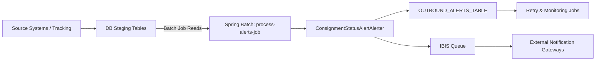

# B2C Notification — Application Architecture

## Purpose
This document explains the overall architecture of the B2C Notification application (B2C-NotificationService). It covers components, module boundaries, configuration, deployment artifacts, and the high-level data flow for processing consignment status updates and generating alerts (email/SMS).

---

## Key Modules & Artifacts
- B2C-NotificationService (main module): contains Spring contexts, Spring Batch job definitions, job launcher scripts, and Java source for alert processing.
  - `process-alerts-job.xml` — primary Spring Batch job definition (job steps, readers/writers/processors)
  - `process-constatuses-job.xml` / `process-consignment-statuses-job.xml` — other job definitions
  - `b2c-common-context.xml` — shared Spring beans, datasource, transaction manager, JMS/IBIS config
  - `process-*.sh` — job startup shell scripts for environment execution
  - `properties/` — properties files (environment-specific settings, email templates paths, IBIS queue names)
- Java classes of interest:
  - `com.tnt.b2c.alert.comm.ConsignmentStatusAlertAlerter` — core alert generation class that converts consignment status events to alert messages
  - `com.tnt.b2c.alert.comm.IbisDataProvider` — adapter/provider for interacting with IBIS queues

## High-Level Flow
1. Source systems (tracking updates, external feeds) write consignment status records to staging tables or place messages on inbound queues.
2. Spring Batch job `process-alerts-job` reads staged status events (via JdbcCursorItemReader or JMS ItemReader) in configured chunk sizes.
3. Each status event is processed by `ConsignmentStatusAlertAlerter` (or a processor chain) which determines if an alert is required (email/SMS) and builds `Alert` objects.
4. Alerts are persisted to an outbound table (for audit and retries) and enqueued to IBIS or JMS for downstream delivery.
5. Outbound dispatchers (email/SMS adapters) consume outbound alerts and call third-party providers.

Mermaid high-level diagram:

## Deployment & Execution
- Packaged as a WAR/JAR and deployed to application servers or executed as a standalone Spring Boot style batch (depending on project setup).
- Jobs are executed via `process-alerts.sh` scripts or scheduled via Control-M/cron.
- Logging and monitoring configured via `ehcache.xml` (caching) and logback/log4j properties in `properties/`.

## Configuration & Properties
- Properties directory includes environment-specific files (e.g., `cct-public.properties`) that supply:
  - DB connection properties
  - IBIS connection details and queue names
  - Email/SMS provider endpoints, credentials, templates
  - Batch chunk sizes, commit intervals
  - Retry counts and backoff policies
- `b2c-common-context.xml` wires shared beans: datasource, transactionManager, mailSender, templateEngine, and beans used by alert processors

## Data Model (conceptual)
- Staging tables containing incoming consignment status events (e.g., `CORECV01`/`COREAV01` style tables)
- `OUTBOUND_ALERTS` — stores generated alerts: `ALERT_ID`, `CONSIGNMENT_ID`, `ALERT_TYPE`, `RECIPIENT`, `STATUS`, `RETRY_COUNT`, `PAYLOAD`, `CREATED_AT`, `SENT_AT`
- Audit/history tables for batch job runs and failures

## Observability
- Job execution logs (step start/stop, counts) emitted by Spring Batch
- Metric records: processed count, alerts generated, send failures
- Outbound alert table used for manual inspection and reprocessing

## References (files scanned in workspace)
- `c:\Users\6687869\Applications\B2C\eai-3533704-business-to-consumer\B2C-Notification\B2C-NotificationService\process-alerts-job.xml`
- `c:\Users\6687869\Applications\B2C\eai-3533704-business-to-consumer\B2C-Notification\B2C-NotificationService\process-consignment-statuses-job.xml`
- `c:\Users\6687869\Applications\B2C\eai-3533704-business-to-consumer\B2C-Notification\B2C-NotificationService\b2c-common-context.xml`
- `c:\Users\6687869\Applications\B2C\eai-3533704-business-to-consumer\B2C-Notification\B2C-NotificationService\src\main\java\com\tnt\b2c\alert\comm\ConsignmentStatusAlertAlerter.java`
- `c:\Users\6687869\Applications\B2C\eai-3533704-business-to-consumer\B2C-Notification\B2C-NotificationService\src\main\java\com\tnt\b2c\alert\comm\IbisDataProvider.java`

---

Next steps: expand the Spring Batch job configuration and per-step call sequences in `02-Spring-Batch-Configuration.md`.