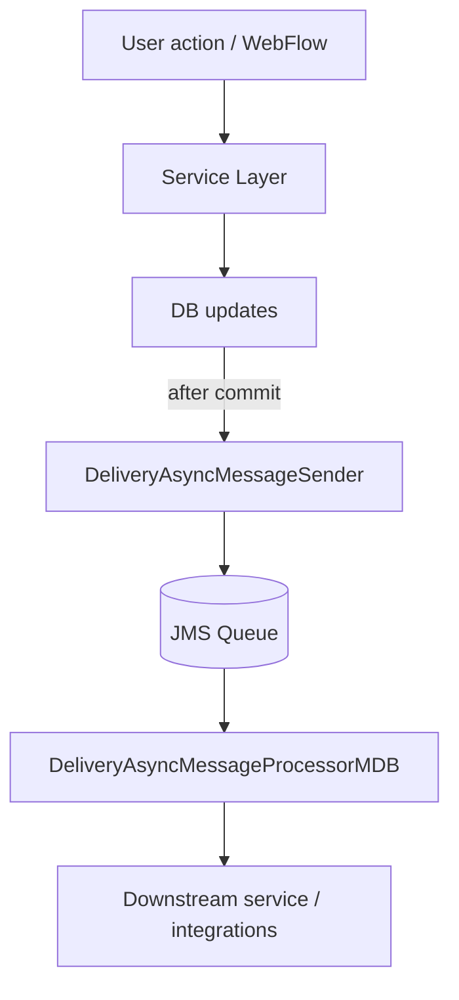

# JMS Async Processing (MyDelivery)

## Purpose
This document describes the asynchronous message processing patterns used by the MyDelivery application: how messages are produced, queued, consumed, and monitored. It includes end-to-end call sequences, transactional considerations, message formats, and operational guidance.

---

## Relevant Files & Classes (scanned)
- `c:\Users\6687869\Applications\MyDelivery\eai-3532120-mydelivery-components\delivery\delivery-async-process\src\main\java\com\tnt\express\domain\delivery\async\DeliveryAsyncMessageSender.java`
- `c:\Users\6687869\Applications\MyDelivery\eai-3532120-mydelivery-components\delivery\delivery-async-process\src\main\java\com\tnt\express\domain\delivery\async\DeliveryAsyncMessageProcessorMDB.java`
- `c:\Users\6687869\Applications\MyDelivery\eai-3532120-mydelivery-components\delivery\delivery-async-process\src\main\resources\delivery-async-process-context.xml`
- `c:\Users\6687869\Applications\MyDelivery\eai-3532120-mydelivery\MyDeliveryPresentation\src\main\webapp\WEB-INF\web.xml` (JMS resource references)


## Overview
- Presentation and service layers use `DeliveryAsyncMessageSender` (or similar sender classes) to enqueue asynchronous messages for downstream processing.
- Queue names are declared in Spring context and sometimes bound via JNDI in `web.xml` or application server config.
- Message Driven Beans (MDBs) such as `DeliveryAsyncMessageProcessorMDB` consume messages and perform downstream work, often calling service layers or external systems.


## Common Message Flow



## Producer Patterns
1. Service performs DB updates inside a transaction.
2. Service registers a transaction synchronization callback (via Spring `TransactionSynchronizationManager`) or uses a JTA/XA transaction so that message sends occur only after successful commit.
3. `DeliveryAsyncMessageSender.sendAsync(payload)` serializes the payload (XML/JSON) and sends it to a configured `javax.jms.Queue` using a `JmsTemplate` or platform-specific API.

Key points:
- Do not send JMS messages before commit unless the JMS provider participates in the same transaction (XA).
- Use correlation IDs and message headers for tracing and idempotency.


## Message Format & Payloads
- Payloads are typically a small wrapper object containing:
  - `messageType` (e.g., REDLIVERY_REQUEST)
  - `correlationId` (e.g., requestId)
  - `payload` (domain-specific data serialized to JSON or XML)
- Example structure (conceptual):
```json
{
  "messageType":"REDLIVERY_REQUEST",
  "correlationId":"REQ12345",
  "payload":{ "consignmentId":"C123", "action":"SEND" }
}
```


## Consumer (MDB) Behavior
- MDBs are configured via `delivery-async-process-context.xml` or application server descriptors.
- Common behavior:
  - Receive message and deserialize payload
  - Perform idempotency checks (skip if already processed)
  - Call service layer methods to perform processing (e.g., notify external systems, update tracking tables)
  - Acknowledge or rollback the JMS transaction depending on processing success


## Method-Level Call Sequence (DeliveryAsyncMessageSender -> MDB)
1. `ServiceLayer.createRedeliveryRequest()` begins transaction
2. DAO updates are performed and persisted
3. `TransactionSynchronizationManager.registerSynchronization(new TransactionSynchronizationAdapter(){ afterCommit(){ deliveryAsyncMessageSender.sendAsync(wrapper); } });`
4. After commit, `DeliveryAsyncMessageSender.sendAsync(AsyncMessageWrapper wrapper)` is invoked
   - Builds JMS Message
   - Sets headers: `JMSCorrelationID`, `MessageType`, `SourceApp`
   - Calls `jmsTemplate.send(queue, messageCreator)`
5. Message arrives on queue; MDB receives message and container starts transaction
6. `DeliveryAsyncMessageProcessorMDB.onMessage(Message msg)` deserializes and calls `deliveryService.processAsyncMessage(wrapper)`
7. Processing completes; MDB acknowledges message (commit) or rolls back on exception


## Error Handling & Redelivery
- MDBs should catch transient exceptions and allow container rollback to trigger provider redelivery.
- Configure redelivery backoff and max attempts in the JMS provider and use DLQ for poison messages.
- Log message details and persist failures in `ASYNC_MESSAGE_LOG` for later analysis.


## Monitoring & Metrics
- Track:
  - Queue depth
  - Consumption rate (messages/min)
  - Average processing time per message
  - DLQ counts
- Correlate message `correlationId` with application logs for troubleshooting.


## Operational Runbook
- If DLQ accumulates: inspect failure reasons and consider republishing after fixes.
- If queue backpressure occurs: scale MDB instances or increase listener threads.
- For message loss: check provider logs and JMS connection factory health.


## JNDI / Server Configuration Examples
Below are concrete examples you can adapt for your application server to bind the JMS ConnectionFactory and Queue used by `DeliveryAsyncMessageSender` and the MDB consumer.

### web.xml resource-ref (portable)
```xml
<!-- Declare a JMS ConnectionFactory and Queue in web.xml so the servlet can look them up via JNDI -->
<resource-ref>
  <res-ref-name>jms/DeliveryConnectionFactory</res-ref-name>
  <res-type>javax.jms.ConnectionFactory</res-type>
  <res-auth>Container</res-auth>
</resource-ref>

<resource-ref>
  <res-ref-name>jms/DeliveryQueue</res-ref-name>
  <res-type>javax.jms.Queue</res-type>
  <res-auth>Container</res-auth>
</resource-ref>
```

### Spring JMS beans (lookup via JNDI)
```xml
<!-- Spring config: look up ConnectionFactory and Queue from JNDI -->
<bean id="jmsConnectionFactory" class="org.springframework.jndi.JndiObjectFactoryBean">
  <property name="jndiName" value="java:comp/env/jms/DeliveryConnectionFactory"/>
</bean>

<bean id="deliveryQueue" class="org.springframework.jndi.JndiObjectFactoryBean">
  <property name="jndiName" value="java:comp/env/jms/DeliveryQueue"/>
</bean>

<bean id="jmsTemplate" class="org.springframework.jms.core.JmsTemplate">
  <property name="connectionFactory" ref="jmsConnectionFactory"/>
  <property name="defaultDestination" ref="deliveryQueue"/>
  <!-- Use pubSubDomain=false for queues -->
</bean>
```

### WebLogic example (server-side resource)
- Configure a JMS Module in the WebLogic Admin Console:
  - Module name: `MYD1_JMS_MODULE`
  - ConnectionFactory JNDI: `jms/DeliveryConnectionFactory` → target server(s)
  - Queue JNDI: `jms/DeliveryQueue` (actual physical JNDI: `jms/MYD1.INOU1P.SRVQ`)
- In `web.xml` use the `java:comp/env` reference as shown above.

### JBoss / WildFly example (standalone.xml snippet)
```xml
<subsystem xmlns="urn:jboss:domain:messaging-activemq:7.0">
  <server name="default">
    <jms-destinations>
      <jms-queue name="DeliveryQueue">
        <entry name="java:/jms/queue/DeliveryQueue"/>
      </jms-queue>
    </jms-destinations>
    <connection-factories>
      <connection-factory name="InVmConnectionFactory">
        <entries>
          <entry name="java:/ConnectionFactory"/>
        </entries>
      </connection-factory>
    </connection-factories>
  </server>
</subsystem>
```
- In Spring use `jndiName=java:/jms/queue/DeliveryQueue` if binding to global JNDI.

### WebSphere example (admin console mapping)
- Create JMS connection factory and queue via the WebSphere console and map the JNDI names to `jms/DeliveryConnectionFactory` and `jms/DeliveryQueue`.
- Optionally use activation spec for MDB configuration with `resourceAdapter` and auth alias.

### MDB / Activation Spec (EJB 3 / resource adapter example)
```xml
<!-- Example: activation spec snippet for MDB in ejb-jar.xml or server-specific descriptor -->
<activation-config>
  <activation-config-property>
    <activation-config-property-name>destinationJndiName</activation-config-property-name>
    <activation-config-property-value>jms/DeliveryQueue</activation-config-property-value>
  </activation-config-property>
  <activation-config-property>
    <activation-config-property-name>destinationType</activation-config-property-name>
    <activation-config-property-value>javax.jms.Queue</activation-config-property-value>
  </activation-config-property>
</activation-config>
```

### XA / Transactional Notes
- If you need JMS sends to participate in the same DB transaction use an XA-capable ConnectionFactory and a JTA transaction manager (e.g., `org.springframework.transaction.jta.JtaTransactionManager`).
- Otherwise use the outbox pattern: persist outbound record, and send JMS after commit via `TransactionSynchronizationManager`.

### Example server-specific naming mapping (recommended)
- WebLogic physical JNDI: `jms/MYD1.INOU1P.SRVQ`
- App-level resource-ref (web.xml): `java:comp/env/jms/DeliveryQueue`
- Spring JNDI lookup: `java:comp/env/jms/DeliveryQueue` (portable) or `java:/jms/queue/DeliveryQueue` (WildFly global)


## Example: full lifecycle mapping (summary)
1. Admin Console / server config: bind physical queue `jms/MYD1.INOU1P.SRVQ` and ConnectionFactory
2. `web.xml`: declare `resource-ref` for `jms/DeliveryQueue` and `jms/DeliveryConnectionFactory`
3. Spring: `JndiObjectFactoryBean` looks up resources and wires `JmsTemplate`
4. Application: `DeliveryAsyncMessageSender` uses `JmsTemplate.send(...)`
5. Server MDB `DeliveryAsyncMessageProcessorMDB` configured to listen on `jms/DeliveryQueue` receives messages


## Extracted Classes & Key Methods (from workspace)

### AsyncMessageWrapper
Path: `eai-3532120-mydelivery-components/delivery/delivery-async-process/src/main/java/com/tnt/express/domain/delivery/async/AsyncMessageWrapper.java`
```java
public class AsyncMessageWrapper {
  private AsyncMessageSelector asyncMessageSelector;
  private DeliveryConsignmentUpdate deliveryConsignmentUpdate;
  private DeliveryNotificationBean deliveryNotificationBean;

  public AsyncMessageSelector getAsyncMessageSelector() { ... }
  public void setAsyncMessageSelector(AsyncMessageSelector asyncMessageSelector) { ... }
  public DeliveryConsignmentUpdate getDeliveryConsignmentUpdate() { ... }
  public void setMyDeliveryConsignmentUpdate(DeliveryConsignmentUpdate deliveryConsignmentUpdate) { ... }
  public DeliveryNotificationBean getDeliveryNotificationBean() { ... }
  public void setDeliveryNotificationBean(DeliveryNotificationBean deliveryNotificationBean) { ... }
}
```

### DeliveryAsyncMessageSender
Path: `eai-3532120-mydelivery-components/delivery/delivery-async-process/.../DeliveryAsyncMessageSender.java`
Key methods and fields:
```java
@Resource(name = "putConnectionFactory")
private QueueConnectionFactory queueFactory;

@Resource(name = "putQueue")
private Queue putQueue;

public void sendConsignmentUpdateToConService(DeliveryConsignmentUpdate update, AsyncMessageSelector selector) { ... }
public void sendDeliveryNotification(DeliveryNotificationBean bean, AsyncMessageSelector selector) { ... }

// internal helpers
private void createAndPutMessage(AsyncMessageSelector messageSelector, Object messageBody) { ... }
private void initialize() { // creates QueueConnection, QueueSession, QueueSender }
private void cleanup() { // closes session and connection }
```
Notes: implementation uses XStream to serialize AsyncMessageWrapper to XML and sends as `TextMessage` via `QueueSender`.

### DeliveryAsyncMessageProcessorMDB
Path: `eai-3532120-mydelivery-components/delivery/delivery-async-process/.../DeliveryAsyncMessageProcessorMDB.java`
Key behavior and methods:
```java
public class DeliveryAsyncMessageProcessorMDB extends AbstractMessageDrivenBean implements MessageListener {
  private ConsignmentUpdater consignmentUpdater;
  private NotificationSender notificationSender;

  public void onMessage(Message message) {
    // reads TextMessage, deserializes to AsyncMessageWrapper via XStream
    // switch on messageBody.getAsyncMessageSelector():
    //   REQUEST_REDELIVERY, CONFIRM_REDELIVERY, etc -> consignmentUpdater.updateConsignment(...)
    //   NOTIFICATION_SENDER -> notificationSender.sendDeliveryNotification(...)
  }

  // bean lifecycle hooks to wire Spring beans
  public void setMessageDrivenContext(MessageDrivenContext mdc) { ... setBeanFactoryLocator(...) }
  protected void onEjbCreate() { ... setSpringBeans(); }
  private void setSpringBeans() {
    BeanFactory springBeanFactory = getBeanFactory();
    consignmentUpdater = (ConsignmentUpdater) springBeanFactory.getBean("delivery_async_ConsignmentUpdater");
    notificationSender = (NotificationSender) springBeanFactory.getBean("delivery_async_NotificationSender");
  }
}
```

Notes:
- MDB deserializes XStream XML into AsyncMessageWrapper and delegates to Spring beans obtained from `businessBeanFactory`.
- Exceptions thrown during processing will cause container-managed rollback/redelivery according to JMS provider configuration.


## Exact Method Excerpts (MyDelivery)
Below are verbatim excerpts from the implementation to help developers map runtime behaviour to code. Paths are included to find the full implementations.

- `DeliveryAsyncMessageSender.createAndPutMessage(...)` (excerpt)

```java
// Path: eai-3532120-mydelivery-components/delivery/delivery-async-process/.../DeliveryAsyncMessageSender.java
private void createAndPutMessage(AsyncMessageSelector messageSelector, Object messageBody) {
    try {
        // Create queue connection and session.
        initialize();

        XStream xstream = new XStream();
        AsyncMessageWrapper asyncMessageWrapper = new AsyncMessageWrapper();

        asyncMessageWrapper.setAsyncMessageSelector(messageSelector);

        // Check the messageBody.
        if (messageBody instanceof DeliveryConsignmentUpdate) {
            asyncMessageWrapper.setMyDeliveryConsignmentUpdate((DeliveryConsignmentUpdate) messageBody);
        } else if (messageBody instanceof DeliveryNotificationBean) {
            asyncMessageWrapper.setDeliveryNotificationBean((DeliveryNotificationBean) messageBody);
        }

        TextMessage textMessage = null;
        try {
            textMessage = queueSession.createTextMessage();
        } catch (JMSException jmsException) {
            throw new RuntimeException("Unable to create text message.", jmsException);
        }
        try {
            textMessage.setText(xstream.toXML(asyncMessageWrapper));
        } catch (JMSException jmsException) {
            throw new RuntimeException("Unable to set message text.", jmsException);
        } catch (XStreamException xstreamException) {
            throw new RuntimeException("Unable to serialize object to xml text message.", xstreamException);
        }
        try {
            queueSender.send(textMessage);
        } catch (JMSException jmsException) {
            throw new RuntimeException("Unable to send text message.", jmsException);
        }
        logMessage("Sending text message.");
    } finally {
        // Close queue session and connection.
        cleanup();
    }
}
```

- `DeliveryAsyncMessageSender.initialize()` (excerpt)

```java
private void initialize() {
    // create putQueue queueConnection
    try {
        queueConnection = queueFactory.createQueueConnection();

    } catch (JMSException jmsException) {
        throw new RuntimeException("Unable to create putQueue queueConnection.", jmsException);
    }
    // create putQueue queueSession
    try {
        queueSession = queueConnection.createQueueSession(false, QueueSession.AUTO_ACKNOWLEDGE);
    } catch (JMSException jmsException) {
        throw new RuntimeException("Unable to create putQueue queueSession.", jmsException);
    }
    // create queueSender
    try {
        queueSender = queueSession.createSender(putQueue);
    } catch (JMSException jmsException) {
        throw new RuntimeException("Unable to create putQueue queueSender.", jmsException);
    }
}
```

- `DeliveryAsyncMessageSender.cleanup()` (excerpt)

```java
private void cleanup() {
    try {
        queueSession.close();
    } catch (JMSException jmsException) {
        throw new RuntimeException("Unable to close queueSession.", jmsException);
    }
    try {
        queueConnection.close();
    } catch (JMSException jmsException) {
        throw new RuntimeException("Unable to close queueConnection.", jmsException);
    }
    queueSession = null;
    queueConnection = null;
}
```

- `DeliveryAsyncMessageProcessorMDB.onMessage(...)` (excerpt)

```java
// Path: eai-3532120-mydelivery-components/delivery/delivery-async-process/.../DeliveryAsyncMessageProcessorMDB.java
public void onMessage(javax.jms.Message message) {
    if (message instanceof TextMessage) {
        // Get the xml text from the message.
        String xmlMessage = getXmlTextMessage(message);

        // Get the message body (convert xml to object).
        AsyncMessageWrapper messageBody = getMessageBody(message, xmlMessage);

        // Do the actual processing.
        if (messageBody.getAsyncMessageSelector() != null) {
            switch (messageBody.getAsyncMessageSelector()) {
            case REQUEST_REDELIVERY:
            case CONFIRM_REDELIVERY:
            case CONFIRM_REDELIVERY_WITH_ADDRESS_CHANGE:
                if (!ValidationUtils.isNullOrEmpty(messageBody.getDeliveryConsignmentUpdate())) {
                    consignmentUpdater.updateConsignment(messageBody.getDeliveryConsignmentUpdate(), messageBody.getAsyncMessageSelector());
                    logMessage("sendConsignmentStatusToConService after get from getQueue for con-id "
                            + messageBody.getDeliveryConsignmentUpdate().getConNumber());
                } else {
                    throw new RuntimeException("Unable to process message: no myDeliveryConsignmentUpdate available.");
                }
                break;
            case NOTIFICATION_SENDER:
                if (!ValidationUtils.isNullOrEmpty(messageBody.getDeliveryNotificationBean())) {
                    notificationSender.sendDeliveryNotification(messageBody.getDeliveryNotificationBean());
                    logMessage("sendDeliveryConfirmationMail after get from getQueue for con-id "
                            + messageBody.getDeliveryNotificationBean().getLegacyConsignmentId());
                } else {
                    throw new RuntimeException("Unable to process message: no deliveryNotificationBean available.");
                }
                break;
            default:
                break;
            }
        } else {
            throw new RuntimeException("Unable to process message: no message selector available.");
        }
    }
}
```


## DLQ / Republishing Runbook
This section provides operational guidance and a simple utility pattern to identify, extract and republish messages from a Dead Letter Queue (DLQ) or an outbound log table. Adapt JNDI names, table names and credentials for your environment.

### 1) Identify problematic messages
- Inspect JMS provider console for DLQ entries and note `JMSMessageID` and redelivery count.
- If messages are persisted into a DB log table (`ASYNC_MESSAGE_LOG` or `OUTBOUND_ALERTS`), run the following SQL to inspect recent failed messages:

```sql
SELECT id, message_type, correlation_id, payload, status, failure_reason, created_at
FROM ASYNC_MESSAGE_LOG
WHERE status = 'FAILED'
ORDER BY created_at DESC
LIMIT 100;
```

If there is no table, export the message payload from the JMS console (many providers allow message view/export).

### 2) Republishing approach (recommended)
- Prefer republishing via a small standalone Java utility that reads the exported XML/DB rows and sends them to the destination queue using the same JMS connection factory as the application. This keeps header mapping and encoding consistent.
- The republish utility should support a dry-run mode, logging, and optional header mapping (preserve or set new `JMSCorrelationID`).

Example Java republish utility (conceptual):
```java
// RepublishTool.java - simple JMS publisher
public class RepublishTool {
  public static void main(String[] args) throws Exception {
    String jndiFactory = System.getProperty("jndi.factory");
    String connectionFactoryJndi = System.getProperty("jndi.cf");
    String queueJndi = System.getProperty("jndi.queue");
    // look up ConnectionFactory and Queue via JNDI
    // open Connection, Session
    // read messages from input file or DB
    // for each payload -> create TextMessage, set JMSCorrelationID if provided, send
    // close resources
  }
}
```
Run example (PowerShell):

```powershell
# build and run republisher
java -jar republish-tool.jar -Dspring.profiles.active=prod -Djndi.cf=java:comp/env/jms/DeliveryConnectionFactory -Djndi.queue=java:comp/env/jms/DeliveryQueue -DinputFile=failed_messages.json
```

### 3) Quick manual republish via JMS provider tools
- WebLogic: use JMS console to move messages from DLQ to destination queue or export/import using WLST scripts.
- JBoss/WildFly: use `jms-queue` commands in `jboss-cli.sh` to browse and move messages.
- WebSphere: use the admin console or `dvsadmin` utilities to move messages.

### 4) Safety checks before republishing
- Verify message payload does not contain stale timestamps or duplicate IDs that downstream systems will reject.
- Update correlation IDs or add a republish flag in the payload if downstream idempotency relies on it.
- Run small batch first and validate downstream processing, then proceed with larger batches.

### 5) Post-republish actions
- Monitor MDB logs and downstream systems for any errors.
- Move successfully republished rows in `ASYNC_MESSAGE_LOG` to `REPROCESSED` status with an audit entry.


## Useful SQL and Queries
- Find messages enqueued in a time window:
```sql
SELECT id, correlation_id, created_at
FROM OUTBOUND_ALERTS
WHERE created_at > sysdate - (1/24) -- last hour
ORDER BY created_at desc;
```

- Requeue a DB-backed message (conceptual):
```sql
UPDATE OUTBOUND_ALERTS SET status = 'QUEUED', retry_count = 0 WHERE id = :id;
```
