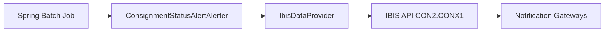

# IBIS Queue Integration

## Purpose
This document provides an end-to-end view of IBIS queue integration across MyDelivery and B2C systems. It explains where IBIS is used, message formats, connection patterns, and operational practices observed in the codebase.

---

## Overview
- IBIS is used as an enterprise integration messaging layer in the landscape. Two primary integration patterns were found:
  1. B2C uses an IBIS API endpoint `CON2.CONX1` with classes like `ConsignmentStatusAlertAlerter` and `IbisDataProvider` to prepare and send messages.
  2. MyDelivery uses JMS queues with names like `MYD1.INOU1P/SRVQ` via `DeliveryAsyncMessageSender` and MDB consumers.
- Messages sent to IBIS are typically XML blocks conforming to the enterprise contract, with headers for routing and a payload containing alert or consignment data.

## Integration Points (Files Referenced)
- B2C Notification:
  - `c:\Users\6687869\Applications\B2C\eai-3533704-business-to-consumer\B2C-Notification\B2C-NotificationService\process-alerts-job.xml`
  - `c:\Users\6687869\Applications\B2C\eai-3533704-business-to-consumer\B2C-Notification\B2C-NotificationService\b2c-common-context.xml`
  - `c:\Users\6687869\Applications\B2C\eai-3533704-business-to-consumer\B2C-Notification\B2C-NotificationService\src\main\java\com\tnt\b2c\alert\comm\ConsignmentStatusAlertAlerter.java`
  - `c:\Users\6687869\Applications\B2C\eai-3533704-business-to-consumer\B2C-Notification\B2C-NotificationService\src\main\java\com\tnt\b2c\alert\comm\IbisDataProvider.java`
- MyDelivery:
  - `c:\Users\6687869\Applications\MyDelivery\eai-3532120-mydelivery-components\delivery\delivery-async-process\src\main\resources\delivery-async-process-context.xml`
  - `c:\Users\6687869\Applications\MyDelivery\eai-3532120-mydelivery-components\delivery\delivery-async-process\src\main\java\com\tnt\express\domain\delivery\async\DeliveryAsyncMessageSender.java`
  - `c:\Users\6687869\Applications\MyDelivery\eai-3532120-mydelivery-components\delivery\delivery-async-process\src\main\java\com\tnt\express\domain\delivery\async\DeliveryAsyncMessageProcessorMDB.java`

## Message Contracts
- IBIS messages include header metadata and a body (often XML wrapped inside CDATA or base64 when including binary data).
- Use correlation IDs to trace across systems.

## Sending Patterns
- B2C batch jobs may send IBIS messages directly via an IBIS API (synchronous API call) or via JMS into an IBIS inbound queue.
- MyDelivery uses JMS template to enqueue messages that are eventually consumed and forwarded to IBIS or downstream systems.

## Example Message Flow (B2C)

## Transactional Considerations
- When using IBIS API (synchronous), ensure idempotency at the processor to avoid duplicates on retry.
- When using JMS, follow the outbox pattern: write outbound DB record first, then enqueue message after commit.

## Operational Notes
- Maintain mapping of IBIS queue names to business functions in a central registry
- Use Dead Letter Queues and monitoring for undelivered messages

## References
- `Docs/IBIS_Queue_Usage_Analysis.md` — deeper IBIS analysis and diagrams
- B2C and MyDelivery source files referenced above

---

Next: extract IBIS XML schema samples and code snippets from `IbisDataProvider` and `ConsignmentStatusAlertAlerter` on request.