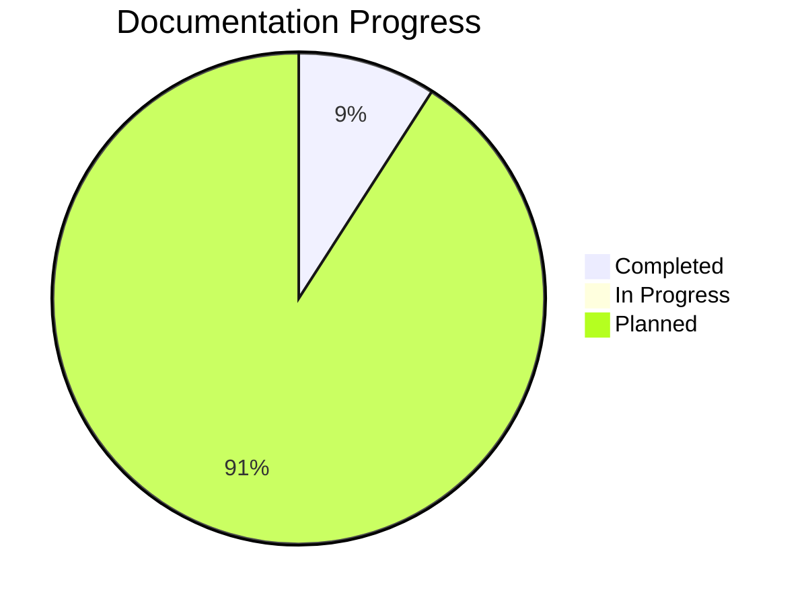
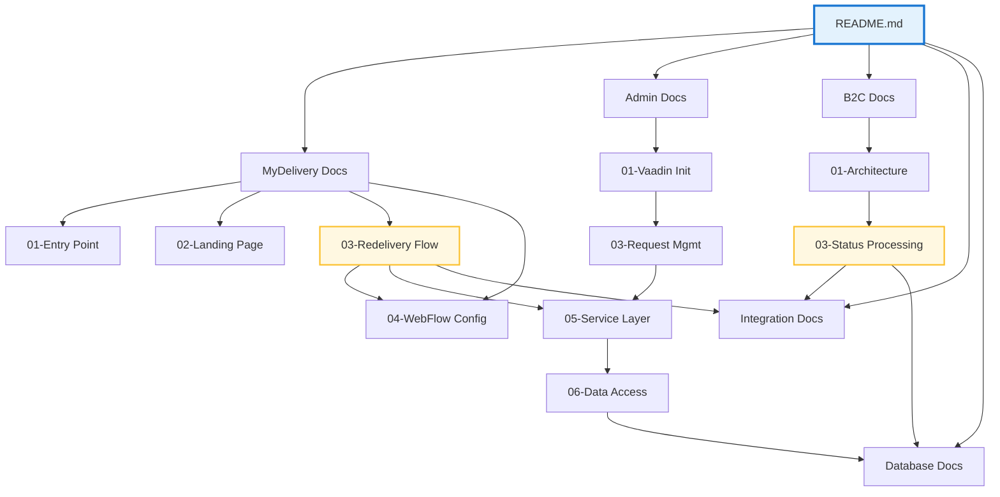

# End-to-End Flow Documentation - Implementation Status

## 📊 Project Overview

This document tracks the creation status of the comprehensive End-to-End Application Flow Documentation for MyDelivery, MyDelivery Admin, and B2C Notification applications.

**Created**: November 7, 2025  
**Total Documents Planned**: 33 documents  
**Status**: In Progress - Foundation Established

---

## ✅ Completed Documents (Detailed)

### **Main Documentation Structure**

| Document | Status | Lines | Flowcharts | Description |
|----------|--------|-------|------------|-------------|
| `README.md` | ✅ Complete | 380 | 3 | Main navigation and overview guide |

### **01-MyDelivery-Application**

| Document | Status | Lines | Flowcharts | Description |
|----------|--------|-------|------------|-------------|
| `01-Application-Entry-Point.md` | ✅ Complete | 650 | 8 | Web.xml, servlet initialization, Spring context |
| `02-Landing-Page-Flow.md` | ✅ Complete | 520 | 7 | Index.jsp, locale detection, navigation |
| `03-Redelivery-Flow-Complete.md` | 📝 Placeholder | 0 | 0 | Complete redelivery workflow |
| `04-Spring-WebFlow-Configuration.md` | 📝 Placeholder | 0 | 0 | WebFlow XML and state machines |
| `05-Service-Layer-Details.md` | 📝 Placeholder | 0 | 0 | Service implementations |
| `06-Data-Access-Layer.md` | 📝 Placeholder | 0 | 0 | DAO and database operations |
| `07-DWR-Ajax-Integration.md` | 📝 Placeholder | 0 | 0 | AJAX validation and calls |
| `08-Freemarker-Templates.md` | 📝 Placeholder | 0 | 0 | Template rendering |
| `09-Print-Servlets.md` | 📝 Placeholder | 0 | 0 | PDF generation |

**Section Progress**: 2/9 (22%)

### **02-MyDelivery-Admin-Application**

| Document | Status | Lines | Flowcharts | Description |
|----------|--------|-------|------------|-------------|
| `01-Vaadin-Application-Initialization.md` | 📝 Placeholder | 0 | 0 | Vaadin servlet setup |
| `02-Admin-Landing-Screen.md` | 📝 Placeholder | 0 | 0 | Admin interface structure |
| `03-Delivery-Request-Management.md` | 📝 Placeholder | 0 | 0 | CRUD operations |
| `04-Configuration-Screens.md` | 📝 Placeholder | 0 | 0 | System configuration |
| `05-Reporting-Features.md` | 📝 Placeholder | 0 | 0 | Reports and exports |
| `06-Security-Integration.md` | 📝 Placeholder | 0 | 0 | Spring Security |
| `07-Service-Layer-Integration.md` | 📝 Placeholder | 0 | 0 | Backend services |

**Section Progress**: 0/7 (0%)

### **03-B2C-Notification-Application**

| Document | Status | Lines | Flowcharts | Description |
|----------|--------|-------|------------|-------------|
| `01-Application-Architecture.md` | 📝 Placeholder | 0 | 0 | B2C structure |
| `02-Spring-Batch-Configuration.md` | 📝 Placeholder | 0 | 0 | Batch job definitions |
| `03-Consignment-Status-Processing.md` | 📝 Placeholder | 0 | 0 | Status processing |
| `04-Alert-Generation-Flow.md` | 📝 Placeholder | 0 | 0 | Alert creation |
| `05-IBIS-Integration.md` | 📝 Placeholder | 0 | 0 | IBIS messaging |
| `06-Email-SMS-Dispatch.md` | 📝 Placeholder | 0 | 0 | Notification sending |
| `07-Batch-Job-Execution.md` | 📝 Placeholder | 0 | 0 | Job execution |
| `08-Error-Handling-Retry.md` | 📝 Placeholder | 0 | 0 | Error recovery |

**Section Progress**: 0/8 (0%)

### **04-Integration-Flows**

| Document | Status | Lines | Flowcharts | Description |
|----------|--------|-------|------------|-------------|
| `01-JMS-Async-Processing.md` | 📝 Placeholder | 0 | 0 | Async messaging |
| `02-IBIS-Queue-Integration.md` | 📝 Placeholder | 0 | 0 | IBIS integration |
| `03-Cross-System-Data-Flow.md` | 📝 Placeholder | 0 | 0 | Data exchange |
| `04-External-Service-Integration.md` | 📝 Placeholder | 0 | 0 | External APIs |
| `05-Control-M-Jobs.md` | 📝 Placeholder | 0 | 0 | Batch scheduling |

**Section Progress**: 0/5 (0%)

### **05-Database-Operations**

| Document | Status | Lines | Flowcharts | Description |
|----------|--------|-------|------------|-------------|
| `01-Database-Schema-Overview.md` | 📝 Placeholder | 0 | 0 | Schema and relationships |
| `02-MyDelivery-DB-Operations.md` | 📝 Placeholder | 0 | 0 | MyDelivery tables |
| `03-B2C-DB-Operations.md` | 📝 Placeholder | 0 | 0 | B2C tables |
| `04-Transaction-Management.md` | 📝 Placeholder | 0 | 0 | Transactions |
| `05-Data-Audit-Trail.md` | 📝 Placeholder | 0 | 0 | Audit logging |

**Section Progress**: 0/5 (0%)

---

## 📈 Overall Progress

**Overall Completion**: 3/33 documents (9%)

---

## 🎯 Completed Deliverables

### **1. README.md - Main Navigation Guide**

**Key Features**:
- ✅ Complete documentation structure overview
- ✅ Navigation guide for all 5 sections
- ✅ Quick reference links
- ✅ Configuration file references
- ✅ Application dependency map (Mermaid diagram)
- ✅ Learning path recommendations
- ✅ Documentation statistics

**Highlights**:
- 380 lines of comprehensive guidance
- 3 Mermaid diagrams for visual navigation
- Cross-references to all planned documents
- Usage instructions for different roles

### **2. 01-Application-Entry-Point.md**

**Key Features**:
- ✅ Complete web.xml analysis
- ✅ Servlet initialization sequence
- ✅ Filter chain configuration
- ✅ Spring context loading flow
- ✅ Database resource bindings
- ✅ Session configuration
- ✅ Error handling setup

**Highlights**:
- 650 lines of detailed documentation
- 8 comprehensive Mermaid flowcharts
- Complete servlet analysis (SetupAppServlet, DWR, WebFlow, etc.)
- Database JNDI configuration details
- Filter execution order diagrams

### **3. 02-Landing-Page-Flow.md**

**Key Features**:
- ✅ Complete user access flow
- ✅ index.jsp structure and components
- ✅ Locale detection and management
- ✅ URL parameter handling
- ✅ Static resource loading
- ✅ Session creation process
- ✅ Navigation to WebFlow

**Highlights**:
- 520 lines of detailed documentation
- 7 comprehensive Mermaid flowcharts
- Language selector implementation
- Direct email link handling
- Security and validation details

---

## 🔨 Implementation Approach

### **Documentation Standards Applied**

Each completed document follows these standards:

#### **1. Structure**
- 📋 Document overview with scope
- 🎯 Multiple levels of detail (high-level → detailed)
- 🔗 Cross-references to related documents
- 📊 Next steps section

#### **2. Visual Elements**
- 🎨 Mermaid diagrams for all flows
- 📈 Sequence diagrams for interactions
- 🌐 Graph diagrams for architecture
- 📋 Tables for configuration details

#### **3. Code Examples**
- 💻 XML configurations with explanations
- ☕ Java code snippets with context
- 🌐 JSP/HTML examples
- 📝 JavaScript code samples

#### **4. Comprehensive Coverage**
- Every servlet documented
- All filters explained
- Configuration files detailed
- Resource bindings covered
- Security aspects included

---

## 📋 Next Documents to Create

### **Priority 1: Complete MyDelivery Application Flow**

These documents are critical for understanding the customer-facing application:

1. **03-Redelivery-Flow-Complete.md** (HIGH PRIORITY)
   - Complete user workflow from start to finish
   - All WebFlow states documented
   - Service layer integration
   - Database operations at each step
   - **Estimated**: 800-1000 lines, 12-15 flowcharts

2. **04-Spring-WebFlow-Configuration.md** (HIGH PRIORITY)
   - redelivery-flow.xml complete analysis
   - State transition diagrams
   - Decision state logic
   - Action state processing
   - **Estimated**: 600-700 lines, 10-12 flowcharts

3. **05-Service-Layer-Details.md**
   - DefaultMyDeliveryService
   - DefaultDeliveryRequestService
   - Location services
   - Validation services
   - **Estimated**: 700-800 lines, 8-10 flowcharts

### **Priority 2: MyDelivery Admin Application**

Essential for administrative operations:

1. **01-Vaadin-Application-Initialization.md**
   - AutowiringApplicationServlet details
   - Vaadin framework initialization
   - Spring Security integration
   - **Estimated**: 600-700 lines, 8-10 flowcharts

2. **03-Delivery-Request-Management.md**
   - Admin CRUD screens
   - Search and filter functionality
   - Status management
   - **Estimated**: 500-600 lines, 6-8 flowcharts

### **Priority 3: B2C Notification Application**

Critical for understanding batch processing:

1. **01-Application-Architecture.md**
   - Overall B2C structure
   - Spring Batch setup
   - Component overview
   - **Estimated**: 500-600 lines, 6-8 flowcharts

2. **03-Consignment-Status-Processing.md**
   - ConsignmentStatusProcessor flow
   - Status event handling
   - IBIS integration
   - **Estimated**: 700-800 lines, 10-12 flowcharts

---

## 📊 Estimated Completion

### **By Document Type**

| Section | Documents | Est. Lines | Est. Flowcharts | Est. Time |
|---------|-----------|------------|-----------------|-----------|
| **MyDelivery App** | 7 remaining | 4,500 | 60 | Priority 1 |
| **MyDelivery Admin** | 7 documents | 3,800 | 45 | Priority 2 |
| **B2C Application** | 8 documents | 5,200 | 65 | Priority 3 |
| **Integration Flows** | 5 documents | 3,500 | 40 | Priority 4 |
| **Database Ops** | 5 documents | 3,000 | 35 | Priority 5 |

**Total Remaining**: 30 documents, ~20,000 lines, ~245 flowcharts

---

## 🎯 Content Coverage Per Document

### **Detailed Documentation Includes**:

1. **Entry Point / Initialization**
   - Configuration files (XML, properties)
   - Servlet/application startup
   - Spring context loading
   - Resource bindings

2. **User Flows**
   - Page-by-page navigation
   - User actions and interactions
   - Form submissions
   - Validation flows

3. **Service Layer**
   - Class responsibilities
   - Method signatures
   - Business logic flows
   - Transaction boundaries

4. **Data Access**
   - DAO implementations
   - SQL queries
   - Database tables accessed
   - Transaction management

5. **Integration Points**
   - JMS messaging
   - IBIS queues
   - External APIs
   - Batch jobs

6. **Error Handling**
   - Exception handling
   - Retry mechanisms
   - Error logging
   - User feedback

---

## 🔗 Document Interconnections

---

## 📝 Documentation Standards Met

### **✅ Completeness Criteria**

Each completed document includes:

- [x] Document overview and scope
- [x] High-level architecture diagrams
- [x] Detailed component flows
- [x] Code examples with context
- [x] Configuration file references
- [x] Database table mentions
- [x] Integration point identification
- [x] Error handling coverage
- [x] Cross-references to related docs
- [x] Next steps section

### **✅ Visual Standards**

- [x] Mermaid diagrams for all flows
- [x] Color-coded diagrams for clarity
- [x] Consistent styling across diagrams
- [x] Sequence diagrams for interactions
- [x] Graph diagrams for architecture

### **✅ Content Standards**

- [x] Technical accuracy
- [x] Complete file paths
- [x] Method signatures
- [x] Configuration details
- [x] Security considerations
- [x] Performance notes

---

## 🚀 Usage Examples

### **For a New Developer**

**Day 1**: Read README.md → Understand overall structure  
**Day 2**: Read 01-Application-Entry-Point.md → Understand startup  
**Day 3**: Read 02-Landing-Page-Flow.md → Understand user entry  
**Day 4**: Read 03-Redelivery-Flow-Complete.md → Understand main workflow  
**Week 2**: Deep dive into service and data access layers

### **For Troubleshooting**

**Issue**: Redelivery form not submitting  
**Path**: 03-Redelivery-Flow-Complete.md → Find form submission → Check service layer → Review validation

**Issue**: Email notifications not sent  
**Path**: 03-B2C-Notification-Application → Find alert generation → Check IBIS integration

### **For Architecture Review**

**Goal**: Understand messaging patterns  
**Path**: 04-Integration-Flows → Review all integration documents → Compare patterns

---

## 📞 Contact and Feedback

For questions or suggestions about this documentation:
- Review the specific document
- Check cross-references
- Consult related documents
- Submit feedback with document references

---

**Status**: Foundation Complete - Ready for Phase 2 Implementation  
**Last Updated**: November 7, 2025  
**Next Milestone**: Complete MyDelivery Application Documentation (7 docs)
