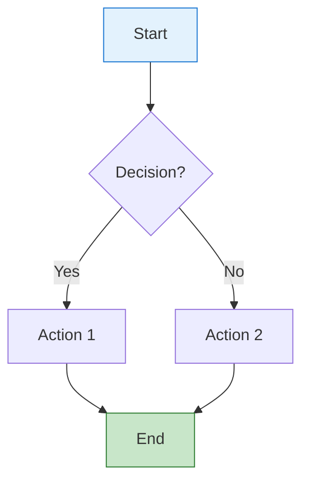
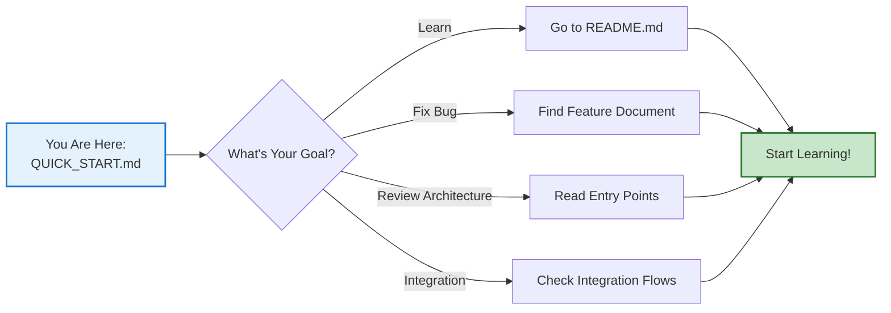

# 🚀 Quick Start Guide

## Welcome to End-to-End Flow Documentation!

This guide helps you quickly navigate and use the comprehensive application flow documentation.

---

## 📍 You Are Here

```
End-to-End-Flow-Documentation/
├── README.md ← Master navigation guide
├── QUICK_START.md ← YOU ARE HERE
├── PROJECT_SUMMARY.md ← What's been created
└── IMPLEMENTATION_STATUS.md ← Detailed progress tracking
```

---

## 🎯 What Do You Need?

### **1. I'm New to the Applications**

**Start Here** → `README.md`  
**Then Read**:
1. `01-MyDelivery-Application/01-Application-Entry-Point.md`
2. `01-MyDelivery-Application/02-Landing-Page-Flow.md`
3. Continue with your specific application

**Time Needed**: 30-45 minutes

---

### **2. I Need to Fix a Bug**

**Quick Path**:
1. Find your application in `README.md`
2. Identify the feature/component
3. Go to relevant document
4. Follow flowcharts to locate issue

**Example**:
- **Bug**: Redelivery form not submitting  
- **Document**: `01-MyDelivery-Application/03-Redelivery-Flow-Complete.md` (coming soon)
- **Section**: Form submission flow

---

### **3. I'm Doing Architecture Review**

**Start Here** → `README.md` → Application Dependency Map  
**Then Review**:
- Section 01: MyDelivery Architecture
- Section 02: Admin Architecture  
- Section 03: B2C Architecture
- Section 04: Integration Patterns
- Section 05: Database Design

**Time Needed**: 2-3 hours for complete overview

---

### **4. I Need Integration Details**

**Go To**: `04-Integration-Flows/`
- `01-JMS-Async-Processing.md` - Message queues
- `02-IBIS-Queue-Integration.md` - IBIS messaging  
- `03-Cross-System-Data-Flow.md` - Data exchange
- `04-External-Service-Integration.md` - External APIs
- `05-Control-M-Jobs.md` - Batch jobs

---

### **5. I Need Database Info**

**Go To**: `05-Database-Operations/`
- `01-Database-Schema-Overview.md` - All tables
- `02-MyDelivery-DB-Operations.md` - MyDelivery tables
- `03-B2C-DB-Operations.md` - B2C tables

**Also See**: `../Database_Tables_Detail.md` (already created)

---

## 📚 Document Status

### ✅ **Complete** (Read Now!)

| Document | Description | Lines | Diagrams |
|----------|-------------|-------|----------|
| `README.md` | Master navigation | 380 | 3 |
| `01-MyDelivery-Application/01-Application-Entry-Point.md` | App initialization | 650 | 8 |
| `01-MyDelivery-Application/02-Landing-Page-Flow.md` | Landing page | 520 | 7 |

### 📝 **Coming Soon** (Placeholders Created)

29 documents planned covering:
- Complete user workflows
- Service layer details
- Admin interface
- B2C batch processing
- Integration flows
- Database operations

**See**: `IMPLEMENTATION_STATUS.md` for full list

---

## 🎨 How to Read the Diagrams

### **Mermaid Flowcharts**



**Colors**:
- 🔵 **Blue**: Start points, user interfaces
- 🟢 **Green**: Success, completion
- 🟡 **Yellow**: Processing, services
- 🟠 **Orange**: Configuration, middleware
- 🔴 **Red**: Errors, failures

---

## 📖 Reading Order by Role

### **Java Developer (Backend)**

1. `01-Application-Entry-Point.md` - Understand startup
2. `05-Service-Layer-Details.md` - Service implementations
3. `06-Data-Access-Layer.md` - Database operations
4. `04-Transaction-Management.md` - Transaction boundaries

### **Frontend Developer**

1. `02-Landing-Page-Flow.md` - User interface
2. `03-Redelivery-Flow-Complete.md` - User workflows
3. `07-DWR-Ajax-Integration.md` - AJAX calls
4. `08-Freemarker-Templates.md` - Templates

### **DevOps Engineer**

1. `01-Application-Entry-Point.md` - Deployment config
2. `02-Spring-Batch-Configuration.md` - Batch jobs
3. `04-Integration-Flows/` - All integration docs
4. `05-Control-M-Jobs.md` - Scheduling

### **QA Tester**

1. `README.md` - Overall understanding
2. `02-Landing-Page-Flow.md` - User entry
3. `03-Redelivery-Flow-Complete.md` - Test scenarios
4. `08-Error-Handling-Retry.md` - Error cases

---

## 🔍 Finding Specific Information

### **Configuration Files**

Search in `README.md` → "Configuration Files Reference"

| Config File | Document |
|-------------|----------|
| `web.xml` | `01-Application-Entry-Point.md#web-xml` |
| `webflow-servlet.xml` | `04-Spring-WebFlow-Configuration.md` |
| `application-context.xml` | `01-Application-Entry-Point.md#spring-context` |

### **Specific Classes**

**Example**: `DefaultMyDeliveryService`
- Document: `05-Service-Layer-Details.md`
- Section: Main service implementations

### **Database Tables**

**Example**: `DELIVERY_REQUEST` (DDRRRT01)
- Document: `02-MyDelivery-DB-Operations.md`
- Also: `../Database_Tables_Detail.md`

---

## ⚡ Quick Reference

### **URLs Mapped**

| URL | Flow | Document |
|-----|------|----------|
| `/mydelivery/` | Landing page | `02-Landing-Page-Flow.md` |
| `/mydelivery/flow/redelivery.html` | Redelivery | `03-Redelivery-Flow-Complete.md` |
| `/mydelivery/dwr/*` | AJAX calls | `07-DWR-Ajax-Integration.md` |
| `/mydelivery/print/*` | PDF generation | `09-Print-Servlets.md` |

### **Key Services**

| Service | Document |
|---------|----------|
| `DefaultMyDeliveryService` | `05-Service-Layer-Details.md` |
| `DefaultDeliveryRequestService` | `05-Service-Layer-Details.md` |
| `ConsignmentStatusProcessor` | `03-Consignment-Status-Processing.md` |

### **Integration Points**

| Integration | Document |
|-------------|----------|
| IBIS Queue | `04-Integration-Flows/02-IBIS-Queue-Integration.md` |
| JMS Async | `04-Integration-Flows/01-JMS-Async-Processing.md` |
| External APIs | `04-Integration-Flows/04-External-Service-Integration.md` |

---

## 💡 Tips for Success

### **1. Start Broad, Go Deep**
- Begin with README.md for overview
- Pick your application section
- Start with entry point document
- Follow to specific components

### **2. Use the Flowcharts**
- Visual learning is faster
- Follow the arrows
- Note the colors
- Check decision points

### **3. Cross-Reference**
- Documents link to each other
- Follow "See Also" sections
- Check "Next Steps"
- Use "Related Documentation"

### **4. Bookmark Your Favorites**
- Mark frequently used documents
- Create your own reading list
- Share with team members

---

## 📞 Need Help?

### **Document Navigation**
- Start: `README.md`
- Progress: `IMPLEMENTATION_STATUS.md`
- Overview: `PROJECT_SUMMARY.md`

### **Related Resources**
- `Database_Tables_Detail.md` - Complete database reference
- `IBIS_Queue_Usage_Analysis.md` - IBIS messaging details
- `DetailedApplicationTechnicalOverview.md` - Technical overview

---

## 🎯 Your Next Step



**Choose your path and start exploring!**

---

**Last Updated**: November 7, 2025  
**Quick Start Version**: 1.0  
**Total Documents**: 4 complete, 29 coming soon
