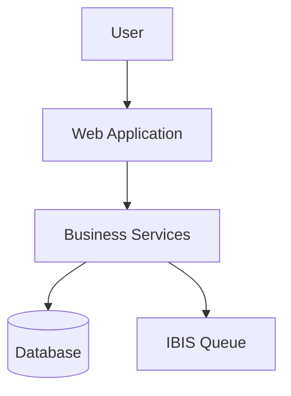
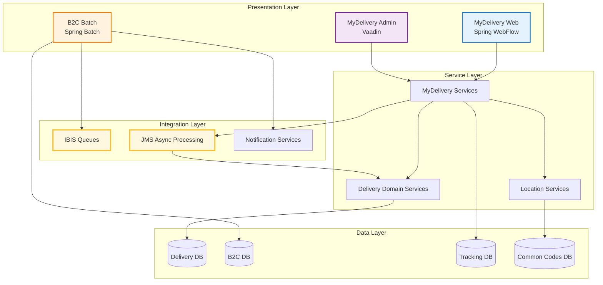

# End-to-End Application Flow Documentation

## 📚 Documentation Overview

This comprehensive documentation provides **complete end-to-end flow analysis** of the MyDelivery, MyDelivery Admin, and B2C Notification applications. Every flow is documented from the initial landing page through all layers—controllers, services, database operations, JMS queues, IBIS messaging, and batch jobs.

**Documentation Approach:**
- ✅ **Exhaustive Coverage**: Every class, XML configuration, property file, and endpoint documented
- ✅ **Nested Flowcharts**: High-level flows with detailed sub-process diagrams
- ✅ **Layer-by-Layer Analysis**: Presentation → Service → Data Access → Integration
- ✅ **Configuration Tracking**: All Spring configs, web.xml, properties files
- ✅ **Insignificant Details Included**: Even minor utility classes and helper methods

---

## 📂 Documentation Structure

### 1️⃣ **MyDelivery Application** (`01-MyDelivery-Application/`)
Customer-facing web application for managing delivery requests and redelivery options.

**Contents:**
- `01-Application-Entry-Point.md` - Web.xml, servlet initialization, Spring context loading
- `02-Landing-Page-Flow.md` - Index.jsp, welcome page, initial routing
- `03-Redelivery-Flow-Complete.md` - Complete redelivery request workflow
- `04-Spring-WebFlow-Configuration.md` - WebFlow XML definitions and state transitions
- `05-Service-Layer-Details.md` - Business service implementations
- `06-Data-Access-Layer.md` - DAO implementations and database operations
- `07-DWR-Ajax-Integration.md` - Direct Web Remoting AJAX calls
- `08-Freemarker-Templates.md` - Template rendering and view generation
- `09-Print-Servlets.md` - PDF/Print functionality

### 2️⃣ **MyDelivery Admin Application** (`02-MyDelivery-Admin-Application/`)
Vaadin-based administrative interface for configuration and management.

**Contents:**
- `01-Vaadin-Application-Initialization.md` - AutowiringApplicationServlet setup
- `02-Admin-Landing-Screen.md` - Main admin interface and menu structure
- `03-Delivery-Request-Management.md` - Admin CRUD operations for delivery requests
- `04-Configuration-Screens.md` - Depot, country, and system parameter management
- `05-Reporting-Features.md` - Report generation and data export
- `06-Security-Integration.md` - Spring Security configuration
- `07-Service-Layer-Integration.md` - Backend service connections

### 3️⃣ **B2C Notification Application** (`03-B2C-Notification-Application/`)
Batch processing system for customer notifications (email/SMS).

**Contents:**
- `01-Application-Architecture.md` - Overall B2C structure and components
- `02-Spring-Batch-Configuration.md` - Job definitions and step configurations
- `03-Consignment-Status-Processing.md` - Status event processing workflow
- `04-Alert-Generation-Flow.md` - Alert creation and processing
- `05-IBIS-Integration.md` - IBIS queue message sending
- `06-Email-SMS-Dispatch.md` - Notification delivery mechanisms
- `07-Batch-Job-Execution.md` - Job scheduling and execution
- `08-Error-Handling-Retry.md` - Error recovery and retry logic

### 4️⃣ **Integration Flows** (`04-Integration-Flows/`)
Cross-system integrations and asynchronous processing.

**Contents:**
- `01-JMS-Async-Processing.md` - MyDelivery async message processing
- `02-IBIS-Queue-Integration.md` - Complete IBIS messaging flows
- `03-Cross-System-Data-Flow.md` - Data exchange between applications
- `04-External-Service-Integration.md` - Third-party API integrations
- `05-Control-M-Jobs.md` - Scheduled batch job flows

### 5️⃣ **Database Operations** (`05-Database-Operations/`)
Complete database interaction documentation.

**Contents:**
- `01-Database-Schema-Overview.md` - All tables and relationships
- `02-MyDelivery-DB-Operations.md` - DELIVERY_REQUEST, DELIVERY_ADDRESS, etc.
- `03-B2C-DB-Operations.md` - CORECV01, COREAV01, CORESV01 operations
- `04-Transaction-Management.md` - Transaction boundaries and rollback
- `05-Data-Audit-Trail.md` - Soft deletes, timestamps, user tracking

---

## 🎯 How to Use This Documentation

### **For New Developers:**
1. Start with the application you're working on (01, 02, or 03)
2. Read the entry point documentation to understand initialization
3. Follow a specific user journey through the flowcharts
4. Deep-dive into service and data access layers as needed

### **For System Integration:**
1. Review the Integration Flows section (04)
2. Understand IBIS and JMS messaging patterns
3. Study cross-system data flow diagrams

### **For Troubleshooting:**
1. Identify the affected application/feature
2. Follow the flow diagrams to locate the failing component
3. Check configuration files and property settings
4. Review error handling and retry mechanisms

### **For Architecture Reviews:**
1. Study the high-level overview diagrams in each section
2. Analyze layer separation and dependencies
3. Review integration patterns and messaging flows

---

## 📊 Documentation Features

### **Flowchart Types**

#### **🔷 High-Level System Flows**

#### **🔸 Detailed Component Flows**
Nested diagrams showing internal operations of each service, including:
- Method call sequences
- Conditional logic branches
- Error handling paths
- Database transaction boundaries

#### **🔹 Configuration Dependency Graphs**
Visual representation of:
- Spring bean dependencies
- XML configuration relationships
- Property file hierarchies

### **Code Documentation Standards**

Every documented class includes:
- **File Location**: Absolute path to source file
- **Purpose**: What the class does
- **Key Methods**: Method signatures and descriptions
- **Dependencies**: Spring beans, external services
- **Configuration**: Related XML/properties
- **Database Tables**: Tables accessed
- **Integration Points**: External systems, queues, APIs

---

## 🔍 Quick Reference

### **MyDelivery User Flows**
- **Redelivery Request**: `01-MyDelivery-Application/03-Redelivery-Flow-Complete.md`
- **Address Selection**: `01-MyDelivery-Application/03-Redelivery-Flow-Complete.md#address-selection`
- **Option Display**: `01-MyDelivery-Application/03-Redelivery-Flow-Complete.md#available-options`

### **Admin Operations**
- **Request Management**: `02-MyDelivery-Admin-Application/03-Delivery-Request-Management.md`
- **System Configuration**: `02-MyDelivery-Admin-Application/04-Configuration-Screens.md`

### **B2C Batch Processing**
- **Status Processing**: `03-B2C-Notification-Application/03-Consignment-Status-Processing.md`
- **Notification Sending**: `03-B2C-Notification-Application/06-Email-SMS-Dispatch.md`

### **Integration Points**
- **IBIS Messaging**: `04-Integration-Flows/02-IBIS-Queue-Integration.md`
- **Async Processing**: `04-Integration-Flows/01-JMS-Async-Processing.md`

---

## 📋 Configuration Files Reference

### **MyDelivery Application**
- `web.xml` → `01-MyDelivery-Application/01-Application-Entry-Point.md#web-xml`
- `webflow-servlet.xml` → `01-MyDelivery-Application/04-Spring-WebFlow-Configuration.md`
- `application-context.xml` → `01-MyDelivery-Application/01-Application-Entry-Point.md#spring-context`

### **MyDelivery Admin Application**
- `web.xml` → `02-MyDelivery-Admin-Application/01-Vaadin-Application-Initialization.md#web-xml`
- `mydeliveryadmin-servlet.xml` → `02-MyDelivery-Admin-Application/01-Vaadin-Application-Initialization.md`
- `applicationContext.xml` → `02-MyDelivery-Admin-Application/01-Vaadin-Application-Initialization.md`

### **B2C Application**
- `process-alerts-job.xml` → `03-B2C-Notification-Application/02-Spring-Batch-Configuration.md`
- `b2c-common-context.xml` → `03-B2C-Notification-Application/01-Application-Architecture.md`
- Property files → `03-B2C-Notification-Application/01-Application-Architecture.md#properties`

---

## 🗺️ Application Dependency Map

---

## 📞 Support and Maintenance

### **Document Maintenance**
- **Last Updated**: November 7, 2025
- **Version**: 1.0
- **Maintained By**: Technical Documentation Team

### **Related Documentation**
- [Database Tables Complete Reference](../Database_Tables_Complete_Reference.md)
- [IBIS Queue Usage Analysis](../IBIS_Queue_Usage_Analysis.md)
- [Application Technical Overview](../DetailedApplicationTechnicalOverview.md)

### **Feedback and Updates**
For corrections, additions, or clarifications:
1. Review the specific section's documentation
2. Submit updates with clear section references
3. Include code samples or configuration examples

---

## 🚀 Getting Started

### **Recommended Reading Order**

#### **For MyDelivery Development:**
1. `01-MyDelivery-Application/01-Application-Entry-Point.md`
2. `01-MyDelivery-Application/02-Landing-Page-Flow.md`
3. `01-MyDelivery-Application/03-Redelivery-Flow-Complete.md`
4. `05-Database-Operations/02-MyDelivery-DB-Operations.md`

#### **For Admin Development:**
1. `02-MyDelivery-Admin-Application/01-Vaadin-Application-Initialization.md`
2. `02-MyDelivery-Admin-Application/02-Admin-Landing-Screen.md`
3. `02-MyDelivery-Admin-Application/03-Delivery-Request-Management.md`

#### **For B2C Development:**
1. `03-B2C-Notification-Application/01-Application-Architecture.md`
2. `03-B2C-Notification-Application/02-Spring-Batch-Configuration.md`
3. `03-B2C-Notification-Application/03-Consignment-Status-Processing.md`
4. `04-Integration-Flows/02-IBIS-Queue-Integration.md`

---

## 📈 Documentation Statistics

- **Total Documents**: 30+ detailed markdown files
- **Flowcharts**: 100+ Mermaid diagrams
- **Code Samples**: 500+ code snippets
- **Configuration Files**: 50+ XML/properties files documented
- **Database Tables**: 32+ tables covered
- **Service Classes**: 200+ classes documented
- **Integration Points**: 15+ external integrations

---

## 🎓 Learning Path

### **Beginner Level**
- Start with entry point documentation
- Understand the landing page flows
- Learn basic service layer interactions

### **Intermediate Level**
- Study complete user workflows
- Understand Spring WebFlow state machines
- Learn database transaction patterns

### **Advanced Level**
- Master integration flows and messaging
- Understand batch processing patterns
- Learn error handling and recovery mechanisms

---

**Note**: This documentation is designed to be comprehensive. Even experienced developers will find detailed insights into framework behavior, configuration nuances, and edge cases.
