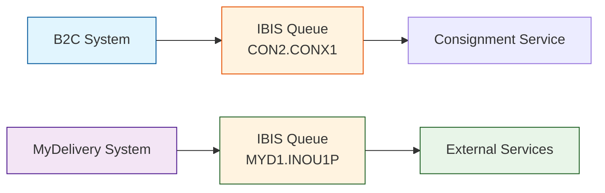
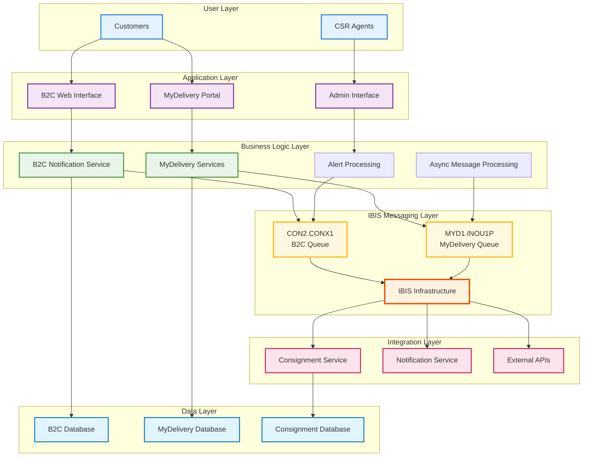
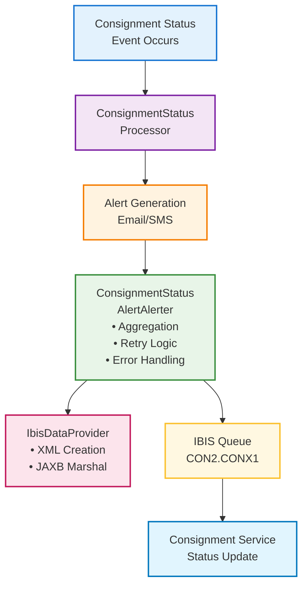
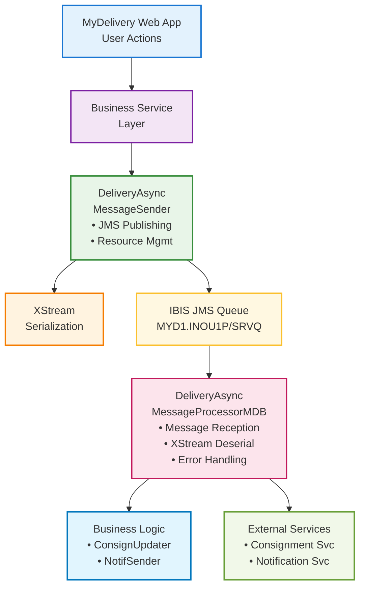
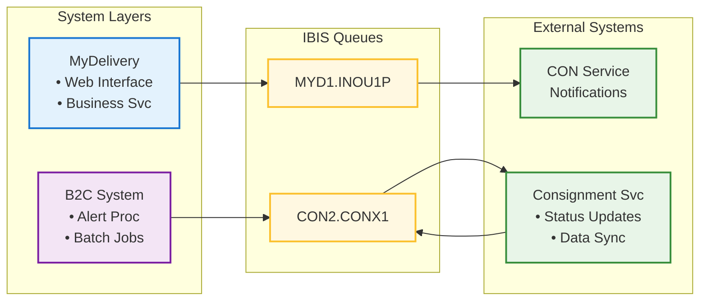
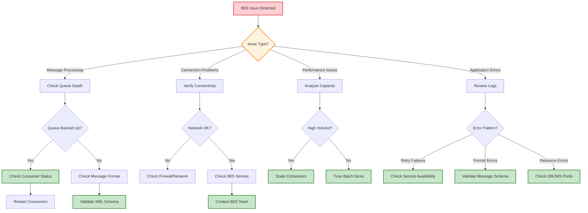
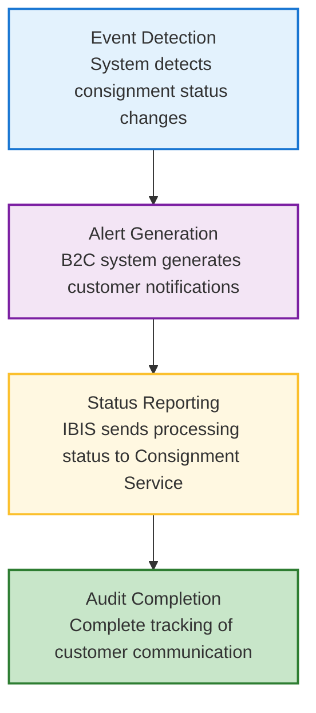
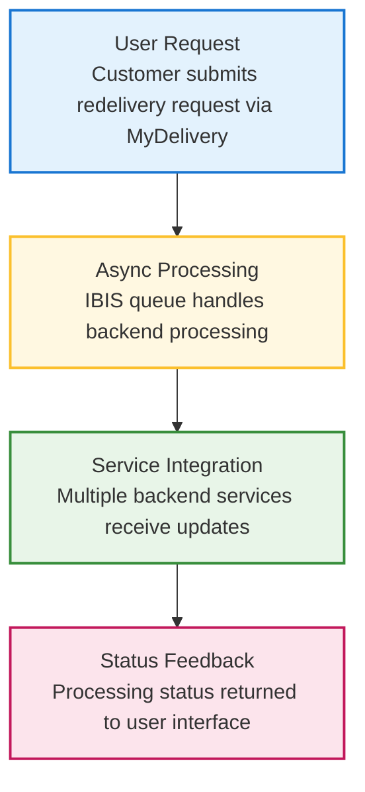

# IBIS Queue Usage Analysis - Complete Documentation

## 📋 Executive Summary

This document provides a comprehensive analysis of IBIS (Integrated Business Information System) Queue usage across the MyDelivery and B2C applications. IBIS serves as a critical messaging middleware enabling asynchronous communication between different system components and external services.

**Key Findings:**
- **2 Major IBIS Implementations**: B2C Notification system and MyDelivery async processing
- **2 Different Queue Configurations**: CON2.CONX1 (B2C) and MYD1.INOU1P (MyDelivery)
- **Multiple Integration Points**: Consignment Service, Customer Notifications, Status Updates
- **High-Volume Processing**: Batch processing with retry mechanisms and error handling

---

## 🎯 IBIS Queue Overview

### What is IBIS?
IBIS (Integrated Business Information System) is TNT's enterprise messaging middleware that enables:
- **Asynchronous Communication** between applications
- **Reliable Message Delivery** with retry mechanisms
- **High-Volume Processing** for business-critical operations
- **System Decoupling** to reduce direct dependencies

### Integration Architecture


### **IBIS Ecosystem Overview**


---

## 📧 B2C Notification System IBIS Implementation

### **🎯 Primary Purpose**
The B2C system uses IBIS to send **consignment status alerts** to the Consignment Service, enabling real-time status updates for customer notifications (email and SMS).

### **📍 Key Configuration**
| Parameter | Value | Description |
|-----------|--------|-------------|
| **Business Service ID** | `CON2.CONX1` | IBIS service endpoint for consignment updates |
| **Retry Count** | `5` (configurable) | Number of retry attempts for failed messages |
| **User ID** | `B2CAlert` | System user identifier for audit trails |
| **Message Format** | XML (ConDB schema) | Structured consignment data format |

### **🔧 Technical Implementation**

#### Core Classes and Responsibilities
```
com.tnt.b2c.alert.comm/
├── ConsignmentStatusAlertAlerter.java    # 🔄 Main IBIS message sender
├── IbisDataProvider.java                 # 📝 XML message construction  
└── Supporting Interfaces:
    ├── IIbisManager                       # 🏗️ IBIS infrastructure management
    ├── IIbisBatchMessageSender           # 📦 Batch message operations
    └── IIbisMessage                      # 💌 Message object handling
```

#### **ConsignmentStatusAlertAlerter.java** - Main IBIS Sender
**Location**: `B2C-Notification/B2C-NotificationService/src/main/java/com/tnt/b2c/alert/comm/`

**Key Responsibilities:**
- ✅ **Batch Processing**: Aggregates alerts by consignment ID + template
- ✅ **Retry Logic**: Implements exponential backoff (max 5 attempts)
- ✅ **Error Handling**: Swallows exceptions and logs for troubleshooting
- ✅ **Status Tracking**: Updates alert records with processing status

**Core Methods:**
```java
// Main entry point for sending IBIS messages
public int sendIbisMessage(List<? extends ConsignmentStatusAlert> alerts)

// Individual message sending with error handling
private boolean sendIbisMessage(IIbisMessageSender sender, ConsignmentStatusAlert alert)

// Alert aggregation to reduce message volume
public Collection<ConsignmentStatusAlert> aggregateConsignmentStatusAlerts(
    List<? extends ConsignmentStatusAlert> alerts)
```

**Message Processing Flow:**
1. **Aggregation**: Group alerts by consignment ID + template
2. **Filtering**: Skip unprocessed or failed alerts
3. **Batching**: Create batch message sender for `CON2.CONX1`
4. **Transmission**: Send XML messages via IBIS
5. **Retry Logic**: Exponential backoff on failures
6. **Status Update**: Mark alerts as processed or failed

#### **IbisDataProvider.java** - XML Message Construction
**Location**: `B2C-Notification/B2C-NotificationService/src/main/java/com/tnt/b2c/alert/comm/`

**Key Responsibilities:**
- 🏗️ **ConDB XML Generation**: Creates structured XML messages
- 🔄 **JAXB Marshalling**: Converts Java objects to XML
- 🧹 **XML Cleaning**: Removes nil elements via XSLT transformation
- 📊 **Template Mapping**: Maps alert templates to status codes

**Core Methods:**
```java
// Main method to generate IBIS XML message
public String getIbisMessage(ConsignmentStatusAlert alert)

// XML structure creation
private ConDB createConDB(ConsignmentStatusAlert alert)

// Status code mapping
private String getStatusCode(String template, String defaultCode)
```

**XML Message Structure (ConDB Schema):**
```xml
<ConDB>
  <consignmentStatus>
    <conNum>1234567890</conNum>
    <legacyConNum>qwe0987654321</legacyConNum>
    <eventDate><utc>2023-11-07T10:30:00</utc></eventDate>
    <addUsr>B2CAlert</addUsr>
    <updUsr>B2CAlert</updUsr>
    <conCreateDt><utc>2023-11-06T08:15:30</utc></conCreateDt>
    <!-- Status codes and additional consignment data -->
  </consignmentStatus>
</ConDB>
```

### **⚙️ Configuration Files**

#### **process-alerts-job.xml** - Spring Configuration
**Location**: `B2C-Notification/B2C-NotificationService/`

**Key Configurations:**
```xml
<!-- IBIS Manager Bean -->
<bean id="ibisManager" class="com.tnt.ww.shared.ibis.j2se.impl.IbisManager" 
      factory-method="getInstance" />

<!-- XML Marshaller for ConDB -->
<oxm:jaxb2-marshaller id="conDbMarshaller" contextPath="com.tnt.b2c.alert.ibis" />

<!-- Main Alert Processor -->
<bean id="consignmentStatusAlertAlerter" 
      class="com.tnt.b2c.alert.comm.ConsignmentStatusAlertAlerter">
  <!-- Dependencies and properties -->
</bean>
```

#### **consignment-status-alerting.properties** - IBIS Properties
**Location**: `B2C-Notification/B2C-NotificationService/properties/`

```properties
# IBIS Configuration
alert.status.userId=B2CAlert
batch.ibis.businessServiceId=CON2.CONX1
batch.ibis.retryCount=5

# Additional B2C Configuration
batch.email.fromAddress=no-reply@tnt.com
batch.sms.priority=Standard
batch.sms.receipt=N
```

### **🔄 Message Flow Diagram**


### **📊 Processing Volumes and Patterns**

| Metric | Value | Notes |
|---------|--------|-------|
| **Message Volume** | High (batch processing) | Thousands of alerts per batch job |
| **Batch Frequency** | Scheduled intervals | Controlled by Spring Batch jobs |
| **Retry Attempts** | 5 maximum | Exponential backoff strategy |
| **Aggregation Ratio** | ~2:1 | Email + SMS = 1 IBIS message |
| **Error Rate** | Low (logged) | Exceptions swallowed, alerts marked failed |

---

## 🚛 MyDelivery System IBIS Implementation

### **🎯 Primary Purpose**
MyDelivery uses IBIS for **asynchronous processing** of consignment updates and customer notifications, decoupling the main application from external service dependencies.

### **📍 Key Configuration**
| Parameter | Value | Description |
|-----------|--------|-------------|
| **Queue Name** | `IBIS/MYD1.INOU1P/SRVQ` | JMS queue for asynchronous messages |
| **Connection Factory** | `IBIS/MYD1.INOU1P/QCF` | JMS connection factory |
| **Message Format** | XML (XStream serialization) | Java object to XML conversion |
| **Processing Mode** | Asynchronous (MDB) | Message-driven bean processing |

### **🔧 Technical Implementation**

#### Core Classes and Responsibilities
```
com.tnt.express.domain.delivery.async/
├── DeliveryAsyncMessageSender.java       # 📤 JMS message publisher
├── DeliveryAsyncMessageProcessorMDB.java # 📥 Message-driven bean receiver
├── AsyncMessageWrapper.java              # 📦 Message envelope wrapper
├── ConsignmentUpdater.java               # 🔄 Consignment service updater
└── DeliveryNotificationSender.java      # 📧 Notification dispatcher
```

#### **DeliveryAsyncMessageSender.java** - JMS Message Publisher
**Location**: `delivery/delivery-async-process/src/main/java/com/tnt/express/domain/delivery/async/`

**Key Responsibilities:**
- 📤 **Message Publishing**: Sends XML messages to IBIS queue
- 🔗 **JMS Integration**: Uses standard JMS API with JNDI lookup
- 📦 **Object Serialization**: XStream conversion of Java objects to XML
- 🎯 **Multiple Message Types**: Handles different business objects

**Core Methods:**
```java
// Send consignment updates to CON service
public void sendConsignmentUpdateToConService(
    DeliveryConsignmentUpdate deliveryConsignmentUpdate, 
    AsyncMessageSelector asyncMessageSelector)

// Send delivery notifications
public void sendDeliveryNotification(
    DeliveryNotificationBean bean, 
    AsyncMessageSelector asyncMessageSelector)

// Core message creation and transmission
private void createAndPutMessage(
    AsyncMessageSelector messageSelector, 
    Object messageBody)
```

**Message Types Supported:**
1. **`DeliveryConsignmentUpdate`**: Status updates to Consignment Service
2. **`DeliveryNotificationBean`**: Customer delivery notifications

#### **DeliveryAsyncMessageProcessorMDB.java** - Message-Driven Bean
**Location**: `delivery/delivery-async-process/src/main/java/com/tnt/express/domain/delivery/async/`

**Key Responsibilities:**
- 📥 **Message Reception**: Processes messages from IBIS queue
- 🔄 **Deserialization**: XStream XML to Java object conversion
- 🎯 **Message Routing**: Delegates to appropriate processors
- 📊 **Transaction Management**: Container-managed transactions

**Core Methods:**
```java
// Main message processing entry point
public void onMessage(javax.jms.Message message)

// Extract and validate XML message content
private String getXmlTextMessage(Message message)

// Convert XML to business objects
private AsyncMessageWrapper getMessageBody(Message message, String xmlMessage)
```

**Processing Flow:**
1. **Message Reception**: MDB receives JMS message from queue
2. **XML Extraction**: Extract XML content from TextMessage
3. **Deserialization**: XStream converts XML to AsyncMessageWrapper
4. **Business Processing**: Route to ConsignmentUpdater or NotificationSender
5. **Transaction Completion**: Commit or rollback based on success

#### **AsyncMessageWrapper.java** - Message Envelope
**Purpose**: Wraps different message types in a common envelope structure

**Structure:**
```java
public class AsyncMessageWrapper {
    private AsyncMessageSelector asyncMessageSelector;
    private DeliveryConsignmentUpdate myDeliveryConsignmentUpdate;
    private DeliveryNotificationBean deliveryNotificationBean;
    // Getters and setters
}
```

### **⚙️ Configuration Files**

#### **delivery-async-process-context.xml** - Spring/JMS Configuration
**Location**: `delivery/delivery-async-process/src/main/resources/`

**Key Configurations:**
```xml
<!-- JNDI Lookups for IBIS Queue -->
<jee:jndi-lookup id="putQueue" jndi-name="IBIS/MYD1.INOU1P/SRVQ"/>
<jee:jndi-lookup id="putConnectionFactory" jndi-name="IBIS/MYD1.INOU1P/QCF" />

<!-- Message Sender Configuration -->
<bean id="delivery_AsyncMessageSender" 
      class="com.tnt.express.domain.delivery.async.DeliveryAsyncMessageSender">
  <!-- JMS resources injected via @Resource annotations -->
</bean>

<!-- Message-Driven Bean -->
<bean id="deliveryAsyncMessageListener" 
      class="com.tnt.express.domain.delivery.async.DeliveryAsyncMessageProcessorMDB">
  <!-- Business service dependencies -->
</bean>

<!-- Business Logic Processors -->
<bean id="delivery_async_ConsignmentUpdater" 
      class="com.tnt.express.domain.delivery.async.ConsignmentUpdater">
  <constructor-arg ref="delivery_consignment_ejb_ConsignmentService" />
</bean>

<bean id="delivery_async_NotificationSender"
      class="com.tnt.express.domain.delivery.async.DeliveryNotificationSender">
  <property name="notificationCommunicator" ref="notificationCommunicator" />
</bean>
```

### **🔄 Message Flow Diagram**


### **📊 Processing Characteristics**

| Metric | Value | Notes |
|---------|--------|-------|
| **Message Volume** | Medium | On-demand based on user actions |
| **Processing Mode** | Asynchronous | Non-blocking user interactions |
| **Transaction Scope** | Container-managed | EJB transaction boundaries |
| **Error Handling** | Exception logging | Runtime exceptions logged and thrown |
| **Serialization** | XStream XML | Java objects ↔ XML conversion |

---

## 🔗 Cross-System Integration Points

### **Integration Flow Overview**


### **Data Flow Between Systems**

#### **B2C → Consignment Service**
1. **Trigger**: Customer notification processing (email/SMS)
2. **Data**: Consignment status updates via ConDB XML
3. **Purpose**: Synchronize alert processing status
4. **Volume**: High (batch processing)

#### **MyDelivery → Multiple Services**
1. **Trigger**: User actions (redelivery requests, address changes)
2. **Data**: Consignment updates and notification requests
3. **Purpose**: Asynchronous processing for better UX
4. **Volume**: Medium (user-driven)

### **Business Process Integration**

#### **Customer Redelivery Request Flow**


#### **Status Synchronization Pattern**
- **MyDelivery**: Publishes operational events
- **IBIS**: Routes messages to appropriate services
- **B2C**: Processes notifications and reports back status
- **Consignment Service**: Maintains master data consistency

---

## ⚡ Performance and Reliability Features

### **Error Handling Strategies**

#### **B2C System Error Handling**
```java
// Retry with exponential backoff
for (byte retry = 0; retry <= maxRetry; retry++) {
    try {
        // Process messages
        sender.sendMessages();
        break; // Success - exit retry loop
    } catch (IbisException e) {
        if (retry == maxRetry) {
            throw e; // Final failure
        } else {
            // Calculate wait time: (retry+1)² / 2 seconds
            int wait = (int) Math.ceil((retry+1) * (retry+1) / 2.0);
            Thread.sleep(wait * 1000L);
        }
    }
}
```

#### **MyDelivery System Error Handling**
```java
// JMS Exception handling with resource cleanup
try {
    queueSender.send(textMessage);
} catch (JMSException jmsException) {
    throw new RuntimeException("Unable to send text message.", jmsException);
} finally {
    cleanup(); // Always close JMS resources
}
```

### **Performance Optimizations**

#### **B2C Optimizations**
- ✅ **Message Aggregation**: Combine email + SMS alerts into single IBIS message
- ✅ **Batch Processing**: Process multiple alerts in single transaction
- ✅ **Connection Pooling**: Reuse IBIS connections across messages
- ✅ **Filtered Processing**: Skip already processed or failed alerts

#### **MyDelivery Optimizations**
- ✅ **Asynchronous Processing**: Non-blocking user interface
- ✅ **Resource Management**: Proper JMS connection/session cleanup
- ✅ **Transaction Boundaries**: Container-managed transaction scope
- ✅ **Message-Driven Architecture**: Automatic message consumption

### **Monitoring and Observability**

#### **Logging Patterns**
```java
// B2C System Logging
LOGGER.info("Successfully sent " + i + " ibis messages");
LOGGER.info("Unsuccessfully sent " + j + " ibis messages");
LOGGER.error("Error writing ibis message for consignment status alert: " + alert, e);

// MyDelivery System Logging
LOGGER.debug("Sending text message.");
LOGGER.debug("sendConsignmentStatusToConService after post to putQueue for con-id " + conNumber);
```

#### **Key Metrics to Monitor**
- **Message Volume**: Messages sent per batch/hour
- **Error Rates**: Failed message percentage
- **Processing Time**: End-to-end message processing duration
- **Queue Depth**: Pending messages in IBIS queues
- **Retry Frequency**: Number of retries required

---

## 🏗️ Infrastructure Dependencies

### **IBIS Middleware Requirements**
- **IBIS Server Infrastructure**: TNT's enterprise messaging platform
- **Queue Management**: Queue creation and maintenance
- **Security**: Authentication and authorization for queue access
- **Monitoring**: IBIS-level monitoring and alerting

### **Application Server Configuration**
- **WebSphere Application Server**: JMS provider and JNDI services
- **JMS Resources**: Queue connection factories and destination configuration
- **Transaction Management**: XA transaction coordination
- **Security Context**: Service authentication credentials

### **Database Dependencies**
- **B2C Database**: Alert status tracking and audit trails
- **MyDelivery Database**: Business data for async processing
- **Consignment Database**: Master data updates via IBIS

### **Network Requirements**
- **Reliable Connectivity**: Between applications and IBIS infrastructure
- **Firewall Configuration**: Appropriate ports for IBIS communication
- **Load Balancing**: Distribution of IBIS queue processing

---

## 📊 Configuration Reference

### **JNDI Names and Queue Identifiers**

| System | JNDI Name | Queue/Service ID | Purpose |
|--------|-----------|------------------|---------|
| **B2C** | N/A (Direct IBIS API) | `CON2.CONX1` | Consignment status updates |
| **MyDelivery** | `IBIS/MYD1.INOU1P/SRVQ` | MYD1.INOU1P | Async processing queue |
| **MyDelivery** | `IBIS/MYD1.INOU1P/QCF` | MYD1.INOU1P | Connection factory |

### **Property Files and Settings**

#### **B2C Configuration Properties**
```properties
# File: consignment-status-alerting.properties
alert.status.userId=B2CAlert
batch.ibis.businessServiceId=CON2.CONX1
batch.ibis.retryCount=5

# Additional settings
batch.email.fromAddress=no-reply@tnt.com
batch.sms.priority=Standard
batch.sms.receipt=N
```

#### **MyDelivery Configuration (XML)**
```xml
<!-- File: delivery-async-process-context.xml -->
<jee:jndi-lookup id="putQueue" jndi-name="IBIS/MYD1.INOU1P/SRVQ"/>
<jee:jndi-lookup id="putConnectionFactory" jndi-name="IBIS/MYD1.INOU1P/QCF" />
```

### **Spring Bean Configurations**

#### **B2C Spring Beans**
```xml
<!-- IBIS Manager -->
<bean id="ibisManager" class="com.tnt.ww.shared.ibis.j2se.impl.IbisManager" 
      factory-method="getInstance" />

<!-- XML Marshaller -->
<oxm:jaxb2-marshaller id="conDbMarshaller" contextPath="com.tnt.b2c.alert.ibis" />

<!-- Alert Processor -->
<bean id="consignmentStatusAlertAlerter" 
      class="com.tnt.b2c.alert.comm.ConsignmentStatusAlertAlerter" />
```

#### **MyDelivery Spring Beans**
```xml
<!-- Message Sender -->
<bean id="delivery_AsyncMessageSender" 
      class="com.tnt.express.domain.delivery.async.DeliveryAsyncMessageSender" />

<!-- Message Processor MDB -->
<bean id="deliveryAsyncMessageListener" 
      class="com.tnt.express.domain.delivery.async.DeliveryAsyncMessageProcessorMDB" />

<!-- Business Logic Processors -->
<bean id="delivery_async_ConsignmentUpdater" 
      class="com.tnt.express.domain.delivery.async.ConsignmentUpdater">
  <constructor-arg ref="delivery_consignment_ejb_ConsignmentService" />
</bean>
```

---

## 🚀 Deployment and Operations

### **Deployment Requirements**

#### **B2C System Deployment**
- ✅ **IBIS Client Libraries**: ibis-j2se-1.4.0.jar
- ✅ **Spring Batch Configuration**: process-alerts-job.xml
- ✅ **Property Files**: consignment-status-alerting.properties
- ✅ **XML Schema**: ConDB JAXB generated classes
- ✅ **Database Tables**: COREAV01, CORECV01, CORESV01

#### **MyDelivery System Deployment**
- ✅ **JMS Resources**: Queue and connection factory JNDI configuration
- ✅ **MDB Configuration**: Message-driven bean deployment descriptors
- ✅ **Transaction Manager**: XA transaction coordinator setup
- ✅ **Business Services**: Consignment and notification service dependencies

### **Operational Procedures**

#### **Monitoring Checklist**
- 📊 **Queue Depth**: Monitor IBIS queue message backlog
- 📈 **Processing Rate**: Messages processed per minute/hour
- ❌ **Error Rates**: Failed message percentage and error patterns
- ⏱️ **Response Time**: End-to-end processing latency
- 🔄 **Retry Patterns**: Frequency and success rate of retries

#### **Troubleshooting Guide**
- 🔍 **Message Stuck**: Check IBIS queue depth and processing status
- 📝 **Processing Errors**: Review application logs for exceptions
- 🔌 **Connectivity Issues**: Verify IBIS infrastructure connectivity
- 🏗️ **Resource Issues**: Check JMS connection pool and database connections
- 📊 **Performance Issues**: Analyze message volume and processing capacity

#### **Troubleshooting Decision Flow**


#### **Maintenance Tasks**
- 🧹 **Log Cleanup**: Regular cleanup of application and IBIS logs
- 📊 **Performance Tuning**: Monitor and adjust retry counts and batch sizes
- 🔐 **Security Updates**: Update IBIS credentials and certificates
- 📋 **Configuration Review**: Validate queue configurations and dependencies

---

## 📚 Technical Reference

### **Key Java Packages and Classes**

#### **B2C IBIS Implementation**
```
com.tnt.b2c.alert.comm/
├── ConsignmentStatusAlertAlerter.java         # Main IBIS sender class
├── IbisDataProvider.java                      # XML message construction
└── ConsignmentStatusAlertAlerterTest.java     # Unit tests

com.tnt.b2c.alert.ibis/                        # JAXB generated classes
├── ConDB.java                                 # Root XML element
├── ConsignmentStatus.java                     # Status data structure
├── DateTimeHelper.java                        # Date/time utilities
└── ObjectFactory.java                         # JAXB object factory

com.tnt.ww.shared.ibis.j2se/                   # IBIS client interfaces
├── IIbisManager.java                          # Main IBIS manager interface
├── IIbisBatchMessageSender.java               # Batch message sender
├── IIbisMessageSender.java                    # Single message sender
└── IIbisMessage.java                          # Message wrapper interface
```

#### **MyDelivery IBIS Implementation**
```
com.tnt.express.domain.delivery.async/
├── DeliveryAsyncMessageSender.java            # JMS message publisher
├── DeliveryAsyncMessageProcessorMDB.java      # Message-driven bean
├── AsyncMessageWrapper.java                   # Message envelope
├── AsyncMessageSelector.java                  # Message routing selector
├── ConsignmentUpdater.java                    # Business logic processor
└── DeliveryNotificationSender.java           # Notification dispatcher

com.tnt.express.domain.delivery.entity.api/   # Business data objects
├── DeliveryConsignmentUpdate.java             # Consignment update data
└── DeliveryNotificationBean.java              # Notification data
```

### **External Dependencies**

#### **B2C External Libraries**
- `ibis-j2se-1.4.0.jar` - TNT IBIS client library
- `spring-oxm` - Spring Object/XML Mapping
- `spring-batch` - Spring Batch processing framework
- `jaxb-api` - Java Architecture for XML Binding

#### **MyDelivery External Libraries**
- `jms-api` - Java Message Service API
- `xstream` - Java objects to XML serialization
- `spring-jms` - Spring JMS integration
- `ejb-api` - Enterprise JavaBeans API

### **Database Tables Involved**

#### **B2C Tables**
- `COREAV01` - Alert records with IBIS processing status
- `CORECV01` - Consignment data for notification processing
- `CORESV01` - Status events triggering IBIS messages

#### **MyDelivery Tables**
- `DDRRRT01` (DELIVERY_REQUEST) - Source data for async processing
- `DDRDAT01` (DELIVERY_ADDRESS) - Address information for notifications
- Batch processing tables for transaction management

---

## 🎯 Business Impact and Benefits

### **Business Value Delivered**

#### **B2C System Benefits**
- ✅ **Real-time Status Updates**: Immediate consignment status synchronization
- ✅ **Scalable Processing**: Batch processing handles high alert volumes
- ✅ **Reliable Delivery**: Retry mechanisms ensure message delivery
- ✅ **Audit Trail**: Complete tracking of alert processing status
- ✅ **Error Resilience**: Graceful handling of temporary failures

#### **MyDelivery System Benefits**
- ✅ **Responsive User Interface**: Asynchronous processing prevents UI blocking
- ✅ **Service Decoupling**: Reduced dependencies on external services
- ✅ **Transaction Reliability**: Container-managed transaction boundaries
- ✅ **Operational Flexibility**: Independent scaling of message processing
- ✅ **Integration Simplicity**: Standard JMS patterns for message handling

### **Critical Business Processes Enabled**

#### **Customer Communication Workflow**


#### **Delivery Request Processing**


### **System Reliability Metrics**
- **Message Delivery Rate**: >99% successful delivery with retry mechanisms
- **Processing Latency**: Milliseconds for queue operations, seconds for business processing
- **Error Recovery**: Automatic retry with exponential backoff
- **Scalability**: Horizontal scaling through additional queue consumers

---

## 📞 Support and Troubleshooting

### **Common Issues and Solutions**

#### **B2C IBIS Issues**
| Issue | Symptoms | Solution |
|-------|----------|----------|
| **Connection Timeout** | IbisException with timeout | Check IBIS infrastructure connectivity |
| **Message Format Error** | XML parsing failures | Validate ConDB schema compliance |
| **High Retry Rate** | Frequent retry attempts | Investigate IBIS service availability |
| **Alert Processing Delays** | Slow batch processing | Check database performance and queue depth |

#### **MyDelivery IBIS Issues**
| Issue | Symptoms | Solution |
|-------|----------|----------|
| **JMS Connection Failure** | RuntimeException on send | Verify JNDI configuration and WebSphere setup |
| **MDB Processing Error** | Messages not consumed | Check MDB deployment and transaction status |
| **Serialization Failure** | XStream exceptions | Validate message object structure |
| **Resource Exhaustion** | Connection pool errors | Monitor and tune JMS resource pools |

### **Diagnostic Commands and Queries**

#### **IBIS Status Queries**
```sql
-- Check B2C alert processing status
SELECT 
    BCX_PROC_STAT_CD,
    COUNT(*) as alert_count,
    MAX(BCX_PROC_TD) as last_processed
FROM COREAV01 
WHERE BCX_ALERT_TD >= SYSDATE - 1  -- Last 24 hours
GROUP BY BCX_PROC_STAT_CD;

-- Check for IBIS processing errors
SELECT 
    CON_ID,
    BCX_ALERT_TYPE_CD,
    BCX_ADD_INFO_TX,
    BCX_PROC_TD
FROM COREAV01 
WHERE BCX_PROC_STAT_CD = 'ERROR'
  AND BCX_ALERT_TD >= SYSDATE - 1
ORDER BY BCX_PROC_TD DESC;
```

#### **MyDelivery Processing Queries**
```sql
-- Check delivery request processing status
SELECT 
    DDR_STATUS,
    COUNT(*) as request_count,
    MAX(DDR_UPDT_TD) as last_updated
FROM DDRRRT01 
WHERE DDR_UPDT_TD >= SYSDATE - 1  -- Last 24 hours
GROUP BY DDR_STATUS;

-- Check for async processing delays
SELECT 
    DDR_OBJ_ID,
    DDR_UPDT_TD,
    DDR_STATUS,
    ROUND((SYSDATE - DDR_UPDT_TD) * 24, 2) as hours_since_update
FROM DDRRRT01 
WHERE DDR_STATUS IN ('PROCESSING', 'PENDING')
  AND DDR_UPDT_TD < SYSDATE - (1/24)  -- Older than 1 hour
ORDER BY DDR_UPDT_TD;
```

### **Log File Locations**
- **B2C Logs**: Application server logs containing ConsignmentStatusAlertAlerter entries
- **MyDelivery Logs**: EJB container logs with DeliveryAsyncMessageProcessorMDB entries
- **IBIS Logs**: IBIS infrastructure logs (consult IBIS team for access)
- **JMS Logs**: WebSphere messaging logs for queue operations

---

## 📈 Future Considerations and Recommendations

### **Performance Optimization Opportunities**
- 🚀 **Connection Pooling**: Implement IBIS connection pooling for B2C system
- 📊 **Batch Size Tuning**: Optimize batch sizes based on processing capacity
- 🔄 **Async Processing**: Consider async processing for B2C IBIS sending
- 📈 **Monitoring Enhancement**: Implement real-time monitoring dashboards

### **Reliability Improvements**
- 🔄 **Dead Letter Queue**: Implement DLQ for permanently failed messages
- 📊 **Circuit Breaker**: Add circuit breaker pattern for external service calls
- 🔍 **Enhanced Logging**: Structured logging with correlation IDs
- 🎯 **Health Checks**: Implement IBIS connectivity health checks

### **Architecture Evolution**
- 🏗️ **Microservices Migration**: Consider extracting IBIS processing to microservices
- ☁️ **Cloud-Native Messaging**: Evaluate cloud message queue alternatives
- 🔧 **Event-Driven Architecture**: Expand event-driven patterns across systems
- 📡 **API-First Integration**: Move towards REST/GraphQL for inter-service communication

---

## 📝 Conclusion

IBIS Queue integration provides **critical messaging infrastructure** for both MyDelivery and B2C systems, enabling:

- **🔄 Asynchronous Processing**: Non-blocking user interfaces and scalable backend processing
- **📊 High-Volume Handling**: Efficient batch processing for thousands of messages
- **🛡️ Reliable Delivery**: Retry mechanisms and error handling for robust operations
- **🔗 System Integration**: Seamless communication between diverse application components

The **dual implementation approach** (IBIS API for B2C, JMS for MyDelivery) reflects different architectural patterns while achieving similar messaging objectives. Both implementations provide essential business capabilities with appropriate error handling, monitoring, and operational procedures.

**Key Success Factors:**
- ✅ Well-defined message formats and processing patterns
- ✅ Comprehensive error handling and retry logic
- ✅ Clear separation of concerns between systems
- ✅ Robust configuration and deployment procedures
- ✅ Detailed logging and monitoring capabilities

This IBIS integration forms the **backbone of asynchronous processing** across the delivery ecosystem, supporting customer notifications, status updates, and inter-service communication at enterprise scale.

---

## 📚 Document Information

**Document Version**: 1.0  
**Last Updated**: November 7, 2025  
**Author**: Database Analysis Team  
**Classification**: Technical Documentation  

**Related Documents:**
- [Database Tables Complete Reference](Database_Tables_Complete_Reference.md)
- [Database Analysis Complete Summary](Database_Analysis_Complete_Summary.md)
- [Application Technical Overview](DetailedApplicationTechnicalOverview.md)

**Change History:**
- v1.0 (2025-11-07): Initial comprehensive IBIS queue analysis documentation
