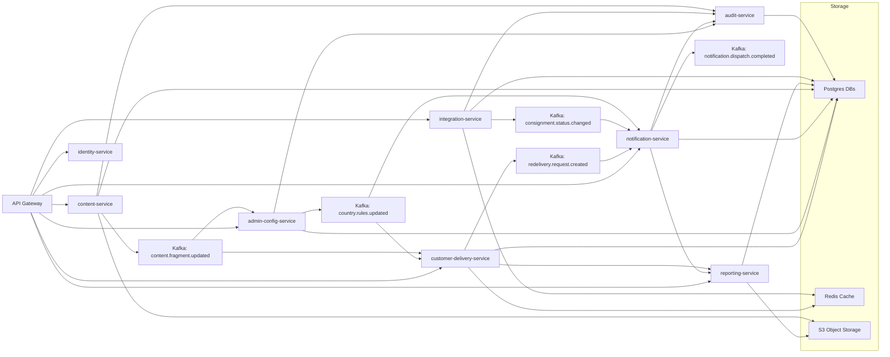

# Unified MyDelivery Platform Architecture (Spring Boot + React + Microservices)

Goal: Merge legacy MyDelivery, MyDelivery Admin, and B2C Notification into a single modern platform delivering customer self‑service, admin operations, and proactive notifications with integrated content (CQ/AEM replacement) under one technology stack.

---
## 1. High-Level Principles
- Domain Driven Design: Clear bounded contexts; each microservice owns one domain.
- API First: REST + Async events (Kafka) + optional GraphQL gateway.
- Hexagonal Architecture: Domain core isolated from adapters (web, persistence, external systems).
- 12-Factor & Cloud Native: Config via environment, stateless services, containerized.
- Security by Design: Central identity (Keycloak/OAuth2), zero trust internal calls (mTLS / JWT propagation).
- Observability: Unified logging (JSON), metrics (Micrometer + Prometheus), tracing (OpenTelemetry).
- Resilience: Circuit breakers, bulkheads, retries, rate limits (Resilience4j).
- Data Evolution: Use separate schemas; share data only via APIs/events (no shared DB).

---
## 2. Bounded Contexts & Microservices
| Service | Domain | Responsibilities | Tech Components | Data Store |
|---------|--------|------------------|-----------------|-----------|
| gateway-api | Edge | Routing, auth, rate limiting, aggregation | Spring Cloud Gateway, OAuth2, GraphQL | N/A |
| identity-service | Identity | Users, roles, permissions, API tokens | Keycloak or custom Spring Authorization Server | Postgres |
| customer-delivery-service | Redelivery | Consignments, options, dates, requests, confirmations | Spring Boot, JPA, Redis cache | Postgres + Redis |
| admin-config-service | Configuration | Country rules, depot data, option enablement, system parameters | Spring Boot, JPA, Audit trail | Postgres |
| notification-service | Alerts | Consignment status ingestion, alert scheduling, template render & send | Spring Boot Batch/Scheduler, Kafka | Postgres (alerts) + Kafka |
| content-service | Content | Replace CQ: page fragments, localized labels, email templates, CMS assets | Spring Boot, Headless CMS (self-built), S3 | Postgres + S3 |
| reporting-service | Docs | PDF generation (PTL, confirmations, admin reports) | Spring Boot, FlyingSaucer/Thymeleaf PDF | Postgres (report logs) + S3 |
| integration-service | External | APC, OSC, CommonCodes, StreamServe (legacy), future carriers | Spring Boot, WebClient, Resilience4j | Postgres (cache) + Redis |
| audit-service | Audit | Central event & action audit, change history | Spring Boot, Kafka consumers | Postgres + Kafka |
| event-router | Messaging | Topic normalization, schema registry, dead letter queues | Kafka Connect / Schema Registry | Kafka |

---
## 3. React Front-End Structure
Monorepo module `ui/` with apps:
- `ui/customer` (Redelivery wizard, tracking)
- `ui/admin` (Configuration dashboards, rule editing, depot CRUD)
- `ui/shared` (Design system, components, hooks, service SDK)

Directory skeleton:
```
ui/
  package.json
  apps/
    customer/
      src/
        pages/
        routes/
        features/redelivery/
        features/consignment/
        components/
        state/ (Redux Toolkit / Zustand)
        services/ (API clients)
    admin/
      src/
        pages/
        features/config/
        features/depot/
        features/notifications/
        components/
    shared/
      src/
        components/ui/
        components/form/
        hooks/
        intl/
        theme/
        utils/
  libs/
    api-clients/ (OpenAPI generated)
    types/ (TypeScript types)
```

Front-end patterns:
- Routing: React Router v6; wizard flow handled by route state machine.
- State: Redux Toolkit slices per domain; RTK Query for API caching.
- Internationalization: FormatJS (react-intl) pulling label bundles from content-service.
- Authentication: OAuth2 Authorization Code w/ PKCE; token stored in memory.
- UI Kit: Component library (Storybook) for buttons, form controls, timeline.

---
## 4. API Design (Representative Endpoints)
### customer-delivery-service
- `GET /consignments/{id}`
- `GET /consignments/{id}/options`
- `GET /consignments/{id}/options/{option}/dates`
- `POST /redelivery-requests` (body includes consignmentId, option, date, address/contact)
- `GET /redelivery-requests/{id}/confirmation`
### admin-config-service
- `GET /rules/countries/{code}`
- `PUT /rules/countries/{code}`
- `POST /depots`
- `GET /depots/{id}`
- `PUT /depots/{id}`
- `GET /system-parameters`
### notification-service
- `GET /alerts/{id}`
- `POST /alerts/test-send`
- `GET /templates`
### content-service
- `GET /content/fragments/{key}?locale=en-GB`
- `PUT /content/fragments/{key}`
- `GET /templates/email/{name}`
### reporting-service
- `POST /reports/redelivery/ptl` returns PDF
- `POST /reports/redelivery/confirmation` returns PDF
### integration-service
- `POST /integration/apc/consignment-details` (internal only)

OpenAPI specs per service; gateway composes GraphQL schema for front-end.

---
## 5. Messaging & Events
Kafka topics:
- `consignment.status.changed`
- `redelivery.request.created`
- `redelivery.request.confirmed`
- `country.rules.updated`
- `depot.updated`
- `notification.alert.created`
- `notification.dispatch.completed`
- `content.fragment.updated`

Schema Registry (Avro or JSON Schema) for contracts; audit-service consumes all topics for immutable audit log.

---
## 6. Persistence Strategy
| Data | Store | Notes |
|------|-------|-------|
| Consignments, Redelivery Requests | Postgres | Normalized tables; deliveries, addresses separate |
| Country Rules, Depots | Postgres | Versioned rows + effective dates |
| Alerts, Templates | Postgres | Template metadata; body kept in content-service |
| Content Fragments | Postgres + S3 | S3 for media; DB for metadata & versioning |
| Report Artifacts | S3 | Retention policy by compliance rules |
| Cache (country metadata, options) | Redis | TTL + cache warmers |
| Audit Log | Postgres (append-only) | Partition by month |

Migrations: Flyway per service; baseline from legacy schema export + transformation scripts.

---
## 7. Domain Model Modernization
Use Java records where immutable (e.g., `RedeliveryOption`, `CountryRule`, `DepotSchedule`). Use sealed interfaces for state machines (e.g., `RedeliveryStep`). Value objects (EmailAddress, PhoneNumber, Postcode) enforce invariants centrally.

---
## 8. Cross-Cutting Services
- Auth & IAM: Keycloak or Spring Authorization Server; roles (CUSTOMER, ADMIN, OPS, SYSTEM).
- API Gateway: Rate limit by client type; JWT validation; request correlation id injection.
- Central Error Model: `problem+json` RFC 7807 responses.
- Feature Flags: Unleash/FF4J (e.g., enable new wizard).
- Scheduling: Quartz or Spring Scheduler for periodic cache refresh & notification sweeps (lightweight); heavy batch replaced by event-driven processing.

---
## 9. Content (CQ Replacement)
`content-service` models:
- Fragment: `{key, locale, version, status, body(markdown/json), metadata(tags)}`
- Template: `{name, channel(email|sms|web), locale, subject, body, placeholders[]}`
API for retrieval, version diff, publish workflow (DRAFT → REVIEW → PUBLISHED). React admin UI for editing with live preview.

---
## 10. Notification Flow (New Model)
1. `consignment.status.changed` event published by integration-service.
2. notification-service consumes, applies mapping rules (status -> template).
3. Checks suppression rules (frequency, opt-out, time window).
4. Renders template (content-service fetch) -> localized placeholders (date/time, depot info, tracking url).
5. Dispatch via channel provider (email, SMS). Providers isolated behind SPI: `ChannelSender`.
6. Emits `notification.dispatch.completed` with success/failure details.

---
## 11. Redelivery Flow (New REST + Client State)
Client sequence:
1. GET /consignments/{id}
2. GET /consignments/{id}/options
3. Select option -> GET dates
4. Fill form -> POST /redelivery-requests
5. Poll /redelivery-requests/{id}/confirmation (or immediate response)
6. Download PDF via reporting-service
Events emitted for analytics & notifications.

---
## 12. Security Model
- OAuth2 + OpenID Connect (PKCE) for UI login.
- Service-to-service JWT (private key signing) + mTLS if required.
- Fine-grained RBAC claims (e.g., `admin.rules.write`, `customer.redelivery.create`).
- Row-level access: customer-delivery-service ensures consignment ownership via mapping of user identity.
- Input validation: Bean Validation + custom constraints (e.g., @ValidPostcode(countryField="countryCode")).

---
## 13. Observability & Operations
- Logging: Structured JSON with correlation id (propagated via gateway). Use log sampling for high-volume events.
- Metrics: REST latency, event lag, template render time, notification success %, cache hit ratio.
- Traces: Gateway → service chain; instrumentation via OpenTelemetry.
- Dashboards: Grafana boards per domain; error budget SLOs.
- Alerts: Pager duty rules for notification backlog growth, gateway 5xx surge.

---
## 14. Resilience Patterns
- Circuit breakers around external APIs (APC, OSC).
- Bulkhead thread pools for integration calls.
- Retry with jitter for transient errors (HTTP 5xx, timeouts).
- Dead letter topics for failed message processing (notification failure events).

---
## 15. Build & Deployment
Monorepo structure example:
```
platform/
  pom.xml (parent)
  services/
    customer-delivery-service/
    admin-config-service/
    notification-service/
    content-service/
    reporting-service/
    integration-service/
    identity-service/
    audit-service/
  gateway/
  libs/
    domain-core/ (shared value objects, NO business logic)
    test-support/ (wiremock, fixtures)
  ui/ (React monorepo)
  infra/
    docker/
    k8s/
      base/
      overlays/dev/
      overlays/prod/
    terraform/
  docs/
```
CI/CD: GitHub Actions or Jenkins pipelines (build → unit tests → integration tests → security scan → container image → deploy via Helm).

---
## 16. Migration Phases
1. Foundation: Stand up gateway, identity-service, integration-service parallel to legacy.
2. Data Sync: Implement event emission from legacy to new stores (change data capture or scheduled export).
3. Redelivery API Parity: customer-delivery-service replicates legacy business rules; shadow responses to compare.
4. Notification Replacement: Replace batch jobs with event-driven notifications.
5. Admin Config Migration: Build admin-config-service, migrate rules & depot data; dual-write period.
6. Content Migration: Import CQ fragments to content-service; freeze legacy content edits.
7. Reporting Switch: reporting-service generates PDFs; retire StreamServe integration (or wrap if needed).
8. UI Cutover: Release React wizard behind feature flag; A/B test.
9. Decommission Legacy: Gradually disable old WAR/EAR modules; archive.

---
## 17. Data Migration Outline
- Extract consignment & redelivery data (ETL scripts) → staging.
- Transform field naming (snake_case to camelCase) & enforce new constraints.
- Validate with checksum counts; load via batch import endpoints.
- Backfill events for analytics (publish historical redelivery.request.created with timestamp).

---
## 18. Testing Strategy
| Level | Focus |
|-------|-------|
| Unit | Domain services, option calculation, template rendering |
| Contract | OpenAPI & event schemas (PACT for REST; schema validation for Kafka) |
| Integration | Service + DB + external mock (WireMock) |
| End-to-End | UI flows (Cypress) |
| Performance | Load tests on notification & options endpoints |
| Chaos | Inject failures in integration-service (Gremlin / fault injection) |

Test Data: Synthetic consignments per country; date edge cases (holidays, cut-offs).

---
## 19. Governance & Versioning
- Semantic version per service (Docker tag + Git tag).
- Database migrations versioned (Flyway) & reviewed.
- API deprecation strategy: mark endpoints with `Deprecation` header; sunset events.

---
## 20. Security & Compliance Enhancements
- Encryption: TLS everywhere; at-rest encryption for sensitive columns (phone/email) using pgcrypto.
- Audit: All admin config changes emit audit events.
- Privacy: Data minimization (store only required PII); implement data retention schedule for alerts & reports.
- Access Review: Scheduled job verifying stale admin accounts.

---
## 21. Tooling
- Code Quality: SonarQube gates.
- Dependency: OWASP Dependency-Check.
- Secrets: Vault or AWS Secrets Manager; no secrets in env files.
- Schema Management: Avro + Schema Registry; backward compatible evolution.

---
## 22. Performance Targets
- P99 redelivery options endpoint < 300ms (warm cache).
- P99 notification pipeline end-to-end < 2 minutes from status change.
- UI initial load < 2.5s (TTI) on median client.

---
## 23. Drop / Replace Decisions
| Legacy | New Strategy |
|--------|--------------|
| WebFlow | React + REST state |
| OVal | Jakarta Validation |
| AspectJ caching | Spring Cache (Caffeine) |
| SimpleDateFormat | java.time DateTimeFormatter |
| StreamServe | Internal PDF service (FlyingSaucer) |
| Tiles | Component-based React layout |
| CQ external fragments | content-service headless CMS |
| Batch XML jobs | Event-driven + light scheduled tasks |

---
## 24. Open Questions (Track in Backlog)
- Need multi-tenancy? (Future carriers) → separate schema strategy.
- Keep GraphQL? Evaluate complexity vs REST + RTK Query.
- Real-time tracking websocket required? Possibly separate push-service.

---
## 25. First Implementation Milestones
M1: Skeleton services + gateway + identity running.
M2: Consignment read API + option calculation parity tests.
M3: React customer UI prototype (read-only) + content-service MVP.
M4: Redelivery request create + confirmation + reporting-service PTL PDF.
M5: Notification pipeline processing status change events.
M6: Admin config UI replacing country rules page.
M7: Full security hardening + audit integration.
M8: Legacy cutover (switch DNS / route traffic).

---
Use this blueprint to drive backlog creation and incremental delivery.

---
# Unified Architecture Mermaid Diagram & Kafka Justification

Mermaid overview (bracket-only nodes):


### Why Kafka Is Required
- Decoupling: Services publish domain events (e.g., consignment status change) without direct knowledge of consumers; notification-service, audit-service, future analytics can subscribe independently.
- Scalability: High-throughput ingestion (status changes, redelivery requests) handled via partitioned topics enabling horizontal scaling of consumers.
- Reliability & Ordering: Partition-level ordering ensures sequences of events (status transitions per consignment) are processed in correct order; durable log allows replay for recovery or backfill.
- Backpressure Handling: Consumers process at their own pace; producers are not blocked by downstream latency.
- Audit & Replay: Immutable event log serves as source for rebuilding state (e.g., regenerate alert history or recompute derived views) and supports forensic analysis.
- Loose Coupling Between Legacy and New: During migration legacy systems can emit events to Kafka while new microservices consume them, enabling incremental cutover.
- Multi-Consumer Flexibility: Same event can drive notifications, reporting enrichment, caching warmers, and machine learning feature pipelines without altering producer code.
- Error Isolation: Failure in notification processing does not impact redelivery request creation; failed messages can be sent to dead-letter topics for later remediation.
- Observability: Offsets, lag metrics, and partition health provide clear operational insight vs ad-hoc REST polling.

### Event Design Guidelines
- Use clear, versioned schemas (Avro/JSON Schema) with backward compatibility.
- Key by domain identifier (e.g., consignmentId) to preserve ordering semantics.
- Include metadata: eventId, occurredAt (UTC), producerService, schemaVersion.
- Avoid distributing sensitive PII unless absolutely required; encrypt sensitive payload segments if needed.
- Employ dead-letter topics per domain for poison messages.

### Critical Topics
- consignment.status.changed: Drives notifications & potential UI real-time updates.
- redelivery.request.created / confirmed: Enables downstream analytics & confirmation emails.
- country.rules.updated: Propagates configuration changes to caches across services.
- content.fragment.updated: Pushes new content to UI applications without restart.
- notification.dispatch.completed: Tracks delivery performance & audit trails.
