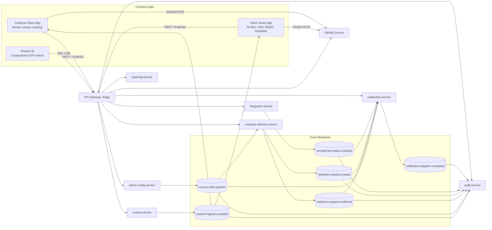
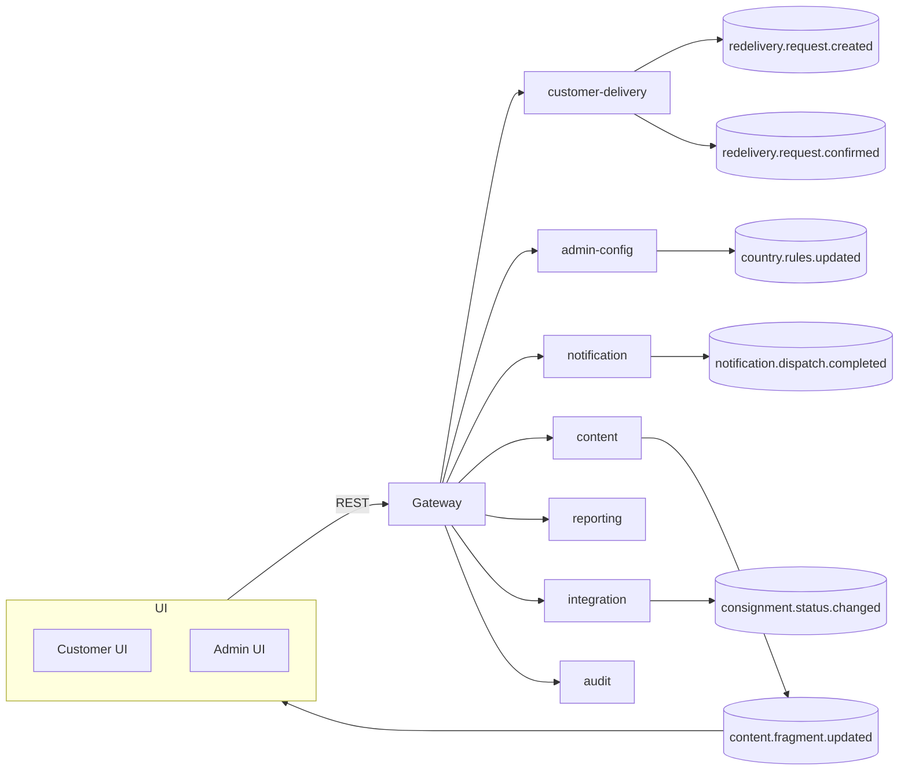
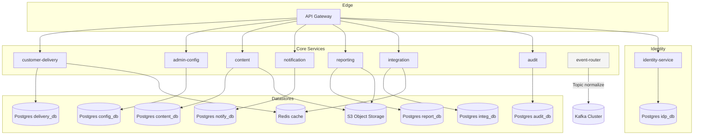
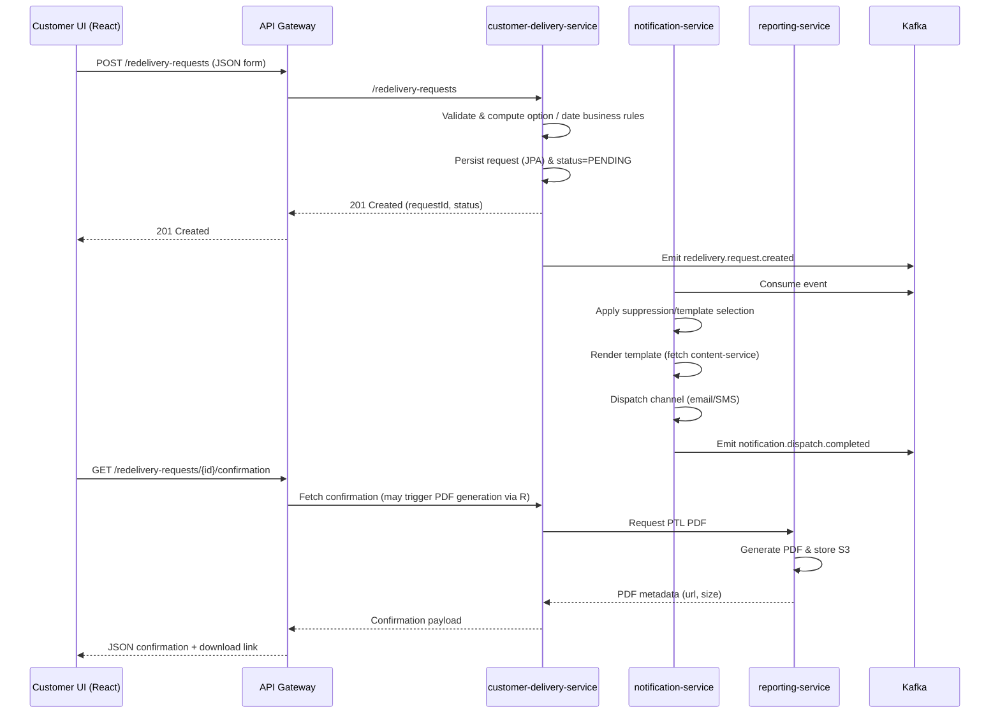
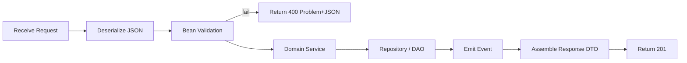

# Unified Platform Relation Flowcharts & Detailed Microservice Reference

Goal: Provide a consolidated visual & textual blueprint covering frontend apps, backend microservices, interaction contracts, processing lifecycles, and data in/out formats for implementation & onboarding.

---
## 1. High-Level Relation Flowchart (Frontend ↔ Backend)


### 1.1 Alternate Compact Flowchart (Troubleshooting Rendering)


---
## 2. Infrastructure & Data Stores Flowchart


---
## 3. Request Lifecycle (Example: Redelivery Request)


---
## 4. Frontend Consumption Pattern
- React forms use RTK Query hooks (e.g. `useGetConsignmentQuery(id)`).
- Wizard steps map to REST calls; data persisted only at final submit.
- Admin UI uses optimistic updates for rules (PUT /rules/countries/{code}).
- Content editing panel streams fragment list (GET /content/fragments?locale=...); WebSocket or SSE optional for live preview using content.fragment.updated events bridged.
- Shared component library supplies Form components with validation schema (Yup) kept consistent with backend constraints (downloadable OpenAPI + JSON Schema). 

---
## 5. Microservice Detailed Reference
Structure template per service:
Purpose | Controllers | Events | DAO & Entities | Services (Domain) | Utilities | Validation | Input Formats | Processing Steps | Output Formats | Frontend Usage | Observability.

### 5.1 gateway-api
- Purpose: Edge routing, auth enforcement, rate limiting, conditional aggregation, GraphQL stitching.
- Controllers: (If REST fallback) HealthController, AggregationController.
- GraphQL: Schema composed from downstream service SDLs.
- DAO: None.
- Services: TokenIntrospectionService, RateLimitService.
- Utilities: CorrelationIdFilter, RequestLoggingFilter.
- Validation: Request size / schema (GraphQL query depth limiter).
- Input: HTTP requests with JWT; GraphQL queries JSON body `{ "query": "{ consignment(id:...) { ... } }"}`.
- Processing: Validate JWT -> apply rate limits -> route to downstream -> aggregate response -> inject headers.
- Output: Pass-through JSON / GraphQL result; error model RFC7807.
- Frontend: All API calls pass through; attaches Authorization header.
- Observability: Metrics (req_count, latency), 4xx/5xx counters, GraphQL complexity gauge.

### 5.2 identity-service
- Purpose: Central IAM (users, roles, sessions).
- Controllers: UserController, RoleController, TokenController (if custom).
- Events: (Optional) user.account.locked, user.role.changed.
- DAO & Entities: UserEntity(id, username, email, status), RoleEntity(name, privileges), ClientEntity.
- Services: UserProvisioningService, PasswordPolicyService.
- Utilities: JwtSigner, OIDCClaimsBuilder.
- Validation: Email, password complexity.
- Input: `POST /users` `{"username":"alice","email":"a@b","roles":["CUSTOMER"]}`.
- Processing: Validate -> hash password -> persist -> emit event (optional).
- Output: 201 JSON user resource (no password); tokens via OAuth2 flows.
- Frontend: Login redirect; token refresh silent.
- Observability: Auth success/fail counters; token issuance histogram.

### 5.3 customer-delivery-service
- Purpose: Consignment read & redelivery request lifecycle.
- Controllers: ConsignmentController (GET consignments), RedeliveryOptionController (GET options/dates), RedeliveryRequestController (POST requests / GET confirmations).
- Events Produced: redelivery.request.created, redelivery.request.confirmed.
- Events Consumed: country.rules.updated (invalidate caches).
- DAO & Entities:
  - ConsignmentEntity(id, trackingNumber, depotCode, status,...)
  - RedeliveryRequestEntity(id, consignmentId, chosenOption, date, contact, status, createdAt)
  - AddressEntity(id, line1, line2, postcode, countryCode)
  - OptionCache(redis): key=consignmentId -> list<OptionDTO>
- Services:
  - ConsignmentService (fetch & enrich)
  - RedeliveryOptionService (rule evaluation)
  - RedeliveryRequestService (validation + persist + emit events)
  - ConfirmationService (assemble confirmation + delegate PDF generation)
- Utilities: DateCutoffCalculator, DepotHolidayResolver, LocaleHelper.
- Validation: Bean Validation (EmailAddress, @ValidPostcode), business: option allowed for country, future date within window.
- Input Samples:
  - `GET /consignments/{id}` -> Path param.
  - `POST /redelivery-requests` JSON:
    ```json
    {
      "consignmentId": "C123456789GB",
      "option": "SELF_COLLECTION",
      "requestedDate": "2025-11-04",
      "contact": {"email": "user@example.com", "phone": "+441234567"},
      "address": {"line1":"1 High St","postcode":"B11AA","countryCode":"GB"}
    }
    ```
- Processing Steps (POST):
  1. Deserialize JSON -> DTO.
  2. Bean validation.
  3. Load consignment record.
  4. Compute valid options & verify chosen option.
  5. Apply date cut-off rules.
  6. Persist RedeliveryRequestEntity (status=PENDING).
  7. Emit redelivery.request.created.
  8. Build response with requestId.
- Output (201): `{ "id":"REQ-98765","status":"PENDING","consignmentId":"C123456789GB" }`.
- Confirmation Output (GET): `{ "id":"REQ-98765","status":"CONFIRMED","pdfUrl":"https://.../ptl-REQ-98765.pdf" }`.
- Frontend Usage: Wizard steps call endpoints sequentially; error codes mapped to form field hints.
- Observability: Metrics: option_calc_latency_ms, request_create_count, request_confirmed_count, cache_hit_ratio.

### 5.4 admin-config-service
- Purpose: Manage country rules, depot data, system parameters.
- Controllers: CountryRuleController, DepotController, SystemParameterController.
- Events Produced: country.rules.updated, depot.updated.
- DAO & Entities:
  - CountryRuleEntity(code, cutoffTime, allowedOptions[], holidays[])
  - DepotEntity(id, code, address, openHours)
  - SystemParameterEntity(key, value, version)
- Services: CountryRuleService (versioning), DepotService, ParameterService.
- Utilities: HolidayCalendarLoader, JsonPatchApplier.
- Validation: Country code ISO, depot uniqueness.
- Input Example PUT /rules/countries/GB:
  ```json
  {"cutoffTime":"16:00","allowedOptions":["SELF_COLLECTION","ALTERNATIVE_ADDRESS"],"holidays":["2025-12-25"]}
  ```
- Processing: Validate -> create new version -> save -> emit country.rules.updated.
- Output: 200 with current rule snapshot (version, effectiveFrom).
- Frontend: Admin form with dynamic option toggles; optimistic UI updates rollback on failure.
- Observability: rule_update_count, depot_sync_errors.

### 5.5 notification-service
- Purpose: Event-driven alert scheduling & dispatch.
- Controllers: AlertQueryController (GET /alerts/{id}), TemplateTestController (POST /alerts/test-send), TemplateController (GET /templates).
- Events Consumed: consignment.status.changed, redelivery.request.created, redelivery.request.confirmed.
- Events Produced: notification.dispatch.completed.
- DAO & Entities:
  - AlertEntity(id, consignmentId, type, channel, status, attempts, lastAttemptAt)
  - TemplateEntity(name, channel, locale, subject, bodyRef)
- Services: AlertGenerationService, SuppressionPolicyService, TemplateRenderService, ChannelDispatchService.
- Utilities: ThrottleCalculator, PlaceholderExpander.
- Validation: Template placeholders existence, rate limits.
- Input Test Send: `POST /alerts/test-send` `{ "template":"DELIVERY_REMINDER","channel":"EMAIL","locale":"en-GB","consignmentId":"C123" }`
- Processing (Event): consume -> evaluate policies -> create AlertEntity -> render -> dispatch -> update status -> emit notification.dispatch.completed.
- Output (dispatch completed event):
  ```json
  {
    "eventType":"notification.dispatch.completed",
    "alertId":"ALRT-555",
    "status":"SUCCESS",
    "channel":"EMAIL",
    "attempts":1,
    "occurredAt":"2025-11-01T10:12:34Z"
  }
  ```
- Frontend: Admin template list & test send form (renders preview using /templates then triggers test-send).
- Observability: alert_backlog_count, dispatch_latency_ms, success_rate_gauge.

### 5.6 content-service
- Purpose: Headless CMS (fragments, templates, assets).
- Controllers: FragmentController, TemplateController, AssetController, DiffController.
- Events Produced: content.fragment.updated.
- DAO & Entities:
  - FragmentEntity(key, locale, version, status, body, metadataTags[])
  - TemplateEntity(name, channel, locale, subject, body, placeholders[])
  - AssetEntity(id, path, contentType, size, checksum)
- Services: FragmentVersioningService, TemplateWorkflowService, AssetStorageService (S3 adapter), DiffService.
- Utilities: MarkdownSanitizer, PlaceholderValidator.
- Validation: Unique fragment key per locale/version; allowed HTML subset.
- Input Example PUT /content/fragments/home-banner?locale=en-GB:
  ```json
  {"body":"<p>Welcome</p>","metadata":{"tags":["home","promo"]},"status":"DRAFT"}
  ```
- Processing: Validate -> create new version -> persist -> optional publish workflow -> emit content.fragment.updated.
- Output: Fragment JSON with version + status.
- Frontend: Fetch fragments at app bootstrap; subscribe to updates via SSE bridging Kafka event.
- Observability: fragment_publish_count, render_cache_hit_ratio.

### 5.7 reporting-service
- Purpose: Generate PDFs (PTL, confirmation, admin reports).
- Controllers: RedeliveryReportController (POST /reports/redelivery/ptl), ConfirmationReportController.
- Events Consumed: notification.dispatch.completed (optional for analytics enrichment).
- DAO & Entities:
  - ReportRequestEntity(id, type, parametersJson, status, createdAt)
  - ReportArtifactEntity(id, requestId, s3Key, size, checksum)
- Services: PdfGenerationService (Jasper/FlyingSaucer), ArtifactStorageService, TemplateMergeService.
- Utilities: DateFormatUtil, HtmlToPdfUtil.
- Validation: Parameter presence (consignmentId, requestId), size limits.
- Input Example POST /reports/redelivery/ptl:
  ```json
  {"requestId":"REQ-98765"}
  ```
- Processing: Lookup request -> build model -> render PDF -> store S3 -> persist artifact -> return stream URL.
- Output: `{ "pdfUrl":"https://s3/.../ptl-REQ-98765.pdf","size":23456 }`
- Frontend: Download link shown after confirmation step.
- Observability: pdf_gen_time_ms, pdf_error_rate.

### 5.8 integration-service
- Purpose: Adapter to external carrier/legacy systems (APC, OSC, StreamServe legacy during migration).
- Controllers: InternalIntegrationController (POST /integration/apc/consignment-details).
- Events Produced: consignment.status.changed.
- DAO & Entities: ExternalMappingEntity(sourceSystem, externalId, internalConsignmentId), CachedConsignmentSnapshotEntity.
- Services: StatusPollingService, ConsignmentEnrichmentService, ExternalApiClient (APCClient, OSCClient).
- Utilities: RetryPolicyUtil, ResponseNormalizer, LocaleHelper.
- Validation: External response schema, status sequence integrity.
- Input Example (internal): `{ "trackingNumber":"123456789" }`.
- Processing: Call external API -> normalize -> upsert mapping/cache -> emit status change event.
- Output: Consignment JSON normalized.
- Frontend: Indirect via customer-delivery-service (never direct).
- Observability: external_call_latency_ms, polling_cycle_duration, error_rate_per_system.

### 5.9 audit-service
- Purpose: Central audit ingestion & querying.
- Controllers: AuditQueryController (GET /audit/events?entityType=RedeliveryRequest&entityId=REQ-98765).
- Events Consumed: All domain events (ingest & store).
- DAO & Entities: AuditEventEntity(id, eventType, entityType, entityId, payloadJson, occurredAt, producerService).
- Services: EventIngestionService, AuditQueryService, RetentionPurger.
- Utilities: JsonCompressor, EncryptionUtil (sensitive fields).
- Validation: Payload size, schema version compatibility.
- Input (query params).
- Processing: On consume -> transform payload -> persist append-only.
- Output: List of event summaries.
- Frontend: Admin timeline for a request or rule.
- Observability: audit_ingest_lag_ms, event_store_disk_usage.

### 5.10 event-router
- Purpose: Topic normalization, schema validation, dead-letter handling.
- Controllers: (Optional) AdminTopicController.
- Events Consumed/Produced: Ingest raw -> produce standardized topics.
- DAO: None (stateless) except config in Kafka.
- Services: SchemaValidationService, DeadLetterService.
- Utilities: SchemaRegistryClient, EventMetricsPublisher.
- Validation: Avro/JSON Schema enforcement.
- Input: Raw events.
- Processing: Validate -> enrich headers -> route to canonical topics.
- Output: Canonical events.
- Frontend: None.
- Observability: invalid_event_count, dlt_size.

---
## 6. Cross-Cutting Patterns
- Error Model: All services return RFC7807 `application/problem+json` with fields: type, title, status, traceId, violations[].
- Versioning: Accept header `application/vnd.delivery.v1+json` for evolution.
- Security: JWT scopes mapped to controller method annotations.
- Pagination: Standard query params `?page=0&size=20&sort=field,asc`.
- Idempotency: POST endpoints optionally accept `Idempotency-Key` header to deduplicate.

---
## 7. Validation to Frontend Mapping
| Backend Constraint | Frontend Form Rule | Message Source |
|--------------------|--------------------|----------------|
| @ValidPostcode(country) | regex & async postcode lookup | shared intl messages |
| option in allowedOptions | dynamic select options | fetched from /consignments/{id}/options |
| requestedDate within window | date picker disable dates | UI calculates + confirms server |
| email format | Yup email() | localized from content-service |

---
## 8. Event Payload Canonical Structure
```json
{
  "eventId": "uuid",
  "eventType": "redelivery.request.created",
  "schemaVersion": 1,
  "occurredAt": "2025-11-01T10:11:12Z",
  "producer": "customer-delivery-service",
  "entity": {
    "type": "RedeliveryRequest",
    "id": "REQ-98765"
  },
  "data": { /* domain specific */ },
  "metadata": {"correlationId": "trace-abc"}
}
```

---
## 9. Controller Layer Template (Pseudocode)
```text
@RestController
@RequestMapping("/redelivery-requests")
class RedeliveryRequestController {
  POST create(requestDto) -> service.create() -> mapper.toResponse()
  GET /{id}/confirmation -> service.confirmation(id)
}
```

---
## 10. Processing Pipeline Pattern (Generic POST)


---
## 11. Frontend Form Flow Example (Redelivery Wizard)

```mermaid
flowchart LR
  START[Enter Tracking Number] --> CONSIGN[GET /consignments/id]
  CONSIGN --> OPTIONS[GET /consignments/id/options]
  OPTIONS --> DATESEL[User selects option]
  DATESEL --> DATES[GET /consignments/id/options/option/dates]
  DATES --> FORM[Fill Contact & Address]
  FORM --> SUBMIT[POST /redelivery-requests]
  SUBMIT --> CONFIRM[GET /redelivery-requests/id/confirmation]
  CONFIRM --> PDF[Download PDF reporting-service]
  PDF --> END[Done]
```


---
## 12. Output Format Summary
| Endpoint | Response Example |
|----------|------------------|
| GET /consignments/{id} | `{ "id":"C123","status":"IN_DEPOT","depotCode":"XYZ","optionsLink":"/consignments/C123/options" }` |
| GET /consignments/{id}/options | `{ "consignmentId":"C123","options":[{"code":"SELF_COLLECTION","label":"Collect at depot"}]}` |
| POST /redelivery-requests | `{ "id":"REQ-98765","status":"PENDING"}` |
| GET /redelivery-requests/{id}/confirmation | `{ "id":"REQ-98765","status":"CONFIRMED","pdfUrl":"https://..."}` |
| PUT /rules/countries/GB | `{ "code":"GB","cutoffTime":"16:00","allowedOptions":["SELF_COLLECTION"],"version":5}` |
| GET /content/fragments/{key}?locale=en-GB | `{ "key":"home-banner","locale":"en-GB","version":7,"body":"<p>Welcome</p>"}` |
| POST /reports/redelivery/ptl | `{ "pdfUrl":"https://...","size":23456}` |
| POST /alerts/test-send | `{ "status":"QUEUED","alertId":"ALRT-555"}` |

---
## 13. Recommended Package Structure (Per Service)
```
com.example.<service>
  api/ (controllers, dto, mapper)
  domain/ (entities, aggregates, services)
  infrastructure/
    persistence/ (repositories, jpa)
    messaging/ (producers, consumers)
    external/ (clients)
  application/ (use cases, orchestrators)
  config/ (Spring configs)
  util/ (helpers, validators)
```

---
## 14. Observability Metrics Cheat Sheet
| Service | Key Metrics |
|---------|-------------|
| customer-delivery | option_calc_latency_ms, redelivery_requests_total, confirmation_latency_ms |
| admin-config | rule_update_total, depot_cache_invalidation_count |
| notification | alerts_pending_count, dispatch_success_ratio, template_render_time_ms |
| content | fragment_publish_total, asset_upload_bytes, cache_hit_ratio |
| reporting | pdf_gen_time_ms, pdf_errors_total |
| integration | external_call_latency_ms{system}, status_events_emitted_total |
| audit | audit_ingest_lag_ms, audit_events_total |
| gateway | request_latency_ms, rate_limit_throttle_count |

---
## 15. Non-Functional Targets (Snapshot)
| Aspect | Target |
|--------|--------|
| Latency (P99 core GET) | < 300ms |
| Availability | 99.9% (gateway & customer-delivery) |
| Event Delivery Lag | < 5s for notification pipeline |
| Error Budget | <= 0.1% failed requests per month |

---
## 16. Frontend Caching & Prefetch
- Use RTK Query prefetch for /consignments/{id}/options after tracking number entry.
- Cache fragment responses in memory keyed by (key, locale, version).
- Stale-While-Revalidate strategy for content.

---
## 17. Security Mapping Example
| Scope | Endpoint Access |
|-------|-----------------|
| customer.redelivery.read | GET /consignments/* |
| customer.redelivery.write | POST /redelivery-requests |
| admin.rules.write | PUT /rules/countries/* |
| admin.content.publish | PUT /content/fragments/* |

---
## 18. Event-Driven Cache Invalidation
- country.rules.updated -> customer-delivery-service invalidates Redis option cache.
- content.fragment.updated -> WebSocket push to clients to refresh fragment.

---
## 19. Error Response Example
```json
{
  "type": "https://docs.mydelivery/errors/validation",
  "title": "Validation Failed",
  "status": 400,
  "traceId": "trace-abc",
  "violations": [
    {"field": "requestedDate", "message": "Date outside allowed window"},
    {"field": "email", "message": "Invalid format"}
  ]
}
```

---
## 20. Future Extensions
- GraphQL schema federation once services publish SDL.
- WebSocket push-service for real-time consignment status.
- ML Feature pipeline subscribing to redelivery.request.created.

---
Use this document as a living reference; update controllers & entities once implementation stabilizes.
