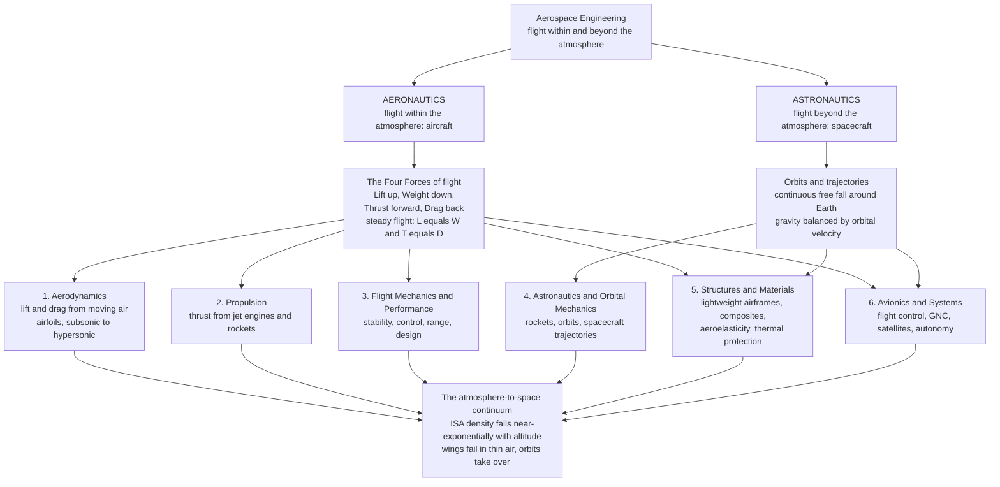

# ✈️ Aerospace Engineering: Flight Within and Beyond the Atmosphere

> [!abstract] TL;DR
> **Aerospace engineering** is humanity's answer to two of its oldest dreams — to **fly like a bird** and to **reach the stars** — pursued as one continuous discipline. It splits into **aeronautics** (flight *within* the atmosphere: aircraft) and **astronautics** (flight *beyond* it: spacecraft), unified by common physics. Every flying machine lives or dies by the balance of **four forces** — **lift** (up, from aerodynamics), **weight** (down, from gravity), **thrust** (forward, from propulsion), and **drag** (back, from air resistance) — and steady flight is nothing more than making them cancel: $L=W$ and $T=D$. The field rests on **six pillars** this vault develops in turn: **(1) aerodynamics** (how moving air makes lift and drag), **(2) propulsion** (thrust from jet engines and rockets), **(3) flight mechanics and performance** (stability, control, range, and design), **(4) astronautics and orbital mechanics** (rockets, orbits, and interplanetary trajectories), **(5) structures and materials** (lightweight airframes, aeroelasticity, composites, thermal protection), and **(6) avionics and systems** (flight control, guidance-navigation-and-control, satellites, autonomy). Binding it all is the **atmosphere-to-space continuum**: air density falls roughly *exponentially* with altitude, so wings that lift a jumbo jet at sea level become useless in the near-vacuum above the **Kármán line** (~100 km), where aerodynamics surrenders to orbital mechanics. From a paper airplane to a jumbo jet to a Mars rover, aerospace is one of engineering's grandest achievements and a systems-engineering exemplar — this note is the **hub** that maps the whole landscape.

## Intuition

**Analogy:** Aerospace engineering is what happens when a species that cannot naturally fly refuses to accept it. Watch a bird ride a thermal, a paper airplane glide across a room, a rocket climb on a pillar of fire, and the Moon hang motionless in the sky, and you are watching the *same* discipline at four scales. The bird and the paper plane both cheat gravity the same way — they lean on **moving air**, borrowing an upward push (**lift**) by flinging air downward. The rocket does something stranger: it does not lean on anything, it **throws mass out the back** so hard that Newton's third law shoves it forward, and if it throws hard and long enough, it goes so fast *sideways* that the ground curves away beneath it as quickly as it falls — and now it is in **orbit**, falling around the Earth forever. The Moon is doing exactly that, just very far out. Aerospace engineering is the single craft that spans all of it: master the **four forces**, master the **atmosphere that thins into vacuum**, and master the **orbits beyond**, and you can build anything from a toy glider to an interplanetary probe.

That unity is the surprising part. A jetliner and a Mars lander seem worlds apart, yet the same person, trained in the same equations, could work on both — because the physics does not switch off at the edge of the sky, it just changes *which force dominates*. Low down, thick air means wings work and drag matters; high up, thin air means wings fail and gravity-plus-inertia (orbital mechanics) takes over; in between lies the whole hair-raising business of getting a fragile, fuel-heavy machine from one regime to the other in one piece. Aerospace engineering is the art of designing for that entire continuum — from where a bird can fly to where the stars begin.

---

## How It Works

### Core Mechanics

Aerospace engineering is best understood as **two theatres of flight** — inside the atmosphere and beyond it — served by **six pillars**, all stitched together by the **four forces** and the **atmosphere-to-space continuum**.

1. **The two theatres — aeronautics and astronautics.** *Aeronautics* is flight within the air: aircraft, from gliders and drones to airliners, fighters, and hypersonic vehicles. It relies on the atmosphere for **lift** (wings need air to push against) and for **air-breathing thrust** (jet engines gulp atmospheric oxygen). *Astronautics* is flight beyond the useful atmosphere: rockets, satellites, capsules, landers, and deep-space probes. Above the **Kármán line** (~100 km, the conventional edge of space) there is too little air to fly on, so vehicles must carry their own oxidizer and obey **orbital mechanics** rather than aerodynamics. The two theatres share physics, mathematics, structures, and control — one discipline, two regimes.

2. **The four forces — the heartbeat of all flight.** Every atmospheric flying machine is a running negotiation among four vectors: **lift** (upward, generated aerodynamically by wings and rotors), **weight** (downward, gravity acting on mass), **thrust** (forward, from propellers, jets, or rockets), and **drag** (backward, the air resisting motion). **Steady, level, unaccelerated flight is simply the balance $L=W$ and $T=D$.** Climb by making thrust exceed drag or lift exceed weight; descend, turn, or accelerate by deliberately unbalancing them. Master this bookkeeping and aircraft performance falls out of it — the sibling note *Aircraft_Performance* develops range, endurance, and the flight envelope from exactly these balances.

3. **Pillar 1 — Aerodynamics: where lift and drag are born.** A wing does *not* lift by the school-taught "equal transit time" myth; it **deflects a sheet of air downward** and, by Newton's third law, is pushed up — equivalently described by the **circulation** bound to the airfoil (Kutta-Joukowski, $L' = \rho U \Gamma$) and by low-pressure suction over the upper surface. This pillar spans the whole speed range — **subsonic**, **transonic** (where shock waves first appear near Mach 1), **supersonic**, and **hypersonic** — and it is the physics face of the [[Fluid_Dynamics_Overview|Fluid Dynamics]] vault, whose [[Lift_Drag_and_Aerodynamics]] note is the shared core (the sibling *Airfoils_and_Wing_Theory* opens this section). *This section of the vault.*

4. **Pillar 2 — Propulsion: making thrust.** Two great families produce the forward force. **Air-breathing** engines (turbojets, turbofans, ramjets, scramjets) take in atmospheric air, add fuel, burn it, and eject the hot exhaust — Brayton-cycle turbomachinery that only works where there is air, drawing on the same compressible-flow physics as the Mechanical Engineering vault's [[Compressible_Flow_and_Propulsion]] (the sibling *Air_Breathing_Propulsion*). **Rockets** carry both fuel *and* oxidizer, so they work in vacuum; their governing law is Tsiolkovsky's rocket equation $\Delta v = v_e \ln(m_0/m_f)$, the tyrannical arithmetic that dictates why rockets are almost all propellant.

5. **Pillar 3 — Flight Mechanics and Performance.** Given lift and thrust, *how does the vehicle actually fly, stay stable, and perform?* This pillar covers **stability and control** (does a disturbed aircraft return to trim, and how do control surfaces command it?), **performance** (takeoff, climb, cruise range and endurance, ceiling, turn rate), and **aircraft design** integration — the sibling *Aircraft_Performance*. It rests on the Physics vault's [[Newtons_Laws_and_Kinematics]] applied to a six-degree-of-freedom rigid body in a moving fluid.

6. **Pillar 4 — Astronautics and Orbital Mechanics.** Beyond the atmosphere, aerodynamics gives way to the two-body problem: a spacecraft in orbit is in continuous **free fall**, its path a conic section governed by gravity and inertia. This pillar covers **orbits** (circular, elliptical, geostationary, sun-synchronous), **orbital maneuvers** (Hohmann transfers, plane changes, rendezvous), **launch and ascent**, **re-entry**, and **interplanetary trajectories** (gravity assists, transfer windows) — the physics-of-space companion to the Astronomy vault's [[Orbital_Mechanics_and_Celestial_Dynamics]] (the sibling *Orbital_Mechanics_and_Astrodynamics*).

7. **Pillar 5 — Structures and Materials.** A flying machine must be simultaneously **strong** and **light** — every extra kilogram costs lift, thrust, and fuel. This pillar covers **airframe** design, **aeroelasticity** (the dangerous coupling of aerodynamic loads with structural flexibility that causes flutter), **composites** and lightweight alloys, and **thermal protection** (the heat shields that keep a re-entry capsule or hypersonic vehicle from burning up) — the sibling *Aerospace_Structures_and_Airframes*.

8. **Pillar 6 — Avionics and Systems.** The nervous system of modern flight: **flight-control** computers (fly-by-wire), **guidance, navigation, and control** (GNC), **sensors** and inertial navigation, **satellite** payloads and buses, communications, and increasing **autonomy**. Aerospace is a **systems-engineering** discipline above all, and this pillar is where aerodynamics, propulsion, structures, and control are integrated into a working vehicle — the sibling *Avionics_and_Flight_Control_Systems*. The concluding *The_Reach_and_Future_of_Aerospace_Engineering* steps back to survey where the field is going.

9. **The thread that binds it — the atmosphere-to-space continuum.** Air **density falls roughly exponentially** with altitude (the **International Standard Atmosphere**, ISA, with a scale height of about 8.5 km). Because lift scales with density, a wing that easily supports a jet at sea level cannot support it at 30 km, and near the **Kármán line** (~100 km) there is simply not enough air to fly on at any sane speed — aerodynamic flight would require orbital velocity, at which point you may as well *be* in orbit. This single fact — quantified by the Meteorology vault's [[Atmospheric_Pressure_and_the_Hydrostatic_Equation]] and demonstrated in the code below — is why aeronautics and astronautics are two ends of *one* discipline rather than two separate fields.

### Flow / Architecture



---

## Key Concepts

### Secondary Level

- **Four forces run every flight.** **Lift** pushes up, **weight** pulls down, **thrust** drives forward, **drag** holds back. When lift equals weight and thrust equals drag, the aircraft flies straight and level — unbalance them to climb, dive, speed up, or slow down.
- **Wings need moving air.** A wing works by shoving air downward and getting pushed up in return, so it only lifts when air is streaming over it — which is why aircraft need speed (from engines) to stay up, and why they cannot fly where there is no air.
- **Rockets throw mass, not air.** A rocket does not push against the ground or the air; it hurls burning gas out the back, and the recoil (Newton's third law) shoves it forward — so a rocket works even in the vacuum of space, where a jet engine or wing cannot.
- **Falling forever is orbiting.** Go fast enough sideways and the Earth curves away beneath you as fast as you fall, so you keep missing the ground — that endless fall is an **orbit**. The Moon and every satellite are simply falling around the Earth.
- **The air thins as you climb.** Air gets thinner and thinner with altitude until, above about 100 km (the **Kármán line**), there is essentially none left — the beginning of space.

### Undergraduate Level

- **The four-force balance.** Steady level flight: $L = W$ and $T = D$. **Lift** $L = \tfrac12 \rho V^2 S\, C_L$ and **drag** $D = \tfrac12 \rho V^2 S\, C_D$, where $\rho$ is air density, $V$ airspeed, $S$ wing area, and $C_L, C_D$ the lift and drag coefficients. The quantity $q = \tfrac12 \rho V^2$ is **dynamic pressure**, the currency of all aerodynamic forces.
- **The lift-to-drag ratio.** Aerodynamic efficiency is captured by $L/D = C_L/C_D$; a glider's best glide ratio, an airliner's fuel burn, and a wing's whole design all chase a high $L/D$.
- **The drag polar and induced drag.** Total drag $C_D = C_{D,0} + \tfrac{C_L^2}{\pi e AR}$: a fixed **parasite** part plus **induced** drag that grows with lift and shrinks with aspect ratio $AR$ — the physics behind long, slender high-altitude wings.
- **Mach number and flight regimes.** $M = V/a$, where $a=\sqrt{\gamma R T}$ is the local speed of sound. $M<0.8$ subsonic, $0.8<M<1.2$ transonic (shock waves appear), $1.2<M<5$ supersonic, $M>5$ hypersonic — each regime a different aerodynamic world.
- **The International Standard Atmosphere.** ISA models temperature, pressure, and density vs altitude: a troposphere with lapse rate $6.5\,\mathrm{K/km}$ up to 11 km, then an isothermal stratosphere. Pressure and density fall roughly as $e^{-h/H}$ with scale height $H\approx 8.5$ km.
- **The rocket equation.** Tsiolkovsky: $\Delta v = v_e \ln(m_0/m_f) = I_{sp}\, g_0 \ln(m_0/m_f)$. Because $\Delta v$ depends on the *logarithm* of the mass ratio, reaching orbit ($\Delta v \approx 9.4$ km/s including losses) forces rockets to be almost entirely propellant.
- **Orbital and escape velocity.** Circular orbit speed $v_c = \sqrt{GM/r}$ (~7.8 km/s in low Earth orbit); escape speed $v_e = \sqrt{2GM/r} = \sqrt{2}\,v_c$ (~11.2 km/s from Earth's surface).

### Graduate Level

- **Compressible aerodynamics and the transonic barrier.** For $M \to 1$, the Prandtl-Glauert singularity, critical Mach number, wave drag, and the drag-divergence rise drive **swept wings**, **supercritical airfoils**, and area-ruling; supersonic flow brings oblique/bow shocks and Prandtl-Meyer expansion, hypersonics adds real-gas, high-temperature, and viscous-interaction effects.
- **Aeroelasticity.** The three-way coupling of aerodynamic, elastic, and inertial forces produces **static** phenomena (divergence, control reversal) and **dynamic** ones — most dangerously **flutter**, a self-excited oscillation that can destroy a wing in seconds; flight-envelope clearance requires coupled fluid-structure analysis.
- **Astrodynamics beyond two bodies.** Orbital perturbations ($J_2$ oblateness driving nodal regression and sun-synchronous design), Lambert's problem, patched-conics and the restricted three-body problem, Lagrange points, low-energy transfers, and gravity-assist trajectory design.
- **Ascent, re-entry, and thermal protection.** Gravity-turn ascent optimization and staging; re-entry heating scaling ($\dot q \propto \rho^{0.5} V^3$), ballistic vs lifting entry corridors, ablative and reusable thermal-protection systems, and the plasma-sheath blackout.
- **Guidance, navigation, and control.** Six-degree-of-freedom flight dynamics, stability derivatives and modal analysis (phugoid, short-period, Dutch roll), fly-by-wire control laws, Kalman-filter state estimation, and inertial-plus-GNSS navigation.
- **Systems engineering and multidisciplinary optimization.** Aerospace vehicles are the canonical **MDO** problem — coupling aerodynamics, propulsion, structures, controls, and trajectory into a single optimized design under tight mass, cost, and reliability budgets, with margins for uncertainty and failure tolerance.

---

## Python Demo

```python
# AEROSPACE ENGINEERING IN ONE FIGURE: the atmosphere-to-space continuum.
#
#   Panel A -> the INTERNATIONAL STANDARD ATMOSPHERE (ISA):
#              pressure and density vs altitude, 0-50 km, near-exponential falloff.
#   Panel B -> DENSITY from sea level to LOW EARTH ORBIT (0-500 km, log scale),
#              marking cruise (~11 km), the Karman line (~100 km), and LEO (~400 km).
#   Panel C -> the FOUR FORCES of steady level flight: L = W (up = down),
#              T = D (forward = back) -- the balance every aircraft runs on.
#   Panel D -> WHY WINGS STOP WORKING: the airspeed needed to sustain a fixed
#              wing loading blows up as air thins, crossing orbital velocity near
#              the Karman line -- past which you may as well BE in orbit (rockets).
#
# Requires: numpy, matplotlib
import numpy as np
import matplotlib.pyplot as plt

g0   = 9.80665     # gravity [m/s^2]
Rgas = 287.05      # specific gas constant for air [J/(kg K)]

# =====================================================================
# (A) International Standard Atmosphere, 0-50 km (piecewise ISA layers)
#     layer: (base altitude [m], base T [K], lapse rate [K/m])
# =====================================================================
layers = [(0.0, 288.15, -0.0065), (11000.0, 216.65, 0.0),
          (20000.0, 216.65, 0.0010), (32000.0, 228.65, 0.0028)]
P0 = 101325.0  # sea-level pressure [Pa]

def isa(h):
    """Return (T, P, rho) for geopotential altitude h [m], 0-47 km."""
    Pb, hb, Tb, Lb = P0, *layers[0]
    for i, (h_b, T_b, L_b) in enumerate(layers):
        # top of this layer
        h_top = layers[i + 1][0] if i + 1 < len(layers) else 47000.0
        if h <= h_top:
            hb, Tb, Lb = h_b, T_b, L_b
            break
        # advance base pressure to the top of this fully-traversed layer
        if L_b == 0.0:
            Pb *= np.exp(-g0 * (h_top - h_b) / (Rgas * T_b))
        else:
            Pb *= (1.0 + L_b * (h_top - h_b) / T_b) ** (-g0 / (Rgas * L_b))
    T = Tb + Lb * (h - hb)
    if Lb == 0.0:
        P = Pb * np.exp(-g0 * (h - hb) / (Rgas * Tb))
    else:
        P = Pb * (T / Tb) ** (-g0 / (Rgas * Lb))
    return T, P, P / (Rgas * T)

h_low = np.linspace(0, 47000, 400)
T_low, P_low, rho_low = np.array([isa(h) for h in h_low]).T

# =====================================================================
# (B) Exponential atmosphere to LEO, 0-500 km (Vallado piecewise model):
#     (base alt [km], base density [kg/m^3], scale height [km])
# =====================================================================
exp_atm = np.array([
    (0, 1.225,     7.249), (25, 3.899e-2, 6.349), (30, 1.774e-2, 6.682),
    (40, 3.972e-3, 7.554), (50, 1.057e-3, 8.382), (60, 3.206e-4, 7.714),
    (70, 8.770e-5, 6.549), (80, 1.905e-5, 5.799), (90, 3.396e-6, 5.382),
    (100, 5.297e-7, 5.877), (110, 9.661e-8, 7.263), (120, 2.438e-8, 9.473),
    (130, 8.484e-9, 12.636), (140, 3.845e-9, 16.149), (150, 2.070e-9, 22.523),
    (180, 5.464e-10, 29.740), (200, 2.789e-10, 37.105), (250, 7.248e-11, 45.546),
    (300, 2.418e-11, 53.628), (350, 9.518e-12, 53.298), (400, 3.725e-12, 58.515),
    (450, 1.585e-12, 60.828), (500, 6.967e-13, 63.822)])

def rho_exp(h_km):
    """Density [kg/m^3] at altitude h_km using the piecewise exponential model."""
    base = exp_atm[exp_atm[:, 0] <= h_km][-1]
    h0, rho0, H = base
    return rho0 * np.exp(-(h_km - h0) / H)

h_hi   = np.linspace(0, 500, 600)          # km
rho_hi = np.array([rho_exp(h) for h in h_hi])

# =====================================================================
# (D) Airspeed needed to hold a fixed wing loading vs altitude:
#     L = W  =>  0.5 * rho * V^2 * S * CL = W  =>  V = sqrt(2 (W/S) / (rho CL))
# =====================================================================
WoS = 6000.0   # wing loading W/S [N/m^2] (~ a jet transport)
CL  = 0.5      # cruise lift coefficient
V_needed = np.sqrt(2.0 * WoS / (rho_hi * CL))       # m/s
V_orbit  = 7800.0                                    # LEO circular speed [m/s]
V_escape = 11200.0                                   # Earth escape speed [m/s]

# ------------------------------ plotting ------------------------------
fig, ax = plt.subplots(2, 2, figsize=(14, 10))
fig.suptitle("Aerospace Engineering: The Atmosphere-to-Space Continuum",
             fontsize=15, fontweight="bold")

# A: ISA pressure and density, 0-50 km
axA = ax[0, 0]
axA.plot(P_low / P0, h_low / 1000, color="#1f77b4", lw=2.4, label="pressure  P/P0")
axA.plot(rho_low / 1.225, h_low / 1000, color="#d62728", lw=2.4,
         label="density  rho/rho0")
axA.axhline(11, ls="--", color="gray", lw=1)
axA.text(0.42, 11.6, "tropopause ~11 km (jet cruise)", fontsize=8, color="gray")
axA.set_xlabel("fraction of sea-level value")
axA.set_ylabel("altitude  [km]")
axA.set_title("A. International Standard Atmosphere\nboth fall near-exponentially with height")
axA.legend(loc="upper right", fontsize=9)
axA.grid(alpha=0.3)

# B: density to LEO on a log axis, key altitudes marked
axB = ax[0, 1]
axB.semilogx(rho_hi, h_hi, color="#d62728", lw=2.4)
for alt, lab in [(11, "jet cruise ~11 km"),
                 (100, "Karman line ~100 km (edge of space)"),
                 (400, "Low Earth Orbit ~400 km")]:
    axB.axhline(alt, ls="--", color="gray", lw=1)
    axB.text(rho_exp(alt) * 3, alt + 6, lab, fontsize=8, color="#333333")
axB.axhspan(0, 100, color="#4a9eff", alpha=0.10)
axB.axhspan(100, 500, color="#2c2c54", alpha=0.10)
axB.text(1e-11, 55, "AERONAUTICS\nwings work", fontsize=9, color="#1f77b4",
         fontweight="bold")
axB.text(1e-6, 300, "ASTRONAUTICS\norbits, rockets", fontsize=9, color="#2c2c54",
         fontweight="bold")
axB.set_xlabel("air density  [kg/m^3]  (log scale)")
axB.set_ylabel("altitude  [km]")
axB.set_title("B. Sea level to orbit: density spans ~12 orders\nof magnitude")
axB.set_xlim(1e-13, 3)
axB.grid(alpha=0.3, which="both")

# C: the four forces of steady level flight
axC = ax[1, 0]
axC.set_xlim(-1.6, 1.6); axC.set_ylim(-1.6, 1.6); axC.set_aspect("equal")
axC.axis("off")
axC.add_patch(plt.Rectangle((-0.35, -0.15), 0.7, 0.3, color="#cccccc", ec="k"))
axC.annotate("", xy=(0, 1.25), xytext=(0, 0),
             arrowprops=dict(arrowstyle="-|>", color="#2ca02c", lw=3))
axC.annotate("", xy=(0, -1.25), xytext=(0, 0),
             arrowprops=dict(arrowstyle="-|>", color="#d62728", lw=3))
axC.annotate("", xy=(1.25, 0), xytext=(0, 0),
             arrowprops=dict(arrowstyle="-|>", color="#1f77b4", lw=3))
axC.annotate("", xy=(-1.25, 0), xytext=(0, 0),
             arrowprops=dict(arrowstyle="-|>", color="#ff7f0e", lw=3))
axC.text(0, 1.38, "LIFT  (up)", ha="center", color="#2ca02c", fontweight="bold")
axC.text(0, -1.48, "WEIGHT  (down)", ha="center", color="#d62728", fontweight="bold")
axC.text(1.32, 0, "THRUST\n(forward)", va="center", color="#1f77b4", fontweight="bold")
axC.text(-1.32, 0, "DRAG\n(back)", va="center", ha="right", color="#ff7f0e",
         fontweight="bold")
axC.set_title("C. Steady level flight:  L = W  and  T = D", fontsize=11)

# D: airspeed to sustain lift vs altitude -- why wings give out
axD = ax[1, 1]
mask = V_needed < 3e4
axD.plot(V_needed[mask] / 1000, h_hi[mask], color="#1f77b4", lw=2.4,
         label="airspeed to hold\nfixed wing loading")
axD.axvline(V_orbit / 1000, ls="--", color="#2ca02c", lw=2,
            label="orbital speed ~7.8 km/s")
axD.axvline(V_escape / 1000, ls=":", color="#d62728", lw=2,
            label="escape speed ~11.2 km/s")
axD.axhline(100, ls="--", color="gray", lw=1)
axD.text(12, 103, "Karman line", fontsize=8, color="gray")
axD.set_xlim(0, 15)
axD.set_ylim(0, 160)
axD.set_xlabel("required airspeed  [km/s]")
axD.set_ylabel("altitude  [km]")
axD.set_title("D. Why wings quit: to stay up in thin air you'd\nneed orbital speed -- so just orbit instead")
axD.legend(loc="lower right", fontsize=8)
axD.grid(alpha=0.3)

plt.tight_layout(rect=[0, 0, 1, 0.95])
plt.show()

# ---- console summary ----
for h in [0, 11, 20]:
    T, P, r = isa(h * 1000)
    print(f"h = {h:2d} km : T = {T:6.1f} K, P = {P/P0*100:6.2f} % P0, "
          f"rho = {r/1.225*100:6.2f} % rho0")
print(f"density at Karman line (100 km): {rho_exp(100):.2e} kg/m^3  "
      f"({rho_exp(100)/1.225:.1e} of sea level)")
print(f"density at LEO (400 km)        : {rho_exp(400):.2e} kg/m^3")
```

Running this prints the ISA values and draws four panels that, together, *are* aerospace engineering. Panel **A** shows the **International Standard Atmosphere**: pressure and density both plunging near-exponentially with height, with the ~11 km tropopause where airliners cruise. Panel **B** stretches that same falloff from sea level to low Earth orbit on a log axis, revealing density dropping about **twelve orders of magnitude** and splitting the sky into an **aeronautics** zone (wings work) below the **Kármán line** and an **astronautics** zone (orbits and rockets) above it. Panel **C** is the **four-force balance** — lift against weight, thrust against drag — the single diagram every pilot and designer carries in their head. Panel **D** delivers the punchline of the whole continuum: the airspeed a wing needs to hold a fixed load **explodes** as the air thins, and by ~100 km it exceeds **orbital velocity** — at which point aerodynamic flight is pointless and you may as well *be* in orbit. That crossover is precisely why one discipline must span both the bird's realm and the stars'.

---

## Real-World Applications

> **Example:** A **crewed mission to orbit** is the entire vault compressed into one launch. On the pad, a **rocket** (Pillar 2) obeys Tsiolkovsky's equation, which is why it is ~90% propellant; during ascent it fights **aerodynamic drag** and dynamic-pressure loads (Pillar 1) through the thickening-then-thinning air of the **standard atmosphere**, its **structure** (Pillar 5) sized against those loads while shedding every possible kilogram; its **guidance, navigation, and control** (Pillar 6) steer a gravity-turn trajectory computed by **orbital mechanics** (Pillar 4) to inject the vehicle into a circular orbit at ~7.8 km/s; and its **flight-performance** margins (Pillar 3) decide how much payload survives to orbit. On the way home the same craft trades that orbital energy for **re-entry heating**, protected by a **thermal-protection** structure — Pillar 5 again — as it crosses back from the astronautics regime into the aeronautics one. Six pillars, one flight.

- **Commercial aviation.** Airliners are optimized for cruise **lift-to-drag ratio** and fuel burn: supercritical swept wings tame transonic drag, high-bypass turbofans maximize propulsive efficiency, and fly-by-wire flight control keeps a relaxed-stability airframe safe — aerodynamics, propulsion, and avionics in daily service.
- **Satellites and the space economy.** GPS, weather forecasting, telecommunications, and Earth observation all ride on satellites placed and maintained by **orbital mechanics** (sun-synchronous and geostationary orbits are designed exploiting $J_2$ perturbations) — the infrastructure behind navigation apps, storm warnings, and global internet.
- **Defense and high-speed flight.** Fighters, missiles, and hypersonic vehicles push supersonic and hypersonic aerodynamics, propulsion (afterburning turbojets, ramjets, scramjets), and thermal management to their limits.
- **Reusable launch and new space.** Propulsive landing, rapid reusability, and mass-optimized structures have collapsed launch cost — a systems-engineering achievement integrating every pillar, and the reason mega-constellations and routine cargo flights are now economic.
- **Planetary exploration.** Mars rovers, landers, and deep-space probes combine interplanetary **trajectory design** (Hohmann transfers, gravity assists), entry-descent-and-landing (parachutes plus thin-atmosphere aerodynamics plus retro-rockets), and years of autonomous **GNC** — aerospace engineering operating hundreds of millions of kilometers from any human hand.
- **Drones and urban air mobility.** Small UAVs and emerging air taxis apply low-Reynolds-number aerodynamics, electric propulsion, lightweight structures, and heavy autonomy — the field's fastest-growing frontier.

---

## Common Pitfalls

- **Believing the "equal transit time" lift myth.** The popular story that air must travel over the longer top surface "faster to meet at the back" is simply false and predicts far too little lift. Lift comes from the wing **turning a mass of air downward** (Newton's third law), equivalently expressed as bound circulation. Getting the mechanism right matters the moment you leave the textbook cartoon.
- **Forgetting that density, not just speed, sets aerodynamic force.** Lift and drag scale with **dynamic pressure** $q = \tfrac12 \rho V^2$, so the *same* airspeed produces very different forces at sea level and at altitude. A wing sized for takeoff density behaves entirely differently in thin cruise air — and not at all above the Kármán line.
- **Underestimating the tyranny of the rocket equation.** Because $\Delta v$ grows only as the **logarithm** of the mass ratio, small increases in required velocity demand exponentially more propellant. This is why single-stage-to-orbit is so hard, why staging exists, and why every kilogram of dry mass is fought over. Treating rocket sizing as linear leads to wildly optimistic designs.
- **Confusing "high" with "in space."** Altitude alone does not make an orbit — you can reach 100 km on a sounding rocket and fall straight back. **Orbit is about horizontal velocity** (~7.8 km/s), not height; the hard part of reaching space is going *sideways* fast enough, not up far enough.
- **Ignoring aeroelasticity until it bites.** Analyzing a wing as a rigid body hides **flutter** — a self-excited coupling of aerodynamics and structural flexibility that can destroy an airframe within its flight envelope. Structures and aerodynamics must be analyzed *together*; the history of aviation is littered with aircraft lost to flutter and divergence.
- **Treating the pillars as independent.** Aerospace is a **systems-engineering** discipline: a lighter structure changes the aerodynamics, a different engine shifts the center of gravity and the control laws, a new trajectory changes the heating. Optimizing one pillar in isolation routinely makes the whole vehicle worse — the field lives and dies by multidisciplinary integration.

---

## Related Concepts

**Aerodynamics and fluid physics (Fluid Dynamics vault)**
- [[Lift_Drag_and_Aerodynamics]] — the shared aerodynamic core: circulation, the drag polar, stall, and lift-to-drag ratio
- [[Fluid_Dynamics_Overview]] — the physics-of-flow vault whose Navier-Stokes core underlies all of aerodynamics
- [[Shock_Waves_and_Supersonic_Flow]] — the compressible-flow physics of the transonic barrier and supersonic flight
- [[Aerodynamics_and_Aerospace_Applications]] — the Fluid Dynamics vault's applied chapter on wings, wind tunnels, and CFD for aircraft
- [[The_Boundary_Layer]] — the thin viscous layer that governs skin-friction drag and stall

**Propulsion and thermal-fluid systems**
- [[Compressible_Flow_and_Propulsion]] — the Mechanical Engineering vault's gas-dynamics and nozzle physics behind jets and rockets

**Orbital mechanics and the space environment (Astronomy vault)**
- [[Orbital_Mechanics_and_Celestial_Dynamics]] — Kepler, conic-section orbits, and the two-body problem behind astronautics

**Physical foundations**
- [[Newtons_Laws_and_Kinematics]] — the force-and-motion bedrock beneath flight mechanics, propulsion, and orbits
- [[Atmospheric_Pressure_and_the_Hydrostatic_Equation]] — the barometric law and scale height that define the standard atmosphere

---

## Review Questions

**Secondary**
1. An airliner is flying straight and level at a constant speed. Name the four forces acting on it and state which pairs are balanced. What would the pilot have to change to (a) climb and (b) speed up? Why can this same aircraft not fly at the altitude where a satellite orbits?

**Undergraduate**
2. A wing must generate lift $L = \tfrac12 \rho V^2 S\, C_L$ equal to the aircraft's weight. Using the fact that air density $\rho$ falls roughly exponentially with altitude, explain quantitatively why an aircraft must fly *faster* to stay aloft as it climbs, and why there is an altitude above which sustaining aerodynamic flight would require orbital velocity. Then explain, using the rocket equation, why a rocket rather than a jet is needed to actually reach that altitude and stay there.

**Graduate**
3. A launch vehicle must deliver a satellite to a 400 km circular orbit. Trace how *all six* pillars of aerospace engineering appear across the mission — from the pad to orbit insertion — and identify two places where treating a pillar in isolation (for example, optimizing structural mass without re-checking aeroelasticity, or planning the trajectory without accounting for atmospheric drag during ascent) could compromise the whole vehicle. Frame your answer in terms of multidisciplinary systems engineering and margin under uncertainty.

---

## Sources

- J. D. Anderson — *Introduction to Flight*, 8th ed. (McGraw-Hill, 2016)
- J. D. Anderson — *Fundamentals of Aerodynamics*, 6th ed. (McGraw-Hill, 2017)
- G. P. Sutton & O. Biblarz — *Rocket Propulsion Elements*, 9th ed. (Wiley, 2016)
- H. D. Curtis — *Orbital Mechanics for Engineering Students*, 4th ed. (Butterworth-Heinemann, 2020)
- D. G. Hull — *Fundamentals of Airplane Flight Mechanics* (Springer, 2007)

---

#aerospace-engineering #aerodynamics #flight #propulsion #astronautics
