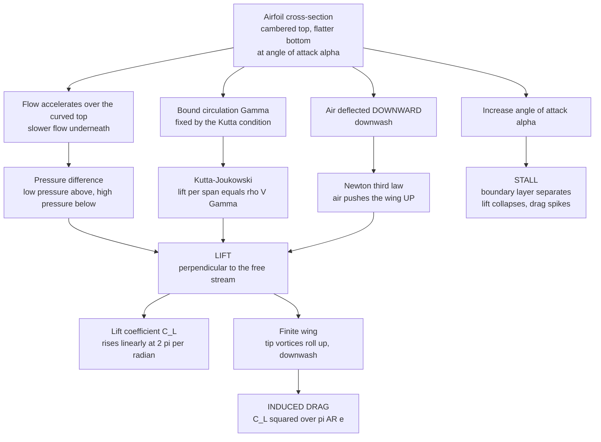

# 🛩️ Airfoils and Wing Theory

> [!abstract] TL;DR
> A **wing** is a shaped obstacle that turns a river of air **downward**; by Newton's third law the air pushes the wing **up**, and that reaction — summed over the whole planform — is **lift**. Slice a wing and you get an **airfoil**: curved (cambered) on top, flatter below, tilted slightly nose-up at an **angle of attack** $\alpha$. Air racing over the longer curved top speeds up and its pressure drops, while slower higher-pressure air below pushes up; the rigorous statement is the **circulation** bound to the airfoil, set by the **Kutta condition** and converted to force by **Kutta–Joukowski** $L' = \rho V \Gamma$. The **lift coefficient** $C_\ell$ climbs almost linearly with $\alpha$ at the thin-airfoil slope of $\approx 2\pi$ per radian until the flow **separates** and the wing **stalls** — a hard safety limit. Real wings are *finite*: their tips shed **vortices** that induce **downwash** and an unavoidable **induced drag** $C_{D,i} = C_\ell^2/(\pi\,AR\,e)$, which is why gliders and airliners wear long, slender, high-**aspect-ratio** wings. Airfoil and wing theory is the foundation of every aircraft, propeller, turbine blade, wind turbine, sail, and hydrofoil ever designed.

---

## Intuition

**Analogy:** Picture a wing as a *cleverly shaped obstacle placed in a river of air*. The obstacle does not block the river — it gently **bends the flow downward**, throwing a great sheet of air toward the ground. Newton's third law does the rest: shove tonnes of air down every second, and the air shoves the wing (and the 400-tonne jet hanging beneath it) up in return. That is lift, in one sentence.

Now zoom in and slice the wing crosswise. What you hold is an **airfoil**: rounded and *curved on top*, *flatter underneath*, and cocked slightly nose-up into the oncoming wind. Air taking the longer, more curved path over the top **speeds up**, and faster air has **lower pressure**; the slower, higher-pressure air sliding along the bottom presses upward. Add that pressure difference over the entire wing and you again get lift — the *same* force, viewed through pressure instead of momentum. But tilt the airfoil too steeply and the smooth stream can no longer cling to the curved back: it **rips away** into a turbulent mess, the suction over the top collapses, and lift vanishes almost instantly. That sudden loss is a **stall**, and respecting its edge is the difference between flying and falling. (One caution up front: the school story that air must "meet its partner" at the trailing edge is a *myth* — the top air actually arrives sooner, and it is circulation, not equal transit time, that sets the lift.)

---

## How It Works

### Core Mechanics

**1. The airfoil: camber, thickness, chord, and angle of attack.** An airfoil is defined by its **mean camber line** (the curve halfway between upper and lower surfaces), its **thickness** distribution, and its **chord** $c$ (the straight line from leading to trailing edge). The **angle of attack** $\alpha$ is the tilt between the chord and the oncoming free stream $V_\infty$. **Camber** biases the airfoil toward positive lift even at $\alpha = 0$ (its **zero-lift angle** $\alpha_0$ is negative); **thickness** governs stall gentleness and structural room. The **NACA** families codify all of this — e.g. the 4-digit *NACA 2412* means 2 % camber at 40 % chord, 12 % thick.

**2. Three consistent stories for one lift force.**
- **Newton / momentum.** The airfoil *turns the flow*: air arrives roughly horizontal and leaves with a **downward** component (**downwash**). The rate of downward momentum handed to the air equals the lift. No downwash, no lift.
- **Circulation / Kutta–Joukowski.** Superpose the free stream with a **bound vortex** of strength $\Gamma$ (the **circulation**) and you reproduce the real picture — faster over the top, slower below. Lift per unit span is exactly $L' = \rho\,V_\infty\,\Gamma$. The sharp trailing edge fixes $\Gamma$ through the **Kutta condition** (flow leaves the trailing edge smoothly instead of whipping around it). This is the rigorous, quantitative basis.
- **Pressure / Bernoulli, done right.** Faster flow over the top means **lower pressure** — a **suction peak** near the leading edge — while the underside runs slower and higher pressure. The net upward imbalance is the lift. Fully consistent with Bernoulli, but the speed-up comes from **circulation and curvature**, *not* from any equal-transit-time rule.

All three are the same physics. Camber and angle of attack are simply the knobs that set how much circulation and downwash the airfoil produces.

**3. The lift curve and the lift coefficient.** Non-dimensionalise lift by the dynamic pressure $q = \tfrac12\rho V_\infty^2$ and area: $C_\ell = L'/(q\,c)$ for a 2D section, $C_L = L/(q\,S)$ for a whole wing. **Thin-airfoil theory** predicts a lift slope of $2\pi$ **per radian** ($\approx 0.11$ per degree), so
$$C_\ell = 2\pi(\alpha - \alpha_0).$$
$C_\ell$ therefore rises almost perfectly **linearly** with $\alpha$ — the airfoil's signature straight line.

**4. Stall — the linear story ends.** The linear rise cannot last. As $\alpha$ grows, the adverse pressure gradient over the rear upper surface steepens until the **boundary layer separates**. At the **critical angle** (typically $12$–$16^\circ$) the flow detaches, the suction peak collapses, $C_\ell$ reaches $C_{\ell,\max}$ and then **drops sharply** while drag spikes. This is **stall** — the single most important safety limit in aviation, and it depends on *angle of attack*, not airspeed. **High-lift devices** delay it: **flaps** add camber and area, **slats** re-energise the boundary layer, together pushing $C_{L,\max}$ higher for slow takeoff and landing.

**5. Drag and efficiency.** Alongside lift comes **drag**, non-dimensionalised as $C_D$, and the ratio that matters most is the **lift-to-drag ratio** $L/D = C_L/C_D$ — the **glide ratio** and the driver of range and fuel burn. A modern airliner cruises near its best $L/D$ of $17$–$20$; a high-performance glider exceeds $50$.

**6. Finite wings — the price of having ends.** A real wing is not infinite. High-pressure air below spills around each **wingtip** to the low-pressure top, rolling up into two trailing **wingtip vortices**. These induce a **downwash** over the whole span that tilts the local lift vector backward, producing **induced drag**:
$$C_{D,i} = \frac{C_L^2}{\pi\,AR\,e},$$
where $AR = b^2/S$ is the **aspect ratio** (span$^2$ over area) and $e$ is the Oswald efficiency ($e = 1$ for the ideal elliptical loading of **Prandtl's lifting-line theory**). Two lessons fall straight out: induced drag **grows as the square of lift** (worst at low speed, high-$\alpha$ climb and tight turns), and it **shrinks with high aspect ratio**. That is precisely *why gliders, albatrosses, and airliners have long, thin wings*. Finiteness also **reduces the lift slope** — a low-$AR$ wing needs more $\alpha$ for the same $C_L$: $a = a_0/(1 + a_0/(\pi e\,AR))$.

**7. Planform choices.** Beyond aspect ratio, designers tune **taper** (narrowing tips toward the ideal elliptical load), **sweep** (delaying the drag rise near the speed of sound), and **twist** (washout, to make the root stall before the tip so ailerons stay effective). Each is a lever on the same lift-and-drag budget this note sets out.

### Flow / Architecture



---

## Key Concepts

### Secondary Level

- **A wing bends air down.** The wing throws a sheet of air toward the ground; by Newton's third law the air throws the wing up. That reaction is **lift** — enough to hold a jumbo jet aloft.
- **The airfoil shape.** Curved on top, flatter below, tilted slightly nose-up. Air over the longer top speeds up and its pressure drops; the higher pressure underneath pushes up. Same lift, seen as pressure.
- **Angle of attack has a limit.** Tilt the wing more into the wind and it lifts harder — *up to a point*. Past the critical angle it **stalls**: the airflow tears away and lift suddenly collapses. Pilots fear the stall for good reason.
- **Why gliders have long thin wings.** Long, slender wings leak less air around their tips, wasting less energy in swirling wingtip vortices — so they glide farther for every metre they sink.
- **The myth to unlearn.** Air does *not* have to "meet up" at the back of the wing. That equal-transit-time story is wrong and predicts far too little lift.

### Undergraduate Level

- **Lift coefficient and lift curve.** $C_\ell = L'/(\tfrac12\rho V_\infty^2 c)$; thin-airfoil theory gives $C_\ell = 2\pi(\alpha - \alpha_0)$ — slope $\approx 0.11$ per degree, offset by the zero-lift angle $\alpha_0 < 0$ for a cambered section.
- **Kutta–Joukowski and the Kutta condition.** $L' = \rho V_\infty \Gamma$; the sharp trailing edge selects the circulation so the flow leaves smoothly. Circulation is the rigorous origin of lift.
- **Stall.** Boundary-layer separation caps $C_\ell$ at $C_{\ell,\max}$ near $\alpha_{\text{crit}}$; beyond it, lift falls and drag rises. Flaps and slats raise $C_{L,\max}$.
- **Finite-wing lift slope.** $a = \dfrac{a_0}{1 + a_0/(\pi e\,AR)}$ (with $a_0 = 2\pi$/rad): lower aspect ratio means a *shallower* lift curve.
- **Induced drag.** $C_{D,i} = \dfrac{C_L^2}{\pi\,AR\,e}$; total drag $C_D = C_{D,0} + C_{D,i}$ (the **drag polar**). $AR = b^2/S$; $e \le 1$ is the Oswald efficiency.
- **Efficiency.** $L/D = C_L/C_D$, maximised at one best angle of attack — the cruise point of an aircraft and the sink-rate optimum of a glider.

### Graduate Level

- **Thin-airfoil theory.** Model the camber line as a vortex sheet $\gamma(x)$ satisfying the flow-tangency and Kutta ($\gamma(\text{TE}) = 0$) conditions; a Glauert (Fourier) expansion yields $C_\ell = 2\pi(\alpha - \alpha_0)$ and moment about the quarter-chord independent of $\alpha$ (the **aerodynamic centre** at $c/4$).
- **Prandtl lifting-line theory.** Represent the wing as a bound vortex of spanwise-varying strength $\Gamma(y)$ shedding a trailing vortex sheet; the fundamental integro-differential equation gives the induced angle and downwash. The **elliptical lift distribution** is the unique minimiser of induced drag, achieving $C_{D,i} = C_L^2/(\pi\,AR)$ at $e = 1$ with uniform downwash.
- **The starting vortex and Kelvin's theorem.** Because circulation is conserved on a material loop in inviscid flow, the bound $\Gamma$ generated at takeoff must be matched by an equal-and-opposite **starting vortex** shed downstream — the vorticity bookkeeping developed in [[Vorticity_and_Circulation]].
- **Boundary layers and real stall.** Whether stall is gentle (trailing-edge, thick airfoils) or abrupt (leading-edge bubble burst, thin airfoils) depends on the boundary-layer state and Reynolds number; laminar separation bubbles dominate low-$Re$ (UAV, model) aerodynamics.
- **Compressibility corrections.** The Prandtl–Glauert rule $C_\ell = C_{\ell,0}/\sqrt{1 - M_\infty^2}$ inflates the lift slope with Mach number up to the **critical Mach number**, beyond which local shocks trigger drag divergence — the transition into supersonic aerodynamics.
- **Panel and vortex-lattice methods.** Practical finite-wing loads come from discretising the surface into source/vortex panels enforcing tangency and Kutta conditions — the numerical descendants of lifting-line theory.

---

## Python Demo

```python
# Airfoil and wing theory, visualised in four panels:
#   (A) LIFT CURVE with STALL: Cl vs angle of attack, linear at 2*pi/rad,
#       then the peak Cl_max and post-stall collapse.
#   (B) FINITE-WING LIFT SLOPE: how aspect ratio flattens the lift curve.
#   (C) INDUCED DRAG vs ASPECT RATIO: Cd_i = Cl^2 / (pi * AR * e) -- why
#       gliders and airliners wear long, slender, high-AR wings.
#   (D) AIRFOIL PRESSURE DISTRIBUTION: the suction peak over the top surface.
# Requires: numpy, matplotlib
import numpy as np
import matplotlib.pyplot as plt

# ------------------------------------------------------------------
# Shared airfoil / wing parameters
# ------------------------------------------------------------------
a0_rad   = 2.0 * np.pi          # thin-airfoil 2D lift slope [per radian]
a0_deg   = a0_rad * np.pi / 180 # ~0.1097 per degree
alpha0   = -2.0                 # zero-lift angle [deg] (positive camber)
alpha_st = 15.0                 # stall angle [deg]
e_osw    = 0.90                 # Oswald span-efficiency factor
CD0      = 0.010                # profile (parasite) drag coefficient

# ==================================================================
# (A) LIFT CURVE WITH STALL  (2D airfoil, effectively infinite AR)
# ==================================================================
alpha = np.linspace(-6, 22, 500)                 # angle of attack [deg]
Cl_lin = a0_deg * (alpha - alpha0)               # linear attached regime
Cl_max = a0_deg * (alpha_st - alpha0)            # peak Cl at the stall angle
# past stall, lift collapses as the flow separates from the upper surface
Cl = np.where(alpha <= alpha_st,
              Cl_lin,
              Cl_max - 0.085 * (alpha - alpha_st))
Cl = np.maximum(Cl, 0.05)
print("=== Airfoil lift curve ===")
print(f"Thin-airfoil slope   = {a0_deg:.4f} /deg  (= 2*pi /rad)")
print(f"Zero-lift angle a0   = {alpha0:.1f} deg")
print(f"Stall at alpha       = {alpha_st:.0f} deg,  Cl_max = {Cl_max:.2f}")

# ==================================================================
# (B) FINITE-WING LIFT SLOPE vs ASPECT RATIO
#     a = a0 / (1 + a0 / (pi * e * AR))     [per radian]
# ==================================================================
def wing_slope_deg(AR):
    a_rad = a0_rad / (1.0 + a0_rad / (np.pi * e_osw * AR))
    return a_rad * np.pi / 180.0             # convert to per degree

alpha_lin = np.linspace(-4, 12, 200)             # attached regime only
AR_list   = [np.inf, 12.0, 6.0, 3.0]
labels    = ["2D airfoil (AR = inf)", "AR = 12 (airliner)",
             "AR = 6 (light plane)", "AR = 3 (delta / fighter)"]

# ==================================================================
# (C) INDUCED DRAG vs ASPECT RATIO   Cd_i = Cl^2 / (pi * AR * e)
# ==================================================================
AR = np.linspace(2, 40, 400)
def Cd_i(Cl_fixed, AR):
    return Cl_fixed**2 / (np.pi * AR * e_osw)
AR_glider, AR_jet = 30.0, 9.0
print("\n=== Induced drag at Cl = 0.8 ===")
print(f"AR = {AR_jet:.0f} (jet)    -> Cd_i = {Cd_i(0.8, AR_jet):.4f}")
print(f"AR = {AR_glider:.0f} (glider) -> Cd_i = {Cd_i(0.8, AR_glider):.4f}"
      f"  ({Cd_i(0.8, AR_jet)/Cd_i(0.8, AR_glider):.1f}x less)")

# ==================================================================
# (D) AIRFOIL PRESSURE DISTRIBUTION (plot -Cp so suction points UP)
# ==================================================================
xc = np.linspace(0.0, 1.0, 400)                  # chordwise position x/c
Cp_up  = -3.5 * np.exp(-((xc - 0.08) / 0.10)**2) + 0.50 * xc   # upper
Cp_low =  0.60 * np.exp(-((xc - 0.05) / 0.18)**2) - 0.20 * xc  # lower

# ==================================================================
# PLOTS: 2 x 2 grid
# ==================================================================
fig, ax = plt.subplots(2, 2, figsize=(14, 10))
fig.suptitle("Airfoils and Wing Theory: Lift, Stall, and Finite-Wing Effects",
             fontsize=15, fontweight="bold")

# --- A. lift curve with stall ---
axA = ax[0, 0]
axA.plot(alpha, Cl, color="#1f77b4", lw=2.6)
axA.plot(alpha[alpha <= alpha_st], Cl_lin[alpha <= alpha_st],
         ls=":", color="#7f7f7f", lw=1.4, label="linear 2*pi/rad")
axA.scatter([alpha_st], [Cl_max], color="#d62728", zorder=5)
axA.annotate(f"Cl_max = {Cl_max:.2f}\nstall = {alpha_st:.0f} deg",
             xy=(alpha_st, Cl_max), xytext=(alpha_st + 1.0, Cl_max - 0.45),
             fontsize=9, color="#d62728",
             arrowprops=dict(arrowstyle="->", color="#d62728"))
axA.axvline(alpha0, ls="--", color="#999999", lw=1.0)
axA.axhline(0, color="k", lw=0.6)
axA.set_xlabel("angle of attack  alpha [deg]")
axA.set_ylabel("lift coefficient  Cl")
axA.set_title("A. Lift rises linearly, then STALLS")
axA.legend(fontsize=8, loc="lower right"); axA.grid(alpha=0.3)

# --- B. finite-wing lift slope vs aspect ratio ---
axB = ax[0, 1]
colors = ["#1f77b4", "#2ca02c", "#ff7f0e", "#d62728"]
for ARv, lab, col in zip(AR_list, labels, colors):
    a_deg = a0_deg if np.isinf(ARv) else wing_slope_deg(ARv)
    axB.plot(alpha_lin, a_deg * (alpha_lin - alpha0), lw=2.2,
             color=col, label=lab)
axB.axhline(0, color="k", lw=0.6)
axB.set_xlabel("angle of attack  alpha [deg]")
axB.set_ylabel("lift coefficient  Cl")
axB.set_title("B. Lower aspect ratio -> shallower lift curve")
axB.legend(fontsize=8, loc="upper left"); axB.grid(alpha=0.3)

# --- C. induced drag vs aspect ratio ---
axC = ax[1, 0]
for Clv, col in zip([0.5, 0.8, 1.2], ["#9467bd", "#1f77b4", "#d62728"]):
    axC.plot(AR, Cd_i(Clv, AR), lw=2.2, color=col, label=f"Cl = {Clv}")
axC.axvline(AR_jet,    ls="--", color="#7f7f7f", lw=1.0)
axC.axvline(AR_glider, ls="--", color="#7f7f7f", lw=1.0)
axC.annotate("airliner\nAR ~ 9",  xy=(AR_jet, Cd_i(0.8, AR_jet)),
             xytext=(AR_jet + 3, Cd_i(0.8, AR_jet) + 0.02), fontsize=8)
axC.annotate("glider\nAR ~ 30", xy=(AR_glider, Cd_i(0.8, AR_glider)),
             xytext=(AR_glider - 12, 0.05), fontsize=8)
axC.set_xlabel("aspect ratio  AR = b^2 / S")
axC.set_ylabel("induced drag  Cd_i")
axC.set_title("C. Why gliders have long, thin wings")
axC.legend(fontsize=8); axC.grid(alpha=0.3)

# --- D. airfoil pressure distribution ---
axD = ax[1, 1]
axD.plot(xc, -Cp_up,  color="#d62728", lw=2.2, label="upper (suction)")
axD.plot(xc, -Cp_low, color="#1f77b4", lw=2.2, label="lower")
axD.fill_between(xc, -Cp_up, -Cp_low, color="#ffe0e0", alpha=0.7)
axD.annotate("suction peak\n(low pressure)", xy=(0.08, -np.min(Cp_up)),
             xytext=(0.30, -np.min(Cp_up) * 0.80), fontsize=9,
             arrowprops=dict(arrowstyle="->"))
axD.axhline(0, color="k", lw=0.6)
axD.set_xlabel("chordwise position  x / c")
axD.set_ylabel("-Cp   (up = low pressure)")
axD.set_title("D. Pressure: strong suction over the top")
axD.legend(fontsize=8); axD.grid(alpha=0.3)

plt.tight_layout(rect=[0, 0, 1, 0.95])
plt.show()
```

**What it shows.** Panel **A** is the airfoil's signature: $C_\ell$ climbs almost exactly along the thin-airfoil $2\pi$-per-radian line, peaks at $C_{\ell,\max}$, then **stalls** — a sudden collapse as the boundary layer separates. Panel **B** demonstrates the finite-wing penalty: shrinking the **aspect ratio** flattens the lift curve, so a stubby delta wing needs far more angle of attack for the same lift than a slender one. Panel **C** plots **induced drag** against aspect ratio for several lift coefficients; the curve falls steeply, and the marked airliner ($AR\approx9$) versus glider ($AR\approx30$) points show why efficiency-driven designs stretch the span. Panel **D** plots $-C_p$ over the chord, revealing the strong **suction peak** near the leading edge of the upper surface that carries most of the lift.

---

## Real-World Applications

> **Example — the airliner wing (Boeing 787 / Airbus A350).** Everything in this note is visible on a transport wing. Its high **aspect ratio** ($\sim 9$–$11$) and **raked wingtips / winglets** attack the induced-drag term $C_L^2/(\pi\,AR\,e)$, buying the $L/D \approx 20$ that makes intercontinental range economical. **Supercritical airfoils** with modest camber and thick, flat tops delay the shock-driven drag rise; **wing sweep** pushes the critical Mach number higher still; and multi-element **flaps and slats** raise $C_{L,\max}$ enough that a 250-tonne jet can approach the runway at survivable speed without stalling.

- **Gliders and sailplanes.** Extreme aspect ratios (25–50+) and laminar-flow airfoils minimise both induced and profile drag, giving glide ratios above 50:1 — 50 metres forward per metre of descent.
- **Wind-turbine and propeller blades.** Each blade section is a rotating airfoil; designers maximise $L/D$ along the span, and stall-regulated turbines deliberately provoke separation to shed excess power in high winds.
- **Fighter aircraft.** Low-aspect-ratio, highly swept **delta** wings trade cruise efficiency for supersonic performance and high-$\alpha$ agility, exploiting stable **leading-edge vortices** that keep lift growing well past a conventional stall angle.
- **Sails and hydrofoils.** A sail is a thin, highly cambered airfoil generating "lift" that drives a yacht upwind; hydrofoils are underwater wings that lift a hull clear of the water, cutting drag dramatically.
- **Formula 1 and motorsport.** Inverted wings produce **downforce** (negative lift) for cornering grip, accepting large induced drag as the price of mechanical traction.

---

## Common Pitfalls

- **Believing the equal-transit-time myth.** Air over the top does *not* have to rejoin its partner at the trailing edge — and it arrives *sooner*. Lift comes from circulation, downwash, and turning the flow; the myth predicts a fraction of the real lift and cannot explain symmetric or inverted-airfoil flight.
- **Confusing lift direction with the wing.** Lift is defined perpendicular to the **free-stream flow**, not to the chord line. At angle of attack the two differ, and the streamwise component of the aerodynamic force is drag.
- **Thinking more angle of attack always means more lift.** Past the critical angle the wing **stalls** and lift *drops*. Stall is set by angle of attack, not airspeed — an aircraft can stall at high speed in an aggressive pull-up.
- **Ignoring the finite-wing penalty.** Applying 2D airfoil data directly to a real wing overpredicts both the lift slope and $C_{L,\max}$; you must correct for aspect ratio ($a = a_0/(1 + a_0/(\pi e\,AR))$) and add induced drag $C_L^2/(\pi\,AR\,e)$.
- **Forgetting Reynolds and Mach dependence.** Airfoil polars shift with Reynolds number (thin, low-$Re$ wings suffer laminar separation bubbles) and with Mach number (the lift slope grows, then shocks appear). Wind-tunnel data taken at the wrong $Re$ or $Ma$ mislead.
- **Assuming stubby wings are structurally free.** High aspect ratio cuts induced drag but raises the wing-root **bending moment** and invites aeroelastic flutter; real wings are a compromise between aerodynamic and structural demands.

---

## Related Concepts

- [[Lift_Drag_and_Aerodynamics]] — the parent aerodynamics survey: force coefficients, the full drag decomposition (skin-friction, form, induced, wave), and the drag polar this note specialises for airfoils and finite wings.
- [[Bernoulli_and_Energy_in_Flows]] — the pressure-versus-velocity relation behind the suction peak and the (correctly stated) Bernoulli picture of lift.
- [[Vorticity_and_Circulation]] — circulation $\Gamma$, the Kutta condition, the bound and starting vortices, and Kutta–Joukowski $L' = \rho V \Gamma$ that make wing theory rigorous.
- [[Potential_Flow_and_Complex_Analysis]] — the inviscid, irrotational framework in which thin-airfoil and conformal-mapping (Joukowski airfoil) solutions are built.
- [[Newtons_Laws_and_Kinematics]] — the momentum / third-law account of lift as downward-deflected air pushing the wing up.
- [[External_Flow_and_Aerodynamics]] — the mechanical-engineering companion on lift, drag, boundary layers, and flow over immersed bodies.
- [[Fluid_Dynamics_Overview]] — where the Reynolds and Mach numbers, dynamic similarity, and wind-tunnel testing that underpin airfoil data come from.

This note is the airfoil-and-wing foundation of the *Aerospace_Engineering / Aerodynamics* section. Its sibling notes carry the story onward: *Incompressible_and_Subsonic_Aerodynamics* (low-speed flow theory and airfoil families), *Boundary_Layers_and_Aerodynamic_Drag* (skin friction, separation, and the physics behind stall), *Supersonic_and_Hypersonic_Aerodynamics* (shocks, wave drag, and swept/slender wings), *Aircraft_Performance* (turning $L/D$, stall speed, and the drag polar into range, endurance, and flight envelopes), and *Computational_and_Experimental_Aerodynamics* (panel/CFD methods and wind-tunnel measurement of the curves plotted above).

---

## Review Questions

1. **Secondary:** A friend says a plane flies because air travels farther over the curved top of the wing and therefore must speed up to "catch up" at the back. Give two reasons this explanation is wrong, then explain in plain terms where lift actually comes from and what happens when the wing is tilted too steeply.
2. **Undergraduate:** A cambered airfoil has a lift slope of $0.11$ per degree and a zero-lift angle of $-2^\circ$. (a) Estimate $C_\ell$ at $\alpha = 6^\circ$. (b) The airfoil is used on a finite wing of aspect ratio $AR = 7$ with Oswald efficiency $e = 0.9$; compute the induced drag coefficient at that lift. (c) Would raising the aspect ratio to 15 increase or decrease the induced drag *and* the lift slope, and physically why?
3. **Graduate:** Using Prandtl lifting-line theory, explain why the **elliptical** spanwise lift distribution minimises induced drag and derive the resulting $C_{D,i} = C_L^2/(\pi\,AR)$. Then discuss two competing penalties that keep real aspect ratios finite — one structural (wing-root bending moment) and one aerodynamic (stall/aeroelastic behaviour) — and how taper and washout are used to manage the spanwise stall margin.

---

## Sources

- J. D. Anderson — *Fundamentals of Aerodynamics*, 6th ed. (McGraw-Hill, 2017) — Chs. 4–5 (airfoil and finite-wing theory, thin-airfoil and lifting-line theory).
- J. D. Anderson — *Introduction to Flight*, 8th ed. (McGraw-Hill, 2016) — Chs. 4–5 (airfoils, wings, lift and drag for the beginning aerospace engineer).
- I. H. Abbott & A. E. von Doenhoff — *Theory of Wing Sections* (Dover, 1959) — the classic compendium of NACA airfoil geometries, lift curves, and pressure distributions.
- J. Katz & A. Plotkin — *Low-Speed Aerodynamics*, 2nd ed. (Cambridge University Press, 2001) — potential-flow, panel, and vortex-lattice methods for airfoils and wings.
- NASA Glenn Research Center — "Beginner's Guide to Aeronautics: Airfoils, Lift, and the Incorrect Lift Theory," grc.nasa.gov.

---

#aerospace-engineering #aerodynamics #airfoils #lift #wing-theory
