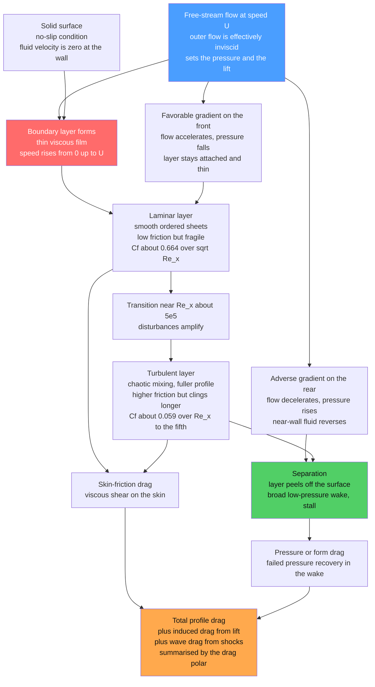

# ✈️ Boundary Layers and Aerodynamic Drag

> [!abstract] TL;DR
> Air seems slippery, yet **right at a surface it sticks** — the **no-slip** condition pins the fluid velocity to zero at the wall. That forces a paper-thin **boundary layer** in which the speed climbs from $0$ at the skin to the free-stream value $U$ just above, and it is where **nearly all viscous drag is born**. **Prandtl's** 1904 insight — that viscosity is confined to this thin film — resolved **d'Alembert's paradox** (why inviscid theory wrongly predicts zero drag). The layer grows as $\delta \sim x/\sqrt{Re_x}$ (Blasius), and **transitions** from smooth **laminar** (low friction, fragile) to chaotic **turbulent** (higher friction, but resists detaching). Where it peels off the surface — **separation** in an adverse pressure gradient — you pay huge **pressure/form drag** and the wing **stalls**. Total aircraft drag splits into **skin-friction**, **form/pressure**, **induced** (from lift), and **wave** (from shocks) drag, summarised by the **drag polar** $C_D = C_{D0} + C_L^2/(\pi\,AR\,e)$ whose **maximum $L/D$** sets range and efficiency. Shaving a few percent of drag saves airlines billions of dollars and megatonnes of CO$_2$ — which is why understanding this invisible sticky skin is the whole game of going fast efficiently.

---

## Intuition

**Analogy:** Air feels frictionless — wave your hand and it slips right past. But zoom in to the skin of a wing and the picture flips: the molecules **touching the metal move with the metal**, stuck fast at zero speed relative to the surface. This is the **no-slip condition**, and it is not a small effect — it is the origin of almost all the drag an aircraft ever pays. Because the surface holds the nearest air at a standstill while the free stream roars past a millimetre away, there must be a **paper-thin sticky layer** where the speed ramps from zero at the skin up to full flight speed just above. That film is the **boundary layer**.

Everything that matters for going fast lives inside this invisible skin. If it flows in smooth orderly sheets (**laminar**) the friction is low but the layer is fragile. If it "trips" into churning chaos (**turbulent**) the friction rises — but it clings to the surface more stubbornly. And if it ever **peels away** from the surface (**separation**), you get a wide low-pressure wake that drags like a parachute, and if it happens on a wing, the wing **stalls** and stops flying. Making a thing go fast efficiently is, almost entirely, the art of managing this thin sticky layer.

---

## How It Works

### Core Mechanics

1. **No-slip creates the layer.** A viscous fluid cannot slide freely along a solid: it matches the wall's velocity (zero for a stationary surface). Reconciling "free stream at speed $U$" with "zero at the wall" over a tiny distance demands a **steep velocity gradient** $\partial u/\partial y$ near the surface. Steep gradients are exactly where the viscous shear stress $\tau = \mu\,\partial u/\partial y$ becomes large — so friction concentrates in this thin film and is negligible outside it.

2. **Prandtl's split resolves d'Alembert's paradox.** Ideal **inviscid** (potential) theory predicts that a body feels **zero drag** — plainly absurd. The flaw: it ignored the wall layer. Prandtl (1904) showed the flow divides into an **outer inviscid region** (which sets the pressure and lift) and a thin **inner boundary layer** (which carries the friction). The layer supplies the two "missing" drag mechanisms — viscous shear on the skin and, when it separates, a low-pressure wake.

3. **The layer grows downstream.** Balancing inertia against viscous diffusion gives the laminar thickness $\delta \sim \sqrt{\nu x/U}$, i.e. $\delta/x \sim 1/\sqrt{Re_x}$ with $Re_x = Ux/\nu$. On a flat plate the exact **Blasius** solution fixes the constants: $\delta_{99}\approx 5.0\sqrt{\nu x/U}$ and a local skin-friction coefficient $C_f = 0.664/\sqrt{Re_x}$ — friction falling as $1/\sqrt{Re_x}$.

4. **Transition: laminar to turbulent.** Past a critical distance ($Re_x \sim 5\times10^5$ on a smooth plate, sooner with roughness or free-stream turbulence) small disturbances amplify and the layer **trips turbulent** (see *Transition_to_Turbulence*). Turbulent layers are **thicker**, have a **fuller** profile, and impose **higher** skin friction ($C_f \approx 0.059\,Re_x^{-1/5}$) — but that fuller profile packs momentum near the wall, so they **resist separation** far better. This trade-off is the central design tension.

5. **Separation: the villain behind form drag and stall.** The outer flow imposes the pressure. Over the front of a body the flow accelerates (**favorable** gradient, $dp/dx<0$) and the layer stays thin and attached. Over the back it must decelerate (**adverse** gradient, $dp/dx>0$); the already-slow near-wall fluid reverses, the layer **detaches**, and a broad low-pressure **wake** forms. That failed pressure recovery is **pressure/form drag**; on a wing at too high an angle of attack it is **stall**.

6. **The drag breakdown.** Total drag decomposes into **skin-friction drag** (boundary-layer shear), **form/pressure drag** (separation wakes), **induced drag** (the price of making lift via wingtip vortices — the *Airfoils_and_Wing_Theory* sibling), and **wave drag** (shock losses above the drag-divergence Mach number — the supersonic *Incompressible_and_Subsonic_Aerodynamics* and compressible siblings). Friction plus form is often bundled as **parasite (profile) drag** $C_{D0}$.

7. **The drag polar and $L/D$.** For a whole aircraft, $C_D = C_{D0} + \dfrac{C_L^2}{\pi\,AR\,e}$ — a constant parasite term plus an induced term that grows with lift squared ($AR$ = aspect ratio, $e$ = span efficiency). The **lift-to-drag ratio** $L/D = C_L/C_D$ peaks where parasite and induced drag are equal; **max $L/D$** sets range, glide, and fuel efficiency (the *Aircraft_Performance* sibling). Both $Re$ (viscous scaling) and $Ma$ (compressibility) shift the whole curve.

8. **Control.** Because a few percent of drag is worth billions, engineers actively manage the layer: **tripping** or **laminar-flow** shaping to place transition deliberately, **vortex generators** to re-energise the near-wall flow and delay separation, **riblets** (shark-skin grooves) to cut turbulent friction, and **boundary-layer suction/blowing** to remove or re-energise the tired near-wall fluid.

### Flow / Architecture



---

## Key Concepts

### Secondary Level

- **No-slip: air sticks to surfaces.** The layer of air touching a wing does not slip — it is held at a standstill by friction. A hair's breadth away the air moves at full speed, so a thin layer must bridge the gap. That layer is the **boundary layer**.
- **Friction drag lives in that thin skin.** The rubbing of the air against the surface — **skin-friction drag** — happens almost entirely inside this film. Smoother, thinner layers rub less.
- **Smooth versus messy flow.** The layer can flow in neat sheets (**laminar**, low friction) or churn chaotically (**turbulent**, more friction but stickier). Turbulence sounds bad but it helps the air cling to the surface.
- **Peeling off is bad.** If the air can't follow the curve of the surface it **peels away**, leaving a churning wake that drags the body back hard (**form drag**). On a wing tilted too steeply this is a **stall** — the wing suddenly stops lifting.
- **Why it matters.** Drag is what the engine must overcome. Less drag means less fuel, longer range, higher top speed — so shaping things to keep the air attached and the layer thin is the whole point of aerodynamics.

### Undergraduate Level

- **Scaling of the layer.** $\delta/x \sim 1/\sqrt{Re_x}$, $Re_x = Ux/\nu$. At $Re = 10^6$ the layer is only $\sim0.1\%$ of the chord. Blasius flat-plate numbers: $\delta_{99}=5.0\sqrt{\nu x/U}$, $\theta = 0.664\sqrt{\nu x/U}$, and $C_f = 0.664/\sqrt{Re_x}$.
- **Laminar versus turbulent friction.** Turbulent $C_f \approx 0.059\,Re_x^{-1/5}$ is several times the laminar value at the same $Re_x$ — but the fuller profile resists separation. Transition near $Re_x \approx 5\times10^5$ produces a visible jump in the $C_f$-versus-$Re$ curve.
- **Separation criterion.** Occurs where the wall shear vanishes, $\left.\partial u/\partial y\right|_{y=0}=0$, under an adverse gradient $dp/dx>0$. Predictable with the von Kármán momentum integral (Thwaites for laminar).
- **Drag decomposition.** Total = **skin-friction** + **form/pressure** + **induced** + **wave** + interference. Friction + form = **parasite (profile) drag** $C_{D0}$.
- **The drag polar.** $C_D = C_{D0} + C_L^2/(\pi\,AR\,e)$. Induced drag $\propto C_L^2$ dominates slow/high-lift flight; parasite drag $\propto V^2$ dominates fast flight. **Max $L/D$** occurs where the two are equal.
- **Reynolds and Mach dependence.** $C_{D0}$ falls slowly with $Re$; above the drag-divergence Mach number **wave drag** rises sharply. The **drag crisis** on bluff bodies is a sudden $C_D$ drop when the layer trips turbulent (see *Flow_Separation_and_Drag_Crisis*).

### Graduate Level

- **Prandtl equations and matched asymptotics.** The boundary layer is the inner solution of a singular perturbation in $\varepsilon = Re^{-1/2}$: across the thin layer $\partial p/\partial y \approx 0$, pressure is imposed by the outer flow, and the streamwise momentum equation is **parabolic** (marchable), not elliptic. The Blasius similarity variable $\eta = y\sqrt{U/\nu x}$ collapses it to $f''' + \tfrac12 f f'' = 0$.
- **Shape factor and separation.** $H = \delta^*/\theta$ (1.72 laminar, $\sim$1.3–1.4 turbulent) diagnoses separation proximity; the Falkner–Skan adverse branch separates at $\beta \approx -0.199$ where $f''(0)\to0$.
- **Max $L/D$ analytically.** Setting $dC_D/dC_L = d/dC_L(C_L/C_D)^{-1}=0$ gives optimum $C_L^\star = \sqrt{C_{D0}\,\pi\,AR\,e}$ (induced = parasite), so $C_D^\star = 2C_{D0}$ and $(L/D)_{\max} = \tfrac12\sqrt{\pi\,AR\,e/C_{D0}}$. High aspect ratio and low profile drag both raise it — the core of efficient-airframe design.
- **Reynolds analogy and heat transfer.** Momentum, heat, and species share the same thin film; $St \approx C_f/2$ for $Pr\approx1$, so skin friction and surface heating are coupled — critical for re-entry and turbine-blade cooling.
- **Wave drag and area ruling.** Above drag divergence, shock–boundary-layer interaction adds **wave drag**; the transonic area rule and supercritical airfoils shape the pressure field to weaken shocks (compressible-aerodynamics siblings).
- **Drag reduction economics.** Turbulent skin friction is roughly half of a transport aircraft's cruise drag; riblets, natural/hybrid laminar flow, and boundary-layer ingestion each chase a few-percent cut worth billions in fuel and large CO$_2$ reductions across a fleet.

---

## Python Demo

```python
# Boundary layers and aerodynamic drag, in two acts (numpy + matplotlib):
#   (a) BLASIUS boundary layer: solve f''' + 0.5 f f'' = 0 by RK4 + shooting to
#       get the laminar velocity profile, then show delta ~ sqrt(nu x / U) growth
#       and the skin-friction coefficient Cf vs Reynolds number -- including the
#       LAMINAR -> TURBULENT jump at transition.
#   (b) The aircraft DRAG POLAR Cd = Cd0 + Cl^2 / (pi*AR*e): plot L/D vs Cl and
#       mark the max-L/D point that sets range and efficiency.
import numpy as np
import matplotlib.pyplot as plt

# ---------------------------------------------------------------------
# (a) Blasius laminar flat-plate boundary layer -- state = [f, f', f'']
# ---------------------------------------------------------------------
def rhs(state):
    f, g, h = state                        # f, f'=g, f''=h
    return np.array([g, h, -0.5 * f * h])  # f', f'', f''' = -0.5 f f''

def integrate(s, eta_max=10.0, n=4000):
    d = eta_max / n
    eta = np.linspace(0.0, eta_max, n + 1)
    Y = np.zeros((n + 1, 3))
    Y[0] = [0.0, 0.0, s]                    # f(0)=0, f'(0)=0, f''(0)=s
    for i in range(n):
        y = Y[i]
        k1 = rhs(y); k2 = rhs(y + 0.5*d*k1)
        k3 = rhs(y + 0.5*d*k2); k4 = rhs(y + d*k3)
        Y[i + 1] = y + (d / 6.0) * (k1 + 2*k2 + 2*k3 + k4)
    return eta, Y

# shoot for f''(0) so that f'(inf) = 1 (bisection)
lo, hi = 0.1, 0.6
miss = lambda s: integrate(s)[1][-1, 1] - 1.0
for _ in range(60):
    mid = 0.5 * (lo + hi)
    if miss(lo) * miss(mid) <= 0.0: hi = mid
    else:                            lo = mid
s_star = 0.5 * (lo + hi)
eta, Y = integrate(s_star)
fp = Y[:, 1]                                # u/U = f'
eta99 = np.interp(0.99, fp, eta)           # ~4.91
print(f"Blasius wall curvature f''(0) = {s_star:.5f}  (textbook 0.33206)")
print(f"eta at u/U=0.99 = {eta99:.3f}   -> delta99 ~ {eta99:.2f}*sqrt(nu x/U)")

# physical growth on a flat plate in air
U, nu = 30.0, 1.5e-5                        # 30 m/s in air [m^2/s]
x  = np.linspace(1e-3, 1.0, 400)           # distance from leading edge [m]
Re_x = U * x / nu
delta99 = eta99 * np.sqrt(nu * x / U) * 1e3 # [mm]

# skin friction: laminar 0.664/sqrt(Re) vs turbulent 0.0592/Re^0.2
Re = np.logspace(3, 8, 500)
Cf_lam  = 0.664 / np.sqrt(Re)
Cf_turb = 0.0592 * Re ** (-0.2)
Re_tr   = 5e5                              # transition Reynolds number
Cf_real = np.where(Re < Re_tr, Cf_lam, Cf_turb)

# ---------------------------------------------------------------------
# (b) Aircraft drag polar and L/D
# ---------------------------------------------------------------------
Cd0, AR, e = 0.020, 8.0, 0.85             # parasite drag, aspect ratio, span eff.
k  = 1.0 / (np.pi * AR * e)               # induced-drag factor
Cl = np.linspace(0.0, 1.4, 400)
Cd = Cd0 + k * Cl**2                       # the drag polar
LD = np.divide(Cl, Cd, out=np.zeros_like(Cl), where=Cd > 0)

Cl_opt = np.sqrt(Cd0 / k)                  # max-L/D lift coefficient
LD_max = 0.5 * np.sqrt(1.0 / (k * Cd0))    # = 0.5*sqrt(pi*AR*e/Cd0)
Cd_opt = 2.0 * Cd0
print(f"\nDrag polar: Cd0={Cd0}, AR={AR}, e={e}")
print(f"Max L/D = {LD_max:.1f} at Cl* = {Cl_opt:.2f} (induced drag = parasite drag)")

# ---------------------------------------------------------------------
# Figure: 2 x 2
# ---------------------------------------------------------------------
fig, ax = plt.subplots(2, 2, figsize=(14, 10))
fig.suptitle("Boundary Layers and Aerodynamic Drag", fontsize=15, fontweight="bold")

# A. Blasius profile
ax[0, 0].plot(fp, eta, color="#d62728", lw=2.3)
ax[0, 0].axhline(eta99, color="0.5", ls="--", lw=1)
ax[0, 0].scatter([0], [0], color="k", zorder=5)
ax[0, 0].annotate("no-slip: u = 0 at wall", (0.0, 0.0), (0.28, 0.9),
                  arrowprops=dict(arrowstyle="->", color="0.4"))
ax[0, 0].text(0.05, eta99 + 0.2, f"u/U = 0.99 at eta = {eta99:.2f}", color="0.3")
ax[0, 0].set_xlabel("u / U   (= f')"); ax[0, 0].set_ylabel("similarity variable eta")
ax[0, 0].set_title("A. Blasius laminar profile\nspeed climbs 0 -> U across the layer")
ax[0, 0].set_ylim(0, 8)

# B. boundary-layer thickness grows as sqrt(x)
ax[0, 1].plot(x, delta99, color="#1f77b4", lw=2.3)
ax[0, 1].fill_between(x, 0, delta99, color="#1f77b4", alpha=0.12)
ax[0, 1].set_xlabel("distance along surface x [m]")
ax[0, 1].set_ylabel("delta99 [mm]")
ax[0, 1].set_title("B. Layer grows as delta ~ sqrt(nu x / U)\nthin at the leading edge")

# C. skin friction Cf vs Re with laminar->turbulent jump
ax[1, 0].loglog(Re, Cf_lam,  color="#1f77b4", lw=1.6, ls=":", label="laminar 0.664/sqrt(Re)")
ax[1, 0].loglog(Re, Cf_turb, color="#d62728", lw=1.6, ls=":", label="turbulent 0.0592/Re^0.2")
ax[1, 0].loglog(Re, Cf_real, color="#2ca02c", lw=2.6, label="realistic (with transition)")
ax[1, 0].axvline(Re_tr, color="0.4", ls="--", lw=1)
ax[1, 0].annotate("transition jump\nRe ~ 5e5", xy=(Re_tr, 0.0592*Re_tr**-0.2),
                  xytext=(3e6, 3e-3), fontsize=9,
                  arrowprops=dict(arrowstyle="->"))
ax[1, 0].set_xlabel("Reynolds number Re_x = U x / nu")
ax[1, 0].set_ylabel("skin-friction coefficient Cf")
ax[1, 0].set_title("C. Skin friction: laminar dip, turbulent jump")
ax[1, 0].legend(fontsize=8); ax[1, 0].grid(True, which="both", alpha=0.3)

# D. drag polar / L/D with max-L/D marked
ax[1, 1].plot(Cl, LD, color="#9467bd", lw=2.4)
ax[1, 1].scatter([Cl_opt], [LD_max], color="#d62728", zorder=6, s=70)
ax[1, 1].annotate(f"max L/D = {LD_max:.1f}\nat Cl = {Cl_opt:.2f}\n(induced = parasite)",
                  xy=(Cl_opt, LD_max), xytext=(Cl_opt + 0.15, LD_max - 6),
                  fontsize=9, arrowprops=dict(arrowstyle="->", color="#d62728"))
ax[1, 1].set_xlabel("lift coefficient Cl")
ax[1, 1].set_ylabel("lift-to-drag ratio L/D")
ax[1, 1].set_title("D. Drag polar Cd = Cd0 + Cl^2/(pi AR e)\nmax L/D sets range and efficiency")
ax[1, 1].grid(alpha=0.3)

plt.tight_layout(rect=[0, 0, 1, 0.96])
plt.savefig("boundary_layers_and_aerodynamic_drag.png", dpi=110)
print("\nSaved boundary_layers_and_aerodynamic_drag.png")
```

**What it shows.** Panel **A** is the Blasius laminar profile, pinned to zero at the wall by no-slip and rising smoothly to the free stream — the whole boundary layer in one curve (the code prints $f''(0)\approx0.33206$ and $\eta_{99}\approx4.91$). Panel **B** shows the layer thickening as $\sqrt{x}$: only a fraction of a millimetre near the leading edge, growing downstream. Panel **C** is the key drag message: laminar skin friction ($0.664/\sqrt{Re}$) is low but at transition ($Re\sim5\times10^5$) the flow trips turbulent and $C_f$ **jumps** onto the higher $0.0592\,Re^{-1/5}$ branch — you pay more friction but gain resistance to separation. Panel **D** is the **drag polar** recast as $L/D$ versus $C_L$: the peak is the **max $L/D$** point where induced drag equals parasite drag ($C_L^\star=\sqrt{C_{D0}/k}\approx0.65$, $(L/D)_{\max}\approx16$), the single number that governs an aircraft's range, glide ratio, and fuel efficiency.

---

## Real-World Applications

> **Example — the airliner wing (why drag is the whole game).** On a Boeing or Airbus wing the outer inviscid flow sets the lift, but **every newton of drag is a boundary-layer story**. In cruise, roughly half of total drag is **turbulent skin friction** over the wetted surface, a large chunk is **induced drag** from the trailing vortices, and the rest is form and wave drag. Designers chase the **maximum $L/D$** of the drag polar because it directly fixes range (Breguet) and fuel burn. A **1–2% drag cut** across a global fleet is worth **billions of dollars and megatonnes of CO$_2$** per year — which is why riblets, natural-laminar-flow shaping, winglets (to cut induced drag), and supercritical airfoils (to delay wave drag) are all fought over gram by gram.

- **Golf-ball dimples (the drag crisis, exploited).** Dimples trip the boundary layer turbulent so it clings to the ball's rear longer, delaying separation, shrinking the wake, and roughly *halving* pressure drag — a dimpled ball flies about twice as far as a smooth one. The same physics is developed in *Flow_Separation_and_Drag_Crisis*.
- **Vortex generators on wings and tails.** The small angled vanes ahead of control surfaces stir high-momentum air down into the boundary layer, re-energising it so it resists the adverse gradient and delays stall — buying controllability at low speed and high angle of attack.
- **Laminar-flow and riblet surfaces.** Sailplane and business-jet wings are shaped to hold laminar flow over much of the chord (low friction); shark-skin **riblets** on transport aircraft and ship hulls cut *turbulent* skin friction a few percent by aligning the near-wall streaks.
- **Turbine and compressor blades.** Blade rows run near separation by design; predicting boundary-layer transition and separation sets stage efficiency and stall margin, and the *thermal* boundary layer governs the film-cooling that keeps hot-section blades from melting.
- **Re-entry and high-speed vehicles.** The boundary layer sets both drag and **aerodynamic heating** (via the Reynolds analogy $St\approx C_f/2$); transition location can double the heat load, driving thermal-protection design.

---

## Common Pitfalls

- **Treating air as frictionless.** The whole error of inviscid theory (d'Alembert's paradox, zero drag) comes from ignoring the thin layer where no-slip forces steep shear. Viscosity is confined to the boundary layer, but it is decisive — it carries all the friction drag.
- **"Thin means negligible."** The boundary layer may be a fraction of a millimetre thick, yet it controls skin friction, separation, stall, lift loss, and surface heating. Thin is not unimportant.
- **Assuming laminar everywhere.** Real layers transition near $Re_x\sim5\times10^5$ (much sooner with roughness or free-stream turbulence). Applying Blasius $C_f\propto Re_x^{-1/2}$ past transition badly under-predicts drag; use the turbulent $\propto Re_x^{-1/5}$ correlation there.
- **"Smoother is always lower drag."** On a bluff body below its drag crisis, deliberately *roughening* (dimples, trip wires) can slash total drag by delaying separation, even though it raises skin friction. Diagnose whether friction or form drag dominates first.
- **Confusing the drag components.** Skin-friction, form, induced, and wave drag respond to opposite fixes: streamlining cuts form drag but slightly raises friction; high aspect ratio cuts induced drag but adds structural weight and friction; supercritical shaping cuts wave drag. Never optimise one in isolation.
- **Trusting inviscid pressure on the rear of a body.** Potential-flow pressure recovers fully and predicts zero drag; behind the separation point the real base pressure is set by the viscous wake. The inviscid solution is excellent on the attached front, useless in the wake.
- **Ignoring $Re$ and $Ma$ scaling of the polar.** Wind-tunnel $C_{D0}$ measured at low $Re$ or the wrong Mach can badly misestimate flight drag; the polar shifts with both, and wave drag appears abruptly past drag divergence.

---

## Related Concepts

- [[The_Boundary_Layer]] — the Fluid_Dynamics deep-dive on Prandtl's thin viscous layer, the Blasius solution, and the momentum-integral separation criterion this note builds its aero/drag framing on.
- [[Flow_Separation_and_Drag_Crisis]] — the separation event that turns attached flow into form drag and stall, plus the drag crisis that dimples exploit.
- [[Lift_Drag_and_Aerodynamics]] — the parent lift-and-drag picture; this note zooms into where the drag physically comes from and the full drag polar.
- [[Transition_to_Turbulence]] — how and when a laminar layer trips turbulent, setting the skin-friction jump and the critical Reynolds number.
- [[Viscosity_and_Stress_in_Fluids]] — the viscous shear stress $\tau=\mu\,\partial u/\partial y$ and the no-slip condition that create the boundary layer in the first place.
- [[External_Flow_and_Aerodynamics]] — the Mechanical_Engineering treatment of drag on immersed bodies, drag coefficients, and external-flow correlations.
- [[Aerodynamics_and_Aerospace_Applications]] — the applied CFD/aerospace view of finite-wing drag, high-lift devices, and full-configuration aerodynamics.

Within this Aerospace vault, the drag components link to the not-yet-written siblings *Airfoils_and_Wing_Theory* (lift generation and induced drag from wingtip vortices), *Incompressible_and_Subsonic_Aerodynamics* (the low-speed regime where profile drag dominates), *Computational_and_Experimental_Aerodynamics* (measuring and simulating drag), and *Aircraft_Performance* (how max $L/D$ sets range, endurance, and glide).

---

## Review Questions

1. **Secondary** — In plain words, what is the boundary layer, and why does a real wing feel friction drag even though air seems slippery? What happens to the wing if that layer "peels off" the top surface?
2. **Undergraduate** — On a flat plate, laminar skin friction goes as $C_f = 0.664/\sqrt{Re_x}$ but a turbulent layer follows $C_f \approx 0.059\,Re_x^{-1/5}$. (a) Sketch $C_f$ versus $Re_x$ and mark the transition jump. (b) A turbulent layer has *higher* friction — so why do designers often *want* it near the rear of a curved body? (c) For a drag polar $C_D = C_{D0} + C_L^2/(\pi\,AR\,e)$, show that maximum $L/D$ occurs where induced drag equals parasite drag.
3. **Graduate** — Explain, from the pressure gradient imposed by the outer flow, why separation occurs on the rear of a body but essentially never on the front. Then decompose the total drag of a transonic transport into skin-friction, form, induced, and wave contributions, and argue which drag-reduction technology (natural laminar flow, riblets, higher aspect ratio, supercritical airfoils) attacks which component — and why you cannot simply sum the individual savings.

---

## Sources

- Anderson, J. D. — *Fundamentals of Aerodynamics*, 6th ed., McGraw-Hill (drag breakdown, d'Alembert's paradox, the drag polar, and $L/D$).
- Schlichting, H. & Gersten, K. — *Boundary-Layer Theory*, 9th ed., Springer (the definitive reference on laminar/turbulent layers, transition, and separation).
- White, F. M. — *Viscous Fluid Flow*, 3rd ed., McGraw-Hill (Blasius solution, skin-friction correlations, boundary-layer drag).
- Hoerner, S. F. — *Fluid-Dynamic Drag*, Hoerner Fluid Dynamics (the classic compendium of drag data for every shape and drag component).
- NASA Glenn Research Center — *Beginner's Guide to Aeronautics*: "Boundary Layer," "Skin Friction," and "The Drag Coefficient," grc.nasa.gov.

---

#aerospace-engineering #aerodynamics #boundary-layer #drag #viscous-flow
