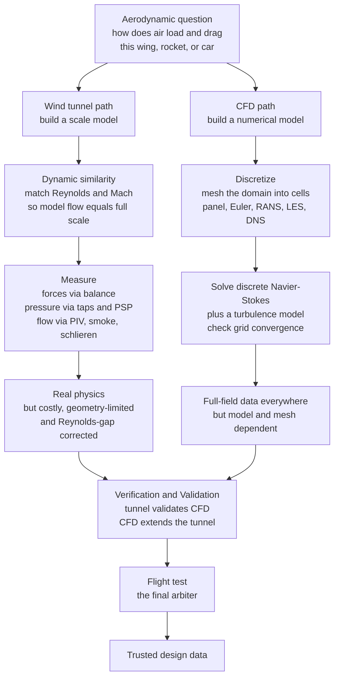

# 🌀 Computational and Experimental Aerodynamics

> [!abstract] TL;DR
> There are exactly two ways to find out how air flows over a wing before you bet a fuselage full of passengers on it: **build a scale model and blow air at it in a wind tunnel**, or **solve the equations of motion on a computer** by chopping the air into millions of cells and marching the physics forward (**CFD**). The wind tunnel gives *real physics* but is expensive, geometry-limited, and can rarely match full-scale **Reynolds number**; CFD is *cheap and gives full-field data everywhere* but is only as trustworthy as its **mesh** and its **turbulence model**. Modern aircraft, rockets, cars, and turbines are designed by playing the two against each other — simulate cheaply to explore the design space, then wind-tunnel and flight-test to confirm — and the discipline that keeps you honest is **verification and validation (V&V)**. Master both tools *and their limits* and you can trust an aerodynamic prediction; master only one and you will eventually be surprised.

---

## Intuition

**Analogy:** Suppose you want to know how water swirls around a new boat hull. You have two completely different ways to find out. The **first** is to carve a small model, drop it in a tank, drag it through the water, and *watch* — trail some dye, feel the drag on the tow-line, film the wake. It is unarguably real: the actual physics happens in front of your eyes. But the model is small, the tank is expensive, and a toy boat pushed slowly through water does not behave *exactly* like a real hull at sea. The **second** way is to never touch water at all: write down the equations that govern the flow, slice the water around the hull into millions of tiny imaginary boxes, and make a computer enforce the bookkeeping rule "what flows into a box must flow out or pile up" over and over until a picture of the flow emerges on screen. That costs almost nothing and shows you the pressure and velocity at *every* point — but it is only as right as the equations, the box-slicing, and your guesses about the turbulent churn you couldn't afford to resolve.

Aerodynamics lives in exactly this tension. The wind tunnel is the tank; **Computational Fluid Dynamics (CFD)** is the computer. Neither alone is fully trustworthy, so aerospace engineers deliberately run them against each other: CFD explores hundreds of shapes overnight, the wind tunnel checks the promising few against real air, and flight test is the final judge that overrules them both.

---

## How It Works

### Core Mechanics

1. **The wind tunnel — real physics on a scale model.** A fan drives air through a duct with a *test section* where the model sits. Because you cannot fit a full 747 in a tunnel, you test a scale model — and here is the crucial trick: **dynamic similarity**. Two flows are physically equivalent (same streamlines, same non-dimensional forces) when their governing **dimensionless numbers match**. For aerodynamics the two that matter are the **Reynolds number** ($Re = \rho U L / \mu$, the ratio of inertial to viscous forces, governing boundary layers and separation) and the **Mach number** ($M = U/a$, governing compressibility and shocks). Match $Re$ and $M$ between model and full scale and the small model's pressure and force *coefficients* ($C_p$, $C_L$, $C_D$) transfer directly to the real aircraft. This is the entire theoretical basis of scaled testing.

2. **Measuring the flow.** Tunnels extract three kinds of data: **forces and moments** via a *balance* the model is mounted on (lift, drag, pitching moment); **surface pressure** via *pressure taps* drilled into the model or *pressure-sensitive paint (PSP)* that glows in proportion to local pressure; and **flow visualization** — *smoke or tufts* to see streamlines and separation, *particle image velocimetry (PIV)* to measure a whole velocity field from tracer particles, and *schlieren/shadowgraph* to photograph the density gradients of **shock waves** in supersonic flow.

3. **Tunnel types and their limits.** Tunnels are built for a speed regime: **subsonic** (open- or closed-return, the workhorse), **transonic** (slotted walls to tame the choking near $M=1$), **supersonic** (a converging-diverging nozzle), and **hypersonic** (short-duration blowdown or shock tunnels for $M > 5$). Every tunnel fights the same enemies: **wall interference** (the walls are not infinitely far away, so *corrections* are applied), model support interference, and — most stubbornly — the **Reynolds-number gap**: a small model at achievable tunnel speeds usually sits at a *lower* $Re$ than full scale, changing boundary-layer behavior. Pressurized or cryogenic tunnels (raising $\rho$ or lowering $\mu$) exist precisely to close that gap.

4. **CFD — solving the equations numerically.** Instead of real air, CFD discretizes the flow domain into a **mesh** of cells and converts the governing PDEs — the **Navier-Stokes equations** (or their simplifications) — into a large system of algebraic equations solved cell by cell (finite volume, finite difference, or finite element). It gives the full field — pressure, velocity, temperature at *every* point — which no tunnel can fully measure, at a tiny fraction of the cost per design iteration.

5. **The fidelity hierarchy — pick your physics and your price.** CFD is not one method but a *ladder*, cheapest and most approximate at the bottom: **panel / potential methods** (solve linear potential flow on the surface only — milliseconds, but inviscid and no separation); **Euler** (inviscid but nonlinear — captures shocks, misses viscous drag and separation); **RANS with a turbulence model** (solves the *mean* flow and models all turbulence — the ~99 percent industrial workhorse, using closures like $k$-$\varepsilon$, $k$-$\omega$ SST, or **Spalart-Allmaras**); **LES** (resolves the large eddies, models only the small ones — expensive); and **DNS** (resolves *every* eddy — research-only, cost scaling roughly as $Re^3$). Higher on the ladder means more physics and vastly more compute.

6. **The CFD craft — mesh, boundary conditions, convergence.** Trustworthy CFD is a discipline: **meshing** must stack fine cells inside thin boundary layers (right first-cell $y^+$) and refine where gradients are steep; **boundary conditions** (inlet velocity, outlet pressure, no-slip walls, far-field) must be physical; the solver must reach **iterative convergence** (residuals fall to near zero); and — the honest test — **grid convergence**: the answer must *stop changing* as the mesh is refined, with discretization error shrinking like $\varepsilon \sim h^{p}$ for cell size $h$ and scheme order $p$.

7. **Verification and Validation (V&V) — the discipline of trust.** CFD produces gorgeous pictures that can be physically *wrong*. **Verification** asks "are we solving the equations *right*?" (code correctness, grid- and time-step independence). **Validation** asks "are we solving the *right* equations?" (comparison against trusted experiment or DNS). This is exactly where the two worlds fuse: **the wind tunnel validates the CFD, and the CFD extends and interprets the tunnel** — filling in the fields the tunnel can't measure and the Reynolds numbers it can't reach.

8. **The interplay — why you need both.** CFD explores the design space cheaply and gives full-field data but *depends on* turbulence models and mesh quality; wind tunnels give real physics but cost more, are geometry-limited, and can't perfectly match full-scale $Re$; **flight test** is the final arbiter over both. Modern development is a funnel: thousands of CFD runs to explore, dozens of tunnel entries to validate, a handful of flight tests to certify.

### Flow / Architecture



---

## Key Concepts

**Secondary (intuitive foundation)**
- **Two ways to know the flow:** the *wind tunnel* (real air, scale model, measured) and *CFD* (equations solved on a computer). Each has strengths the other lacks, so engineers use both.
- **Scale models work because of similarity:** a small model tested at the *right* conditions behaves like the full-size aircraft — you just have to match the important numbers.
- **You measure three things in a tunnel:** the *forces* pushing on the model, the *pressure* on its skin, and the *pattern* of the flow (smoke lines, tufts).

**Undergraduate (the working machinery)**
- **Dynamic similarity and $Re$/$M$ matching:** equal Reynolds and Mach numbers make model and full-scale flows share the same non-dimensional coefficients ($C_L$, $C_D$, $C_p$) — the mathematical license for scaled testing (see [[Dimensional_Analysis_and_Similarity]]).
- **The fidelity ladder:** panel/potential (linear, inviscid) &rarr; Euler (inviscid, shocks) &rarr; **RANS + turbulence model** (mean flow, industrial workhorse) &rarr; LES &rarr; DNS. Cost and physics both climb.
- **Panel methods:** represent a body by surface panels carrying elementary *sources* and *vortices*, solve a small linear system for their strengths from the flow-tangency condition — a genuine, fast "mini-CFD" rooted in [[Potential_Flow_and_Complex_Analysis|potential flow]].
- **Discretization error and grid convergence:** the discrete answer approaches the true one as the mesh refines, error $\sim h^p$; a solution you have not grid-converged is not a result.
- **Tunnel corrections and limits:** wall interference, blockage, support interference, and the ever-present Reynolds-number gap.

**Graduate (frontier and rigor)**
- **Turbulence closure is the make-or-break modeling choice:** RANS closures ($k$-$\varepsilon$, $k$-$\omega$ SST, Spalart-Allmaras) trade universality for tractability and systematically struggle with *separated* and *adverse-pressure-gradient* flows (see [[Turbulence_Modeling_RANS_LES_DNS]]).
- **Verification, Validation, and Uncertainty Quantification (VV&UQ):** formal grid-convergence indices (e.g., GCI), calibrated comparison against validation-quality experiments, and quantified error bars — the difference between engineering evidence and "colorful fluid dynamics."
- **Regime-specific numerics:** shock-capturing (Godunov/WENO with flux limiters) for transonic/supersonic flow, and matching cryogenic/pressurized tunnels or high-enthalpy shock tunnels to reach flight $Re$ and real-gas effects.
- **Data fusion:** using experiment to *tune* and validate CFD, and CFD to *design the experiment* and interpolate between sparse tunnel points — increasingly with machine-learned surrogates and data-driven closures.

---

## Python Demo

```python
# Computational aerodynamics from scratch: a hand-rolled SOURCE PANEL METHOD
# (a real, runnable mini-CFD) plus a GRID-CONVERGENCE study.
#
# (a) We solve inviscid potential flow over a circular cylinder by covering it
#     with N flat panels, each carrying a constant-strength source. Enforcing
#     "no flow through the surface" at every panel midpoint gives a small linear
#     system; solving it yields the surface pressure coefficient Cp. The cylinder
#     is used precisely BECAUSE it has an exact analytic answer, Cp = 1 - 4 sin^2(theta)
#     -- exactly how real CFD codes are VERIFIED.
# (b) We then refine the mesh (increase N) and watch the error collapse like h^p,
#     the discrete-error convergence that underpins trustworthy CFD.
#
# numpy + matplotlib only -- no scipy, panel integrals in closed form.

import numpy as np
import matplotlib.pyplot as plt


def source_panel_cylinder(N, R=1.0, Vinf=1.0):
    """Constant-strength source panel method for a cylinder. Returns
    (control-point angles, surface Cp, source strengths)."""
    # Boundary points, CLOCKWISE ordering so that (panel angle + 90 deg) is the
    # OUTWARD normal -- the convention the influence integrals below assume.
    theta_b = np.linspace(2 * np.pi, 0.0, N + 1)      # decreasing => clockwise
    XB, YB = R * np.cos(theta_b), R * np.sin(theta_b)

    # Panel geometry: midpoints (control points), lengths, orientation angles.
    XC = 0.5 * (XB[:-1] + XB[1:])
    YC = 0.5 * (YB[:-1] + YB[1:])
    dx, dy = XB[1:] - XB[:-1], YB[1:] - YB[:-1]
    S = np.sqrt(dx**2 + dy**2)                          # panel lengths
    phi = np.arctan2(dy, dx)                            # panel orientation
    beta = phi + np.pi / 2.0                            # outward-normal angle (AoA = 0)

    # Influence coefficients (Anderson / Katz-Plotkin closed-form integrals):
    #   I = normal-velocity influence,  J = tangential-velocity influence.
    I = np.zeros((N, N))
    J = np.zeros((N, N))
    for i in range(N):
        for j in range(N):
            if i == j:
                continue
            A  = -(XC[i] - XB[j]) * np.cos(phi[j]) - (YC[i] - YB[j]) * np.sin(phi[j])
            B  =  (XC[i] - XB[j])**2 + (YC[i] - YB[j])**2
            Cn =  np.sin(phi[i] - phi[j])
            Dn = -(XC[i] - XB[j]) * np.sin(phi[i]) + (YC[i] - YB[j]) * np.cos(phi[i])
            Ct = -np.cos(phi[i] - phi[j])
            Dt =  (XC[i] - XB[j]) * np.cos(phi[i]) + (YC[i] - YB[j]) * np.sin(phi[i])
            E  = np.sqrt(max(B - A**2, 1e-12))          # perpendicular distance
            logt = np.log((S[j]**2 + 2 * A * S[j] + B) / B)
            angt = np.arctan2(S[j] + A, E) - np.arctan2(A, E)
            I[i, j] = 0.5 * Cn * logt + (Dn - A * Cn) / E * angt
            J[i, j] = 0.5 * Ct * logt + (Dt - A * Ct) / E * angt

    # Linear system for source strengths: flow tangency at every control point.
    M = I.copy()
    np.fill_diagonal(M, np.pi)                          # panel self-influence
    rhs = -Vinf * 2.0 * np.pi * np.cos(beta)
    lam = np.linalg.solve(M, rhs)                       # source strengths

    # Surface tangential velocity -> pressure coefficient.
    Vt = Vinf * np.sin(beta) + (J @ lam) / (2.0 * np.pi)
    Cp = 1.0 - (Vt / Vinf)**2
    theta_c = np.arctan2(YC, XC)                        # control-point angles
    return theta_c, Cp, lam


# ---- (a) Panel-method surface pressure vs the exact analytic solution ----
N_demo = 64
theta_c, Cp, lam = source_panel_cylinder(N_demo)
order = np.argsort(theta_c)
theta_fine = np.linspace(-np.pi, np.pi, 400)
Cp_exact_fine = 1.0 - 4.0 * np.sin(theta_fine)**2
print(f"N={N_demo}: net source strength (should be ~0) = {np.sum(lam):+.2e}")

# ---- (b) Grid convergence: RMS Cp error shrinks as the mesh refines ----
Ns = np.array([8, 16, 32, 64, 128, 256])
errs = []
for N in Ns:
    tc, cp, _ = source_panel_cylinder(N)
    cp_exact = 1.0 - 4.0 * np.sin(tc)**2
    errs.append(np.sqrt(np.mean((cp - cp_exact)**2)))
errs = np.array(errs)
p_order = -np.polyfit(np.log(Ns), np.log(errs), 1)[0]   # fitted convergence order
print(f"Fitted grid-convergence order p = {p_order:.2f}")

# ---- Plots ----
fig, ax = plt.subplots(1, 2, figsize=(12, 5))

ax[0].plot(np.degrees(theta_fine), Cp_exact_fine, "k-", lw=2,
           label="exact potential flow")
ax[0].plot(np.degrees(theta_c[order]), Cp[order], "o", ms=5, color="crimson",
           label=f"source panels (N={N_demo})")
ax[0].set_xlabel("angle around cylinder  theta [deg]")
ax[0].set_ylabel("pressure coefficient  Cp")
ax[0].set_title("(a) Panel-method surface pressure")
ax[0].invert_yaxis()                                    # low pressure plotted up
ax[0].legend(); ax[0].grid(alpha=0.3)

ax[1].loglog(Ns, errs, "o-", color="navy", lw=2, label="panel-method error")
ax[1].loglog(Ns, errs[0] * (Ns / Ns[0])**(-2.0), "k--",
             label="slope -2 reference")
ax[1].set_xlabel("number of panels  N  (finer mesh ->)")
ax[1].set_ylabel("RMS error in Cp vs exact")
ax[1].set_title(f"(b) Grid convergence  (fitted order p = {p_order:.2f})")
ax[1].legend(); ax[1].grid(alpha=0.3, which="both")

plt.tight_layout()
plt.savefig("panel_method_verification.png", dpi=120)
plt.show()
```

**What the output shows.** Panel (a): with only 64 flat panels the source-panel solver nails the exact cylinder pressure distribution — stagnation $C_p = +1$ at the front and back, and the deep suction $C_p = -3$ at the shoulders — proving the hand-rolled "mini-CFD" is solving real potential flow. Panel (b): the RMS error against the exact solution collapses along a straight log-log line with slope near $-2$, the signature of a second-order-accurate scheme (error $\sim h^{2}$). That plot *is* a verification study — the single most important habit that separates trustworthy CFD from pretty-but-wrong pictures. The printed net source strength being ~0 confirms the closed body neither creates nor destroys mass.

---

## Real-World Applications

- **Transonic airliner wing design (Boeing/Airbus).** Cruise wings are shaped almost entirely by RANS CFD sweeping thousands of airfoil and planform variants overnight, with only the promising few taken into a transonic wind tunnel and finally to flight test. CFD sets the shape; the tunnel and flight validate the drag count that decides fuel burn.
- **Formula 1 aerodynamics.** Teams run massive CFD together with rolling-road wind-tunnel testing of 60-percent scale models; the FIA even *caps* the allowed CFD teraflops and tunnel hours, making the CFD-vs-tunnel trade-off a literal regulated resource. Dynamic similarity ($Re$ matching via tunnel speed) is central to making the small model represent the full car.
- **Launch vehicle and re-entry design (NASA/SpaceX).** Ascent aerodynamics, base flows, and stage separation are explored in CFD, checked in supersonic/hypersonic tunnels (schlieren imaging of shock structure), and confirmed by flight telemetry — because no tunnel can simultaneously match flight Mach, Reynolds, and real-gas chemistry.
- **Wind-turbine and gas-turbine blades.** Blade rows are designed with RANS/LES CFD and validated on cascade rigs and scaled tunnel tests; separation and stall prediction — exactly where turbulence models are weakest — is where experimental validation earns its keep.
- **NASA / DLR / ONERA validation databases.** Standard tunnel test cases (e.g., benchmark airfoils and wing-body configurations) exist specifically as *validation data* so CFD codes worldwide can be checked against measured forces and pressures — institutionalized V&V.

---

## Common Pitfalls

- **Trusting an un-converged mesh.** A CFD result that still changes when you refine the grid is not a prediction — it is an artifact. Skipping the grid-convergence study (panel (b) of the demo) is the single most common way to publish confident nonsense. Always show error $\sim h^p$.
- **Ignoring the Reynolds-number gap.** A small model at tunnel speeds usually sits at a *lower* $Re$ than full scale, so its boundary layer transitions and separates differently. Reporting model coefficients as if they were full-scale — without correction, trip strips, or a pressurized/cryogenic tunnel — silently biases drag and stall predictions.
- **Believing "colorful fluid dynamics."** Smooth, beautiful CFD contours are not evidence of correctness. Wrong boundary conditions, an inappropriate turbulence model, or a skewed mesh all still produce pretty pictures. Only validation against experiment or DNS makes them evidence.
- **Wrong turbulence model for separated flow.** Standard $k$-$\varepsilon$ over-predicts attachment and mis-predicts separation onset in adverse pressure gradients; using it near stall or on bluff bodies gives confidently wrong forces. Match the closure to the physics ($k$-$\omega$ SST or Spalart-Allmaras for aero boundary layers).
- **Forgetting tunnel corrections.** Solid and wake blockage, wall interference, and model-support effects mean *raw* tunnel readings are not free-flight values. Uncorrected data compared against free-air CFD produces a phantom "disagreement" that is really an apples-to-oranges error.
- **Over-reading a panel method.** Panel/potential codes are inviscid and linear — they give excellent pressure distributions on attached, thin-airfoil flows but *cannot* predict viscous drag, separation, or stall. Using them past their validity (the demo's cylinder has zero predicted drag, the d'Alembert paradox) is a classic trap.

---

## Related Concepts

- [[Computational_Fluid_Dynamics]] — the general-purpose engine (finite volume, meshing, pressure-velocity coupling) that this note applies specifically to aerodynamic design and validation.
- [[Aerodynamics_and_Aerospace_Applications]] — the companion applications view of how CFD is deployed across aircraft, rockets, and turbomachinery.
- [[Dimensional_Analysis_and_Similarity]] — the Reynolds- and Mach-matching theory that licenses testing a small model in place of a full-scale aircraft.
- [[Potential_Flow_and_Complex_Analysis]] — the inviscid theory underlying the source/vortex panel methods at the bottom of the CFD fidelity ladder.
- [[The_Navier_Stokes_Equations]] — the governing equations that CFD discretizes, and whose intractability makes both CFD and wind tunnels necessary.
- [[Turbulence_Modeling_RANS_LES_DNS]] — the make-or-break closure choice that dominates the accuracy and cost of practical aerodynamic CFD.
- [[Turbulence_Fundamentals]] — why the multi-scale turbulent cascade forces modeling rather than direct resolution in almost all engineering flows.
- [[Finite_Difference_Methods]] — one of the discretization families (with finite volume and finite element) that turns the flow PDEs into a solvable algebraic system.
- [[The_Finite_Element_Method]] — the alternative discretization common in structural and some CFD solvers, and in coupled aeroelastic analysis.
- [[The_Poisson_and_Laplace_Equation]] — the elliptic problem the panel method solves on the surface and the pressure step of incompressible CFD solves in the volume.
- [[Classification_of_PDEs_and_Discretization]] — why elliptic, parabolic, and hyperbolic flow regimes demand different numerical schemes (shock capturing for supersonic flow).
- [[Shock_Waves_and_Supersonic_Flow]] — the compressible phenomena that schlieren imaging visualizes in a supersonic tunnel and that shock-capturing CFD must resolve.

*Aerodynamics siblings in this section — Airfoils and Wing Theory, Incompressible and Subsonic Aerodynamics, Boundary Layers and Aerodynamic Drag, and Supersonic and Hypersonic Aerodynamics — supply the physics that these two tools are built to predict: wing lift, the boundary-layer drag CFD and tunnels are trying to nail, and the shock regimes that dictate tunnel type and numerical scheme.*

---

## Review Questions

**Secondary**
1. Name the two main ways engineers study how air flows over a wing, and give one advantage and one disadvantage of each.
2. Why do engineers test *small models* instead of full-size aircraft, and what has to be true for the small-model results to apply to the real thing?

**Undergraduate**
3. Explain dynamic similarity: which two dimensionless numbers must match between a wind-tunnel model and the full-scale aircraft, and what physics does each one govern?
4. Rank panel methods, Euler, RANS, LES, and DNS by cost and by the physics they capture. For predicting the drag of a wing near stall, which would you *not* trust, and why?
5. What is a grid-convergence study, and why is a CFD result that has not been grid-converged considered unusable? Relate your answer to the error $\sim h^p$ behavior in the demo.

**Graduate**
6. You must certify the drag of a new transonic wing. Design a program that uses CFD, wind-tunnel testing, and flight test together — state explicitly what each tool contributes, what its dominant error source is, and how validation flows between them.
7. A colleague shows beautiful RANS contours of a separated flap flow that disagree with tunnel data. Walk through the verification-and-validation checklist you would apply, from mesh and $y^+$ to turbulence closure to tunnel corrections, to locate the discrepancy.
8. Discuss the Reynolds-number gap: why can most tunnels not reach full-scale $Re$, what physical predictions does this most endanger, and what experimental and computational strategies (cryogenic/pressurized tunnels, transition tripping, CFD extrapolation) mitigate it?

---

## Sources

- Anderson, J. D. *Computational Fluid Dynamics: The Basics with Applications.* McGraw-Hill. (CFD fundamentals, discretization, verification.)
- Barlow, J. B., Rae, W. H., & Pope, A. *Low-Speed Wind Tunnel Testing.* Wiley. (Wind-tunnel design, measurement, corrections, similarity.)
- Ferziger, J. H., & Peric, M. *Computational Methods for Fluid Dynamics.* Springer. (Finite-volume methods, turbulence modeling, convergence and error.)
- Katz, J., & Plotkin, A. *Low-Speed Aerodynamics.* Cambridge University Press. (Panel methods and the potential-flow foundations of computational aerodynamics.)
- Anderson, J. D. *Fundamentals of Aerodynamics.* McGraw-Hill. (Source-panel formulation used in the demo; dynamic similarity and force coefficients.)

---

#aerospace-engineering #aerodynamics #CFD #wind-tunnel #simulation
