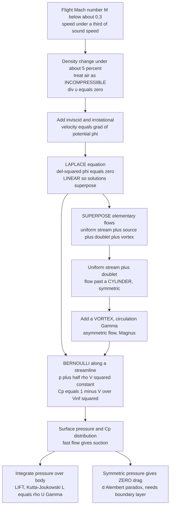

# 🛩️ Incompressible and Subsonic Aerodynamics

> [!abstract] TL;DR
> **Incompressible and subsonic aerodynamics** is the low-speed regime — flight Mach number below about **0.3**, roughly a third of the speed of sound — where air density barely changes (under about **5%**), so the air can be treated as an **incompressible** fluid. Dropping density variation collapses the governing equations into something wonderfully tractable: for **inviscid, irrotational, incompressible** flow the velocity is the gradient of a scalar potential that obeys **Laplace's equation** — *linear*, so solutions **superpose**. You build the flow over a body by *adding* elementary flows like LEGO bricks: a uniform stream plus a doublet gives the flow past a cylinder, and adding a **vortex** (circulation) makes it asymmetric and produces **lift** (Magnus effect; Kutta-Joukowski $L' = \rho U \Gamma$). **Bernoulli's principle** ($p + \tfrac12\rho V^2 = \text{const}$ along a streamline) then converts the velocity field into pressure — where the flow speeds up, the pressure drops (suction), summarized by the pressure coefficient $C_p = 1 - (V/V_\infty)^2$. This elegant classical theory is the analytically-tractable *foundation* of aerodynamics and directly models general aviation, drones, propellers, wind turbines, and the takeoff/landing phase of every aircraft. Its honest blind spot: with no viscosity it predicts **zero drag** (d'Alembert's paradox) — real drag lives in the boundary layer, and the **Prandtl-Glauert** correction stretches the theory upward toward higher subsonic Mach.

---

## Intuition

**Analogy:** Below about a third of the speed of sound, air behaves almost exactly like **water flowing around a rock in a stream**. The rock does not compress the water or make it pile up; the water simply *slides out of the way*, its density unchanged, streamlines parting ahead of the rock and closing smoothly behind. Air at low speed does the same around a wing. Because nothing gets compressed, the bookkeeping is easy — and this is the *friendly* regime where the beautiful classical theory works.

The magic of this regime is **superposition**. When the flow is smooth, spin-free, and incompressible, the equation governing it is **linear**, which means you can build a complicated flow by *snapping together simple ones like LEGO bricks*: a steady breeze, plus a little "source" that puffs air outward, plus a "swirl" (a vortex). Snap a uniform stream onto a doublet and a cylinder appears; add a swirl and the cylinder starts lifting. Then **Bernoulli** does the final trick — it trades speed for pressure, so wherever the streamlines crowd together and the air speeds up, the pressure falls, and that pressure difference is *lift*. Most of everyday flight — light planes, quadcopters, gliders, takeoff and landing — lives entirely inside this tractable world.

---

## How It Works

### Core Mechanics

**1. The regime: why "incompressible" is legitimate below Mach 0.3.** A fluid's compressibility only matters when the flow is fast enough to squeeze it. The relevant yardstick is the **Mach number** $M = V/a$, the flow speed divided by the local speed of sound. The fractional density change scales roughly as $\Delta\rho/\rho \approx \tfrac12 M^2$. At $M = 0.3$ that is about $0.045$ — under **5%** — so treating density as **constant** introduces only a few-percent error while removing an entire coupled thermodynamic equation. Below $M \approx 0.3$ (about 100 m/s or 230 mph at sea level) the flow is therefore modelled as **incompressible**, and this covers most general aviation, UAVs, rotorcraft in hover, and the low-speed takeoff/landing phase of *all* aircraft.

**2. Three idealizations collapse the equations into Laplace's equation.** Assume the flow is:
- **Incompressible** — $\nabla\cdot\vec u = 0$ (mass conservation with constant density);
- **Inviscid** — viscosity is neglected in the outer flow (good at high Reynolds number, where friction is confined to a thin surface layer);
- **Irrotational** — $\nabla\times\vec u = 0$ (Kelvin's theorem keeps a flow that starts from rest irrotational).

Irrotationality lets the velocity come from a scalar **velocity potential**, $\vec u = \nabla\phi$. Substituting into incompressibility gives the **Laplace equation**:
$$\nabla^2\phi = 0.$$
This is **linear** and elliptic — a colossal simplification over the nonlinear Navier-Stokes equations. The pressure is recovered *afterward* from Bernoulli, which is where all the nonlinearity was quietly moved.

**3. Superposition — the LEGO-brick payoff.** Because Laplace's equation is linear, sums of solutions are solutions. Four elementary flows are the building blocks:

| Elementary flow | Physical picture |
|---|---|
| **Uniform stream** | parallel free stream at speed $U$ |
| **Source / sink** | air puffed radially out / sucked radially in |
| **Doublet** | a source and sink squeezed together |
| **Point vortex** | pure swirl carrying circulation $\Gamma$ |

The canonical constructions: **uniform stream + doublet = flow past a cylinder**; **cylinder + vortex = a lifting cylinder** (faster over the top, slower underneath). Representing a body by a cloud of sources and vortices is the **method of singularities**, whose numerical descendant is the **panel method**. In 2D these bricks fuse into a single analytic **complex potential** $w(z) = \phi + i\psi$, and **conformal mapping** — the **Joukowski transform** $\zeta = z + c^2/z$ — bends the flow around a cylinder into the flow around an **airfoil**.

**4. Bernoulli converts velocity into pressure.** Along a streamline in steady incompressible inviscid flow,
$$p + \tfrac12\rho V^2 = \text{const}.$$
Faster flow means lower pressure. Non-dimensionalizing gives the **pressure coefficient**, the single most-used quantity in low-speed aerodynamics:
$$C_p = \frac{p - p_\infty}{\tfrac12\rho V_\infty^2} = 1 - \left(\frac{V}{V_\infty}\right)^2.$$
Where the surface flow is faster than the free stream ($V > V_\infty$), $C_p < 0$ — **suction**. The lift is the integral of this pressure over the surface.

**5. Circulation and lift; the Kutta condition.** Pure potential flow around an airfoil is **non-unique** — any circulation $\Gamma$ gives a valid solution. The **Kutta condition** injects the one piece of real physics: a viscous fluid cannot whip around a sharp trailing edge, so the flow must leave it smoothly. That pins down $\Gamma$, and the **Kutta-Joukowski theorem** gives the lift per unit span:
$$\boxed{\,L' = \rho\,U\,\Gamma\,}.$$
A **spinning** cylinder does this literally — the **Magnus effect** is cylinder-plus-circulation.

**6. Limits and the bridge upward.** With no viscosity, the fore-aft pressure distribution is symmetric and integrates to **zero drag** — **d'Alembert's paradox**. This is not a bug; it is the theory honestly reporting that it discarded viscosity. Real drag comes from the boundary layer and flow separation (sibling note *Boundary_Layers_and_Aerodynamic_Drag*). To push the incompressible result toward higher subsonic Mach, the **Prandtl-Glauert correction** rescales it: $C_p \approx C_{p,0}/\sqrt{1 - M_\infty^2}$, valid until compressibility and shocks take over near Mach 1 (sibling *Supersonic_and_Hypersonic_Aerodynamics*).

### Flow / Architecture



---

## Key Concepts

### Secondary Level

- **Air acts like water here.** Slow enough (below about a third of the speed of sound), air does not squash — it flows around a wing the way a stream flows around a rock, sliding aside without piling up.
- **Streamlines show the flow.** Draw the lines the air follows; where they crowd together the air is fast, where they spread apart it is slow.
- **Fast air = low pressure.** This is Bernoulli's trade. Air speeds up over the curved top of a wing, so the pressure there drops, and the higher pressure underneath pushes the wing up — that is **lift**.
- **Build the flow from simple pieces.** A steady breeze, a "puff," and a "swirl" can be added together to make the flow around a ball or a wing.

### Undergraduate Level

- **The Mach 0.3 rule.** $\Delta\rho/\rho \approx \tfrac12 M^2$; at $M = 0.3$ the density error is under 5%, justifying incompressible treatment for most low-speed flight.
- **Potential flow.** $\vec u = \nabla\phi$ with $\nabla^2\phi = 0$; linearity permits **superposition** of a uniform stream, source/sink, doublet, and vortex.
- **Cylinder flow.** Uniform stream + doublet gives surface tangential speed $V_\theta = -2U\sin\theta$ (no circulation) and, with a vortex, $V_\theta = -2U\sin\theta - \Gamma/(2\pi a)$.
- **Bernoulli and $C_p$.** $p + \tfrac12\rho V^2 = \text{const}$; $C_p = 1 - (V/V_\infty)^2$. Stagnation point $C_p = 1$; peak suction on a non-lifting cylinder is $C_p = -3$ at the shoulders.
- **Kutta-Joukowski.** $L' = \rho U \Gamma$; the **Kutta condition** fixes $\Gamma$ so flow leaves the sharp trailing edge smoothly. **Magnus effect** = spinning-cylinder lift.
- **d'Alembert's paradox.** Steady inviscid flow around a closed body gives **zero drag** — the flag that viscosity was neglected.

### Graduate Level

- **Complex potential and conformal mapping.** $w(z) = \phi + i\psi$ analytic; $dw/dz = u - iv$. The **Joukowski map** $\zeta = z + c^2/z$ carries the cylinder's circulation and lift onto an airfoil; the Kutta condition at the mapped trailing edge gives $C_L \approx 2\pi(\alpha + \beta)$ — the **thin-airfoil lift slope of $2\pi$ per radian**.
- **Blasius force integrals.** $F_x - iF_y = \tfrac{i\rho}{2}\oint (dw/dz)^2\,dz$; the residue at the bound vortex yields $L' = \rho U \Gamma$ directly — Kutta-Joukowski from the residue theorem.
- **3D lifting-line theory.** A finite wing sheds a trailing vortex sheet; Prandtl's lifting-line theory gives **induced drag** $C_{D,i} = C_L^2/(\pi e AR)$ — the one drag potential flow *can* predict, because it is an inviscid pressure effect, and it is minimized by an elliptical lift distribution.
- **Compressibility corrections.** **Prandtl-Glauert**: $C_p = C_{p,0}/\sqrt{1 - M_\infty^2}$; refined by **Karman-Tsien** and **Laitone** rules. Valid below the **critical Mach number** where local flow first reaches sonic and drag divergence begins.
- **Starting vortex and Kelvin's theorem.** Circulation is created physically when a wing begins to move: a **starting vortex** is shed at the trailing edge and the equal-and-opposite **bound vortex** stays with the wing, keeping total circulation zero.
- **Panel methods.** Discretize the surface into source/doublet panels solving a boundary-integral equation; coupled to an integral boundary-layer solver (XFOIL, VSAERO) they remain fast, accurate industrial design tools for attached flow.

---

## Python Demo

```python
# Incompressible / subsonic aerodynamics: POTENTIAL FLOW + BERNOULLI on a cylinder.
#   (a) SUPERPOSITION: uniform stream + doublet = flow past a cylinder;
#       add a point VORTEX (circulation) to make it asymmetric and create LIFT (Magnus).
#   (b) BERNOULLI: surface pressure coefficient  Cp = 1 - (V/Vinf)^2  from the speed field,
#       showing symmetric pressure (d'Alembert, zero drag) with no circulation and
#       a top/bottom suction imbalance (lift) with circulation.
#   (c) verify Kutta-Joukowski  L' = rho * U * Gamma  by integrating surface pressure.
# Requires: numpy, matplotlib
import numpy as np
import matplotlib.pyplot as plt

U    = 30.0        # free-stream speed [m/s]  (about Mach 0.09 -> safely incompressible)
a    = 1.0         # cylinder radius [m]
rho  = 1.225       # air density [kg/m^3]

# --- stream function on a grid: psi = U*y*(1 - a^2/r^2) - (Gamma/2pi)*ln(r/a) -------
n  = 400
xs = np.linspace(-3, 3, n)
ys = np.linspace(-3, 3, n)
X, Y = np.meshgrid(xs, ys)
R2 = X**2 + Y**2
R2 = np.where(R2 < 1e-9, 1e-9, R2)

def stream(Gamma):
    psi = U * Y * (1 - a**2 / R2) - (Gamma / (2*np.pi)) * 0.5 * np.log(R2 / a**2)
    return np.where(R2 < a**2, np.nan, psi)     # flow only OUTSIDE the body

# --- surface tangential speed and Bernoulli Cp on the cylinder ---------------------
theta = np.linspace(0, 2*np.pi, 721)
def surface_Cp(Gamma):
    Vtheta = -2*U*np.sin(theta) - Gamma/(2*np.pi*a)   # tangential velocity on r=a
    return 1.0 - (Vtheta / U)**2                       # Cp = 1 - (V/Vinf)^2

def lift_from_pressure(Gamma):
    # L' = -integral of p * n_y ds ; p = pinf + 0.5*rho*U^2*Cp ; ds = a dtheta ; n_y = sin(theta)
    Cp = surface_Cp(Gamma)
    integrand = -0.5*rho*U**2 * Cp * np.sin(theta) * a
    return np.trapz(integrand, theta)

# two cases: no circulation (symmetric) and with circulation (lifting)
Gamma0 = 0.0
Gamma1 = 4*np.pi*U*a * 0.5     # moderate circulation -> stagnation points at -30, -150 deg

L1_press = lift_from_pressure(Gamma1)     # numerical, from integrating Cp
L1_KJ    = rho * U * Gamma1                # Kutta-Joukowski prediction

print("=== Incompressible aerodynamics: cylinder ===")
print(f"U = {U} m/s, a = {a} m, rho = {rho} kg/m^3")
print(f"No circulation : lift = {lift_from_pressure(Gamma0):8.3f} N/m  (d'Alembert: ~0)")
print(f"Circulation    : Gamma = {Gamma1:.3f} m^2/s")
print(f"   lift from pressure integral = {L1_press:8.2f} N/m")
print(f"   Kutta-Joukowski rho*U*Gamma = {L1_KJ:8.2f} N/m")
print(f"   peak suction Cp (no circ)   = {surface_Cp(Gamma0).min():.3f}  (theory -3.0)")

# --- plots: streamlines (2 cases) + surface Cp + Bernoulli speed-vs-Cp --------------
fig, ax = plt.subplots(2, 2, figsize=(13, 11))
fig.suptitle("Incompressible / Subsonic Aerodynamics: potential flow + Bernoulli",
             fontsize=15, fontweight="bold")
lv = np.linspace(-90, 90, 61)

def draw(ax_, Gamma, title):
    ax_.contour(X, Y, stream(Gamma), levels=lv, colors="#1f77b4", linewidths=0.7)
    ax_.add_patch(plt.Circle((0, 0), a, color="0.3", zorder=5))
    ax_.set_xlim(-3, 3); ax_.set_ylim(-3, 3); ax_.set_aspect("equal")
    ax_.set_title(title); ax_.set_xlabel("x [m]"); ax_.set_ylabel("y [m]")

draw(ax[0,0], Gamma0, "Uniform stream + doublet = CYLINDER\n(symmetric, no lift)")
draw(ax[0,1], Gamma1, f"+ VORTEX (circulation): asymmetric\nMagnus lift = {L1_KJ:.0f} N/m")

# surface Cp vs angle (Bernoulli): fast flow -> negative Cp (suction)
deg = np.degrees(theta)
ax[1,0].plot(deg, surface_Cp(Gamma0), label="no circulation", color="#2ca02c", lw=2)
ax[1,0].plot(deg, surface_Cp(Gamma1), label="with circulation", color="#d62728", lw=2)
ax[1,0].axhline(0, color="k", lw=0.8)
ax[1,0].fill_between(deg, surface_Cp(Gamma1), 0,
                     where=(surface_Cp(Gamma1) < 0), color="#d62728", alpha=0.12)
ax[1,0].invert_yaxis()   # aerodynamics convention: suction plotted upward
ax[1,0].set_xlabel("surface angle theta [deg]"); ax[1,0].set_ylabel("Cp = 1 - (V/Vinf)^2")
ax[1,0].set_title("Surface pressure (Bernoulli)\nsuction imbalance top vs bottom = LIFT")
ax[1,0].legend(); ax[1,0].grid(alpha=0.3)

# Bernoulli directly: pressure vs local speed along the surface
Vloc = np.abs(-2*U*np.sin(theta) - Gamma1/(2*np.pi*a))
ax[1,1].plot(Vloc/U, surface_Cp(Gamma1), ".", ms=3, color="#9467bd")
ax[1,1].set_xlabel("local speed  V / Vinf")
ax[1,1].set_ylabel("Cp")
ax[1,1].set_title("Bernoulli trade: faster flow -> lower pressure\nCp = 1 - (V/Vinf)^2 (a parabola)")
ax[1,1].grid(alpha=0.3)

plt.tight_layout(rect=[0, 0, 1, 0.95])
plt.savefig("incompressible_aerodynamics.png", dpi=110)
print("Saved incompressible_aerodynamics.png")
```

**What it shows.** The top row is the superposition payoff: *uniform stream + doublet* draws a **cylinder** with perfectly fore-aft-*and*-top-bottom symmetric streamlines (zero lift, zero drag — d'Alembert), and adding a **vortex** tilts the pattern into an asymmetric, lifting flow (the **Magnus** effect). The bottom-left plot is **Bernoulli made visible**: the surface $C_p$ curve for the non-lifting case is symmetric top-to-bottom, but with circulation the suction ($C_p < 0$) is deeper over the top than the bottom — that imbalance *is* the lift. The bottom-right plot shows the raw Bernoulli trade, $C_p = 1 - (V/V_\infty)^2$, a clean parabola: the faster the surface flow, the lower the pressure. The console confirms the numerical pressure integral reproduces **Kutta-Joukowski $L' = \rho U\Gamma$** to plotting accuracy, and that peak suction on the non-lifting cylinder is exactly $C_p = -3$.

---

## Real-World Applications

> **Example: airfoil and wing design from Joukowski to XFOIL.** Before CFD, entire families of practical wing sections (the **Joukowski** and **Karman-Trefftz** airfoils) were produced by *conformally mapping a cylinder into an airfoil* and computing lift analytically from Kutta-Joukowski. That lineage is alive today: **panel methods** — numerical incompressible potential flow tiling a surface with source and doublet panels — power tools like **XFOIL**, **VSAERO**, and **PMARC** used daily for rapid aircraft, propeller, and wind-turbine design. Coupled to an integral boundary-layer model that supplies the drag potential flow cannot, they return lift and pressure distributions in milliseconds, orders of magnitude faster than a Navier-Stokes solve.

- **General aviation and drones.** Light aircraft, gliders, and quadcopters cruise at $M < 0.3$, so the *entire* aircraft is designed in the incompressible regime — lift-curve slope, stall margin, and pressure loads all come from this theory.
- **Takeoff and landing of every airliner.** Even a Mach-0.85 jet flies its most critical phases (high-lift devices, approach) at low speed, where incompressible high-lift aerodynamics governs flap and slat design.
- **Wind turbines and propellers.** Blade-element/momentum theory builds on 2D incompressible airfoil polars section-by-section; the inboard flow is firmly subsonic.
- **The Magnus effect in sport and engineering.** The curve of a spinning ball, and Flettner-rotor ships that use spinning cylinders for thrust, are literally the "cylinder + circulation" construction.
- **Ground vehicles and buildings.** Automotive lift/downforce estimation and pedestrian-level wind studies start from incompressible potential-flow and panel models before viscous CFD.

---

## Common Pitfalls

- **Expecting the theory to predict drag.** Inviscid incompressible flow gives **zero drag** on a closed body (d'Alembert's paradox). This is the theory honestly reporting it discarded viscosity — real drag needs the boundary layer (sibling *Boundary_Layers_and_Aerodynamic_Drag*), not a patch inside potential flow.
- **Pushing "incompressible" past Mach 0.3.** Above $M \approx 0.3$ the few-percent density error grows fast; near the **critical Mach number** local pockets go supersonic and shocks appear. Apply the **Prandtl-Glauert** correction in the high-subsonic range, and switch theories entirely near Mach 1.
- **Forgetting the Kutta condition.** Potential flow around a lifting airfoil is non-unique — *any* circulation is mathematically valid. Without the Kutta condition you get absurd flow around the trailing edge and no way to predict lift. Lift is not in Laplace's equation; it is in that one extra physical rule.
- **Applying it to bluff bodies or stalled wings.** The theory is excellent for *streamlined* shapes at small angle of attack where flow stays attached. For a stalled wing, a flat plate broadside, or a cylinder's real wake, the flow **separates** and potential flow is qualitatively wrong (the real cylinder $C_p$ is nowhere near the symmetric $-3$ shoulder value on the rear).
- **Sign errors in circulation and lift.** The tangential surface speed is $V_\theta = -2U\sin\theta - \Gamma/(2\pi a)$; a wrong sign on $\Gamma$ flips lift up into down. Track the vortex orientation carefully.
- **Confusing "no viscosity" with "no boundary layer needed."** The whole reason the *outer* inviscid solution is useful is that a thin boundary layer hugs the surface and is patched on. Ignore that layer and you lose drag, separation, and stall entirely.

---

## Related Concepts

**Fluid Dynamics — foundations this note builds on** (verified in the vault)
- [[Potential_Flow_and_Complex_Analysis]] — the mathematical engine: Laplace's equation, superposition, complex potential, Joukowski mapping, and Kutta-Joukowski developed in full.
- [[Bernoulli_and_Energy_in_Flows]] — supplies the pressure field once the velocity is known; the origin of $C_p = 1 - (V/V_\infty)^2$.
- [[Lift_Drag_and_Aerodynamics]] — where circulation, the Kutta condition, and $L' = \rho U \Gamma$ grow into the full theory of wings.
- [[Vorticity_and_Circulation]] — circulation $\Gamma$ is exactly what sets the lift; the bound and starting vortex picture lives here.
- [[Euler_Equations_and_Inviscid_Flow]] — the inviscid momentum equations that incompressible + irrotational specialize into Laplace's equation.
- [[The_Boundary_Layer]] — where the missing viscosity hides; supplies the drag and separation that potential flow cannot, and justifies the inviscid outer flow.
- [[Compressible_Flow_and_Gas_Dynamics]] — what takes over above Mach 0.3, the regime this note explicitly excludes.
- [[Fluid_Dynamics_Overview]] — the parent map placing incompressible aerodynamics as the high-Reynolds outer-flow idealization of classical aerodynamics.
- [[Aerodynamics_and_Aerospace_Applications]] — the fluid-dynamics vault's applied companion covering wings, airfoils, and flight.

**Mathematics of the method** (verified in the vault)
- [[Introduction_to_PDEs]] — Laplace's equation as an elliptic boundary-value problem is the mathematical home of potential flow.
- [[Complex_Numbers_and_Functions]] — the complex plane $z = x + iy$ in which the entire 2D flow becomes one analytic function.
- [[Holomorphic_Functions]] — the Cauchy-Riemann equations that *are* the potential-flow conditions on $w(z) = \phi + i\psi$.

*Sibling notes in this section (Airfoils_and_Wing_Theory, Boundary_Layers_and_Aerodynamic_Drag, Supersonic_and_Hypersonic_Aerodynamics, Computational_and_Experimental_Aerodynamics) extend this note but are referenced in prose until they are written.*

---

## Review Questions

**Secondary**
1. A wing's top surface is more curved than its bottom, so the air travels faster over the top. Using the idea "fast air means low pressure," explain in your own words why the wing is pushed *upward*. Why does this reasoning only work at low speed, where air acts like water?

**Undergraduate**
2. Superpose a uniform stream of speed $U$ with a doublet to model flow past a cylinder of radius $a$. (i) Show the surface tangential speed is $V_\theta = -2U\sin\theta$ and hence that the peak suction is $C_p = -3$ at the shoulders. (ii) Integrate the surface pressure and show the net force is **zero** in both the lift and drag directions. Name the paradox this represents and state precisely which physical assumption causes it.

**Graduate**
3. A cylinder is given circulation $\Gamma$, making the surface speed $V_\theta = -2U\sin\theta - \Gamma/(2\pi a)$. (i) Using $C_p = 1 - (V_\theta/U)^2$ and $L' = -\oint p\,n_y\,ds$, analytically derive $L' = \rho U \Gamma$ (Kutta-Joukowski). (ii) Explain how the Joukowski conformal map and the Kutta condition transfer this result to a real airfoil and yield the lift-curve slope of $2\pi$ per radian. (iii) State the Prandtl-Glauert correction and explain physically why the incompressible $C_p$ must be *amplified* as the free-stream Mach number rises toward the critical Mach number.

---

## Sources

- J. D. Anderson — *Fundamentals of Aerodynamics*, 6th ed., Chs. 3-4 (McGraw-Hill, 2017) — elementary flows, the cylinder, Bernoulli, Kutta-Joukowski, and the Kutta condition.
- J. Katz & A. Plotkin — *Low-Speed Aerodynamics*, 2nd ed. (Cambridge University Press, 2001) — the definitive treatment of incompressible potential-flow and panel methods.
- A. M. Kuethe & C.-Y. Chow — *Foundations of Aerodynamics*, 5th ed. (Wiley, 1998) — classical incompressible aerodynamics and thin-airfoil theory.
- J. J. Bertin & R. M. Cummings — *Aerodynamics for Engineers*, 6th ed. (Pearson, 2014) — practical low-speed and subsonic aerodynamics with compressibility corrections.

---

#aerospace-engineering #aerodynamics #potential-flow #bernoulli #subsonic
