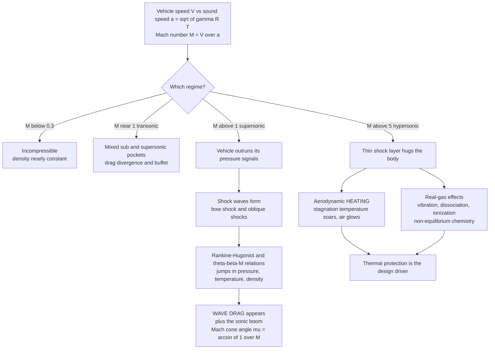

# 💥 Supersonic and Hypersonic Aerodynamics

> [!abstract] TL;DR
> **Supersonic and hypersonic aerodynamics** is what happens to the air around a vehicle when it flies faster than the air can "warn itself" — faster than the **speed of sound** $a = \sqrt{\gamma R T}$. The governing number is the **Mach number** $M = V/a$. Below $M\approx0.3$ density barely changes and the air acts incompressible; near $M=1$ (**transonic**) mixed subsonic and supersonic pockets form, terminated by shocks that cause **drag divergence** and **buffet**. Above $M=1$ (**supersonic**) the vehicle outruns its own pressure signals, so they collapse into **shock waves** — near-discontinuous jumps in pressure, temperature, and density governed by the **Rankine–Hugoniot / oblique-shock ($\theta$–$\beta$–$M$)** relations. Shocks create a brand-new drag source absent subsonically, **wave drag**, plus the **sonic boom** and the **Mach cone** of half-angle $\mu = \arcsin(1/M)$; flow turned *around* a corner accelerates isentropically through a **Prandtl–Meyer expansion fan**. Above $M\approx5$ (**hypersonic**) the shocks lie right against the body in a thin **shock layer**, stagnation temperatures soar into an **aerodynamic-heating** crisis, and **real-gas effects** — vibration, dissociation, ionization, non-equilibrium chemistry — appear. These three challenges — **shocks, wave drag, and heating** — define fighter jets, the Concorde, missiles, launch-vehicle ascent, and atmospheric re-entry, tying aerodynamics to propulsion (inlets, nozzles) and structures (thermal protection).

---

## Intuition

**Analogy:** Sound is how the air "warns" the air ahead that something is coming. As a body moves, it continuously sends out tiny pressure pulses that ripple outward at the speed of sound, telling the air in front to gently part and flow aside. Fly *faster than sound* and you outrun your own warning — the air ahead gets no notice, cannot get out of the way in time, and so it **piles up into a razor-thin wall of compression**: a **shock wave**, an almost instantaneous jump in pressure, temperature, and density. That pile-up is what you hear on the ground as the **boom**.

Now push harder. At **hypersonic** speeds (Mach 5 and beyond) the shocks stop standing off from the vehicle and instead **hug it like a skin**, and the air trapped behind them is compressed and slowed so violently that it gets white-hot — hot enough to glow and to chemically tear its own molecules apart. In this regime the hard part is no longer *going* fast; it is *staying cool* while you do. This is the violent, energy-drenched world of supersonic jets, re-entering capsules, and missiles — where the smooth streamlines of ordinary flight give way to shocks, searing heat, and chemistry.

---

## How It Works

### Core Mechanics

1. **The speed of sound is the warning speed.** Pressure disturbances propagate through a gas at $a = \sqrt{\gamma R T}$, where $\gamma$ is the ratio of specific heats and $T$ the local temperature. The **Mach number** $M = V/a$ compares how fast the vehicle moves to how fast the air can respond. This single ratio sorts every high-speed regime and is the same $a$ used in the sibling propulsion note *Inlets_Combustors_and_Nozzles*.

2. **Compressibility switches on (above $M\approx0.3$).** At low speed a gas behaves like an incompressible liquid — density is essentially constant and the *Incompressible_and_Subsonic_Aerodynamics* picture (Bernoulli, thin-airfoil theory) applies. Once $M\gtrsim0.3$ the density change exceeds a few percent and *must* be accounted for; the air now stores and releases energy by compressing.

3. **Transonic trouble (around $M=1$).** Even when the vehicle is subsonic overall, air accelerating over a curved wing can go *locally* supersonic, forming a pocket that closes with a shock. That shock thickens the boundary layer and can trigger **separation**, producing **drag divergence** (a sharp drag rise), **shock buffet**, and control problems — the real physics once mislabeled the "sound barrier."

4. **Supersonic flow and shock formation ($M>1$).** Now the body outruns its pressure signals entirely; they cannot travel upstream, so they collect on a standing **shock**. A **bow shock** stands off a blunt nose; an **oblique shock** springs from a sharp wedge or cone and *turns* the flow while compressing it. Across any shock, **pressure, temperature, and density jump upward and velocity drops**, and — because the process is dissipative — **entropy increases** (irreversible; see *[[Laws_of_Thermodynamics]]*).

5. **The jump relations.** Treating the hair-thin shock as a surface and applying mass, momentum, and energy conservation gives the **Rankine–Hugoniot** conditions, which close into algebra in $M_1$ for a normal shock:
$$\frac{p_2}{p_1} = 1 + \frac{2\gamma}{\gamma+1}\bigl(M_1^2 - 1\bigr), \qquad \frac{\rho_2}{\rho_1} = \frac{(\gamma+1)M_1^2}{(\gamma-1)M_1^2 + 2}, \qquad M_2^2 = \frac{(\gamma-1)M_1^2 + 2}{2\gamma M_1^2 - (\gamma-1)}.$$
An **oblique shock** at wave angle $\beta$ that deflects the flow by $\theta$ obeys the **$\theta$–$\beta$–$M$ relation**
$$\tan\theta = 2\cot\beta\,\frac{M_1^2\sin^2\beta - 1}{M_1^2(\gamma + \cos 2\beta) + 2},$$
which has *two* solutions (weak and strong) for each $\theta$ below a maximum turning angle — above which the shock **detaches** into a bow shock.

6. **Wave drag and the sonic boom.** Because shocks dissipate ordered energy into heat, they exact a new drag penalty, **wave drag**, that simply does not exist in subsonic flight. This is why supersonic vehicles are **thin, sharp, swept, and area-ruled**. The far-field pressure signature rolls up into a **Mach cone** of half-angle $\mu = \arcsin(1/M)$ (narrower the faster you fly) and reaches the ground as the double-crack **N-wave sonic boom**.

7. **Expansion fans for turning the other way.** Flow turned *away* from itself around a convex corner does the opposite of a shock: it accelerates **isentropically** through a **Prandtl–Meyer expansion fan**, dropping pressure and temperature smoothly with no entropy rise. Oblique shocks on compression surfaces plus expansion fans on expansion surfaces give **shock-expansion theory** for supersonic airfoils.

8. **Hypersonic regime ($M\gtrsim5$).** The shock lies extremely close to the body — a **thin shock layer** — and the flow behind it is so hot that a perfect-gas model fails. **Real-gas effects** set in: molecular **vibration** excites, then O₂ and N₂ **dissociate** and finally **ionize**, often out of thermodynamic and chemical **equilibrium**. Surface pressures can be estimated by simple **Newtonian impact theory** ($C_p = 2\sin^2\theta$), but the defining problem is **aerodynamic heating** — the stagnation enthalpy $h_0 = h + \tfrac12 V^2$ dumped into the gas becomes a thermal load that demands **thermal-protection systems** (developed in the sibling *Atmospheric_Reentry_and_Hypersonics*).

9. **The gas-dynamic toolbox.** Underlying all of this are the **isentropic relations** linking stagnation to static properties ($T_0/T = 1 + \tfrac{\gamma-1}{2}M^2$), the **area–Mach relation** $dA/A = (M^2-1)\,dV/V$, and **choking** at the throat where $M=1$ — the machinery shared with the compressible-flow notes below.

### Flow / Architecture



---

## Key Concepts

**Secondary (intuitive core).**
- **Speed of sound as a warning speed** — sound is how air passes the message "make way." Beat it, and the air has no time to react.
- **Shock wave** — the thin wall of piled-up air that forms when you outrun that warning; pressure, temperature, and density jump across it almost instantly.
- **Sonic boom** — the shock's pressure signature slamming the ground after the vehicle has already passed overhead.
- **Faster = hotter** — at hypersonic speed the compressed air behind the shock gets hot enough to glow; staying cool becomes as hard as going fast.

**Undergraduate (quantitative core).**
- **Mach regimes** — subsonic ($M<1$), transonic ($M\approx1$), supersonic ($M>1$), hypersonic ($M\gtrsim5$), each with distinct physics.
- **Normal-shock relations** — the Rankine–Hugoniot algebra giving $p_2/p_1$, $T_2/T_1$, $\rho_2/\rho_1$, and $M_2$ from $M_1$; the flow always exits **subsonic**.
- **Oblique shocks and the $\theta$–$\beta$–$M$ relation** — a wedge of half-angle $\theta$ throws a shock at angle $\beta$; weak vs strong solutions; shock **detachment** past the maximum turning angle.
- **Mach angle and Mach cone** — $\mu = \arcsin(1/M)$; the disturbance envelope narrows as speed rises.
- **Prandtl–Meyer expansion** — isentropic acceleration around an expansion corner; the shock-free counterpart to compression.
- **Wave drag** — the extra drag caused by shock losses, minimized by thin, sharp, swept, area-ruled shapes.
- **Isentropic and area–Mach relations** — stagnation-to-static ratios, choking at the throat, converging-diverging nozzle logic.

**Graduate (advanced and real-gas).**
- **Real-gas and high-temperature effects** — vibrational excitation, dissociation, ionization; equilibrium vs finite-rate (non-equilibrium) chemistry behind strong shocks.
- **Thin shock layer and Newtonian impact theory** — $C_p = 2\sin^2\theta$ as the hypersonic pressure limit; entropy layers and the Mach-independence principle.
- **Aerodynamic heating** — convective and radiative stagnation-point heating (Fay–Riddell scaling), the driver of ablative and radiative thermal-protection systems.
- **Viscous interactions** — shock/boundary-layer interaction, hypersonic viscous interaction parameter, and transition, coupling this material to *Boundary_Layers_and_Aerodynamic_Drag*.
- **Method of characteristics** — the hyperbolic marching technique for designing supersonic nozzle contours and computing rotational supersonic fields.

---

## Python Demo

```python
# Supersonic/hypersonic gas dynamics from scratch (numpy + matplotlib, no scipy).
# (a) Normal-shock property jumps vs upstream Mach (Rankine-Hugoniot).
# (b) Mach angle mu = arcsin(1/M) and the oblique-shock theta-beta-M curve.
import numpy as np
import matplotlib.pyplot as plt

gamma = 1.4  # air, ratio of specific heats

# ---- (a) Normal-shock (Rankine-Hugoniot) property ratios ----
def normal_shock(M1, g=gamma):
    p2_p1   = 1.0 + 2.0 * g / (g + 1.0) * (M1**2 - 1.0)
    rho2_r1 = (g + 1.0) * M1**2 / ((g - 1.0) * M1**2 + 2.0)
    T2_T1   = p2_p1 / rho2_r1                       # ideal gas: T ~ p/rho
    M2_sq   = ((g - 1.0) * M1**2 + 2.0) / (2.0 * g * M1**2 - (g - 1.0))
    return p2_p1, T2_T1, rho2_r1, np.sqrt(M2_sq)

M1 = np.linspace(1.0, 6.0, 400)
p_ratio, T_ratio, rho_ratio, M2 = normal_shock(M1)

# Spot-check the classic Mach 2 and Mach 5 shocks
for M in (2.0, 5.0):
    p, T, r, m2 = normal_shock(M)
    print(f"M1={M:.0f}: p2/p1={p:5.1f}  T2/T1={T:5.2f}  rho2/rho1={r:4.2f}  M2={m2:.3f}")

# ---- (b) Mach angle and oblique-shock theta-beta-M ----
def theta_from_beta(M1, beta, g=gamma):  # deflection angle for a given wave angle
    num = M1**2 * np.sin(beta)**2 - 1.0
    den = M1**2 * (g + np.cos(2.0 * beta)) + 2.0
    return np.arctan(2.0 / np.tan(beta) * num / den)

M_cone = np.linspace(1.0, 6.0, 400)
mu = np.degrees(np.arcsin(1.0 / M_cone))         # Mach angle, degrees

# ---- Plots ----
fig, ax = plt.subplots(2, 2, figsize=(12, 9))

ax[0, 0].plot(M1, p_ratio, 'r', lw=2, label=r'$p_2/p_1$ pressure')
ax[0, 0].plot(M1, T_ratio, 'orange', lw=2, label=r'$T_2/T_1$ temperature')
ax[0, 0].set_title('Normal-shock jumps: a Mach-5 shock spikes p ~35x')
ax[0, 0].set_xlabel('upstream Mach $M_1$'); ax[0, 0].set_ylabel('downstream / upstream')
ax[0, 0].legend(); ax[0, 0].grid(alpha=0.3)

ax[0, 1].plot(M1, rho_ratio, 'b', lw=2, label=r'$\rho_2/\rho_1$ density')
ax[0, 1].plot(M1, M2, 'g', lw=2, label=r'$M_2$ downstream Mach')
ax[0, 1].axhline(1.0, color='k', ls=':', lw=1)
ax[0, 1].axhline((gamma + 1) / (gamma - 1), color='b', ls='--', lw=1,
                 label='density limit 6')
ax[0, 1].set_title('Density saturates at 6; flow always exits subsonic')
ax[0, 1].set_xlabel('upstream Mach $M_1$'); ax[0, 1].set_ylabel('ratio / Mach')
ax[0, 1].legend(); ax[0, 1].grid(alpha=0.3)

ax[1, 0].plot(M_cone, mu, 'purple', lw=2)
ax[1, 0].set_title('Mach cone half-angle mu = arcsin(1/M) narrows with speed')
ax[1, 0].set_xlabel('Mach $M$'); ax[1, 0].set_ylabel('Mach angle mu (deg)')
ax[1, 0].grid(alpha=0.3)

for M in (1.5, 2.0, 3.0, 5.0):
    beta = np.radians(np.linspace(np.degrees(np.arcsin(1.0 / M)) + 0.01, 89.9, 500))
    theta = np.degrees(theta_from_beta(M, beta))
    theta[theta < 0] = np.nan                     # keep physical branch
    ax[1, 1].plot(theta, np.degrees(beta), lw=2, label=f'M = {M}')
ax[1, 1].set_title('Oblique shock theta-beta-M: peak theta = detachment')
ax[1, 1].set_xlabel('flow deflection theta (deg)')
ax[1, 1].set_ylabel('shock wave angle beta (deg)')
ax[1, 1].legend(); ax[1, 1].grid(alpha=0.3)

plt.tight_layout()
plt.savefig('supersonic_gas_dynamics.png', dpi=120)
print('saved supersonic_gas_dynamics.png')
```

The normal-shock panels show why high-speed flight is so punishing: a Mach-2 shock roughly quadruples the pressure and raises temperature ~1.7x, while a Mach-5 shock spikes pressure ~29x and temperature ~5.8x — the aerodynamic-heating problem in one curve. The density ratio famously **saturates at $(\gamma+1)/(\gamma-1)=6$** no matter how fast you go, and $M_2$ always drops below 1. The Mach-angle panel shows the cone tightening as speed rises, and the $\theta$–$\beta$–$M$ panel shows each Mach number's maximum deflection — turn a wedge past that peak and the shock **detaches** into a bow shock.

---

## Real-World Applications

> **Concorde and supersonic transport.** Cruising at Mach 2, the Concorde lived entirely inside the shock world: its thin, sharp-edged **ogival delta wing** and slender area-ruled fuselage existed to minimize **wave drag**, and its overland sonic boom is exactly why supersonic passenger flight was banned over land — the same physics NASA's X-59 QueSST now tries to soften with low-boom shaping.

> **Fighter aircraft inlets.** A supersonic jet cannot feed supersonic air straight into its engine; the compressor needs subsonic flow. Aircraft like the F-15 and SR-71 use **variable ramps and spikes** that stage a series of **oblique shocks** to decelerate and compress the intake air efficiently before a final terminal shock — a direct application of the $\theta$–$\beta$–$M$ relation, tying this note to *Inlets_Combustors_and_Nozzles*.

> **Atmospheric re-entry.** A returning capsule or Space Shuttle hits the atmosphere near Mach 25. Engineers deliberately use a **blunt body** so the strong **bow shock** stands *off* the vehicle, dumping most of the enormous kinetic energy into the shock-heated air rather than the structure — but the residual **aerodynamic heating** still demands ablative shields or ceramic tiles, and the shock layer is hot enough to **ionize** and cause the radio "blackout." This is developed in *Atmospheric_Reentry_and_Hypersonics*.

> **Hypersonic weapons and scramjets.** Hypersonic glide vehicles and air-breathing **scramjets** (e.g., the X-43A and X-51 at Mach 6–10) burn fuel in a flow that never slows below supersonic, so the combustor design is dominated by **oblique shock trains** and **real-gas chemistry** — the frontier where aerodynamics, propulsion, and thermal management fuse.

---

## Common Pitfalls

- **Using Bernoulli above $M\approx0.3$.** Incompressible Bernoulli assumes constant density and silently gives wrong pressures and lift once compressibility matters. Switch to the compressible/isentropic relations — this is the single most common high-speed mistake.
- **Assuming shocks are isentropic.** Oblique and normal shocks are **irreversible**: total pressure drops and entropy rises across them. Only **expansion fans** are isentropic. Designing an inlet as if shocks were loss-free badly over-predicts recovered pressure.
- **Picking the wrong oblique-shock root.** The $\theta$–$\beta$–$M$ relation gives a **weak** and a **strong** solution for each deflection; real external flows almost always take the weak one. Blindly solving the equation can hand you the unphysical strong branch.
- **Forgetting shock detachment.** Turn the flow past the maximum deflection angle and no attached oblique shock exists — a **detached bow shock** forms with a subsonic pocket behind it. Wedge/cone analyses that ignore this limit give nonsense at blunt or over-turned geometries.
- **Treating hypersonic air as a perfect gas.** At $M\gtrsim5$ the gas **vibrates, dissociates, and ionizes**; using $\gamma=1.4$ overestimates temperatures and misplaces the shock. Real-gas (equilibrium or non-equilibrium) models are mandatory for re-entry heating.
- **Sizing thermal protection from stagnation *temperature* alone.** The structural threat is the **heat flux** (which scales with density and velocity cubed and depends on wall catalycity), not just $T_0$. High temperature at low density (upper atmosphere) can be survivable; the peak-heating altitude band is what matters.

---

## Related Concepts

- [[Compressible_Flow_and_Gas_Dynamics]] — the Fluid_Dynamics parent note on Mach number, isentropic relations, choking, and nozzles; this note applies that machinery to whole vehicles.
- [[Shock_Waves_and_Supersonic_Flow]] — the physics-first treatment of shock formation, Rankine–Hugoniot jumps, entropy, and the Mach cone that this note frames from the aerodynamic side.
- [[Compressible_Flow_and_Propulsion]] — the Mechanical-Engineering companion covering de Laval nozzles, thrust, and the rocket equation, where supersonic exhaust turns into vehicle thrust.
- [[Laws_of_Thermodynamics]] — the Second Law that forces shocks to be irreversible (entropy-increasing) and forbids the "expansion shock."
- [[Wave_Motion_and_Properties]] — the acoustic wave picture behind the speed of sound $a=\sqrt{\gamma R T}$ and the pressure "warnings" a body outruns.

Sibling Aerospace_Engineering aerodynamics notes referenced in prose: *Airfoils_and_Wing_Theory*, *Incompressible_and_Subsonic_Aerodynamics*, *Boundary_Layers_and_Aerodynamic_Drag*, *Atmospheric_Reentry_and_Hypersonics*, and *Inlets_Combustors_and_Nozzles*.

---

## Review Questions

1. **(Secondary)** In your own words, why does flying faster than sound create a shock wave and a "boom," when flying slower does not? Use the idea of the air being "warned" that something is coming.
2. **(Secondary)** Why does staying *cool* become one of the hardest problems at hypersonic speed, even though the vehicle is flying through cold upper-atmosphere air?
3. **(Undergraduate)** Air at Mach 3 passes through a normal shock. Using the Rankine–Hugoniot relations ($\gamma=1.4$), estimate $p_2/p_1$, $T_2/T_1$, and $M_2$. Is the downstream flow subsonic or supersonic, and why must it be?
4. **(Undergraduate)** A sharp wedge in Mach-4 flow deflects the air by 20°. Explain how you would use the $\theta$–$\beta$–$M$ relation to find the shock angle, why there are two answers, and what happens if you increase the wedge angle past its maximum.
5. **(Undergraduate → Graduate)** You must design a supersonic engine inlet. Would you use a single strong normal shock or a series of oblique shocks to decelerate the incoming air, and why? Frame your answer in terms of total-pressure recovery and entropy.
6. **(Graduate)** For a blunt re-entry capsule at Mach 25, explain (a) why a blunt shape is *preferred* despite its high drag, and (b) why a perfect-gas ($\gamma=1.4$) analysis will mispredict the shock-layer temperature and heating. Name the real-gas effects involved.

---

## Sources

- Anderson, J. D. *Modern Compressible Flow: With Historical Perspective*, 3rd ed. McGraw-Hill.
- Anderson, J. D. *Hypersonic and High-Temperature Gas Dynamics*, 2nd ed. AIAA Education Series.
- Anderson, J. D. *Fundamentals of Aerodynamics*, 6th ed. McGraw-Hill (Part 3, Inviscid Compressible Flow).
- Zucrow, M. J., and Hoffman, J. D. *Gas Dynamics*, Vols. 1–2. Wiley.
- NASA Glenn Research Center, *Beginner's Guide to Aeronautics* (compressible aerodynamics and shock relations).

---

#aerospace-engineering #aerodynamics #supersonic #hypersonic #shock-waves
