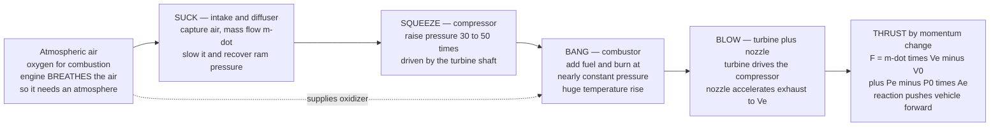

# ✈️ Air-Breathing Propulsion: How Jet Engines Make Thrust

> [!abstract] TL;DR
> An **air-breathing engine** is a giant, continuously-firing **air pump** that makes **thrust** by Newton's third law: it grabs a huge mass of atmospheric air, energizes it, and hurls it rearward faster than it came in — and the air shoves the vehicle forward in reaction. The governing law is the **momentum (thrust) equation** $F = \dot m\,(V_e - V_0) + (P_e - P_0)\,A_e$: mass flow $\dot m$ times the *gain* in velocity from flight speed $V_0$ to exhaust speed $V_e$, plus a pressure term. Inside, almost every jet runs the **Brayton cycle** — **"suck, squeeze, bang, blow"**: the **intake/diffuser** slows and pressurizes incoming air (*suck*), the **compressor** raises its pressure further (*squeeze*), the **combustor** burns fuel at nearly constant pressure to spike the temperature (*bang*), and the **turbine + nozzle** extract just enough work to spin the compressor and then accelerate the hot gas out the back (*blow*). Because it **breathes atmospheric oxygen**, an air-breather carries only fuel — far more efficient than a rocket — but it is useless above the air. The engine family runs from the **turbojet** (all thrust from a fast core jet — powerful but loud and thirsty), through the **turbofan** (a big fan bypasses air around the core — high bypass ratio makes it efficient and quiet, the airliner standard), the **turboprop** (turbine drives a propeller — best at low speed), to the **ramjet/scramjet** (no compressor at all — ram compression at supersonic/hypersonic speed). The master trade-off is captured by **propulsive efficiency** $\eta_p = \dfrac{2}{1 + V_e/V_0}$: moving *lots* of air *slowly* is efficient — which is exactly why bypass ratios climbed for decades — but it fights against **specific thrust**. This section-opener sets up the detailed cycle, component, and rocket notes that follow.

---

## Intuition

**Analogy:** Blow up a balloon and let go — it darts across the room. Nobody pushes it; the air rushing *backward* out of the neck pushes the balloon *forward* in reaction. That is the entire secret of jet propulsion in one toy: throw mass one way, get shoved the other way (Newton's third law). A jet engine does the same thing, only far more cleverly and continuously. Instead of a fixed lungful of air, it **breathes** — it **sucks** in a torrent of atmospheric air, **squeezes** it to high pressure, **bangs** in fuel and burns it so the gas expands violently, and **blows** the searing exhaust out a nozzle at high speed. Grab a huge amount of air, throw it backward fast, and the reaction shoves the plane forward.

The one twist that separates a jet from a rocket is where the oxygen comes from. A jet **breathes the atmosphere** for the oxygen it needs to burn fuel, so it only works where there is air — climb too high or go too fast and it starves. A rocket carries its own oxidizer and works in vacuum. That single choice — breathe the air versus carry your own — decides everything about an engine's efficiency, its ceiling, and its top speed. And the second twist is *how* you throw the air: you can throw a *little* air *very* fast (a screaming turbojet) or a *lot* of air *gently* (a fat, quiet turbofan). Both make thrust, but as we will see, the gentle-and-plentiful way is dramatically more efficient — the reason every airliner you have flown on has enormous fans up front.

---

## How It Works

### Core Mechanics

1. **Thrust is reaction — the momentum equation.** Draw a control volume around the whole engine and apply conservation of momentum. Air enters at the flight speed $V_0$ (in the engine's frame) with mass flow $\dot m$ and leaves at exhaust speed $V_e$. The net rearward push on the gas equals the forward push on the engine: $F = \dot m\,(V_e - V_0) + (P_e - P_0)\,A_e$. The first term is **momentum thrust** (you sped the air up from $V_0$ to $V_e$); the second is **pressure thrust**, nonzero only when the nozzle exit pressure $P_e$ differs from ambient $P_0$. Two knobs make thrust: **how much air** ($\dot m$) and **how much faster you throw it** ($V_e - V_0$).

2. **Suck — the intake/diffuser.** The inlet captures air and delivers it to the compressor at the right speed. At subsonic cruise it acts as a *diffuser*, slowing the air and recovering that kinetic energy as a pressure rise (ram compression); at supersonic flight the inlet must decelerate the flow through carefully managed shocks before it reaches the compressor. A good inlet loses as little **stagnation pressure** as possible.

3. **Squeeze — the compressor.** A multistage axial (or centrifugal) compressor, driven by the turbine through a common shaft, raises the air pressure by a large factor (**overall pressure ratio** of 30–50+ in modern engines). Higher pressure ratio means more heat can be added efficiently — this is the same lever that raises **Brayton-cycle** thermal efficiency (see the sibling *Gas_Turbine_Engine_Cycles*). The compressor is turbomachinery — the same physics as pumps and turbines.

4. **Bang — the combustor.** Fuel is sprayed into the high-pressure air and burned **at nearly constant pressure**, producing an enormous temperature rise (turbine-inlet temperatures reach 1500–1700 °C, limited by blade metallurgy and cooling). This is the heat-addition leg of the cycle: chemical energy becomes thermal energy and the gas expands violently, ready to do work and accelerate.

5. **Blow — the turbine and nozzle.** The hot, high-pressure gas first passes through the **turbine**, which extracts *just enough* work to drive the compressor (and the fan/prop). Whatever pressure and temperature remain are then converted to kinetic energy in the **nozzle**, which accelerates the exhaust to $V_e$. In a turbojet all leftover energy goes into a fast core jet; in a turbofan most goes into spinning a large bypass fan instead (see the sibling *Inlets_Combustors_and_Nozzles*).

6. **The engine family — how you split the energy.** A **turbojet** dumps all energy into a small, very fast jet: high specific thrust, but noisy and fuel-hungry. A **turbofan** uses the core to drive a big fan that accelerates a large *bypass* stream of unburned air gently; the **bypass ratio** (bypass air / core air) rose from ~1 to 10–12 over decades because it slashes fuel burn and noise — today's airliner standard. A **turboprop** extracts almost all the energy in the turbine to spin a **propeller** (a huge, slow air-mover) — unbeatable efficiency at low speed. A **ramjet** deletes the compressor entirely, using the vehicle's own supersonic speed for ram compression; a **scramjet** does the same but keeps the internal flow supersonic for hypersonic flight (see the sibling *Compressible_Flow_and_Propulsion*).

7. **Performance metrics.** Engines are scored by **thrust** $F$, **specific thrust** $F/\dot m$ (thrust per unit air — high for turbojets, low for turbofans), **thrust-specific fuel consumption (TSFC)** (fuel burned per unit thrust per hour — the airline's bottom line), and three efficiencies whose product is **overall efficiency**: **thermal efficiency** (how well the core turns fuel heat into jet kinetic energy), **propulsive efficiency** $\eta_p = \tfrac{2}{1+V_e/V_0}$ (how well that jet kinetic energy becomes useful thrust power), and their product. The propulsive term is why bypass ratio matters so much.

### Flow / Architecture



---

## Key Concepts

### Secondary Level

- **A jet engine is a big air pump.** It sucks in air at the front, squeezes it, sets it on fire with fuel, and blasts the hot gas out the back. Throwing gas backward makes the plane go forward — exactly like a balloon zipping around a room when you let it go.
- **"Suck, squeeze, bang, blow."** Four steps in order: grab the air, compress it, burn fuel in it, and shoot it out a nozzle. Every jet engine does these four things.
- **It needs air.** A jet **breathes** the atmosphere for the oxygen it burns, so it stops working where the air runs out — high up or very fast. A **rocket** carries its own oxygen and works in space; a jet cannot.
- **Big fan = quiet and thrifty.** The huge fan at the front of an airliner engine (a **turbofan**) moves a lot of air gently. Moving lots of air slowly is much more efficient and far quieter than blasting a little air very fast (an old **turbojet**) — which is why modern engines are so fat at the front.
- **More air or faster air.** You get more thrust by either moving *more* air or throwing it out *faster*. Both work; they just have different costs.

### Undergraduate Level

- **Thrust (momentum) equation.** $F = \dot m\,(V_e - V_0) + (P_e - P_0)\,A_e$ — momentum thrust plus pressure thrust. At **perfect expansion** ($P_e = P_0$) it reduces to $F = \dot m\,(V_e - V_0)$. Note thrust falls as flight speed $V_0$ rises toward $V_e$, and hits zero when $V_0 = V_e$ (you cannot accelerate air that is already leaving as fast as it arrived).
- **The Brayton cycle behind the hardware.** Ideal air-standard Brayton: isentropic compression → constant-pressure heat addition → isentropic expansion → constant-pressure heat rejection. Thermal efficiency depends only on pressure ratio, $\eta_{th} = 1 - r_p^{-(\gamma-1)/\gamma}$ — the thermodynamic reason engines chase ever-higher compressor pressure ratios (tie to the sibling *Gas_Turbine_Engine_Cycles*, [[Power_and_Refrigeration_Cycles]], and [[Engineering_Thermodynamics]]).
- **Propulsive efficiency** $\eta_p = \dfrac{P_{thrust}}{P_{jet}} = \dfrac{F V_0}{\tfrac12 \dot m (V_e^2 - V_0^2)} = \dfrac{2}{1 + V_e/V_0}$ (Froude efficiency). It is the fraction of the jet's added kinetic energy that becomes *useful* thrust power. As $V_e \to V_0$, $\eta_p \to 1$ — but then $F \to 0$, so you need enormous $\dot m$. This is the thrust-versus-efficiency trade-off in one equation.
- **Specific thrust** $F/\dot m = V_e - V_0$ (perfectly expanded). High for turbojets (small $\dot m$, big $V_e$), low for high-bypass turbofans (big $\dot m$, small $V_e$) — the *opposite* ranking to propulsive efficiency, which is why the two must be traded.
- **Bypass ratio (BPR).** $\text{BPR} = \dot m_{bypass}/\dot m_{core}$. Raising BPR moves more air more slowly, lowering the *effective* $V_e$, raising $\eta_p$, cutting **TSFC** and noise — the dominant airliner-engine design trend from ~1970 onward.
- **Overall efficiency** $\eta_o = \eta_{th}\,\eta_p$, and $\text{TSFC} \propto V_0/(\eta_o \cdot \text{fuel heating value})$: fuel burn is set by the *product* of core (thermal) and propulsive efficiency, so both must be pushed together.

### Graduate Level

- **Cycle analysis and the specific-thrust / TSFC map.** Parametric (design-point) analysis treats the engine as ideal or component-efficient (with polytropic/isentropic efficiencies, pressure-ratio and turbine-inlet-temperature as parameters) and plots **specific thrust vs TSFC** as bypass ratio, fan pressure ratio, and $T_{04}$ are swept — the working design space of every engine family. Off-design (performance) analysis matches component maps for real throttle behavior.
- **Optimum bypass and fan pressure ratio.** For a given core, there is an optimum split of core power between the fan stream and the core jet that maximizes thrust or minimizes TSFC; the ideal condition drives the fan and core exhaust velocities toward a common value, minimizing the mean kinetic-energy waste in the exhaust.
- **Ram effect and the flight-speed envelope.** Turbojet thrust can *rise* then fall with Mach number as ram pressure recovery competes with falling $(V_e - V_0)$; ramjets need $M \gtrsim 2$-3 to work at all (no ram compression at rest) and lose out to rockets above $M \approx 6$; **scramjets** keep combustion supersonic to avoid the dissociation and total-pressure losses of decelerating a hypersonic stream — the frontier of air-breathing flight.
- **Real-gas, cooling, and material limits.** Turbine-inlet temperature is capped by single-crystal superalloy blades, film cooling, and thermal-barrier coatings; the pursuit of higher $T_{04}$ (better core thermal efficiency) versus cooling-air penalty and NOx emissions is a central design tension (couples to [[Pumps_Compressors_and_Turbines]] and combustor chemistry).
- **Installed vs uninstalled thrust.** Real thrust must subtract **inlet spillage drag**, **nacelle/boattail drag**, and bleed/power extraction; installation effects can erase several percent of ideal thrust and reshape the optimum.
- **Noise, emissions, and the efficiency frontier.** High BPR simultaneously cuts jet noise (jet noise scales with roughly $V_e^8$) and TSFC; geared turbofans, open rotors, and hydrogen/SAF combustion push the frontier further, bounded by the fundamental $\eta_p$–specific-thrust trade and by propulsive-efficiency diminishing returns.

---

## Python Demo

```python
# Air-breathing propulsion in one figure, numpy + matplotlib only.
#
#   (a) THRUST EQUATION  F = m_dot*(Ve - V0) + (Pe - P0)*Ae
#       Plot thrust vs FLIGHT SPEED V0 for two engines that make thrust very
#       differently:
#         - a TURBOJET      : little air (small m_dot), thrown VERY fast (big Ve)
#         - a high-BYPASS TURBOFAN : lots of air (big m_dot), thrown GENTLY (small Ve)
#       Thrust falls as V0 rises and hits ZERO when V0 = Ve (you cannot accelerate
#       air that already leaves as fast as it arrives). Assume perfect expansion
#       (Pe = P0) so the pressure term vanishes; it is kept in the formula below.
#
#   (b) PROPULSIVE EFFICIENCY  eta_p = 2 / (1 + Ve/V0)
#       Plot eta_p vs the exhaust-to-flight speed ratio Ve/V0 and mark where each
#       engine sits. LOW Ve/V0 (turbofan: lots of air, slowly) -> HIGH efficiency;
#       HIGH Ve/V0 (turbojet: little air, fast) -> LOW efficiency. That is WHY
#       bypass ratios climbed for decades -- and why it costs specific thrust.
import numpy as np
import matplotlib.pyplot as plt

# ---- two engines, compared at a common cruise flight speed ----
V0_cruise = 250.0                       # cruise flight speed [m/s] (~M 0.85 at altitude)

# Turbojet: small mass flow, high exhaust velocity
mdot_tj, Ve_tj = 50.0, 600.0            # kg/s , m/s
# High-bypass turbofan: 10x the air, half the exhaust velocity
mdot_tf, Ve_tf = 500.0, 300.0           # kg/s , m/s

# perfectly expanded -> pressure-thrust term (Pe - P0)*Ae is zero
def thrust(mdot, Ve, V0, dP_times_Ae=0.0):
    """Momentum thrust plus pressure thrust from the thrust equation."""
    return mdot * (Ve - V0) + dP_times_Ae

def eta_prop(Ve, V0):
    """Froude propulsive efficiency: 2 / (1 + Ve/V0)."""
    return 2.0 / (1.0 + Ve / V0)

# ---- (a) thrust vs flight speed ----
V0 = np.linspace(0.0, 650.0, 400)
F_tj = thrust(mdot_tj, Ve_tj, V0)
F_tf = thrust(mdot_tf, Ve_tf, V0)

# operating points at cruise
Ftj_c, Ftf_c = thrust(mdot_tj, Ve_tj, V0_cruise), thrust(mdot_tf, Ve_tf, V0_cruise)
etj_c, etf_c = eta_prop(Ve_tj, V0_cruise), eta_prop(Ve_tf, V0_cruise)

print("=== Thrust equation  F = m_dot*(Ve - V0)  (perfect expansion) ===")
print(f"  cruise flight speed V0        : {V0_cruise:6.0f} m/s")
print(f"  TURBOJET  (m_dot=50 , Ve=600) : F = {Ftj_c/1e3:6.2f} kN , specific thrust {Ve_tj-V0_cruise:5.0f} m/s")
print(f"  TURBOFAN  (m_dot=500, Ve=300) : F = {Ftf_c/1e3:6.2f} kN , specific thrust {Ve_tf-V0_cruise:5.0f} m/s")
print("=== Propulsive efficiency  eta_p = 2/(1 + Ve/V0) ===")
print(f"  TURBOJET  Ve/V0 = {Ve_tj/V0_cruise:4.2f}  ->  eta_p = {etj_c*100:5.1f} %")
print(f"  TURBOFAN  Ve/V0 = {Ve_tf/V0_cruise:4.2f}  ->  eta_p = {etf_c*100:5.1f} %")
print("  -> the turbofan makes MORE thrust AND is MUCH more efficient here,")
print("     because it moves far more air at a lower exhaust speed.")

# ---- (b) propulsive efficiency vs speed ratio ----
ratio = np.linspace(1.0, 5.0, 400)      # Ve/V0
etap  = 2.0 / (1.0 + ratio)

# ----------------------------- plotting -----------------------------
fig, (axL, axR) = plt.subplots(1, 2, figsize=(14, 6))
fig.suptitle("Air-Breathing Propulsion: thrust and the thrust-vs-efficiency trade-off",
             fontsize=13, fontweight="bold")

# (a) thrust vs flight speed
axL.plot(V0, F_tj/1e3, color="#d62728", lw=2.4, label="turbojet  (m_dot=50, Ve=600)")
axL.plot(V0, F_tf/1e3, color="#1f77b4", lw=2.4, label="high-bypass turbofan  (m_dot=500, Ve=300)")
axL.axvline(V0_cruise, color="gray", ls="--", lw=1)
axL.axhline(0.0, color="k", lw=1)
axL.scatter([V0_cruise, V0_cruise], [Ftj_c/1e3, Ftf_c/1e3], color="k", zorder=5)
axL.text(V0_cruise+8, Ftf_c/1e3, "cruise", fontsize=8, color="gray")
axL.annotate("thrust -> 0 when V0 = Ve\n(cannot out-run your own jet)",
             xy=(Ve_tf, 0), xytext=(Ve_tf-210, 30), fontsize=8,
             arrowprops=dict(arrowstyle="->"))
axL.set_xlabel("flight speed  V0  [m/s]")
axL.set_ylabel("thrust  F  [kN]")
axL.set_title("(a) Thrust  F = m_dot*(Ve - V0)")
axL.legend(loc="upper right", fontsize=8)
axL.grid(alpha=0.3)

# (b) propulsive efficiency vs Ve/V0
axR.plot(ratio, etap*100, color="#2ca02c", lw=2.6)
axR.scatter([Ve_tf/V0_cruise], [etf_c*100], color="#1f77b4", zorder=5, s=60)
axR.scatter([Ve_tj/V0_cruise], [etj_c*100], color="#d62728", zorder=5, s=60)
axR.annotate("high-bypass TURBOFAN\nlots of air, slowly\nhigh efficiency",
             xy=(Ve_tf/V0_cruise, etf_c*100), xytext=(1.6, 78), fontsize=8,
             color="#1f77b4", arrowprops=dict(arrowstyle="->", color="#1f77b4"))
axR.annotate("TURBOJET\nlittle air, very fast\nlow efficiency",
             xy=(Ve_tj/V0_cruise, etj_c*100), xytext=(2.9, 62), fontsize=8,
             color="#d62728", arrowprops=dict(arrowstyle="->", color="#d62728"))
axR.set_xlabel("exhaust-to-flight speed ratio  Ve / V0")
axR.set_ylabel("propulsive efficiency  eta_p  [percent]")
axR.set_title("(b) eta_p = 2 / (1 + Ve/V0)")
axR.grid(alpha=0.3)

plt.tight_layout(rect=[0, 0, 1, 0.95])
plt.show()
```

Running this prints the two engines' numbers and draws two panels. The **left panel** plots the **thrust equation**: both engines' thrust *falls* as flight speed $V_0$ climbs, and each drops to **zero when $V_0 = V_e$** — you cannot push air that is already leaving as fast as it arrives (the turbofan, with $V_e = 300$, runs out first). Notice that at cruise the turbofan makes **more** thrust (~25 kN vs ~17.5 kN) *because it moves ten times the air*, even though each kilogram is thrown gently. The **right panel** plots **propulsive efficiency** against the exhaust-to-flight speed ratio $V_e/V_0$: the turbofan sits at low $V_e/V_0 = 1.2$ and scores $\eta_p \approx 91\%$, while the turbojet at $V_e/V_0 = 2.4$ manages only $\approx 59\%$. That single curve is why bypass ratios climbed decade after decade — moving *lots* of air *slowly* wastes far less kinetic energy in the exhaust. The catch (the trade-off) is **specific thrust**: the turbofan's per-kilogram thrust is only 50 m/s versus the turbojet's 350 m/s, so it needs a much bigger, heavier engine to move all that air — the eternal tension between efficiency and thrust density.

---

## Real-World Applications

> **Example — the high-bypass turbofan on every airliner.** The engines under the wings of a Boeing 787 or Airbus A320 (GE, Rolls-Royce, Pratt & Whitney, CFM) are high-bypass turbofans whose enormous front fan handles a **bypass ratio of 10–12**: most of the air you see entering the nacelle never touches the combustor — it is simply accelerated gently by the fan and provides the majority of the thrust. This is the propulsive-efficiency curve made physical: by moving a *huge* mass of air at *low* exhaust velocity, the turbofan wins on **TSFC** (fuel burn), on **noise** (jet noise scales with roughly $V_e^8$, so a slower jet is dramatically quieter), and still delivers plenty of thrust. The relentless climb in bypass ratio since the 1970s — culminating in geared turbofans — is nothing but the industry chasing $\eta_p = 2/(1+V_e/V_0)$ upward (see the sibling *Gas_Turbine_Engine_Cycles* and *Aircraft_Performance*).

> **Example — the turbojet and low-bypass fighter engine.** Early jetliners and today's supersonic fighters use turbojets or **low-bypass** afterburning turbofans (e.g. the F-22's F119, the Eurofighter's EJ200). Here the design deliberately accepts *lower* propulsive efficiency in exchange for **high specific thrust** — a compact, high-$V_e$ engine that keeps making thrust at high supersonic speed (where a fat turbofan's thrust would have collapsed toward zero as $V_0 \to V_e$). The **afterburner** dumps extra fuel into the exhaust to spike $V_e$ for bursts of thrust, trading efficiency for raw power — the fighter's opposite priority to the airliner's.

> **Example — turboprops, ramjets, and scramjets at the speed extremes.** At *low* speed, a **turboprop** (regional airliners, military transports like the C-130) is the ultimate air-mover: its propeller pushes an even larger, slower air stream than a turbofan, giving the best efficiency below ~M 0.6. At the *high* extreme, the **ramjet** (missiles, the SR-71's turbo-ramjet at cruise) deletes rotating machinery and uses the vehicle's supersonic speed for ram compression — but produces no static thrust and needs a boost to get going. The experimental **scramjet** (NASA X-43A, Boeing X-51) keeps combustion supersonic to reach hypersonic Mach numbers, the current frontier of air-breathing flight before rockets (see the sibling *Compressible_Flow_and_Propulsion* and *Rocket_Propulsion_Fundamentals*).

---

## Common Pitfalls

- **Thinking the engine "pushes against the air behind it."** Thrust is **reaction to accelerating a mass of air**, not the exhaust shoving on the outside atmosphere — a jet works just as well (better, actually) in thin air and a rocket works in vacuum. Frame it with the momentum equation $F = \dot m(V_e - V_0)$, not with the exhaust "pushing off" anything.
- **Ignoring the effect of flight speed on thrust.** Thrust is $\dot m(V_e - V_0)$, *not* $\dot m V_e$. As the aircraft speeds up, $V_0$ rises and thrust *falls*, vanishing when $V_0 = V_e$. Students who compute static (sea-level, $V_0=0$) thrust and assume it holds at cruise badly over-predict performance — this is exactly why a high-bypass fan (low $V_e$) is a poor supersonic engine.
- **Confusing thrust with efficiency.** More thrust does **not** mean more efficient. A turbojet has high **specific thrust** but low **propulsive efficiency**; a high-bypass turbofan is the reverse. They are traded through $\eta_p = 2/(1+V_e/V_0)$ versus specific thrust $V_e - V_0$ — pushing one up pushes the other down.
- **Forgetting the engine breathes.** An air-breather's thrust and even its ability to run **degrade with altitude and Mach number** as air density and oxygen fall; there is a ceiling above which it flames out. Treating a jet like a rocket (constant thrust, works anywhere) is wrong — the atmosphere is both its oxidizer supply and its working fluid.
- **Assuming maximum exhaust velocity gives maximum thrust or efficiency.** Neither. Thrust is maximized by the *product* $\dot m(V_e - V_0)$ and by perfect expansion ($P_e = P_0$); efficiency is *hurt* by high $V_e$. The optimum is a balance — which is the entire design story of bypass ratio.
- **Overlooking the pressure-thrust term.** $F = \dot m(V_e - V_0) + (P_e - P_0)A_e$. At altitude or in a convergent nozzle running choked, $P_e \ne P_0$ and the pressure term is not negligible; dropping it silently mis-sizes the nozzle and mis-predicts thrust.
- **Treating the Brayton cycle and the propulsion as separate.** Core **thermal efficiency** (a cycle/pressure-ratio question) and **propulsive efficiency** (a jet-velocity question) multiply into **overall efficiency**. Optimizing one while ignoring the other — e.g. a superb core wrapped in a wasteful jet — leaves most of the fuel-burn gain on the table.

*(Sibling notes in this Propulsion section build on this opener: Gas_Turbine_Engine_Cycles derives the Brayton thermodynamics and station-by-station cycle analysis; Inlets_Combustors_and_Nozzles details the "suck / bang / blow" hardware; Rocket_Propulsion_Fundamentals covers the non-air-breathing cousin that carries its own oxidizer; and Aircraft_Performance shows how thrust and TSFC set range, climb, and cruise.)*

---

## Related Concepts

**Fluid mechanics and gas dynamics — the flow inside**
- [[Compressible_Flow_and_Propulsion]] — the compressible-flow physics of inlets, nozzles, choking, shocks, and the thrust/specific-impulse framework that this note applies to the whole jet-engine family
- [[Pumps_Compressors_and_Turbines]] — the turbomachinery that *is* the compressor and turbine at the heart of every gas-turbine engine (the "squeeze" and part of the "blow")

**Thermodynamics — the cycle that powers it**
- [[Power_and_Refrigeration_Cycles]] — the **Brayton cycle** that a jet engine runs (compress, add heat, expand), alongside its Rankine power-cycle sibling
- [[Engineering_Thermodynamics]] — first-law energy accounting, stagnation properties, and cycle efficiency underpinning every station of the engine
- [[Laws_of_Thermodynamics]] — the physics-vault foundation: the first law that balances the cycle and the second law that caps thermal efficiency and mandates heat rejection

**Mechanics — why thrust exists at all**
- [[Newtons_Laws_and_Kinematics]] — thrust is Newton's third law plus conservation of momentum; the thrust equation is a control-volume momentum balance on the air the engine accelerates

---

## Review Questions

**Secondary**
1. Using the balloon analogy, explain in your own words why a jet engine moves an aircraft forward, and name the four steps "suck, squeeze, bang, blow." Then explain why a jet engine cannot power a spacecraft in orbit but a rocket can.

**Undergraduate**
2. An air-breathing engine at cruise has mass flow $\dot m = 400$ kg/s, exhaust velocity $V_e = 320$ m/s, flight speed $V_0 = 240$ m/s, and is perfectly expanded. (a) Compute the thrust. (b) Compute the propulsive efficiency $\eta_p = 2/(1+V_e/V_0)$. (c) A colleague proposes doubling the exhaust velocity to 640 m/s while cutting mass flow to 200 kg/s to "keep the same air energy." Recompute thrust and $\eta_p$, and explain which engine (the original or the proposal) resembles a turbofan versus a turbojet, and why the airliner industry chose the former.
3. Explain why thrust from a jet engine *decreases* as flight speed increases, and what happens physically when $V_0$ approaches $V_e$. Why does this make a high-bypass turbofan (low $V_e$) a poor choice for a supersonic fighter?

**Graduate**
4. Sketch the **specific-thrust vs TSFC** trade-off as bypass ratio increases at fixed core power. (a) Show how $\eta_p = 2/(1+V_e/V_0)$ and specific thrust $V_e - V_0$ move in *opposite* directions, and explain the existence of an optimum fan pressure ratio. (b) Using $\eta_o = \eta_{th}\,\eta_p$, argue why raising compressor pressure ratio (core efficiency) and raising bypass ratio (propulsive efficiency) are *both* needed to cut fuel burn. (c) Discuss why jet noise (scaling roughly as $V_e^8$) falls as bypass ratio rises, coupling the efficiency and noise arguments for the modern high-bypass turbofan.

---

## Sources

- P. G. Hill & C. R. Peterson — *Mechanics and Thermodynamics of Propulsion*, 2nd ed. (Addison-Wesley, 1992) — the standard text tying gas dynamics and thermodynamics to air-breathing and rocket propulsion
- J. D. Mattingly — *Elements of Gas Turbine Propulsion* (McGraw-Hill / AIAA) — parametric and performance cycle analysis of turbojets, turbofans, and turboprops
- N. Cumpsty — *Jet Propulsion: A Simple Guide to the Aerodynamic and Thermodynamic Design and Performance of Jet Engines*, 2nd ed. (Cambridge University Press, 2003)
- S. Farokhi — *Aircraft Propulsion*, 2nd ed. (Wiley, 2014) — comprehensive modern treatment from thrust fundamentals through advanced cycles

---

#aerospace-engineering #propulsion #jet-engine #thrust #turbofan
