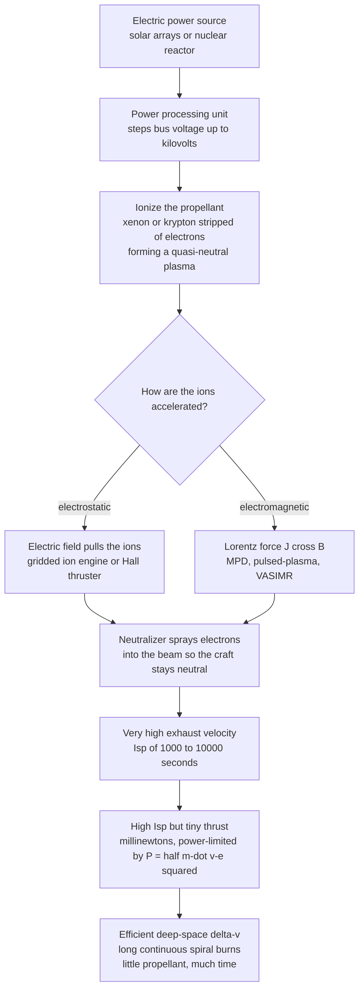

# 🛰️ Electric and Advanced Propulsion

> [!abstract] TL;DR
> **Electric propulsion** abandons the chemical rocket's brute-force bargain — burn propellant fast for a few violent minutes — in favor of a patient one: use **electrical power** (solar arrays or a nuclear reactor) to accelerate a stream of ions to enormous exhaust velocities, achieving **specific impulse** $I_{sp}$ of **1,000–10,000+ s** versus a chemical rocket's ~300–450 s. Because $I_{sp}$ measures propellant efficiency, this 10–30× jump *slashes* the propellant needed for a given $\Delta v$ (Tsiolkovsky: $\Delta v = I_{sp}\,g_0 \ln(m_0/m_f)$). The catch is the **power-limited regime**: jet power is $P = \tfrac12 \dot m v_e^2$, fixed by the power supply, so a high exhaust velocity $v_e$ forces a *tiny* mass flow and therefore **millinewton-scale thrust** — the weight of a coin. That makes electric thrusters useless for launch but ideal for the vacuum of deep space, where months of continuous, frugal thrust win a **spiral trajectory** to speeds no chemical stage can match. The workhorses are **electrostatic** thrusters — **gridded ion engines** and **Hall-effect thrusters** running on xenon or krypton — flanked by **electrothermal** (resistojet, arcjet) and higher-thrust **electromagnetic** devices (MPD, pulsed-plasma, VASIMR). Beyond electric propulsion lie the **advanced concepts** that define spaceflight's long-term reach: **nuclear thermal** (high thrust *and* good $I_{sp}$), **nuclear electric**, propellant-free **solar sails** (photon pressure), tethers, and the speculative frontier of **fusion, antimatter, and beamed/laser propulsion** (Breakthrough Starshot). Electric propulsion already flies on nearly every modern GEO comsat, on Starlink, and on deep-space probes like **Dawn** and **BepiColombo** — it is quietly rewriting how satellites and interplanetary missions are designed.

---

## Intuition

**Analogy:** A chemical rocket is a **sprinter** — it unleashes enormous thrust for a few violent minutes and then it is out of gas, coasting on whatever speed those minutes bought. An electric thruster is a **marathon walker**: it produces only a *whisper* of thrust — literally the weight of a coin resting on your palm — but it sustains that whisper for **months or even years**, sipping propellant so frugally that it ultimately accelerates to far higher speeds than the sprinter ever could. Instead of *burning* propellant to make heat, it **electrically flings** a stream of ions out the back at blistering exhaust velocities, powered by sunlight caught on solar panels. You could never lift off a launchpad with the weight of a coin. But in the patient, frictionless vacuum of deep space, there is nothing to slow the walker down, and the tortoise beats the hare.

The whole discipline lives inside that trade. A chemical rocket dumps its energy in a hurry because the energy is *stored in the propellant itself* (the chemical bonds), so it is limited by how much propellant it can carry. An electric thruster gets its energy from an *external* source — the Sun or a reactor — so the propellant no longer has to be the fuel; it only has to be *reaction mass* to fling. Freed from carrying its own energy, it can afford to throw that mass much, much faster, and that speed is the whole point: the faster you throw, the less you need to throw.

---

## How It Works

### Core Mechanics

1. **The two currencies: specific impulse and thrust.** Every rocket is judged on two numbers. **Thrust** $F = \dot m\, v_e$ is *how hard it pushes* (force). **Specific impulse** $I_{sp} = v_e / g_0$ is *how efficiently it uses propellant* — the exhaust velocity in disguise, measured in seconds. Chemical combustion caps exhaust velocity at roughly 4.5 km/s ($I_{sp}\approx 450$ s) because that is about how fast hot gas can expand through a nozzle. Electric propulsion breaks that ceiling by accelerating *ions* in fields rather than *gas* through a nozzle, reaching $v_e$ of 20–60+ km/s ($I_{sp}$ of 2,000–6,000+ s).

2. **Why high $I_{sp}$ slashes propellant.** The **Tsiolkovsky rocket equation** $\Delta v = v_e \ln(m_0/m_f) = I_{sp}\, g_0 \ln(m_0/m_f)$ says the achievable velocity change grows with exhaust velocity. Inverting it, the propellant mass fraction needed for a mission is $m_p/m_0 = 1 - e^{-\Delta v/(I_{sp} g_0)}$. Because $I_{sp}$ sits in the denominator of the exponent, multiplying it by ten *collapses* the propellant required — the single most valuable lever in mission design. A deep-space $\Delta v$ that would demand a rocket 90% propellant by mass might demand an electric spacecraft only 20–30% propellant.

3. **The power-limited catch — why thrust is tiny.** Flinging ions fast costs energy: the **jet (kinetic) power** in the exhaust is $P = \tfrac12 \dot m\, v_e^2$. The power supply — solar arrays or a reactor — fixes $P$. Rearranging, the thrust for a given power is $F = \dot m\, v_e = 2P/v_e = 2\eta P/(I_{sp} g_0)$ (with efficiency $\eta$). **Thrust falls as exhaust velocity rises.** A few kilowatts of solar power buys only tens-to-hundreds of *millinewtons* — grams-force. This is the defining tension of the field: you can have high efficiency *or* high thrust from a fixed power budget, never both. Chemical rockets escape this trap because their power comes free from combustion, not from a limited electrical supply.

4. **The consequence: slow spirals, not sudden burns.** With millinewton thrust, an electric spacecraft cannot make a Hohmann-style impulsive "kick." Instead it thrusts *continuously* for weeks or months, its orbit slowly widening in a many-revolution **spiral**. This **trades trip time for propellant**: a low-thrust LEO-to-GEO transfer needs a slightly *larger* $\Delta v$ than an impulsive one (because thrust is spread over the whole orbit rather than applied at the optimal points), yet it uses **far less propellant** because $I_{sp}$ is 10× higher. The price is patience — months instead of hours.

5. **The thruster families — how the ions get their speed.** Three physical mechanisms:
   - **Electrothermal** (resistojet, arcjet): electrically *heat* the propellant — with a hot wire or an electric arc — then expand it through a conventional nozzle. Simplest, modest $I_{sp}$ (300–1,000 s), a small boost over chemical.
   - **Electrostatic** (gridded **ion engines** and **Hall-effect thrusters**): ionize the propellant, then pull the positive ions through an **electric field**, accelerating them to high speed; a **neutralizer** cathode sprays electrons back into the beam so the spacecraft does not charge up. These are the **workhorses**, running on **xenon** (dense, easily ionized, inert) or increasingly **krypton** (cheaper). $I_{sp}$ of 1,500–4,000 s.
   - **Electromagnetic** (magnetoplasmadynamic **MPD**, **pulsed-plasma**, **VASIMR**): drive a current through a plasma and let the **Lorentz force** $\mathbf{J}\times\mathbf{B}$ accelerate the whole plasma bulk. Higher thrust density, but hungry for power.

6. **A gridded ion engine vs a Hall thruster.** A **gridded ion engine** ionizes gas in a chamber, then extracts ions through a pair of charged grids that act like an electrostatic lens — very high $I_{sp}$, but the grids limit current (space-charge) and erode. A **Hall thruster** dispenses with grids: it traps electrons on circular $\mathbf{E}\times\mathbf{B}$ drift paths (a "Hall current") in an annular channel, and those trapped electrons both ionize incoming gas *and* set up the accelerating field — giving higher thrust density at slightly lower $I_{sp}$. Both are **quasi-neutral plasma devices**, which is why electric propulsion is really applied plasma physics.

7. **What dominates the design.** Because thrust is tiny and power is precious, the hard engineering is **power and thermal management** (big solar arrays, radiators to dump waste heat) and **lifetime**: ion grids and Hall channel walls slowly **erode** under ion bombardment, and cathodes wear out. Missions run thousands of hours, so erosion and cathode life — not thrust — set the limits.

8. **Beyond electric: the advanced-propulsion ladder.** When even electric propulsion is not enough, the frontier concepts diverge by energy source and physics:
   - **Nuclear thermal propulsion (NTP):** a fission reactor heats hydrogen to extreme temperature and expels it through a nozzle — *both* high thrust (like chemical) *and* good $I_{sp}$ (~900 s, double chemical). A leading candidate for fast crewed Mars transits.
   - **Nuclear electric propulsion (NEP):** a reactor generates electricity to run high-power electric thrusters — sunlight-independent, ideal for the dim outer solar system.
   - **Solar sails:** no propellant at all. Sunlight's **radiation pressure** (photons carry momentum) pushes on a vast, gossamer-thin reflective sheet — infinitesimal force, but truly limitless endurance.
   - **Tethers, and the speculative edge:** electrodynamic tethers, **fusion** rockets, **antimatter**, and **beamed/laser** propulsion (as in *Breakthrough Starshot*, which would push gram-scale sails to a fraction of light-speed with a ground laser array) — the ideas that define whether interstellar travel is ever more than a dream.

### Flow / Architecture



---

## Key Concepts

### Secondary Level

- **Efficiency versus power.** A chemical rocket is a sprinter: huge push, over in minutes, out of gas. An electric thruster is a marathon walker: a whisper of push, but sustained for months, sipping propellant. Given enough patient time and no air to slow it, the walker reaches higher speed.
- **It throws ions, not fire.** Instead of burning fuel, an electric thruster uses electricity (from solar panels) to hurl electrically charged atoms — **ions** — out the back extremely fast. The faster you throw the exhaust, the less of it you need to carry.
- **Tiny thrust, enormous stamina.** The push is only about the weight of a coin, so you could never lift off a launchpad with it. But in space, where nothing slows you down, that tiny push adds up over months into a huge speed change.
- **Why it matters.** Because it needs so little propellant, electric propulsion lets satellites and space probes carry more useful payload and reach places chemical rockets cannot afford to. It already flies on most communications satellites and on missions like NASA's Dawn probe.

### Undergraduate Level

- **Specific impulse.** $I_{sp} = v_e/g_0$ is exhaust velocity expressed in seconds; it measures propellant efficiency. Chemical: ~300–450 s. Electric: 1,000–10,000+ s. Higher $I_{sp}$ means less propellant per unit $\Delta v$.
- **The rocket equation, inverted.** $\Delta v = I_{sp}\, g_0 \ln(m_0/m_f)$, so propellant mass fraction $m_p/m_0 = 1 - e^{-\Delta v/(I_{sp} g_0)}$. Raising $I_{sp}$ tenfold dramatically cuts the propellant fraction for the same mission.
- **The power-limited thrust law.** Jet power $P = \tfrac12 \dot m\, v_e^2$ is fixed by the supply, so thrust $F = 2\eta P/(I_{sp} g_0)$ — **thrust and $I_{sp}$ are inversely related at fixed power**. This is *the* fundamental trade of electric propulsion.
- **Thruster taxonomy.** *Electrothermal* (resistojet, arcjet — heat then expand); *electrostatic* (gridded ion, Hall — accelerate ions in an $E$-field, the workhorses); *electromagnetic* (MPD, PPT, VASIMR — $\mathbf{J}\times\mathbf{B}$ Lorentz acceleration).
- **Propellants.** Xenon (high atomic mass, low ionization energy, inert, storable) is the classic choice; krypton is cheaper (used by Starlink), and iodine and other options are emerging.
- **Low-thrust trajectories.** Continuous thrust produces a spiral, not an impulsive burn. Coplanar circle-to-circle spiral $\Delta v \approx |v_1 - v_2|$ (difference of circular speeds) — larger than an impulsive Hohmann $\Delta v$, but flown at 10× the $I_{sp}$, so far cheaper in propellant, at the cost of much longer trip time.

### Graduate Level

- **Space-charge limits and the Child–Langmuir law.** In a gridded ion engine, the extractable ion current density is space-charge-limited, $J \propto V^{3/2}/d^2$ — this caps thrust density and drives grid gap and voltage design.
- **Hall thruster physics.** Electrons are magnetized ($\rho_e \ll L \ll \rho_i$) and trapped in an azimuthal $\mathbf{E}\times\mathbf{B}$ drift; the axial electric field they sustain accelerates unmagnetized ions. Performance is limited by anomalous cross-field electron transport, plasma-wall interactions, and channel-wall erosion.
- **Efficiency accounting.** Total efficiency $\eta_T$ folds in mass utilization (fraction of propellant ionized), current utilization (beam vs total current), and voltage/divergence losses; realistic Hall/ion efficiencies are ~50–70%.
- **Optimal $I_{sp}$ for power-limited missions.** For a fixed power and trip time, there is an *optimal* $I_{sp}$: too low wastes propellant, too high wastes power on too little thrust and demands a heavier power plant. This couples propulsion to power-system and structural mass through the specific mass $\alpha$ (kg/kW) of the power source.
- **Nuclear thermal $I_{sp}$ ceiling.** NTP $I_{sp} \propto \sqrt{T_c/M}$ favors low molecular weight (hydrogen) and high chamber temperature $T_c$, bounded by reactor material limits (~2,500–3,000 K), giving ~900 s — roughly double chemical, with chemical-class thrust.
- **Solar-sail dynamics.** Radiation-pressure acceleration $a \propto (1+r)\,\Phi/(c\,\sigma)$ scales inversely with areal density $\sigma$; sail attitude sets the thrust direction, enabling non-Keplerian orbits and "logarithmic spiral" cranking without any propellant.

---

## Python Demo

```python
# ELECTRIC vs CHEMICAL PROPULSION: the two faces of the trade, in one figure.
#
#   Panel A -> HIGH-Isp PAYOFF: propellant mass fraction needed for a given
#              delta-v, versus specific impulse (inverted rocket equation).
#              Electric propulsion's 10x-higher Isp collapses the propellant.
#   Panel B -> THE POWER-LIMITED CATCH: for a FIXED jet power, thrust vs Isp.
#              P = 0.5 * m_dot * v_e^2  =>  F = 2*eta*P / (Isp*g0). Higher Isp
#              means a tinier thrust -- the fundamental power-limited tradeoff.
#   Panel C -> LOW-THRUST TRAJECTORY: a slow many-revolution SPIRAL-OUT
#              (continuous thrust) vs an impulsive two-burn Hohmann transfer.
#   Panel D -> TRADE-OFF LEDGER for a sample LEO->GEO mission: electric slashes
#              propellant mass but pays in trip time (months vs hours).
#
# Requires: numpy, matplotlib
import numpy as np
import matplotlib.pyplot as plt

g0 = 9.80665  # standard gravity [m/s^2]

# ------------------------------------------------------------
# (A) Propellant mass fraction vs Isp:  m_p/m_0 = 1 - exp(-dv/(Isp*g0))
# ------------------------------------------------------------
Isp = np.linspace(200, 6000, 600)                 # specific impulse [s]

# ------------------------------------------------------------
# (B) Power-limited thrust:  F = 2 * eta * P / (Isp * g0)
# ------------------------------------------------------------
P_jet = 5000.0     # available electric/jet power [W] (~5 kW solar array)
eta   = 0.60       # thruster efficiency
F_of_Isp = 2.0 * eta * P_jet / (Isp * g0)          # thrust [N]

# ------------------------------------------------------------
# (C) Low-thrust spiral vs impulsive Hohmann (normalized units, mu = 1)
# ------------------------------------------------------------
r1, r2 = 1.0, 6.6                                  # LEO -> ~GEO radius ratio
turns  = 5.5
th_sp  = np.linspace(0.0, turns * 2 * np.pi, 4000)
r_sp   = r1 + (r2 - r1) * (th_sp / th_sp[-1])      # radius grows slowly
x_sp, y_sp = r_sp * np.cos(th_sp), r_sp * np.sin(th_sp)
# Hohmann transfer ellipse (focus at origin): perigee r1, apogee r2
a_t = 0.5 * (r1 + r2)
e_t = (r2 - r1) / (r2 + r1)
p_t = a_t * (1 - e_t**2)
nu  = np.linspace(0.0, np.pi, 400)
r_t = p_t / (1.0 + e_t * np.cos(nu))
x_t, y_t = r_t * np.cos(nu), r_t * np.sin(nu)
phi = np.linspace(0, 2 * np.pi, 400)

# ------------------------------------------------------------
# (D) Sample LEO->GEO ledger:  m_p = m_dry * (exp(dv/(Isp*g0)) - 1)
# ------------------------------------------------------------
m_dry = 2000.0     # delivered dry spacecraft mass [kg]
def prop_mass(dv, isp):
    return m_dry * (np.exp(dv / (isp * g0)) - 1.0)

dv_chem, isp_chem = 3900.0, 320.0      # impulsive two-burn Hohmann, bipropellant
dv_ep,   isp_ep   = 5900.0, 1800.0     # low-thrust spiral, Hall thruster
mp_chem, mp_ep = prop_mass(dv_chem, isp_chem), prop_mass(dv_ep, isp_ep)

# trip times: chemical ~ hours; electric ~ propellant / mass-flow at F ~ 0.25 N
F_ep   = 0.25                                       # N (a ~5 kW Hall thruster)
mdot   = F_ep / (isp_ep * g0)                       # kg/s
t_chem_days = 0.25                                  # a Hohmann transfer ~ 6 hours
t_ep_days   = (mp_ep / mdot) / 86400.0              # continuous-thrust duration

print(f"Chemical : Isp={isp_chem:4.0f}s  dv={dv_chem:.0f} m/s  "
      f"propellant={mp_chem:6.0f} kg  trip~{t_chem_days*24:.0f} h")
print(f"Electric : Isp={isp_ep:4.0f}s  dv={dv_ep:.0f} m/s  "
      f"propellant={mp_ep:6.0f} kg  trip~{t_ep_days:.0f} days")
print(f"Propellant saved by electric: {mp_chem - mp_ep:.0f} kg "
      f"({100*(1-mp_ep/mp_chem):.0f}% less)")

# ------------------------------ plotting ------------------------------
fig, ax = plt.subplots(2, 2, figsize=(13, 10))
fig.suptitle("Electric vs Chemical Propulsion: efficiency bought with time",
             fontsize=15, fontweight="bold")

# A: propellant fraction vs Isp
axA = ax[0, 0]
for dv, col, lab in [(4000, "#1f77b4", "delta-v = 4 km/s"),
                     (7000, "#ff7f0e", "delta-v = 7 km/s"),
                     (12000, "#d62728", "delta-v = 12 km/s")]:
    axA.plot(Isp, 100 * (1 - np.exp(-dv / (Isp * g0))), color=col, lw=2.4, label=lab)
axA.axvspan(200, 450, color="#d62728", alpha=0.10)
axA.axvspan(1500, 6000, color="#2ca02c", alpha=0.10)
axA.text(320, 8, "chemical", ha="center", fontsize=9, color="#a11", rotation=90)
axA.text(3200, 8, "electric", ha="center", fontsize=9, color="#161", rotation=90)
axA.set_xlabel("specific impulse  Isp  [s]")
axA.set_ylabel("propellant mass fraction  [% of launch mass]")
axA.set_title("A. High Isp collapses the propellant needed\n(inverted rocket equation)")
axA.legend(fontsize=9)
axA.grid(alpha=0.3)

# B: power-limited thrust vs Isp (log-log)
axB = ax[0, 1]
axB.loglog(Isp, F_of_Isp * 1000, color="#9467bd", lw=2.6)
axB.axvspan(1500, 4000, color="#2ca02c", alpha=0.10)
axB.text(2400, F_of_Isp[np.argmin(abs(Isp - 2400))] * 1000 * 1.4,
         "ion / Hall\nregime", ha="center", fontsize=9, color="#161")
axB.set_xlabel("specific impulse  Isp  [s]  (log)")
axB.set_ylabel("thrust at fixed 5 kW  [mN]  (log)")
axB.set_title("B. Power-limited catch: at fixed power,\nmore Isp means LESS thrust  (F = 2 eta P / Isp g0)")
axB.grid(alpha=0.3, which="both")

# C: spiral vs impulsive transfer
axC = ax[1, 0]
axC.plot(r1 * np.cos(phi), r1 * np.sin(phi), "k--", lw=1.2, label="start orbit (LEO)")
axC.plot(r2 * np.cos(phi), r2 * np.sin(phi), "k:", lw=1.2, label="target orbit (GEO)")
axC.plot(x_sp, y_sp, color="#2ca02c", lw=1.8, label="electric: slow spiral (months)")
axC.plot(x_t, y_t, color="#d62728", lw=2.4, label="chemical: Hohmann (hours)")
axC.plot(0, 0, "o", color="#1f77b4", ms=10)
axC.text(0.15, 0.15, "Earth", fontsize=9, color="#1f77b4")
axC.set_aspect("equal")
axC.set_xlim(-7.2, 7.2); axC.set_ylim(-7.2, 7.2)
axC.set_xlabel("x  [Earth radii, normalized]")
axC.set_ylabel("y")
axC.set_title("C. Low-thrust SPIRAL vs impulsive burn\n(trade trip time for propellant)")
axC.legend(fontsize=8, loc="upper right")
axC.grid(alpha=0.3)

# D: mission ledger -- propellant (bars) and trip time (annotated)
axD = ax[1, 1]
labels = ["Chemical\n(Isp 320 s)", "Electric\n(Isp 1800 s)"]
props  = [mp_chem, mp_ep]
bars = axD.bar(labels, props, color=["#d62728", "#2ca02c"], width=0.55)
axD.set_ylabel("propellant mass  [kg]  (2000 kg payload)")
axD.set_title("D. Sample LEO->GEO ledger:\nelectric saves propellant, spends time")
for b, p, t in zip(bars, props, [f"{t_chem_days*24:.0f} hours", f"{t_ep_days:.0f} days"]):
    axD.text(b.get_x() + b.get_width()/2, p + 90, f"{p:.0f} kg",
             ha="center", fontweight="bold")
    axD.text(b.get_x() + b.get_width()/2, p/2, f"trip:\n{t}",
             ha="center", color="white", fontweight="bold", fontsize=9)
axD.set_ylim(0, max(props) * 1.2)
axD.grid(alpha=0.3, axis="y")

plt.tight_layout(rect=[0, 0, 1, 0.95])
plt.show()
```

Running this prints the mission ledger and draws four panels that together *are* the electric-propulsion bargain. Panel **A** shows the payoff: pushing $I_{sp}$ from the chemical band (~300 s) into the electric band (2,000–4,000 s) drops the propellant mass fraction for a hard deep-space $\Delta v$ from most of the vehicle to a modest slice. Panel **B** shows the price, on a log-log axis: at a fixed 5 kW, thrust falls as $1/I_{sp}$, landing the ion/Hall regime at merely tens of millinewtons — grams-force. Panel **C** contrasts a chemical **Hohmann** transfer (a single graceful half-ellipse, done in hours) with the electric **spiral** (many patient revolutions widening to GEO over months). Panel **D** is the ledger: for a 2-tonne payload to GEO, the electric option cuts propellant by roughly 80% but stretches the trip from hours to months — efficiency bought with time, exactly the marathon-walker's bargain.

---

## Real-World Applications

> **Example — Dawn's ion drive doing what no chemical stage could.** NASA's **Dawn** probe (2007–2018) is the purest demonstration of the field. Powered by solar arrays feeding three **NSTAR gridded ion engines** on xenon, each thruster produced only ~90 mN — the weight of a couple of sheets of paper — yet Dawn thrust nearly continuously for years, accumulating a record ~11 km/s of $\Delta v$. That is *more* $\Delta v$ than its launch vehicle gave it, and it let a single spacecraft do the impossible: **orbit two different bodies** — the giant asteroid Vesta, then the dwarf planet Ceres. No chemical mission could carry enough propellant for such a maneuver; only high-$I_{sp}$ electric propulsion made it affordable.

- **Geostationary comsats — station-keeping and orbit-raising.** Nearly every modern GEO communications satellite carries **Hall or ion thrusters** for **north-south station-keeping** (fighting the Sun and Moon's pull), which dominates a satellite's propellant budget over 15 years. "All-electric" satellite buses (e.g., Boeing 702SP) go further and use electric propulsion to *raise* themselves from the drop-off orbit to GEO — trading months of spiral for a much lighter, cheaper launch. The propellant mass saved translates directly into more transponders or a smaller rocket.
- **Starlink and mega-constellations.** SpaceX's Starlink satellites fly **krypton** (and later **argon**) **Hall thrusters** for orbit-raising, station-keeping, collision avoidance, and controlled deorbit — electric propulsion at industrial scale, chosen partly because krypton is far cheaper than xenon.
- **Deep-space science.** **BepiColombo** (ESA/JAXA, en route to Mercury) uses four gridded ion engines and a series of gravity assists to shed the enormous energy needed to fall inward to Mercury; the Japanese **Hayabusa** asteroid sample-return missions were enabled by ion propulsion.
- **Nuclear thermal on the drawing board.** NASA and DARPA's **DRACO** program is building a **nuclear-thermal** demonstrator, targeting the ~900 s $I_{sp}$ with chemical-class thrust that could roughly halve crewed Mars transit times — the leading "high thrust *and* good efficiency" candidate.
- **Solar sails, proven and dreamed.** Japan's **IKAROS** (2010) became the first spacecraft propelled by a solar sail in interplanetary space, and The Planetary Society's **LightSail 2** demonstrated sail-based orbit control around Earth — the propellant-free extreme, and the physical basis for laser-pushed interstellar concepts like **Breakthrough Starshot**.

---

## Common Pitfalls

- **Confusing high $I_{sp}$ with high thrust.** They are *opposed* at fixed power ($F = 2\eta P/(I_{sp}g_0)$). Newcomers assume an "efficient" engine is also powerful; in electric propulsion the most efficient thruster is the *weakest*. The right question is never "how much thrust?" alone but "how much thrust *for the available power*, and for how long?"
- **Trying to launch with it.** Millinewton thrust cannot overcome Earth's gravity or atmospheric drag; electric propulsion only works *in space*, after a chemical rocket has done the launch. Treating it as a launch technology is a category error — it is an **in-space** propulsion technology.
- **Sizing the mission on $\Delta v$ alone and ignoring trip time.** A low-thrust transfer can take *months*, during which the spacecraft crawls through the radiation-heavy Van Allen belts (degrading solar arrays) and the mission clock runs. Propellant is saved, but schedule, power degradation, and operations cost are spent. The trade is always $\Delta v$ *and* time.
- **Forgetting the power and thermal plant.** The thruster is the easy part; the **solar arrays, radiators, and power-processing unit** dominate mass and cost. A higher-$I_{sp}$ design needing more power can end up *heavier* overall once the bigger power plant is counted — which is why an *optimal* $I_{sp}$ exists rather than "more is always better."
- **Ignoring erosion and cathode life.** Thrust may be steady, but ion grids and Hall channel walls slowly erode, and hollow cathodes wear out. A thruster that runs for thousands of hours is limited by **lifetime**, not performance; qualifying that lifetime on the ground is a major program cost.
- **Overhyping the speculative tier.** Fusion, antimatter, and beamed propulsion are physically fascinating but face enormous engineering and energy gaps. Presenting Breakthrough Starshot or an antimatter drive as near-term conflates *in-principle* physics with *buildable* hardware — the honest line separates flight-proven electric propulsion from the interstellar dream.

---

## Related Concepts

**Orbital mechanics and mission design**
- [[Orbital_Mechanics_and_Celestial_Dynamics]] — the two-body orbits, Hohmann transfers, and continuous-thrust spirals that low-thrust electric propulsion must fly; the framework in which $\Delta v$ and trip time are traded.

**Plasma physics — because electric thrusters are plasma devices**
- [[Low_Temperature_and_Industrial_Plasmas]] — ion and Hall thrusters are exactly low-temperature, partially-ionized plasma sources; the same discharge physics powers plasma etching and this note's beams.
- [[Single_Particle_Motion_and_Drifts]] — the $\mathbf{E}\times\mathbf{B}$ drift that traps and magnetizes electrons in a Hall thruster's annular channel, forming the "Hall current" that ionizes and accelerates.
- [[Nuclear_Fusion_and_the_Lawson_Criterion]] — the confinement and reaction physics behind the speculative fusion-rocket tier of advanced propulsion.

**Physical and electrical foundations**
- [[Electric_Fields_and_Coulombs_Law]] — the electrostatic field that accelerates ions in gridded and Hall thrusters; the "electric" in electric propulsion.
- [[Power_Electronics_and_Converters]] — the power-processing unit that steps a spacecraft's low-voltage bus up to the kilovolts a thruster needs, and the switching converters that regulate discharge current.
- [[Renewable_Energy_Integration]] — the photovoltaic solar arrays that supply the electrical power; the same solar-generation physics that feeds terrestrial grids feeds the thruster.
- [[Nuclear_Reactions_Fission_Fusion]] — the fission reactors behind nuclear-thermal and nuclear-electric propulsion, the sunlight-independent power source for the outer solar system.

Sibling Aerospace_Engineering propulsion notes referenced in prose: *Rocket_Propulsion_Fundamentals* (the rocket equation and $I_{sp}$ this note builds on), *Liquid_and_Solid_Rocket_Engines* (the chemical "sprinter" contrast), *Interplanetary_Trajectories_and_Gravity_Assists* (the deep-space missions electric propulsion enables), and *The_Reach_and_Future_of_Aerospace_Engineering* (where the advanced-propulsion tier points).

---

## Review Questions

**Secondary**
1. A chemical rocket and an electric ion thruster both start in orbit with the same amount of propellant. Explain, using the sprinter-versus-marathon-walker idea, how the electric thruster can end up traveling *faster* even though at every moment it pushes far more gently. Why would the electric thruster be useless for lifting off the launchpad?

**Undergraduate**
2. An electric thruster has a fixed 5 kW of power available. Using $P = \tfrac12 \dot m v_e^2$ and $F = \dot m v_e$, show why raising the exhaust velocity (and thus $I_{sp}$) *lowers* the thrust. Then use the rocket equation to explain why, despite that tiny thrust, the high $I_{sp}$ still makes the mission need far less propellant than a chemical rocket. What is being traded away to gain that efficiency?

**Graduate**
3. You are designing an all-electric GEO communications satellite and must choose an operating $I_{sp}$. Explain why "higher $I_{sp}$ is always better" is *wrong* here: identify at least three competing factors — propellant mass, power-plant (solar array plus PPU) mass and its specific mass $\alpha$, thruster lifetime/erosion, and orbit-raising trip time through the Van Allen belts — and describe qualitatively how they combine to produce an *optimal* $I_{sp}$ rather than an unbounded one. How would switching the power source from solar to a nuclear reactor shift that optimum?

---

## Sources

- Goebel, D. M., and Katz, I. *Fundamentals of Electric Propulsion: Ion and Hall Thrusters*. JPL Space Science and Technology Series, Wiley (2008).
- Jahn, R. G. *Physics of Electric Propulsion*. Dover (reprint, 2006).
- Sutton, G. P., and Biblarz, O. *Rocket Propulsion Elements*, 9th ed. Wiley (2016) — chapters on electric and advanced propulsion.
- Turner, M. J. L. *Rocket and Spacecraft Propulsion: Principles, Practice and New Developments*, 3rd ed. Springer-Praxis (2009).
- NASA Glenn Research Center — *In-Space Propulsion* and NSTAR/NEXT ion-engine technical reports.

---

#aerospace-engineering #propulsion #electric-propulsion #ion-thruster #specific-impulse
