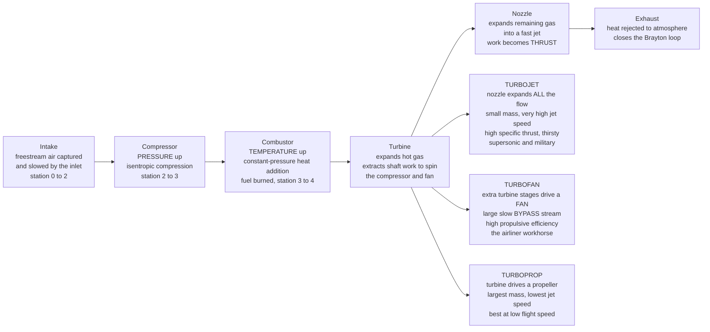

# ✈️ Gas Turbine Engine Cycles: The Brayton Cycle and the Turbojet-Turbofan Family

> [!abstract] TL;DR
> Every jet engine, deep down, runs the same four-beat thermodynamic dance called the **Brayton cycle**: **compress** air (pressure up), **heat** it in the combustor (temperature up), **expand** it through a turbine and nozzle (extracting work and producing thrust), then **exhaust** it. The ideal thermal efficiency depends only on the **pressure ratio**, $\eta_{th} = 1 - (PR)^{-(\gamma-1)/\gamma}$ — which is why a century of engine development has chased ever-higher compressor pressure ratios, while the **turbine-inlet temperature** (limited by blade materials and cooling) caps the specific work you can wring out of each lap. The genius is *what you do with the expansion*: a **turbojet** throws all the hot gas out the back as a fast jet (high specific thrust, poor fuel economy — the supersonic and military choice); a **turbofan** spends some turbine work spinning a huge **fan** that gently accelerates a large **bypass** stream (trading specific thrust for far better propulsive efficiency and lower noise — the airliner workhorse); a **turboprop** hands nearly all the work to a propeller (best at low speed). Same cycle, different bargain between raw speed and efficiency, tuned by two knobs — **pressure ratio** and **bypass ratio**.

## Intuition

**Analogy:** Picture choosing how to push a boat. You could fit a tiny, screaming water-jet that blasts a thin stream of water backward at enormous speed — that is a **speedboat**, and it is a **turbojet**: it accelerates a *small* mass of air to a *very high* velocity. Or you could fit a big, slow propeller that gently shoves a huge slug of water backward at modest speed — that is a **barge**, and it is a **turbofan/turboprop**: it accelerates a *large* mass of air to a *modestly higher* velocity. Both produce thrust (thrust is mass flow times velocity change), but the second is far more *fuel-efficient*, because the energy you waste is proportional to the *excess* kinetic energy dumped into the jet, and a big-slow jet wastes much less than a small-fast one. That single trade-off — "small fast jet" versus "big slow jet" — is the whole personality of an engine, set by its **bypass ratio**.

Underneath both sits the identical **Brayton cycle**: squeeze air, burn fuel in it, let the hot high-pressure gas expand back out, and skim off the difference as useful work. A turbojet turns that work directly into a fast exhaust; a turbofan diverts most of the work sideways into the fan and its gentle bypass river. Understanding gas turbines is understanding this one cycle, and the two dials — **pressure ratio** (how hard you squeeze) and **bypass ratio** (how you spend the expansion) — that shape it into everything from a fighter's afterburning turbojet to an airliner's whisper-quiet high-bypass fan.

---

## How It Works

### Core Mechanics

1. **The four strokes of the Brayton cycle.** On a working fluid (air), the ideal cycle is: **(1) isentropic compression** — the compressor raises pressure with no heat exchange, so temperature climbs too; **(2) constant-pressure heat addition** — fuel burns in the combustor, dumping heat at (nearly) constant pressure and driving temperature to its peak; **(3) isentropic expansion** — the hot, high-pressure gas expands through the turbine (which extracts shaft work to drive the compressor and fan) and then the nozzle (which converts the rest into a fast jet); **(4) constant-pressure heat rejection** — the exhaust mixes with the atmosphere and cools back to ambient, closing the loop. In an aircraft engine the loop is **open** (fresh air in, exhaust out), but thermodynamically it is the closed Brayton loop.

2. **Efficiency lives in the pressure ratio.** For the ideal (cold-air-standard) cycle, the thermal efficiency is astonishingly simple: $\eta_{th} = 1 - \dfrac{1}{(PR)^{(\gamma-1)/\gamma}} = 1 - \dfrac{T_1}{T_2}$, where $PR = P_2/P_1$ is the **compressor pressure ratio** and $\gamma \approx 1.4$ for air. Efficiency depends *only* on how hard you squeeze — not on the peak temperature. This is the engine of history: overall pressure ratios have climbed from ~4 in early turbojets to ~40-60 in modern turbofans, and each step up the pressure-ratio ladder is a step down in fuel burn.

3. **Temperature sets the size of the prize.** Efficiency depends on pressure ratio, but *how much work per kilogram of air* — the **specific work** — depends critically on the **turbine-inlet temperature** $T_3$ (often written $T_{t4}$). Hotter combustion means more energy released and more work extracted per lap. The catch: $T_3$ is capped by what the first-row turbine blades can survive — a materials-and-cooling battle fought with nickel **superalloys**, single-crystal castings, internal film cooling, and ceramic thermal-barrier coatings, pushing gas temperatures well above the metal's melting point. Modern turbine gases run ~1700-2000 K.

4. **There is a best pressure ratio for work.** Efficiency rises monotonically with $PR$, but **specific work does not**: for a *fixed* peak temperature $T_3$ and inlet $T_1$, net specific work is maximized when the compressor and turbine exit temperatures are equal, $T_2 = T_4 = \sqrt{T_1 T_3}$, giving an optimum $PR_{opt} = (T_3/T_1)^{\gamma/[2(\gamma-1)]}$. Push $PR$ higher than this and each lap is more *efficient* but does *less work* (you need a bigger, heavier engine for the same thrust). Real designs balance the two: high pressure ratio for cruise fuel economy, tempered by specific-work and weight limits.

5. **Real cycles are lossy.** The ideal cycle assumes isentropic compression and expansion. Reality adds **component efficiencies** (compressor and turbine isentropic efficiencies below 100%), **combustor pressure loss**, cooling-air bleed, and mechanical losses. These round off the sharp corners of the ideal cycle and shrink its enclosed work — which is why real thermal efficiencies land well below the ideal-cycle number for the same pressure ratio.

6. **Station-by-station analysis.** Engineers analyze the engine as a chain of components using **stagnation (total) properties** $T_t$, $P_t$ — the temperature and pressure the flow would reach if brought to rest — because these carry the flow's total energy and are conserved across adiabatic ducts. Numbered **stations** track the gas: **0** freestream, **2** compressor face (after the inlet), **3** compressor exit / combustor entry, **4** turbine inlet (peak temperature), **5** turbine exit, **9** nozzle exit. Each component is a jump in $T_t$ and $P_t$; thrust and fuel burn fall out of the station-to-station bookkeeping.

7. **Thrust and its efficiencies.** Thrust from a fully-expanded jet is $F = \dot m (V_e - V_0)$ — mass flow times the velocity the engine adds. **Specific thrust** $F/\dot m$ measures thrust per unit airflow (how compact the engine can be). **Thrust-specific fuel consumption (TSFC)** $= \dot m_{fuel}/F$ measures fuel burned per unit thrust (how economical it is). Two efficiencies multiply into the overall: **thermal efficiency** (how well the cycle turns fuel heat into jet kinetic energy) and **propulsive efficiency** $\eta_p = \dfrac{2V_0}{V_e + V_0}$ (how well that jet kinetic energy becomes useful thrust power). Overall efficiency $\eta_o = \eta_{th}\,\eta_p$. Propulsive efficiency is exactly why the "big slow jet" wins: the closer $V_e$ is to $V_0$, the less energy is wasted in the wake — the physical heart of the high-bypass turbofan.

### Flow / Architecture



---

## Key Concepts

### Secondary Level

- **A jet engine is a squeeze-burn-blow machine.** It sucks in air, squeezes it hard with a fan-like **compressor**, sprays in fuel and lights it so the air gets very hot, then lets the hot air rush out the back. The rush out the back is the **thrust** that pushes the plane forward.
- **Newton's third law makes thrust.** The engine throws air backward; the air throws the engine (and plane) forward. Thrust equals how much air you throw times how much faster you make it go.
- **Two ways to make the same thrust.** You can throw a *little* air *very fast* (a **turbojet** — like a screaming speedboat jet) or a *lot* of air *gently* (a **turbofan** — like a barge's big slow propeller). The gentle way burns much less fuel, which is why airliners use big fans.
- **Squeeze harder, waste less.** The harder the compressor squeezes the air before burning (its **pressure ratio**), the more useful work you get out of each puff of fuel. Better squeezing is why modern engines sip fuel compared to the roaring engines of the 1950s.
- **Heat is limited by the metal.** You want the fire as hot as possible for more power, but the spinning turbine blades right behind the flame can only take so much heat before they soften. Special metals and clever air-cooling let blades survive gas hotter than their own melting point.

### Undergraduate Level

- **Ideal Brayton efficiency.** For the air-standard cycle, $\eta_{th} = 1 - (PR)^{-(\gamma-1)/\gamma}$ — a function of **pressure ratio alone**. With $\gamma = 1.4$, the exponent is $\approx 0.286$; e.g. $PR = 30$ gives an *ideal* $\eta_{th} \approx 0.62$ (real engines much lower once losses are included).
- **The four ideal states.** With $r = (PR)^{(\gamma-1)/\gamma}$: **1** ambient $T_1$; **1→2** isentropic compression to $T_2 = T_1 r$; **2→3** constant-pressure heat addition to peak $T_3$ (turbine-inlet limit), $q_{in} = c_p(T_3 - T_2)$; **3→4** isentropic expansion to $T_4 = T_3/r$; **4→1** constant-pressure heat rejection, $q_{out} = c_p(T_4 - T_1)$. Net work $w_{net} = q_{in} - q_{out}$.
- **Specific-work optimum.** Holding $T_1$ and $T_3$ fixed, $w_{net}$ is maximized at $r_{opt} = \sqrt{T_3/T_1}$, i.e. $PR_{opt} = (T_3/T_1)^{\gamma/[2(\gamma-1)]}$, where $T_2 = T_4 = \sqrt{T_1 T_3}$. Below this you leave work on the table; above it you gain efficiency but lose specific work — the classic size-versus-economy tension.
- **Stagnation properties and station analysis.** Use total temperature $T_t = T(1 + \tfrac{\gamma-1}{2}M^2)$ and total pressure $P_t = P(1 + \tfrac{\gamma-1}{2}M^2)^{\gamma/(\gamma-1)}$ station-to-station (0, 2, 3, 4, 5, 9). The **overall pressure ratio (OPR)** $P_{t3}/P_{t2}$ is the design headline; modern turbofans reach OPR 40-60.
- **Performance metrics.** **Specific thrust** $F/\dot m_0 = (V_e - V_0) + \tfrac{A_e}{\dot m_0}(p_e - p_0)$ (the pressure term vanishes for a fully expanded nozzle); **TSFC** $= \dot m_f/F$; **propulsive efficiency** $\eta_p = 2V_0/(V_e + V_0)$; **overall efficiency** $\eta_o = \eta_{th}\eta_p = V_0/(\text{TSFC}\cdot h_{fuel})$.
- **Bypass ratio.** $B = \dot m_{bypass}/\dot m_{core}$. Turbojet $B = 0$; low-bypass military fans $B \approx 0.3$-1; high-bypass airliner fans $B \approx 5$-12. Raising $B$ spreads the core's power over more air, lowering jet velocity toward $V_0$, raising $\eta_p$ and cutting TSFC — at the cost of lower specific thrust (a bigger, draggier fan) and poor performance at high subsonic/supersonic speed.
- **Afterburning (reheat).** Injecting and burning extra fuel *between* turbine and nozzle re-heats the gas for a large thrust boost at brutal fuel cost — used for takeoff and combat acceleration in military low-bypass engines.

### Graduate Level

- **Real-cycle analysis with component efficiencies.** Replace isentropic jumps with $\eta_c = (T_{2s} - T_1)/(T_2 - T_1)$ for the compressor and $\eta_t = (T_3 - T_4)/(T_3 - T_{4s})$ for the turbine, plus combustor total-pressure ratio $\pi_b < 1$, inlet recovery $\pi_d$, and nozzle efficiency. There now exists an **optimum $T_3$ and $PR$** that maximize overall efficiency for given component quality — efficiency no longer rises without bound in $PR$, because compressor and turbine losses grow with the temperature rise they must handle.
- **Turbine cooling and the temperature ceiling.** First-stage blades see gas hotter than their melting point; survival comes from internal convective passages, film cooling, and thermal-barrier coatings, all fed by compressor bleed air that is itself a cycle penalty (bypassing the combustor and diluting turbine work). The design trade — raise $T_3$ for specific work versus spend more cooling air and endure **creep and thermal fatigue** — is a core turbomachinery optimization. Blade life is governed by **creep, low-cycle thermal fatigue, and oxidation** at temperature.
- **The propulsive-efficiency frontier.** $\eta_p = 2V_0/(V_e + V_0)$ drives everything: minimizing wasted wake kinetic energy $\tfrac{1}{2}\dot m (V_e - V_0)^2$ for a required thrust $\dot m (V_e - V_0)$ pushes toward **infinite mass flow at infinitesimal excess velocity** — the ideal-propulsor (actuator-disk) limit. High-bypass turbofans, geared turbofans (a reduction gearbox lets the fan turn slowly and large while the driving turbine spins fast and efficient), and open-rotor/propfan concepts are successive marches toward that frontier.
- **Ideal turbofan optimization.** For a fixed core (gas-generator power), there is an **optimum bypass ratio and fan pressure ratio** that maximize overall efficiency for a given flight Mach number; too much bypass makes the fan jet slower than the flight speed at low fan pressure ratio, and nacelle drag and weight eventually erase the gains. This is why airliner $B$ has crept up over decades (turbomachinery and materials permitting) but has not run away to infinity.
- **Combined-cycle and land/marine derivatives.** The same core, exhausting at 500-650 °C, is far too hot to waste on the ground: **combined-cycle power plants** bolt a Rankine steam bottoming cycle onto a Brayton gas turbine and reach ~60% efficiency (see [[Power_and_Refrigeration_Cycles]]). Aeroderivative turbines (GE LM2500 from the CF6) power warships; turboshafts power tanks (the M1 Abrams AGT1500) and helicopters. The Brayton cycle is a platform, not just an aircraft engine.
- **Installed vs uninstalled performance.** Inlet pressure recovery, nacelle and interference drag, bleed and power extraction for the airframe, and off-design operation (throttle hooks, altitude, Mach) separate the clean thermodynamic cycle from the thrust and fuel burn an aircraft actually sees. Cycle analysis sets the ceiling; installation and off-design behavior determine the delivered number.

---

## Python Demo

```python
# Gas turbine engine cycles, numpy + matplotlib only (no scipy).
#
#   (a) BRAYTON CYCLE on a temperature-entropy (T-s) diagram: isentropic
#       compression -> constant-pressure heat addition -> isentropic expansion
#       -> constant-pressure heat rejection. The shaded interior is net work.
#   (b) THERMAL EFFICIENCY and SPECIFIC WORK vs PRESSURE RATIO: efficiency
#       eta = 1 - 1/PR^((gamma-1)/gamma) rises forever with PR, but specific
#       work peaks at PR_opt = (T3/T1)^(gamma/(2*(gamma-1))) -- the classic
#       efficiency-vs-size tension.
#   (c) BYPASS TRADEOFF: an ideal "fully-mixed jet" turbofan model. For a fixed
#       gas-generator power spread over total mass flow (1+B), the jet velocity
#       falls toward flight speed as bypass ratio B grows -- SPECIFIC THRUST
#       drops but PROPULSIVE EFFICIENCY rises and TSFC falls: why high-bypass
#       turbofans win on fuel burn.
import numpy as np
import matplotlib.pyplot as plt

gamma = 1.4
cp    = 1004.5                       # J/kg-K, air
R     = cp * (gamma - 1) / gamma     # = 287 J/kg-K
k     = (gamma - 1) / gamma          # = 0.2857

# ============================================================
# (a)/(b) IDEAL BRAYTON CYCLE
# ============================================================
T1        = 288.0                    # K, ambient (compressor inlet)
T3        = 1600.0                   # K, turbine-inlet temperature (materials cap)
PR_design = 30.0                     # design compressor pressure ratio

def brayton(PR, T1, T3):
    r  = PR**k
    T2 = T1 * r                      # after isentropic compression
    T4 = T3 / r                      # after isentropic expansion
    eta   = 1.0 - 1.0/r              # = 1 - T1/T2
    w_net = cp*(T3 - T4) - cp*(T2 - T1)   # net specific work [J/kg]
    return T2, T4, eta, w_net

T2, T4, eta_d, w_d = brayton(PR_design, T1, T3)
PR_opt = (T3/T1)**(gamma/(2*(gamma-1)))     # PR that MAXIMIZES specific work

print("IDEAL BRAYTON CYCLE  (T1=288 K, T3=1600 K)")
print(f"  design PR = {PR_design:.0f}:  T2 = {T2:6.1f} K, T4 = {T4:6.1f} K")
print(f"  thermal efficiency  eta = {eta_d*100:5.1f} %   (ideal air-standard)")
print(f"  net specific work   w  = {w_d/1000:5.1f} kJ/kg")
print(f"  specific-work optimum PR_opt = {PR_opt:4.1f}  (where T2 = T4 = sqrt(T1*T3))\n")

# T-s coordinates: s = cp*ln(T/T1) - R*ln(P/P1), referenced so state 1 has s=0
s3 = cp*np.log(T3/T1) - R*np.log(PR_design)     # end of heat addition
T_23 = np.linspace(T2, T3, 60)                  # 2->3 const-pressure (P = PR*P1)
s_23 = cp*np.log(T_23/T1) - R*np.log(PR_design)
T_41 = np.linspace(T4, T1, 60)                  # 4->1 const-pressure (P = P1)
s_41 = cp*np.log(T_41/T1)
poly_s = np.concatenate([[0.0], s_23, s_41])    # closed loop (1->2 & 3->4 vertical)
poly_T = np.concatenate([[T1],  T_23, T_41])

# efficiency & specific work vs pressure ratio
PR = np.linspace(2, 50, 300)
eta_curve = 1.0 - PR**(-k)
w_curve   = cp*(T3 - T3/PR**k) - cp*(T1*PR**k - T1)

# ============================================================
# (c) IDEAL TURBOFAN: bypass-ratio tradeoff
# ============================================================
V0      = 250.0        # m/s, cruise flight speed (~Mach 0.8 at altitude)
P_core  = 3.0e5        # J/s per kg/s of core flow: gas-generator specific power
mf      = 0.017        # kg fuel per kg/s core flow (core burn ~ fixed)
B       = np.linspace(0.0, 12.0, 300)      # bypass ratio, 0 = turbojet
mdot    = 1.0 + B                          # total airflow per unit core flow
Vj      = np.sqrt(V0**2 + 2*P_core/mdot)   # common jet velocity (fully-mixed model)
F       = mdot * (Vj - V0)                 # total thrust per unit core flow [N]
Fs      = F / mdot                         # specific thrust = Vj - V0 [N per kg/s]
eta_p   = F * V0 / P_core                  # propulsive efficiency
TSFC    = (mf / F) * 1e6                    # g fuel per kN of thrust per s

print("IDEAL TURBOFAN BYPASS TRADEOFF  (V0=250 m/s)")
for b in (0.0, 5.0, 10.0):
    i = int(np.argmin(np.abs(B - b)))
    print(f"  B={b:4.1f}:  Vj={Vj[i]:5.0f} m/s  specific thrust={Fs[i]:5.0f}  "
          f"eta_prop={eta_p[i]*100:4.1f} %  TSFC={TSFC[i]:4.1f} g/kN/s")
print("  -> higher bypass: slower jet, lower specific thrust, higher eta_prop, lower TSFC")

# ============================================================
# PLOTS
# ============================================================
fig, ax = plt.subplots(2, 2, figsize=(14, 10))

# (a) Brayton T-s loop
ax[0,0].plot(poly_s, poly_T, "o-", color="crimson", lw=2.2, ms=4)
ax[0,0].fill(poly_s, poly_T, color="crimson", alpha=0.12)
for (s, T), lbl in zip([(0,T1),(0,T2),(s3,T3),(s3,T4)],
                       ["1 inlet","2 compressor exit","3 turbine inlet","4 turbine exit"]):
    ax[0,0].annotate(lbl, (s, T), textcoords="offset points", xytext=(6,6), fontsize=8)
ax[0,0].set_title(f"(a) Ideal Brayton cycle  PR={PR_design:.0f}\nshaded area = net work,  eta = {eta_d*100:.0f}%")
ax[0,0].set_xlabel("entropy  s  [J/kg-K]"); ax[0,0].set_ylabel("temperature  T  [K]")
ax[0,0].grid(alpha=0.3)

# (b) efficiency & specific work vs PR
axb = ax[0,1]; axb2 = axb.twinx()
l1, = axb.plot(PR, eta_curve*100, color="navy", lw=2.2, label="thermal efficiency")
l2, = axb2.plot(PR, w_curve/1000, color="darkorange", lw=2.2, label="specific work")
axb.axvline(PR_opt, color="gray", ls="--", lw=1.3)
axb.annotate(f"specific-work\noptimum PR={PR_opt:.0f}", (PR_opt, 20),
             textcoords="offset points", xytext=(8,0), fontsize=8, color="gray")
axb.set_title("(b) Efficiency and specific work vs pressure ratio")
axb.set_xlabel("pressure ratio  PR"); axb.set_ylabel("thermal efficiency  [%]", color="navy")
axb2.set_ylabel("net specific work  [kJ/kg]", color="darkorange")
axb.legend([l1, l2], ["thermal efficiency", "specific work"], fontsize=8, loc="center right")
axb.grid(alpha=0.3)

# (c) specific thrust & TSFC vs bypass ratio
axc = ax[1,0]; axc2 = axc.twinx()
c1, = axc.plot(B, Fs, color="teal", lw=2.2, label="specific thrust")
c2, = axc2.plot(B, TSFC, color="firebrick", lw=2.2, label="TSFC")
axc.set_title("(c) Bypass tradeoff: specific thrust vs fuel economy")
axc.set_xlabel("bypass ratio  B"); axc.set_ylabel("specific thrust  [N per kg/s]", color="teal")
axc2.set_ylabel("TSFC  [g fuel / kN / s]", color="firebrick")
axc.legend([c1, c2], ["specific thrust (falls)", "TSFC (falls = better)"], fontsize=8, loc="upper right")
axc.grid(alpha=0.3)

# (d) propulsive efficiency vs bypass ratio
ax[1,1].plot(B, eta_p*100, color="purple", lw=2.4)
ax[1,1].fill_between(B, eta_p*100, alpha=0.10, color="purple")
ax[1,1].annotate("turbojet\n(B=0)", (0, eta_p[0]*100), textcoords="offset points",
                 xytext=(10,-4), fontsize=8)
ax[1,1].annotate("high-bypass\nturbofan", (10, eta_p[int(np.argmin(np.abs(B-10)))]*100),
                 textcoords="offset points", xytext=(-70,-30), fontsize=8)
ax[1,1].set_title("(d) Propulsive efficiency rises with bypass ratio")
ax[1,1].set_xlabel("bypass ratio  B"); ax[1,1].set_ylabel("propulsive efficiency  [%]")
ax[1,1].grid(alpha=0.3)

plt.tight_layout(); plt.show()
```

Running this prints the ideal-cycle numbers — at $PR = 30$ the air-standard efficiency is ~62% with a specific-work optimum near $PR \approx 20$ — and the bypass sweep at $V_0 = 250$ m/s: the turbojet ($B = 0$) has a fast ~810 m/s jet, high specific thrust ~560 N per kg/s, propulsive efficiency ~47%, and thirsty TSFC ~30 g/kN/s; by $B = 10$ the jet has slowed toward ~340 m/s, specific thrust has collapsed to ~90, propulsive efficiency has climbed to ~84%, and TSFC has fallen to ~17. **Panel (a)** draws the Brayton loop on a T-s diagram — two vertical isentropes (compressor, turbine) joined by two constant-pressure curves (combustor, exhaust), the shaded interior being the net work per kilogram. **Panel (b)** shows efficiency climbing forever with pressure ratio while specific work peaks and falls — the exact tension between fuel economy and engine size. **Panels (c) and (d)** are the bypass story made quantitative: pouring the core's power into a bigger, slower stream trades away specific thrust but buys large gains in propulsive efficiency and fuel burn — the physics that turned every airliner engine into a giant fan.

---

## Real-World Applications

> **Example — the high-bypass turbofan on every airliner.** A GE9X (Boeing 777X) or a Pratt & Whitney geared turbofan (Airbus A320neo) is a Brayton core wrapped in a fan the size of a doorway. The core runs an overall pressure ratio around 40-60 and turbine gas near 1800-2000 K to make the cycle efficient and power-dense; the low-pressure turbine then drives a **fan** with a **bypass ratio** of roughly 10-12, so the vast majority of the thrust comes from a large, gently accelerated bypass stream rather than the hot core jet. That is a deliberate choice for **high propulsive efficiency** and **low noise**: the jet leaves only modestly faster than the aircraft flies, wasting little kinetic energy in the wake. The result is TSFC roughly half that of the 1950s turbojets that first crossed oceans — the single biggest lever in modern aviation fuel burn and emissions.

- **Military low-bypass and afterburning turbojets/turbofans.** Fighters (F-16, F-22, F-35) use low-bypass turbofans ($B \approx 0.3$-1) with **afterburners**: high specific thrust for a compact, high-speed engine, with reheat for supersonic dash and combat acceleration, accepting very high fuel burn. Early pure turbojets (the J79 of the F-4 Phantom, or Concorde's afterburning Olympus) traded economy for the fast jet that supersonic flight demands.
- **Turboprops and turboshafts.** Regional airliners (ATR-72, Dash 8) and countless utility aircraft use **turboprops** (a gas turbine driving a propeller through a gearbox — the extreme high-effective-bypass limit) for excellent efficiency at low subsonic speed. **Turboshafts** (same core, all work to a shaft) power essentially every modern helicopter.
- **Industrial and combined-cycle power.** Land-based gas turbines burn natural gas on the Brayton cycle for peaking and baseload electricity; their hot exhaust drives a Rankine steam bottoming cycle in a **combined-cycle plant** (~60% efficiency), the cleanest and most efficient fossil generation per kilowatt-hour.
- **Marine and ground propulsion.** Aeroderivative turbines such as the GE **LM2500** (descended from the CF6 airliner engine) propel warships and fast ferries; the AGT1500 **turboshaft** powers the M1 Abrams tank — chosen for compact power density and multi-fuel capability despite high fuel consumption.
- **The historical arc.** The story of ever-more-efficient aviation is literally the story of three rising numbers: **pressure ratio** (4 to 60), **turbine-inlet temperature** (~1100 K to ~2000 K, enabled by superalloys and cooling), and **bypass ratio** (0 to ~12). Each is a different term in the same cycle equations of this note.

---

## Common Pitfalls

- **Thinking efficiency depends on peak temperature.** For the *ideal* Brayton cycle, $\eta_{th}$ depends only on **pressure ratio**, not on turbine-inlet temperature. Temperature governs **specific work** (power density), not ideal efficiency. Conflating the two leads to the wrong design lever — you raise $T_3$ to make the engine *smaller for its thrust*, and you raise $PR$ to make it *burn less fuel*.
- **Chasing pressure ratio past the specific-work optimum.** Efficiency rises monotonically with $PR$, so it is tempting to keep climbing — but net **specific work peaks** at $PR_{opt} = (T_3/T_1)^{\gamma/[2(\gamma-1)]}$ and then falls. Past the optimum you get a more efficient but larger, heavier engine for the same thrust. Real designs balance cruise efficiency against weight and specific thrust.
- **Confusing thermal, propulsive, and overall efficiency.** They are distinct: **thermal** (fuel heat → jet kinetic energy), **propulsive** ($\eta_p = 2V_0/(V_e+V_0)$, jet KE → thrust power), and **overall** = their product. A turbojet can have decent thermal efficiency yet poor overall efficiency because its fast jet has terrible propulsive efficiency. High bypass improves the *propulsive* term, not the core cycle.
- **Believing more bypass is always better.** Raising $B$ improves fuel burn *at a given subsonic cruise speed*, but a very high-bypass fan is large and draggy, performs poorly at high subsonic/transonic and supersonic speeds (its slow jet cannot exceed a fast flight speed usefully), and adds weight and nacelle drag. There is an **optimum bypass ratio** for each flight regime — which is exactly why fighters use low bypass and airliners use high bypass.
- **Using static instead of stagnation properties.** Station analysis must use **total (stagnation) temperature and pressure**, which carry the flow's energy across ducts and components. Mixing up static and total properties (especially at the high-Mach inlet) produces nonsense thrust and efficiency numbers.
- **Ignoring the turbine-inlet temperature limit and cooling penalty.** Assuming you can set $T_3$ arbitrarily high ignores blade **creep, thermal fatigue, and oxidation** (see [[Fatigue_Creep_and_High_Temperature_Failure]]) and the compressor **cooling-bleed** air that must be diverted around the combustor — itself a real cycle penalty that ideal analysis omits.
- **Treating the afterburner as free thrust.** Reheat can boost thrust by ~50% but roughly *doubles or triples* fuel flow for that segment, because it adds heat at low pressure (poor thermodynamic quality). It is a short-duration military tool, not a cruise device.

*(Sibling notes in this Propulsion section — Air_Breathing_Propulsion, Inlets_Combustors_and_Nozzles, Aircraft_Performance, and Aerospace_Materials_and_Composites — cover the broader family of air-breathing engines, the component-level design of the inlet/combustor/nozzle stations analyzed here, how engine thrust and TSFC feed into aircraft range and fuel-fraction, and the superalloys and coatings that set the turbine-inlet temperature ceiling.)*

---

## Related Concepts

**Thermodynamic foundation**
- [[Power_and_Refrigeration_Cycles]] — the general theory of the Brayton, Rankine, and reversed cycles; the airliner core here is the Brayton topping cycle of a combined-cycle power plant
- [[Engineering_Thermodynamics]] — the first-law energy balance, stagnation properties, and isentropic relations that underlie station-by-station cycle analysis
- [[Laws_of_Thermodynamics]] — the first law ($w_{net} = q_{in} - q_{out}$) every lap of the cycle balances and the second law that forces heat rejection and caps efficiency
- [[Entropy_and_Second_Law]] — entropy is the horizontal axis of the T-s diagram; the second law is exactly why real compression/expansion is not isentropic and why component efficiencies fall below one

**Turbomachinery and materials**
- [[Pumps_Compressors_and_Turbines]] — the axial compressor and turbine stages that physically realize the isentropic compression and expansion of the Brayton cycle
- [[Fatigue_Creep_and_High_Temperature_Failure]] — the creep, thermal fatigue, and high-temperature failure of turbine blades that set the turbine-inlet-temperature limit and thus the specific work of the cycle

---

## Review Questions

**Secondary**
1. Using the "speedboat jet versus barge propeller" analogy, explain why an airliner engine is built around a giant fan while a fighter jet uses a smaller, faster engine. Which throws a little air fast, and which throws a lot of air gently — and why does the second burn less fuel to fly at cruising speed?

**Undergraduate**
2. An ideal Brayton gas turbine runs between $T_1 = 288$ K and a turbine-inlet limit $T_3 = 1600$ K, with $\gamma = 1.4$. (a) Write the ideal thermal efficiency in terms of pressure ratio and compute it for $PR = 30$. (b) Find the pressure ratio that *maximizes net specific work* and show it corresponds to $T_2 = T_4 = \sqrt{T_1 T_3}$; explain why running at a higher $PR$ than this raises efficiency but *reduces* specific work. (c) Two engines make the same thrust: a turbojet ($B = 0$) with exhaust velocity 810 m/s and a turbofan ($B = 10$) with jet velocity 340 m/s, both at flight speed 250 m/s. Compute the propulsive efficiency $\eta_p = 2V_0/(V_e + V_0)$ of each and explain which burns less fuel and why.

**Graduate**
3. You are setting the cycle for a new long-haul airliner engine. (a) Explain how you would jointly choose **overall pressure ratio**, **turbine-inlet temperature**, and **bypass ratio**, naming the physical limit that bounds each and the performance metric each one primarily improves. (b) Real component efficiencies (compressor $\eta_c$, turbine $\eta_t$, combustor pressure loss, cooling bleed) mean efficiency no longer rises without bound in $PR$ — sketch why an *optimum* $PR$ emerges once losses are included. (c) The same core, exhausting at ~600 °C, can drive a Rankine bottoming cycle on the ground to reach ~60% efficiency. Explain, in terms of the *temperature range of heat addition and rejection*, why the combined cycle beats either the Brayton or Rankine cycle alone.

---

## Sources

- P. G. Hill & C. R. Peterson — *Mechanics and Thermodynamics of Propulsion*, 2nd ed. (Addison-Wesley, 1992) — cycle analysis, turbojet/turbofan performance, station notation
- J. D. Mattingly — *Elements of Gas Turbine Propulsion* (McGraw-Hill / AIAA) — parametric and performance cycle analysis, specific thrust and TSFC
- H. Cohen, G. F. C. Rogers & H. I. H. Saravanamuttoo — *Gas Turbine Theory*, 6th ed. (Pearson, 2009) — component and real-cycle analysis, turbine cooling
- Y. A. Çengel & M. A. Boles — *Thermodynamics: An Engineering Approach*, 9th ed. (McGraw-Hill, 2019) — Ch. 9, the ideal and real Brayton cycle, regeneration and intercooling

---

#aerospace-engineering #propulsion #brayton-cycle #gas-turbine #turbofan
